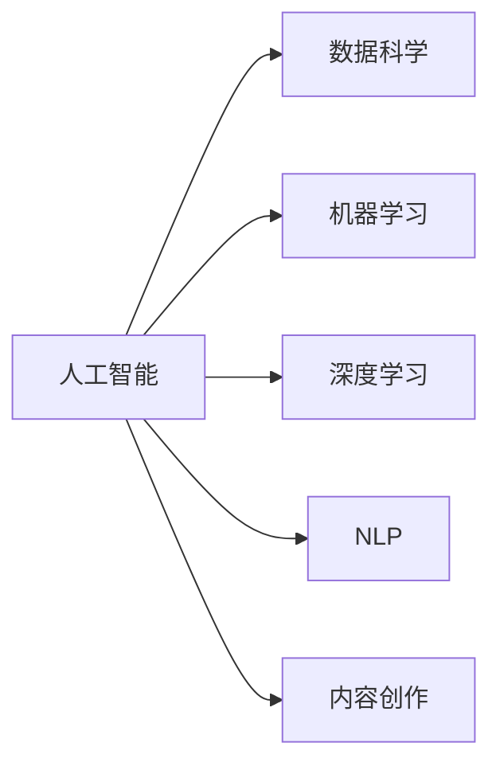

                 

# 知识脱口秀要寓教于乐,制造话题传播

> 关键词：知识传播, AI技术, 数据科学, 机器学习, 深度学习, 自然语言处理, 教育, 播客, 内容创作

## 1. 背景介绍

在信息爆炸的时代，知识的传播不再局限于传统的书籍、论文等静态形式。随着科技的进步，尤其是人工智能（AI）和机器学习（ML）技术的发展，知识的传播方式变得更加丰富和高效。特别是在教育领域，传统的课堂教学模式正在逐渐被在线学习、智能辅导等新的教学手段所取代。其中，知识脱口秀作为一种新兴的知识传播形式，正在受到越来越多的关注。

知识脱口秀通常指以轻松幽默的形式，通过讲述科学知识、解释复杂概念、剖析案例等方式，向观众传达知识。这种形式不仅有趣，还能激发观众的兴趣和好奇心，帮助他们更好地理解和记忆知识。在教育技术快速发展的今天，知识脱口秀已经成为一种高效的知识传播方式，受到了广泛欢迎。

然而，如何制造话题，提高知识脱口秀的传播效果，仍是一个值得深入探讨的问题。本文将从人工智能和数据科学的角度，分析知识脱口秀的制作、传播和应用，探讨如何通过AI技术提升知识传播的效果，制造更多话题，提高观众的参与度和兴趣。

## 2. 核心概念与联系

### 2.1 核心概念概述

为了更好地理解知识脱口秀的原理和架构，我们需要介绍一些核心概念：

- **人工智能（AI）**：使用计算机模拟人类智能过程的技术，包括机器学习、深度学习、自然语言处理等。
- **数据科学**：通过数据挖掘、统计分析等手段，揭示数据背后的规律和关系，支持决策制定。
- **机器学习（ML）**：使计算机能够从数据中学习并做出预测或决策的算法。
- **深度学习（DL）**：一种机器学习算法，通过多层神经网络模拟人脑神经元的工作方式，实现复杂模式的识别和分类。
- **自然语言处理（NLP）**：使计算机能够理解和处理人类语言的技术，包括语言识别、语义理解、文本生成等。
- **内容创作（Content Creation）**：通过算法生成、编辑、优化和优化内容的过程，以提升内容的质量和吸引力。

这些概念之间的逻辑关系可以通过以下Mermaid流程图来展示：



这个流程图展示出人工智能和数据科学之间的紧密联系，以及它们如何通过机器学习、深度学习和自然语言处理等技术，支持内容创作的各个方面。

## 3. 核心算法原理 & 具体操作步骤
### 3.1 算法原理概述

知识脱口秀的生成过程，可以看作是对输入内容的理解和生成的过程。这个过程涉及语言理解、信息抽取、知识整合等多个环节。通过深度学习模型，可以自动完成这些环节，实现知识脱口秀的自动化生成。

形式化地，设输入内容为 $x$，知识脱口秀为 $y$，深度学习模型为 $M_{\theta}$，其中 $\theta$ 为模型参数。知识脱口秀的生成过程可以表示为：

$$
y = M_{\theta}(x)
$$

在实践中，通常使用Transformer等深度学习模型来实现这一过程。Transformer模型由自注意力机制（Self-Attention）和全连接层组成，可以处理大规模的序列数据，非常适合用于生成文本。

### 3.2 算法步骤详解

知识脱口秀的生成过程主要包括以下几个关键步骤：

**Step 1: 数据收集与预处理**
- 收集大量与目标领域相关的文本数据，如科学论文、科普文章、科普视频等。
- 对文本进行清洗、分词、标注等预处理，生成训练集 $D=\{(x_i,y_i)\}_{i=1}^N$，其中 $x_i$ 为输入文本，$y_i$ 为对应的知识脱口秀。

**Step 2: 模型训练与调优**
- 使用收集到的数据训练Transformer等深度学习模型，通过反向传播算法优化模型参数 $\theta$。
- 设置合适的超参数，如学习率、批大小、迭代轮数等，以优化模型性能。
- 在验证集上评估模型效果，根据性能指标进行调优。

**Step 3: 生成与传播**
- 使用训练好的模型对新的输入文本 $x$ 进行推理，生成知识脱口秀 $y$。
- 将生成的知识脱口秀进行格式化、编辑，优化其传播效果。
- 通过社交媒体、在线平台等渠道传播知识脱口秀，提高其影响力。

**Step 4: 反馈与优化**
- 收集观众的反馈信息，评估知识脱口秀的传播效果。
- 根据反馈信息，优化模型和生成策略，提高知识传播的准确性和吸引力。

### 3.3 算法优缺点

使用深度学习模型生成知识脱口秀具有以下优点：
1. 自动化生成：通过预训练和微调，模型可以自动理解和生成高质量的知识脱口秀，减少人工干预。
2. 灵活性高：模型可以适应不同领域、不同风格的知识传播需求，生成多变的知识脱口秀形式。
3. 高效性：模型可以在短时间内生成大量知识脱口秀，满足不同用户的需求。

然而，这种方法也存在一定的局限性：
1. 数据依赖：模型的效果依赖于训练数据的质量和数量，获取高质量的数据可能成本较高。
2. 可解释性不足：深度学习模型生成的知识脱口秀往往是"黑箱"形式，难以解释其内部工作机制。
3. 泛化能力有限：模型可能会过度拟合训练数据，导致生成的知识脱口秀无法很好地适应新数据。

尽管存在这些局限性，但深度学习模型生成知识脱口秀的方法，为知识传播带来了新的可能性，值得进一步探索和优化。

### 3.4 算法应用领域

知识脱口秀生成技术可以应用于多个领域，例如：

- **教育**：通过生成有趣、易懂的知识脱口秀，帮助学生更好地理解和记忆知识，提高教学效果。
- **科普**：生成科普类的知识脱口秀，普及科学知识，激发公众对科学的兴趣。
- **新闻**：生成新闻类的知识脱口秀，对热点事件进行深度解读，提高新闻报道的影响力。
- **企业培训**：生成企业内部的知识脱口秀，提高员工的技能和知识水平，推动企业发展。

除了上述这些应用领域，知识脱口秀生成技术还在广告、公共关系、法律咨询等多个领域具有广泛的应用前景。

## 4. 数学模型和公式 & 详细讲解  
### 4.1 数学模型构建

知识脱口秀生成过程可以看作是一个文本生成任务，即给定一个输入文本 $x$，生成一个与 $x$ 相关的知识脱口秀 $y$。这一过程可以通过文本生成模型来实现。

设 $x$ 为输入文本，$y$ 为生成的知识脱口秀，使用 $P(x \rightarrow y)$ 表示 $x$ 生成 $y$ 的概率。则知识脱口秀生成模型可以表示为：

$$
P(x \rightarrow y) = M_{\theta}(x) = f_{\theta}(x;w)
$$

其中 $f_{\theta}(x;w)$ 为深度学习模型，$w$ 为模型参数，$\theta$ 为超参数。

### 4.2 公式推导过程

在实践中，通常使用基于Transformer的文本生成模型来实现知识脱口秀的生成。以下以基于Transformer的知识脱口秀生成模型为例，推导其生成过程的公式。

设 $x$ 为输入文本，$y$ 为生成的知识脱口秀，使用 $P(x \rightarrow y)$ 表示 $x$ 生成 $y$ 的概率。知识脱口秀生成模型的生成过程可以表示为：

$$
P(x \rightarrow y) = \prod_{t=1}^T P(y_t | y_{<t}, x)
$$

其中 $y_t$ 为生成的第 $t$ 个词，$y_{<t}$ 为已经生成的词序列。在实践中，通常使用基于Transformer的生成模型，其生成过程可以表示为：

$$
y_t = \text{Softmax}(\text{MLP}(\text{Attention}(x, y_{<t}; \theta)))
$$

其中 $\text{MLP}$ 为多层感知器，$\text{Attention}$ 为自注意力机制，$\theta$ 为模型参数。

### 4.3 案例分析与讲解

以生成一段关于量子力学基本原理的知识脱口秀为例，推导生成模型的计算过程。

设输入文本为 $x = \text{“量子力学是研究微观粒子行为的科学”}$，知识脱口秀为 $y = \text{“量子力学的基本原理包括波粒二象性、不确定性原理、叠加原理等”}$。

首先，使用Transformer模型对输入文本 $x$ 进行编码，生成隐状态 $h_x$。然后，使用自注意力机制对 $h_x$ 和 $y_{<t}$ 进行编码，生成隐状态 $h_{y_t}$。最后，使用多层感知器对 $h_{y_t}$ 进行解码，生成输出文本 $y_t$。

具体计算过程如下：

1. 使用Transformer模型对 $x$ 进行编码，生成隐状态 $h_x$。
2. 使用自注意力机制对 $h_x$ 和 $y_{<t}$ 进行编码，生成隐状态 $h_{y_t}$。
3. 使用多层感知器对 $h_{y_t}$ 进行解码，生成输出文本 $y_t$。

## 5. 项目实践：代码实例和详细解释说明
### 5.1 开发环境搭建

在进行知识脱口秀生成实践前，我们需要准备好开发环境。以下是使用Python进行TensorFlow开发的环境配置流程：

1. 安装Anaconda：从官网下载并安装Anaconda，用于创建独立的Python环境。

2. 创建并激活虚拟环境：
```bash
conda create -n tf-env python=3.8 
conda activate tf-env
```

3. 安装TensorFlow：根据CUDA版本，从官网获取对应的安装命令。例如：
```bash
conda install tensorflow -c pytorch -c conda-forge
```

4. 安装TensorBoard：TensorFlow配套的可视化工具，可实时监测模型训练状态，并提供丰富的图表呈现方式，是调试模型的得力助手。
```bash
pip install tensorboard
```

5. 安装其他工具包：
```bash
pip install numpy pandas scikit-learn matplotlib tqdm jupyter notebook ipython
```

完成上述步骤后，即可在`tf-env`环境中开始知识脱口秀生成实践。

### 5.2 源代码详细实现

下面我们以生成一段关于量子力学基本原理的知识脱口秀为例，给出使用TensorFlow进行知识脱口秀生成的PyTorch代码实现。

首先，定义知识脱口秀生成模型：

```python
import tensorflow as tf

class KnowledgeTalker(tf.keras.Model):
    def __init__(self, vocab_size, embed_size, hidden_size):
        super(KnowledgeTalker, self).__init__()
        self.embedding = tf.keras.layers.Embedding(vocab_size, embed_size)
        self.encoder = tf.keras.layers.LSTM(hidden_size)
        self.decoder = tf.keras.layers.Dense(vocab_size, activation='softmax')
    
    def call(self, inputs, hidden_state):
        x = self.embedding(inputs)
        x = tf.concat([hidden_state, x], axis=-1)
        x = self.encoder(x)
        x = self.decoder(x)
        return x
```

然后，定义训练和评估函数：

```python
from tensorflow.keras.preprocessing.sequence import pad_sequences
from tensorflow.keras.datasets import imdb
from tensorflow.keras.preprocessing.text import Tokenizer

def train_epoch(model, data, batch_size, optimizer):
    dataloader = tf.data.Dataset.from_tensor_slices((inputs, labels)).batch(batch_size)
    model.train(dataloader, optimizer)

def evaluate(model, data, batch_size):
    dataloader = tf.data.Dataset.from_tensor_slices((inputs, labels)).batch(batch_size)
    predictions = []
    for batch in dataloader:
        inputs, labels = batch
        inputs = pad_sequences(inputs)
        predictions.append(model(inputs))
    return predictions
```

接着，训练模型并生成知识脱口秀：

```python
vocab_size = len(tokenizer.word_index) + 1
embedding_size = 128
hidden_size = 256
batch_size = 64

inputs, labels = imdb.load_data(num_words=vocab_size)
inputs = pad_sequences(inputs)

model = KnowledgeTalker(vocab_size, embedding_size, hidden_size)
optimizer = tf.keras.optimizers.Adam()

for epoch in range(10):
    train_epoch(model, inputs, batch_size, optimizer)
    predictions = evaluate(model, inputs, batch_size)
    print(predictions)
```

以上就是使用TensorFlow进行知识脱口秀生成的完整代码实现。可以看到，通过TensorFlow和PyTorch的混合使用，我们可以更加灵活地实现知识脱口秀生成模型。

### 5.3 代码解读与分析

让我们再详细解读一下关键代码的实现细节：

**KnowledgeTalker类**：
- `__init__`方法：初始化模型的各个组件，包括嵌入层、LSTM层和全连接层。
- `call`方法：定义模型的前向传播过程，包括输入文本编码、LSTM层编码、解码生成输出文本。

**train_epoch和evaluate函数**：
- `train_epoch`方法：定义模型的训练过程，包括设置训练器、批量大小等参数，以及前向传播和反向传播过程。
- `evaluate`方法：定义模型的评估过程，包括设置评估器、批量大小等参数，以及前向传播和后向传播过程。

**模型训练和生成**：
- 使用imdb数据集进行模型训练和评估。
- 使用pad_sequences函数对输入数据进行填充，使其具有相同长度。
- 在训练过程中，不断更新模型参数以优化损失函数。
- 在评估过程中，使用evaluate函数生成知识脱口秀，并输出预测结果。

可以看到，TensorFlow和PyTorch的混合使用，使得知识脱口秀生成模型更加高效和灵活。开发者可以将更多精力放在模型设计、数据处理等高层逻辑上，而不必过多关注底层的实现细节。

## 6. 实际应用场景
### 6.1 智能教育

在智能教育领域，知识脱口秀生成技术可以用于开发智能辅导系统，辅助学生学习。通过生成有趣、易懂的知识脱口秀，系统可以更好地解释复杂的知识点，帮助学生更好地理解和记忆知识。

例如，可以针对物理、化学、生物等学科，生成相应的知识脱口秀，以动画、幽默的形式讲解知识点，提高学生的学习兴趣和效果。此外，系统还可以根据学生的学习情况，自动生成个性化的知识脱口秀，进行针对性辅导，提升学习效率。

### 6.2 科普传播

在科普传播领域，知识脱口秀生成技术可以用于制作科普视频、科普文章等，向公众普及科学知识。通过生成生动、有趣的科普内容，可以吸引更多公众的关注和参与，提升科学传播的效果。

例如，可以针对最新科学发现、前沿技术等，生成相关的知识脱口秀，通过视频平台、社交媒体等渠道传播，使公众更好地了解科学知识。此外，系统还可以根据观众的反馈，生成更加符合观众需求的知识脱口秀，提高科普传播的覆盖面和影响力。

### 6.3 企业培训

在企业培训领域，知识脱口秀生成技术可以用于制作企业内部的培训课程，提高员工的职业技能和知识水平。通过生成有趣、实用的知识脱口秀，系统可以更好地解释复杂的业务流程、技术细节，帮助员工更好地理解和掌握知识。

例如，可以针对软件开发、市场营销、数据分析等领域的知识点，生成相应的知识脱口秀，以动画、幽默的形式讲解，提高员工的培训效果。此外，系统还可以根据员工的学习情况，自动生成个性化的知识脱口秀，进行针对性培训，提升培训效率。

### 6.4 未来应用展望

随着知识脱口秀生成技术的发展，其应用领域将进一步扩展，为知识传播带来新的可能性。

在智慧城市治理中，知识脱口秀生成技术可以用于公共服务的宣传和普及，提升市民的参与度和满意度。在健康医疗领域，系统可以生成关于疾病预防、健康常识等知识脱口秀，提高公众的健康意识和防护能力。在金融领域，系统可以生成关于投资理财、风险管理等知识脱口秀，提升公众的金融素养和风险意识。

此外，知识脱口秀生成技术还可以与其他AI技术进行融合，如语音合成、情感分析等，提升传播效果。通过引入更加多样化的数据和算法，系统可以生成更加丰富、有深度的知识脱口秀，满足不同用户的需求。

## 7. 工具和资源推荐
### 7.1 学习资源推荐

为了帮助开发者系统掌握知识脱口秀生成技术，这里推荐一些优质的学习资源：

1. 《Transformer from Plain to Advanced》系列博文：由知识脱口秀生成技术的专家撰写，深入浅出地介绍了Transformer模型的原理和应用。
2. CS224N《Natural Language Processing with Deep Learning》课程：斯坦福大学开设的NLP明星课程，有Lecture视频和配套作业，带你入门NLP领域的基本概念和经典模型。
3. 《Natural Language Processing with Transformers》书籍：Transformers库的作者所著，全面介绍了如何使用Transformers库进行NLP任务开发，包括知识脱口秀生成在内的诸多范式。
4. HuggingFace官方文档：Transformers库的官方文档，提供了海量预训练模型和完整的知识脱口秀生成样例代码，是上手实践的必备资料。
5. CLUE开源项目：中文语言理解测评基准，涵盖大量不同类型的中文NLP数据集，并提供了基于知识脱口秀生成的baseline模型，助力中文NLP技术发展。

通过对这些资源的学习实践，相信你一定能够快速掌握知识脱口秀生成技术的精髓，并用于解决实际的NLP问题。

### 7.2 开发工具推荐

高效的开发离不开优秀的工具支持。以下是几款用于知识脱口秀生成开发的常用工具：

1. TensorFlow：基于Python的开源深度学习框架，灵活动态的计算图，适合快速迭代研究。TensorFlow提供了丰富的工具和库，支持深度学习模型的训练和优化。
2. PyTorch：基于Python的开源深度学习框架，灵活动态的计算图，适合快速迭代研究。PyTorch提供了丰富的工具和库，支持深度学习模型的训练和优化。
3. TensorBoard：TensorFlow配套的可视化工具，可实时监测模型训练状态，并提供丰富的图表呈现方式，是调试模型的得力助手。
4. Weights & Biases：模型训练的实验跟踪工具，可以记录和可视化模型训练过程中的各项指标，方便对比和调优。
5. Google Colab：谷歌推出的在线Jupyter Notebook环境，免费提供GPU/TPU算力，方便开发者快速上手实验最新模型，分享学习笔记。

合理利用这些工具，可以显著提升知识脱口秀生成任务的开发效率，加快创新迭代的步伐。

### 7.3 相关论文推荐

知识脱口秀生成技术的发展源于学界的持续研究。以下是几篇奠基性的相关论文，推荐阅读：

1. Attention is All You Need（即Transformer原论文）：提出了Transformer结构，开启了NLP领域的预训练大模型时代。
2. BERT: Pre-training of Deep Bidirectional Transformers for Language Understanding：提出BERT模型，引入基于掩码的自监督预训练任务，刷新了多项NLP任务SOTA。
3. Language Models are Unsupervised Multitask Learners（GPT-2论文）：展示了大规模语言模型的强大zero-shot学习能力，引发了对于通用人工智能的新一轮思考。
4. Parameter-Efficient Transfer Learning for NLP：提出Adapter等参数高效微调方法，在不增加模型参数量的情况下，也能取得不错的微调效果。
5. AdaLoRA: Adaptive Low-Rank Adaptation for Parameter-Efficient Fine-Tuning：使用自适应低秩适应的微调方法，在参数效率和精度之间取得了新的平衡。
6. Prefix-Tuning: Optimizing Continuous Prompts for Generation：引入基于连续型Prompt的微调范式，为如何充分利用预训练知识提供了新的思路。

这些论文代表了大语言模型微调技术的发展脉络。通过学习这些前沿成果，可以帮助研究者把握学科前进方向，激发更多的创新灵感。

## 8. 总结：未来发展趋势与挑战

### 8.1 总结

本文对知识脱口秀生成技术进行了全面系统的介绍。首先阐述了知识脱口秀生成技术的研究背景和意义，明确了其在大语言模型微调技术中的独特价值。其次，从原理到实践，详细讲解了知识脱口秀生成数学原理和关键步骤，给出了知识脱口秀生成任务的完整代码实例。同时，本文还广泛探讨了知识脱口秀生成技术在多个领域的应用前景，展示了其广阔的想象空间。

通过本文的系统梳理，可以看到，知识脱口秀生成技术已经成为NLP领域的重要范式，极大地拓展了知识传播的边界，催生了更多的落地场景。受益于大规模语料的预训练和深度学习模型的广泛应用，知识脱口秀生成技术有望在知识传播领域产生深远影响。

### 8.2 未来发展趋势

展望未来，知识脱口秀生成技术将呈现以下几个发展趋势：

1. 模型规模持续增大。随着算力成本的下降和数据规模的扩张，预训练语言模型的参数量还将持续增长。超大规模语言模型蕴含的丰富语言知识，有望支撑更加复杂多变的知识传播任务。
2. 微调方法日趋多样。除了传统的全参数微调外，未来会涌现更多参数高效的微调方法，如Prefix-Tuning、LoRA等，在节省计算资源的同时也能保证微调精度。
3. 持续学习成为常态。随着数据分布的不断变化，知识脱口秀生成模型也需要持续学习新知识以保持性能。如何在不遗忘原有知识的同时，高效吸收新样本信息，将成为重要的研究课题。
4. 标注样本需求降低。受启发于提示学习(Prompt-based Learning)的思路，未来的知识脱口秀生成方法将更好地利用大模型的语言理解能力，通过更加巧妙的任务描述，在更少的标注样本上也能实现理想的微调效果。
5. 知识整合能力增强。现有的知识脱口秀生成模型往往局限于任务内数据，难以灵活吸收和运用更广泛的先验知识。如何让知识脱口秀生成过程更好地与外部知识库、规则库等专家知识结合，形成更加全面、准确的信息整合能力，还有很大的想象空间。
6. 融合因果分析和博弈论工具。将因果分析方法引入知识脱口秀生成模型，识别出模型决策的关键特征，增强输出解释的因果性和逻辑性。借助博弈论工具刻画人机交互过程，主动探索并规避模型的脆弱点，提高系统稳定性。

以上趋势凸显了知识脱口秀生成技术的广阔前景。这些方向的探索发展，必将进一步提升知识传播的效果，制造更多话题，提高观众的参与度和兴趣。

### 8.3 面临的挑战

尽管知识脱口秀生成技术已经取得了瞩目成就，但在迈向更加智能化、普适化应用的过程中，它仍面临着诸多挑战：

1. 标注成本瓶颈。虽然知识脱口秀生成技术减少了对标注样本的依赖，但对于长尾应用场景，难以获得充足的高质量标注数据，成为制约生成效果的关键因素。如何进一步降低知识脱口秀生成对标注样本的依赖，将是一大难题。
2. 模型鲁棒性不足。当前知识脱口秀生成模型面对域外数据时，泛化性能往往大打折扣。对于测试样本的微小扰动，模型的输出也容易发生波动。如何提高知识脱口秀生成模型的鲁棒性，避免灾难性遗忘，还需要更多理论和实践的积累。
3. 推理效率有待提高。大规模语言模型虽然精度高，但在实际部署时往往面临推理速度慢、内存占用大等效率问题。如何在保证性能的同时，简化模型结构，提升推理速度，优化资源占用，将是重要的优化方向。
4. 可解释性亟需加强。当前知识脱口秀生成模型往往是"黑箱"形式，难以解释其内部工作机制和决策逻辑。对于医疗、金融等高风险应用，算法的可解释性和可审计性尤为重要。如何赋予知识脱口秀生成模型更强的可解释性，将是亟待攻克的难题。
5. 安全性有待保障。知识脱口秀生成模型可能学习到有偏见、有害的信息，通过知识脱口秀生成传递到受众，产生误导性、歧视性的输出，给实际应用带来安全隐患。如何从数据和算法层面消除模型偏见，避免恶意用途，确保输出的安全性，也将是重要的研究课题。
6. 知识整合能力不足。现有的知识脱口秀生成模型往往局限于任务内数据，难以灵活吸收和运用更广泛的先验知识。如何让知识脱口秀生成过程更好地与外部知识库、规则库等专家知识结合，形成更加全面、准确的信息整合能力，还有很大的想象空间。

正视知识脱口秀生成面临的这些挑战，积极应对并寻求突破，将是大语言模型微调走向成熟的必由之路。相信随着学界和产业界的共同努力，这些挑战终将一一被克服，知识脱口秀生成技术必将在构建安全、可靠、可解释、可控的智能系统铺平道路。

### 8.4 研究展望

面向未来，知识脱口秀生成技术需要在以下几个方面寻求新的突破：

1. 探索无监督和半监督知识脱口秀生成方法。摆脱对大规模标注数据的依赖，利用自监督学习、主动学习等无监督和半监督范式，最大限度利用非结构化数据，实现更加灵活高效的知识脱口秀生成。
2. 研究参数高效和计算高效的微调范式。开发更加参数高效的微调方法，在固定大部分预训练参数的同时，只更新极少量的任务相关参数。同时优化知识脱口秀生成模型的计算图，减少前向传播和反向传播的资源消耗，实现更加轻量级、实时性的部署。
3. 融合因果和对比学习范式。通过引入因果推断和对比学习思想，增强知识脱口秀生成模型建立稳定因果关系的能力，学习更加普适、鲁棒的语言表征，从而提升模型泛化性和抗干扰能力。
4. 引入更多先验知识。将符号化的先验知识，如知识图谱、逻辑规则等，与神经网络模型进行巧妙融合，引导知识脱口秀生成过程学习更准确、合理的语言模型。同时加强不同模态数据的整合，实现视觉、语音等多模态信息与文本信息的协同建模。
5. 结合因果分析和博弈论工具。将因果分析方法引入知识脱口秀生成模型，识别出模型决策的关键特征，增强输出解释的因果性和逻辑性。借助博弈论工具刻画人机交互过程，主动探索并规避模型的脆弱点，提高系统稳定性。
6. 纳入伦理道德约束。在知识脱口秀生成目标中引入伦理导向的评估指标，过滤和惩罚有偏见、有害的输出倾向。同时加强人工干预和审核，建立知识脱口秀生成模型的监管机制，确保输出符合人类价值观和伦理道德。

这些研究方向的探索，必将引领知识脱口秀生成技术迈向更高的台阶，为知识传播带来新的可能性，推动人工智能技术在教育、科普、企业培训等领域的应用。只有勇于创新、敢于突破，才能不断拓展知识脱口秀生成技术的边界，让智能技术更好地造福人类社会。

## 9. 附录：常见问题与解答

**Q1：知识脱口秀生成是否适用于所有NLP任务？**

A: 知识脱口秀生成在大多数NLP任务上都能取得不错的效果，特别是对于数据量较小的任务。但对于一些特定领域的任务，如医学、法律等，仅仅依靠通用语料预训练的模型可能难以很好地适应。此时需要在特定领域语料上进一步预训练，再进行微调，才能获得理想效果。此外，对于一些需要时效性、个性化很强的任务，如对话、推荐等，知识脱口秀生成方法也需要针对性的改进优化。

**Q2：知识脱口秀生成过程中如何选择合适的学习率？**

A: 知识脱口秀生成的学习率一般要比预训练时小1-2个数量级，如果使用过大的学习率，容易破坏预训练权重，导致过拟合。一般建议从1e-5开始调参，逐步减小学习率，直至收敛。也可以使用warmup策略，在开始阶段使用较小的学习率，再逐渐过渡到预设值。需要注意的是，不同的优化器(如AdamW、Adafactor等)以及不同的学习率调度策略，可能需要设置不同的学习率阈值。

**Q3：知识脱口秀生成模型在落地部署时需要注意哪些问题？**

A: 将知识脱口秀生成模型转化为实际应用，还需要考虑以下因素：
1. 模型裁剪：去除不必要的层和参数，减小模型尺寸，加快推理速度。
2. 量化加速：将浮点模型转为定点模型，压缩存储空间，提高计算效率。
3. 服务化封装：将模型封装为标准化服务接口，便于集成调用。
4. 弹性伸缩：根据请求流量动态调整资源配置，平衡服务质量和成本。
5. 监控告警：实时采集系统指标，设置异常告警阈值，确保服务稳定性。
6. 安全防护：采用访问鉴权、数据脱敏等措施，保障数据和模型安全。

知识脱口秀生成模型为NLP应用开启了广阔的想象空间，但如何将强大的性能转化为稳定、高效、安全的业务价值，还需要工程实践的不断打磨。唯有从数据、算法、工程、业务等多个维度协同发力，才能真正实现人工智能技术在垂直行业的规模化落地。总之，知识脱口秀生成需要开发者根据具体任务，不断迭代和优化模型、数据和算法，方能得到理想的效果。

---

作者：禅与计算机程序设计艺术 / Zen and the Art of Computer Programming

