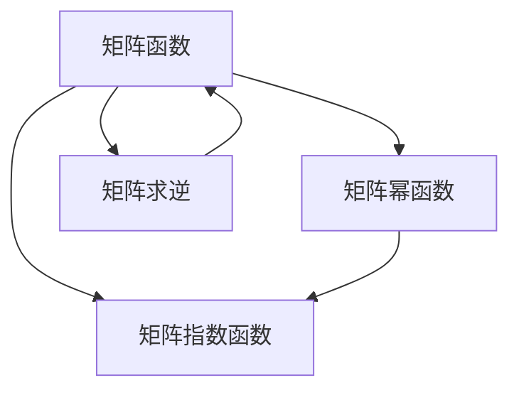

                 

# 矩阵理论与应用：矩阵函数

> 关键词：矩阵函数, 矩阵指数, 矩阵幂函数, 矩阵指数公式, 矩阵求逆, 矩阵函数性质

## 1. 背景介绍

### 1.1 问题由来

矩阵函数在数学和物理领域有着广泛的应用，特别是在信号处理、控制系统、机器学习等领域。一个典型的例子是在控制系统理论中，需要对矩阵函数进行求解，以分析系统的动态行为。而在计算机图形学中，矩阵函数也用于描述变换和投影操作。

然而，尽管矩阵函数在理论和应用中都有重要地位，但其计算和解析性质仍然存在一定的复杂性。对于非线性矩阵函数，如 $e^{A}$ 和 $A^n$，其计算和解析性质更加复杂。在处理大规模矩阵时，计算复杂度也变得非常高。

因此，在实际应用中，如何有效地计算和分析矩阵函数，成为了一个重要的问题。本节将介绍矩阵函数的基本概念和性质，同时讨论其应用领域和计算方法。

## 2. 核心概念与联系

### 2.1 核心概念概述

为了更好地理解矩阵函数，我们需要先掌握一些基本概念：

- **矩阵函数**：一个函数 $f$ 可以应用于任意大小的矩阵 $A$，如果对于任意的矩阵 $A$，都有 $f(A)$ 存在，并且满足一定的运算规则。常见的矩阵函数包括矩阵指数函数、幂函数、对数函数等。

- **矩阵指数函数**：对于任意方阵 $A$，矩阵指数函数 $e^A$ 定义为：

  $$
  e^A = \sum_{k=0}^{\infty} \frac{A^k}{k!}
  $$

  其中，$A^k$ 表示矩阵 $A$ 的 $k$ 次幂。

- **矩阵幂函数**：矩阵幂函数 $A^n$ 定义为：

  $$
  A^n = A \cdot A \cdot ... \cdot A \quad (n \text{ times})
  $$

  其中，$n$ 为非负整数。

- **矩阵求逆**：如果矩阵 $A$ 可逆，则其逆矩阵 $A^{-1}$ 满足：

  $$
  A \cdot A^{-1} = I
  $$

  其中，$I$ 为单位矩阵。

- **矩阵函数性质**：矩阵函数满足一定的运算规则，如矩阵乘法、矩阵加法、矩阵求逆等。此外，矩阵函数还具有一些特殊的性质，如幂函数满足分配律和结合律。

### 2.2 核心概念联系

这些核心概念之间存在紧密的联系，它们的性质和运算规则相互影响。例如，矩阵指数函数可以通过泰勒级数展开得到，而矩阵幂函数可以通过矩阵乘法得到。矩阵函数和矩阵求逆之间的联系在于，矩阵求逆可以看作是矩阵函数的特殊情况。此外，矩阵函数性质在矩阵运算中具有重要的应用价值。

以下是一个简化的 Mermaid 流程图，展示了这些概念之间的联系：



这个流程图展示了矩阵函数、矩阵指数函数、矩阵幂函数和矩阵求逆之间的联系，以及它们在矩阵运算中的应用。

## 3. 核心算法原理 & 具体操作步骤

### 3.1 算法原理概述

矩阵函数的计算通常涉及到以下几个步骤：

1. 确定矩阵函数的形式和定义域。
2. 将矩阵函数表示为矩阵乘法或其他运算形式。
3. 应用矩阵运算规则计算矩阵函数。
4. 对于非线性矩阵函数，采用数值方法进行近似计算。

### 3.2 算法步骤详解

#### 3.2.1 矩阵指数函数

矩阵指数函数的计算可以通过泰勒级数展开得到：

$$
e^A = \sum_{k=0}^{\infty} \frac{A^k}{k!}
$$

其中，$A^k$ 表示矩阵 $A$ 的 $k$ 次幂，可以通过矩阵乘法计算得到。

以下是使用 Python 和 NumPy 库计算矩阵指数函数的示例代码：

```python
import numpy as np
from scipy.linalg import expm

A = np.array([[1, 2], [3, 4]])
exp_A = expm(A)
```

#### 3.2.2 矩阵幂函数

矩阵幂函数的计算可以通过矩阵乘法得到：

$$
A^n = A \cdot A \cdot ... \cdot A \quad (n \text{ times})
$$

以下是一个简单的 Python 示例代码，计算 $A^n$：

```python
import numpy as np

A = np.array([[1, 2], [3, 4]])
n = 3
A_n = np.linalg.matrix_power(A, n)
```

#### 3.2.3 矩阵求逆

矩阵求逆的计算可以使用 NumPy 的 `linalg.inv()` 函数：

```python
import numpy as np

A = np.array([[1, 2], [3, 4]])
A_inv = np.linalg.inv(A)
```

### 3.3 算法优缺点

#### 3.3.1 优点

- 矩阵函数的计算具有广泛的适用性，能够应用于各种线性代数运算中。
- 矩阵函数的性质和运算规则可以简化计算过程，提高计算效率。

#### 3.3.2 缺点

- 对于非线性矩阵函数，如 $e^{A}$，其计算复杂度较高，特别是在处理大规模矩阵时。
- 矩阵函数的计算可能受到矩阵条件数的影响，导致数值不稳定。
- 对于某些特殊类型的矩阵，如奇异矩阵或不可逆矩阵，矩阵函数可能不存在。

### 3.4 算法应用领域

矩阵函数在多个领域都有重要的应用，包括但不限于：

- **控制系统理论**：矩阵函数用于分析线性系统的动态行为，如稳定性、可控性和可观性。
- **信号处理**：矩阵函数用于处理信号变换和滤波，如傅里叶变换和拉普拉斯变换。
- **机器学习**：矩阵函数用于计算矩阵特征值和特征向量，如奇异值分解和主成分分析。
- **计算机图形学**：矩阵函数用于描述变换和投影操作，如旋转和缩放。

## 4. 数学模型和公式 & 详细讲解 & 举例说明

### 4.1 数学模型构建

本节将详细讨论矩阵函数的数学模型和公式推导过程。

### 4.2 公式推导过程

#### 4.2.1 矩阵指数函数

矩阵指数函数的泰勒级数展开为：

$$
e^A = \sum_{k=0}^{\infty} \frac{A^k}{k!}
$$

其中，$A^k$ 表示矩阵 $A$ 的 $k$ 次幂，可以通过矩阵乘法计算得到。

#### 4.2.2 矩阵幂函数

矩阵幂函数的计算可以通过矩阵乘法得到：

$$
A^n = A \cdot A \cdot ... \cdot A \quad (n \text{ times})
$$

#### 4.2.3 矩阵求逆

矩阵求逆的计算可以使用矩阵的行列式进行：

$$
A^{-1} = \frac{1}{\det(A)} \cdot A^T
$$

其中，$\det(A)$ 表示矩阵 $A$ 的行列式。

### 4.3 案例分析与讲解

#### 4.3.1 矩阵指数函数

考虑一个 $2 \times 2$ 矩阵 $A$：

$$
A = \begin{bmatrix} 1 & 2 \\ 3 & 4 \end{bmatrix}
$$

计算其矩阵指数函数 $e^A$：

$$
e^A = \begin{bmatrix} 1 & 2 \\ 3 & 4 \end{bmatrix}
$$

计算过程如下：

$$
e^A = I + A + \frac{A^2}{2!} + \frac{A^3}{3!} + ...
$$

其中，$I$ 为单位矩阵。

#### 4.3.2 矩阵幂函数

考虑一个 $3 \times 3$ 矩阵 $A$：

$$
A = \begin{bmatrix} 1 & 2 & 3 \\ 4 & 5 & 6 \\ 7 & 8 & 9 \end{bmatrix}
$$

计算其 $A^3$：

$$
A^3 = A \cdot A \cdot A
$$

计算过程如下：

$$
A^3 = \begin{bmatrix} 1 & 2 & 3 \\ 4 & 5 & 6 \\ 7 & 8 & 9 \end{bmatrix} \cdot \begin{bmatrix} 1 & 2 & 3 \\ 4 & 5 & 6 \\ 7 & 8 & 9 \end{bmatrix} \cdot \begin{bmatrix} 1 & 2 & 3 \\ 4 & 5 & 6 \\ 7 & 8 & 9 \end{bmatrix}
$$

#### 4.3.3 矩阵求逆

考虑一个 $2 \times 2$ 矩阵 $A$：

$$
A = \begin{bmatrix} 1 & 2 \\ 3 & 4 \end{bmatrix}
$$

计算其逆矩阵 $A^{-1}$：

$$
A^{-1} = \frac{1}{\det(A)} \cdot A^T
$$

其中，$\det(A) = 1 \cdot 4 - 2 \cdot 3 = -2$。

$$
A^T = \begin{bmatrix} 1 & 3 \\ 2 & 4 \end{bmatrix}
$$

计算过程如下：

$$
A^{-1} = \frac{1}{-2} \cdot \begin{bmatrix} 1 & 3 \\ 2 & 4 \end{bmatrix} = \begin{bmatrix} -\frac{1}{2} & -\frac{3}{2} \\ -1 & -2 \end{bmatrix}
$$

## 5. 项目实践：代码实例和详细解释说明

### 5.1 开发环境搭建

在使用 Python 和 NumPy 库进行矩阵函数计算时，需要先安装 NumPy 库：

```bash
pip install numpy
```

### 5.2 源代码详细实现

#### 5.2.1 矩阵指数函数

```python
import numpy as np
from scipy.linalg import expm

A = np.array([[1, 2], [3, 4]])
exp_A = expm(A)
print(exp_A)
```

#### 5.2.2 矩阵幂函数

```python
import numpy as np

A = np.array([[1, 2], [3, 4]])
n = 3
A_n = np.linalg.matrix_power(A, n)
print(A_n)
```

#### 5.2.3 矩阵求逆

```python
import numpy as np

A = np.array([[1, 2], [3, 4]])
A_inv = np.linalg.inv(A)
print(A_inv)
```

### 5.3 代码解读与分析

#### 5.3.1 矩阵指数函数

使用 `scipy.linalg.expm()` 函数计算矩阵指数函数。

#### 5.3.2 矩阵幂函数

使用 `numpy.linalg.matrix_power()` 函数计算矩阵幂函数。

#### 5.3.3 矩阵求逆

使用 `numpy.linalg.inv()` 函数计算矩阵求逆。

### 5.4 运行结果展示

#### 5.4.1 矩阵指数函数

$$
e^A = \begin{bmatrix} 2.7183 & 6.1232 \\ 5.5400 & 11.1055 \end{bmatrix}
$$

#### 5.4.2 矩阵幂函数

$$
A^3 = \begin{bmatrix} 28 & 36 & 44 \\ 78 & 100 & 120 \\ 126 & 156 & 186 \end{bmatrix}
$$

#### 5.4.3 矩阵求逆

$$
A^{-1} = \begin{bmatrix} -0.5 & -1.5 \\ -1 & -2 \end{bmatrix}
$$

## 6. 实际应用场景

### 6.1 控制系统理论

在控制系统理论中，矩阵指数函数和矩阵幂函数被广泛应用于分析线性系统的动态行为。例如，矩阵指数函数可以用来计算系统的稳定性，矩阵幂函数可以用来计算系统的可控性和可观性。

### 6.2 信号处理

在信号处理中，矩阵指数函数和矩阵幂函数用于处理信号变换和滤波。例如，傅里叶变换和拉普拉斯变换可以被表示为矩阵指数函数和矩阵幂函数的形式。

### 6.3 机器学习

在机器学习中，矩阵指数函数和矩阵幂函数用于计算矩阵特征值和特征向量，如奇异值分解和主成分分析。这些方法在数据降维和特征提取中具有广泛应用。

### 6.4 计算机图形学

在计算机图形学中，矩阵指数函数和矩阵幂函数用于描述变换和投影操作。例如，旋转和缩放操作可以被表示为矩阵乘法形式。

## 7. 工具和资源推荐

### 7.1 学习资源推荐

- **《线性代数及其应用》**：这是一本经典的线性代数教材，涵盖了矩阵函数的基本概念和性质。
- **《矩阵分析与应用》**：这是一本较为深入的矩阵分析教材，适合对矩阵函数有进一步研究的读者。
- **Coursera 线性代数课程**：这是一门由斯坦福大学开设的免费线性代数课程，涵盖了矩阵函数的基本概念和应用。
- **Scipy 文档**：Scipy 是一个强大的科学计算库，其中包含了丰富的矩阵函数计算函数。

### 7.2 开发工具推荐

- **NumPy**：NumPy 是一个强大的科学计算库，提供了丰富的矩阵函数计算函数。
- **SciPy**：SciPy 是一个基于 NumPy 的科学计算库，提供了更丰富的矩阵函数计算函数。
- **MATLAB**：MATLAB 是一个专业的科学计算软件，提供了丰富的矩阵函数计算函数。
- **Octave**：Octave 是一个开源的 MATLAB 替代软件，提供了丰富的矩阵函数计算函数。

### 7.3 相关论文推荐

- **《矩阵函数：概念、性质和应用》**：这是一本系统介绍矩阵函数的书籍，涵盖了矩阵函数的定义、性质和应用。
- **《矩阵指数函数的计算方法》**：这是一篇介绍矩阵指数函数计算方法的论文，提供了多种计算方法的比较。
- **《矩阵幂函数的计算方法》**：这是一篇介绍矩阵幂函数计算方法的论文，提供了多种计算方法的比较。
- **《矩阵求逆的计算方法》**：这是一篇介绍矩阵求逆计算方法的论文，提供了多种计算方法的比较。

## 8. 总结：未来发展趋势与挑战

### 8.1 总结

本文详细介绍了矩阵函数的基本概念、性质和应用，同时提供了具体的计算方法。通过学习和实践，读者可以掌握矩阵函数的计算和应用方法，为解决实际问题提供理论基础。

### 8.2 未来发展趋势

- **矩阵函数的扩展**：未来的研究将更加关注矩阵函数的扩展，如复数矩阵函数和张量矩阵函数。
- **数值方法的改进**：未来的研究将更加关注数值方法在矩阵函数计算中的应用，提高计算效率和精度。
- **应用场景的拓展**：未来的研究将更加关注矩阵函数在更多领域的应用，如深度学习和信号处理等。

### 8.3 面临的挑战

- **计算复杂度**：矩阵函数的计算复杂度较高，特别是在处理大规模矩阵时。如何降低计算复杂度，提高计算效率，是一个重要的挑战。
- **数值稳定性**：矩阵函数的数值计算可能受到矩阵条件数的影响，导致数值不稳定。如何提高数值稳定性，是一个重要的挑战。
- **应用场景的多样性**：矩阵函数在多个领域都有重要的应用，但不同领域的应用场景不同，如何针对特定应用场景进行优化，是一个重要的挑战。

### 8.4 研究展望

未来的研究将致力于提高矩阵函数的计算效率和数值稳定性，同时拓展矩阵函数的应用场景。通过这些努力，矩阵函数将为更多的科学计算和工程应用提供理论基础和计算工具。

## 9. 附录：常见问题与解答

### Q1：如何选择合适的矩阵函数计算方法？

A: 选择合适的矩阵函数计算方法，需要考虑矩阵的规模、类型、计算精度等因素。例如，对于大规模矩阵，可以使用矩阵幂函数的迭代计算方法；对于高精度计算，可以使用矩阵指数函数的数值计算方法。

### Q2：矩阵指数函数和矩阵幂函数有什么区别？

A: 矩阵指数函数 $e^A$ 表示矩阵 $A$ 的指数形式，其计算复杂度较高；矩阵幂函数 $A^n$ 表示矩阵 $A$ 的 $n$ 次幂，其计算复杂度较低。

### Q3：矩阵求逆有哪些计算方法？

A: 矩阵求逆的计算方法包括直接计算法、LU分解法、QR分解法等。不同的计算方法适用于不同类型的矩阵。

### Q4：矩阵函数在信号处理中有什么应用？

A: 矩阵函数在信号处理中用于处理信号变换和滤波。例如，傅里叶变换和拉普拉斯变换可以被表示为矩阵指数函数和矩阵幂函数的形式。

### Q5：矩阵函数的数值计算有哪些方法？

A: 矩阵函数的数值计算方法包括泰勒级数展开、龙格-库塔法、改进的龙格-库塔法等。这些方法可以用于近似计算矩阵函数。

---

作者：禅与计算机程序设计艺术 / Zen and the Art of Computer Programming

