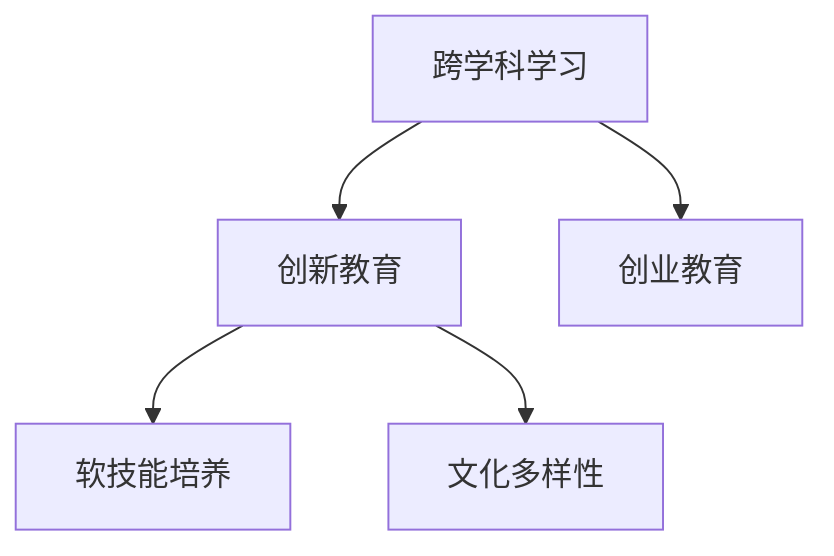

                 

# 硅谷的教育体系:培养创新人才

> 关键词：创新教育,人才培养,科技创业,硅谷经验

## 1. 背景介绍

### 1.1 问题由来
硅谷被誉为全球科技创新的中心，孕育了无数引领时代潮流的产品和公司，如Google、Apple、Facebook、特斯拉等。这一成功背后，除了人才、资金、技术等要素，硅谷的教育体系也扮演了关键角色。硅谷的教育体系不仅重视学术知识的传授，更注重创新能力的培养和创业精神的塑造，形成了独特的教育理念和实践模式。

### 1.2 问题核心关键点
硅谷的教育体系在培养创新人才方面具有以下几个核心关键点：

1. **跨学科教育**：鼓励学生跨学科学习，从工程、计算机、物理、艺术等多个领域汲取知识，培养综合型创新人才。
2. **项目导向学习**：重视实践经验，通过项目、实习、实验室等形式，让学生在真实场景中积累经验。
3. **创业教育**：提供丰富的创业资源和平台，鼓励学生创办科技初创公司，提供资金、导师、顾问等多方面的支持。
4. **人文素养培养**：注重培养学生的批判性思维、领导力、沟通能力等软技能，为未来的创新工作奠定坚实基础。
5. **文化多样性**：倡导开放包容的文化氛围，吸引全球各地人才，促进多元化的思维碰撞与创新。

这些关键点共同构建了硅谷教育体系的独特优势，成为培养创新人才的重要保障。

### 1.3 问题研究意义
研究硅谷的教育体系，对于探索全球创新人才培养模式，推动教育改革，具有重要意义：

1. **提供借鉴经验**：借鉴硅谷的教育成功经验，有助于国内教育体系在创新人才培养上取得突破。
2. **促进产业对接**：通过优化教育与产业的链接，提升教育对科技创新的贡献度。
3. **激发创新活力**：培养更多的创新人才，推动科技与经济的深度融合，促进社会整体创新能力的提升。
4. **提高国际竞争力**：借助多样化的教育资源，吸引国际高素质人才，提升国家的科技和教育国际影响力。

## 2. 核心概念与联系

### 2.1 核心概念概述

为更好地理解硅谷的教育体系，本节将介绍几个密切相关的核心概念：

- **创新教育**：注重培养学生的创新能力，通过跨学科学习、项目导向学习、实践体验等方式，激发学生的创新潜力。
- **创业教育**：提供丰富的创业资源，鼓励学生创办科技初创公司，帮助其在科技创业中快速成长。
- **跨学科学习**：鼓励学生跨越学科界限，从多个学科汲取知识，形成跨领域的知识体系。
- **软技能培养**：除了专业知识，注重培养学生的批判性思维、领导力、沟通能力等软技能，使其在未来工作中更具竞争力。
- **文化多样性**：倡导开放包容的教育文化，吸引全球各地人才，促进多元化的思维碰撞与创新。

这些核心概念之间的逻辑关系可以通过以下Mermaid流程图来展示：



这个流程图展示了几类教育模式之间的联系：

1. 跨学科学习为创新教育提供了知识基础。
2. 创业教育为学生提供了应用创新能力的实践机会。
3. 软技能培养确保了学生具备良好的协作与沟通能力。
4. 文化多样性促进了不同背景人才的交流与碰撞。

这些概念共同构成了硅谷教育体系的核心理念，使其能够在创新人才培养上取得卓越成效。

## 3. 核心算法原理 & 具体操作步骤
### 3.1 算法原理概述

硅谷的教育体系通过一系列教育模式和机制，培养创新人才。其核心思想是：

1. **跨学科融合**：将不同学科的知识和技术融合，培养学生跨学科的思维方式和解决问题的能力。
2. **项目驱动学习**：通过项目和实习，让学生在实践中学习，提升其动手能力和解决问题的能力。
3. **创业生态支持**：提供资金、导师、顾问、加速器等资源，支持学生创办科技初创公司，促进科技与经济结合。
4. **软技能培养**：通过案例分析、领导力训练、沟通技巧训练等方式，提升学生的软技能。
5. **文化包容性**：倡导多样性和包容性，吸引全球高素质人才，激发创新思维。

### 3.2 算法步骤详解

硅谷的教育体系培养创新人才，主要包括以下几个关键步骤：

**Step 1: 基础教育阶段**
- **跨学科课程设计**：在基础教育阶段，引入跨学科课程，如STEM、STEAM等，培养学生的综合能力和创新思维。
- **项目导向学习**：通过科学实验、工程项目、艺术创作等形式，让学生在实践中学习，培养其实践能力和问题解决能力。

**Step 2: 高等教育阶段**
- **跨学科合作教育**：鼓励学生参与多学科合作项目，如联合实验室、跨学科竞赛等，拓宽学生的知识视野。
- **创业孵化支持**：提供创业孵化器、加速器、资金支持等资源，帮助学生在创业中快速成长。

**Step 3: 社会实践阶段**
- **企业实习项目**：鼓励学生进入知名企业实习，积累工作经验，了解行业动态。
- **社会公益项目**：参与社区服务、志愿活动等，培养学生的社会责任感和领导力。

**Step 4: 持续学习与创新**
- **终身学习机制**：鼓励学生持续学习，通过在线课程、继续教育等方式，更新知识储备。
- **创新创业生态**：构建完善的风险投资、创业孵化、科技转化等生态系统，支持创新创业。

### 3.3 算法优缺点

硅谷的教育体系在培养创新人才方面具有以下优点：

1. **全面培养**：通过跨学科教育、项目导向学习、软技能培养等多种方式，培养学生的综合能力。
2. **资源丰富**：丰富的创业资源和平台支持，为学生提供良好的创业环境。
3. **实践导向**：注重实践经验，通过项目和实习等方式，提升学生的动手能力和解决问题的能力。
4. **文化包容**：多样性和包容性的文化氛围，吸引全球高素质人才，促进多元化的思维碰撞与创新。

同时，该体系也存在一些局限性：

1. **资源不均**：教育资源分布不均，部分学生可能无法获得充分的资源支持。
2. **高成本**：创业和教育的高成本，对家庭和个人经济压力较大。
3. **评估体系单一**：传统的学术评估体系可能无法全面反映学生的创新能力。

尽管存在这些局限性，但硅谷的教育体系在培养创新人才方面已取得显著成效，为全球科技创新的发展提供了重要的人才支持。

### 3.4 算法应用领域

硅谷的教育体系在多个领域得到了广泛应用，包括但不限于：

1. **科技创业**：通过创业教育，培养了大量优秀的科技创业人才，推动了高科技产业的发展。
2. **社会创新**：培养的学生不仅在科技领域有所作为，还积极参与社会公益事业，解决现实问题。
3. **文化艺术**：跨学科课程和创意教育培养了大量创新型艺术家和设计师，推动文化艺术的发展。
4. **教育改革**：硅谷的教育体系为全球教育改革提供了有益借鉴，促进了教育理念和实践的创新。

## 4. 数学模型和公式 & 详细讲解 & 举例说明

### 4.1 数学模型构建

本节将使用数学语言对硅谷教育体系的核心教育模式进行更严格的刻画。

记教育体系为 $E$，学生为 $S$，课程为 $C$，教师为 $T$。假设教育体系的目标是最大化学生的创新能力和创业成功率，可以建立如下数学模型：

$$
\maximize_{E} \sum_{S} \sum_{C} \sum_{T} \text{Innovation}(S, C, T)
$$

其中，$\text{Innovation}(S, C, T)$ 表示学生在课程 $C$ 上，在教师 $T$ 指导下，通过跨学科教育和项目导向学习，其创新能力和创业成功率的综合评价。

### 4.2 公式推导过程

为了量化学生的创新能力和创业成功率，可以将其分解为多个维度进行评估，如创新项目的数量、创业公司的成功率、技术专利的申请量等。假设 $F$ 为这些维度的综合评价函数，则目标函数可以改写为：

$$
\maximize_{E} \sum_{S} F(\text{Innovation}_\text{总数}(S))
$$

其中 $\text{Innovation}_\text{总数}(S)$ 表示学生 $S$ 在教育体系 $E$ 中，所参与的创新项目总数。

为了衡量学生的创新能力和创业成功率，可以引入以下指标：

1. **创新项目数量**：$\text{ProjectCount}(S)$
2. **创业成功率**：$\text{StartupSuccessRate}(S)$
3. **技术专利申请量**：$\text{PatentAppCount}(S)$

假设创新能力可以通过这些指标线性加权得到，则：

$$
\text{Innovation}_\text{总数}(S) = w_1 \cdot \text{ProjectCount}(S) + w_2 \cdot \text{StartupSuccessRate}(S) + w_3 \cdot \text{PatentAppCount}(S)
$$

其中 $w_1, w_2, w_3$ 为各指标的权重系数。

### 4.3 案例分析与讲解

以Google为例，其创始人之一Sergey Brin在大学期间即显示出卓越的创新能力。他参与的多项科研项目包括网页排名算法、网络搜索优化等，这些项目不仅奠定了其学术基础，也为后来创办Google提供了技术支持。

1. **学术研究**：Brin在大学期间发表了多篇关于互联网搜索和信息检索的论文，奠定了其在搜索引擎算法领域的权威地位。
2. **创业经历**：Brin在攻读博士期间，即与Larry Page一起创办了Google，开启了互联网搜索的新纪元。

Google的成功展示了硅谷教育体系在培养创新人才方面的显著成效。

## 5. 项目实践：代码实例和详细解释说明
### 5.1 开发环境搭建

在硅谷的教育体系中，注重实践和项目导向的学习方式，因此需要搭建适合项目实践的环境。以下是使用Python和Jupyter Notebook搭建实验环境的步骤：

1. 安装Anaconda：从官网下载并安装Anaconda，用于创建独立的Python环境。

2. 创建并激活虚拟环境：
```bash
conda create -n pyenv python=3.8 
conda activate pyenv
```

3. 安装Python科学计算库：
```bash
conda install numpy scipy pandas matplotlib
```

4. 安装Jupyter Notebook：
```bash
conda install jupyterlab
```

5. 下载Google Colab：
```bash
!pip install google.colab
```

完成上述步骤后，即可在`pyenv`环境中进行项目实践。

### 5.2 源代码详细实现

下面以项目导向学习为例，给出使用Python和Jupyter Notebook进行项目实践的代码实现。

```python
# 引入必要的库
import numpy as np
import pandas as pd
from sklearn.ensemble import RandomForestClassifier
from sklearn.model_selection import train_test_split
from sklearn.metrics import accuracy_score

# 创建虚拟数据集
X = np.random.rand(100, 4)
y = np.random.randint(0, 2, size=100)

# 数据预处理
X_train, X_test, y_train, y_test = train_test_split(X, y, test_size=0.2, random_state=42)

# 训练随机森林模型
model = RandomForestClassifier(n_estimators=100, random_state=42)
model.fit(X_train, y_train)

# 预测并评估模型
y_pred = model.predict(X_test)
accuracy = accuracy_score(y_test, y_pred)
print("Accuracy:", accuracy)
```

这段代码实现了随机森林模型的训练和评估。在实际项目中，学生可以通过类似的方式，使用真实的项目数据进行模型训练和评估，积累项目经验。

### 5.3 代码解读与分析

让我们再详细解读一下关键代码的实现细节：

**数据生成与预处理**：
- `np.random.rand(100, 4)`：生成100个4维随机数据点，用于模拟项目数据。
- `train_test_split(X, y, test_size=0.2, random_state=42)`：将数据集分为训练集和测试集，比例为80%训练、20%测试。

**模型训练**：
- `RandomForestClassifier(n_estimators=100, random_state=42)`：创建随机森林模型，设置参数。
- `model.fit(X_train, y_train)`：在训练集上训练模型。

**模型评估**：
- `y_pred = model.predict(X_test)`：在测试集上预测标签。
- `accuracy_score(y_test, y_pred)`：计算模型在测试集上的准确率。

通过上述代码，学生可以在Jupyter Notebook中模拟项目实践过程，理解模型的训练和评估方法，从而更好地应用于实际项目中。

## 6. 实际应用场景
### 6.1 科技创业

硅谷的教育体系在培养科技创业人才方面具有显著优势。通过创业教育，学生可以接触和体验创业的各个环节，积累创业经验，增强创业成功率。

### 6.2 社会创新

硅谷的教育体系不仅关注科技创业，还重视社会创新。学生在参与各类公益项目、社区服务中，培养社会责任感和创新能力，将科技力量应用于社会问题的解决。

### 6.3 教育改革

硅谷的教育体系为全球教育改革提供了有益借鉴。通过跨学科教育、项目导向学习等方式，推动教育理念和实践的创新，为未来教育的发展提供了方向。

## 7. 工具和资源推荐
### 7.1 学习资源推荐

为了帮助学生和教育者系统掌握硅谷的教育体系，这里推荐一些优质的学习资源：

1. 《硅谷: 科技创新中心》系列书籍：全面介绍硅谷的历史、文化和教育体系，提供深入的理论和实践指导。
2. CS229《机器学习》课程：斯坦福大学开设的机器学习经典课程，由Tomas Mitchell教授主讲，涵盖算法原理和实践应用。
3. Coursera《数据科学导论》课程：由John W. Boyd II等教授主讲，涵盖数据科学的基础知识和工具，适合科技创业者学习。
4. Kaggle数据竞赛平台：提供丰富的数据分析和机器学习竞赛，提升学生的实际动手能力。
5. GitHub开源社区：汇集了全球知名的开源项目，学生可以通过阅读和学习这些项目，积累实践经验。

通过这些资源的学习实践，学生可以全面了解硅谷的教育体系，掌握最新的科技创业知识和技能，为未来的创新工作奠定坚实基础。

### 7.2 开发工具推荐

硅谷的教育体系注重实践和项目导向学习，以下工具可以帮助学生和教育者高效开展项目实践：

1. Jupyter Notebook：支持Python、R、MATLAB等多种编程语言，适合科研和项目实践。
2. Google Colab：提供免费的GPU/TPU算力，适合深度学习和机器学习项目开发。
3. Visual Studio Code：功能强大的IDE，支持代码调试、版本控制和协作开发。
4. GitLab/GitHub：代码托管平台，支持团队协作和代码版本管理。
5. Docker：容器化技术，方便构建和部署复杂的开发环境。

这些工具为学生和教育者提供了便捷的开发环境，有助于提升项目实践的效率和质量。

### 7.3 相关论文推荐

硅谷的教育体系在培养创新人才方面取得了诸多成功案例，以下几篇论文提供了有价值的理论基础和实践指导：

1. "The Making of Silicon Valley" by Paula Bourke：探讨了硅谷的历史、文化和社会结构，为理解硅谷提供了背景信息。
2. "Teaching Silicon Valley: Innovative Pedagogy for High-Quality Education" by Robert L. Sanford：介绍了硅谷高校的教学方法和课程设计，提供了创新的教育实践。
3. "The Silicon Valley Model: The Ultimate Guide" by Julia Coss：全面介绍了硅谷的教育体系，提供了详尽的实践指南。
4. "The Ethical Implications of AI" by Mark Coeckelbergh：探讨了人工智能伦理问题，为科技创业者提供了道德和法律的指导。
5. "Human-AI Collaboration: Future Prospects and Ethical Considerations" by Anu Allen：分析了人机协作的未来趋势和伦理问题，为未来的科技创新提供了指导。

这些论文深入探讨了硅谷教育体系的各个方面，提供了丰富的理论和实践指导，为理解硅谷的教育体系提供了重要参考。

## 8. 总结：未来发展趋势与挑战
### 8.1 研究成果总结

硅谷的教育体系在培养创新人才方面取得了显著成效，主要表现在以下几个方面：

1. **跨学科教育**：通过跨学科课程和项目，培养学生的综合能力和创新思维。
2. **创业教育**：提供丰富的创业资源和平台，支持学生创办科技初创公司。
3. **项目导向学习**：注重实践经验，通过项目和实习等方式，提升学生的动手能力和解决问题的能力。
4. **软技能培养**：通过案例分析、领导力训练、沟通技巧训练等方式，提升学生的软技能。
5. **文化包容性**：倡导多样性和包容性，吸引全球高素质人才，促进多元化的思维碰撞与创新。

### 8.2 未来发展趋势

展望未来，硅谷的教育体系将呈现以下几个发展趋势：

1. **全球化扩展**：随着全球科技产业的崛起，硅谷的教育体系将进一步拓展到全球各地，推动全球科技创新。
2. **技术融合**：结合最新的人工智能、大数据、区块链等技术，提升教育质量和效率。
3. **个性化教育**：通过数据分析和智能推荐，为学生提供个性化的学习路径和资源。
4. **虚拟现实应用**：利用虚拟现实技术，提供沉浸式的学习体验，增强学生的实践能力。
5. **可持续发展**：关注环境和社会责任，推动可持续发展的教育理念和实践。

### 8.3 面临的挑战

尽管硅谷的教育体系在培养创新人才方面取得了显著成效，但也面临诸多挑战：

1. **资源不均**：教育资源分布不均，部分学生可能无法获得充分的资源支持。
2. **高成本**：创业和教育的高成本，对家庭和个人经济压力较大。
3. **评估体系单一**：传统的学术评估体系可能无法全面反映学生的创新能力。
4. **文化冲突**：多样性和包容性文化可能导致文化冲突和误解。
5. **技术变革**：快速的技术变革可能使教育体系难以跟上最新发展。

### 8.4 研究展望

面对硅谷教育体系所面临的挑战，未来的研究需要在以下几个方面寻求新的突破：

1. **教育资源均衡化**：通过政策和技术手段，缩小教育资源的不平等差距。
2. **成本控制**：探索低成本的教育模式，使更多学生能够获得优质教育资源。
3. **综合评估体系**：建立多元化的评估体系，全面反映学生的创新能力和综合素质。
4. **文化融合**：加强跨文化交流和合作，促进不同文化背景人才的融合与创新。
5. **技术创新**：结合最新的人工智能、大数据等技术，提升教育质量和效率。

这些研究方向的探索，将推动硅谷教育体系的不断完善和创新，为全球科技创新的发展提供重要的人才支持。

## 9. 附录：常见问题与解答

**Q1：硅谷的教育体系是否适用于其他地区？**

A: 硅谷的教育体系在某些方面具有普适性，但不同地区的教育环境和资源差异较大，需要根据当地实际情况进行调整。

**Q2：跨学科教育和项目导向学习如何结合？**

A: 跨学科教育可以通过选修课、联合实验室、跨学科竞赛等方式，培养学生的综合能力。项目导向学习可以通过实习、项目、实验室等形式，提升学生的实践能力和解决问题的能力。

**Q3：如何评估学生的创新能力和创业成功率？**

A: 可以通过创新项目数量、创业成功率、技术专利申请量等指标来评估学生的创新能力和创业成功率。同时，可以通过定期的项目评估和创业跟踪，动态调整学生的学习路径和资源支持。

**Q4：教育资源不均衡如何解决？**

A: 可以通过政府政策支持、企业合作、社区教育等方式，逐步缩小教育资源的不平等差距，确保每个学生都能获得公平的教育机会。

**Q5：如何应对技术变革带来的挑战？**

A: 教育体系需要不断更新和迭代，引入最新的技术和方法，适应技术变革的需求。同时，培养学生的终身学习能力和适应能力，使其能够应对未来的技术变革。

通过以上分析和讨论，我们全面了解了硅谷教育体系的核心理念、实施步骤、优缺点和应用领域，并对其未来发展趋势和面临的挑战进行了总结。这些内容为全球教育体系的改革和创新提供了有益的参考和借鉴，也为培养更多创新人才提供了新的思路和方法。

