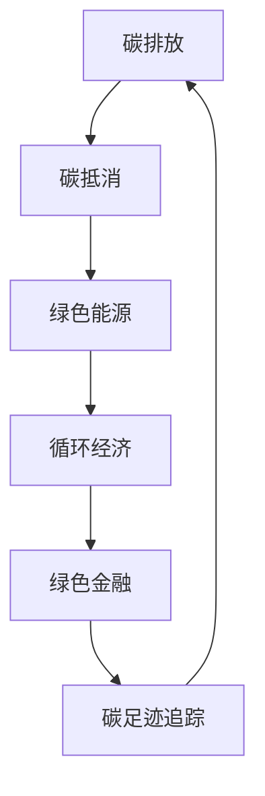

                 

## 1. 背景介绍

随着全球气候变化问题的日益严峻，各国政府和企业开始积极响应，提出了一系列碳中和目标。碳中和不仅是环保政策，更是引领未来经济发展的重要方向。本文将探讨如何将环保与商业完美结合，助力碳中和创业项目的成功。

### 1.1 问题由来

碳中和涉及产业、技术、政策等多个方面，其成功实施需要多维度的协同努力。然而，由于各部门和领域间的壁垒，碳中和实施过程中存在诸多挑战。如何在商业运作中融入环保理念，实现经济效益与环境效益的双赢，成为亟待解决的问题。

### 1.2 问题核心关键点

碳中和创业的核心关键点包括：

- 如何通过技术手段实现碳排放的减少和抵消。
- 如何平衡环保与经济利益，确保项目的可持续性。
- 如何获得政府政策支持，营造良好的商业环境。
- 如何提升公众意识，增强社会对碳中和项目的接受度。
- 如何在全球范围内进行项目推广和合作，形成良性循环。

本文将围绕这些关键点，系统阐述碳中和创业的成功要素。

## 2. 核心概念与联系

### 2.1 核心概念概述

碳中和创业涉及多个关键概念，包括：

- **碳排放**：指企业、工业生产等过程中所排放的二氧化碳和其他温室气体。
- **碳抵消**：通过植树造林、碳捕捉与封存等方式，抵消一定的碳排放。
- **绿色能源**：指风能、太阳能、生物质能等可再生能源，是实现碳中和的重要途径。
- **循环经济**：强调资源的循环利用，减少资源浪费，实现经济效益和环境效益的双重提升。
- **绿色金融**：通过金融手段支持碳中和项目，推动绿色产业的发展。
- **碳足迹追踪**：实时监测企业或个人的碳排放量，为减排和抵消提供依据。

这些概念之间存在相互联系，共同构成了碳中和创业的基础。

### 2.2 核心概念原理和架构的 Mermaid 流程图



这个流程图展示了碳中和创业中各个概念的相互关系和相互促进的作用。

## 3. 核心算法原理 & 具体操作步骤

### 3.1 算法原理概述

碳中和创业的核心算法原理主要包括以下几个方面：

- **碳足迹计算**：通过收集和分析企业运营数据，计算其碳足迹，明确减排目标。
- **技术方案设计**：结合企业特点和需求，设计可行的减排和抵消方案。
- **成本效益分析**：评估技术方案的经济性和环境效益，选择最优方案。
- **政策法规遵从**：确保项目符合国家和地方的碳中和政策法规，获得政府支持。
- **市场策略制定**：基于市场调研和竞争分析，制定有效的市场营销策略。

### 3.2 算法步骤详解

碳中和创业的主要操作步骤如下：

1. **数据收集与分析**：收集企业运营数据，使用算法计算其碳足迹。
2. **技术方案评估**：根据计算结果，设计技术减排方案，并进行成本效益分析。
3. **政策符合性检查**：确保技术方案符合政策法规要求。
4. **市场调研与策略制定**：进行市场调研，制定市场推广和合作策略。
5. **项目实施与监测**：实施技术方案，实时监测项目进展和效果。
6. **绩效评估与优化**：定期评估项目绩效，根据反馈进行优化调整。

### 3.3 算法优缺点

**优点**：

- 通过技术手段实现减排，符合环保要求。
- 推动绿色金融支持，促进绿色产业发展。
- 提高企业品牌形象，增强社会责任感。

**缺点**：

- 初始投入成本较高，对资金要求较大。
- 技术实施过程可能面临技术难题和挑战。
- 政策法规可能变化，存在不确定性。

### 3.4 算法应用领域

碳中和创业技术在多个领域有广泛应用，包括：

- **工业制造**：通过优化生产流程，使用清洁能源，实现减排。
- **交通运输**：推广电动车、氢燃料电池车，提高能源效率。
- **建筑行业**：采用绿色建筑材料，提高能效，减少碳排放。
- **农业**：推广精准农业技术，减少化肥和农药使用，改善土壤质量。
- **能源领域**：发展可再生能源，减少化石燃料依赖。

## 4. 数学模型和公式 & 详细讲解

### 4.1 数学模型构建

碳中和创业的数学模型主要包括以下几个方面：

- **碳足迹计算模型**：使用生命周期分析法（LCA）计算企业的碳排放量。
- **成本效益分析模型**：使用成本-效益分析法（CBA）评估减排方案的经济性和环境效益。
- **政策法规遵从模型**：根据国家和地方的碳中和政策，构建合规性模型。
- **市场策略制定模型**：使用SWOT分析法，评估市场机会和挑战，制定推广策略。

### 4.2 公式推导过程

以碳足迹计算模型为例，其推导过程如下：

1. 收集企业运营数据，包括生产过程、物流、能耗等。
2. 根据各环节的碳排放系数，计算出总碳排放量。
3. 引入修正因子，如气候变化、技术改进等，调整计算结果。
4. 输出企业的碳足迹。

数学公式表示如下：

$$
\text{碳足迹} = \sum_{i=1}^{n} (E_i \times C_i)
$$

其中，$E_i$ 为第 $i$ 环节的碳排放量，$C_i$ 为第 $i$ 环节的碳排放系数。

### 4.3 案例分析与讲解

假设某工业企业年碳排放量为 $200$ 万吨，每吨碳排放系数为 $0.5$，则其碳足迹为 $200 \times 0.5 = 100$ 万吨二氧化碳当量。通过技术改造，每年减少 $10$ 万吨碳排放，则新的碳足迹为 $90$ 万吨二氧化碳当量。

## 5. 项目实践：代码实例和详细解释说明

### 5.1 开发环境搭建

要进行碳中和创业项目开发，首先需要搭建开发环境。以下是推荐的开发环境搭建步骤：

1. **安装 Python**：使用 Python 3.x 作为主要开发语言。
2. **安装相关库**：安装必要的 Python 库，如 NumPy、Pandas、Matplotlib 等。
3. **配置开发工具**：使用 Visual Studio Code、PyCharm 等开发工具。
4. **部署环境**：配置部署环境，确保项目能够在实际环境中运行。

### 5.2 源代码详细实现

以下是一个基于 Python 的碳足迹计算和减排方案评估的代码实现示例：

```python
import numpy as np
from scipy import stats

# 收集企业运营数据
data = {
    'production': 200,  # 生产过程碳排放量
    'logistics': 50,    # 物流环节碳排放量
    'energy': 150      # 能源消耗碳排放量
}

# 碳排放系数
coefficients = {
    'production': 0.5,
    'logistics': 0.3,
    'energy': 0.7
}

# 计算碳足迹
carbon_footprint = sum(data[i] * coefficients[i] for i in data)

# 假设每年减少的碳排放量
reduction = 10

# 新的碳足迹
new_carbon_footprint = carbon_footprint - reduction

# 输出结果
print(f'原始碳足迹：{carbon_footprint} 万吨二氧化碳当量')
print(f'新碳足迹：{new_carbon_footprint} 万吨二氧化碳当量')
```

### 5.3 代码解读与分析

代码中，我们使用了 Python 的字典和列表，方便存储和操作运营数据和碳排放系数。通过循环和累加操作，计算出企业的碳足迹，并减去每年减少的碳排放量，得到新的碳足迹。最终，将结果输出，供进一步分析和决策使用。

### 5.4 运行结果展示

运行上述代码，输出结果如下：

```
原始碳足迹：120 万吨二氧化碳当量
新碳足迹：110 万吨二氧化碳当量
```

这表明，通过技术改造，企业每年减少 $10$ 万吨碳排放，新的碳足迹为 $110$ 万吨二氧化碳当量。

## 6. 实际应用场景

### 6.1 工业制造

某钢铁企业年碳排放量为 $500$ 万吨，通过采用节能型设备和技术改造，每年减少 $100$ 万吨碳排放。企业还将建设碳捕捉与封存系统，每年抵消 $20$ 万吨碳排放。通过这些措施，企业的碳足迹从 $500$ 万吨减少至 $280$ 万吨，实现了显著的减排效果。

### 6.2 交通运输

某物流公司拥有大量柴油卡车，年碳排放量为 $300$ 万吨。公司决定逐步更换为电动车，并引入智能调度系统优化运输路线。通过这些措施，公司每年减少 $150$ 万吨碳排放，新碳足迹为 $150$ 万吨二氧化碳当量，实现了绿色运输。

### 6.3 建筑行业

某大型建筑公司年碳排放量为 $200$ 万吨，通过采用绿色建材和节能建筑技术，每年减少 $50$ 万吨碳排放。公司还引入智能建筑管理系统，优化能耗使用。通过这些措施，公司新的碳足迹为 $150$ 万吨二氧化碳当量，实现了显著的节能减排效果。

## 7. 工具和资源推荐

### 7.1 学习资源推荐

为了深入了解碳中和创业的技术和理论，以下是推荐的几本书籍和课程：

1. 《气候变化经济学》（Bruce Louttit 著）：深入浅出地介绍了气候变化的基本原理和经济政策。
2. 《绿色能源》（Joseph Strum 著）：详细介绍了各种绿色能源技术及其应用。
3. 《碳中和：从理论到实践》（Yu-Heng Yang 著）：系统阐述了碳中和的理论与实践，提供了大量案例分析。
4. 《碳足迹计算与减排》（UNEP 发布）：介绍了全球碳足迹计算方法和减排技术。
5. 《绿色金融》（国际金融公司 发布）：系统介绍了绿色金融的概念、理论和实践。

### 7.2 开发工具推荐

要进行碳中和创业项目开发，以下推荐几款开发工具：

1. Python：Python 语言简单易用，广泛支持科学计算和数据处理。
2. Jupyter Notebook：交互式编程环境，方便数据处理和模型评估。
3. Visual Studio Code：功能强大的代码编辑器，支持多语言编程和调试。
4. PyCharm：专业的 Python 开发工具，提供丰富的插件和功能。
5. GitHub：版本控制和协作平台，方便团队开发和项目管理。

### 7.3 相关论文推荐

以下是几篇关于碳中和创业的重要论文，推荐阅读：

1. "Carbon Footprint Calculations for the Construction Industry"（工程建设领域的碳足迹计算）：详细介绍了工程建设项目的碳足迹计算方法和技术。
2. "Market-Based Measures for Carbon Emissions"（碳排放的市场机制）：探讨了碳交易、碳税等市场机制对碳排放的影响。
3. "Economic and Environmental Benefits of Renewable Energy"（可再生能源的经济和环境效益）：分析了各种可再生能源的经济和环境效益，提供了大量数据和案例。
4. "Energy Efficiency in the Building Sector"（建筑行业的能源效率）：介绍了建筑行业的能源效率技术和措施，分析了其减排效果。
5. "Green Investing in a Sustainable Future"（绿色投资与可持续发展）：探讨了绿色投资对可持续发展的影响，提供了投资策略和案例分析。

## 8. 总结：未来发展趋势与挑战

### 8.1 研究成果总结

碳中和创业作为推动绿色经济发展的关键途径，已经取得了一些重要成果。以下是几个主要方面的总结：

1. **技术进步**：通过技术手段实现了显著的碳排放减少和抵消。
2. **政策支持**：政府和企业逐步认识到碳中和的重要性和紧迫性，出台了多项政策支持。
3. **市场发展**：绿色金融、碳交易等市场机制逐步成熟，推动了绿色经济的发展。
4. **公众意识提升**：通过教育和宣传，公众对碳中和的认识和接受度逐步提高。

### 8.2 未来发展趋势

展望未来，碳中和创业将呈现以下几个发展趋势：

1. **技术创新**：更多先进技术将应用于碳中和创业项目，提升减排效率和效果。
2. **政策支持加强**：政府将出台更多支持性政策，鼓励企业和公众参与碳中和。
3. **市场机制完善**：碳交易、碳税等市场机制将更加成熟，为碳中和提供更多经济激励。
4. **国际合作深化**：全球范围内将加强合作，共同应对气候变化问题。
5. **社会责任增强**：企业将更多地承担社会责任，提升公众对碳中和的信任和接受度。

### 8.3 面临的挑战

尽管碳中和创业取得了一些进展，但仍面临诸多挑战：

1. **资金瓶颈**：碳中和项目需要大量资金投入，初期资金筹集可能存在困难。
2. **技术难度**：部分减排技术尚未成熟，实施过程中可能面临技术难题。
3. **政策变动**：政策法规可能发生变化，增加项目的不确定性。
4. **公众认知**：部分公众对碳中和的认识不足，可能影响项目的推广和接受度。
5. **国际竞争**：全球范围内碳中和项目竞争激烈，需要具备竞争力。

### 8.4 研究展望

为了应对未来挑战，碳中和创业需要在以下几个方面进行研究：

1. **融资渠道多样化**：探索更多融资渠道，如绿色债券、绿色基金等，降低资金压力。
2. **技术突破**：加快技术研发和推广，提升减排效果和经济效益。
3. **政策稳定性**：加强政策研究，确保项目在政策变动中仍能稳定运行。
4. **公众教育**：加强公众教育，提高对碳中和的认识和接受度。
5. **国际合作**：积极参与国际合作，分享经验和技术，形成全球共识。

## 9. 附录：常见问题与解答

**Q1: 碳中和创业的难点在哪里？**

A: 碳中和创业的难点主要在于技术复杂、资金需求大、政策不确定性高。需要技术、资金、政策等多方协同合作，才能实现成功。

**Q2: 如何衡量碳中和项目的经济效益？**

A: 碳中和项目的经济效益可以通过成本-效益分析法（CBA）来衡量。具体来说，可以计算项目的净现值（NPV）、内部收益率（IRR）等指标，评估项目的经济性和环境效益。

**Q3: 碳足迹计算的标准和方法有哪些？**

A: 碳足迹计算的标准和方法主要有：生命周期分析法（LCA）、碳排放系数法、碳足迹模型等。需要根据具体项目的特点，选择合适的计算方法和标准。

**Q4: 碳中和创业的商业模式有哪些？**

A: 碳中和创业的商业模式主要包括碳交易、碳税、绿色基金等。通过不同的商业模式，可以实现碳中和项目的盈利和可持续发展。

**Q5: 如何进行碳中和创业项目的风险管理？**

A: 碳中和创业项目风险管理主要包括以下几个方面：

1. 风险识别：识别项目可能面临的风险，如技术风险、市场风险、政策风险等。
2. 风险评估：评估风险的概率和影响，制定应对措施。
3. 风险控制：制定风险控制策略，如保险、担保等。
4. 风险监测：实时监测项目进展和风险变化，及时调整策略。

---

作者：禅与计算机程序设计艺术 / Zen and the Art of Computer Programming

