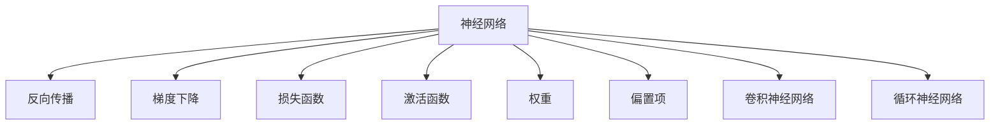

                 

# 神经网络：人工智能的基石

## 1. 背景介绍

### 1.1 问题由来
自20世纪50年代神经网络概念的提出以来，其经历了从学术前沿到产业应用，再到逐渐成熟和广泛应用的历程。在人工智能(AI)领域，神经网络已不仅是科学研究的重要工具，更是核心技术之一。

神经网络不仅在图像识别、语音识别、自然语言处理等领域取得了显著成就，也在游戏、推荐系统、自动驾驶等多个垂直行业内发挥着重要作用。

本文将深入探讨神经网络的原理与架构，并通过具体的案例展示其在不同领域的应用。同时，我们也将分析神经网络所面临的挑战与未来发展趋势。

## 2. 核心概念与联系

### 2.1 核心概念概述

为更好地理解神经网络，本节将介绍几个密切相关的核心概念：

- **神经网络**：基于生物神经系统的计算模型，通过模拟神经元之间的连接和学习过程，实现信息处理和模式识别。

- **反向传播**：神经网络训练的核心算法，通过链式法则反向传播误差信号，更新模型参数以最小化损失函数。

- **梯度下降**：优化算法的一种，通过不断调整参数，使得损失函数值不断降低，逐步逼近最优解。

- **损失函数**：衡量模型预测结果与真实值之间差异的函数，常用交叉熵损失、均方误差损失等。

- **激活函数**：神经元计算的激活规则，如ReLU、Sigmoid等，引入非线性映射能力。

- **权重**：神经网络中每个连接所对应的参数，通过学习调整，赋予各节点不同的重要性。

- **偏置项**：神经元激活函数的基准值，提供固定的偏移量。

- **卷积神经网络**：专门处理图像、视频等具有局部相关性的数据，通过卷积和池化操作提取特征。

- **循环神经网络**：处理序列数据的神经网络，通过隐状态传递信息，适合语言建模和自然语言处理任务。

这些核心概念之间的逻辑关系可以通过以下Mermaid流程图来展示：



这个流程图展示出神经网络的核心组成部分及关键算法和组件。

## 3. 核心算法原理 & 具体操作步骤
### 3.1 算法原理概述

神经网络通过一系列权重参数和激活函数实现非线性映射，将输入数据转化为输出。训练神经网络的目标是最小化损失函数，即：

$$
\min_{\theta} \mathcal{L}(\theta) = \mathcal{L}(\text{output}(\text{input}, \theta))
$$

其中 $\theta$ 表示模型参数，$\mathcal{L}$ 为损失函数，$\text{output}$ 为输出函数，$\text{input}$ 为输入数据。

常用的损失函数包括均方误差损失（用于回归任务）、交叉熵损失（用于分类任务）等。以二分类任务为例，交叉熵损失定义为：

$$
\mathcal{L} = -\frac{1}{N} \sum_{i=1}^N y_i \log \hat{y}_i + (1 - y_i) \log (1 - \hat{y}_i)
$$

其中 $y_i$ 为真实标签，$\hat{y}_i$ 为模型预测的概率。

神经网络的训练过程通常采用梯度下降优化算法。对于每个训练样本，前向传播计算损失函数，反向传播计算梯度，并通过更新参数来最小化损失函数。以简单的前向传播和反向传播为例：

**前向传播**：

$$
z_j = \sum_{i=1}^n w_{ij} x_i + b_j
$$

$$
a_j = \sigma(z_j)
$$

其中 $w_{ij}$ 为权重，$b_j$ 为偏置项，$\sigma$ 为激活函数。

**反向传播**：

$$
\frac{\partial \mathcal{L}}{\partial z_j} = -\frac{1}{N} \frac{\partial \mathcal{L}}{\partial \hat{y}_j} = -\frac{1}{N} \frac{\partial \mathcal{L}}{\partial y_j} = -\frac{1}{N} (y_j - \hat{y}_j)
$$

$$
\frac{\partial \mathcal{L}}{\partial w_{ij}} = \frac{\partial \mathcal{L}}{\partial z_j} \frac{\partial z_j}{\partial w_{ij}} = a_i \frac{\partial \mathcal{L}}{\partial z_j}
$$

$$
\frac{\partial \mathcal{L}}{\partial b_j} = \frac{\partial \mathcal{L}}{\partial z_j}
$$

$$
\frac{\partial \mathcal{L}}{\partial x_i} = \frac{\partial \mathcal{L}}{\partial z_j} \frac{\partial z_j}{\partial x_i} = \sum_{k=1}^m \frac{\partial \mathcal{L}}{\partial w_{ik}} = \sum_{k=1}^m a_k \frac{\partial \mathcal{L}}{\partial z_k} \frac{\partial z_k}{\partial x_i}
$$

利用这些公式，可以通过梯度下降算法不断更新权重和偏置项，使模型逐步逼近最优解。

### 3.2 算法步骤详解

以下是典型的神经网络训练步骤：

**Step 1: 准备数据集**
- 收集并划分训练集、验证集和测试集，保证数据集的多样性和代表性。

**Step 2: 初始化模型参数**
- 设定初始权重和偏置项，通常使用随机初始化方法，如Xavier初始化。

**Step 3: 前向传播**
- 对训练集数据进行迭代，计算模型输出。

**Step 4: 计算损失函数**
- 计算输出与真实标签的差异，即损失函数值。

**Step 5: 反向传播**
- 通过链式法则计算各层参数的梯度。

**Step 6: 更新模型参数**
- 使用梯度下降算法更新权重和偏置项。

**Step 7: 验证和调整**
- 在验证集上评估模型性能，调整超参数（如学习率、正则化系数）。

**Step 8: 测试和部署**
- 在测试集上评估最终模型性能，部署到实际应用中。

这些步骤通过迭代循环进行，直至模型收敛或达到预设迭代轮数。

### 3.3 算法优缺点

神经网络在处理复杂非线性关系方面具有明显优势，但同时也面临诸多挑战：

**优点**：
1. 强大的泛化能力：神经网络能够处理高维非线性数据，适用于复杂的模式识别任务。
2. 自适应学习：通过反向传播算法，神经网络能够自动调整模型参数，适应数据分布变化。
3. 并行计算：神经网络结构天然适合并行计算，可以显著提升训练和推理速度。
4. 多任务学习：神经网络可以同时训练多个任务，提高资源利用率。
5. 端到端学习：神经网络能够自动进行特征提取和分类，减少了手工特征工程的复杂度。

**缺点**：
1. 过拟合风险：神经网络容易过拟合，尤其是当模型复杂度过高时。
2. 计算资源消耗大：大模型训练和推理需要大量计算资源和存储资源。
3. 参数调整困难：选择合适的超参数组合较难，需要大量实验和经验。
4. 模型可解释性差：神经网络的决策过程往往难以解释，难以进行透明化管理。
5. 数据依赖性强：神经网络的性能高度依赖于训练数据的质量和数量。

尽管存在这些局限性，神经网络仍然是大数据、大规模并行计算和复杂数据处理的关键技术。未来研究重点应放在如何提升模型的可解释性、泛化能力和计算效率。

### 3.4 算法应用领域

神经网络已经在各个领域取得了显著应用，如：

- 计算机视觉：用于图像分类、目标检测、人脸识别等任务，如CNN网络。
- 自然语言处理：用于语言建模、机器翻译、文本分类等任务，如RNN、Transformer网络。
- 语音识别：用于语音转文本、语音命令控制等任务，如RNN、CNN网络。
- 推荐系统：用于商品推荐、用户画像分析等任务，如深度神经网络。
- 自动驾驶：用于环境感知、行为决策等任务，如卷积神经网络和循环神经网络。
- 游戏AI：用于角色控制、路径规划等任务，如深度强化学习网络。

## 4. 数学模型和公式 & 详细讲解
### 4.1 数学模型构建

以下是一个简单的神经网络数学模型构建：

假设有一个三层的神经网络，输入为 $x$，输出为 $y$，中间层参数为 $w_{hl}$ 和 $b_h$。

**前向传播**：

$$
z_1 = \sum_{i=1}^n w_{1i} x_i + b_1
$$

$$
a_1 = \sigma(z_1)
$$

$$
z_2 = \sum_{i=1}^m w_{2i} a_1 + b_2
$$

$$
a_2 = \sigma(z_2)
$$

$$
z_3 = \sum_{i=1}^k w_{3i} a_2 + b_3
$$

$$
y = \sigma(z_3)
$$

**损失函数**：

$$
\mathcal{L} = -\frac{1}{N} \sum_{i=1}^N y_i \log y_i
$$

其中 $x \in \mathbb{R}^n$，$a_1 \in \mathbb{R}^m$，$a_2 \in \mathbb{R}^k$，$y \in \mathbb{R}^k$。$\sigma$ 为激活函数，如Sigmoid、ReLU等。

### 4.2 公式推导过程

以下将对二分类任务进行详细推导，展示反向传播和梯度更新的过程：

**前向传播**：

$$
z_1 = w_1 x + b_1
$$

$$
a_1 = \sigma(z_1) = \frac{1}{1 + e^{-z_1}}
$$

$$
z_2 = w_2 a_1 + b_2
$$

$$
a_2 = \sigma(z_2) = \frac{1}{1 + e^{-z_2}}
$$

$$
z_3 = w_3 a_2 + b_3
$$

$$
y = \sigma(z_3) = \frac{1}{1 + e^{-z_3}}
$$

**损失函数**：

$$
\mathcal{L} = -\frac{1}{N} \sum_{i=1}^N y_i \log y_i + (1 - y_i) \log (1 - y_i)
$$

**反向传播**：

$$
\frac{\partial \mathcal{L}}{\partial z_3} = -\frac{1}{N} \frac{\partial \mathcal{L}}{\partial y} = -\frac{1}{N} (\frac{y_i}{y_i} - \frac{1-y_i}{1-y_i}) = (y_i - y_i^2)
$$

$$
\frac{\partial \mathcal{L}}{\partial z_2} = \frac{\partial \mathcal{L}}{\partial z_3} \frac{\partial z_3}{\partial a_2} = (y_i - y_i^2) \sigma(z_3) (1 - \sigma(z_3))
$$

$$
\frac{\partial \mathcal{L}}{\partial w_3} = \frac{\partial \mathcal{L}}{\partial z_3} \frac{\partial z_3}{\partial a_2} = (y_i - y_i^2) \sigma(z_3) (1 - \sigma(z_3)) a_2
$$

$$
\frac{\partial \mathcal{L}}{\partial b_3} = \frac{\partial \mathcal{L}}{\partial z_3} = (y_i - y_i^2) \sigma(z_3) (1 - \sigma(z_3))
$$

$$
\frac{\partial \mathcal{L}}{\partial z_2} = \frac{\partial \mathcal{L}}{\partial z_3} \frac{\partial z_3}{\partial a_2} = (y_i - y_i^2) \sigma(z_3) (1 - \sigma(z_3)) \sigma(z_2) (1 - \sigma(z_2))
$$

$$
\frac{\partial \mathcal{L}}{\partial w_2} = \frac{\partial \mathcal{L}}{\partial z_2} \frac{\partial z_2}{\partial a_1} = (y_i - y_i^2) \sigma(z_3) (1 - \sigma(z_3)) \sigma(z_2) (1 - \sigma(z_2)) a_1
$$

$$
\frac{\partial \mathcal{L}}{\partial b_2} = \frac{\partial \mathcal{L}}{\partial z_2} = (y_i - y_i^2) \sigma(z_3) (1 - \sigma(z_3)) \sigma(z_2) (1 - \sigma(z_2))
$$

$$
\frac{\partial \mathcal{L}}{\partial z_1} = \frac{\partial \mathcal{L}}{\partial z_2} \frac{\partial z_2}{\partial a_1} = (y_i - y_i^2) \sigma(z_3) (1 - \sigma(z_3)) \sigma(z_2) (1 - \sigma(z_2)) \sigma(z_1) (1 - \sigma(z_1))
$$

$$
\frac{\partial \mathcal{L}}{\partial w_1} = \frac{\partial \mathcal{L}}{\partial z_1} \frac{\partial z_1}{\partial x} = (y_i - y_i^2) \sigma(z_3) (1 - \sigma(z_3)) \sigma(z_2) (1 - \sigma(z_2)) \sigma(z_1) (1 - \sigma(z_1)) x
$$

$$
\frac{\partial \mathcal{L}}{\partial b_1} = \frac{\partial \mathcal{L}}{\partial z_1} = (y_i - y_i^2) \sigma(z_3) (1 - \sigma(z_3)) \sigma(z_2) (1 - \sigma(z_2)) \sigma(z_1) (1 - \sigma(z_1))
$$

利用这些公式，可以逐步计算每个参数的梯度，并使用梯度下降算法更新参数。

### 4.3 案例分析与讲解

以下将以手写数字识别为例，展示一个简单的神经网络模型训练过程：

**数据准备**：
- 收集MNIST数据集，划分为训练集、验证集和测试集。
- 对数据进行预处理，归一化处理，转换为矩阵形式。

**模型搭建**：
- 使用PyTorch搭建一个三层全连接神经网络。
- 定义激活函数为ReLU。
- 损失函数为交叉熵损失。

**训练过程**：
- 定义模型训练函数，使用梯度下降算法更新模型参数。
- 在训练集上迭代训练，使用验证集评估模型性能。
- 不断调整超参数，直至模型收敛。

**测试过程**：
- 在测试集上评估模型性能，输出模型结果。
- 分析模型误差来源，优化模型。

## 5. 项目实践：代码实例和详细解释说明
### 5.1 开发环境搭建

在进行神经网络实践前，我们需要准备好开发环境。以下是使用Python进行PyTorch开发的环境配置流程：

1. 安装Anaconda：从官网下载并安装Anaconda，用于创建独立的Python环境。

2. 创建并激活虚拟环境：
```bash
conda create -n pytorch-env python=3.8 
conda activate pytorch-env
```

3. 安装PyTorch：根据CUDA版本，从官网获取对应的安装命令。例如：
```bash
conda install pytorch torchvision torchaudio cudatoolkit=11.1 -c pytorch -c conda-forge
```

4. 安装各类工具包：
```bash
pip install numpy pandas scikit-learn matplotlib tqdm jupyter notebook ipython
```

完成上述步骤后，即可在`pytorch-env`环境中开始神经网络实践。

### 5.2 源代码详细实现

这里以手写数字识别为例，展示一个简单的神经网络模型训练过程的PyTorch代码实现。

```python
import torch
import torch.nn as nn
import torch.optim as optim
from torch.utils.data import DataLoader
from torchvision import datasets, transforms
import matplotlib.pyplot as plt

# 定义网络结构
class Net(nn.Module):
    def __init__(self):
        super(Net, self).__init__()
        self.fc1 = nn.Linear(28 * 28, 500)
        self.fc2 = nn.Linear(500, 10)
        self.relu = nn.ReLU()

    def forward(self, x):
        x = x.view(-1, 28 * 28)
        x = self.relu(self.fc1(x))
        x = self.fc2(x)
        return x

# 加载数据集
train_dataset = datasets.MNIST(root='./data', train=True, transform=transforms.ToTensor(), download=True)
test_dataset = datasets.MNIST(root='./data', train=False, transform=transforms.ToTensor(), download=True)

# 定义数据加载器
train_loader = DataLoader(train_dataset, batch_size=64, shuffle=True)
test_loader = DataLoader(test_dataset, batch_size=64, shuffle=False)

# 定义模型、优化器和损失函数
model = Net()
criterion = nn.CrossEntropyLoss()
optimizer = optim.Adam(model.parameters(), lr=0.001)
device = torch.device('cuda' if torch.cuda.is_available() else 'cpu')
model.to(device)

# 定义训练过程
def train_epoch(model, data_loader, criterion, optimizer):
    model.train()
    total_loss = 0
    for batch_idx, (data, target) in enumerate(data_loader):
        data, target = data.to(device), target.to(device)
        optimizer.zero_grad()
        output = model(data)
        loss = criterion(output, target)
        loss.backward()
        optimizer.step()
        total_loss += loss.item()
    return total_loss / len(data_loader)

# 定义测试过程
def evaluate(model, data_loader, criterion):
    model.eval()
    total_loss = 0
    with torch.no_grad():
        for batch_idx, (data, target) in enumerate(data_loader):
            data, target = data.to(device), target.to(device)
            output = model(data)
            loss = criterion(output, target)
            total_loss += loss.item()
    return total_loss / len(data_loader)

# 训练过程
epochs = 10
batch_size = 64

for epoch in range(epochs):
    train_loss = train_epoch(model, train_loader, criterion, optimizer)
    print(f'Epoch {epoch+1}, train loss: {train_loss:.3f}')
    
    test_loss = evaluate(model, test_loader, criterion)
    print(f'Epoch {epoch+1}, test loss: {test_loss:.3f}')

print('Test loss:', test_loss)
```

这个代码实现了简单的神经网络模型对手写数字识别数据的训练和测试。可以看到，利用PyTorch框架，神经网络的构建和训练变得简洁高效。

### 5.3 代码解读与分析

让我们再详细解读一下关键代码的实现细节：

**Net类**：
- `__init__`方法：初始化网络结构，定义全连接层和激活函数。
- `forward`方法：定义前向传播过程。

**train_epoch函数**：
- 对训练集数据进行迭代，计算损失函数和梯度，更新模型参数。

**evaluate函数**：
- 对测试集数据进行迭代，计算损失函数，但不更新模型参数。

**训练流程**：
- 定义总的epoch数和batch size，开始循环迭代
- 每个epoch内，先在训练集上训练，输出平均loss
- 在测试集上评估，输出测试loss
- 所有epoch结束后，给出最终测试结果

可以看到，PyTorch框架提供了丰富的API，使得神经网络的构建和训练变得简单快捷。开发者可以将更多精力放在模型改进和实验优化上。

当然，工业级的系统实现还需考虑更多因素，如模型的保存和部署、超参数的自动搜索、更灵活的任务适配层等。但核心的训练过程与上述代码类似。

## 6. 实际应用场景
### 6.1 计算机视觉

神经网络在计算机视觉领域已经取得了显著应用，如图像分类、目标检测、人脸识别等任务。以图像分类为例，神经网络通过卷积操作提取图像特征，利用池化操作减少特征维度和噪声，最终通过全连接层进行分类。

在实际应用中，神经网络常常被应用于图像识别系统，如自动驾驶、安防监控等场景。通过在传感器获取的图像数据上进行训练和推理，神经网络能够实时处理和分析图像，提取目标物体的特征，辅助系统做出决策。

### 6.2 自然语言处理

神经网络在自然语言处理领域的应用同样广泛，如语言建模、机器翻译、文本分类等任务。以机器翻译为例，神经网络通过编码器和解码器结构，将源语言文本映射为目标语言文本。

在实际应用中，神经网络常常被应用于机器翻译系统，如谷歌翻译、有道翻译等。通过在平行语料上进行训练，神经网络能够自动学习语言转换规则，提升翻译质量。

### 6.3 语音识别

神经网络在语音识别领域也有重要应用，如语音转文本、语音命令控制等任务。以语音转文本为例，神经网络通过卷积和循环结构，提取语音信号的特征，利用全连接层进行文本分类和预测。

在实际应用中，神经网络常常被应用于语音助手、智能音箱等设备，通过在大量语音数据上进行训练，神经网络能够自动识别和转录语音内容，提高交互体验。

### 6.4 未来应用展望

随着神经网络技术的不断发展，其在各个领域的应用将更加广泛和深入。未来，神经网络可能会在以下方向取得突破：

1. 自主驾驶：通过神经网络进行环境感知和决策，提高驾驶安全性和效率。
2. 医疗诊断：利用神经网络进行疾病诊断和治疗方案推荐，提升医疗水平。
3. 机器人控制：通过神经网络进行行为规划和路径优化，提高机器人灵活性和适应性。
4. 社交网络：利用神经网络进行情感分析和个性化推荐，提升用户体验。
5. 金融预测：利用神经网络进行市场分析和投资决策，提高投资回报率。
6. 科学研究：利用神经网络进行数据处理和模式识别，加速科学发现。

## 7. 工具和资源推荐
### 7.1 学习资源推荐

为了帮助开发者系统掌握神经网络的原理与实践，这里推荐一些优质的学习资源：

1. 《深度学习》课程：斯坦福大学开设的深度学习经典课程，涵盖了神经网络的基本概念和常见算法。
2. 《神经网络与深度学习》书籍：深度学习领域的经典教材，详细介绍了神经网络的理论基础和实践技巧。
3. Coursera上的《Neural Networks Specialization》课程：由Andrew Ng主讲，系统讲解神经网络的各个方面。
4. 《TensorFlow官方文档》：TensorFlow框架的官方文档，包含详细的API和使用指南。
5. PyTorch官方文档：PyTorch框架的官方文档，提供丰富的样例和教程。
6. Kaggle竞赛：参加Kaggle竞赛，实战训练神经网络，积累经验。

通过对这些资源的学习实践，相信你一定能够快速掌握神经网络的核心原理和应用技巧。

### 7.2 开发工具推荐

高效的开发离不开优秀的工具支持。以下是几款用于神经网络开发的常用工具：

1. TensorFlow：由Google主导开发的开源深度学习框架，生产部署方便，适合大规模工程应用。
2. PyTorch：基于Python的开源深度学习框架，灵活动态的计算图，适合快速迭代研究。
3. Keras：高层次神经网络API，易于上手，适合初学者和快速原型开发。
4. Caffe：由Berkeley Vision and Learning Center开发的深度学习框架，高效计算，适合计算机视觉任务。
5. MXNet：由Apache基金会支持的深度学习框架，支持多语言编程，适合分布式计算。
6. Theano：开源的数学表达式编译器，支持高效的数学计算，适合科研和教学。

合理利用这些工具，可以显著提升神经网络的开发效率，加快创新迭代的步伐。

### 7.3 相关论文推荐

神经网络的研究源于学界的持续探索。以下是几篇奠基性的相关论文，推荐阅读：

1. A Neural Network Approach to Visual Pattern Recognition：提出第一个多层感知器模型，奠定了神经网络的基础。
2. ImageNet Classification with Deep Convolutional Neural Networks：提出卷积神经网络，在图像分类任务上取得突破。
3. Bidirectional Recurrent Neural Networks Applied to Part-of-Speech Tagging：提出双向循环神经网络，改进自然语言处理任务。
4. Sequence to Sequence Learning with Neural Networks：提出序列到序列模型，解决机器翻译问题。
5. Deep Learning with Large-Scale Datasets: A New Image Recognition Model and Implementation: Hinton, Osindero, and Teh:提出深度信念网络，提升分类精度。
6. Advances in Neural Information Processing Systems：该会议汇集了众多深度学习领域的经典论文，展示了神经网络技术的发展脉络。

这些论文代表了大规模神经网络的研究方向，通过学习这些前沿成果，可以帮助研究者把握学科前进方向，激发更多的创新灵感。

## 8. 总结：未来发展趋势与挑战

### 8.1 总结

本文对神经网络的基本原理与实践进行了全面系统的介绍。首先阐述了神经网络在人工智能领域的地位和应用场景，明确了其在数据处理、模式识别、决策支持等方面的重要价值。其次，从原理到实践，详细讲解了神经网络的核心算法和具体操作步骤，给出了神经网络项目开发的完整代码实例。同时，本文还探讨了神经网络在各个领域的应用前景，展示了其强大的应用潜力。

通过本文的系统梳理，可以看到，神经网络作为人工智能的核心技术之一，已经在诸多领域实现了重要应用，推动了科技和社会的发展。未来，随着神经网络技术的不断演进，其在各个行业的应用将更加深入和广泛，为人类社会的进步贡献更多力量。

### 8.2 未来发展趋势

展望未来，神经网络将呈现以下几个发展趋势：

1. 模型规模不断增大：大规模神经网络将带来更强大的建模能力，处理复杂多变的现实问题。
2. 自监督学习应用广泛：利用大规模无标签数据进行自监督学习，提高神经网络的泛化能力。
3. 联邦学习成为热点：在分布式环境中训练神经网络，保护数据隐私和安全。
4. 边缘计算得到应用：将神经网络部署到边缘设备，实现实时数据处理和决策。
5. 多模态融合更加深入：结合视觉、语音、文本等多模态信息，提升神经网络的鲁棒性和适应性。
6. 可解释性得到重视：研究神经网络的可解释性，增强其透明性和可信度。

以上趋势凸显了神经网络技术的广阔前景。这些方向的探索发展，必将进一步提升神经网络的性能和应用范围，为人工智能技术的落地应用注入新动力。

### 8.3 面临的挑战

尽管神经网络技术已经取得了显著成就，但在迈向更加智能化、普适化应用的过程中，它仍面临诸多挑战：

1. 数据依赖性强：神经网络性能高度依赖于训练数据的质量和数量，数据获取和标注成本较高。
2. 模型复杂度高：大模型参数众多，训练和推理需要大量计算资源。
3. 过拟合风险：神经网络容易过拟合，尤其是当模型复杂度过高时。
4. 可解释性差：神经网络的决策过程难以解释，难以进行透明化管理。
5. 计算资源消耗大：大模型训练和推理需要大量计算资源和存储资源。
6. 安全性和隐私保护：神经网络模型的安全性、隐私保护和数据脱敏是重要问题。

尽管存在这些局限性，神经网络仍然是大数据、大规模并行计算和复杂数据处理的关键技术。未来研究需要在提升模型可解释性、泛化能力和计算效率等方面不断突破。

### 8.4 研究展望

面向未来，神经网络技术需要在以下几个方面寻求新的突破：

1. 发展无监督学习和半监督学习：摆脱对大规模标注数据的依赖，利用自监督学习、主动学习等方法提高神经网络的泛化能力。
2. 探索参数高效和计算高效的方法：开发更加参数高效的神经网络结构，减小过拟合风险，提升计算效率。
3. 研究自适应学习算法：研究神经网络的自适应学习能力，提升其灵活性和鲁棒性。
4. 引入更多先验知识：将符号化的先验知识，如知识图谱、逻辑规则等，与神经网络模型进行融合，提高神经网络的鲁棒性和可解释性。
5. 结合因果分析和博弈论工具：将因果分析方法引入神经网络，增强其因果关系和决策逻辑的透明性。

这些研究方向将推动神经网络技术的不断演进，为构建更加智能、普适的AI系统提供新的方法和思路。

## 9. 附录：常见问题与解答

**Q1：神经网络为什么需要大量的数据？**

A: 神经网络通过大量数据的训练，可以学习到丰富的特征表示，提升模型的泛化能力。数据的多样性和代表性，有助于模型学习到更为全面的知识，避免过拟合。

**Q2：神经网络如何进行超参数调整？**

A: 神经网络的超参数包括学习率、正则化系数、批大小等。通常通过网格搜索、随机搜索、贝叶斯优化等方法进行调整。通过在验证集上的评估，选择最优超参数组合。

**Q3：神经网络如何避免过拟合？**

A: 过拟合是神经网络面临的主要问题。常见的缓解方法包括：数据增强、正则化（L2正则、Dropout等）、早停法、模型简化等。通过这些方法，可以有效地控制模型的复杂度，提高泛化能力。

**Q4：神经网络在实际应用中面临哪些挑战？**

A: 神经网络在实际应用中面临诸多挑战，如数据依赖性、计算资源消耗大、模型复杂度高、过拟合风险、可解释性差等。需要综合考虑技术、工程和业务各个方面，寻找解决方案。

**Q5：神经网络如何实现自监督学习？**

A: 自监督学习利用未标注的数据进行训练，通过设计一些无标签的任务，如预测残差、判别性学习等，让神经网络在数据增强的基础上进行自我学习。常用的自监督学习任务包括预测残差、噪声鲁棒性训练等。

这些问题的解答，将帮助你更好地理解和应用神经网络技术。希望本文能为你的学习研究和实际工作提供有益的参考。

---

作者：禅与计算机程序设计艺术 / Zen and the Art of Computer Programming

