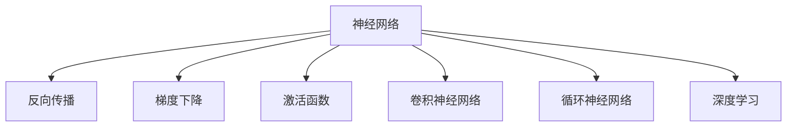

                 

# 神经网络：人工智能的基石

> 关键词：神经网络,深度学习,机器学习,反向传播,梯度下降,激活函数,卷积神经网络,循环神经网络

## 1. 背景介绍

### 1.1 问题由来
随着人工智能技术的迅猛发展，深度学习(Deep Learning)逐渐成为引领AI革命的核心技术。其中，神经网络(Neural Networks)作为深度学习的基石，不仅在图像识别、语音识别、自然语言处理等领域取得了突破性进展，更在医疗诊断、自动驾驶、机器人控制等复杂任务中展示了强大的应用潜力。

然而，尽管神经网络技术日渐成熟，其理论基础仍然存在许多未解之谜。理解神经网络的工作原理、设计原则和训练技巧，对于从事深度学习和人工智能研究的人员至关重要。本文将详细探讨神经网络的基本原理、核心算法、典型结构以及实际应用，以期为读者提供系统的理论基础和实践指南。

### 1.2 问题核心关键点
本文聚焦于以下核心问题：

1. 神经网络的基本结构和原理。
2. 核心算法如反向传播和梯度下降的数学原理和实现细节。
3. 典型神经网络结构如卷积神经网络(CNN)、循环神经网络(RNN)的设计和应用。
4. 深度学习模型在实际项目中的部署与优化。
5. 神经网络在机器学习、计算机视觉、自然语言处理等领域的广泛应用。

## 2. 核心概念与联系

### 2.1 核心概念概述

为更好地理解神经网络，本节将介绍几个关键概念：

- **神经网络(Neural Network)**：由大量人工神经元组成的计算模型，用于解决复杂的分类、回归、聚类等任务。
- **反向传播(Backpropagation)**：一种基于链式法则的优化算法，用于训练神经网络。
- **梯度下降(Gradient Descent)**：一种基于梯度的迭代算法，用于调整神经网络参数。
- **激活函数(Activation Function)**：用于非线性变换，引入非线性特性，提高神经网络表达能力。
- **卷积神经网络(CNN)**：用于图像处理任务，通过卷积操作提取空间局部特征。
- **循环神经网络(RNN)**：用于处理序列数据，通过循环结构引入时间维度。
- **深度学习(Deep Learning)**：基于神经网络的高级机器学习范式，通过多层次网络模型提升学习性能。

这些概念之间的逻辑关系可以通过以下Mermaid流程图来展示：



这个流程图展示了一组核心概念及其之间的关系：

1. 神经网络是反向传播、梯度下降和激活函数等基本算法的载体。
2. 卷积神经网络和循环神经网络是神经网络在不同任务上的典型结构。
3. 深度学习是基于神经网络的多层次学习范式。

## 3. 核心算法原理 & 具体操作步骤

### 3.1 算法原理概述

神经网络通过多层神经元的组合，实现对复杂非线性关系的建模和优化。其核心算法包括反向传播和梯度下降。

**反向传播**是一种基于链式法则的优化算法，用于计算神经网络中每个参数的梯度。通过反向传播，算法可以高效地更新参数，使模型不断逼近目标函数。

**梯度下降**是一种迭代优化算法，用于最小化损失函数。通过梯度下降，模型参数在每次迭代中按梯度方向调整，逐步降低损失函数值，最终使模型收敛到最优解。

### 3.2 算法步骤详解

神经网络的训练通常包括以下几个关键步骤：

1. **数据准备**：收集和预处理训练数据，划分为训练集、验证集和测试集。
2. **模型构建**：选择合适的神经网络结构，定义损失函数和优化器。
3. **正向传播**：将训练数据输入模型，计算模型输出和损失函数。
4. **反向传播**：根据损失函数对模型参数求梯度，更新参数。
5. **重复训练**：重复以上步骤，直到模型收敛或达到预设的迭代次数。

以下是一个简单的神经网络训练示例：

1. 准备数据集，将训练数据标准化并划分为训练集、验证集和测试集。
2. 构建一个简单的全连接神经网络，定义交叉熵损失函数和Adam优化器。
3. 定义正向传播函数，计算模型输出和损失函数。
4. 定义反向传播函数，计算梯度并更新参数。
5. 使用验证集监控模型性能，避免过拟合。
6. 在测试集上评估模型性能，完成训练。

### 3.3 算法优缺点

神经网络算法具有以下优点：

1. **模型表达能力强**：通过多层神经元的组合，可以捕捉复杂的非线性关系，适用于各种复杂任务。
2. **自动特征提取**：利用神经网络进行特征提取，无需手动设计特征，减少人工干预。
3. **可解释性强**：每个神经元的作用可以直观地解释，方便模型调试和优化。

但神经网络算法也存在以下局限性：

1. **计算复杂度高**：深度神经网络需要大量的计算资源和存储空间。
2. **训练时间长**：神经网络的训练过程往往需要较长的迭代时间，难以实时部署。
3. **易过拟合**：深度网络容易在训练集上过拟合，导致泛化性能下降。
4. **难以优化**：复杂模型容易陷入局部最优，难以找到全局最优解。

## 4. 数学模型和公式 & 详细讲解  
### 4.1 数学模型构建

神经网络的基本数学模型包括前向传播和反向传播两个部分。

假设一个包含 $L$ 层的神经网络，输入为 $x$，输出为 $y$，中间层为 $h_1, h_2, ..., h_{L-1}$。每个神经元 $j$ 的输出可以表示为：

$$
h_j = f_w(x_j)
$$

其中 $f_w$ 为激活函数，$x_j$ 为输入向量，$w$ 为权重参数。

在前向传播中，模型依次计算各层神经元的输出：

$$
y_1 = f_w(x)
$$

$$
h_1 = f_w(y_1)
$$

$$
y_2 = f_w(h_1)
$$

$$
h_2 = f_w(y_2)
$$

$$
\vdots
$$

$$
y_L = f_w(h_{L-1})
$$

$$
h_L = f_w(y_L)
$$

最终输出 $y_L$ 即为模型对输入 $x$ 的预测结果。

在反向传播中，模型首先计算输出层的损失函数 $J$：

$$
J = \frac{1}{N} \sum_{i=1}^N (y_i - \hat{y}_i)^2
$$

其中 $\hat{y}_i$ 为模型预测值，$y_i$ 为真实值。

然后，从输出层开始反向传播，计算每个神经元的梯度：

$$
\frac{\partial J}{\partial w} = \frac{\partial J}{\partial y_L} \frac{\partial y_L}{\partial h_{L-1}} \frac{\partial h_{L-1}}{\partial w}
$$

$$
\frac{\partial J}{\partial y_{L-1}} = \frac{\partial J}{\partial h_{L-1}} \frac{\partial h_{L-1}}{\partial y_{L-1}}
$$

$$
\vdots
$$

$$
\frac{\partial J}{\partial x} = \frac{\partial J}{\partial h_1} \frac{\partial h_1}{\partial y_1} \frac{\partial y_1}{\partial x}
$$

### 4.2 公式推导过程

以下以二分类问题为例，详细推导反向传播的数学公式。

假设输入 $x$ 经过一层神经元 $h_1$，激活函数为 $f$，输出 $y_1$。

在正向传播中，计算输出 $y_1$：

$$
y_1 = f_w(x) = f(w \cdot x + b)
$$

在反向传播中，计算梯度 $\frac{\partial J}{\partial w}$：

$$
\frac{\partial J}{\partial y_1} = \frac{\partial J}{\partial h_1} \frac{\partial h_1}{\partial y_1}
$$

$$
\frac{\partial h_1}{\partial y_1} = \frac{\partial f}{\partial y_1}
$$

$$
\frac{\partial J}{\partial w} = \frac{\partial J}{\partial y_1} \frac{\partial y_1}{\partial x} \frac{\partial f}{\partial w}
$$

其中，$\frac{\partial f}{\partial y_1}$ 为激活函数的导数，$\frac{\partial y_1}{\partial x}$ 为线性变换的导数。

将上式展开，得到：

$$
\frac{\partial J}{\partial w} = (\frac{\partial J}{\partial y_1} \frac{\partial f}{\partial y_1} + \frac{\partial J}{\partial h_1} \frac{\partial f}{\partial y_1}) \frac{\partial f}{\partial w}
$$

$$
= (\frac{\partial J}{\partial y_1} \frac{\partial f}{\partial y_1} + \frac{\partial J}{\partial y_1} \frac{\partial f}{\partial h_1} \frac{\partial h_1}{\partial y_1}) \frac{\partial f}{\partial w}
$$

$$
= (\frac{\partial J}{\partial y_1} \frac{\partial f}{\partial y_1} + \frac{\partial J}{\partial y_1} \frac{\partial f}{\partial h_1} \frac{\partial f}{\partial y_1}) \frac{\partial f}{\partial w}
$$

$$
= (\frac{\partial J}{\partial y_1} \frac{\partial f}{\partial y_1} + \frac{\partial J}{\partial h_1} \frac{\partial f}{\partial h_1} \frac{\partial f}{\partial y_1}) \frac{\partial f}{\partial w}
$$

$$
= \frac{\partial J}{\partial y_1} \frac{\partial f}{\partial y_1} \frac{\partial f}{\partial w} + \frac{\partial J}{\partial h_1} \frac{\partial f}{\partial h_1} \frac{\partial f}{\partial w}
$$

重复以上步骤，直到计算出输入层 $x$ 的梯度 $\frac{\partial J}{\partial x}$。

### 4.3 案例分析与讲解

以MNIST手写数字识别为例，展示神经网络的训练过程。

1. 准备数据集，标准化并划分为训练集、验证集和测试集。
2. 定义一个包含3个全连接层的神经网络，使用ReLU作为激活函数，输出层使用softmax。
3. 定义交叉熵损失函数和Adam优化器。
4. 使用训练集训练模型，每轮迭代100个样本，重复100轮。
5. 使用验证集评估模型性能，调整学习率。
6. 在测试集上评估模型性能，完成训练。

## 5. 项目实践：代码实例和详细解释说明
### 5.1 开发环境搭建

在进行神经网络项目开发前，需要先准备好开发环境。以下是使用Python进行PyTorch开发的环境配置流程：

1. 安装Anaconda：从官网下载并安装Anaconda，用于创建独立的Python环境。

2. 创建并激活虚拟环境：
```bash
conda create -n pytorch-env python=3.8 
conda activate pytorch-env
```

3. 安装PyTorch：根据CUDA版本，从官网获取对应的安装命令。例如：
```bash
conda install pytorch torchvision torchaudio cudatoolkit=11.1 -c pytorch -c conda-forge
```

4. 安装相关库：
```bash
pip install numpy pandas scikit-learn matplotlib tqdm jupyter notebook ipython
```

完成上述步骤后，即可在`pytorch-env`环境中开始神经网络项目的开发。

### 5.2 源代码详细实现

下面我们以MNIST手写数字识别任务为例，给出使用PyTorch实现神经网络训练的代码实现。

首先，定义数据处理函数：

```python
import torch
from torchvision import datasets, transforms
import torch.nn as nn
import torch.optim as optim

# 定义数据增强和预处理
transform = transforms.Compose([
    transforms.ToTensor(),
    transforms.Normalize((0.1307,), (0.3081,))
])

# 加载MNIST数据集
train_dataset = datasets.MNIST('data', train=True, download=True, transform=transform)
test_dataset = datasets.MNIST('data', train=False, download=True, transform=transform)

# 定义批次大小和设备
batch_size = 64
device = torch.device("cuda:0" if torch.cuda.is_available() else "cpu")

# 定义数据加载器
train_loader = torch.utils.data.DataLoader(train_dataset, batch_size=batch_size, shuffle=True)
test_loader = torch.utils.data.DataLoader(test_dataset, batch_size=batch_size, shuffle=False)
```

然后，定义神经网络模型和损失函数：

```python
# 定义神经网络模型
class Net(nn.Module):
    def __init__(self):
        super(Net, self).__init__()
        self.fc1 = nn.Linear(784, 500)
        self.fc2 = nn.Linear(500, 10)
        
    def forward(self, x):
        x = x.view(-1, 784)
        x = torch.relu(self.fc1(x))
        x = torch.softmax(self.fc2(x), dim=1)
        return x

# 定义损失函数和优化器
model = Net().to(device)
criterion = nn.CrossEntropyLoss()
optimizer = optim.Adam(model.parameters(), lr=0.001)
```

接着，定义训练和评估函数：

```python
# 定义训练函数
def train(epoch):
    model.train()
    for batch_idx, (data, target) in enumerate(train_loader):
        data, target = data.to(device), target.to(device)
        optimizer.zero_grad()
        output = model(data)
        loss = criterion(output, target)
        loss.backward()
        optimizer.step()
        if (batch_idx+1) % 100 == 0:
            print('Train Epoch: {} [{}/{} ({:.0f}%)]\tLoss: {:.6f}'.format(
                epoch, batch_idx * len(data), len(train_loader.dataset),
                100. * batch_idx / len(train_loader), loss.item()))

# 定义评估函数
def test():
    model.eval()
    test_loss = 0
    correct = 0
    with torch.no_grad():
        for data, target in test_loader:
            data, target = data.to(device), target.to(device)
            output = model(data)
            test_loss += criterion(output, target).item()
            pred = output.argmax(dim=1, keepdim=True)
            correct += pred.eq(target.view_as(pred)).sum().item()

    print('\nTest set: Average loss: {:.4f}, Accuracy: {}/{} ({:.0f}%)\n'.format(
        test_loss / len(test_loader), correct, len(test_loader.dataset),
        100. * correct / len(test_loader.dataset)))
```

最后，启动训练流程并在测试集上评估：

```python
# 开始训练
for epoch in range(1, 10):
    train(epoch)
    test()

# 保存模型
torch.save(model.state_dict(), 'mnist_net.pth')
```

以上就是使用PyTorch实现MNIST手写数字识别任务的全部代码实现。可以看到，利用PyTorch的强大封装，神经网络的训练过程变得异常简洁高效。

### 5.3 代码解读与分析

让我们再详细解读一下关键代码的实现细节：

**数据处理**：
- `transforms.Compose`：将多个数据处理步骤组合成一个，方便统一处理。
- `torchvision.datasets.MNIST`：加载MNIST数据集，并应用预处理步骤。

**模型定义**：
- `nn.Linear`：定义全连接层。
- `nn.ReLU`：定义ReLU激活函数。
- `nn.Softmax`：定义softmax激活函数。

**训练和评估函数**：
- `model.train()`和`model.eval()`：切换模型训练和评估模式。
- `torch.no_grad()`：在评估时禁用梯度计算，加速计算。
- `torch.save()`：将模型状态保存到磁盘。

## 6. 实际应用场景

### 6.1 计算机视觉

神经网络在计算机视觉领域得到了广泛应用，包括图像分类、目标检测、图像分割等任务。以ImageNet图像分类为例，通过在大型图像数据集上进行预训练，神经网络能够学习到丰富的视觉特征，对新图像进行高效的分类识别。

ImageNet图像分类任务是目前深度学习领域的经典 benchmark，其包含1000个类别的1400万张图像。通过在大规模数据集上进行预训练，神经网络模型可以学习到丰富的视觉特征，对新图像进行高效的分类识别。在ImageNet上，深度学习模型取得了超过人类肉眼识别水平的优异成绩，推动了计算机视觉技术的飞速发展。

### 6.2 自然语言处理

神经网络在自然语言处理领域也展现了强大的能力，包括语言建模、机器翻译、情感分析等任务。以BERT模型为例，通过在大型语料库上进行预训练，BERT能够学习到语言中的复杂语义关系，对新句子进行高效的语义理解。

BERT模型是由Google开发的预训练语言模型，其在大规模无标签文本数据上进行自监督训练，学习到丰富的语言知识。通过微调，BERT模型能够适应各种NLP任务，如问答、文本分类、命名实体识别等。在多个NLP任务上，BERT模型取得了最新的SOTA成绩，证明了其强大的通用性和可扩展性。

### 6.3 声音识别

神经网络在声音识别领域也有重要应用，包括语音识别、语音合成、语音情感识别等任务。以语音识别为例，通过在大量语音数据上进行预训练，神经网络能够学习到语音信号中的复杂特征，对新语音进行高效的识别和转录。

语音识别是深度学习的重要应用领域之一，其涉及到语音信号的采集、预处理、特征提取、模型训练等多个环节。通过在大规模语音数据集上进行预训练，神经网络能够学习到语音信号的复杂特征，对新语音进行高效的识别和转录。在多个语音识别任务上，深度学习模型取得了最新的SOTA成绩，推动了语音识别技术的飞速发展。

### 6.4 未来应用展望

随着深度学习技术的不断发展，神经网络在更多领域将展现出广阔的应用前景。以下是对未来应用的一些展望：

1. **医疗诊断**：神经网络可以应用于医学影像分析、疾病诊断等任务，辅助医生进行诊断和治疗。
2. **自动驾驶**：神经网络可以应用于自动驾驶中的目标检测、路径规划等任务，提升驾驶安全和效率。
3. **智能家居**：神经网络可以应用于智能家居中的语音识别、图像识别等任务，提升家居生活的智能化水平。
4. **金融分析**：神经网络可以应用于金融数据分析、风险预测等任务，提高金融决策的准确性和效率。
5. **智能制造**：神经网络可以应用于工业控制、设备监测等任务，提升生产效率和设备管理水平。

## 7. 工具和资源推荐

### 7.1 学习资源推荐

为了帮助开发者系统掌握神经网络的基本原理和实践技巧，这里推荐一些优质的学习资源：

1. **《深度学习》书籍**：由Ian Goodfellow等人编写，全面介绍了深度学习的基本概念和核心算法。
2. **CS231n课程**：斯坦福大学开设的计算机视觉课程，涵盖深度学习在计算机视觉中的广泛应用。
3. **CS224n课程**：斯坦福大学开设的自然语言处理课程，涵盖了深度学习在自然语言处理中的核心技术。
4. **DeepLearning.ai课程**：由Andrew Ng等人开设的深度学习课程，覆盖了深度学习的基础知识和高级应用。
5. **Google AI实验室博客**：提供深度学习领域的最新研究和应用，具有很高的参考价值。

通过对这些资源的学习实践，相信你一定能够快速掌握神经网络的基本原理和实践技巧，并用于解决实际的深度学习问题。

### 7.2 开发工具推荐

高效的开发离不开优秀的工具支持。以下是几款用于神经网络开发的常用工具：

1. **PyTorch**：由Facebook开发的深度学习框架，支持动态图和静态图计算，提供了丰富的深度学习工具和算法。
2. **TensorFlow**：由Google开发的深度学习框架，支持分布式计算和生产部署，适用于大规模深度学习任务。
3. **Keras**：由François Chollet开发的深度学习框架，提供简单易用的API，方便快速搭建深度学习模型。
4. **MXNet**：由Apache开发的深度学习框架，支持多种编程语言和分布式计算，适用于大规模深度学习任务。
5. **TensorBoard**：TensorFlow配套的可视化工具，可实时监测模型训练状态，提供丰富的图表呈现方式。

合理利用这些工具，可以显著提升神经网络开发的效率和效果。

### 7.3 相关论文推荐

神经网络作为深度学习的核心技术，其发展依赖于学界的持续研究。以下是几篇奠基性的相关论文，推荐阅读：

1. **《深度学习》书籍**：由Ian Goodfellow等人编写，全面介绍了深度学习的基本概念和核心算法。
2. **《ImageNet分类挑战赛》论文**：由Alex Krizhevsky等人发表，介绍了ImageNet图像分类的深度学习算法。
3. **《BERT: Pre-training of Deep Bidirectional Transformers for Language Understanding》论文**：由Jamal Mohri等人发表，介绍了BERT模型的预训练和微调方法。
4. **《语音识别系统》论文**：由Geoffrey Hinton等人发表，介绍了深度学习在语音识别中的应用。

这些论文代表了大神经网络的发展脉络。通过学习这些前沿成果，可以帮助研究者把握学科前进方向，激发更多的创新灵感。

## 8. 总结：未来发展趋势与挑战

### 8.1 总结

本文对神经网络的基本原理、核心算法、典型结构以及实际应用进行了全面系统的介绍。首先，我们详细讲解了神经网络的基本结构和数学原理，并结合案例进行讲解。其次，我们介绍了基于反向传播和梯度下降的神经网络训练方法，并通过代码实例展示了其实现细节。最后，我们探讨了神经网络在计算机视觉、自然语言处理、声音识别等领域的广泛应用，并展望了未来的发展趋势。

通过本文的系统梳理，可以看到，神经网络作为深度学习的核心技术，不仅在图像识别、语音识别、自然语言处理等领域取得了突破性进展，更在医疗诊断、自动驾驶、智能家居等更多领域展示了广阔的应用前景。未来，随着深度学习技术的不断进步，神经网络必将在更多领域大放异彩，深刻影响人类的生产生活方式。

### 8.2 未来发展趋势

展望未来，神经网络技术将呈现以下几个发展趋势：

1. **模型规模持续增大**：随着算力成本的下降和数据规模的扩张，神经网络模型的参数量还将持续增长。超大规模神经网络蕴含的丰富特征，有望支撑更加复杂多变的任务。
2. **模型训练速度提升**：神经网络训练速度和效率的提升，将使得深度学习模型在实时应用中更加可行。
3. **模型压缩和量化**：通过模型压缩和量化技术，神经网络模型可以进一步优化计算资源占用，实现轻量级、实时性的部署。
4. **多模态融合**：神经网络将更多地与其他模态的数据融合，实现视觉、语音、文本等多种信息的协同建模。
5. **联邦学习**：通过分布式计算和联邦学习技术，神经网络可以在不泄露数据隐私的情况下，进行大规模协作训练。
6. **模型可解释性增强**：通过模型解释技术和可视化工具，神经网络的决策过程将变得更加透明，便于解释和调试。

### 8.3 面临的挑战

尽管神经网络技术已经取得了显著的成果，但在迈向更加智能化、普适化应用的过程中，仍然面临诸多挑战：

1. **数据质量和数量**：高质量、大规模的数据是深度学习模型训练的基础，但数据获取和标注成本较高，如何高效获取并标注数据，仍是一个重要问题。
2. **模型泛化能力**：神经网络模型容易在训练集上过拟合，导致泛化性能下降。如何提高模型的泛化能力，避免过拟合，是神经网络研究的难点之一。
3. **计算资源需求**：深度学习模型需要大量的计算资源和存储空间，如何优化计算资源，实现高效训练和推理，是神经网络应用的瓶颈。
4. **模型鲁棒性不足**：神经网络模型对输入数据的微小扰动容易发生波动，如何提高模型的鲁棒性，增强其对异常数据的容忍度，是一个亟待解决的问题。
5. **模型解释性不足**：神经网络模型通常被视为"黑盒"系统，难以解释其内部工作机制和决策逻辑。如何提高模型的可解释性，增强其透明度，是深度学习应用中的重要课题。

### 8.4 研究展望

面对神经网络所面临的挑战，未来的研究需要在以下几个方面寻求新的突破：

1. **无监督学习和自适应学习**：通过无监督学习和自适应学习范式，降低对大规模标注数据的依赖，利用更多非结构化数据进行训练。
2. **模型压缩和量化**：开发更高效、更轻量的模型压缩和量化技术，实现更加轻量级、实时性的部署。
3. **多模态信息融合**：通过多模态信息融合技术，实现视觉、语音、文本等多种信息的协同建模，提升模型的泛化能力和鲁棒性。
4. **联邦学习和分布式训练**：通过分布式计算和联邦学习技术，实现大规模协作训练，减少数据隐私泄露风险。
5. **模型解释性和可解释性**：通过模型解释技术和可视化工具，增强神经网络模型的可解释性和可解释性，提升模型的透明度和可信度。

这些研究方向的探索，必将引领神经网络技术迈向更高的台阶，为构建安全、可靠、可解释、可控的智能系统铺平道路。面向未来，神经网络技术还需要与其他人工智能技术进行更深入的融合，如知识表示、因果推理、强化学习等，多路径协同发力，共同推动人工智能技术的进步。

## 9. 附录：常见问题与解答

**Q1：神经网络是否适用于所有任务？**

A: 神经网络在处理复杂非线性关系时表现出色，适用于各种分类、回归、聚类等任务。但对于一些特定领域的任务，如医学、法律等，仅仅依靠通用语料预训练的模型可能难以很好地适应。此时需要在特定领域语料上进一步预训练，再进行微调，才能获得理想效果。

**Q2：神经网络在训练过程中如何避免过拟合？**

A: 过拟合是神经网络面临的主要挑战之一，通常通过以下方法避免：
1. 数据增强：通过回译、近义替换等方式扩充训练集。
2. 正则化：使用L2正则、Dropout等技术，减少模型复杂度。
3. 早停：在验证集上监控模型性能，一旦性能不再提升，立即停止训练。
4. 批规范化：通过批规范化技术，提高模型的泛化能力。
5. 权重衰减：使用权重衰减技术，防止模型过拟合。

**Q3：神经网络的训练和优化过程中需要注意哪些问题？**

A: 神经网络的训练和优化过程中需要注意以下问题：
1. 学习率：选择合适的学习率，避免过大或过小。
2. 批大小：选择合适的批大小，避免过小或过大。
3. 权重初始化：选择合适的权重初始化方法，避免梯度消失或爆炸。
4. 模型结构：选择合适的模型结构，避免过深或过浅。
5. 模型融合：通过模型融合技术，提升模型的泛化能力和鲁棒性。

通过合理设置训练参数，可以有效避免过拟合，提升神经网络的训练效果。

**Q4：神经网络在实际应用中需要注意哪些问题？**

A: 将神经网络模型转化为实际应用，还需要考虑以下问题：
1. 模型压缩：通过模型压缩技术，减小模型大小，提高推理速度。
2. 模型部署：通过模型部署技术，将神经网络模型嵌入到应用系统中。
3. 模型评估：通过模型评估技术，监控模型性能，及时调整模型参数。
4. 数据预处理：通过数据预处理技术，提高数据质量，避免数据偏差。
5. 模型调优：通过模型调优技术，提升模型性能，降低计算成本。

神经网络在实际应用中需要综合考虑数据、模型、训练、推理等多个环节，才能实现良好的性能和效果。

---

作者：禅与计算机程序设计艺术 / Zen and the Art of Computer Programming

