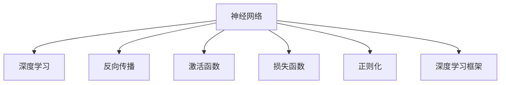

                 

## 1. 背景介绍

### 1.1 问题由来
神经网络是现代人工智能(AI)的核心技术之一。从深度学习技术的崛起，到近年来的突破性进展，神经网络在图像识别、语音识别、自然语言处理、推荐系统等领域取得了非凡的成就。人工智能领域的许多重要应用，如自动驾驶、智能医疗、智能客服、智能家居等，都离不开神经网络的支持。

然而，对于许多初学者来说，神经网络的理论基础和计算原理仍然深奥难懂。为了更好地理解神经网络，本文将从背景、核心概念、算法原理、实际应用等方面，全面介绍神经网络的工作原理及其在人工智能中的重要作用。

### 1.2 问题核心关键点
神经网络的核心思想是通过模拟人脑的神经元之间的工作机制，实现复杂数据的高级抽象和智能推理。其核心关键点包括：

- 神经元：神经网络的最小单元，模拟人脑神经元的工作原理，具有输入、权重、偏置和输出等属性。
- 层：多个神经元按一定规则连接成的网络层，每层神经元输入的权重和偏置参数不同，从而实现数据的逐层抽象和特征提取。
- 激活函数：用于引入非线性特性，增强网络的表达能力，如sigmoid、ReLU等。
- 损失函数：用于度量模型预测输出与真实标签之间的差异，常见的有交叉熵、均方误差等。
- 反向传播算法：用于计算损失函数对模型参数的梯度，基于梯度下降等优化算法，迭代更新模型参数。
- 正则化：用于避免模型过拟合，常见的有L1/L2正则、Dropout、Early Stopping等。
- 深度学习框架：如TensorFlow、PyTorch等，提供了高效的神经网络模型构建和训练工具。

这些关键点共同构成了神经网络的基本框架和计算原理。通过理解这些核心概念，我们可以更好地掌握神经网络的工作原理，为其在人工智能中的应用奠定基础。

### 1.3 问题研究意义
神经网络的研究对推动人工智能技术的进步具有重要意义：

1. 提升智能系统性能：神经网络通过大量数据训练，可以学习到复杂的数据模式和特征，从而在各种智能任务中表现优异。
2. 促进跨学科融合：神经网络不仅在计算机科学领域取得了突破，还在生物神经科学、心理学、语言学等领域引发了广泛关注和研究。
3. 加速技术创新：神经网络的快速发展推动了人工智能技术在各垂直行业的深度应用，如自动驾驶、医疗诊断、智能客服等。
4. 带动产业变革：智能系统的广泛应用，将重塑各行业的商业模式和工作流程，带来全新的发展机遇。

## 2. 核心概念与联系

### 2.1 核心概念概述

为更好地理解神经网络，本节将介绍几个密切相关的核心概念：

- 神经网络(Neural Network)：由多层神经元组成的计算模型，用于实现复杂数据的抽象和推理。
- 深度学习(Deep Learning)：一种基于神经网络的机器学习方法，通过多层次的特征提取，实现对高维数据的高级建模。
- 反向传播(Backpropagation)：一种计算神经网络模型参数梯度的优化算法，通过逐层反向传播误差信号，更新模型参数。
- 激活函数(Activation Function)：用于引入非线性特性，增强网络的表达能力，如sigmoid、ReLU等。
- 损失函数(Loss Function)：用于度量模型预测输出与真实标签之间的差异，常见的有交叉熵、均方误差等。
- 正则化(Regularization)：用于避免模型过拟合，常见的有L1/L2正则、Dropout、Early Stopping等。
- 深度学习框架：如TensorFlow、PyTorch等，提供了高效的神经网络模型构建和训练工具。

这些核心概念之间的逻辑关系可以通过以下Mermaid流程图来展示：



这个流程图展示了神经网络与其他核心概念的紧密联系：

1. 神经网络是深度学习的核心模型。
2. 反向传播算法是神经网络训练的关键。
3. 激活函数和损失函数用于增强网络的表达能力和模型评估。
4. 正则化技术用于防止过拟合，提高模型的泛化能力。
5. 深度学习框架提供了高效的工具支持，使得神经网络模型的构建和训练更加便捷。

这些概念共同构成了神经网络的基本框架和计算原理，为其在人工智能中的应用提供了坚实的基础。

## 3. 核心算法原理 & 具体操作步骤

### 3.1 算法原理概述

神经网络的核心思想是通过模拟人脑的神经元之间的工作机制，实现复杂数据的高级抽象和智能推理。其核心算法原理包括：

1. 神经元模型：模拟人脑神经元的工作原理，具有输入、权重、偏置和输出等属性。
2. 层级结构：多个神经元按一定规则连接成的网络层，每层神经元输入的权重和偏置参数不同，从而实现数据的逐层抽象和特征提取。
3. 激活函数：用于引入非线性特性，增强网络的表达能力。
4. 损失函数：用于度量模型预测输出与真实标签之间的差异。
5. 反向传播算法：用于计算损失函数对模型参数的梯度，基于梯度下降等优化算法，迭代更新模型参数。
6. 正则化技术：用于避免模型过拟合，提高模型的泛化能力。

这些算法原理共同构成了神经网络的基本框架和计算原理。通过理解这些核心概念，我们可以更好地掌握神经网络的工作原理，为其在人工智能中的应用奠定基础。

### 3.2 算法步骤详解

神经网络的训练过程通常包括以下几个关键步骤：

1. 准备数据集：收集和预处理训练数据集，通常分为训练集、验证集和测试集。
2. 设计网络结构：确定神经网络的结构，包括网络层数、每层神经元数、激活函数、损失函数等。
3. 初始化参数：随机初始化网络参数，如权重、偏置等。
4. 前向传播：将训练数据输入网络，逐层计算得到模型输出。
5. 计算损失：将模型输出与真实标签计算损失，得到误差信号。
6. 反向传播：根据误差信号，计算各层参数的梯度。
7. 参数更新：基于梯度下降等优化算法，更新网络参数。
8. 评估模型：在验证集和测试集上评估模型性能，调整超参数。

重复以上步骤，直到模型收敛或达到预设的迭代轮数。最终的模型可以用于各种智能任务，如图像识别、语音识别、自然语言处理等。

### 3.3 算法优缺点

神经网络算法具有以下优点：

1. 表达能力强：多层次的特征提取和抽象能力，使得神经网络可以处理复杂的非线性关系。
2. 泛化能力强：通过大量数据训练，可以学习到复杂的数据模式和特征，从而在各种智能任务中表现优异。
3. 适应性强：神经网络结构灵活，可以通过增加网络层数或神经元数，适应不同的数据和任务。

同时，神经网络算法也存在以下缺点：

1. 参数量大：神经网络的参数量通常很大，训练和推理需要较高的计算资源。
2. 过拟合风险：神经网络容易过拟合，特别是面对小规模数据集时，需要采用正则化等技术避免过拟合。
3. 训练难度高：神经网络的训练过程复杂，需要设计合适的网络结构和优化算法，才能得到理想的结果。
4. 可解释性差：神经网络通常被视为"黑盒"系统，难以解释其内部工作机制和决策逻辑。

尽管存在这些局限性，但神经网络仍然是当前最有效的机器学习方法之一，在人工智能的各个领域取得了显著的成就。

### 3.4 算法应用领域

神经网络算法在人工智能领域的应用非常广泛，涵盖了以下几个主要领域：

1. 图像识别：通过卷积神经网络(CNN)，神经网络可以实现对图像的高效分类和识别，如图像分割、目标检测等。
2. 语音识别：通过循环神经网络(RNN)和长短期记忆网络(LSTM)，神经网络可以处理时间序列数据，实现对语音的识别和生成。
3. 自然语言处理：通过序列模型如LSTM、GRU和Transformer，神经网络可以实现对文本数据的高级建模，如机器翻译、文本生成、情感分析等。
4. 推荐系统：通过协同过滤和矩阵分解等模型，神经网络可以实现对用户行为数据的智能分析，推荐个性化内容。
5. 自动驾驶：通过深度学习和计算机视觉技术，神经网络可以实现对车辆周围环境的感知和决策，提升自动驾驶系统的安全性。
6. 医疗诊断：通过图像分割和诊断模型，神经网络可以实现对医疗影像的高效分析和诊断，提升医疗服务水平。

此外，神经网络还在金融风控、智能客服、智能家居等多个领域得到了广泛应用，为各行各业带来了深远的变革。

## 4. 数学模型和公式 & 详细讲解  
### 4.1 数学模型构建

神经网络的核心数学模型基于多层感知机(Multilayer Perceptron, MLP)，其结构如下：

- 输入层：输入数据 $x$，通常表示为向量形式 $\vec{x} \in \mathbb{R}^d$。
- 隐藏层： $k$ 个隐藏层 $h_1, h_2, ..., h_k$，每层神经元数量为 $n_1, n_2, ..., n_k$。
- 输出层： $m$ 个输出节点 $o_1, o_2, ..., o_m$，表示为向量形式 $\vec{y} \in \mathbb{R}^m$。

各层神经元的计算方式如下：

- 隐藏层神经元 $h_i$ 的输入为上一层所有神经元的输出 $h_{i-1}$，计算方式为：
  $$
  h_i = f(\sum_{j=1}^{n_{i-1}} w_{ij} h_{i-1} + b_i)
  $$
  其中 $f$ 为激活函数， $w_{ij}$ 为权重， $b_i$ 为偏置。
- 输出层神经元 $o_j$ 的输入为所有隐藏层神经元的输出 $h_k$，计算方式为：
  $$
  o_j = f(\sum_{i=1}^{k} w_{ij} h_i + b_j)
  $$

整个神经网络的输出为所有输出节点的平均值或最大值，表示为 $\hat{y} \in \mathbb{R}^m$。

### 4.2 公式推导过程

下面以二分类问题为例，推导神经网络的损失函数及其梯度计算公式。

假设神经网络的输出为 $\hat{y} \in [0,1]$，表示样本属于正类的概率。真实标签 $y \in \{0,1\}$。则二分类交叉熵损失函数定义为：
$$
\ell(\hat{y},y) = -y \log \hat{y} + (1-y) \log (1-\hat{y})
$$

将其代入经验风险公式，得：
$$
\mathcal{L}(\theta) = \frac{1}{N} \sum_{i=1}^N \ell(\hat{y}_i,y_i)
$$

其中 $\theta$ 为神经网络的所有参数，包括权重和偏置。在得到损失函数之后，我们需要计算其对各参数的梯度，以更新模型参数。

根据链式法则，输出层神经元 $o_j$ 的损失对权重 $w_{ij}$ 的梯度为：
$$
\frac{\partial \mathcal{L}}{\partial w_{ij}} = \frac{\partial \mathcal{L}}{\partial o_j} \frac{\partial o_j}{\partial h_i} \frac{\partial h_i}{\partial w_{ij}}
$$

其中 $\frac{\partial o_j}{\partial h_i}$ 和 $\frac{\partial h_i}{\partial w_{ij}}$ 分别为激活函数的导数和神经元的输出导数，可通过反向传播算法高效计算。

在得到损失函数的梯度后，即可带入优化算法，完成模型的迭代优化。重复上述过程直至收敛，最终得到适应特定任务的神经网络模型。

## 5. 项目实践：代码实例和详细解释说明
### 5.1 开发环境搭建

在进行神经网络开发前，我们需要准备好开发环境。以下是使用Python进行TensorFlow开发的环境配置流程：

1. 安装Anaconda：从官网下载并安装Anaconda，用于创建独立的Python环境。

2. 创建并激活虚拟环境：
```bash
conda create -n tensorflow-env python=3.8 
conda activate tensorflow-env
```

3. 安装TensorFlow：根据CUDA版本，从官网获取对应的安装命令。例如：
```bash
conda install tensorflow=2.7 -c conda-forge
```

4. 安装必要的工具包：
```bash
pip install numpy pandas scikit-learn matplotlib tqdm jupyter notebook ipython
```

完成上述步骤后，即可在`tensorflow-env`环境中开始神经网络项目的开发。

### 5.2 源代码详细实现

下面以手写数字识别(MNIST)为例，给出使用TensorFlow进行神经网络开发的PyTorch代码实现。

首先，导入必要的库：

```python
import tensorflow as tf
from tensorflow.keras import datasets, layers, models
import matplotlib.pyplot as plt
```

然后，加载数据集并进行预处理：

```python
(train_images, train_labels), (test_images, test_labels) = datasets.mnist.load_data()

train_images = train_images.reshape((60000, 28, 28, 1))
test_images = test_images.reshape((10000, 28, 28, 1))
train_images, test_images = train_images / 255.0, test_images / 255.0
```

接着，构建神经网络模型：

```python
model = models.Sequential([
    layers.Conv2D(32, (3,3), activation='relu', input_shape=(28, 28, 1)),
    layers.MaxPooling2D((2, 2)),
    layers.Flatten(),
    layers.Dense(10, activation='softmax')
])
```

然后，编译模型并训练：

```python
model.compile(optimizer='adam',
              loss='sparse_categorical_crossentropy',
              metrics=['accuracy'])

history = model.fit(train_images, train_labels, epochs=5,
                    validation_data=(test_images, test_labels))
```

最后，评估模型并可视化训练过程：

```python
test_loss, test_acc = model.evaluate(test_images, test_labels, verbose=2)
print('\nTest accuracy:', test_acc)

plt.plot(history.history['accuracy'], label='accuracy')
plt.plot(history.history['val_accuracy'], label='val_accuracy')
plt.xlabel('Epoch')
plt.ylabel('Accuracy')
plt.legend()
plt.show()
```

以上就是使用TensorFlow进行神经网络开发的完整代码实现。可以看到，TensorFlow提供了强大的高层API，使得模型构建和训练变得非常便捷。

### 5.3 代码解读与分析

让我们再详细解读一下关键代码的实现细节：

**神经网络模型构建**：
- `train_images` 和 `train_labels` 是训练集的图像和标签。
- `test_images` 和 `test_labels` 是测试集的图像和标签。
- `train_images` 和 `test_images` 需要展平，使其成为一维向量。
- 使用 `relu` 激活函数和 `softmax` 输出层，构建一个简单的卷积神经网络。

**模型编译和训练**：
- `model.compile` 用于配置模型，设置优化器、损失函数和评价指标。
- `model.fit` 用于训练模型，指定训练集、验证集和迭代轮数。
- `history` 记录了训练过程中的损失和准确率，用于后续的可视化。

**模型评估和可视化**：
- `model.evaluate` 用于评估模型在测试集上的表现。
- `plt.plot` 用于绘制训练和验证集的准确率变化曲线，直观显示模型的学习过程。

可以看到，TensorFlow提供了一系列高层API，使得神经网络模型的开发和训练变得非常直观和高效。开发者可以更专注于模型架构的设计和超参数的调优，而不必过多关注底层实现细节。

当然，工业级的系统实现还需考虑更多因素，如模型的保存和部署、超参数的自动搜索、更灵活的模型适配层等。但核心的神经网络构建和训练过程基本与此类似。

## 6. 实际应用场景

### 6.1 图像识别

图像识别是神经网络的重要应用之一。通过卷积神经网络(CNN)，神经网络可以高效地从图像中提取特征并进行分类。目前，CNN在图像识别领域取得了广泛应用，如图像分割、目标检测、人脸识别等。

在图像分割任务中，神经网络通过卷积操作提取图像的局部特征，通过池化操作缩小特征图的尺寸，并通过全连接层将特征图转换为分类结果。在目标检测任务中，神经网络通过候选框预测、非极大值抑制等技术，实现对图像中目标的精确定位和分类。

### 6.2 语音识别

语音识别是神经网络的另一重要应用。通过循环神经网络(RNN)和长短期记忆网络(LSTM)，神经网络可以高效地处理时间序列数据，实现对语音的识别和生成。目前，RNN和LSTM在语音识别领域取得了广泛应用，如语音转文字、语音合成等。

在语音转文字任务中，神经网络通过RNN或LSTM对语音信号进行建模，通过softmax层将时间序列转换为文字序列。在语音合成任务中，神经网络通过生成对抗网络(GAN)或变分自编码器(VAE)等技术，实现对文字序列的语音生成。

### 6.3 自然语言处理

自然语言处理(NLP)是神经网络的重要应用之一。通过序列模型如LSTM、GRU和Transformer，神经网络可以实现对文本数据的高级建模，如机器翻译、文本生成、情感分析等。目前，神经网络在NLP领域取得了广泛应用，如机器翻译、情感分析、问答系统等。

在机器翻译任务中，神经网络通过编码器-解码器结构，将源语言文本编码为序列表示，并解码为目标语言文本。在文本生成任务中，神经网络通过生成对抗网络(GAN)或变分自编码器(VAE)等技术，实现对文本序列的生成。在情感分析任务中，神经网络通过情感分类器，实现对文本情感的自动识别和分类。

### 6.4 未来应用展望

随着神经网络技术的发展，未来将有更多领域受益于神经网络的应用：

1. 医疗诊断：通过深度学习和计算机视觉技术，神经网络可以实现对医疗影像的高效分析和诊断，提升医疗服务水平。
2. 智能制造：通过智能控制系统，神经网络可以实现对生产设备的智能调度和管理，提升生产效率和质量。
3. 自动驾驶：通过深度学习和计算机视觉技术，神经网络可以实现对车辆周围环境的感知和决策，提升自动驾驶系统的安全性。
4. 智慧城市：通过智能控制系统，神经网络可以实现对城市交通、能源、环境等系统的优化和调度，提升城市运行效率和管理水平。

神经网络的应用前景广阔，将在更多领域带来变革性的影响。未来，随着技术的不断进步和应用的深入，神经网络必将在各个领域发挥更加重要的作用。

## 7. 工具和资源推荐
### 7.1 学习资源推荐

为了帮助开发者系统掌握神经网络的理论基础和实践技巧，这里推荐一些优质的学习资源：

1. 《深度学习》系列书籍：由Ian Goodfellow、Yoshua Bengio和Aaron Courville所著，是深度学习领域的经典教材，系统介绍了深度学习的基本概念和前沿技术。
2. CS231n《卷积神经网络》课程：斯坦福大学开设的深度学习课程，系统介绍了卷积神经网络的理论和实践，适合对图像识别感兴趣的读者。
3. CS224n《序列建模》课程：斯坦福大学开设的深度学习课程，系统介绍了序列建模和自然语言处理的基本概念和前沿技术，适合对NLP感兴趣的读者。
4. PyTorch官方文档：PyTorch官方提供的文档和教程，介绍了PyTorch的使用方法和最佳实践，适合对神经网络开发感兴趣的读者。
5. TensorFlow官方文档：TensorFlow官方提供的文档和教程，介绍了TensorFlow的使用方法和最佳实践，适合对神经网络开发感兴趣的读者。

通过对这些资源的学习实践，相信你一定能够快速掌握神经网络的工作原理，并用于解决实际的智能任务。

### 7.2 开发工具推荐

高效的开发离不开优秀的工具支持。以下是几款用于神经网络开发的常用工具：

1. PyTorch：由Facebook开发的深度学习框架，动态计算图和丰富的API支持，使得模型构建和训练变得非常便捷。
2. TensorFlow：由Google开发的深度学习框架，生产部署方便，适合大规模工程应用。
3. Keras：基于TensorFlow和Theano的高级API，提供了简洁易用的API接口，使得模型构建和训练变得非常直观。
4. JAX：由Google开发的机器学习库，支持动态计算图和自动微分，提供了高效的神经网络开发工具。
5. MXNet：由亚马逊开发的深度学习框架，支持多语言API，提供了高效的分布式训练和推理工具。

合理利用这些工具，可以显著提升神经网络开发的效率，加速模型训练和推理的进程。

### 7.3 相关论文推荐

神经网络的研究源于学界的持续研究。以下是几篇奠基性的相关论文，推荐阅读：

1. A Three-layer Perceptron for Handwritten Digit Recognition（MLP）：1989年，Yann LeCun等人在《Neural Computation》上发表的经典论文，提出了多层感知机模型，奠定了神经网络的基础。
2. ImageNet Classification with Deep Convolutional Neural Networks（CNN）：2012年，Alex Krizhevsky等人在《Advances in Neural Information Processing Systems》上发表的经典论文，提出了卷积神经网络模型，取得了图像识别任务的突破。
3. Learning Phrase Representations using RNN Encoder–Decoder for Statistical Machine Translation（RNN）：2014年，Ilya Sutskever等人在《NeurIPS》上发表的经典论文，提出了循环神经网络模型，取得了机器翻译任务的突破。
4. Deep Residual Learning for Image Recognition（ResNet）：2015年，Kaiming He等人在《IEEE Transactions on Pattern Analysis and Machine Intelligence》上发表的经典论文，提出了残差网络模型，取得了图像识别任务的突破。
5. Attention is All You Need（Transformer）：2017年，Ashish Vaswani等人在《NeurIPS》上发表的经典论文，提出了Transformer模型，取得了自然语言处理任务的突破。

这些论文代表了大神经网络的发展脉络。通过学习这些前沿成果，可以帮助研究者把握学科前进方向，激发更多的创新灵感。

## 8. 总结：未来发展趋势与挑战

### 8.1 总结

本文对神经网络的工作原理进行了全面系统的介绍。首先阐述了神经网络的研究背景和核心概念，明确了神经网络在人工智能中的重要地位。其次，从原理到实践，详细讲解了神经网络的基本框架和计算原理，给出了神经网络模型开发的完整代码实现。同时，本文还探讨了神经网络在实际应用中的广泛应用，展示了其在各个领域的巨大潜力。

通过本文的系统梳理，可以看到，神经网络作为人工智能的核心技术，正在驱动各个领域的深度变革。未来的研究需要在深度学习、计算机视觉、自然语言处理等多个方向进行更深入的探索，不断提升神经网络的效果和性能。

### 8.2 未来发展趋势

展望未来，神经网络的发展将呈现以下几个趋势：

1. 深度学习模型的复杂度将继续提升。随着计算资源和数据量的不断增加，神经网络模型的规模和复杂度将进一步扩大，从而在更多领域取得突破性进展。
2. 跨模态学习将获得更多关注。神经网络将更多地应用于多模态数据的融合和协同建模，如视觉、语音、文本等的联合学习。
3. 神经网络的可解释性和可解释性将得到更多重视。研究者将更多地关注神经网络的黑盒特性，探索如何引入符号化的先验知识和因果推理，增强模型的可解释性和鲁棒性。
4. 神经网络的鲁棒性和泛化性将得到更多研究。未来，神经网络将更多地应用于实际应用场景，解决数据分布不均衡和过拟合等问题。
5. 神经网络的应用领域将进一步拓展。神经网络将在更多的垂直行业获得应用，如医疗、制造、智能交通等，带来深远的变革性影响。

### 8.3 面临的挑战

尽管神经网络在人工智能领域取得了巨大成就，但在迈向更加智能化、普适化应用的过程中，仍面临诸多挑战：

1. 计算资源瓶颈：神经网络的训练和推理需要大量计算资源，特别是在大规模数据集和复杂模型上，对硬件设备提出了更高的要求。
2. 数据获取难题：深度学习模型通常需要大规模标注数据进行训练，获取高质量标注数据的成本较高，且存在数据分布不均衡等问题。
3. 模型鲁棒性不足：神经网络模型面对未知数据时，泛化能力有限，容易产生过拟合和灾难性遗忘等问题。
4. 模型复杂度高：神经网络模型的复杂度高，难以理解和调试，导致其在实际应用中的可解释性和可控性不足。
5. 数据隐私和伦理问题：深度学习模型通常需要大量数据进行训练，存在隐私泄露和伦理风险。

### 8.4 研究展望

面对神经网络面临的挑战，未来的研究需要在以下几个方向寻求新的突破：

1. 开发更高效的神经网络架构。如神经网络剪枝、压缩等技术，提高神经网络的推理效率和可解释性。
2. 探索更高效的深度学习算法。如基于量子计算的深度学习算法，提高神经网络的计算效率和模型的可解释性。
3. 引入更多先验知识。将符号化的先验知识与神经网络模型进行融合，增强模型的可解释性和鲁棒性。
4. 研究神经网络的黑盒特性。探索如何引入符号化的先验知识和因果推理，增强模型的可解释性和鲁棒性。
5. 解决数据隐私和伦理问题。如差分隐私技术，保护数据隐私，增强模型的伦理安全性。

这些研究方向将引领神经网络技术迈向更高的台阶，为构建安全、可靠、可解释、可控的智能系统铺平道路。面向未来，神经网络需要与其他人工智能技术进行更深入的融合，如知识表示、因果推理、强化学习等，多路径协同发力，共同推动自然语言理解和智能交互系统的进步。只有勇于创新、敢于突破，才能不断拓展神经网络的边界，让智能技术更好地造福人类社会。

## 9. 附录：常见问题与解答

**Q1：神经网络是否只能用于图像和文本数据？**

A: 神经网络的应用领域非常广泛，除了图像和文本数据外，还可以应用于时间序列数据、音频数据等多种类型的数据。例如，在语音识别任务中，神经网络可以处理音频信号；在推荐系统任务中，神经网络可以处理用户行为数据。

**Q2：神经网络训练过程中如何进行正则化？**

A: 神经网络的训练过程中，常见的正则化方法包括L1/L2正则、Dropout、Early Stopping等。L1/L2正则通过添加L1或L2范数，限制权重的大小，防止过拟合；Dropout通过随机丢弃神经元，减少神经元之间的依赖关系，提高模型的泛化能力；Early Stopping通过在验证集上监控模型性能，防止模型在训练集上过拟合。

**Q3：神经网络训练过程中如何处理过拟合问题？**

A: 神经网络在训练过程中容易过拟合，特别是面对小规模数据集时。常见的处理方法包括：
1. 数据增强：通过回译、近义替换等方式扩充训练集。
2. 正则化：使用L1/L2正则、Dropout、Early Stopping等技术。
3. 模型简化：减少网络层数或神经元数量，降低模型复杂度。
4. 参数共享：共享网络层参数，减少需要优化的参数数量。

这些方法通常需要根据具体任务和数据特点进行灵活组合。只有在数据、模型、训练、推理等各环节进行全面优化，才能最大限度地发挥神经网络的效果。

**Q4：神经网络训练过程中如何进行超参数调优？**

A: 神经网络的训练过程中，超参数如学习率、批大小、迭代轮数等对模型性能有重要影响。常见的超参数调优方法包括网格搜索、随机搜索、贝叶斯优化等。网格搜索通过遍历超参数空间，找到最优超参数组合；随机搜索通过随机采样超参数组合，加速超参数搜索过程；贝叶斯优化通过建立超参数与性能的关系模型，高效地搜索最优超参数。

**Q5：神经网络在实际应用中如何部署？**

A: 神经网络的实际应用通常需要进行模型裁剪、量化加速、服务化封装等操作，以实现高效的推理和部署。具体步骤包括：
1. 模型裁剪：去除不必要的层和参数，减小模型尺寸，加快推理速度。
2. 量化加速：将浮点模型转为定点模型，压缩存储空间，提高计算效率。
3. 服务化封装：将模型封装为标准化服务接口，便于集成调用。
4. 弹性伸缩：根据请求流量动态调整资源配置，平衡服务质量和成本。
5. 监控告警：实时采集系统指标，设置异常告警阈值，确保服务稳定性。

合理利用这些工具，可以显著提升神经网络在实际应用中的效率和可靠性。

---

作者：禅与计算机程序设计艺术 / Zen and the Art of Computer Programming

