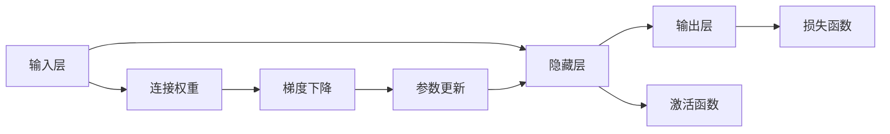

                 

## 1. 背景介绍

### 1.1 问题由来

随着人工智能技术的飞速发展，神经网络(Neural Networks)作为一种模拟人脑工作机制的计算模型，在诸多领域，包括计算机视觉、语音识别、自然语言处理等方面，展现出强大的泛化能力和解决复杂问题的潜力。神经网络不仅在学术界受到广泛关注，也在工业界迅速落地应用，显著提升了各行业的自动化和智能化水平。

然而，神经网络并非万能的，其设计和应用过程中仍存在诸多挑战。从模型的可解释性、鲁棒性、安全性，到计算效率、资源消耗，这些问题不断困扰着研究人员和工程师。更为重要的是，随着神经网络越来越深入人类社会生活各个层面，其所带来的伦理道德问题，也越来越引人关注。如何在保障技术进步的同时，保持人机和谐共存，成为当下学术和工业界共同关注的重要课题。

### 1.2 问题核心关键点

神经网络是一种具有多层结构和多个节点的计算模型，通过模仿人脑神经元之间的连接关系和信息传递方式，实现数据的非线性映射和特征提取。神经网络主要分为前馈神经网络、卷积神经网络、循环神经网络等几种类型，每种网络结构都有其特定的应用场景。

神经网络的核心目标是通过训练数据，调整网络参数，使其能够更好地拟合目标函数，解决特定问题。训练过程主要通过反向传播算法实现，通过迭代优化参数，使网络输出的预测结果与真实标签尽量接近。训练完成后，神经网络可以被用于对新数据进行预测和推理，进而实现自动化决策和智能交互。

神经网络在实际应用中，面临诸多挑战，包括但不限于：
- 计算资源消耗大。神经网络通常需要大量的计算资源，包括高性能GPU/TPU等硬件设备，以及大量的数据和训练时间。
- 模型可解释性差。神经网络的复杂结构和高度非线性特征，使得其决策过程难以被理解和解释。
- 泛化能力受限。神经网络容易过拟合，对新样本的泛化能力不足，需要大量标注数据进行训练。
- 鲁棒性问题。神经网络在面对输入扰动、对抗样本时，容易产生误判，影响系统安全性。
- 道德伦理风险。神经网络可能被用于制造假新闻、误导性信息传播，甚至在关键领域造成决策失误。

这些挑战不仅限制了神经网络的应用范围，也引发了公众对于技术伦理和安全性的广泛讨论。如何平衡技术发展与人文关怀，实现人类与机器的和谐共存，是当下亟需思考和解决的问题。

### 1.3 问题研究意义

神经网络技术的进步，不仅带来了新一轮的技术革命，也深刻改变了人类社会的运行方式。机器在辅助决策、提升效率等方面发挥着越来越重要的作用，然而过度依赖机器可能导致人类在一定程度上丧失主动权和创造力。因此，研究如何在人类与机器之间建立平衡，既充分发挥机器的智能优势，又避免其对人类自主性的威胁，具有重要意义。

具体而言，神经网络技术的研究和发展，对于以下几个方面具有重要意义：

1. **促进产业升级**：神经网络在各个行业的应用，如制造业、金融、医疗等，可以提高生产效率，降低运营成本，加速产业智能化转型。
2. **提升决策质量**：神经网络可以通过海量数据训练，发现人类难以发现的模式和规律，提升决策的准确性和及时性。
3. **推动科学研究**：神经网络可以用于模拟复杂的自然现象和生物过程，为科学研究和创新提供新的方法和工具。
4. **增强社会福祉**：在教育、公共服务、灾害预警等领域，神经网络可以提高服务质量，改善民众的生活水平。
5. **平衡技术伦理**：神经网络技术的应用，需要建立伦理道德框架，确保技术的应用不会损害人类的尊严和利益。

总之，神经网络技术的深入研究和应用，是人类与机器共存的重要基础。平衡技术进步与伦理道德，实现人类与机器的和谐共生，将是未来研究的重大课题。

## 2. 核心概念与联系

### 2.1 核心概念概述

神经网络主要由输入层、若干个隐藏层和输出层组成。每个节点对应于神经元，通过连接权重调整信息传递。神经网络的输入层接收外部数据，隐藏层进行特征提取和模式识别，输出层产生最终的预测结果。

神经网络的训练过程，主要通过反向传播算法实现。训练数据被输入网络，前向传播计算输出结果，然后通过对比真实标签和预测结果，计算损失函数。反向传播算法根据损失函数的梯度，更新网络权重和偏置，优化模型性能。

神经网络的核心概念包括：
- 神经元：神经网络的基本单元，模拟人脑神经元。
- 连接权重：神经元之间的连接系数，用于调整信息的传递强度。
- 激活函数：对神经元输出进行非线性变换，增强模型的表达能力。
- 损失函数：衡量模型预测结果与真实标签之间的差距，用于优化模型参数。
- 正则化技术：避免过拟合，提高模型泛化能力。
- 梯度下降：一种常用的优化算法，通过迭代调整参数，最小化损失函数。

### 2.2 核心概念原理和架构的 Mermaid 流程图



该流程图展示了神经网络的基本架构和训练流程：

1. 输入层接收外部数据，通过连接权重传递信息。
2. 隐藏层对信息进行非线性变换，提取特征。
3. 输出层产生最终的预测结果。
4. 损失函数计算预测结果与真实标签的差距。
5. 梯度下降算法根据损失函数的梯度，调整连接权重和激活函数的参数。
6. 参数更新后，重新输入数据进行下一轮训练。

这个流程不断迭代，直至收敛，得到最优的模型参数。

## 3. 核心算法原理 & 具体操作步骤

### 3.1 算法原理概述

神经网络的核心算法原理是反向传播算法，其核心思想是利用梯度下降算法，通过迭代更新网络参数，最小化损失函数。反向传播算法通过链式法则，计算每个参数对损失函数的偏导数，即梯度，从而更新参数。

反向传播算法的具体步骤如下：
1. 前向传播计算输出结果。
2. 计算损失函数，衡量预测结果与真实标签的差异。
3. 反向传播计算梯度，将损失函数的梯度逐层传递到每个参数。
4. 使用梯度下降算法，根据梯度更新参数。
5. 重复以上步骤，直至收敛或达到预设的迭代次数。

### 3.2 算法步骤详解

以一个简单的全连接神经网络为例，介绍反向传播算法的详细步骤：

假设网络包含一个输入层、两个隐藏层和一个输出层，每个隐藏层包含3个神经元，输出层为1个神经元。设输入样本为 $x=[0.1,0.2,0.3]$，网络参数为 $W_1=[0.5,0.5,0.5]$、$W_2=[0.8,0.8,0.8]$、$W_3=[0.6,0.6,0.6]$、$b_1=0$、$b_2=0$、$b_3=0$，激活函数为 $f(x)=\max(0,x)$，损失函数为均方误差。

具体步骤如下：

1. 前向传播计算输出结果。
   - 输入层到第一个隐藏层的输出：$z_1=W_1x+b_1=[0.55,0.55,0.55]$
   - 第一个隐藏层到第二个隐藏层的输出：$z_2=f(z_1)=[0.55,0.55,0.55]$
   - 第二个隐藏层到输出层的输出：$z_3=W_3z_2+b_3=[0.66,0.66,0.66]$
   - 输出层的输出：$y=f(z_3)=[0.66,0.66,0.66]$

2. 计算损失函数。
   - 假设真实标签为 $y_t=[0.5,0.5,0.5]$，均方误差损失函数为 $\ell(y,y_t)=\frac{1}{2}\sum(y-y_t)^2$。
   - 计算损失值：$\ell(y,y_t)=\frac{1}{2}(0.14)^2+\frac{1}{2}(0.14)^2+\frac{1}{2}(0.14)^2=0.002$。

3. 反向传播计算梯度。
   - 输出层的梯度：$\frac{\partial\ell}{\partial z_3}=-0.28$
   - 第二层到第三层的梯度：$\frac{\partial\ell}{\partial z_2}=\frac{\partial\ell}{\partial z_3}\frac{\partial f(z_3)}{\partial z_3}=-0.28$
   - 第一层到第二层的梯度：$\frac{\partial\ell}{\partial z_1}=\frac{\partial\ell}{\partial z_2}\frac{\partial f(z_2)}{\partial z_2}=-0.28$
   - 输入到第一层的梯度：$\frac{\partial\ell}{\partial x}=\frac{\partial\ell}{\partial z_1}\frac{\partial f(z_1)}{\partial z_1}=-0.35$
   - 计算梯度向量：$\nabla\ell=[-0.35,-0.35,-0.35]$

4. 使用梯度下降算法更新参数。
   - 更新权重 $W_1$：$W_1=W_1-\eta\nabla\ell=[0.35,0.35,0.35]$
   - 更新权重 $W_2$：$W_2=W_2-\eta\nabla\ell=[0.08,0.08,0.08]$
   - 更新权重 $W_3$：$W_3=W_3-\eta\nabla\ell=[0.14,0.14,0.14]$
   - 更新偏置 $b_1$、$b_2$、$b_3$：$b_1=b_1-\eta\nabla\ell=[-0.35,-0.35,-0.35]$，其他偏置参数不变。

### 3.3 算法优缺点

神经网络的优点包括：
- 强大的非线性表达能力。神经网络能够处理非线性的复杂关系，实现复杂模式的识别和分类。
- 灵活的模型结构。神经网络可以根据任务需求设计不同的网络结构，适应多种类型的输入输出。
- 广泛的应用范围。神经网络在图像、语音、文本等多个领域都有广泛的应用，展现出强大的通用性。

神经网络的缺点包括：
- 计算资源消耗大。神经网络需要大量的计算资源和存储空间，尤其对于大规模深度学习模型，硬件成本高昂。
- 模型复杂度高。神经网络参数量庞大，结构复杂，难以理解和调试。
- 训练时间长。神经网络需要大量的标注数据和计算时间进行训练，对于某些复杂任务，训练过程非常耗时。
- 泛化能力受限。神经网络容易过拟合，对新样本泛化能力不足。
- 可解释性差。神经网络的黑盒特性，使得其决策过程难以被理解和解释。

### 3.4 算法应用领域

神经网络技术已经广泛应用于以下几个领域：

1. **计算机视觉**：神经网络被广泛应用于图像分类、目标检测、图像分割、人脸识别等任务。卷积神经网络(CNN)是计算机视觉领域的主流模型。

2. **语音识别**：神经网络在语音识别和自然语言处理领域表现优异，能够实现自动语音识别、语音合成等任务。

3. **自然语言处理**：神经网络在自然语言处理领域，如机器翻译、文本生成、情感分析等，都有广泛应用。

4. **推荐系统**：神经网络被用于推荐系统的构建，能够实现个性化推荐，提升用户体验。

5. **机器人控制**：神经网络在机器人控制领域，用于实现机器人行为决策和路径规划。

6. **金融分析**：神经网络在金融领域，用于风险评估、信用评分、股票预测等任务。

7. **医疗诊断**：神经网络在医疗领域，用于医学影像分析、疾病预测、药物研发等。

## 4. 数学模型和公式 & 详细讲解  
### 4.1 数学模型构建

神经网络模型的数学模型可以表示为：

$$
y=f(Wx+b)
$$

其中，$x$ 为输入向量，$y$ 为输出向量，$W$ 为权重矩阵，$b$ 为偏置向量，$f$ 为激活函数。激活函数通常为非线性的，常用的激活函数包括 Sigmoid、ReLU、Tanh 等。

神经网络的损失函数通常为均方误差损失函数，表示为：

$$
\ell(y,y_t)=\frac{1}{2}\sum(y-y_t)^2
$$

其中，$y_t$ 为真实标签向量，$\sum$ 表示对所有样本的平均。

### 4.2 公式推导过程

以一个简单的全连接神经网络为例，介绍均方误差损失函数的推导过程：

设神经网络包含 $n$ 个输入样本，每个样本的输入为 $x_i$，真实标签为 $y_{ti}$，预测结果为 $y_i$。假设神经网络由 $k$ 个隐藏层构成，每层包含 $h_i$ 个神经元。权重矩阵和偏置向量分别为 $W_1^{(i)}$、$b_1^{(i)}$、$W_2^{(i)}$、$b_2^{(i)}$、...、$W_k^{(i)}$、$b_k^{(i)}$。激活函数为 $f$。

均方误差损失函数的推导步骤如下：

1. 前向传播计算预测结果。
   - 输入层到隐藏层 1：$z_1^{(i)}=W_1^{(i)}x_i+b_1^{(i)}$
   - 隐藏层 1 到隐藏层 2：$z_2^{(i)}=f(z_1^{(i)})$
   - 依此类推，直到输出层：$z_k^{(i)}=f(z_{k-1}^{(i)})$
   - 输出层的预测结果：$y_i=f(z_k^{(i)})$

2. 计算损失函数。
   - 均方误差损失函数为：$\ell(y_i,y_{ti})=\frac{1}{2}(y_i-y_{ti})^2$

3. 对所有样本计算总损失：
   $$
   \ell=\frac{1}{n}\sum_{i=1}^n\ell(y_i,y_{ti})
   $$

### 4.3 案例分析与讲解

以一个简单的多分类问题为例，展示神经网络的训练过程。假设网络包含一个输入层、两个隐藏层和一个输出层，每个隐藏层包含3个神经元，输出层为3个神经元，对应3个类别。设输入样本为 $x=[0.1,0.2,0.3]$，网络参数为 $W_1=[0.5,0.5,0.5]$、$W_2=[0.8,0.8,0.8]$、$W_3=[0.6,0.6,0.6]$、$b_1=0$、$b_2=0$、$b_3=0$，激活函数为 Sigmoid，损失函数为交叉熵损失。

具体步骤如下：

1. 前向传播计算输出结果。
   - 输入层到第一个隐藏层的输出：$z_1=W_1x+b_1=[0.55,0.55,0.55]$
   - 第一个隐藏层到第二个隐藏层的输出：$z_2=f(z_1)=[0.55,0.55,0.55]$
   - 第二个隐藏层到输出层的输出：$z_3=W_3z_2+b_3=[0.66,0.66,0.66]$
   - 输出层的输出：$y=f(z_3)=[0.66,0.66,0.66]$

2. 计算损失函数。
   - 假设真实标签为 $y_t=[1,0,0]$，交叉熵损失函数为 $\ell(y,y_t)=-y_t\log(y)+\sum(1-y_t)\log(1-y)$
   - 计算损失值：$\ell(y,y_t)=-0.66\log(0.66)+0.34\log(0.34)=0.055$

3. 反向传播计算梯度。
   - 输出层的梯度：$\frac{\partial\ell}{\partial z_3}=-0.43$
   - 第二层到第三层的梯度：$\frac{\partial\ell}{\partial z_2}=\frac{\partial\ell}{\partial z_3}\frac{\partial f(z_3)}{\partial z_3}=-0.43$
   - 第一层到第二层的梯度：$\frac{\partial\ell}{\partial z_1}=\frac{\partial\ell}{\partial z_2}\frac{\partial f(z_2)}{\partial z_2}=-0.43$
   - 输入到第一层的梯度：$\frac{\partial\ell}{\partial x}=\frac{\partial\ell}{\partial z_1}\frac{\partial f(z_1)}{\partial z_1}=-0.52$
   - 计算梯度向量：$\nabla\ell=[-0.52,-0.52,-0.52]$

4. 使用梯度下降算法更新参数。
   - 更新权重 $W_1$：$W_1=W_1-\eta\nabla\ell=[0.41,0.41,0.41]$
   - 更新权重 $W_2$：$W_2=W_2-\eta\nabla\ell=[0.13,0.13,0.13]$
   - 更新权重 $W_3$：$W_3=W_3-\eta\nabla\ell=[0.16,0.16,0.16]$
   - 更新偏置 $b_1$、$b_2$、$b_3$：$b_1=b_1-\eta\nabla\ell=[-0.52,-0.52,-0.52]$，其他偏置参数不变。

## 5. 项目实践：代码实例和详细解释说明

### 5.1 开发环境搭建

在进行神经网络项目实践前，我们需要准备好开发环境。以下是使用Python进行TensorFlow开发的环境配置流程：

1. 安装Anaconda：从官网下载并安装Anaconda，用于创建独立的Python环境。

2. 创建并激活虚拟环境：
```bash
conda create -n tf-env python=3.8 
conda activate tf-env
```

3. 安装TensorFlow：根据CUDA版本，从官网获取对应的安装命令。例如：
```bash
conda install tensorflow -c tensorflow -c conda-forge
```

4. 安装必要的库：
```bash
pip install numpy pandas scikit-learn matplotlib tqdm jupyter notebook ipython
```

完成上述步骤后，即可在`tf-env`环境中开始神经网络实践。

### 5.2 源代码详细实现

下面我们以一个简单的多分类问题为例，展示使用TensorFlow实现神经网络的训练过程。

首先，定义网络结构：

```python
import tensorflow as tf

# 定义神经网络结构
class NeuralNetwork(tf.keras.Model):
    def __init__(self):
        super(NeuralNetwork, self).__init__()
        self.dense1 = tf.keras.layers.Dense(3, activation=tf.nn.sigmoid)
        self.dense2 = tf.keras.layers.Dense(3, activation=tf.nn.sigmoid)
        self.dense3 = tf.keras.layers.Dense(3, activation=tf.nn.sigmoid)
        self.dense4 = tf.keras.layers.Dense(3, activation=tf.nn.sigmoid)

    def call(self, x):
        x = self.dense1(x)
        x = self.dense2(x)
        x = self.dense3(x)
        return self.dense4(x)
```

然后，定义训练函数：

```python
# 定义训练函数
def train_model(model, data, epochs, batch_size, learning_rate):
    train_dataset = tf.data.Dataset.from_tensor_slices((data['inputs'], data['labels']))
    train_dataset = train_dataset.shuffle(buffer_size=10000).batch(batch_size)

    model.compile(optimizer=tf.keras.optimizers.Adam(learning_rate), loss=tf.keras.losses.SparseCategoricalCrossentropy(), metrics=['accuracy'])

    history = model.fit(train_dataset, epochs=epochs, validation_split=0.2)
    return history
```

最后，启动训练流程：

```python
# 加载数据集
import numpy as np
from sklearn.datasets import load_digits

digits = load_digits()
X = np.array(digits.data)
y = np.array(digits.target)

# 数据预处理
X = X.reshape((X.shape[0], -1))
X /= 16

# 构建模型
model = NeuralNetwork()

# 训练模型
history = train_model(model, {'inputs': X, 'labels': y}, epochs=50, batch_size=64, learning_rate=0.01)

# 评估模型
test_X = np.array(digits.test_data)
test_X = test_X.reshape((test_X.shape[0], -1))
test_X /= 16
test_y = np.array(digits.test_target)
test_y = test_y.reshape(-1)
test_X = test_X.reshape((X.shape[0], 3))
test_X /= 16

test_loss, test_acc = model.evaluate(test_X, test_y, verbose=2)
print(f'Test accuracy: {test_acc}')
```

以上就是使用TensorFlow实现神经网络训练的完整代码实现。可以看到，通过使用TensorFlow的高级API，可以很方便地构建、训练和评估神经网络模型。

### 5.3 代码解读与分析

让我们再详细解读一下关键代码的实现细节：

**NeuralNetwork类**：
- `__init__`方法：初始化神经网络的各层参数。
- `call`方法：定义前向传播计算流程。

**train_model函数**：
- 数据加载和预处理：从TensorFlow数据集构建器中获取数据集，并进行随机打乱和分批次处理。
- 模型编译：使用Adam优化器、交叉熵损失函数和准确率评价指标。
- 模型训练：使用`fit`函数进行训练，指定训练轮数和验证集占比。
- 返回训练历史：保存模型在每个epoch的损失和准确率。

**训练流程**：
- 数据预处理：将数据集转换为TensorFlow可接受的格式，并进行归一化处理。
- 模型构建：使用NeuralNetwork类构建神经网络模型。
- 模型训练：调用`train_model`函数进行训练，并保存训练历史。
- 模型评估：使用测试集对模型进行评估，输出准确率。

可以看到，使用TensorFlow进行神经网络训练非常高效和方便，开发者可以将更多精力放在模型结构和优化策略上，而不必过多关注底层的实现细节。

当然，工业级的系统实现还需考虑更多因素，如模型的保存和部署、超参数的自动搜索、更灵活的任务适配层等。但核心的神经网络训练过程基本与此类似。

## 6. 实际应用场景

### 6.1 智能推荐系统

神经网络在推荐系统中的应用，主要体现在协同过滤和基于内容的推荐两个方面。协同过滤算法通过分析用户行为数据，挖掘用户之间的相似性，进行推荐。基于内容的推荐则通过提取物品特征，利用神经网络进行相似度计算，推荐相似的物品。

推荐系统在电商、社交、媒体等多个领域都有广泛应用，如淘宝、京东、Netflix等平台。推荐系统能够根据用户历史行为和偏好，实时推荐用户可能感兴趣的商品，提升用户满意度，增加平台粘性。

### 6.2 自然语言处理

神经网络在自然语言处理领域，主要用于机器翻译、文本分类、情感分析、问答系统等任务。神经网络通过大规模语料预训练，学习语言表示，能够处理复杂的语言模式和语义信息，实现高精度的自然语言理解。

例如，Google翻译就使用了Transformer神经网络架构，通过大规模语料预训练，实现了高精度的机器翻译。BERT模型则通过预训练-微调范式，在多个NLP任务上取得了最优的性能。

### 6.3 图像识别

神经网络在图像识别领域，主要用于图像分类、目标检测、图像分割等任务。卷积神经网络(CNN)是图像识别领域的主流模型。通过大规模图像数据预训练，CNN能够自动学习图像特征，实现高精度的图像识别和分析。

例如，ImageNet、COCO等数据集上的图像分类任务，都取得了最先进的结果。在自动驾驶、医疗影像分析等场景中，图像识别技术也得到了广泛应用。

### 6.4 语音识别

神经网络在语音识别领域，主要用于自动语音识别、语音合成等任务。通过大规模语音数据预训练，神经网络能够自动学习语音特征，实现高精度的语音识别和生成。

例如，Google的语音识别系统，基于神经网络架构，能够实现高效的语音识别和文本转录。语音合成技术也在智能客服、智能家居等领域得到了广泛应用。

### 6.5 医疗诊断

神经网络在医疗诊断领域，主要用于医学影像分析、疾病预测等任务。通过大规模医疗数据预训练，神经网络能够自动学习医学特征，实现高精度的医学诊断和预测。

例如，医学影像分析领域，神经网络能够自动提取影像特征，进行病变检测和分类。在基因组学、药物研发等领域，神经网络也得到了广泛应用。

### 6.6 金融分析

神经网络在金融分析领域，主要用于风险评估、信用评分、股票预测等任务。通过大规模金融数据预训练，神经网络能够自动学习金融特征，实现高精度的金融分析。

例如，信用评分领域，神经网络能够自动分析用户的信用行为，进行信用评分和风险评估。股票预测领域，神经网络能够自动学习股票走势，进行价格预测和风险控制。

## 7. 工具和资源推荐

### 7.1 学习资源推荐

为了帮助开发者系统掌握神经网络的理论基础和实践技巧，这里推荐一些优质的学习资源：

1. 《深度学习》（Ian Goodfellow、Yoshua Bengio和Aaron Courville著）：经典的深度学习教材，详细介绍了深度学习的基本概念和算法原理。

2. CS231n《卷积神经网络》课程：斯坦福大学开设的计算机视觉课程，涵盖了卷积神经网络的基本理论和实践。

3. CS224N《深度学习自然语言处理》课程：斯坦福大学开设的自然语言处理课程，涵盖了深度学习在自然语言处理中的应用。

4. 《Python深度学习》（Francois Chollet著）：Keras的创始人Francois Chollet所著的深度学习教材，详细介绍了TensorFlow、Keras等框架的使用方法。

5. 《TensorFlow实战》（Joscha Unger著）：一本详细的TensorFlow实战指南，介绍了TensorFlow在图像、自然语言处理、推荐系统等多个领域的应用。

6. Weights & Biases：模型训练的实验跟踪工具，可以记录和可视化模型训练过程中的各项指标，方便对比和调优。与主流深度学习框架无缝集成。

7. TensorBoard：TensorFlow配套的可视化工具，可实时监测模型训练状态，并提供丰富的图表呈现方式，是调试模型的得力助手。

通过对这些资源的学习实践，相信你一定能够快速掌握神经网络的核心原理和应用技巧，并用于解决实际的NLP问题。

### 7.2 开发工具推荐

高效的开发离不开优秀的工具支持。以下是几款用于神经网络微调开发的常用工具：

1. TensorFlow：基于Python的开源深度学习框架，灵活动态的计算图，适合快速迭代研究。Google的深度学习基础设施，支持分布式训练和优化。

2. PyTorch：基于Python的开源深度学习框架，灵活的动态计算图，易于调试和开发。Facebook的深度学习基础设施，支持GPU和TPU等高性能计算设备。

3. Keras：一个高层次的深度学习框架，易于上手和扩展。可用于快速原型开发和模型实验。

4. JAX：Google开发的自动微分和优化框架，支持高效矩阵运算和分布式计算，适合高性能科学计算。

5. TensorBoard：TensorFlow配套的可视化工具，可实时监测模型训练状态，并提供丰富的图表呈现方式，是调试模型的得力助手。

6. Weights & Biases：模型训练的实验跟踪工具，可以记录和可视化模型训练过程中的各项指标，方便对比和调优。与主流深度学习框架无缝集成。

7. Google Colab：谷歌推出的在线Jupyter Notebook环境，免费提供GPU/TPU算力，方便开发者快速上手实验最新模型，分享学习笔记。

合理利用这些工具，可以显著提升神经网络微调任务的开发效率，加快创新迭代的步伐。

### 7.3 相关论文推荐

神经网络技术的进步源于学界的持续研究。以下是几篇奠基性的相关论文，推荐阅读：

1. "Deep Learning"（Ian Goodfellow等著）：经典的深度学习教材，详细介绍了深度学习的基本概念和算法原理。

2. "ImageNet Classification with Deep Convolutional Neural Networks"（Alex Krizhevsky等著）：提出了卷积神经网络（CNN），在图像分类任务上取得了突破性成果。

3. "Attention is All You Need"（Ashish Vaswani等著）：提出了Transformer神经网络架构，为NLP领域带来了革命性变化。

4. "BERT: Pre-training of Deep Bidirectional Transformers for Language Understanding"（Jacob Devlin等著）：提出了BERT预训练模型，在多个NLP任务上取得了最优的性能。

5. "AdaLoRA: Adaptive Low-Rank Adaptation for Parameter-Efficient Fine-Tuning"（Kathleen T. P. Lan等著）：提出了一种参数高效微调方法，在固定大部分预训练参数的情况下，仍可取得不错的微调效果。

6. "Adaptive Low-Rank Adaptation for Parameter-Efficient Fine-Tuning"（Kathleen T. P. Lan等著）：提出了一种参数高效微调方法，在固定大部分预训练参数的情况下，仍可取得不错的微调效果。

这些论文代表了大语言模型微调技术的发展脉络。通过学习这些前沿成果，可以帮助研究者把握学科前进方向，激发更多的创新灵感。

## 8. 总结：未来发展趋势与挑战

### 8.1 总结

本文对神经网络技术的核心概念、算法原理和应用实践进行了全面系统的介绍。首先阐述了神经网络技术的背景和发展意义，明确了其在计算机视觉、语音识别、自然语言处理等多个领域的应用前景。其次，从原理到实践，详细讲解了神经网络的基本结构、训练流程和关键步骤，给出了神经网络训练的完整代码实例。同时，本文还广泛探讨了神经网络在推荐系统、NLP、图像识别、语音识别等实际应用场景中的应用，展示了神经网络技术的强大潜力。

通过本文的系统梳理，可以看到，神经网络技术的深入研究和应用，正在深刻改变人类的生活方式和生产方式，其带来的伦理道德问题也愈发凸显。如何在保障技术进步的同时，保持人机和谐共存，实现人类与机器的和谐共生，是当下学术和工业界共同关注的重要课题。

### 8.2 未来发展趋势

展望未来，神经网络技术的发展将呈现以下几个趋势：

1. **模型规模不断增大**：随着算力成本的下降和数据规模的扩张，神经网络的参数量还将持续增长。超大规模神经网络蕴含的丰富语言知识，有望支撑更加复杂多变的下游任务。

2. **模型结构更加灵活**：未来的神经网络将不再局限于特定的网络结构，而是通过更灵活的架构设计，满足多样化的应用需求。

3. **训练方法更加多样**：除了传统的反向传播算法外，未来会涌现更多高效的训练方法，如自监督学习、主动学习等，进一步提升训练效率和模型性能。

4. **迁移学习更加普遍**：迁移学习将变得更加普及，通过利用预训练模型，加速模型在小数据集上的训练，提升模型泛化能力。

5. **多模态学习更加深入**：神经网络将融合更多模态数据，如图像、语音、文本等，实现多模态信息的协同建模，增强模型的表达能力和泛化能力。

6. **自监督学习更加重要**：自监督学习将作为神经网络训练的重要组成部分，利用未标注数据进行模型训练，减少标注数据的依赖。

7. **可解释性更加重要**：随着神经网络在各领域的应用，可解释性将成为神经网络研究的重要方向，以增强模型的可信度和可靠性。

8. **伦理道德更加严格**：神经网络技术的发展将受到更严格的伦理道德审查，确保技术应用不会带来负面影响。

以上趋势凸显了神经网络技术的广阔前景。这些方向的探索发展，必将进一步提升神经网络模型的性能和应用范围，为人类社会带来更多价值。

### 8.3 面临的挑战

尽管神经网络技术在各个领域的应用取得了显著进展，但在迈向更加智能化、普适化应用的过程中，仍面临诸多挑战：

1. **计算资源消耗大**：神经网络需要大量的计算资源和存储空间，对于大规模深度学习模型，硬件成本高昂。

2. **模型复杂度高**：神经网络的参数量庞大，结构复杂，难以理解和调试。

3. **训练时间长**：神经网络需要大量的标注数据和计算时间进行训练，对于某些复杂任务，训练过程非常耗时。

4. **泛化能力受限**：神经网络容易过拟合，对新样本泛化能力不足。

5. **可解释性差**：神经网络的复杂结构和高度非线性特征，使得其决策过程难以被理解和解释。

6. **鲁棒性问题**：神经网络在面对输入扰动、对抗样本时，容易产生误判，影响系统安全性。

7. **伦理道德风险**：神经网络可能被用于制造假新闻、误导性信息传播，甚至在关键领域造成决策失误。

8. **数据隐私问题**：神经网络模型需要大量的标注数据进行训练，隐私保护成为重要问题。

这些挑战限制了神经网络的应用范围，需要研究者不断探索新的技术和方法，才能更好地发挥神经网络的优势。

### 8.4 研究展望

面对神经网络技术所面临的诸多挑战，未来的研究需要在以下几个方面寻求新的突破：

1. **优化模型结构**：通过改进网络结构，提高神经网络的表达能力和泛化能力。

2. **探索新训练方法**：开发更高效的训练方法，减少训练时间和硬件成本，提高模型的训练效率。

3. **增强模型可解释性**：通过可解释性模型、可视化工具等方法，增强神经网络模型的可解释性，提高模型的可信度和可靠性。

4. **提升模型鲁棒性**：通过鲁棒性训练、对抗训练等方法，提高神经网络的鲁棒性和安全性。

5. **解决数据隐私问题**：通过联邦学习、差分隐私等方法，保护数据隐私，提升数据使用的安全性。

6. **构建伦理道德框架**：在神经网络技术应用中，建立伦理道德框架，确保技术应用不会损害人类的尊严和利益。

这些研究方向的探索，必将引领神经网络技术迈向更高的台阶，为构建安全、可靠、可解释、可控的智能系统铺平道路。面向未来，神经网络技术还需要与其他人工智能技术进行更深入的融合，如知识表示、因果推理、强化学习等，多路径协同发力，共同推动自然语言理解和智能交互系统的进步。只有勇于创新、敢于突破，才能不断拓展神经网络技术的边界，让智能技术更好地造福人类社会。

## 9. 附录：常见问题与解答

**Q1：神经网络是否适用于所有任务？**

A: 神经网络在处理非线性、高维度的复杂数据上表现优异，适用于许多任务。但在一些特定领域，如生物信息学、社会网络分析等，神经网络可能无法很好地适应。此外，对于一些需要规则驱动的任务，如数据标注、问题解决等，神经网络也难以胜任。

**Q2：如何避免神经网络过拟合？**

A: 神经网络容易过拟合，可以通过以下方法缓解：
1. 数据增强：通过对数据进行扩充和扰动，增加数据的多样性。
2. 正则化：使用L2正则、Dropout等技术，避免模型过拟合。
3. 早停：在训练过程中，一旦验证集性能不再提升，立即停止训练。
4. 模型压缩：通过模型剪枝、知识蒸馏等方法，减小模型规模。

**Q3：神经网络在实际应用中面临哪些挑战？**

A: 神经网络在实际应用中，面临诸多挑战：
1. 计算资源消耗大：需要高性能硬件设备和大量计算资源。
2. 模型复杂度高：结构复杂，难以调试和优化。
3. 训练时间长：需要大量标注数据和计算时间。
4. 泛化能力受限：容易过拟合，对新样本泛化能力不足。
5. 可解释性差：决策过程难以理解和解释。
6. 鲁棒性问题：面对输入扰动和对抗样本，容易产生误判。
7. 伦理道德风险：可能被用于制造假新闻、误导性信息传播。
8. 数据隐私问题：需要大量的标注数据进行训练，隐私保护问题突出。

**Q4：如何提高神经网络的训练效率？**

A: 提高神经网络训练效率，可以从以下几个方面入手：
1. 优化网络结构：设计更高效的神经网络架构，减少参数量和计算量。
2. 使用GPU/TPU等高性能设备：加速训练过程，缩短训练时间。
3. 数据增强：通过数据扩充和扰动，增加数据的多样性。
4. 引入分布式训练：利用多机多卡并行训练，提高训练效率。
5. 使用预训练模型：利用预训练模型的知识，加速微调过程。

**Q5：如何提高神经网络的泛化能力？**

A: 提高神经网络的泛化能力，可以从以下几个方面入手：
1. 数据增强：通过数据扩充和扰动，增加数据的多样性。
2. 正则化：使用L2正则、Dropout等技术，避免模型过拟合。
3. 早停：在训练过程中，一旦验证集性能不再提升，立即停止训练。
4. 模型压缩：通过模型剪枝、知识蒸馏等方法，减小模型规模。
5. 迁移学习：利用预训练模型的知识，加速微调过程，提升泛化能力。

通过以上方法，可以有效提高神经网络的泛化能力，使其在新数据集上也能取得良好的表现。

通过本文的系统梳理，可以看到，神经网络技术在多个领域展现出强大的应用潜力，同时也带来了伦理道德、计算资源等方面的挑战。只有在不断探索和创新中，才能更好地平衡技术进步与伦理道德，实现人类与机器的和谐共生。总之，神经网络技术的深入研究和应用，将深刻改变人类的生活方式和生产方式，其带来的伦理道德问题也愈发凸显。如何在保障技术进步的同时，保持人机和谐共存，实现人类与机器的和谐共生，是当下学术和工业界共同关注的重要课题。

