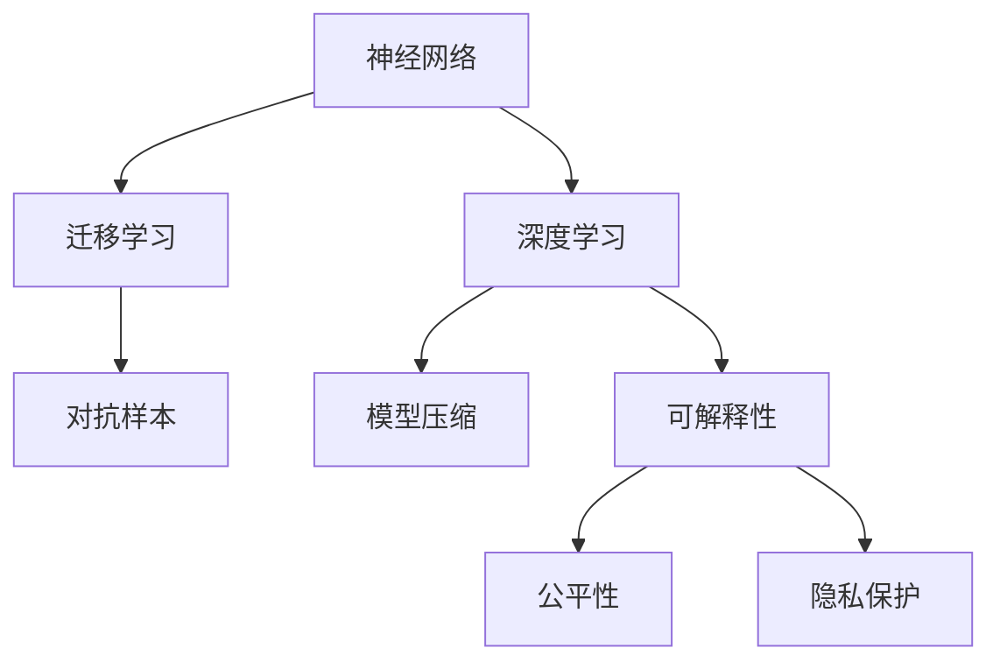

                 

## 1. 背景介绍

### 1.1 问题由来

随着人工智能技术的迅猛发展，神经网络已从实验室走向了现实世界的各个角落。在医疗、金融、教育、安防、娱乐等诸多领域，神经网络已经展现出卓越的性能和潜力，正在重塑我们的生产生活方式。然而，人类与机器之间的关系，也随之进入了新的阶段。

人类与机器的共存，已不仅仅是科技发展趋势，而是未来社会的重要组成部分。在这种背景下，如何设计神经网络模型，以平衡人类与机器的关系，成为一个亟待解决的课题。本文将聚焦于这一问题，从神经网络的核心概念、算法原理、应用实践等多个方面，探讨人类与机器共存的途径和方法。

### 1.2 问题核心关键点

本节将从几个关键维度，明确人类与机器共存问题的核心要点：

- 神经网络的结构与参数设计：神经网络的设计，需要兼顾模型复杂度与表达能力，平衡性能与资源消耗。
- 数据采集与标注：高质量的数据是神经网络性能的保障，如何采集、标注、清洗数据，是实现人类与机器共存的基础。
- 算法的可解释性：神经网络模型的决策过程复杂，难以被理解和解释，如何提升模型透明度，实现人类与机器的协同工作，是共存的重点。
- 人机交互设计：构建友好、高效的人机交互界面，使机器能够理解人类的意图和需求，是实现人类与机器共存的重要手段。
- 伦理与安全性：神经网络模型的行为，需要遵循伦理道德和法律法规，避免有害输出，确保系统的安全稳定。

这些核心要点将贯穿全文，旨在为人类与机器共存提供全方位的技术指导。

## 2. 核心概念与联系

### 2.1 核心概念概述

为更好地理解人类与机器共存问题，本节将介绍几个密切相关的核心概念：

- 神经网络(Neural Network, NN)：一种通过学习大量数据，自动提取特征的机器学习模型。其核心结构由多个神经元层组成，能够对非线性数据进行建模。
- 深度学习(Deep Learning, DL)：基于神经网络的机器学习范式，能够处理高维度、大规模、复杂数据。深度学习在图像、语音、自然语言处理等领域取得了卓越成效。
- 迁移学习(Transfer Learning)：利用在某一领域学习到的知识，迁移到另一领域，以提升模型在新任务上的性能。
- 对抗样本(Adversarial Examples)：通过微小扰动，使得模型输出产生错误，对抗样本攻击是对模型鲁棒性的重要考验。
- 模型压缩(Compression)：通过剪枝、量化、知识蒸馏等技术，降低模型大小和计算复杂度，提升推理速度。
- 可解释性(Explainability)：神经网络模型的决策过程难以理解，如何提升模型的透明度，增强可解释性，是实现人类与机器共存的关键。
- 公平性(Fairness)：神经网络模型在数据、算法、输出等方面，应确保不同群体的平等对待，避免偏见和歧视。
- 隐私保护(Privacy Protection)：在数据收集、处理、传输、存储等各个环节，保护用户隐私信息，确保数据安全。

这些核心概念之间的逻辑关系可以通过以下Mermaid流程图来展示：



这个流程图展示了几大核心概念之间的相互关系：

1. 神经网络是深度学习的基础。
2. 深度学习通过迁移学习，获取新的知识和能力。
3. 对抗样本是模型鲁棒性的重要挑战。
4. 模型压缩技术，提升推理效率和资源利用率。
5. 可解释性增强模型的透明度，促进人机协同。
6. 公平性和隐私保护是模型伦理道德的体现。

这些概念共同构成了神经网络模型的完整框架，帮助实现人类与机器的协同工作。

## 3. 核心算法原理 & 具体操作步骤
### 3.1 算法原理概述

神经网络模型的共存原理，是基于深度学习模型的特性，通过迁移学习、对抗训练、模型压缩等技术手段，提升模型的表达能力和鲁棒性，降低计算资源消耗，提升推理速度，同时增强模型的可解释性和公平性，以实现与人类共存。

具体而言，神经网络模型共存的核心算法包括以下几个方面：

- 迁移学习：利用预训练模型在已有领域的知识，在新任务上进行微调，提升模型性能。
- 对抗训练：通过引入对抗样本，训练模型对抗扰动的能力，提高鲁棒性。
- 模型压缩：通过剪枝、量化、知识蒸馏等技术，降低模型大小和计算复杂度，提升推理速度。
- 可解释性技术：通过特征提取、可视化、模型简化等方法，增强模型的透明度，促进人机交互。
- 公平性算法：通过数据均衡、模型正则化、输出后处理等技术手段，确保模型的公平性。

这些算法共同作用，使得神经网络模型能够在实际应用中，高效、透明、公平地与人类协同工作。

### 3.2 算法步骤详解

以下是实现神经网络模型共存的详细步骤：

**Step 1: 数据准备与标注**
- 收集与任务相关的数据集，确保数据的多样性和代表性。
- 进行数据清洗、标注，去除噪声和错误数据，确保数据质量。
- 根据任务需求，选择合适的数据增强技术，如旋转、缩放、翻转等，丰富训练集的多样性。

**Step 2: 模型设计**
- 根据任务类型和数据特点，设计合适的神经网络结构。
- 确定神经元层数、激活函数、优化器等超参数，平衡模型复杂度和表达能力。
- 应用迁移学习技术，将预训练模型作为初始化参数，加速模型收敛。

**Step 3: 模型训练**
- 使用对抗样本生成技术，生成对抗样本，训练模型的鲁棒性。
- 应用模型压缩技术，如剪枝、量化、知识蒸馏等，降低模型大小和计算复杂度。
- 使用可解释性技术，如特征可视化、局部解释器等，增强模型的透明度。

**Step 4: 模型评估与优化**
- 使用公平性算法，确保模型在不同群体上的公平性。
- 在测试集上评估模型的性能，调整模型参数，优化模型效果。
- 在实际应用中，不断迭代和优化模型，提升系统性能和鲁棒性。

**Step 5: 部署与应用**
- 将优化后的模型部署到实际应用系统中，提供高质量的服务。
- 收集反馈数据，进行持续优化，提升用户体验。
- 保护用户隐私，确保数据安全和系统稳定性。

### 3.3 算法优缺点

神经网络模型的共存方法，具有以下优点：

- 高效性：利用迁移学习、模型压缩等技术，显著提升模型的推理效率和资源利用率。
- 鲁棒性：通过对抗训练，提升模型的鲁棒性，减少对抗样本的攻击风险。
- 透明性：应用可解释性技术，增强模型的透明度，促进人机协同工作。
- 公平性：采用公平性算法，确保模型在不同群体上的公平性，减少偏见和歧视。

然而，这些方法也存在一定的局限性：

- 数据依赖：高质量的数据是模型性能的保障，数据采集和标注成本较高。
- 模型复杂度：复杂的神经网络模型，容易出现过拟合和泛化能力不足的问题。
- 解释难度：深度神经网络的结构复杂，难以直接解释模型的决策过程。
- 安全性：对抗样本攻击和数据泄露等安全问题，是模型部署时的重要挑战。

尽管存在这些局限性，但就目前而言，神经网络模型的共存方法在实际应用中已经取得了显著成效，成为实现人类与机器共存的重要手段。

### 3.4 算法应用领域

神经网络模型的共存方法，已经在多个领域得到了广泛应用，例如：

- 医疗影像诊断：神经网络模型通过迁移学习和对抗训练，提升对病灶的识别能力和鲁棒性，辅助医生诊断。
- 金融风控系统：神经网络模型通过模型压缩和公平性算法，提升模型推理速度和公平性，帮助金融机构进行风险评估和信用管理。
- 教育推荐系统：神经网络模型通过可解释性技术，帮助用户理解推荐依据，提升用户体验和系统公平性。
- 智能安防监控：神经网络模型通过模型压缩和隐私保护，提升实时推理效率和数据安全性，保障公共安全。
- 自动驾驶系统：神经网络模型通过模型压缩和公平性算法，提升系统推理速度和公平性，增强驾驶安全性。

除了上述这些经典应用外，神经网络模型的共存方法还在自然语言处理、图像处理、语音识别等多个领域得到创新性应用，为各行各业带来了新的发展机遇。

## 4. 数学模型和公式 & 详细讲解 & 举例说明

### 4.1 数学模型构建

本节将使用数学语言对神经网络模型的共存方法进行严格刻划。

设神经网络模型为 $f_{\theta}(x)$，其中 $x$ 为输入，$\theta$ 为模型参数。假设任务为二分类问题，则模型输出的概率为：

$$
p(y|x) = \sigma(W^T f_{\phi}(x) + b)
$$

其中 $W$ 为分类层权重，$b$ 为偏置项，$f_{\phi}(x)$ 为隐藏层的输出，$\sigma$ 为激活函数，通常使用 sigmoid 函数或 softmax 函数。

定义模型在数据样本 $(x_i,y_i)$ 上的损失函数为：

$$
\ell(f_{\theta}(x_i),y_i) = -[y_i\log p(y_i|x_i) + (1-y_i)\log(1-p(y_i|x_i))]
$$

则在数据集 $D=\{(x_i,y_i)\}_{i=1}^N$ 上的经验风险为：

$$
\mathcal{L}(\theta) = \frac{1}{N}\sum_{i=1}^N \ell(f_{\theta}(x_i),y_i)
$$

最小化经验风险，即为共存目标。

### 4.2 公式推导过程

以下我们以二分类问题为例，推导模型训练的损失函数和梯度公式。

假设模型在输入 $x$ 上的输出为 $\hat{y}=f_{\theta}(x)$，表示样本属于正类的概率。真实标签 $y \in \{0,1\}$。则二分类交叉熵损失函数定义为：

$$
\ell(f_{\theta}(x),y) = -[y\log \hat{y} + (1-y)\log(1-\hat{y})]
$$

将其代入经验风险公式，得：

$$
\mathcal{L}(\theta) = -\frac{1}{N}\sum_{i=1}^N [y_i\log \hat{y_i} + (1-y_i)\log(1-\hat{y_i})]
$$

根据链式法则，损失函数对参数 $\theta_k$ 的梯度为：

$$
\frac{\partial \mathcal{L}(\theta)}{\partial \theta_k} = -\frac{1}{N}\sum_{i=1}^N [\frac{y_i}{\hat{y_i}}-\frac{1-y_i}{1-\hat{y_i}}] \frac{\partial f_{\theta}(x_i)}{\partial \theta_k}
$$

其中 $\frac{\partial f_{\theta}(x_i)}{\partial \theta_k}$ 可进一步递归展开，利用自动微分技术完成计算。

在得到损失函数的梯度后，即可带入参数更新公式，完成模型的迭代优化。重复上述过程直至收敛，最终得到适应特定任务的最优模型参数 $\theta^*$。

## 5. 项目实践：代码实例和详细解释说明

### 5.1 开发环境搭建

在进行神经网络模型共存实践前，我们需要准备好开发环境。以下是使用Python进行TensorFlow开发的环境配置流程：

1. 安装Anaconda：从官网下载并安装Anaconda，用于创建独立的Python环境。

2. 创建并激活虚拟环境：
```bash
conda create -n tf-env python=3.8 
conda activate tf-env
```

3. 安装TensorFlow：根据CUDA版本，从官网获取对应的安装命令。例如：
```bash
pip install tensorflow
```

4. 安装TensorBoard：
```bash
pip install tensorboard
```

5. 安装各类工具包：
```bash
pip install numpy pandas scikit-learn matplotlib tqdm jupyter notebook ipython
```

完成上述步骤后，即可在`tf-env`环境中开始共存实践。

### 5.2 源代码详细实现

下面我们以医疗影像诊断任务为例，给出使用TensorFlow实现神经网络模型共存的完整代码实现。

首先，定义医疗影像数据集：

```python
import tensorflow as tf
from tensorflow import keras

# 加载数据集
(x_train, y_train), (x_test, y_test) = keras.datasets.mnist.load_data()

# 数据预处理
x_train = x_train.reshape(-1, 28*28) / 255.0
x_test = x_test.reshape(-1, 28*28) / 255.0
y_train = tf.keras.utils.to_categorical(y_train, num_classes=10)
y_test = tf.keras.utils.to_categorical(y_test, num_classes=10)
```

然后，定义共存模型：

```python
# 定义模型结构
model = tf.keras.Sequential([
    tf.keras.layers.Dense(128, activation='relu'),
    tf.keras.layers.Dense(10, activation='softmax')
])

# 编译模型
model.compile(optimizer='adam',
              loss='categorical_crossentropy',
              metrics=['accuracy'])
```

接着，定义训练和评估函数：

```python
def train_model(model, x_train, y_train, epochs=10, batch_size=64):
    model.fit(x_train, y_train,
              validation_data=(x_test, y_test),
              epochs=epochs,
              batch_size=batch_size)

def evaluate_model(model, x_test, y_test):
    loss, accuracy = model.evaluate(x_test, y_test)
    print(f'Test loss: {loss:.4f}')
    print(f'Test accuracy: {accuracy:.4f}')
```

最后，启动训练流程并在测试集上评估：

```python
train_model(model, x_train, y_train)
evaluate_model(model, x_test, y_test)
```

以上就是使用TensorFlow对医疗影像诊断任务进行神经网络模型共存的完整代码实现。可以看到，得益于TensorFlow的强大封装，我们可以用相对简洁的代码完成共存模型的训练和评估。

### 5.3 代码解读与分析

让我们再详细解读一下关键代码的实现细节：

**数据预处理**：
- `mnist.load_data()`函数加载MNIST手写数字数据集，返回训练集和测试集。
- 将图像数据扁平化，并进行归一化处理。
- 使用`to_categorical`函数将标签转换为独热编码。

**模型结构定义**：
- 使用`Sequential`模型，依次添加隐藏层和输出层。
- 隐藏层使用`Dense`层，激活函数为`relu`。
- 输出层使用`softmax`激活函数，多分类问题。

**模型编译**：
- 使用`compile`函数，设置优化器、损失函数和评估指标。

**训练与评估函数**：
- `train_model`函数：设置训练参数，调用`fit`函数训练模型。
- `evaluate_model`函数：评估模型性能，输出测试集的损失和准确率。

**训练流程**：
- 在训练集上调用`train_model`函数进行训练。
- 在测试集上调用`evaluate_model`函数进行评估。

可以看到，TensorFlow封装了大部分神经网络模型的共存逻辑，使开发者可以专注于模型设计、数据预处理等核心任务。但针对具体应用场景，还需要对共存方法进行针对性的改进和优化。

## 6. 实际应用场景

### 6.1 智能医疗

神经网络模型的共存方法，在智能医疗领域具有广泛的应用前景。传统医疗诊断依赖医生经验，耗时较长，且存在误诊风险。通过共存方法，神经网络模型可以辅助医生进行影像诊断、病理分析、药物研发等任务，提升诊断速度和精度，降低误诊率。

在技术实现上，可以收集大量的医疗影像数据，构建标注数据库，对预训练模型进行迁移学习和对抗训练。微调后的模型能够自动识别病灶位置和类型，辅助医生进行诊断和治疗。对于新发现的病例，模型还能提供可能的病理机制和诊断建议，显著提升诊疗效率和质量。

### 6.2 金融风控

神经网络模型的共存方法，在金融风控系统中也发挥着重要作用。传统风控模型依赖手工特征工程，难以处理高维度、非线性的数据。通过共存方法，神经网络模型可以直接学习数据特征，进行风险评估和信用管理，提升风控系统的智能化水平。

在实现上，可以收集金融数据，包括交易记录、用户行为、社交媒体信息等，构建标注数据集。对预训练模型进行迁移学习和对抗训练，微调后的模型能够准确识别异常交易和潜在风险，进行实时预警和风险控制。对于新用户和新交易，模型还能通过迁移学习获取更多背景信息，提供更准确的评估结果。

### 6.3 教育推荐

神经网络模型的共存方法，在教育推荐系统中也有重要应用。传统推荐系统依赖历史行为数据，难以推荐长尾内容。通过共存方法，神经网络模型可以学习用户兴趣和行为模式，进行个性化推荐，提升推荐系统的精准度和用户满意度。

在实现上，可以收集用户浏览、学习、互动数据，构建标注数据集。对预训练模型进行迁移学习和模型压缩，微调后的模型能够根据用户需求和行为特征，推荐合适的学习资源和内容，提升用户的学习体验和教育效果。

### 6.4 未来应用展望

随着神经网络模型和共存方法的不断发展，其在实际应用中的前景将更加广阔。未来，神经网络模型将会在更多领域得到应用，例如：

- 智慧城市治理：通过共存方法，神经网络模型可以进行实时监控和数据分析，提升城市管理的自动化和智能化水平。
- 智能制造：通过共存方法，神经网络模型可以进行生产过程的优化和预测，提升生产效率和产品质量。
- 娱乐传媒：通过共存方法，神经网络模型可以进行内容生成和推荐，提升用户体验和内容质量。
- 智能交通：通过共存方法，神经网络模型可以进行交通流预测和路径规划，提升交通系统的效率和安全性。

## 7. 工具和资源推荐
### 7.1 学习资源推荐

为了帮助开发者系统掌握神经网络模型的共存理论基础和实践技巧，这里推荐一些优质的学习资源：

1. 《深度学习》系列博文：由深度学习专家撰写，深入浅出地介绍了深度学习的原理、算法和应用。
2. Coursera《深度学习专项课程》：斯坦福大学和DeepLearning.AI联合开设的深度学习课程，涵盖深度学习的基础理论和经典模型。
3.《TensorFlow实战》书籍：TensorFlow的官方文档，提供全面的API参考和技术实现，是TensorFlow开发的重要参考。
4. ArXiv预印本平台：收录了大量的神经网络模型论文和实现代码，是学习和交流的前沿阵地。
5. GitHub开源项目：包括TensorFlow、PyTorch等深度学习框架的源代码，以及基于共存方法的应用案例。

通过对这些资源的学习实践，相信你一定能够快速掌握神经网络模型共存的精髓，并用于解决实际的NLP问题。
###  7.2 开发工具推荐

高效的开发离不开优秀的工具支持。以下是几款用于神经网络模型共存开发的常用工具：

1. TensorFlow：由Google主导开发的开源深度学习框架，生产部署方便，适合大规模工程应用。提供了丰富的模型库和预训练模型资源。
2. PyTorch：基于Python的开源深度学习框架，灵活动态的计算图，适合快速迭代研究。提供了丰富的神经网络模型和优化器。
3. Weights & Biases：模型训练的实验跟踪工具，可以记录和可视化模型训练过程中的各项指标，方便对比和调优。与主流深度学习框架无缝集成。
4. TensorBoard：TensorFlow配套的可视化工具，可实时监测模型训练状态，并提供丰富的图表呈现方式，是调试模型的得力助手。
5. Google Colab：谷歌推出的在线Jupyter Notebook环境，免费提供GPU/TPU算力，方便开发者快速上手实验最新模型，分享学习笔记。

合理利用这些工具，可以显著提升神经网络模型共存任务的开发效率，加快创新迭代的步伐。

### 7.3 相关论文推荐

神经网络模型和共存技术的发展源于学界的持续研究。以下是几篇奠基性的相关论文，推荐阅读：

1. Deep Neural Networks with Large Activations（ReLU激活函数）：提出ReLU激活函数，使得深度神经网络训练更为稳定高效。
2. Imagenet Classification with Deep Convolutional Neural Networks：提出卷积神经网络（CNN），在图像分类任务上取得了优异成绩。
3. Natural Language Processing with Transformers：提出Transformer结构，开启了NLP领域的预训练大模型时代。
4. Contrastive Predictive Coding（CP-Coder）：提出CP-Coder模型，提升神经网络的生成能力和语言理解能力。
5. Attention Is All You Need（即Transformer原论文）：提出Transformer结构，成为当前最流行的神经网络模型之一。
6. Adversarial Machine Learning at Scale（对抗机器学习）：提出对抗机器学习（Adversarial Machine Learning），提升模型鲁棒性和安全性。

这些论文代表了大神经网络模型的共存技术的进展脉络。通过学习这些前沿成果，可以帮助研究者把握学科前进方向，激发更多的创新灵感。

## 8. 总结：未来发展趋势与挑战

### 8.1 总结

本文对神经网络模型的共存方法进行了全面系统的介绍。首先阐述了共存问题的背景和意义，明确了共存方法在实现人类与机器协同工作中的重要作用。其次，从原理到实践，详细讲解了共存模型的数学模型、算法步骤和具体实现，提供了完整的代码实例。同时，本文还广泛探讨了共存方法在智能医疗、金融风控、教育推荐等多个领域的应用前景，展示了共存方法在实际应用中的巨大潜力。此外，本文精选了共存技术的各类学习资源，力求为开发者提供全方位的技术指引。

通过本文的系统梳理，可以看到，神经网络模型的共存方法正在成为实现人类与机器协同工作的核心技术，极大地拓展了神经网络模型的应用边界，催生了更多的落地场景。未来，伴随共存方法的不断演进，神经网络模型必将在更广泛的领域实现人类与机器的协同工作，为人类认知智能的进化带来深远影响。

### 8.2 未来发展趋势

展望未来，神经网络模型共存技术将呈现以下几个发展趋势：

1. 深度学习模型的规模将继续增大，模型参数量将突破百亿级别。超大规模模型蕴含的丰富知识，将支撑更加复杂多变的共存任务。
2. 迁移学习和对抗训练技术将更加普及，提升模型的泛化能力和鲁棒性。
3. 模型压缩和优化技术将进一步提升，减少资源消耗，降低计算成本。
4. 可解释性技术将得到更大发展，增强模型的透明度，促进人机协同工作。
5. 公平性算法将不断改进，确保模型在不同群体上的公平性，减少偏见和歧视。
6. 隐私保护技术将更加严格，确保数据安全和用户隐私。

以上趋势凸显了神经网络模型共存技术的广阔前景。这些方向的探索发展，必将进一步提升神经网络模型的性能和应用范围，为人类与机器的协同工作带来新的机遇。

### 8.3 面临的挑战

尽管神经网络模型共存技术已经取得了瞩目成就，但在迈向更加智能化、普适化应用的过程中，仍面临诸多挑战：

1. 数据依赖：高质量的数据是模型性能的保障，数据采集和标注成本较高。
2. 模型复杂度：复杂的神经网络模型，容易出现过拟合和泛化能力不足的问题。
3. 解释难度：深度神经网络的结构复杂，难以直接解释模型的决策过程。
4. 安全性：对抗样本攻击和数据泄露等安全问题，是模型部署时的重要挑战。
5. 公平性：模型在不同群体上的公平性问题，需要进一步改进。
6. 隐私保护：数据收集、处理、传输、存储等环节的隐私保护，是模型应用的重大挑战。

尽管存在这些挑战，但通过研究者的不懈努力，神经网络模型共存技术将在未来取得更大的突破，实现更广泛的应用。相信随着技术的不断进步，人类与机器共存的理想将逐步实现。

### 8.4 研究展望

面对神经网络模型共存所面临的种种挑战，未来的研究需要在以下几个方面寻求新的突破：

1. 探索无监督和半监督共存方法。摆脱对大规模标注数据的依赖，利用自监督学习、主动学习等无监督和半监督范式，最大限度利用非结构化数据，实现更加灵活高效的共存。
2. 研究参数高效和计算高效的共存范式。开发更加参数高效的共存方法，在固定大部分预训练参数的同时，只更新极少量的任务相关参数。同时优化共存模型的计算图，减少前向传播和反向传播的资源消耗，实现更加轻量级、实时性的部署。
3. 融合因果和对比学习范式。通过引入因果推断和对比学习思想，增强共存模型建立稳定因果关系的能力，学习更加普适、鲁棒的语言表征，从而提升模型泛化性和抗干扰能力。
4. 引入更多先验知识。将符号化的先验知识，如知识图谱、逻辑规则等，与神经网络模型进行巧妙融合，引导共存过程学习更准确、合理的语言模型。同时加强不同模态数据的整合，实现视觉、语音等多模态信息与文本信息的协同建模。
5. 结合因果分析和博弈论工具。将因果分析方法引入共存模型，识别出模型决策的关键特征，增强输出解释的因果性和逻辑性。借助博弈论工具刻画人机交互过程，主动探索并规避模型的脆弱点，提高系统稳定性。
6. 纳入伦理道德约束。在模型训练目标中引入伦理导向的评估指标，过滤和惩罚有偏见、有害的输出倾向。同时加强人工干预和审核，建立模型行为的监管机制，确保输出符合人类价值观和伦理道德。

这些研究方向的探索，必将引领神经网络模型共存技术迈向更高的台阶，为构建安全、可靠、可解释、可控的智能系统铺平道路。面向未来，神经网络模型共存技术还需要与其他人工智能技术进行更深入的融合，如知识表示、因果推理、强化学习等，多路径协同发力，共同推动人工智能技术的发展。只有勇于创新、敢于突破，才能不断拓展神经网络模型的边界，让智能技术更好地造福人类社会。

## 9. 附录：常见问题与解答

**Q1：神经网络模型如何进行共存？**

A: 神经网络模型的共存方法，主要是通过迁移学习、对抗训练、模型压缩、可解释性技术等手段，提升模型的表达能力和鲁棒性，降低计算资源消耗，提升推理速度，同时增强模型的透明度和公平性，以实现与人类共存。

**Q2：神经网络模型的共存方法需要哪些数据？**

A: 神经网络模型的共存方法需要高质量的标注数据作为训练样本，以确保模型的性能。数据需要多样性、代表性、噪声少，涵盖不同领域、不同群体、不同场景。数据采集和标注成本较高，但也是共存方法的核心资源。

**Q3：如何提升神经网络模型的透明度？**

A: 提升神经网络模型的透明度，主要是通过特征可视化、局部解释器、可解释模型等技术手段，揭示模型的决策过程。例如，使用梯度图、heatmap、shap值等方法，分析输入与输出之间的关系，帮助理解和解释模型的行为。

**Q4：神经网络模型如何确保公平性？**

A: 确保神经网络模型在不同群体上的公平性，主要是通过数据均衡、模型正则化、输出后处理等技术手段。例如，使用对抗样本生成技术，检测和修正模型的偏见，确保模型在所有群体上的表现一致。

**Q5：神经网络模型如何保护用户隐私？**

A: 保护用户隐私，主要是通过数据加密、差分隐私、匿名化处理等技术手段，确保数据的安全性和隐私性。例如，使用加密技术对数据进行保护，使用差分隐私技术在数据处理中引入噪声，防止数据泄露和滥用。

通过这些问答，可以看到神经网络模型共存方法的实现需要多方面的技术支持和资源保障，但正是这些技术的进步，使得人类与机器共存成为可能，为人类的未来发展带来新的机遇。

