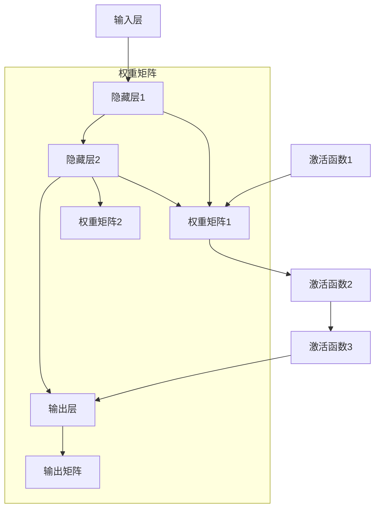

                 

# 神经网络：人类与机器的共存

在快速发展的数字化时代，人工智能(AI)技术正在深刻改变人类社会的各个方面，从智能家居、自动驾驶到金融交易、医疗诊断，AI技术的应用范围日益广泛。其中，神经网络(Neural Networks, NNs)作为AI的核心算法，其理论与实践已形成了独立而完善的体系。本文将深入探讨神经网络原理，并展望其在人类与机器共存中的潜在应用。

## 1. 背景介绍

### 1.1 问题由来

神经网络是模仿人脑神经元网络结构而设计的一种计算模型。其思想最早可追溯至20世纪50年代，但直到1980年代，随着反向传播算法的发明和PC硬件的普及，神经网络才开始在实践中大放异彩。近年来，深度学习技术的兴起，尤其是基于多层神经网络的深度神经网络(Deep Neural Networks, DNNs)，成为解决各种复杂问题的利器。

神经网络的应用领域几乎遍及所有需要处理大数据的领域，如图像识别、语音识别、自然语言处理、机器翻译、推荐系统等。例如，Google的图像识别算法Inception和语音识别系统DeepSpeech，通过神经网络模型训练，提升了计算效率和识别准确率。

### 1.2 问题核心关键点

神经网络的核心理念是通过数据驱动的方式，训练网络参数，使网络能够自主学习输入数据的特征表示，从而实现自动化的决策和推理。其关键点包括：

- 层级结构：神经网络通常由输入层、隐藏层和输出层组成，层级结构设计灵活，可以适应不同类型的问题。
- 权重更新：通过反向传播算法，自动更新网络中各层之间的权重，使网络不断优化输出结果。
- 特征提取：网络自动学习数据中的重要特征，无需人工提取。
- 非线性映射：多层非线性映射结构，使网络可以学习更加复杂的数据模式。

神经网络的发展历程，见证了人类对机器智能理解的一次次突破，其应用前景令人瞩目。本文将深入探讨神经网络的基本原理和核心算法，并通过实际案例分析，展示其潜在的共存模式。

## 2. 核心概念与联系

### 2.1 核心概念概述

为更好地理解神经网络原理和应用，本节将介绍几个关键概念：

- 神经网络(Neural Network, NN)：由节点(或称神经元)和连接权重组成的计算图，通过数据驱动的方式进行学习和推理。
- 反向传播(Backpropagation)：用于更新网络权重的一种优化算法，基于梯度下降方法，使损失函数最小化。
- 激活函数(Activation Function)：用于在神经元中引入非线性因素，激活函数通常采用Sigmoid、ReLU等。
- 损失函数(Loss Function)：用于衡量模型预测与实际值之间的差异，常见损失函数包括均方误差、交叉熵等。
- 梯度下降(Gradient Descent)：优化算法的一种，通过计算损失函数的梯度，逐步调整模型参数，使损失函数最小化。

这些概念构成了神经网络模型的基础，其核心思想是通过数据驱动的方式，自动优化网络参数，使网络能够准确地映射输入到输出，完成特定的任务。

### 2.2 核心概念原理和架构的 Mermaid 流程图



该图展示了神经网络的基本架构：

1. 输入层接收数据，并通过权重矩阵F传递到隐藏层1。
2. 隐藏层1通过激活函数1引入非线性映射，再通过权重矩阵G传递到隐藏层2。
3. 隐藏层2经过激活函数2再次引入非线性映射，并通过权重矩阵H传递到输出层。
4. 输出层得到最终的预测结果，并通过损失函数与实际值比较。
5. 反向传播算法利用梯度下降方法，自动调整各层权重和偏置，优化预测结果。

### 2.3 核心概念之间的关系

上述概念相互关联，共同构成了神经网络的基本工作机制：

- **输入层**：接收原始数据，并将其传递给网络。
- **隐藏层**：通过权重矩阵和激活函数引入非线性映射，对输入数据进行特征提取和模式识别。
- **输出层**：对隐藏层的结果进行线性映射，得到最终的预测结果。
- **损失函数**：衡量模型预测与实际值之间的误差，指导模型优化。
- **梯度下降**：基于反向传播算法，逐步调整模型参数，最小化损失函数。

理解这些概念之间的关系，有助于掌握神经网络的基本原理和应用方法。

## 3. 核心算法原理 & 具体操作步骤

### 3.1 算法原理概述

神经网络的核心算法原理基于反向传播(Backpropagation)和梯度下降(Gradient Descent)。其基本流程如下：

1. 初始化网络权重。
2. 前向传播：输入数据经过各层权重矩阵和激活函数的处理，传递到输出层，得到预测结果。
3. 计算损失函数：将预测结果与实际值比较，计算损失函数。
4. 反向传播：基于梯度下降，计算损失函数对各层权重的梯度，自动调整权重和偏置。
5. 重复步骤2-4，直至收敛。

该过程不断迭代，通过数据驱动的方式，优化网络参数，使网络能够准确地映射输入到输出。

### 3.2 算法步骤详解

以下是详细的算法步骤：

**Step 1: 准备数据和模型**
- 收集标注数据集，并将其分为训练集、验证集和测试集。
- 设计神经网络结构，选择合适的激活函数、损失函数和优化器。

**Step 2: 初始化权重**
- 使用随机初始化方法(如Xavier、He等)对网络权重进行初始化。
- 通常隐藏层和输出层的权重需随层级递减，以防止梯度消失或爆炸。

**Step 3: 前向传播**
- 将训练集数据分批次输入模型，前向传播计算预测结果。
- 将输出结果与实际值比较，计算损失函数。

**Step 4: 反向传播**
- 计算损失函数对各层权重的梯度。
- 基于梯度下降，更新模型参数。

**Step 5: 重复训练**
- 重复步骤3和4，直至损失函数收敛或达到预设迭代次数。
- 在验证集上评估模型性能，避免过拟合。

**Step 6: 测试和部署**
- 在测试集上评估模型性能，给出最终的预测结果。
- 将模型集成到实际的应用系统中，进行大规模部署。

### 3.3 算法优缺点

神经网络算法的优点包括：

- 高逼真度：通过多层次非线性映射，神经网络能够逼真地学习数据模式，适用于复杂问题。
- 自动化特征提取：网络自动学习输入数据的特征表示，无需人工提取。
- 鲁棒性：通过反向传播和梯度下降，神经网络对噪声和数据分布变化具有一定的鲁棒性。
- 适应性强：网络结构灵活，可以适应不同类型的问题。

然而，神经网络算法也存在以下缺点：

- 数据依赖：神经网络需要大量标注数据进行训练，数据质量对模型性能影响较大。
- 黑箱性质：神经网络模型通常难以解释，缺乏可解释性。
- 训练耗时：深度网络结构复杂，训练过程耗时较长。
- 过拟合风险：神经网络容易出现过拟合，特别是在数据量较小的情况下。

### 3.4 算法应用领域

神经网络的应用领域非常广泛，以下是几个典型案例：

- **计算机视觉**：通过神经网络模型，如卷积神经网络(CNN)，进行图像分类、目标检测、图像生成等。
- **自然语言处理**：使用循环神经网络(RNN)、长短期记忆网络(LSTM)、Transformer等模型，进行文本分类、情感分析、机器翻译等。
- **语音识别**：通过卷积神经网络和循环神经网络模型，进行语音识别和处理。
- **推荐系统**：利用深度神经网络进行用户行为预测和推荐结果排序。
- **游戏AI**：使用强化学习和神经网络模型，训练游戏AI，提升游戏智能化水平。

## 4. 数学模型和公式 & 详细讲解 & 举例说明

### 4.1 数学模型构建

以一个简单的两层神经网络为例，其数学模型可以表示为：

$$
y = \sigma(W_2 \sigma(W_1 x + b_1) + b_2)
$$

其中 $x$ 为输入向量，$W_1$ 和 $W_2$ 为权重矩阵，$b_1$ 和 $b_2$ 为偏置项，$\sigma$ 为激活函数。

**Step 1: 前向传播**
$$
z_1 = W_1 x + b_1
$$
$$
h = \sigma(z_1)
$$
$$
z_2 = W_2 h + b_2
$$
$$
y = \sigma(z_2)
$$

**Step 2: 计算损失函数**
$$
L = \frac{1}{N} \sum_{i=1}^N (y_i - \hat{y_i})^2
$$

### 4.2 公式推导过程

以二分类任务为例，展示损失函数和梯度更新公式的推导过程：

**激活函数**
$$
h = \sigma(z) = \frac{1}{1+e^{-z}}
$$

**均方误差损失函数**
$$
L = \frac{1}{N} \sum_{i=1}^N (y_i - \hat{y_i})^2
$$

**反向传播算法**
$$
\frac{\partial L}{\partial z} = \frac{2}{N} (y_i - \hat{y_i})
$$
$$
\frac{\partial L}{\partial w_j} = \frac{\partial L}{\partial z} \cdot \frac{\partial z}{\partial w_j}
$$

将上述公式应用到神经网络中，即可通过反向传播算法，自动调整权重和偏置，最小化损失函数。

### 4.3 案例分析与讲解

以图像分类任务为例，展示神经网络的训练过程。假设使用LeNet-5网络对MNIST数据集进行分类：

1. **准备数据**：收集MNIST数据集，并将其分为训练集、验证集和测试集。
2. **设计网络**：使用LeNet-5网络结构，包含卷积层、池化层、全连接层等。
3. **初始化权重**：使用Xavier初始化方法对权重进行随机初始化。
4. **前向传播**：将训练集数据分批次输入模型，前向传播计算预测结果。
5. **计算损失函数**：将预测结果与实际值比较，计算均方误差损失。
6. **反向传播**：计算损失函数对各层权重的梯度，基于梯度下降更新模型参数。
7. **重复训练**：重复上述步骤，直至损失函数收敛或达到预设迭代次数。
8. **测试和部署**：在测试集上评估模型性能，集成到实际的应用系统中。

## 5. 项目实践：代码实例和详细解释说明

### 5.1 开发环境搭建

在进行神经网络项目实践前，需要准备好开发环境。以下是使用Python进行PyTorch开发的环境配置流程：

1. 安装Anaconda：从官网下载并安装Anaconda，用于创建独立的Python环境。

2. 创建并激活虚拟环境：
```bash
conda create -n pytorch-env python=3.8 
conda activate pytorch-env
```

3. 安装PyTorch：根据CUDA版本，从官网获取对应的安装命令。例如：
```bash
conda install pytorch torchvision torchaudio cudatoolkit=11.1 -c pytorch -c conda-forge
```

4. 安装TensorFlow：使用Anaconda直接安装即可：
```bash
conda install tensorflow
```

5. 安装各类工具包：
```bash
pip install numpy pandas scikit-learn matplotlib tqdm jupyter notebook ipython
```

完成上述步骤后，即可在`pytorch-env`环境中开始神经网络实践。

### 5.2 源代码详细实现

下面我们以手写数字识别(MNIST)任务为例，给出使用PyTorch实现神经网络模型的代码实现。

```python
import torch
import torch.nn as nn
import torch.optim as optim
import torchvision.transforms as transforms
from torchvision.datasets import MNIST
from torchvision.utils import make_grid

class Net(nn.Module):
    def __init__(self):
        super(Net, self).__init__()
        self.conv1 = nn.Conv2d(1, 32, kernel_size=5, stride=1, padding=2)
        self.pool = nn.MaxPool2d(kernel_size=2, stride=2)
        self.conv2 = nn.Conv2d(32, 64, kernel_size=5, stride=1, padding=2)
        self.fc1 = nn.Linear(7*7*64, 1024)
        self.fc2 = nn.Linear(1024, 10)

    def forward(self, x):
        x = nn.functional.relu(nn.functional.max_pool2d(self.conv1(x), 2))
        x = nn.functional.relu(nn.functional.max_pool2d(self.conv2(x), 2))
        x = x.view(-1, 7*7*64)
        x = nn.functional.relu(self.fc1(x))
        x = self.fc2(x)
        return x

# 设置超参数
batch_size = 64
learning_rate = 0.001
num_epochs = 10

# 加载数据集
transform = transforms.Compose([transforms.ToTensor(), transforms.Normalize((0.5,), (0.5,))])
train_dataset = MNIST(root='data/', train=True, transform=transform, download=True)
test_dataset = MNIST(root='data/', train=False, transform=transform, download=True)

# 定义数据加载器
train_loader = torch.utils.data.DataLoader(train_dataset, batch_size=batch_size, shuffle=True)
test_loader = torch.utils.data.DataLoader(test_dataset, batch_size=batch_size, shuffle=False)

# 初始化模型和优化器
model = Net()
optimizer = optim.Adam(model.parameters(), lr=learning_rate)
criterion = nn.CrossEntropyLoss()

# 训练函数
def train(model, train_loader, optimizer, criterion, num_epochs):
    for epoch in range(num_epochs):
        for batch_idx, (data, target) in enumerate(train_loader):
            data, target = data.to(device), target.to(device)
            optimizer.zero_grad()
            output = model(data)
            loss = criterion(output, target)
            loss.backward()
            optimizer.step()
            if (batch_idx+1) % 100 == 0:
                print('Train Epoch: {} [{}/{} ({:.0f}%)]\tLoss: {:.6f}'.format(
                    epoch, batch_idx * len(data), len(train_loader.dataset),
                    100. * batch_idx / len(train_loader), loss.item()))

# 测试函数
def test(model, test_loader, criterion):
    model.eval()
    test_loss = 0
    correct = 0
    with torch.no_grad():
        for data, target in test_loader:
            data, target = data.to(device), target.to(device)
            output = model(data)
            test_loss += criterion(output, target).item()
            pred = output.argmax(dim=1, keepdim=True)
            correct += pred.eq(target.view_as(pred)).sum().item()

    print('\nTest set: Average loss: {:.4f}, Accuracy: {}/{} ({:.0f}%)\n'.format(
        test_loss / len(test_loader.dataset), correct, len(test_loader.dataset),
        100. * correct / len(test_loader.dataset)))

# 训练模型
device = torch.device("cuda" if torch.cuda.is_available() else "cpu")
model.to(device)
train(train_loader, optimizer, criterion, num_epochs)

# 测试模型
test(test_loader, criterion)
```

### 5.3 代码解读与分析

让我们再详细解读一下关键代码的实现细节：

**Net类**：
- `__init__`方法：初始化网络结构，包括卷积层、池化层和全连接层。
- `forward`方法：定义前向传播过程。

**超参数设置**：
- `batch_size`：批量大小，用于控制模型训练时的输入数据规模。
- `learning_rate`：学习率，用于控制模型参数更新的步长。
- `num_epochs`：迭代次数，用于控制模型训练的轮数。

**数据加载器**：
- `transform`：数据预处理，包括将图像转换为张量，并标准化处理。
- `train_dataset`：训练集数据加载器，用于批量读取训练数据。
- `test_dataset`：测试集数据加载器，用于批量读取测试数据。

**训练函数**：
- 在每个epoch内，对训练集数据进行迭代，前向传播计算预测结果，反向传播更新模型参数。

**测试函数**：
- 在测试集上评估模型性能，计算损失函数和准确率。

**模型训练和测试**：
- 将模型迁移到GPU/TPU等加速设备上。
- 调用训练函数进行模型训练。
- 调用测试函数评估模型性能。

可以看到，PyTorch提供了一套灵活的API，使得神经网络的实现变得简单高效。开发者可以专注于模型结构的设计和训练过程的调优，而不必过多关注底层计算图的操作。

## 6. 实际应用场景

### 6.1 智能推荐系统

神经网络在推荐系统中的应用非常广泛，通过深度学习模型，可以对用户行为进行预测，并推荐符合用户兴趣的商品或内容。推荐系统已经成为电商、新闻、视频等多个领域的标配应用。

以Netflix的推荐系统为例，通过深度神经网络模型，对用户历史行为进行建模，预测用户对不同影片的评分和观看意愿，从而生成个性化的推荐列表。该系统通过不断的学习和调整，提升了用户满意度，增加了用户黏性，极大地促进了业务增长。

### 6.2 医学诊断

神经网络在医学诊断中的应用主要集中在图像识别和数据分析上。通过深度学习模型，可以对医学影像进行自动化诊断，辅助医生提高诊疗效率和准确率。

例如，谷歌的DeepMind团队开发的胸腔X光诊断系统，通过卷积神经网络模型，对X光影像进行自动识别，发现早期肺癌等疾病，并生成诊断报告。该系统在实际临床应用中，已经证明其诊断结果与专家相当，有望在医疗领域广泛推广。

### 6.3 自动驾驶

自动驾驶是当前AI领域的热点研究方向之一，其中神经网络技术起到了关键作用。通过深度学习模型，可以对摄像头、雷达等传感器数据进行融合处理，生成车辆周围环境的实时感知，辅助车辆进行路径规划和决策。

特斯拉的Autopilot系统就是一个典型应用，通过深度神经网络模型，对摄像头和雷达数据进行处理，实现了自动泊车、自动跟车、自动巡航等功能。该系统通过不断学习，不断优化路径规划和决策逻辑，提升了驾驶安全性和便利性。

### 6.4 未来应用展望

展望未来，神经网络在人类与机器共存中的应用前景更加广阔：

1. **普适化**：随着深度学习技术的不断进步，神经网络将逐渐普及到各个领域，成为各个行业的通用工具。
2. **泛化性**：神经网络将能够更好地处理多样化和复杂化的问题，具备更强的泛化能力。
3. **智能化**：通过多模态数据的融合，神经网络将能够实现更加全面和深入的智能分析。
4. **可解释性**：未来的神经网络模型将具备更强的可解释性，便于人类的理解和监督。
5. **安全性**：通过伦理和道德约束，神经网络将能够更好地保护用户隐私和数据安全。

## 7. 工具和资源推荐

### 7.1 学习资源推荐

为了帮助开发者系统掌握神经网络的理论基础和实践技巧，这里推荐一些优质的学习资源：

1. **《深度学习》(花书) 西瓜书**：深度学习领域的经典教材，内容全面、系统，适合深入学习。
2. **吴恩达的深度学习课程**：斯坦福大学推出的免费在线课程，涵盖深度学习的基本概念和实践技巧。
3. **《Python深度学习》**：吴恩达和弗朗索瓦·肖邦的合著，系统介绍了深度学习的理论和方法。
4. **《动手学深度学习》**：清华大学深度学习实践教材，涵盖深度学习框架、模型设计和实践技巧。
5. **Kaggle竞赛**：通过参与Kaggle竞赛，可以实战学习深度学习模型的应用。

通过学习这些资源，相信你一定能够掌握神经网络的基本原理和应用方法，进而探索更深入的实践和创新。

### 7.2 开发工具推荐

高效开发离不开优秀的工具支持。以下是几款用于神经网络开发的常用工具：

1. **PyTorch**：基于Python的深度学习框架，灵活的计算图机制，适用于快速迭代研究。
2. **TensorFlow**：由Google主导的深度学习框架，适用于大规模工程应用。
3. **MXNet**：由亚马逊开发的深度学习框架，支持多种编程语言和硬件平台。
4. **Keras**：基于TensorFlow、Theano和CNTK的高层API，简单易用，适合初学者和快速原型开发。
5. **JAX**：基于NumPy的自动微分库，支持深度学习模型的优化和加速。

合理利用这些工具，可以显著提升神经网络模型的开发效率，加快创新迭代的步伐。

### 7.3 相关论文推荐

神经网络技术的快速发展离不开学界的持续研究。以下是几篇奠基性的相关论文，推荐阅读：

1. **《深度学习》(花书) 西瓜书**：深度学习领域的经典教材，内容全面、系统，适合深入学习。
2. **AlexNet的介绍论文**：Hinton等人在2012年发表的论文，展示了卷积神经网络在图像识别任务中的出色表现。
3. **ResNet的介绍论文**：He等人在2015年发表的论文，提出了残差网络，解决了深度网络中的梯度消失问题。
4. **Transformer论文**：Vaswani等人在2017年发表的论文，提出了Transformer模型，推动了自然语言处理领域的发展。
5. **GPT-3的介绍论文**：Brown等人在2020年发表的论文，展示了大规模预训练语言模型的强大能力。

这些论文代表了大神经网络技术的演进，为未来的研究提供了重要的理论基础。

## 8. 总结：未来发展趋势与挑战

### 8.1 研究成果总结

神经网络技术在过去几十年中取得了巨大成功，其应用领域广泛，影响深远。从计算机视觉到自然语言处理，从语音识别到推荐系统，神经网络技术在各个领域都展现出了强大的生命力和应用潜力。

### 8.2 未来发展趋势

展望未来，神经网络技术将继续在各个领域发挥重要作用，其发展趋势包括：

1. **大规模化**：神经网络将逐步向更大规模、更深层次发展，以应对更复杂、更多样化的数据模式。
2. **自适应化**：通过自适应学习机制，神经网络将能够更好地适应数据分布的变化，提升泛化能力。
3. **跨领域融合**：神经网络将与其他AI技术如知识表示、因果推理、强化学习等进行更深入的融合，形成更全面、更智能的解决方案。
4. **可解释性**：未来的神经网络模型将具备更强的可解释性，便于人类理解和监督。
5. **安全性**：神经网络技术将更加注重安全性，保护用户隐私和数据安全。

### 8.3 面临的挑战

尽管神经网络技术取得了巨大成功，但仍面临诸多挑战：

1. **数据依赖**：神经网络需要大量标注数据进行训练，数据质量和数量对模型性能影响较大。
2. **模型复杂性**：神经网络模型结构复杂，训练和推理过程耗时较长，需要优化算法和技术支持。
3. **过拟合风险**：神经网络容易出现过拟合，特别是在数据量较小的情况下。
4. **黑箱性质**：神经网络模型通常难以解释，缺乏可解释性。
5. **安全性**：神经网络模型可能存在偏见和有害信息，需要加以监管和约束。

### 8.4 研究展望

未来的研究需要在以下几个方面寻求新的突破：

1. **无监督学习**：摆脱对大量标注数据的依赖，利用自监督学习、主动学习等无监督范式，最大化数据利用效率。
2. **少样本学习**：通过转移学习、元学习等方法，在少量样本情况下仍能取得优秀性能。
3. **计算高效**：开发更加高效的模型结构、优化算法和硬件支持，提升神经网络模型的计算效率。
4. **跨模态融合**：将不同模态数据进行有效融合，提升神经网络的综合感知能力。
5. **知识表示**：将符号化的先验知识与神经网络模型进行融合，提升模型的知识和推理能力。

通过这些研究方向的探索，将能够使神经网络技术在人类与机器共存中发挥更大的作用，推动AI技术的持续发展和应用落地。

## 9. 附录：常见问题与解答

**Q1：神经网络在医疗领域有哪些应用？**

A: 神经网络在医疗领域的应用主要集中在图像识别和数据分析上，如：

1. **医学影像分析**：通过深度学习模型对X光、CT、MRI等医学影像进行分析，自动识别疾病，如早期肺癌、骨折等。
2. **电子病历分析**：通过神经网络对电子病历进行自动化处理，提取病患的病情信息，辅助医生进行诊断。
3. **个性化治疗方案**：通过深度学习模型对病患的历史数据进行分析，生成个性化的治疗方案。

**Q2：神经网络如何实现语音识别？**

A: 语音识别通常使用卷积神经网络和循环神经网络模型。具体流程包括：

1. **特征提取**：将语音信号转换为MFCC特征向量。
2. **声学模型训练**：使用卷积神经网络对MFCC特征进行建模，提取声学特征。
3. **语言模型训练**：使用循环神经网络对文本序列进行建模，建立语言概率模型。
4. **解码**：将声学特征和语言模型结合起来，通过解码算法生成文本输出。

**Q3：神经网络在推荐系统中的优势是什么？**

A: 神经网络在推荐系统中的优势主要体现在以下几个方面：

1. **高效性**：神经网络模型可以通过并行计算加速训练过程，提高推荐效率。
2. **鲁棒性**：神经网络模型能够自动学习用户行为模式，适应多样化的用户偏好。
3. **自适应性**：神经网络模型能够动态调整推荐策略，适应数据分布的变化。
4. **多模态融合**：神经网络模型能够融合多种数据源，提升推荐结果的全面性和准确性。

**Q4：神经网络在实际应用中容易出现哪些问题？**

A: 神经网络在实际应用中容易出现以下问题：

1. **过拟合**：神经网络模型容易出现过拟合，特别是在数据量较小的情况下。
2. **模型复杂性**：神经网络模型结构复杂，训练和推理过程耗时较长，需要优化算法和技术支持。
3. **数据依赖**：神经网络需要大量标注数据进行训练，数据质量和数量对模型性能影响较大。
4. **黑箱性质**：神经网络模型通常难以解释，缺乏可解释性。
5. **安全性**：神经网络模型可能存在偏见和有害信息，需要加以监管和约束。

通过理解和解决这些问题，能够使神经网络在实际应用中发挥更大的作用。

**Q5：神经网络与传统的机器学习算法有何不同？**

A: 神经网络与传统的机器学习算法有以下不同：

1. **数据依赖**：神经网络需要大量标注数据进行训练，而传统的机器学习算法通常不需要标注数据。
2. **模型结构**：神经网络通常具有多层非线性映射结构，而传统的机器学习算法一般采用线性或简单的非线性映射。
3. **训练过程**：神经网络通过反向传播算法，自动调整模型参数，而传统的机器学习算法通常需要手动选择和调整模型参数。
4. **泛化能力**：神经网络通常具备更强的泛化能力，能够适应复杂多样化的数据模式，而传统的机器学习算法可能受限于算法复杂性和数据规模。

通过理解这些不同点，能够更好地掌握神经网络的原理和应用方法。

---

作者：禅与计算机程序设计艺术 / Zen and the Art of Computer Programming

