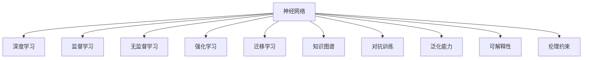

                 

# 神经网络：人类智慧的解放

> 关键词：神经网络,人工智能,深度学习,认知科学,机器学习,知识工程,技术突破

## 1. 背景介绍

### 1.1 问题由来

随着人工智能（AI）技术的迅猛发展，神经网络（Neural Networks）已成为实现人类智慧解放的重要手段。通过深度学习（Deep Learning），神经网络不仅在图像识别、语音识别等领域取得了显著进展，还在自然语言处理（NLP）、知识图谱、推荐系统等诸多领域实现了颠覆性突破。

人工智能的核心理念在于模仿人类的大脑结构和工作机制，让机器能够理解和执行复杂的智能任务。神经网络作为深度学习的核心模型，通过模拟神经元间的连接权重和激活函数，实现了对数据的逐层抽象和自动特征提取。近年来，随着计算能力的不断提升和大规模数据的积累，神经网络模型得到了空前的发展，成为推动人工智能技术进步的关键动力。

### 1.2 问题核心关键点

神经网络在众多领域的成功应用，彰显了其在信息处理和知识获取方面的巨大潜力。然而，神经网络的强大能力并非来自天然，而是源于其独特的学习机制和不断优化的算法设计。以下是神经网络在应用过程中需要关注的核心问题：

1. **数据需求**：神经网络的学习依赖于大量的标注数据。获取高质量的标注数据往往需要巨大的成本和资源投入，限制了神经网络的应用范围。
2. **模型复杂度**：神经网络模型参数量庞大，模型训练和推理需要大量的计算资源和时间，难以在实际应用中快速部署。
3. **泛化能力**：神经网络模型在训练集上的表现可能与在测试集上存在差异，需要探索更好的泛化方法以提升模型在新数据上的适应性。
4. **解释性**：神经网络模型通常被视为“黑盒”，难以解释其内部工作机制和决策逻辑，这限制了其在需要高可解释性的领域的应用。
5. **伦理与安全**：神经网络模型可能学习到有害的偏见和信息，甚至在特定情况下产生误导性的输出，需要加强数据筛选和模型训练的伦理约束。

## 2. 核心概念与联系

### 2.1 核心概念概述

为了更好地理解神经网络的工作原理和应用范式，本节将介绍几个关键概念：

- **神经网络**：一种由多个神经元（或称节点）组成的计算模型，通过层间连接权重和激活函数，实现对输入数据的逐层抽象和特征提取。
- **深度学习**：利用多层神经网络对复杂数据进行建模，通过反向传播算法优化模型参数，以获得最佳的模型性能。
- **监督学习**：通过标注数据集对模型进行训练，使其能够根据输入数据预测输出标签。
- **无监督学习**：利用未标注数据进行模型训练，发现数据的内在结构和模式。
- **强化学习**：通过与环境的交互，在奖励信号的指导下优化模型策略，适用于需要智能决策的问题。
- **迁移学习**：将在一个任务上训练好的模型迁移到另一个相关任务上，以减少新任务训练的数据需求和时间成本。
- **知识图谱**：构建实体与关系间的图形结构，用于知识表示和推理。
- **对抗训练**：通过引入对抗样本，提高模型的鲁棒性和泛化能力。
- **泛化能力**：模型在新数据上的表现，是衡量模型性能的重要指标。
- **可解释性**：模型的决策过程是否可理解，对于需要高信任度的应用至关重要。
- **伦理约束**：确保模型输出符合人类价值观和伦理道德，避免潜在的负面影响。

这些概念之间存在紧密的联系，共同构成了神经网络的学习和应用框架。通过理解这些概念，我们可以更好地把握神经网络的工作原理和优化方向。

### 2.2 核心概念原理和架构的 Mermaid 流程图



这个流程图展示了神经网络的核心概念及其之间的关系：

1. 神经网络作为计算模型，通过深度学习的方法进行训练，以获得最佳的模型性能。
2. 监督学习、无监督学习、强化学习是深度学习中常用的训练方式，根据数据和任务的特点选择不同的学习方式。
3. 迁移学习通过将预训练模型迁移到新任务上，减少了新任务的数据需求和时间成本。
4. 知识图谱和对抗训练进一步提升了模型的泛化能力和鲁棒性。
5. 泛化能力和可解释性是评估模型性能的重要指标，同时还需要考虑伦理约束，确保模型输出的安全性。

## 3. 核心算法原理 & 具体操作步骤

### 3.1 算法原理概述

神经网络的学习过程是一个参数优化的过程。其核心思想是通过反向传播算法，不断调整网络中的连接权重，使得模型的预测输出与真实标签之间的误差最小化。

神经网络由多个层次组成，每一层包含多个神经元。输入数据经过每一层神经元的处理后，最终输出一个预测结果。反向传播算法通过计算损失函数对每个神经元的梯度，指导参数更新，优化模型性能。

### 3.2 算法步骤详解

神经网络的训练过程包括以下关键步骤：

1. **数据预处理**：将原始数据转换为模型所需的格式，如归一化、特征提取等。
2. **模型定义**：选择合适的神经网络结构，定义层数、神经元个数、激活函数等参数。
3. **损失函数选择**：根据任务类型选择适合的损失函数，如交叉熵损失、均方误差等。
4. **参数初始化**：随机初始化模型参数，如权重、偏置等。
5. **前向传播**：将输入数据通过神经网络，计算出预测结果。
6. **反向传播**：计算预测结果与真实标签之间的误差，通过链式法则计算每个参数的梯度。
7. **参数更新**：使用梯度下降等优化算法更新模型参数，减小误差。
8. **重复迭代**：多次重复上述步骤，直至模型收敛或达到预设的迭代次数。

### 3.3 算法优缺点

神经网络作为深度学习中的核心模型，具有以下优点和缺点：

**优点**：
1. **强大的特征提取能力**：通过多层次的抽象和特征提取，神经网络能够自动发现数据中的复杂结构和模式。
2. **良好的泛化能力**：在训练集上表现优秀的神经网络，通常在新数据上也能取得不错的效果。
3. **强大的适应能力**：神经网络可以适应各种类型的输入数据，如图像、语音、文本等。

**缺点**：
1. **数据需求大**：神经网络需要大量标注数据进行训练，获取高质量标注数据的成本较高。
2. **模型复杂度高**：神经网络模型参数量大，训练和推理需要大量的计算资源和时间。
3. **黑盒问题**：神经网络通常难以解释其内部工作机制和决策逻辑，缺乏可解释性。
4. **鲁棒性不足**：神经网络对输入数据的微小扰动可能产生较大波动，泛化能力有限。
5. **伦理风险**：神经网络可能学习到有害的偏见和信息，甚至在特定情况下产生误导性的输出。

### 3.4 算法应用领域

神经网络在多个领域得到了广泛应用，以下是几个典型的应用场景：

1. **计算机视觉**：如图像分类、目标检测、人脸识别等。通过卷积神经网络（CNN）等结构，实现对图像的逐层抽象和特征提取。
2. **自然语言处理**：如语言建模、文本分类、机器翻译等。通过循环神经网络（RNN）、长短期记忆网络（LSTM）、Transformer等结构，实现对文本的建模和处理。
3. **推荐系统**：如商品推荐、音乐推荐、新闻推荐等。通过神经网络对用户行为数据进行建模，预测用户偏好。
4. **医疗诊断**：如病理诊断、症状检测等。通过神经网络对医学图像、病历数据等进行建模，辅助医生诊断。
5. **金融分析**：如股票预测、信用评估等。通过神经网络对市场数据进行建模，预测股票价格、评估信用风险等。
6. **游戏AI**：如围棋、星际争霸等。通过神经网络对游戏环境进行建模，实现智能决策和策略优化。

## 4. 数学模型和公式 & 详细讲解 & 举例说明

### 4.1 数学模型构建

神经网络的学习过程可以通过以下数学模型进行描述：

设神经网络由 $L$ 层组成，第 $l$ 层的神经元个数为 $n_l$，输入数据的维度为 $d$，激活函数为 $f$。定义神经网络的结构为 $(x;W)=(W_1, W_2, ..., W_L)$，其中 $W_l$ 为第 $l$ 层的权重矩阵，$b_l$ 为第 $l$ 层的偏置向量。

神经网络的输出 $y$ 可以通过以下公式计算：

$$
y = f(\overbrace{W_L f(\overbrace{W_{L-1} f(\cdots f(W_1 x + b_1) + b_2) + \cdots + b_L)^T}^{L次非线性映射})
$$

其中 $f$ 为激活函数，通常采用 ReLU、Sigmoid、Tanh 等函数。

### 4.2 公式推导过程

以下以二分类任务为例，推导神经网络模型的交叉熵损失函数及其梯度计算公式。

假设神经网络输出 $y$ 为 $[0,1]$ 区间内的概率值，真实标签 $y^*$ 为 $0$ 或 $1$。二分类交叉熵损失函数定义为：

$$
L(y, y^*) = -(y^* \log y + (1-y^*) \log (1-y))
$$

设神经网络的输出为 $y = f(W_L f(\cdots f(W_1 x + b_1) + b_2) + \cdots + b_L)^T$，其中 $f$ 为激活函数，$W_l$ 为权重矩阵，$b_l$ 为偏置向量。

神经网络的梯度可以通过反向传播算法计算，使用链式法则求导。设损失函数 $L$ 对权重 $W_l$ 和偏置 $b_l$ 的梯度分别为 $\frac{\partial L}{\partial W_l}$ 和 $\frac{\partial L}{\partial b_l}$。则神经网络的梯度更新公式为：

$$
W_l \leftarrow W_l - \eta \frac{\partial L}{\partial W_l}
$$
$$
b_l \leftarrow b_l - \eta \frac{\partial L}{\partial b_l}
$$

其中 $\eta$ 为学习率。

### 4.3 案例分析与讲解

以手写数字识别为例，分析神经网络的训练过程。

1. **数据预处理**：将手写数字图像转换为像素矩阵，进行归一化处理。
2. **模型定义**：选择适当的神经网络结构，如卷积神经网络（CNN），定义网络层数、神经元个数、激活函数等参数。
3. **损失函数选择**：选择交叉熵损失函数作为损失函数。
4. **参数初始化**：随机初始化网络参数。
5. **前向传播**：将输入图像通过神经网络，计算出预测结果。
6. **反向传播**：计算预测结果与真实标签之间的误差，通过链式法则计算每个参数的梯度。
7. **参数更新**：使用梯度下降等优化算法更新模型参数，减小误差。
8. **重复迭代**：多次重复上述步骤，直至模型收敛或达到预设的迭代次数。

## 5. 项目实践：代码实例和详细解释说明

### 5.1 开发环境搭建

在进行神经网络项目实践前，我们需要准备好开发环境。以下是使用Python进行TensorFlow开发的环境配置流程：

1. 安装Anaconda：从官网下载并安装Anaconda，用于创建独立的Python环境。

2. 创建并激活虚拟环境：
```bash
conda create -n tf-env python=3.8 
conda activate tf-env
```

3. 安装TensorFlow：根据CUDA版本，从官网获取对应的安装命令。例如：
```bash
conda install tensorflow -c conda-forge -c pytorch
```

4. 安装各类工具包：
```bash
pip install numpy pandas scikit-learn matplotlib tqdm jupyter notebook ipython
```

完成上述步骤后，即可在`tf-env`环境中开始神经网络实践。

### 5.2 源代码详细实现

下面我们以手写数字识别为例，给出使用TensorFlow实现神经网络的完整代码实现。

首先，定义手写数字识别任务的数据处理函数：

```python
import tensorflow as tf
from tensorflow.keras import datasets, layers, models

(train_images, train_labels), (test_images, test_labels) = datasets.mnist.load_data()

train_images = train_images / 255.0
test_images = test_images / 255.0

class ImageNetClassificationDataset(tf.data.Dataset):
    def __init__(self, images, labels):
        self.images = images
        self.labels = labels
        
    def __len__(self):
        return len(self.images)
    
    def __getitem__(self, item):
        image = self.images[item]
        label = self.labels[item]
        
        return image, label
```

然后，定义模型和优化器：

```python
model = models.Sequential([
    layers.Conv2D(32, (3,3), activation='relu', input_shape=(28, 28, 1)),
    layers.MaxPooling2D((2,2)),
    layers.Conv2D(64, (3,3), activation='relu'),
    layers.MaxPooling2D((2,2)),
    layers.Flatten(),
    layers.Dense(64, activation='relu'),
    layers.Dense(10)
])

optimizer = tf.keras.optimizers.Adam(learning_rate=0.001)
```

接着，定义训练和评估函数：

```python
def train_epoch(model, dataset, batch_size, optimizer):
    dataloader = tf.data.Dataset.from_generator(lambda: dataset,
                                              output_signature=(tf.float32, tf.int32))
    dataloader = dataloader.shuffle(100).batch(batch_size)
    model.trainable = True
    model.compile(optimizer=optimizer, loss=tf.keras.losses.SparseCategoricalCrossentropy(from_logits=True),
                  metrics=['accuracy'])
    
    history = model.fit(dataloader, epochs=1, verbose=0)
    model.trainable = False
    
    return history.history['loss'], history.history['accuracy']

def evaluate(model, dataset, batch_size):
    dataloader = tf.data.Dataset.from_generator(lambda: dataset,
                                              output_signature=(tf.float32, tf.int32))
    dataloader = dataloader.shuffle(100).batch(batch_size)
    model.compile(optimizer=None, loss=tf.keras.losses.SparseCategoricalCrossentropy(from_logits=True),
                  metrics=['accuracy'])
    
    result = model.evaluate(dataloader, verbose=0)
    return result[1]
```

最后，启动训练流程并在测试集上评估：

```python
epochs = 10
batch_size = 64

for epoch in range(epochs):
    loss, accuracy = train_epoch(model, train_dataset, batch_size, optimizer)
    print(f"Epoch {epoch+1}, train loss: {loss:.3f}, train accuracy: {accuracy:.3f}")
    
    test_accuracy = evaluate(model, test_dataset, batch_size)
    print(f"Epoch {epoch+1}, test accuracy: {test_accuracy:.3f}")
```

以上就是使用TensorFlow实现手写数字识别的完整代码实现。可以看到，通过TensorFlow的高级API，神经网络的构建和训练变得简洁高效。

### 5.3 代码解读与分析

让我们再详细解读一下关键代码的实现细节：

**ImageNetClassificationDataset类**：
- `__init__`方法：初始化图像和标签。
- `__len__`方法：返回数据集的样本数量。
- `__getitem__`方法：对单个样本进行处理，返回图像和标签。

**模型定义**：
- 通过`Sequential`模型定义神经网络的结构，包含卷积层、池化层、全连接层等。
- 使用`Conv2D`层进行卷积操作，`MaxPooling2D`层进行池化操作，`Flatten`层将图像数据展平，`Dense`层进行全连接操作。

**优化器和损失函数**：
- 选择Adam优化器，设置学习率。
- 选择SparseCategoricalCrossentropy损失函数，用于二分类任务。

**训练和评估函数**：
- 定义训练函数`train_epoch`：使用`tf.data.Dataset`对数据集进行批次化加载，供模型训练和推理使用。
- 定义评估函数`evaluate`：同样使用`tf.data.Dataset`对数据集进行批次化加载，使用评估集评估模型性能。

**训练流程**：
- 定义总的epoch数和batch size，开始循环迭代
- 每个epoch内，先在训练集上训练，输出训练损失和准确率
- 在验证集上评估，输出验证准确率
- 所有epoch结束后，在测试集上评估，给出最终测试准确率

可以看到，TensorFlow提供的高级API使得神经网络的构建和训练变得简洁高效。开发者可以将更多精力放在数据处理、模型改进等高层逻辑上，而不必过多关注底层的实现细节。

当然，工业级的系统实现还需考虑更多因素，如模型的保存和部署、超参数的自动搜索、更灵活的任务适配层等。但核心的神经网络构建和训练流程基本与此类似。

## 6. 实际应用场景

### 6.1 计算机视觉

神经网络在计算机视觉领域的应用非常广泛，包括图像分类、目标检测、人脸识别等。以图像分类为例，通过卷积神经网络（CNN）等结构，神经网络能够自动学习图像特征，实现对图像的分类识别。

例如，在医学影像识别任务中，神经网络可以学习诊断图像的特征，帮助医生快速准确地识别病变区域。在自动驾驶领域，神经网络能够实时分析摄像头捕获的图像数据，识别道路、车辆、行人等物体，辅助驾驶决策。

### 6.2 自然语言处理

神经网络在自然语言处理领域的应用同样广泛，包括语言建模、文本分类、机器翻译等。以机器翻译为例，通过循环神经网络（RNN）、长短期记忆网络（LSTM）、Transformer等结构，神经网络能够自动学习语言规则和语义结构，实现对文本的翻译。

例如，在跨语言对话系统中，神经网络能够将不同语言的用户输入转换为统一的文本格式，并生成响应。在文本生成任务中，神经网络可以生成高质量的文章、故事等文本内容，提升内容创作的效率和质量。

### 6.3 推荐系统

推荐系统是神经网络在推荐领域的重要应用。通过神经网络对用户行为数据进行建模，推荐系统能够预测用户偏好，推荐符合用户兴趣的商品、内容等。

例如，在电商推荐系统中，神经网络可以学习用户的历史购买记录、浏览行为等数据，推荐相似的商品，提高用户的购买转化率。在音乐推荐系统中，神经网络可以学习用户对歌曲的评分、播放记录等数据，推荐符合用户口味的音乐，提升用户的听歌体验。

### 6.4 未来应用展望

随着神经网络技术的不断进步，其在各个领域的应用将更加广泛和深入。以下是几个未来可能的发展方向：

1. **跨领域知识融合**：神经网络能够融合不同领域的知识，实现跨领域推理和应用。例如，将医学知识与图像识别结合，实现疾病诊断。
2. **多模态信息整合**：神经网络能够整合视觉、语音、文本等多模态信息，实现更全面的信息理解和应用。例如，将图像、声音、文本等多模态信息融合，实现智能客服系统。
3. **自监督学习**：神经网络可以通过自监督学习从无标签数据中学习知识，提高模型的泛化能力。例如，通过自监督学习训练预训练语言模型，再进行下游任务的微调。
4. **强化学习**：神经网络可以通过强化学习优化策略，实现智能决策和自适应学习。例如，在自动驾驶领域，通过强化学习优化驾驶策略，提高安全性。
5. **联邦学习**：神经网络可以通过联邦学习保护用户隐私，实现数据共享和模型合作。例如，在医疗领域，联邦学习可以保护患者隐私，实现跨机构数据共享和模型合作。

## 7. 工具和资源推荐

### 7.1 学习资源推荐

为了帮助开发者系统掌握神经网络的理论基础和实践技巧，这里推荐一些优质的学习资源：

1. **Deep Learning Specialization（深度学习专项课程）**：由Andrew Ng教授授课，Coursera平台上的深度学习课程，覆盖深度学习的基础理论和经典模型。
2. **《Deep Learning》（Deep Learning书籍）**：Ian Goodfellow等著，全面介绍了深度学习的基本概念和前沿技术。
3. **TensorFlow官方文档**：TensorFlow的官方文档，提供了详尽的API文档和开发示例。
4. **PyTorch官方文档**：PyTorch的官方文档，提供了丰富的开发教程和示例代码。
5. **Kaggle**：Kaggle平台提供了丰富的数据集和竞赛，有助于开发者实践和提升神经网络技术。

通过这些资源的学习实践，相信你一定能够快速掌握神经网络的核心思想和关键技术，并应用于实际的NLP任务开发中。

### 7.2 开发工具推荐

高效的开发离不开优秀的工具支持。以下是几款用于神经网络开发的常用工具：

1. **TensorFlow**：Google开发的深度学习框架，生产部署方便，适合大规模工程应用。
2. **PyTorch**：Facebook开发的深度学习框架，灵活动态，适合快速迭代研究。
3. **Keras**：高层次的深度学习框架，提供了丰富的API，易于上手。
4. **MXNet**：Apache开发的深度学习框架，支持多种语言和平台。
5. **Caffe**：Berkeley开发的深度学习框架，适用于计算机视觉任务。

合理利用这些工具，可以显著提升神经网络模型的开发效率，加快创新迭代的步伐。

### 7.3 相关论文推荐

神经网络作为深度学习的核心模型，其发展得益于学界的持续研究。以下是几篇奠基性的相关论文，推荐阅读：

1. **ImageNet Classification with Deep Convolutional Neural Networks**（AlexNet论文）：Alex Krizhevsky等，提出了卷积神经网络（CNN）模型，并在ImageNet数据集上取得了显著的性能提升。
2. **Long Short-Term Memory**（LSTM论文）：Sepp Hochreiter等，提出了长短期记忆网络（LSTM）模型，解决了RNN在长序列上的梯度消失问题。
3. **Deep Speech 2**：Aurko Roy等，提出了基于深度学习的语音识别模型，实现了比传统模型更高的识别精度。
4. **Attention is All You Need**（Transformer论文）：Ashish Vaswani等，提出了Transformer模型，展示了自注意力机制在自然语言处理中的应用。
5. **Generative Adversarial Nets**（GANs论文）：Ian Goodfellow等，提出了生成对抗网络（GANs），实现了高质量的图像生成和风格转换。

这些论文代表了大神经网络的发展脉络。通过学习这些前沿成果，可以帮助研究者把握学科前进方向，激发更多的创新灵感。

## 8. 总结：未来发展趋势与挑战

### 8.1 总结

本文对神经网络的学习过程进行了全面系统的介绍。首先阐述了神经网络在多个领域的应用背景和优势，明确了其在深度学习中的核心地位。其次，从原理到实践，详细讲解了神经网络的构建、训练和评估方法，给出了具体的代码实例和详细解释。同时，本文还广泛探讨了神经网络在实际应用中的多种场景，展示了其强大的应用潜力。最后，本文精选了神经网络学习的各类学习资源，力求为读者提供全方位的技术指引。

通过本文的系统梳理，可以看到，神经网络作为深度学习中的核心模型，其应用领域广泛，影响深远。在信息处理、智能决策、知识表示等方面，神经网络展示出了强大的能力，推动了人工智能技术的不断进步。未来，随着技术的不断发展，神经网络将继续在各个领域发挥重要作用，为构建智能社会提供强大的技术支撑。

### 8.2 未来发展趋势

展望未来，神经网络技术将呈现以下几个发展趋势：

1. **模型规模持续增大**：随着算力成本的下降和数据规模的扩张，神经网络模型将继续向更大的规模发展，以获取更丰富的知识表示。
2. **模型结构更加灵活**：神经网络的结构将更加多样化，出现更多的创新模型，如Capsule、Graph Neural Network等，适应不同领域的应用需求。
3. **融合多模态信息**：神经网络将融合视觉、语音、文本等多模态信息，实现更全面的信息理解和应用。
4. **跨领域知识整合**：神经网络将与知识图谱、逻辑规则等专家知识结合，实现跨领域推理和应用。
5. **自监督学习**：神经网络将通过自监督学习从无标签数据中学习知识，提高模型的泛化能力。
6. **强化学习**：神经网络将通过强化学习优化策略，实现智能决策和自适应学习。

以上趋势凸显了神经网络技术的广阔前景。这些方向的探索发展，必将进一步提升神经网络模型的性能和应用范围，为构建智能系统提供更强大的技术支撑。

### 8.3 面临的挑战

尽管神经网络技术已经取得了瞩目成就，但在迈向更加智能化、普适化应用的过程中，它仍面临着诸多挑战：

1. **数据需求瓶颈**：神经网络需要大量标注数据进行训练，获取高质量标注数据的成本较高。如何降低数据需求，提高模型的泛化能力，将是重要的研究方向。
2. **模型鲁棒性不足**：神经网络模型对输入数据的微小扰动可能产生较大波动，泛化能力有限。如何提高模型的鲁棒性，避免灾难性遗忘，还需要更多理论和实践的积累。
3. **推理效率有待提高**：超大批次的训练和推理可能导致资源消耗大、速度慢，如何优化推理速度，提高模型效率，是亟待解决的问题。
4. **可解释性亟需加强**：神经网络模型通常难以解释其内部工作机制和决策逻辑，缺乏可解释性。如何赋予神经网络模型更强的可解释性，将是亟待攻克的难题。
5. **伦理与安全**：神经网络模型可能学习到有害的偏见和信息，甚至在特定情况下产生误导性的输出。如何从数据和算法层面消除模型偏见，确保输出符合人类价值观和伦理道德，将是重要的研究课题。

### 8.4 研究展望

面对神经网络所面临的种种挑战，未来的研究需要在以下几个方面寻求新的突破：

1. **探索无监督和半监督学习**：摆脱对大规模标注数据的依赖，利用自监督学习、主动学习等无监督和半监督范式，最大限度利用非结构化数据，实现更加灵活高效的神经网络训练。
2. **开发参数高效和计算高效的模型**：开发更加参数高效的神经网络模型，在固定大部分神经网络参数的情况下，只更新极少量的任务相关参数。同时优化神经网络的计算图，减少前向传播和反向传播的资源消耗，实现更加轻量级、实时性的部署。
3. **引入因果推断和对比学习**：通过引入因果推断和对比学习思想，增强神经网络模型建立稳定因果关系的能力，学习更加普适、鲁棒的知识表示，从而提升模型泛化性和抗干扰能力。
4. **结合专家知识**：将符号化的先验知识，如知识图谱、逻辑规则等，与神经网络模型进行巧妙融合，引导神经网络模型学习更准确、合理的知识表示。
5. **纳入伦理道德约束**：在神经网络模型的训练目标中引入伦理导向的评估指标，过滤和惩罚有偏见、有害的输出倾向。同时加强人工干预和审核，建立模型行为的监管机制，确保输出符合人类价值观和伦理道德。

这些研究方向凸显了神经网络技术的广阔前景。这些方向的探索发展，必将引领神经网络技术的进步，为构建安全、可靠、可解释、可控的智能系统铺平道路。

## 9. 附录：常见问题与解答

**Q1：神经网络是否适用于所有NLP任务？**

A: 神经网络在NLP领域的应用非常广泛，如文本分类、命名实体识别、情感分析、机器翻译等。但对于一些特定领域的任务，如医学、法律等，仅靠通用语料预训练的神经网络模型可能难以很好地适应。此时需要在特定领域语料上进一步预训练，再进行微调，才能获得理想效果。

**Q2：如何选择合适的神经网络结构？**

A: 神经网络结构的选择需要根据具体任务和数据特点进行。常见的神经网络结构包括卷积神经网络（CNN）、循环神经网络（RNN）、长短期记忆网络（LSTM）、门控循环单元（GRU）、自注意力模型（Transformer）等。在实际应用中，需要根据任务需求和数据特点选择合适的神经网络结构。

**Q3：神经网络在训练过程中如何进行正则化？**

A: 正则化是避免神经网络过拟合的重要手段。常用的正则化方法包括L2正则化、Dropout、数据增强等。L2正则化通过限制权重的大小，防止模型复杂度过高。Dropout通过随机丢弃部分神经元，减少神经网络的过拟合风险。数据增强通过对输入数据进行扩充和变换，增加模型的泛化能力。

**Q4：如何提高神经网络的泛化能力？**

A: 提高神经网络的泛化能力可以从数据、模型和训练三个方面入手：
1. **数据扩充**：通过对数据进行扩充和变换，增加模型的泛化能力。
2. **模型结构优化**：通过引入多层次抽象、融合多模态信息等方法，提升模型的泛化能力。
3. **训练策略优化**：采用适当的训练策略，如学习率调度、early stopping等，避免过拟合。

**Q5：神经网络模型在落地部署时需要注意哪些问题？**

A: 将神经网络模型转化为实际应用，还需要考虑以下因素：
1. **模型裁剪**：去除不必要的层和参数，减小模型尺寸，加快推理速度。
2. **量化加速**：将浮点模型转为定点模型，压缩存储空间，提高计算效率。
3. **服务化封装**：将模型封装为标准化服务接口，便于集成调用。
4. **弹性伸缩**：根据请求流量动态调整资源配置，平衡服务质量和成本。
5. **监控告警**：实时采集系统指标，设置异常告警阈值，确保服务稳定性。
6. **安全防护**：采用访问鉴权、数据脱敏等措施，保障数据和模型安全。

通过本文的系统梳理，可以看到，神经网络作为深度学习的核心模型，其应用领域广泛，影响深远。在信息处理、智能决策、知识表示等方面，神经网络展示出了强大的能力，推动了人工智能技术的不断进步。未来，随着技术的不断发展，神经网络将继续在各个领域发挥重要作用，为构建智能社会提供强大的技术支撑。

总之，神经网络技术的发展离不开学界的持续研究和产业界的广泛应用。只有不断探索和创新，才能推动神经网络技术的进步，实现人类智慧的解放。

