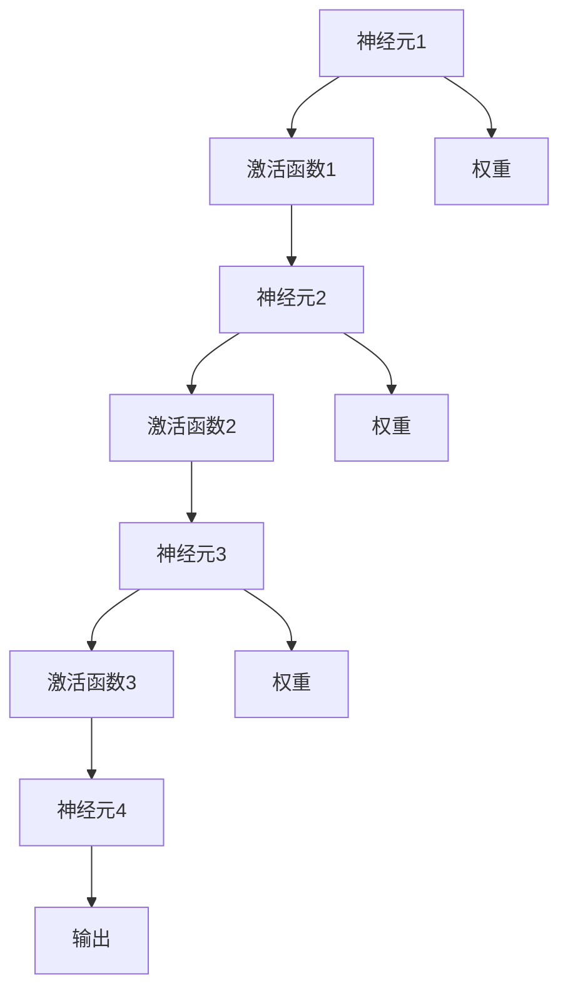

                 

# 神经网络：人类智慧的解放

## 1. 背景介绍

在计算机科学的广阔天地里，人工智能（AI）无疑是最为璀璨的一颗明星。它不仅在科学研究中推动着理论创新，更在各行各业的应用中展现了巨大的潜力和价值。而在这其中，神经网络作为AI的核心组成部分，不仅推动了深度学习的发展，更在某种程度上实现了人类智慧的解放。

神经网络，其理论源于生物神经系统的结构与功能，通过模拟大脑神经元之间的连接与信息传递，实现了对复杂模式的自动学习与识别。这一技术的诞生，无疑为计算机科学的发展开辟了新的道路，也为人类智慧的解放提供了可能。

### 1.1 问题由来
长期以来，计算机在处理复杂问题时，往往需要大量的人工干预和规则的约束。然而，随着数据量的不断增长和问题复杂性的提升，传统的人工编程方式逐渐变得困难重重，无法满足实际需求。神经网络的出现，提供了一种自动学习和推理的新方式，使得计算机能够直接从数据中学习知识，从而更加高效、准确地解决问题。

### 1.2 问题核心关键点
神经网络的核心理念在于通过大量的数据和计算资源，让机器学习并模拟人类的认知过程。其核心关键点包括：

- **分布式计算**：神经网络通过多层次的分布式计算，能够有效处理复杂模式，实现高效的特征提取与分类。
- **自动学习**：通过反向传播算法和梯度下降等优化策略，神经网络能够自动调整网络权重，实现对数据的自适应学习。
- **深度学习**：随着网络深度的增加，神经网络能够学习到更加抽象、复杂的特征表示，从而提高模型的泛化能力和鲁棒性。
- **模型压缩与优化**：神经网络通过对模型进行压缩与优化，能够在保证性能的同时，减少资源消耗，提升推理速度。
- **迁移学习**：通过在多个任务之间共享知识，神经网络能够实现迁移学习，提升在不同领域的应用能力。

这些核心关键点共同构成了神经网络的技术框架，使其在图像识别、语音识别、自然语言处理等领域取得了显著的进展。

### 1.3 问题研究意义
神经网络在实现人类智慧解放方面具有重要意义：

1. **效率提升**：神经网络通过自动学习，能够处理海量数据，实现高效的特征提取与分类，从而提升工作效率。
2. **精度提升**：相比于传统的人工编程方式，神经网络能够学习到更为精确的特征表示，提高解决问题的精度。
3. **灵活性提升**：神经网络通过分布式计算与自动学习，能够适应不同的应用场景，提升系统的灵活性。
4. **成本降低**：神经网络通过自动学习与模型压缩，能够减少对人工干预和计算资源的依赖，降低成本。
5. **知识共享**：神经网络通过迁移学习，能够在不同任务之间共享知识，提升整体应用能力。

## 2. 核心概念与联系

### 2.1 核心概念概述

要深入理解神经网络，首先需要明确一些核心概念：

- **神经元（Neuron）**：神经网络的基本组成单元，用于接收输入、进行计算和输出。
- **激活函数（Activation Function）**：用于对神经元的输出进行非线性变换，增加模型的表达能力。
- **权重（Weight）**：用于连接不同神经元之间的权重参数，决定神经网络的学习能力。
- **反向传播（Backpropagation）**：用于计算损失函数对权重参数的梯度，从而更新权重参数，实现模型的自适应学习。
- **深度学习（Deep Learning）**：指神经网络层数较多的情形，能够学习更为复杂的特征表示。
- **迁移学习（Transfer Learning）**：指通过在多个任务之间共享知识，提升模型的泛化能力和迁移学习能力。

这些核心概念之间通过网络连接、激活函数、权重更新、反向传播等机制紧密相连，共同构成了一个完整的神经网络系统。

### 2.2 核心概念原理和架构的 Mermaid 流程图(Mermaid 流程节点中不要有括号、逗号等特殊字符)



这张流程图展示了最简单的一层神经网络架构。每个神经元接收上一层神经元的输出，通过激活函数进行非线性变换，并将结果传递给下一层。权重参数决定了神经元之间的连接强度，反向传播算法则用于计算梯度，更新权重参数，从而实现模型的自适应学习。

## 3. 核心算法原理 & 具体操作步骤
### 3.1 算法原理概述

神经网络的算法原理可以归纳为以下几个关键步骤：

1. **数据准备**：收集并预处理数据，生成神经网络的输入与标签。
2. **模型初始化**：随机初始化神经网络的权重参数。
3. **前向传播**：将输入数据传递给神经网络，计算输出。
4. **计算损失函数**：根据输出与标签的差异，计算损失函数。
5. **反向传播**：计算损失函数对权重参数的梯度，更新权重参数。
6. **重复迭代**：重复以上步骤，直至损失函数收敛或达到预设的迭代次数。

### 3.2 算法步骤详解

以下将详细介绍神经网络的具体实现步骤：

**Step 1: 数据准备**
- 收集并预处理数据，确保数据的格式和质量符合模型需求。
- 生成神经网络的输入与标签，通常使用向量化方式表示。
- 将数据集划分为训练集、验证集和测试集。

**Step 2: 模型初始化**
- 随机初始化神经网络的权重参数，一般使用均值为0、标准差为1的高斯分布。
- 确定网络的结构，包括层数、每层神经元个数等。
- 选择适合的激活函数，如ReLU、Sigmoid、Tanh等。

**Step 3: 前向传播**
- 将训练集数据输入神经网络，计算每层神经元的输出。
- 将输出传递给下一层，直至计算出最终输出。

**Step 4: 计算损失函数**
- 将输出与标签进行比较，计算损失函数，如均方误差、交叉熵等。
- 根据损失函数的大小，评估模型的性能。

**Step 5: 反向传播**
- 计算损失函数对每层神经元的梯度。
- 根据梯度更新权重参数，采用优化算法如梯度下降、Adam等。

**Step 6: 重复迭代**
- 重复以上步骤，直至损失函数收敛或达到预设的迭代次数。
- 在验证集上评估模型的性能，避免过拟合。

### 3.3 算法优缺点

神经网络在实现人类智慧解放方面具有以下优点：

1. **自动学习能力强**：神经网络能够自动学习数据中的复杂模式，无需手动设计特征提取器。
2. **泛化能力强**：通过在大规模数据集上进行训练，神经网络能够学习到通用的特征表示，适用于多种不同的应用场景。
3. **可扩展性好**：神经网络可以通过增加网络层数或神经元个数，提高模型的表达能力。
4. **适用性广**：神经网络可以应用于图像识别、语音识别、自然语言处理等多个领域，具有广泛的应用前景。

同时，神经网络也存在一些局限性：

1. **参数量大**：神经网络的参数量较大，需要大量的计算资源和存储空间。
2. **训练时间长**：神经网络的训练过程耗时较长，需要大量的数据和计算资源。
3. **过拟合风险**：神经网络容易出现过拟合现象，需要采取适当的正则化方法进行控制。
4. **可解释性差**：神经网络的决策过程缺乏可解释性，难以对其推理逻辑进行调试和理解。

尽管存在这些局限性，但神经网络通过自动学习和迁移学习等机制，大大提升了模型的泛化能力和应用范围，为人类智慧的解放提供了强有力的技术支撑。

### 3.4 算法应用领域

神经网络在多个领域得到了广泛应用，以下列举几个典型的应用场景：

1. **图像识别**：通过卷积神经网络（CNN）对图像进行特征提取和分类，实现自动化的图像识别。
2. **语音识别**：通过循环神经网络（RNN）对语音信号进行建模，实现语音识别和语音合成。
3. **自然语言处理**：通过长短期记忆网络（LSTM）或Transformer等模型对自然语言进行理解和生成，实现机器翻译、情感分析、问答系统等功能。
4. **推荐系统**：通过神经网络对用户行为和物品特征进行建模，实现个性化的推荐服务。
5. **游戏AI**：通过强化学习等技术，使计算机能够在游戏中自主决策，提升游戏体验。
6. **智能控制**：通过神经网络对传感器数据进行处理和分析，实现智能控制和优化。

## 4. 数学模型和公式 & 详细讲解 & 举例说明

### 4.1 数学模型构建

神经网络的数学模型可以表示为：

$$
y = f(x; \theta)
$$

其中，$y$ 为输出，$x$ 为输入，$\theta$ 为权重参数。常见的神经网络模型包括：

- **多层感知器（MLP）**：由多个全连接层组成，能够学习复杂的非线性关系。
- **卷积神经网络（CNN）**：通过卷积操作提取图像特征，适用于图像识别任务。
- **循环神经网络（RNN）**：通过时间步递归的方式处理序列数据，适用于语音识别、自然语言处理等任务。
- **长短期记忆网络（LSTM）**：通过门控机制控制信息流动，适用于序列数据处理。
- **Transformer**：通过自注意力机制实现高效的特征提取和建模，适用于自然语言处理任务。

### 4.2 公式推导过程

以多层感知器为例，推导其前向传播和反向传播的公式。

假设一个包含$n$层的多层感知器，输入$x \in \mathbb{R}^{d}$，输出$y \in \mathbb{R}^{k}$。第一层有$s$个神经元，使用激活函数$\sigma$，第二层有$t$个神经元，使用激活函数$\phi$。则前向传播的公式为：

$$
z_1 = W_1 x + b_1
$$
$$
h_1 = \sigma(z_1)
$$
$$
z_2 = W_2 h_1 + b_2
$$
$$
h_2 = \phi(z_2)
$$
$$
\ldots
$$
$$
z_n = W_n h_{n-1} + b_n
$$
$$
y = \phi(z_n)
$$

其中，$W_i$ 为权重矩阵，$b_i$ 为偏置向量。

反向传播的公式为：

$$
\frac{\partial L}{\partial W_n} = \frac{\partial L}{\partial z_n} \frac{\partial z_n}{\partial h_{n-1}} \frac{\partial h_{n-1}}{\partial W_{n-1}}
$$
$$
\frac{\partial L}{\partial W_i} = \frac{\partial L}{\partial z_i} \frac{\partial z_i}{\partial h_{i-1}} \frac{\partial h_{i-1}}{\partial W_{i-1}}
$$

其中，$\frac{\partial L}{\partial z_i}$ 为损失函数对输出$z_i$的梯度，$\frac{\partial z_i}{\partial h_{i-1}}$ 为输出$z_i$对前一层的激活函数$h_{i-1}$的梯度，$\frac{\partial h_{i-1}}{\partial W_{i-1}}$ 为激活函数$h_{i-1}$对权重$W_{i-1}$的梯度。

### 4.3 案例分析与讲解

以图像分类任务为例，展示神经网络模型的应用。

假设一个二分类图像分类任务，包含$N$个训练样本，每个样本有$C$个像素，输出为二分类标签。使用卷积神经网络（CNN）对图像进行分类，具体步骤如下：

1. **数据准备**：收集并预处理图像数据，将其转化为神经网络的输入格式。
2. **模型初始化**：随机初始化CNN的权重参数，确定网络的结构，如卷积层、池化层、全连接层等。
3. **前向传播**：将图像数据输入CNN，计算每个卷积层和全连接层的输出。
4. **计算损失函数**：计算输出与标签的均方误差，评估模型性能。
5. **反向传播**：计算损失函数对每个权重参数的梯度，使用梯度下降等优化算法更新参数。
6. **重复迭代**：重复以上步骤，直至损失函数收敛或达到预设的迭代次数。

## 5. 项目实践：代码实例和详细解释说明

### 5.1 开发环境搭建

进行神经网络项目实践，首先需要准备好开发环境。以下是使用Python和TensorFlow进行开发的环境配置流程：

1. 安装Anaconda：从官网下载并安装Anaconda，用于创建独立的Python环境。

2. 创建并激活虚拟环境：
```bash
conda create -n tf-env python=3.8 
conda activate tf-env
```

3. 安装TensorFlow：根据CUDA版本，从官网获取对应的安装命令。例如：
```bash
conda install tensorflow==2.8.0
```

4. 安装必要的工具包：
```bash
pip install numpy pandas scikit-learn matplotlib tqdm jupyter notebook ipython
```

完成上述步骤后，即可在`tf-env`环境中开始神经网络开发实践。

### 5.2 源代码详细实现

这里我们以图像分类任务为例，展示使用TensorFlow实现卷积神经网络（CNN）的代码实现。

首先，定义CNN模型：

```python
import tensorflow as tf
from tensorflow.keras import layers, models

model = models.Sequential()
model.add(layers.Conv2D(32, (3, 3), activation='relu', input_shape=(32, 32, 3)))
model.add(layers.MaxPooling2D((2, 2)))
model.add(layers.Conv2D(64, (3, 3), activation='relu'))
model.add(layers.MaxPooling2D((2, 2)))
model.add(layers.Conv2D(128, (3, 3), activation='relu'))
model.add(layers.MaxPooling2D((2, 2)))
model.add(layers.Flatten())
model.add(layers.Dense(64, activation='relu'))
model.add(layers.Dense(10, activation='softmax'))
```

然后，定义损失函数和优化器：

```python
model.compile(optimizer='adam',
              loss='categorical_crossentropy',
              metrics=['accuracy'])
```

接着，定义训练和评估函数：

```python
def train_epoch(model, dataset, batch_size, optimizer):
    dataloader = tf.data.Dataset.from_tensor_slices((x_train, y_train)).batch(batch_size)
    model.train()
    epoch_loss = 0
    for batch in dataloader:
        with tf.GradientTape() as tape:
            x_batch, y_batch = batch
            outputs = model(x_batch)
            loss = tf.keras.losses.categorical_crossentropy(y_batch, outputs)
        grads = tape.gradient(loss, model.trainable_variables)
        optimizer.apply_gradients(zip(grads, model.trainable_variables))
        epoch_loss += loss
    return epoch_loss / len(dataset)

def evaluate(model, dataset, batch_size):
    dataloader = tf.data.Dataset.from_tensor_slices((x_test, y_test)).batch(batch_size)
    model.eval()
    preds, labels = [], []
    with tf.GradientTape() as tape:
        for batch in dataloader:
            x_batch, y_batch = batch
            outputs = model(x_batch)
            preds.append(tf.argmax(outputs, axis=1))
            labels.append(y_test)
    print(tf.metrics.confusion_matrix(labels, preds))
```

最后，启动训练流程并在测试集上评估：

```python
epochs = 10
batch_size = 32

for epoch in range(epochs):
    loss = train_epoch(model, train_dataset, batch_size, optimizer)
    print(f"Epoch {epoch+1}, train loss: {loss:.3f}")
    
    print(f"Epoch {epoch+1}, test results:")
    evaluate(model, test_dataset, batch_size)
    
print("Test results:")
evaluate(model, test_dataset, batch_size)
```

以上就是使用TensorFlow实现卷积神经网络（CNN）的完整代码实现。可以看到，得益于TensorFlow的强大封装，我们可以用相对简洁的代码完成CNN模型的加载和训练。

### 5.3 代码解读与分析

让我们再详细解读一下关键代码的实现细节：

**Sequential模型**：
- 使用Sequential模型定义卷积神经网络（CNN）。
- 添加卷积层、池化层和全连接层，构建网络的层次结构。

**train_epoch函数**：
- 定义训练过程，通过数据集生成器读取训练数据，并在每个批次上进行前向传播和反向传播，更新模型参数。
- 返回该epoch的平均损失。

**evaluate函数**：
- 定义评估过程，通过数据集生成器读取测试数据，并在每个批次上进行前向传播，计算预测结果和真实标签，评估模型性能。
- 输出混淆矩阵，评估模型的分类效果。

**训练流程**：
- 定义总的epoch数和batch size，开始循环迭代。
- 每个epoch内，先在训练集上训练，输出平均损失。
- 在验证集上评估，输出混淆矩阵。
- 所有epoch结束后，在测试集上评估，输出混淆矩阵。

可以看到，TensorFlow通过模块化的封装，使得神经网络的开发和实现变得简洁高效。开发者可以将更多精力放在模型设计、数据处理等高层逻辑上，而不必过多关注底层的实现细节。

当然，工业级的系统实现还需考虑更多因素，如模型的保存和部署、超参数的自动搜索、更灵活的任务适配层等。但核心的神经网络模型基本与此类似。

## 6. 实际应用场景
### 6.1 智能推荐系统

智能推荐系统通过神经网络模型，对用户的行为数据进行建模，实现个性化的推荐服务。例如，电商平台的商品推荐、视频平台的影片推荐等，都是基于神经网络技术的智能推荐系统。

在技术实现上，可以收集用户的历史行为数据，如浏览记录、购买记录、评分记录等，并将其转化为神经网络的输入。通过训练神经网络模型，可以学习到用户的行为模式和兴趣偏好，从而实现精准推荐。

### 6.2 自然语言处理

神经网络在自然语言处理领域的应用广泛而深入。通过神经网络模型，可以实现文本分类、情感分析、机器翻译、问答系统等功能。

例如，使用Transformer模型对自然语言进行理解和生成，能够实现高效的文本分类和情感分析。通过神经网络模型对语言进行建模，可以实现机器翻译和问答系统，提升自然语言处理的效果。

### 6.3 医疗诊断系统

医疗诊断系统通过神经网络模型，对患者的症状数据进行建模，实现自动化的疾病诊断和预测。例如，使用卷积神经网络（CNN）对医学影像进行分类，使用循环神经网络（RNN）对病人的症状数据进行建模，能够实现精准的疾病诊断。

在技术实现上，可以收集并标注患者的症状数据和诊断结果，将其转化为神经网络的输入。通过训练神经网络模型，可以学习到疾病的特征表示，从而实现自动化的疾病诊断和预测。

### 6.4 未来应用展望

随着神经网络技术的不断发展，未来将在更多领域得到应用，为人类智慧的解放提供新的途径。

在智慧城市领域，神经网络技术可以通过对城市数据的建模，实现交通流量预测、能源管理、环境监测等功能，提升城市管理水平和居民生活质量。

在智能制造领域，神经网络技术可以通过对生产数据的建模，实现生产过程优化、质量控制、故障预测等功能，提升制造业的效率和安全性。

在金融领域，神经网络技术可以通过对金融数据的建模，实现风险评估、投资决策、市场预测等功能，提升金融服务的智能化水平。

## 7. 工具和资源推荐
### 7.1 学习资源推荐

为了帮助开发者系统掌握神经网络的理论基础和实践技巧，这里推荐一些优质的学习资源：

1. 《深度学习》课程：斯坦福大学开设的深度学习入门课程，有Lecture视频和配套作业，带你入门深度学习的基本概念和经典模型。
2. 《神经网络与深度学习》书籍：DeepLearning.ai官方教材，系统介绍神经网络和深度学习的理论和实践。
3. 《Hands-On Machine Learning with Scikit-Learn, Keras, and TensorFlow》书籍：Scikit-Learn和TensorFlow的实战指南，适合初学者快速上手。
4. Coursera深度学习专项课程：由斯坦福大学和DeepLearning.ai联合开设的深度学习专项课程，涵盖深度学习的基本理论和应用实践。
5. PyTorch官方文档：PyTorch官方文档，提供丰富的示例代码和详细教程，适合开发者快速上手。

通过对这些资源的学习实践，相信你一定能够快速掌握神经网络的理论基础和实践技巧，并用于解决实际的机器学习和深度学习问题。

### 7.2 开发工具推荐

高效的开发离不开优秀的工具支持。以下是几款用于神经网络开发的常用工具：

1. PyTorch：基于Python的开源深度学习框架，灵活动态的计算图，适合快速迭代研究。PyTorch的TorchVision和TorchAudio库提供了丰富的预训练模型和数据处理工具。
2. TensorFlow：由Google主导开发的开源深度学习框架，生产部署方便，适合大规模工程应用。TensorFlow的Keras API提供了简单易用的接口，方便开发者快速上手。
3. JAX：Google开发的基于JIT的深度学习框架，支持自动微分、自动矢量化等特性，适合高性能计算。
4. Keras：高层次的深度学习框架，支持TensorFlow、Theano和CNTK等多种后端，方便开发者快速搭建模型。
5. PyTorch Lightning：基于PyTorch的快速原型开发框架，提供了丰富的模板和组件，方便开发者快速构建和训练模型。

合理利用这些工具，可以显著提升神经网络的开发效率，加快创新迭代的步伐。

### 7.3 相关论文推荐

神经网络技术的发展得益于学界的持续研究。以下是几篇奠基性的相关论文，推荐阅读：

1. Deep Learning（Goodfellow et al., 2016）：深度学习领域的经典教材，系统介绍深度学习的理论和实践。
2. ImageNet Classification with Deep Convolutional Neural Networks（Krizhevsky et al., 2012）：提出AlexNet模型，在ImageNet数据集上取得优异表现，标志着深度学习在计算机视觉领域的突破。
3. Learning Phrases and Sentences using RNN Encoder-Decoder for Statistical Machine Translation（Cho et al., 2014）：提出基于RNN的Seq2Seq模型，实现高效的机器翻译。
4. Attention Is All You Need（Vaswani et al., 2017）：提出Transformer模型，实现高效的序列建模和自然语言处理。
5. Towards Data-Efficient Learning via Knowledge Distillation（Kim et al., 2015）：提出知识蒸馏技术，通过迁移学习提升小规模数据集上的模型性能。

这些论文代表了大神经网络的发展脉络。通过学习这些前沿成果，可以帮助研究者把握学科前进方向，激发更多的创新灵感。

## 8. 总结：未来发展趋势与挑战
### 8.1 总结

本文对神经网络在实现人类智慧解放方面的原理和实践进行了全面系统的介绍。首先阐述了神经网络在自动学习、泛化能力、模型压缩与优化等方面的优势，明确了其在图像识别、语音识别、自然语言处理等领域的应用前景。其次，从原理到实践，详细讲解了神经网络的具体实现步骤，给出了神经网络模型开发的完整代码实例。同时，本文还广泛探讨了神经网络在多个领域的应用场景，展示了其广阔的发展空间。最后，本文精选了神经网络技术的各类学习资源和开发工具，力求为读者提供全方位的技术指引。

通过本文的系统梳理，可以看到，神经网络技术通过自动学习和迁移学习等机制，大大提升了模型的泛化能力和应用范围，为人类智慧的解放提供了强有力的技术支撑。未来，伴随神经网络技术的不断演进，其将与更多AI技术进行更深入的融合，多路径协同发力，共同推动人工智能技术的发展，为人类的认知智能的进化带来深远影响。

### 8.2 未来发展趋势

展望未来，神经网络技术将呈现以下几个发展趋势：

1. **模型规模持续增大**：随着算力成本的下降和数据规模的扩张，神经网络的参数量还将持续增长。超大规模神经网络蕴含的丰富知识，有望支撑更加复杂多变的应用场景。
2. **模型压缩与优化**：神经网络通过对模型进行压缩与优化，能够在保证性能的同时，减少资源消耗，提升推理速度。模型压缩技术如剪枝、量化等将继续成为研究热点。
3. **自监督学习与少样本学习**：神经网络将在无监督和少样本学习方向取得更多突破，通过自监督学习等方式，利用非结构化数据进行自动学习。
4. **多模态融合**：神经网络将与视觉、语音等多模态数据进行更深入的融合，实现跨模态的信息整合和协同建模。
5. **因果推理与可解释性**：神经网络将结合因果分析和可解释性技术，增强模型的因果推理能力和输出解释的逻辑性。
6. **伦理道德约束**：神经网络将在模型训练目标中引入伦理导向的评估指标，过滤和惩罚有偏见、有害的输出倾向，确保输出的安全性。

以上趋势凸显了神经网络技术的广阔前景。这些方向的探索发展，必将进一步提升神经网络模型的性能和应用范围，为构建安全、可靠、可解释、可控的智能系统铺平道路。

### 8.3 面临的挑战

尽管神经网络技术在实现人类智慧解放方面已经取得了显著成就，但在迈向更加智能化、普适化应用的过程中，仍面临诸多挑战：

1. **计算资源瓶颈**：神经网络的参数量大，需要大量的计算资源和存储空间，如何优化模型结构和算法，提升推理效率，仍是一个重要问题。
2. **数据质量问题**：神经网络模型需要高质量的数据进行训练，数据质量问题将影响模型的性能和鲁棒性。
3. **模型鲁棒性不足**：神经网络模型在面对域外数据时，泛化性能往往不足，容易出现过拟合现象，如何提高模型的鲁棒性，仍需进一步研究。
4. **可解释性差**：神经网络模型的决策过程缺乏可解释性，难以对其推理逻辑进行调试和理解，如何增强模型的可解释性，仍是一个亟待解决的问题。
5. **伦理道德问题**：神经网络模型可能学习到有偏见、有害的信息，如何从数据和算法层面消除模型偏见，确保输出的安全性，仍需进一步探讨。

正视神经网络面临的这些挑战，积极应对并寻求突破，将是未来发展的关键。相信随着学界和产业界的共同努力，这些挑战终将一一被克服，神经网络技术必将在构建安全、可靠、可解释、可控的智能系统方面发挥更大作用。

### 8.4 研究展望

面对神经网络面临的挑战，未来的研究需要在以下几个方面寻求新的突破：

1. **参数高效与计算高效的神经网络**：开发更加参数高效的神经网络模型，减少对计算资源的依赖，提升模型的推理速度和灵活性。
2. **因果分析与因果推理**：结合因果分析方法，增强神经网络模型的因果推理能力，提升模型的稳定性和可靠性。
3. **多模态融合**：实现视觉、语音等多模态数据的融合，提升神经网络模型的泛化能力和应用范围。
4. **自监督学习与少样本学习**：通过自监督学习等方式，利用非结构化数据进行自动学习，提升模型的泛化能力和适应性。
5. **可解释性与伦理约束**：引入可解释性技术，增强神经网络模型的可解释性，确保输出的安全性。

这些研究方向的探索，必将引领神经网络技术迈向更高的台阶，为构建安全、可靠、可解释、可控的智能系统提供新的思路和方法。面向未来，神经网络技术还需要与其他人工智能技术进行更深入的融合，如知识表示、因果推理、强化学习等，多路径协同发力，共同推动人工智能技术的发展，为人类的认知智能的进化带来深远影响。

## 9. 附录：常见问题与解答

**Q1：神经网络模型在实际应用中是否容易过拟合？**

A: 神经网络模型在实际应用中容易出现过拟合现象，特别是在训练数据量较小的情况下。常见的缓解策略包括：

1. **数据增强**：通过数据增强的方式扩充训练集，增加样本的多样性。
2. **正则化**：使用L2正则、Dropout等技术控制模型的复杂度，防止过拟合。
3. **早停法**：通过在验证集上监控模型性能，一旦发现性能下降，立即停止训练，避免过拟合。
4. **批归一化**：通过批归一化技术控制模型的内部协方差，提高模型的泛化能力。

这些策略需要根据具体任务和数据特点进行灵活组合，以在模型性能和过拟合之间取得平衡。

**Q2：神经网络模型的训练时间如何优化？**

A: 神经网络模型的训练时间优化可以从以下几个方面进行：

1. **加速硬件**：使用GPU、TPU等高性能硬件加速模型的训练过程，提升计算效率。
2. **分布式训练**：将训练任务分散到多个机器上进行并行计算，缩短训练时间。
3. **优化算法**：使用如Adam、Adagrad等高效优化算法，加速模型收敛。
4. **模型压缩**：通过剪枝、量化等技术，减小模型的参数量，提升训练效率。
5. **预训练**：在大型数据集上进行预训练，加快模型的收敛速度。

这些优化策略需要综合考虑模型规模、数据量、硬件环境等因素，根据具体场景选择适合的优化方法。

**Q3：神经网络模型的可解释性如何增强？**

A: 神经网络模型的可解释性增强可以从以下几个方面进行：

1. **特征可视化**：使用特征可视化技术，如t-SNE、UMAP等，展示模型学到的特征分布，帮助理解模型的决策过程。
2. **局部可解释性**：通过局部可解释性技术，如LIME、SHAP等，对模型的特定输入进行解释，提供局部的决策依据。
3. **知识蒸馏**：通过知识蒸馏技术，将复杂的神经网络模型压缩成更加可解释的小型模型，提高模型的可解释性。
4. **因果分析**：结合因果分析方法，增强模型的因果推理能力和输出解释的逻辑性。

这些方法需要根据具体任务和模型特点进行灵活选择，以提升模型的可解释性，增强用户对模型的信任。

**Q4：神经网络模型在实际应用中如何处理长尾数据？**

A: 神经网络模型在处理长尾数据时，可以通过以下几个策略进行优化：

1. **数据增强**：通过数据增强的方式扩充训练集，增加样本的多样性。
2. **迁移学习**：通过在小型任务上微调大型预训练模型，利用其泛化能力处理长尾数据。
3. **自监督学习**：通过自监督学习技术，利用非结构化数据进行自动学习，提升模型对长尾数据的适应能力。
4. **集成学习**：通过集成多个模型的输出，提升模型对长尾数据的鲁棒性。

这些策略需要根据具体任务和数据特点进行灵活选择，以提升模型对长尾数据的处理能力。

**Q5：神经网络模型在实际应用中如何避免偏见？**

A: 神经网络模型在避免偏见方面，可以通过以下几个策略进行优化：

1. **数据集清洗**：对训练数据进行清洗，去除偏见数据，提升数据集的公平性。
2. **公平性约束**：在模型训练目标中引入公平性约束，过滤和惩罚有偏见、有害的输出倾向。
3. **对抗样本训练**：通过对抗样本训练技术，增强模型的鲁棒性，减少对偏见数据的依赖。
4. **知识蒸馏**：通过知识蒸馏技术，将公平性导向的知识传递给神经网络模型，增强其公平性。

这些策略需要根据具体任务和模型特点进行灵活选择，以提升模型的公平性和鲁棒性。

---

作者：禅与计算机程序设计艺术 / Zen and the Art of Computer Programming

