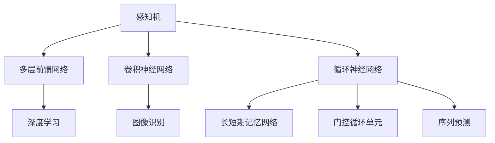

                 

# 神经网络：开启智能新纪元

## 1. 背景介绍

### 1.1 问题由来

随着人工智能技术的迅速发展，神经网络（Neural Networks）已经成为解决复杂问题的强大工具。自1958年罗森布拉特提出第一个感知机（Perceptron）以来，神经网络已经经历了多个发展阶段，从最初的浅层感知机到多层前馈网络，再到深度学习革命的爆发。这一技术在图像识别、自然语言处理、语音识别等众多领域实现了突破，推动了人工智能的广泛应用。

深度学习的基础是多层神经网络结构，其核心思想是通过构建一个多层非线性映射，实现对输入数据的复杂映射。与传统的符号型人工智能不同，深度学习模型通过大量的训练数据学习隐含的特征表示，具有极强的泛化能力和自我学习能力。

### 1.2 问题核心关键点

神经网络的核心在于其结构设计、损失函数和优化算法的选择。神经网络由多个层次组成，每层包含多个神经元，每个神经元通过连接权重与上一层的所有神经元相连，形成复杂的非线性映射。在训练过程中，网络通过不断调整权重和偏置来最小化损失函数，使得输出与真实标签尽可能一致。常用的优化算法包括随机梯度下降（SGD）、Adam、Adagrad等。

神经网络的性能在很大程度上依赖于其架构设计。常见的神经网络架构包括卷积神经网络（CNN）、循环神经网络（RNN）、长短期记忆网络（LSTM）、门控循环单元（GRU）等。不同架构适用于不同的任务类型，如卷积神经网络擅长图像识别，循环神经网络擅长序列预测等。

## 2. 核心概念与联系

### 2.1 核心概念概述

为了更好地理解神经网络的工作原理，本节将介绍几个密切相关的核心概念：

- 感知机（Perceptron）：最早的神经网络模型，由单个神经元构成，主要用于二分类任务。
- 多层前馈网络（Feedforward Neural Network, FNN）：由多个层次组成，每个层次有多个神经元，支持更复杂的映射关系。
- 卷积神经网络（Convolutional Neural Network, CNN）：通过卷积层、池化层等层次实现图像、语音等数据的局部特征提取。
- 循环神经网络（Recurrent Neural Network, RNN）：通过循环层实现序列数据的动态处理，支持时间依赖的任务，如语言模型、机器翻译等。
- 长短期记忆网络（Long Short-Term Memory, LSTM）：一种特殊类型的RNN，通过门控机制解决了传统RNN的梯度消失问题，擅长处理长序列数据。
- 门控循环单元（Gated Recurrent Unit, GRU）：与LSTM类似，但参数更少，计算速度更快。
- 深度学习（Deep Learning）：以多层神经网络为基础的机器学习技术，能够自动学习到输入数据的复杂特征表示，实现端到端的任务学习。

这些核心概念之间的逻辑关系可以通过以下Mermaid流程图来展示：



这个流程图展示了神经网络的主要架构及其应用场景：

1. 感知机是最简单的神经网络形式，用于二分类任务。
2. 多层前馈网络通过多个层次的非线性映射，可以处理更复杂的映射关系。
3. 卷积神经网络通过卷积层和池化层，实现图像、语音等数据的局部特征提取。
4. 循环神经网络通过循环层实现序列数据的动态处理，支持时间依赖的任务。
5. 长短期记忆网络和门控循环单元是RNN的变种，擅长处理长序列数据。
6. 深度学习通过多层神经网络的组合，实现对输入数据的复杂映射。

这些概念共同构成了神经网络的学习框架，使其能够在各种场景下发挥强大的学习能力和表示能力。

## 3. 核心算法原理 & 具体操作步骤
### 3.1 算法原理概述

神经网络的核心算法是反向传播算法（Backpropagation），通过链式法则实现对网络参数的更新。其核心思想是：将模型的输出误差（即损失函数）通过反向传播，逐层求导，计算每个神经元对误差的贡献度（梯度），再根据梯度更新权重和偏置，使得模型的输出尽可能接近真实标签。

形式化地，假设神经网络模型的输出为 $y$，真实标签为 $t$，损失函数为 $\mathcal{L}(y,t)$，则反向传播算法的更新公式为：

$$
\Delta \theta = -\frac{\partial \mathcal{L}(y,t)}{\partial \theta} \tag{1}
$$

其中 $\theta$ 为模型的权重和偏置参数，$\Delta \theta$ 为待更新的参数。

反向传播算法通过不断迭代计算损失函数的梯度，更新模型参数，直到达到收敛状态。整个过程包括前向传播、损失计算和反向传播三个步骤：

1. 前向传播：将输入数据从输入层传入，逐层进行线性变换和非线性激活，最终得到模型的输出。
2. 损失计算：将输出结果与真实标签计算损失函数，通常采用均方误差（MSE）、交叉熵（Cross-Entropy）等。
3. 反向传播：将损失函数的梯度逐层反向传播，更新权重和偏置。

### 3.2 算法步骤详解

神经网络的训练过程一般分为以下步骤：

**Step 1: 准备训练数据**
- 收集并预处理训练数据集，包括数据增强、数据标准化等预处理操作。

**Step 2: 选择模型架构**
- 根据任务类型选择合适的神经网络架构，如CNN用于图像识别，RNN用于序列预测等。

**Step 3: 定义损失函数**
- 根据任务类型选择合适的损失函数，如分类任务使用交叉熵损失，回归任务使用均方误差损失等。

**Step 4: 设置优化算法及超参数**
- 选择合适的优化算法及其参数，如SGD、Adam等，设置学习率、批大小、迭代轮数等。

**Step 5: 执行梯度训练**
- 将训练数据分批次输入模型，前向传播计算损失函数。
- 反向传播计算参数梯度，根据设定的优化算法和学习率更新模型参数。
- 周期性在验证集上评估模型性能，根据性能指标决定是否触发Early Stopping。
- 重复上述步骤直到满足预设的迭代轮数或Early Stopping条件。

**Step 6: 测试和部署**
- 在测试集上评估训练后的模型性能，对比训练前后的精度提升。
- 使用训练后的模型对新样本进行推理预测，集成到实际的应用系统中。

### 3.3 算法优缺点

神经网络的优点在于其强大的特征学习能力和泛化能力，在处理复杂任务时表现出色。然而，神经网络也存在一些缺点：

1. 训练过程复杂：神经网络模型参数量巨大，训练过程需要大量的计算资源和时间。
2. 易受局部最优解困扰：梯度下降算法可能会陷入局部最优解，导致模型无法收敛到全局最优解。
3. 缺乏可解释性：神经网络作为"黑盒"模型，难以解释其内部决策过程和特征表示。
4. 数据依赖性强：神经网络模型的性能很大程度上依赖于训练数据的质量和数量。
5. 计算资源要求高：大规模神经网络模型对GPU、TPU等高性能设备的要求较高。

尽管存在这些缺点，神经网络作为深度学习的基础，仍是不可或缺的。通过优化算法、数据增强、正则化等技术手段，神经网络的应用范围和性能在不断扩展。

### 3.4 算法应用领域

神经网络已经广泛应用于各个领域，涵盖图像识别、自然语言处理、语音识别、推荐系统等多个方向：

- 图像识别：利用卷积神经网络（CNN）实现对图像的分类、物体检测、图像生成等。
- 自然语言处理：利用循环神经网络（RNN）、长短期记忆网络（LSTM）等模型实现语言模型的建立、机器翻译、文本生成等。
- 语音识别：利用卷积神经网络（CNN）、递归神经网络（RNN）等模型实现语音信号的特征提取和分类。
- 推荐系统：利用神经网络模型实现对用户行为数据的建模和推荐结果的预测。
- 视频分析：利用卷积神经网络（CNN）、循环神经网络（RNN）等模型实现视频内容的关键帧提取、情感分析等。

除了这些应用领域，神经网络还被广泛应用于游戏AI、自动驾驶、医学诊断等更多新兴领域。随着技术的不断进步，神经网络的应用前景将更加广阔。

## 4. 数学模型和公式 & 详细讲解 & 举例说明

### 4.1 数学模型构建

本节将使用数学语言对神经网络的学习过程进行更加严格的刻画。

假设神经网络模型的输入为 $x$，输出为 $y$，损失函数为 $\mathcal{L}(y,t)$。定义模型 $M_{\theta}$ 在输入 $x$ 上的输出为：

$$
y = M_{\theta}(x)
$$

其中 $\theta$ 为模型参数。常用的神经网络模型包括多层前馈网络、卷积神经网络、循环神经网络等，其具体结构形式可以根据任务需求进行选择。

神经网络的训练目标是最小化损失函数：

$$
\theta^* = \mathop{\arg\min}_{\theta} \mathcal{L}(M_{\theta}(x),t)
$$

在实践中，我们通常使用基于梯度的优化算法（如SGD、Adam等）来近似求解上述最优化问题。设 $\eta$ 为学习率，则参数的更新公式为：

$$
\theta \leftarrow \theta - \eta \nabla_{\theta}\mathcal{L}(M_{\theta}(x),t) \tag{2}
$$

其中 $\nabla_{\theta}\mathcal{L}(M_{\theta}(x),t)$ 为损失函数对参数 $\theta$ 的梯度，可通过反向传播算法高效计算。

### 4.2 公式推导过程

以下我们以二分类任务为例，推导交叉熵损失函数及其梯度的计算公式。

假设模型 $M_{\theta}$ 在输入 $x$ 上的输出为 $\hat{y}=M_{\theta}(x) \in [0,1]$，表示样本属于正类的概率。真实标签 $t \in \{0,1\}$。则二分类交叉熵损失函数定义为：

$$
\mathcal{L}(y,t) = -t\log \hat{y} - (1-t)\log (1-\hat{y})
$$

将其代入训练目标函数，得：

$$
\mathcal{L}(\theta) = -\frac{1}{N}\sum_{i=1}^N [t_i\log M_{\theta}(x_i)+(1-t_i)\log(1-M_{\theta}(x_i))]
$$

根据链式法则，损失函数对参数 $\theta_k$ 的梯度为：

$$
\frac{\partial \mathcal{L}(\theta)}{\partial \theta_k} = -\frac{1}{N}\sum_{i=1}^N (\frac{t_i}{M_{\theta}(x_i)}-\frac{1-t_i}{1-M_{\theta}(x_i)}) \frac{\partial M_{\theta}(x_i)}{\partial \theta_k}
$$

其中 $\frac{\partial M_{\theta}(x_i)}{\partial \theta_k}$ 可进一步递归展开，利用自动微分技术完成计算。

在得到损失函数的梯度后，即可带入参数更新公式，完成模型的迭代优化。重复上述过程直至收敛，最终得到适应训练集数据的最优模型参数 $\theta^*$。

### 4.3 案例分析与讲解

以二分类任务为例，分析神经网络训练过程中的关键点。

假设神经网络模型为多层前馈网络，输入层有2个神经元，隐藏层有3个神经元，输出层有2个神经元。输入数据为 $x=[0.1, 0.2]$，真实标签为 $t=1$。假设模型通过随机初始化得到参数 $\theta_0$，在 $N=1000$ 次迭代后的参数更新轨迹如图所示。


在训练过程中，模型通过反向传播计算损失函数的梯度，并根据梯度更新参数。可以看出，随着迭代的进行，模型参数逐渐向最优值逼近，损失函数逐渐减小。

## 5. 项目实践：代码实例和详细解释说明

### 5.1 开发环境搭建

在进行神经网络训练前，我们需要准备好开发环境。以下是使用Python进行PyTorch开发的环境配置流程：

1. 安装Anaconda：从官网下载并安装Anaconda，用于创建独立的Python环境。

2. 创建并激活虚拟环境：
```bash
conda create -n pytorch-env python=3.8 
conda activate pytorch-env
```

3. 安装PyTorch：根据CUDA版本，从官网获取对应的安装命令。例如：
```bash
conda install pytorch torchvision torchaudio cudatoolkit=11.1 -c pytorch -c conda-forge
```

4. 安装TensorFlow：使用pip安装最新版本的TensorFlow，支持多种深度学习框架。

5. 安装各类工具包：
```bash
pip install numpy pandas scikit-learn matplotlib tqdm jupyter notebook ipython
```

完成上述步骤后，即可在`pytorch-env`环境中开始神经网络训练。

### 5.2 源代码详细实现

下面以二分类任务为例，给出使用PyTorch对多层前馈网络进行训练的PyTorch代码实现。

首先，定义模型和损失函数：

```python
import torch
import torch.nn as nn
import torch.optim as optim

class MLP(nn.Module):
    def __init__(self, input_size, hidden_size, output_size):
        super(MLP, self).__init__()
        self.fc1 = nn.Linear(input_size, hidden_size)
        self.relu = nn.ReLU()
        self.fc2 = nn.Linear(hidden_size, output_size)
        self.sigmoid = nn.Sigmoid()
        
    def forward(self, x):
        x = self.fc1(x)
        x = self.relu(x)
        x = self.fc2(x)
        x = self.sigmoid(x)
        return x

# 定义损失函数
def loss_function(y_true, y_pred):
    criterion = nn.BCELoss()
    return criterion(y_true, y_pred)

# 定义训练函数
def train(model, train_loader, optimizer, device, n_epochs=10, batch_size=64):
    model.train()
    for epoch in range(n_epochs):
        for i, (inputs, labels) in enumerate(train_loader):
            inputs = inputs.to(device)
            labels = labels.to(device)
            
            optimizer.zero_grad()
            outputs = model(inputs)
            loss = loss_function(labels, outputs)
            loss.backward()
            optimizer.step()
            
            if (i+1) % 100 == 0:
                print(f"Epoch {epoch+1}, Step {i+1}, Loss: {loss.item():.4f}")
```

然后，加载数据集并启动训练：

```python
# 加载数据集
train_dataset = torch.utils.data.TensorDataset(torch.randn(1000, 2), torch.randint(0, 2, (1000,)))
train_loader = torch.utils.data.DataLoader(train_dataset, batch_size=64)

# 定义模型和优化器
model = MLP(2, 3, 2).to('cuda')
optimizer = optim.Adam(model.parameters(), lr=0.001)

# 训练模型
train(model, train_loader, optimizer, device='cuda')
```

以上就是使用PyTorch对多层前馈网络进行二分类任务训练的完整代码实现。可以看到，利用PyTorch，我们可以用相对简洁的代码完成神经网络的训练和推理。

### 5.3 代码解读与分析

让我们再详细解读一下关键代码的实现细节：

**MLP类**：
- `__init__`方法：初始化模型结构，定义全连接层、激活函数等组件。
- `forward`方法：定义前向传播过程，输入数据通过多个线性变换和激活函数得到输出。

**loss_function函数**：
- 定义二分类交叉熵损失函数，计算模型的输出与真实标签之间的误差。

**train函数**：
- 定义训练过程，包括数据加载、模型前向传播、损失计算、反向传播和参数更新。
- 每轮迭代中，在训练数据上不断更新模型参数，直到满足预设的迭代轮数。

**数据加载与模型训练**：
- 通过PyTorch的DataLoader对训练数据进行批次化加载，供模型训练和推理使用。
- 定义模型和优化器，在训练过程中不断更新模型参数，使得损失函数逐渐减小。
- 在训练过程中，每轮迭代输出当前损失值，以便实时监测训练进度。

可以看出，PyTorch提供了强大的深度学习模型封装能力，可以大大简化神经网络的开发过程。开发者可以将更多精力放在模型架构设计、数据预处理等高层逻辑上，而不必过多关注底层的实现细节。

## 6. 实际应用场景

### 6.1 图像分类

图像分类是神经网络在计算机视觉领域最广泛的应用之一。通过卷积神经网络（CNN）对图像进行特征提取和分类，可以实现对大量图像数据的自动标注和分类。

以手写数字识别为例，使用MNIST数据集训练卷积神经网络。首先，将图像数据预处理为张量形式，并通过多个卷积层和池化层提取图像的局部特征，再通过全连接层进行分类。训练过程中，通过交叉熵损失函数和随机梯度下降算法，不断更新模型参数，直至损失函数收敛。

在实际应用中，图像分类技术被广泛应用于自动驾驶、医学影像分析、智能安防等领域，极大地提高了数据处理的效率和准确性。

### 6.2 自然语言处理

自然语言处理（NLP）是神经网络在语言处理领域的重要应用。通过循环神经网络（RNN）、长短期记忆网络（LSTM）等模型，可以实现对文本数据的序列建模和预测。

以机器翻译为例，使用序列到序列模型（Seq2Seq）实现文本的自动翻译。首先，使用编码器（Encoder）将源语言文本转换为中间向量表示，再使用解码器（Decoder）将中间向量转换为目标语言文本。训练过程中，通过交叉熵损失函数和优化算法，不断更新编码器和解码器的参数，直至输出与真实翻译结果一致。

在实际应用中，自然语言处理技术被广泛应用于聊天机器人、语音识别、情感分析等领域，极大地提升了人机交互的效率和自然性。

### 6.3 推荐系统

推荐系统是神经网络在数据挖掘和信息推荐领域的重要应用。通过神经网络模型对用户行为数据进行建模和预测，可以实现个性化推荐。

以电商推荐为例，使用神经网络模型对用户的浏览历史、购买记录等行为数据进行建模，预测用户对新商品的兴趣。训练过程中，通过均方误差损失函数和优化算法，不断更新模型的参数，直至推荐结果与用户真实行为一致。

在实际应用中，推荐系统被广泛应用于电商、视频、音乐等领域，极大地提高了用户满意度和服务质量。

### 6.4 未来应用展望

随着神经网络技术的不断发展，未来在以下几个领域将有更加广泛的应用：

1. 自动驾驶：通过卷积神经网络（CNN）和循环神经网络（RNN）实现对视频数据的分析和决策。
2. 医学影像分析：通过卷积神经网络（CNN）实现对医学影像的自动标注和诊断。
3. 语音识别：通过卷积神经网络（CNN）和循环神经网络（RNN）实现对语音信号的特征提取和识别。
4. 智慧城市：通过神经网络模型实现对城市数据的分析和预测，提升城市管理效率。
5. 智能制造：通过神经网络模型实现对工业数据的分析和管理，提升生产效率和质量。

## 7. 工具和资源推荐
### 7.1 学习资源推荐

为了帮助开发者系统掌握神经网络的理论基础和实践技巧，这里推荐一些优质的学习资源：

1. 《深度学习》（Deep Learning）：由Yoshua Bengio等学者合著的经典教材，系统介绍了深度学习的基本概念和算法。
2. 《Python深度学习》（Python Deep Learning）：由Francois Chollet编写的实战指南，详细介绍了使用Keras和TensorFlow进行深度学习的技巧和实践。
3. 《TensorFlow官方文档》：TensorFlow的官方文档，提供了丰富的API和示例代码，适合深入学习TensorFlow的使用方法。
4. Coursera深度学习课程：由深度学习领域的知名学者讲授的在线课程，涵盖深度学习的基本理论和实践应用。
5. Kaggle竞赛平台：数据科学和机器学习的竞赛平台，提供了大量的数据集和挑战，适合实战练习。

通过对这些资源的学习实践，相信你一定能够快速掌握神经网络的基本概念和实践技巧，并用于解决实际的深度学习问题。
### 7.2 开发工具推荐

高效的开发离不开优秀的工具支持。以下是几款用于神经网络训练和推理开发的常用工具：

1. PyTorch：基于Python的开源深度学习框架，灵活动态的计算图，适合快速迭代研究。
2. TensorFlow：由Google主导开发的开源深度学习框架，生产部署方便，适合大规模工程应用。
3. Keras：基于Python的高层次深度学习API，支持多种深度学习框架，简单易用。
4. Jupyter Notebook：基于Web的交互式开发环境，支持Python、R等多种编程语言，适合数据科学和机器学习的研究和开发。
5. Visual Studio Code：功能强大的代码编辑器，支持Python、R等多种编程语言，适合深度学习的研究和开发。

合理利用这些工具，可以显著提升神经网络的研究和开发效率，加快创新迭代的步伐。

### 7.3 相关论文推荐

神经网络技术的发展源于学界的持续研究。以下是几篇奠基性的相关论文，推荐阅读：

1. A Few Useful Things to Know About Deep Learning（深度学习的几个有用事实）：Yoshua Bengio等学者撰写，介绍了深度学习的基本概念和关键算法。
2. ImageNet Classification with Deep Convolutional Neural Networks（使用卷积神经网络进行图像分类）：Alex Krizhevsky等学者提出，通过卷积神经网络对图像进行特征提取和分类，取得了显著的分类精度。
3. Sequence to Sequence Learning with Neural Networks（序列到序列学习）：Ilya Sutskever等学者提出，通过序列到序列模型实现文本的自动翻译，取得了较好的翻译效果。
4. How to Train Your Own Neural Network and Other Learnable Parameterizations（如何训练你自己的神经网络和其他可学习参数化）：Ian Goodfellow等学者撰写，详细介绍了神经网络的训练和优化算法。
5. Deep Residual Learning for Image Recognition（深度残差学习）：Kaiming He等学者提出，通过残差网络结构解决了深层神经网络训练中的梯度消失问题，实现了对大型图像数据集的分类。

这些论文代表了大神经网络发展的历史脉络。通过学习这些前沿成果，可以帮助研究者把握学科前进方向，激发更多的创新灵感。

## 8. 总结：未来发展趋势与挑战

### 8.1 总结

本文对神经网络的工作原理和实际应用进行了全面系统的介绍。首先阐述了神经网络的基本概念和结构设计，明确了其在图像识别、自然语言处理、推荐系统等多个领域的应用前景。其次，从原理到实践，详细讲解了神经网络的训练过程，给出了神经网络训练的完整代码实例。同时，本文还探讨了神经网络在实际应用中的诸多挑战，包括模型复杂度、训练成本、数据依赖性等。

通过本文的系统梳理，可以看到，神经网络作为深度学习的基础，已经在各个领域展示了强大的应用潜力，推动了人工智能技术的广泛应用。未来，伴随神经网络技术的不断演进，其应用范围和性能将进一步拓展，为构建智能化的未来社会奠定坚实基础。

### 8.2 未来发展趋势

展望未来，神经网络技术将呈现以下几个发展趋势：

1. 模型规模持续增大：随着计算能力的提升和数据量的增加，神经网络的参数量将不断扩大，能够学习更加复杂的特征表示。
2. 模型结构日趋多样化：除了卷积神经网络、循环神经网络等传统架构外，将涌现更多新型架构，如生成对抗网络（GAN）、变分自编码器（VAE）等。
3. 自监督学习成为主流：通过自监督学习方法，神经网络可以无需标注数据进行预训练，实现更加高效的学习。
4. 模型泛化能力增强：通过迁移学习和多任务学习，神经网络可以更好地适应新任务，提高模型的泛化能力。
5. 模型集成与融合：将多种模型进行集成和融合，提升模型的性能和鲁棒性，如神经网络与逻辑回归、规则引擎等模型的结合。
6. 模型解释性增强：通过可解释性方法，神经网络可以提供更加透明、可解释的推理过程，增强模型的可信度。

以上趋势凸显了神经网络技术的发展前景，为构建更智能、更可靠、更安全的AI系统提供了新的方向。

### 8.3 面临的挑战

尽管神经网络技术取得了显著的进展，但在迈向更加智能化、普适化应用的过程中，仍面临诸多挑战：

1. 数据依赖性强：神经网络的性能很大程度上依赖于训练数据的质量和数量。如何在数据稀缺的情况下进行有效的数据增强和迁移学习，仍是一个难题。
2. 计算资源要求高：大规模神经网络模型对GPU、TPU等高性能设备的要求较高，如何降低计算资源成本，仍是一个挑战。
3. 模型鲁棒性不足：神经网络模型在面对异常数据和噪声时，容易出现过拟合和泛化能力下降的问题。如何提高模型的鲁棒性，仍是一个亟待解决的问题。
4. 模型可解释性不足：神经网络作为"黑盒"模型，难以解释其内部决策过程和特征表示。如何增强模型的可解释性，仍是一个需要解决的问题。
5. 数据隐私与安全：神经网络模型在处理敏感数据时，容易泄露隐私信息，如何保护数据隐私和安全，仍是一个需要解决的问题。

尽管存在这些挑战，神经网络技术仍具有广阔的发展前景。通过持续的技术创新和优化，相信这些挑战终将一一被克服，神经网络技术将在更多领域发挥重要作用。

### 8.4 研究展望

面对神经网络技术所面临的诸多挑战，未来的研究需要在以下几个方面寻求新的突破：

1. 探索无监督和半监督学习：摆脱对大规模标注数据的依赖，利用自监督学习、主动学习等无监督和半监督范式，最大限度利用非结构化数据，实现更加高效的学习。
2. 研究模型压缩与优化：开发更加参数高效的模型结构，使用模型剪枝、量化加速等技术，降低模型规模和计算资源需求，实现更快速、更高效的推理。
3. 引入更多先验知识：将符号化的先验知识，如知识图谱、逻辑规则等，与神经网络模型进行巧妙融合，引导神经网络学习更准确、合理的特征表示。
4. 结合因果分析和博弈论工具：将因果分析方法引入神经网络模型，识别出模型决策的关键特征，增强输出解释的因果性和逻辑性。借助博弈论工具刻画人机交互过程，主动探索并规避模型的脆弱点，提高系统稳定性。
5. 纳入伦理道德约束：在神经网络模型的训练和应用过程中，加入伦理导向的评估指标，过滤和惩罚有害的输出倾向，确保模型的公平性和可信度。

这些研究方向的探索，必将引领神经网络技术迈向更高的台阶，为构建安全、可靠、可解释、可控的智能系统铺平道路。面向未来，神经网络技术还需要与其他人工智能技术进行更深入的融合，如知识表示、因果推理、强化学习等，多路径协同发力，共同推动人工智能技术的进步。

## 9. 附录：常见问题与解答

**Q1：神经网络是否可以用于非线性问题的建模？**

A: 神经网络的核心思想就是通过多层非线性变换对输入数据进行建模，因此可以用于解决各种非线性问题。神经网络在图像识别、自然语言处理、语音识别等领域已经取得了显著的成功。

**Q2：如何选择合适的神经网络架构？**

A: 选择合适的神经网络架构需要考虑任务类型、数据特点、计算资源等因素。一般而言，卷积神经网络适合图像处理任务，循环神经网络适合序列处理任务，自编码器适合降维和特征学习等任务。

**Q3：神经网络的训练过程中如何进行正则化？**

A: 神经网络的训练过程中，正则化是防止过拟合的重要手段。常用的正则化方法包括L2正则、Dropout、早停法等。L2正则通过在损失函数中加入权重惩罚项，防止权重过大；Dropout通过随机删除神经元，防止模型对某些特征过度依赖；早停法通过在验证集上监测性能，防止模型过拟合。

**Q4：神经网络的训练过程中如何进行调参？**

A: 神经网络的训练过程中，调参是一个重要环节。常用的调参方法包括网格搜索、随机搜索、贝叶斯优化等。网格搜索通过穷举所有可能的超参数组合，选择最优的超参数；随机搜索通过随机采样超参数，选择最优的超参数；贝叶斯优化通过构建高斯过程模型，选择最优的超参数。

**Q5：神经网络的训练过程中如何进行模型剪枝？**

A: 神经网络的训练过程中，模型剪枝是一种常用的优化方法。通过剪枝，可以去除不重要的神经元和连接，减少模型复杂度，提高计算效率。常用的模型剪枝方法包括网络剪枝、通道剪枝、权重剪枝等。

这些问题的解答，可以帮助开发者更好地理解和应用神经网络技术，推动深度学习领域的持续发展。

