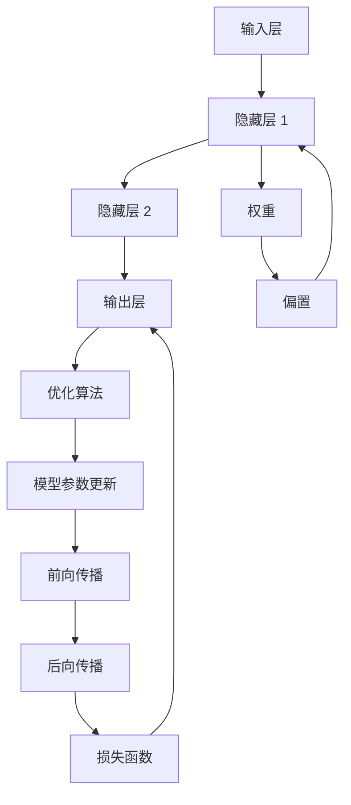

                 

# 神经网络：探索未知的领域

## 1. 背景介绍

### 1.1 问题由来
神经网络（Neural Networks）是一种受生物神经元启发的计算模型，能够模拟复杂的非线性关系，从而在图像识别、语音识别、自然语言处理等领域取得卓越效果。神经网络的研究始于上世纪40年代，但直到20世纪80年代，随着反向传播算法和计算资源的逐渐成熟，神经网络才开始大规模应用于实际问题中。

尽管神经网络在众多领域取得了突破性进展，但其背后的原理和机制仍充满了许多未知领域。如何更深刻地理解神经网络，不仅能够帮助研究人员不断提升模型性能，也能够帮助开发者更好地应用现有技术解决实际问题。本文将系统梳理神经网络的核心概念，探讨其背后的原理，并通过实际案例深入解读神经网络的应用，希望能对读者有所帮助。

### 1.2 问题核心关键点
神经网络的核心研究领域包括但不限于以下几个方面：
1. 神经网络架构的创新。包括网络层数、结构设计、激活函数等关键组件的设计，以提升模型性能。
2. 深度学习技术的进步。如卷积神经网络、残差网络、注意力机制等，用于特定任务的高效建模。
3. 优化算法的改进。如随机梯度下降、Adam、Adagrad等，用于高效、稳定地优化模型参数。
4. 正则化技术的引入。如L1正则、Dropout、批归一化等，用于避免模型过拟合。
5. 迁移学习和迁移范式的创新。通过在类似任务上的预训练，提升模型泛化能力。
6. 模型压缩和加速。通过剪枝、量化等技术，提升模型推理效率。
7. 模型可解释性和鲁棒性的研究。通过可视化、因果分析等手段，提升模型的可解释性和鲁棒性。

本文将重点探讨神经网络的核心概念和算法原理，并结合实际案例深入分析其在各领域的应用。

## 2. 核心概念与联系

### 2.1 核心概念概述

神经网络是一种模拟生物神经系统的计算模型。其核心组件包括输入层、隐藏层和输出层。隐藏层包含了神经网络的核心计算逻辑，每个神经元接收上一层的输出并计算其加权和，通过激活函数将其映射为下一层的输入。

图1. 神经网络基本结构示意图


神经网络的工作原理可以简单地概括为：
1. **前向传播**：输入数据通过神经网络逐层传递，得到最终的输出。
2. **损失函数**：计算输出与实际标签之间的差异。
3. **反向传播**：根据损失函数对模型参数进行更新，优化模型的性能。
4. **优化算法**：选择恰当的优化算法，如梯度下降、Adam等，以高效、稳定地更新模型参数。

### 2.2 核心概念原理和架构的 Mermaid 流程图



该图展示了神经网络的基本架构，其中每个圆圈表示一个层，箭头表示数据流和参数流。

### 2.3 核心算法原理概述

神经网络的训练通常基于梯度下降算法，其核心在于通过反向传播算法计算损失函数的梯度，并使用梯度信息对模型参数进行更新。

神经网络训练的算法流程如下：
1. **初始化参数**：随机初始化模型参数。
2. **前向传播**：输入数据通过神经网络，得到输出。
3. **计算损失**：根据输出与实际标签，计算损失函数的值。
4. **反向传播**：通过反向传播算法计算损失函数对模型参数的梯度。
5. **参数更新**：使用优化算法更新模型参数。
6. **重复迭代**：重复上述过程，直至模型收敛。

神经网络的优化算法多种多样，包括随机梯度下降（SGD）、Adam、Adagrad等。这些算法各有优劣，适用于不同的场景。

## 3. 核心算法原理 & 具体操作步骤

### 3.1 算法原理概述

神经网络的训练通常基于梯度下降算法，其核心在于通过反向传播算法计算损失函数的梯度，并使用梯度信息对模型参数进行更新。

神经网络训练的算法流程如下：
1. **初始化参数**：随机初始化模型参数。
2. **前向传播**：输入数据通过神经网络，得到输出。
3. **计算损失**：根据输出与实际标签，计算损失函数的值。
4. **反向传播**：通过反向传播算法计算损失函数对模型参数的梯度。
5. **参数更新**：使用优化算法更新模型参数。
6. **重复迭代**：重复上述过程，直至模型收敛。

### 3.2 算法步骤详解

神经网络的训练可以分为以下几个关键步骤：

**Step 1: 数据准备**
- 准备训练集和测试集，确保数据的标注质量和分布一致性。
- 将数据集划分为训练集、验证集和测试集，通常训练集占总数据的70%，验证集和测试集各占15%。

**Step 2: 模型构建**
- 选择合适的神经网络架构，包括网络层数、每层神经元数、激活函数等。
- 初始化模型参数，一般使用随机初始化方法。

**Step 3: 前向传播**
- 将输入数据通过神经网络，逐层传递，得到输出。

**Step 4: 计算损失**
- 根据输出与实际标签，计算损失函数的值，如均方误差、交叉熵等。

**Step 5: 反向传播**
- 计算损失函数对模型参数的梯度，通常使用反向传播算法。
- 根据梯度信息，使用优化算法更新模型参数，如梯度下降、Adam等。

**Step 6: 验证和测试**
- 在验证集上评估模型性能，调整模型超参数。
- 在测试集上最终评估模型性能，确定模型效果。

### 3.3 算法优缺点

神经网络的优势在于其强大的非线性建模能力，能够处理复杂的非线性关系。但神经网络也存在一些局限性，主要包括：
1. **过拟合**：神经网络模型参数众多，容易过拟合训练数据，导致泛化性能不足。
2. **计算复杂度高**：神经网络的计算复杂度较高，需要大量计算资源和时间。
3. **训练不稳定**：神经网络对初始化参数和超参数较为敏感，训练过程可能不稳定。
4. **可解释性差**：神经网络通常被视为“黑盒”模型，其内部决策过程难以解释。

尽管存在这些局限性，神经网络仍然因其卓越的性能在多个领域取得了广泛应用。

### 3.4 算法应用领域

神经网络在图像识别、语音识别、自然语言处理等领域有着广泛的应用。

在图像识别领域，卷积神经网络（CNN）被广泛应用于图像分类、目标检测等任务。CNN通过卷积层和池化层提取图像特征，使用全连接层进行分类。

在自然语言处理领域，循环神经网络（RNN）和长短时记忆网络（LSTM）被广泛应用于文本分类、语言建模等任务。RNN和LSTM通过时间维度上的递归结构，能够处理序列数据。

## 4. 数学模型和公式 & 详细讲解

### 4.1 数学模型构建

神经网络通常使用反向传播算法进行训练，其数学模型可以简单地概括为：

$$
\min_{\theta} \frac{1}{N} \sum_{i=1}^N \ell(y_i, \hat{y}_i)
$$

其中，$\ell$为损失函数，$y_i$为真实标签，$\hat{y}_i$为模型预测的标签，$\theta$为模型参数。

神经网络的前向传播过程可以表示为：

$$
z_l = W_l x_{l-1} + b_l
$$

$$
x_l = g(z_l)
$$

其中，$z_l$为第$l$层的输入，$W_l$为第$l$层的权重矩阵，$b_l$为第$l$层的偏置向量，$x_l$为第$l$层的输出，$g$为激活函数。

### 4.2 公式推导过程

以最简单的全连接神经网络为例，其前向传播和反向传播的推导过程如下：

**前向传播**：
$$
z_1 = W_1 x_0 + b_1
$$
$$
x_1 = g(z_1)
$$
$$
z_2 = W_2 x_1 + b_2
$$
$$
x_2 = g(z_2)
$$

其中，$W_1$和$W_2$为权重矩阵，$b_1$和$b_2$为偏置向量，$g$为激活函数。

**损失函数**：
$$
\ell(y, \hat{y}) = \frac{1}{N} \sum_{i=1}^N (y_i - \hat{y}_i)^2
$$

**反向传播**：
$$
\frac{\partial \ell}{\partial W_1} = \frac{\partial \ell}{\partial z_1} \cdot \frac{\partial z_1}{\partial W_1}
$$
$$
\frac{\partial \ell}{\partial z_1} = \frac{\partial \ell}{\partial x_1} \cdot \frac{\partial x_1}{\partial z_1}
$$
$$
\frac{\partial \ell}{\partial x_1} = -2 (y - \hat{y}) g'(z_1)
$$
$$
\frac{\partial z_1}{\partial W_1} = x_0
$$

通过反向传播算法，可以高效计算损失函数对权重矩阵的梯度，并使用梯度下降等优化算法更新模型参数。

### 4.3 案例分析与讲解

以图像分类为例，使用卷积神经网络（CNN）进行图像分类的具体步骤如下：

**Step 1: 数据准备**
- 准备训练集和测试集，确保数据的标注质量和分布一致性。
- 将数据集划分为训练集、验证集和测试集，通常训练集占总数据的70%，验证集和测试集各占15%。

**Step 2: 模型构建**
- 构建一个卷积神经网络模型，包括卷积层、池化层和全连接层。
- 初始化模型参数，一般使用随机初始化方法。

**Step 3: 前向传播**
- 将输入图像通过卷积层和池化层，提取特征。
- 使用全连接层进行分类，得到输出。

**Step 4: 计算损失**
- 根据输出与实际标签，计算交叉熵损失函数的值。

**Step 5: 反向传播**
- 计算损失函数对模型参数的梯度，通常使用反向传播算法。
- 根据梯度信息，使用优化算法更新模型参数，如Adam。

**Step 6: 验证和测试**
- 在验证集上评估模型性能，调整模型超参数。
- 在测试集上最终评估模型性能，确定模型效果。

## 5. 项目实践：代码实例和详细解释说明

### 5.1 开发环境搭建

在进行神经网络项目实践前，我们需要准备好开发环境。以下是使用Python进行PyTorch开发的环境配置流程：

1. 安装Anaconda：从官网下载并安装Anaconda，用于创建独立的Python环境。

2. 创建并激活虚拟环境：
```bash
conda create -n pytorch-env python=3.8 
conda activate pytorch-env
```

3. 安装PyTorch：根据CUDA版本，从官网获取对应的安装命令。例如：
```bash
conda install pytorch torchvision torchaudio cudatoolkit=11.1 -c pytorch -c conda-forge
```

4. 安装TensorFlow：
```bash
pip install tensorflow
```

5. 安装各类工具包：
```bash
pip install numpy pandas scikit-learn matplotlib tqdm jupyter notebook ipython
```

完成上述步骤后，即可在`pytorch-env`环境中开始项目实践。

### 5.2 源代码详细实现

下面我们以图像分类任务为例，给出使用PyTorch进行卷积神经网络（CNN）的代码实现。

首先，定义CNN模型的架构：

```python
import torch.nn as nn
import torch.nn.functional as F

class CNNModel(nn.Module):
    def __init__(self):
        super(CNNModel, self).__init__()
        self.conv1 = nn.Conv2d(3, 32, kernel_size=3, stride=1, padding=1)
        self.pool = nn.MaxPool2d(kernel_size=2, stride=2)
        self.fc1 = nn.Linear(32 * 8 * 8, 128)
        self.fc2 = nn.Linear(128, 10)
    
    def forward(self, x):
        x = F.relu(self.conv1(x))
        x = self.pool(x)
        x = x.view(x.size(0), -1)
        x = F.relu(self.fc1(x))
        x = self.fc2(x)
        return F.log_softmax(x, dim=1)
```

然后，定义训练和评估函数：

```python
from torch.utils.data import DataLoader
from torchvision import datasets, transforms

# 加载CIFAR-10数据集
train_dataset = datasets.CIFAR10(root='data', train=True, transform=transforms.ToTensor(), download=True)
test_dataset = datasets.CIFAR10(root='data', train=False, transform=transforms.ToTensor(), download=True)

# 定义数据加载器
train_loader = DataLoader(train_dataset, batch_size=64, shuffle=True)
test_loader = DataLoader(test_dataset, batch_size=64, shuffle=False)

# 定义优化器
optimizer = torch.optim.Adam(model.parameters(), lr=0.001)

# 定义损失函数
criterion = nn.CrossEntropyLoss()

# 训练函数
def train(model, loader, optimizer, criterion):
    model.train()
    running_loss = 0.0
    for batch_idx, (inputs, targets) in enumerate(loader):
        optimizer.zero_grad()
        outputs = model(inputs)
        loss = criterion(outputs, targets)
        loss.backward()
        optimizer.step()
        running_loss += loss.item()
    return running_loss / len(loader)

# 评估函数
def evaluate(model, loader, criterion):
    model.eval()
    running_loss = 0.0
    running_corrects = 0
    with torch.no_grad():
        for batch_idx, (inputs, targets) in enumerate(loader):
            outputs = model(inputs)
            loss = criterion(outputs, targets)
            running_loss += loss.item()
            _, preds = torch.max(outputs, 1)
            running_corrects += (preds == targets).sum().item()
    return running_corrects / len(loader.dataset)

# 训练过程
for epoch in range(10):
    train_loss = train(model, train_loader, optimizer, criterion)
    test_acc = evaluate(model, test_loader, criterion)
    print(f'Epoch {epoch+1}, train loss: {train_loss:.3f}, test acc: {test_acc:.3f}')
```

以上就是使用PyTorch进行卷积神经网络（CNN）图像分类任务的完整代码实现。可以看到，得益于PyTorch的强大封装，我们可以用相对简洁的代码实现CNN模型的训练和评估。

### 5.3 代码解读与分析

让我们再详细解读一下关键代码的实现细节：

**CNNModel类**：
- `__init__`方法：定义卷积层、池化层和全连接层。
- `forward`方法：定义前向传播逻辑，将输入通过卷积层、池化层和全连接层，得到最终的输出。

**train函数**：
- 在训练过程中，首先设置模型为训练模式。
- 在每个批次上，前向传播计算输出，并计算损失。
- 反向传播计算梯度，使用优化器更新模型参数。
- 累加损失值，并返回平均损失值。

**evaluate函数**：
- 在评估过程中，首先设置模型为评估模式。
- 在每个批次上，前向传播计算输出，并计算损失。
- 将输出与实际标签比较，计算分类精度。
- 累加精度值，并返回平均精度值。

## 6. 实际应用场景

### 6.1 智能推荐系统

智能推荐系统是神经网络的重要应用之一。通过用户的历史行为数据，神经网络可以学习用户的兴趣偏好，并推荐相关的商品或内容。

在实现上，可以构建一个基于深度学习的推荐系统，使用神经网络模型对用户行为进行建模，预测用户的兴趣点。具体的实现过程如下：

1. **数据准备**：收集用户的历史行为数据，如浏览、点击、购买等。
2. **特征提取**：从用户行为数据中提取有用的特征，如浏览时长、浏览次数、商品类别等。
3. **模型训练**：使用神经网络模型对特征进行训练，得到用户的兴趣表示。
4. **推荐生成**：使用训练好的模型，对新用户行为进行预测，生成推荐结果。

### 6.2 金融风控系统

金融风控系统是神经网络的另一重要应用。通过用户的历史交易数据，神经网络可以学习用户的信用状况，并判断其是否具有潜在风险。

在实现上，可以构建一个基于深度学习的金融风控系统，使用神经网络模型对用户交易数据进行建模，预测用户的信用风险。具体的实现过程如下：

1. **数据准备**：收集用户的交易数据，如交易金额、交易时间、交易类别等。
2. **特征提取**：从交易数据中提取有用的特征，如交易频率、交易金额、交易来源等。
3. **模型训练**：使用神经网络模型对特征进行训练，得到用户的信用风险表示。
4. **风险评估**：使用训练好的模型，对新用户交易数据进行预测，判断其是否具有潜在风险。

## 7. 工具和资源推荐

### 7.1 学习资源推荐

为了帮助开发者系统掌握神经网络的理论基础和实践技巧，这里推荐一些优质的学习资源：

1. 《深度学习》（Goodfellow et al.）：深度学习领域的经典教材，系统介绍了深度学习的理论基础和实践技巧。
2. CS231n《卷积神经网络》课程：斯坦福大学开设的计算机视觉领域明星课程，有Lecture视频和配套作业，带你入门深度学习。
3. 《深度学习与强化学习》（Goodfellow et al.）：深度学习领域的另一经典教材，系统介绍了深度学习与强化学习的理论基础和实践技巧。
4. PyTorch官方文档：PyTorch的官方文档，提供了丰富的学习资源和代码示例，是深入学习神经网络不可或缺的工具。
5. TensorFlow官方文档：TensorFlow的官方文档，提供了丰富的学习资源和代码示例，是深入学习神经网络的另一重要工具。

通过对这些资源的学习实践，相信你一定能够快速掌握神经网络的核心概念和实践技巧，并用于解决实际的NLP问题。

### 7.2 开发工具推荐

高效的开发离不开优秀的工具支持。以下是几款用于神经网络开发常用的工具：

1. PyTorch：基于Python的开源深度学习框架，灵活动态的计算图，适合快速迭代研究。
2. TensorFlow：由Google主导开发的开源深度学习框架，生产部署方便，适合大规模工程应用。
3. Keras：基于TensorFlow、Theano、CNTK等后端的高层次神经网络API，方便快速构建神经网络模型。
4. Weights & Biases：模型训练的实验跟踪工具，可以记录和可视化模型训练过程中的各项指标，方便对比和调优。
5. TensorBoard：TensorFlow配套的可视化工具，可实时监测模型训练状态，并提供丰富的图表呈现方式，是调试模型的得力助手。

合理利用这些工具，可以显著提升神经网络开发的效率，加快创新迭代的步伐。

### 7.3 相关论文推荐

神经网络的研究源于学界的持续研究。以下是几篇奠基性的相关论文，推荐阅读：

1. 《深度学习》（Goodfellow et al.）：深度学习领域的经典教材，系统介绍了深度学习的理论基础和实践技巧。
2. 《卷积神经网络》（LeCun et al.）：卷积神经网络领域的经典论文，介绍了卷积神经网络的基本原理和应用。
3. 《ImageNet分类》（Krizhevsky et al.）：AlexNet论文，介绍了使用卷积神经网络进行图像分类的基本原理和应用。
4. 《深度神经网络》（Goodfellow et al.）：深度神经网络领域的经典论文，介绍了深度神经网络的基本原理和应用。
5. 《语言模型》（Hinton et al.）：语言模型领域的经典论文，介绍了使用神经网络进行语言建模的基本原理和应用。

这些论文代表了大神经网络的发展脉络。通过学习这些前沿成果，可以帮助研究者把握学科前进方向，激发更多的创新灵感。

## 8. 总结：未来发展趋势与挑战

### 8.1 总结

本文对神经网络的核心概念和算法原理进行了全面系统的介绍。首先阐述了神经网络的研究背景和意义，明确了神经网络在多个领域的应用。其次，从原理到实践，详细讲解了神经网络模型的训练过程，并结合实际案例深入分析了其在各领域的应用。最后，本文还探讨了神经网络面临的挑战和未来发展方向，希望为读者提供全方位的技术指引。

通过本文的系统梳理，可以看到，神经网络在图像识别、语音识别、自然语言处理等领域取得了突破性进展。这些技术不仅在学术界得到了广泛应用，也在实际工程中展示了强大的潜力。未来，随着神经网络技术的不断进步，其在更多领域的应用将进一步拓展，推动人工智能技术的发展。

### 8.2 未来发展趋势

展望未来，神经网络技术将呈现以下几个发展趋势：

1. **模型规模持续增大**：随着算力成本的下降和数据规模的扩张，神经网络模型的参数量还将持续增长。超大规模神经网络模型蕴含的丰富特征表示，将提升模型的性能和泛化能力。

2. **模型结构更加多样化**：神经网络模型的结构将更加多样化，包括卷积神经网络、残差网络、注意力机制等，用于特定任务的高效建模。

3. **优化算法不断改进**：新的优化算法将不断涌现，如Adam、Adagrad等，用于高效、稳定地优化模型参数。

4. **正则化技术不断发展**：新的正则化技术将不断涌现，如L1正则、Dropout、批归一化等，用于避免模型过拟合，提高泛化能力。

5. **迁移学习技术普及**：迁移学习技术将更加普及，通过在类似任务上的预训练，提升模型的泛化能力。

6. **知识表示和融合**：神经网络将更多地与知识表示、因果推理、强化学习等技术融合，提升模型的表现力和解释性。

以上趋势凸显了神经网络技术的广阔前景。这些方向的探索发展，必将进一步提升神经网络模型的性能和应用范围，为人工智能技术的发展带来新的机遇。

### 8.3 面临的挑战

尽管神经网络技术取得了显著进展，但在迈向更加智能化、普适化应用的过程中，仍面临诸多挑战：

1. **过拟合问题**：神经网络模型参数众多，容易过拟合训练数据，导致泛化性能不足。如何有效地处理过拟合问题，仍然是一个重要的研究方向。

2. **计算资源需求高**：神经网络模型的计算复杂度较高，需要大量计算资源和时间。如何在保证性能的同时，降低计算成本，仍然是一个重要的研究方向。

3. **模型可解释性差**：神经网络通常被视为“黑盒”模型，其内部决策过程难以解释。如何提升模型的可解释性和鲁棒性，仍然是一个重要的研究方向。

4. **模型安全性问题**：神经网络模型可能学习到有害信息，对安全性和隐私性带来潜在风险。如何保障模型的安全性，仍然是一个重要的研究方向。

5. **模型公平性和公正性**：神经网络模型可能存在偏见，对不同群体的表现不均衡。如何提升模型的公平性和公正性，仍然是一个重要的研究方向。

6. **模型鲁棒性和泛化能力**：神经网络模型对输入数据的扰动敏感，容易受到噪声和异常数据的影响。如何提升模型的鲁棒性和泛化能力，仍然是一个重要的研究方向。

正视这些挑战，积极应对并寻求突破，将是大神经网络技术迈向成熟的必由之路。相信随着学界和产业界的共同努力，这些挑战终将一一被克服，大神经网络技术必将进一步推动人工智能技术的发展。

### 8.4 研究展望

面对神经网络技术面临的挑战，未来的研究需要在以下几个方面寻求新的突破：

1. **探索无监督和半监督学习技术**：摆脱对大规模标注数据的依赖，利用自监督学习、主动学习等无监督和半监督范式，最大限度利用非结构化数据，实现更加灵活高效的模型训练。

2. **研究参数高效和计算高效的优化算法**：开发更加参数高效的优化算法，如自适应低秩适应（AdaLoRA）、AdaBound等，在固定大部分神经网络参数的同时，只更新极少量的任务相关参数，提升模型的参数效率和计算效率。

3. **引入因果推理和博弈论思想**：通过引入因果推理和博弈论思想，增强神经网络模型建立稳定因果关系的能力，学习更加普适、鲁棒的语言表示，从而提升模型的泛化性和抗干扰能力。

4. **融合符号化的先验知识**：将符号化的先验知识，如知识图谱、逻辑规则等，与神经网络模型进行巧妙融合，引导神经网络模型学习更准确、合理的特征表示。

5. **结合因果分析和博弈论工具**：将因果分析方法引入神经网络模型，识别出模型决策的关键特征，增强输出解释的因果性和逻辑性。借助博弈论工具刻画人机交互过程，主动探索并规避模型的脆弱点，提高系统稳定性。

6. **纳入伦理道德约束**：在神经网络训练目标中引入伦理导向的评估指标，过滤和惩罚有害的输出倾向，确保模型的输出符合人类价值观和伦理道德。

这些研究方向将推动神经网络技术向更深层次发展，提升模型的性能和应用范围，为人工智能技术的发展带来新的机遇。

## 9. 附录：常见问题与解答

**Q1：神经网络是否适用于所有领域？**

A: 神经网络在图像识别、语音识别、自然语言处理等领域取得了突破性进展。但对于一些特定领域的任务，如医学、法律等，神经网络模型可能难以很好地适应。此时需要在特定领域语料上进一步预训练，再进行微调，才能获得理想效果。此外，对于一些需要时效性、个性化很强的任务，如对话、推荐等，神经网络模型也需要针对性的改进优化。

**Q2：神经网络的训练时间是否过长？**

A: 神经网络的训练时间通常较长，特别是对于大规模模型。为了加速训练过程，可以采用以下方法：
1. **分布式训练**：使用多台机器进行并行训练，加速训练过程。
2. **梯度累积**：将多个批次的梯度进行累加，减少每次更新时的参数变化量，加速训练过程。
3. **模型压缩**：使用剪枝、量化等技术，减小模型尺寸，加速训练过程。

**Q3：神经网络的可解释性如何提升？**

A: 神经网络通常被视为“黑盒”模型，其内部决策过程难以解释。为了提升模型的可解释性，可以采用以下方法：
1. **特征可视化**：使用激活图、梯度图等可视化技术，展示神经网络在输入样本上的特征表示。
2. **模型压缩**：使用剪枝、量化等技术，减小模型尺寸，提高模型的可解释性。
3. **注意力机制**：使用注意力机制，增强模型的可解释性。
4. **模型蒸馏**：使用知识蒸馏技术，将复杂模型压缩为轻量级模型，提高模型的可解释性。

这些方法可以在不损失模型性能的前提下，提升神经网络的可解释性和鲁棒性。

**Q4：神经网络模型如何处理噪声和异常数据？**

A: 神经网络模型对输入数据的扰动敏感，容易受到噪声和异常数据的影响。为了处理噪声和异常数据，可以采用以下方法：
1. **数据预处理**：使用数据清洗、归一化等方法，减少噪声和异常数据的影响。
2. **正则化技术**：使用L2正则、Dropout、批归一化等技术，减少噪声和异常数据的影响。
3. **鲁棒性训练**：使用对抗训练、数据增强等技术，提高模型的鲁棒性，减少噪声和异常数据的影响。

这些方法可以在保证模型性能的同时，提升模型的鲁棒性和泛化能力。

**Q5：神经网络模型如何处理长尾问题？**

A: 神经网络模型在处理长尾问题时，容易对长尾类别学习不足。为了处理长尾问题，可以采用以下方法：
1. **数据增强**：使用数据增强技术，扩充长尾类别的样本数量。
2. **多任务学习**：使用多任务学习技术，提升长尾类别的学习效果。
3. **自适应权重调整**：使用自适应权重调整技术，提升长尾类别的学习效果。

这些方法可以在保证模型性能的同时，提升神经网络模型对长尾问题的处理能力。

---

作者：禅与计算机程序设计艺术 / Zen and the Art of Computer Programming

