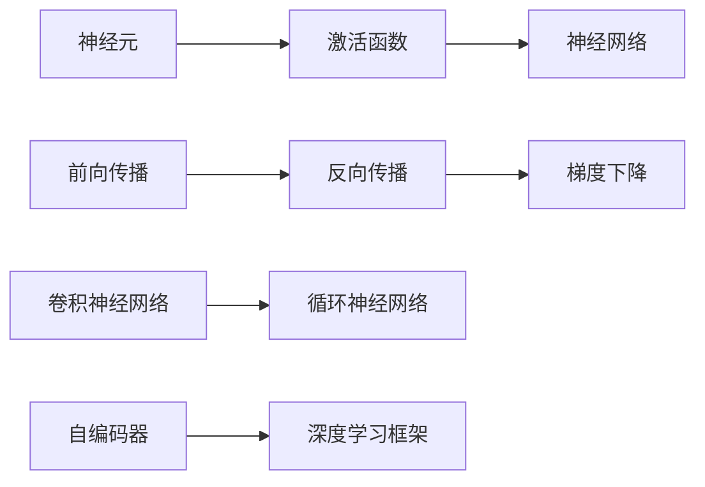
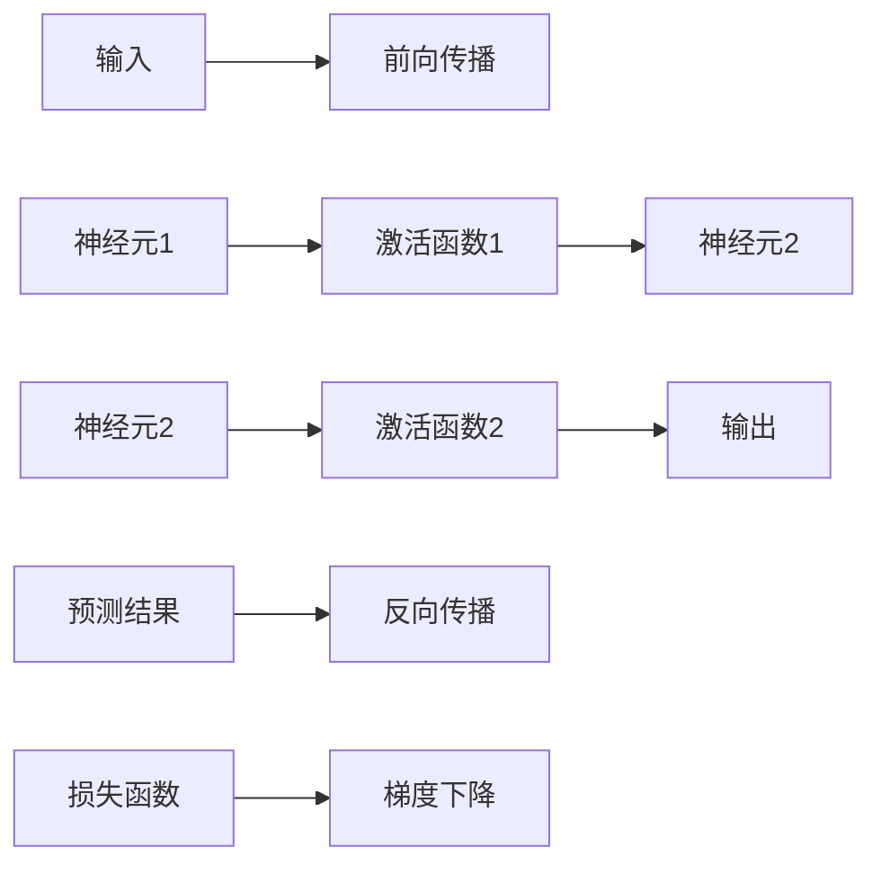

                 

# 神经网络：探索未知的领域

> 关键词：神经网络,深度学习,神经元,激活函数,反向传播,梯度下降,卷积神经网络,循环神经网络,自编码器,深度学习框架,PyTorch

## 1. 背景介绍

### 1.1 问题由来
自20世纪80年代以来，神经网络（Neural Network）一直是人工智能（AI）领域的重要研究热点。随着深度学习（Deep Learning）技术的迅猛发展，神经网络在图像识别、语音处理、自然语言处理等众多领域取得了突破性进展。然而，神经网络的基本原理和技术仍然被众多学者和工程师所探索。本博客旨在通过深入浅出的方式，为读者介绍神经网络的基本概念、核心算法与实际应用，为深入研究神经网络提供指导。

### 1.2 问题核心关键点
神经网络作为人工智能的核心技术之一，其核心关键点包括：
1. 神经元与激活函数：构成神经网络的基本单元。
2. 前向传播与反向传播：神经网络的训练算法。
3. 梯度下降与优化器：神经网络参数更新的核心方法。
4. 卷积神经网络与循环神经网络：常用的神经网络结构。
5. 自编码器与深度学习框架：神经网络的实现手段。

这些关键点构成了神经网络的基础，其相互关系如图1所示：



## 2. 核心概念与联系

### 2.1 核心概念概述

为更好地理解神经网络的工作原理和优化方法，本节将介绍几个密切相关的核心概念：

- **神经元（Neuron）**：神经网络的基本组成单元，接收输入并计算输出。神经元通常包括一个或多个输入（权重和偏差）和一个输出，并通过激活函数进行非线性变换。
- **激活函数（Activation Function）**：用于引入非线性特性，将神经元的输出映射到一个非负值区间。常见的激活函数包括sigmoid、ReLU、tanh等。
- **前向传播（Forward Propagation）**：将输入数据从输入层逐层传递到输出层的过程。每层神经元将前一层的输出作为输入，并计算新的输出。
- **反向传播（Backward Propagation）**：基于损失函数，计算前向传播过程中每一层神经元的梯度，并反向传播更新参数，最小化损失函数。
- **梯度下降（Gradient Descent）**：一种优化算法，用于在目标函数上寻找最小值。通过迭代更新参数，逐步缩小目标函数的值。
- **卷积神经网络（Convolutional Neural Network, CNN）**：针对图像数据设计的神经网络结构，通过卷积和池化操作提取特征。
- **循环神经网络（Recurrent Neural Network, RNN）**：处理序列数据（如文本、时间序列等）的神经网络，通过循环连接捕捉时序信息。
- **自编码器（Autoencoder）**：一种无监督学习方法，用于降维和数据压缩，通过对输入数据的重构来学习数据分布。
- **深度学习框架（Deep Learning Framework）**：如TensorFlow、PyTorch、Keras等，提供了高效、便捷的神经网络开发环境。

这些核心概念之间的逻辑关系可以通过以下Mermaid流程图来展示：


这个流程图展示了大语言模型的核心概念及其之间的关系：

1. 神经元通过激活函数引入非线性特性。
2. 前向传播和反向传播实现神经网络的学习过程。
3. 梯度下降用于参数优化，最小化损失函数。
4. 卷积神经网络和循环神经网络分别用于处理图像和序列数据。
5. 自编码器用于降维和数据压缩，提升神经网络的效率。
6. 深度学习框架提供工具和接口，简化神经网络的开发和训练。

这些概念共同构成了神经网络的学习框架，使其能够高效地处理复杂数据，并逐步提高模型的精度和泛化能力。

## 3. 核心算法原理 & 具体操作步骤

### 3.1 算法原理概述

神经网络通过一系列神经元逐层处理输入数据，最终输出预测结果。神经网络的学习过程通常分为两个阶段：前向传播和反向传播。

前向传播中，输入数据通过神经网络各层传递，每层神经元根据输入计算新的输出，并传递给下一层。反向传播中，基于预测结果和真实标签的差异，计算损失函数，并通过反向传播计算每一层神经元的梯度，最终更新模型参数。

核心算法原理如图2所示：



### 3.2 算法步骤详解

神经网络的具体训练步骤如下：

**Step 1: 准备训练数据**
- 收集训练数据集，包含输入特征和目标标签。
- 将数据集划分为训练集、验证集和测试集。

**Step 2: 初始化模型**
- 随机初始化神经网络的权重和偏差。
- 设置优化器（如Adam、SGD等）和学习率。

**Step 3: 前向传播**
- 将输入数据传递给神经网络，计算每一层神经元的输出。
- 输出层的输出作为预测结果。

**Step 4: 计算损失函数**
- 根据预测结果和真实标签，计算损失函数（如均方误差、交叉熵等）。

**Step 5: 反向传播**
- 通过链式法则，计算损失函数对每一层神经元输出的梯度。
- 反向传播更新每一层神经元的参数。

**Step 6: 参数更新**
- 根据优化器更新模型参数，最小化损失函数。

**Step 7: 迭代训练**
- 重复步骤3到6，直至模型收敛。
- 在验证集上评估模型性能，选择最优模型。

**Step 8: 测试模型**
- 在测试集上评估模型的泛化能力。

### 3.3 算法优缺点

神经网络具有以下优点：
1. 高效处理复杂数据：神经网络能够处理高维、非线性数据，如图像、语音、文本等。
2. 自适应能力：神经网络能够通过训练自适应输入数据的变化，提升泛化能力。
3. 模块化设计：神经网络可以通过组合不同模块（如卷积层、循环层等），构建适用于不同任务的模型。
4. 泛化能力：神经网络能够学习数据的复杂特征，实现对新数据的快速适应。

同时，神经网络也存在以下缺点：
1. 计算资源消耗大：神经网络参数量较大，需要大量的计算资源进行训练和推理。
2. 过拟合风险高：神经网络容易在训练集上表现良好，但泛化能力不足，对新数据表现较差。
3. 可解释性差：神经网络被视为"黑盒"模型，难以解释其内部决策过程。
4. 训练时间长：神经网络需要大量的训练数据和长时间训练才能达到较好的性能。
5. 数据依赖性强：神经网络对输入数据的分布和特征敏感，数据质量对模型性能有显著影响。

### 3.4 算法应用领域

神经网络已经在图像识别、语音处理、自然语言处理等多个领域取得了广泛应用。以下是几个主要应用场景：

1. **计算机视觉**：神经网络在图像分类、目标检测、图像分割等任务上表现优异，广泛应用于医疗影像分析、自动驾驶等领域。
2. **语音识别**：神经网络在语音识别和语音合成中取得了重大突破，提高了语音交互的流畅性和自然度。
3. **自然语言处理**：神经网络在机器翻译、文本分类、情感分析、问答系统等任务上展现了卓越的性能，推动了人机交互的智能化。
4. **推荐系统**：神经网络在用户行为分析、商品推荐、广告定向等领域取得了显著效果，提升了电商、媒体等行业的运营效率。
5. **游戏AI**：神经网络在电子游戏、机器人等领域中应用于智能决策和游戏策略优化。

## 4. 数学模型和公式 & 详细讲解 & 举例说明

### 4.1 数学模型构建

神经网络的数学模型通常包含输入层、隐藏层和输出层。以一个简单的三层神经网络为例，其数学模型为：

$$
y=f(Wx+b)
$$

其中 $x$ 为输入向量，$y$ 为输出向量，$W$ 为权重矩阵，$b$ 为偏差向量，$f$ 为激活函数。

### 4.2 公式推导过程

以线性回归为例，推导神经网络的前向传播和反向传播过程。

#### 4.2.1 前向传播
假设有 $n$ 个输入样本 $x_1,x_2,...,x_n$，每样本包含 $m$ 个特征。神经网络的输入层有 $m$ 个神经元，隐藏层有 $h$ 个神经元，输出层有 $1$ 个神经元。

前向传播过程如下：

1. 输入层到隐藏层的传播：
$$
z_h=wx_1+b
$$
2. 隐藏层到输出层的传播：
$$
y=f(z_h)
$$

其中 $z_h$ 为隐藏层的输出，$f$ 为激活函数。

#### 4.2.2 反向传播
神经网络的损失函数通常为均方误差（Mean Squared Error, MSE）：

$$
L=\frac{1}{n}\sum_{i=1}^{n}(y_i-\hat{y}_i)^2
$$

其中 $y_i$ 为真实标签，$\hat{y}_i$ 为预测结果。

反向传播过程如下：

1. 输出层到隐藏层的传播：
$$
\delta_y=y-\hat{y}
$$
$$
\delta_h=\delta_yf'(z_h)
$$

其中 $f'$ 为激活函数的导数，$\delta_y$ 为输出层的误差。

2. 隐藏层到输入层的传播：
$$
\delta_w=\delta_hw^T
$$
$$
\delta_b=\delta_h
$$

其中 $\delta_w$ 为权重矩阵的梯度，$\delta_b$ 为偏差的梯度。

### 4.3 案例分析与讲解

以MNIST手写数字识别为例，分析神经网络的训练过程。

假设神经网络包含输入层、两个隐藏层和输出层，每隐藏层有64个神经元。使用交叉熵损失函数。

#### 4.3.1 初始化模型
- 随机初始化权重和偏差，$w_1 \sim \mathcal{N}(0, \sigma^2)$，$b_1 \sim \mathcal{N}(0, \sigma^2)$。
- 设置优化器（如Adam）和学习率 $\eta=0.01$。

#### 4.3.2 前向传播
- 输入层到第一隐藏层的传播：
$$
z_1=wx_1+b_1
$$
- 第一隐藏层到第二隐藏层的传播：
$$
z_2=wx_2+b_2
$$
- 第二隐藏层到输出层的传播：
$$
y=f(z_2)
$$

#### 4.3.3 计算损失函数
- 计算预测结果和真实标签的均方误差：
$$
L=\frac{1}{n}\sum_{i=1}^{n}(y_i-\hat{y}_i)^2
$$

#### 4.3.4 反向传播
- 输出层到第二隐藏层的传播：
$$
\delta_y=y-\hat{y}
$$
$$
\delta_2=\delta_yf'(z_2)
$$
- 第二隐藏层到第一隐藏层的传播：
$$
\delta_1=\delta_2f'(z_1)
$$
- 第一隐藏层到输入层的传播：
$$
\delta_w=z_1^T\delta_1
$$
$$
\delta_b=\delta_1
$$

#### 4.3.5 参数更新
- 根据梯度下降更新参数：
$$
w_1 \leftarrow w_1-\eta\delta_w
$$
$$
b_1 \leftarrow b_1-\eta\delta_b
$$

#### 4.3.6 迭代训练
- 重复前向传播、反向传播和参数更新，直至模型收敛。

#### 4.3.7 测试模型
- 在测试集上评估模型性能，输出预测结果。

## 5. 项目实践：代码实例和详细解释说明

### 5.1 开发环境搭建

在进行神经网络开发前，我们需要准备好开发环境。以下是使用Python进行PyTorch开发的环境配置流程：

1. 安装Anaconda：从官网下载并安装Anaconda，用于创建独立的Python环境。

2. 创建并激活虚拟环境：
```bash
conda create -n pytorch-env python=3.8 
conda activate pytorch-env
```

3. 安装PyTorch：根据CUDA版本，从官网获取对应的安装命令。例如：
```bash
conda install pytorch torchvision torchaudio cudatoolkit=11.1 -c pytorch -c conda-forge
```

4. 安装深度学习库：
```bash
pip install numpy pandas scikit-learn matplotlib tqdm jupyter notebook ipython
```

完成上述步骤后，即可在`pytorch-env`环境中开始神经网络开发。

### 5.2 源代码详细实现

这里我们以一个简单的线性回归为例，使用PyTorch实现神经网络的训练。

首先，定义神经网络的类：

```python
import torch
import torch.nn as nn
import torch.optim as optim

class LinearRegression(nn.Module):
    def __init__(self, input_dim, output_dim):
        super(LinearRegression, self).__init__()
        self.linear = nn.Linear(input_dim, output_dim)
    
    def forward(self, x):
        return self.linear(x)
```

然后，定义训练函数：

```python
def train(model, train_loader, epochs, learning_rate):
    criterion = nn.MSELoss()
    optimizer = optim.SGD(model.parameters(), lr=learning_rate)
    
    for epoch in range(epochs):
        running_loss = 0.0
        for i, data in enumerate(train_loader):
            inputs, labels = data
            optimizer.zero_grad()
            outputs = model(inputs)
            loss = criterion(outputs, labels)
            loss.backward()
            optimizer.step()
            
            running_loss += loss.item()
            if i % 100 == 99:
                print(f'Epoch {epoch+1}, loss: {running_loss/100:.3f}')
                running_loss = 0.0
```

接着，加载数据集并进行训练：

```python
from torch.utils.data import DataLoader
from torchvision.datasets import MNIST
from torchvision.transforms import ToTensor

train_dataset = MNIST(root='./data', train=True, transform=ToTensor(), download=True)
train_loader = DataLoader(train_dataset, batch_size=64, shuffle=True)
model = LinearRegression(input_dim=784, output_dim=10)
train(model, train_loader, epochs=1000, learning_rate=0.01)
```

以上就是使用PyTorch实现线性回归神经网络训练的完整代码。可以看到，利用深度学习库，神经网络的开发和训练变得简洁高效。

### 5.3 代码解读与分析

让我们再详细解读一下关键代码的实现细节：

**LinearRegression类**：
- `__init__`方法：初始化权重和偏差。
- `forward`方法：计算前向传播过程。

**train函数**：
- `criterion`：定义损失函数（均方误差）。
- `optimizer`：定义优化器（随机梯度下降）。
- 在每个epoch内，前向传播计算预测结果，反向传播计算梯度，优化器更新参数。

**训练流程**：
- 定义总的epoch数和learning rate，开始循环迭代。
- 在每个epoch内，迭代训练集数据，输出平均损失。
- 打印输出训练过程中的损失变化。

可以看到，深度学习库提供了方便的接口和工具，使得神经网络的开发和训练更加便捷。开发者可以将更多精力放在模型设计、数据处理等核心逻辑上。

当然，工业级的系统实现还需考虑更多因素，如模型的保存和部署、超参数的自动搜索等。但核心的神经网络训练过程基本与此类似。

## 6. 实际应用场景

### 6.1 智能推荐系统

智能推荐系统广泛应用于电商、视频、音乐等领域，通过分析用户行为和历史数据，推荐个性化的产品或内容。神经网络在推荐系统中通过学习用户与物品的关联关系，实现高效精准的推荐。

#### 6.1.1 用户行为分析
- 收集用户的历史行为数据，如浏览、点击、购买等。
- 通过神经网络学习用户兴趣点，生成用户画像。

#### 6.1.2 物品特征提取
- 收集物品的描述、标签、评分等信息。
- 通过神经网络提取物品的特征，生成物品表示。

#### 6.1.3 推荐算法
- 使用神经网络模型（如协同过滤、深度学习等），预测用户对物品的评分。
- 根据评分排序，推荐高分物品。

#### 6.1.4 推荐效果评估
- 在测试集上评估模型的推荐精度和个性化程度。
- 优化模型参数，提升推荐效果。

### 6.2 语音识别

语音识别是自然语言处理中的重要任务，广泛应用于语音助手、智能客服等领域。神经网络在语音识别中通过学习声学特征和语言模型，实现对语音信号的自动转录。

#### 6.2.1 声学特征提取
- 收集语音信号，提取MFCC等声学特征。
- 使用神经网络模型（如卷积神经网络），学习声学特征的表示。

#### 6.2.2 语言模型建模
- 收集语音的文本转录，建立语言模型。
- 使用神经网络模型（如循环神经网络），学习语言特征的表示。

#### 6.2.3 语音识别算法
- 将声学特征和语言模型结合，使用神经网络模型（如CTC），实现语音识别。
- 根据识别结果，调整模型参数，提升识别精度。

#### 6.2.4 语音识别效果评估
- 在测试集上评估模型的识别准确率和鲁棒性。
- 优化模型参数，提升识别效果。

### 6.3 自然语言处理

自然语言处理（NLP）是人工智能领域的重要方向，包括文本分类、情感分析、机器翻译等任务。神经网络在NLP中通过学习语言特征，实现对自然语言的自动处理和理解。

#### 6.3.1 文本分类
- 收集文本数据，进行标注。
- 使用神经网络模型（如卷积神经网络），学习文本的分类特征。
- 根据分类结果，调整模型参数，提升分类精度。

#### 6.3.2 情感分析
- 收集文本数据，进行情感标注。
- 使用神经网络模型（如循环神经网络），学习情感特征。
- 根据情感结果，调整模型参数，提升情感分析精度。

#### 6.3.3 机器翻译
- 收集双语对照文本数据。
- 使用神经网络模型（如序列到序列模型），学习语言之间的映射关系。
- 根据翻译结果，调整模型参数，提升翻译质量。

#### 6.3.4 文本生成
- 收集文本数据，进行标注。
- 使用神经网络模型（如自回归模型），学习文本生成特征。
- 根据生成结果，调整模型参数，提升生成质量。

## 7. 工具和资源推荐

### 7.1 学习资源推荐

为了帮助开发者系统掌握神经网络的基本概念和实践技巧，这里推荐一些优质的学习资源：

1. 《深度学习》（Ian Goodfellow、Yoshua Bengio、Aaron Courville著）：深度学习的经典教材，全面介绍了深度学习的基本理论和应用。

2. 《神经网络与深度学习》（Michael Nielsen著）：通俗易懂地介绍了神经网络的基本原理和训练方法。

3. CS231n《卷积神经网络》课程：斯坦福大学开设的图像识别课程，讲解了卷积神经网络的原理和实践。

4. Coursera《深度学习专项课程》：由斯坦福大学教授Andrew Ng开设的深度学习课程，涵盖深度学习的基础理论和应用实践。

5. Udacity《深度学习纳米学位》：Udacity提供的深度学习课程，覆盖了深度学习的基本理论和实践技能。

通过这些资源的学习实践，相信你一定能够快速掌握神经网络的基本概念和实践技巧，并用于解决实际的AI问题。

### 7.2 开发工具推荐

高效的开发离不开优秀的工具支持。以下是几款用于神经网络开发的常用工具：

1. PyTorch：基于Python的开源深度学习框架，支持动态计算图，方便模型的构建和训练。

2. TensorFlow：由Google主导开发的深度学习框架，支持静态计算图，适合大规模工程应用。

3. Keras：基于TensorFlow和Theano的高级神经网络API，提供了简洁的接口和丰富的预训练模型。

4. JAX：基于Numpy的高性能深度学习框架，支持动态计算图和自动微分，适合复杂模型的优化和部署。

5. MXNet：由Apache开发的深度学习框架，支持分布式训练和模型部署。

6. Caffe：基于C++的深度学习框架，支持GPU加速，适合图像识别和计算机视觉任务。

合理利用这些工具，可以显著提升神经网络的开发效率，加快创新迭代的步伐。

### 7.3 相关论文推荐

神经网络的发展源于学界的持续研究。以下是几篇奠基性的相关论文，推荐阅读：

1. AlexNet：2012年ImageNet图像分类竞赛的冠军模型，开启了深度学习在计算机视觉领域的应用。

2. VGGNet：提出深度卷积神经网络结构，实现了对ImageNet数据集的高精度分类。

3. ResNet：提出残差连接结构，解决了深度神经网络的梯度消失问题，推动了深度学习的发展。

4. LSTM：提出长短期记忆网络，适用于处理序列数据，提升了语音识别和自然语言处理的效果。

5. GANs：提出生成对抗网络，用于生成逼真的图像和音频，扩展了神经网络的范畴。

这些论文代表了大神经网络的发展脉络。通过学习这些前沿成果，可以帮助研究者把握学科前进方向，激发更多的创新灵感。

## 8. 总结：未来发展趋势与挑战

### 8.1 总结

本文对神经网络的基本概念、核心算法与实际应用进行了全面系统的介绍。首先阐述了神经网络的发展历程和应用前景，明确了神经网络在人工智能领域的重要地位。其次，从原理到实践，详细讲解了神经网络的前向传播和反向传播过程，给出了神经网络训练的完整代码实例。同时，本文还广泛探讨了神经网络在智能推荐、语音识别、自然语言处理等领域的实际应用，展示了神经网络的广阔前景。此外，本文精选了神经网络学习的各类资源，力求为读者提供全方位的技术指引。

通过本文的系统梳理，可以看到，神经网络作为人工智能的核心技术之一，其核心算法和实际应用已经日趋成熟。神经网络能够高效处理复杂数据，并逐步提高模型的精度和泛化能力，在多个领域取得了显著成效。未来，神经网络将在更广泛的应用场景中发挥重要作用，推动人工智能技术的发展和普及。

### 8.2 未来发展趋势

展望未来，神经网络的发展趋势如下：

1. **模型规模持续增大**：随着算力成本的下降和数据规模的扩张，神经网络的参数量还将持续增长。超大规模神经网络蕴含的丰富知识，有望支撑更加复杂多变的任务。

2. **模型结构多样化**：未来将涌现更多先进的神经网络结构，如自适应神经网络、神经网络架构搜索（NAS）等，提升模型的灵活性和性能。

3. **模型训练加速**：随着分布式计算、GPU/TPU加速等技术的发展，神经网络的训练时间将显著缩短。

4. **迁移学习和多任务学习**：神经网络将更多地应用于迁移学习和多任务学习，通过少量数据快速适应新任务，提升模型的泛化能力。

5. **自监督学习和无监督学习**：神经网络将更多地采用自监督学习和无监督学习，减少对标注数据的依赖，提升模型的鲁棒性和泛化能力。

6. **可解释性和可视化**：未来神经网络将更加注重可解释性和可视化，帮助用户理解模型的决策过程，增强模型的可信度。

7. **跨模态学习和融合**：神经网络将更多地应用于跨模态学习，通过融合视觉、听觉、文本等多种模态信息，提升模型的感知能力。

8. **联邦学习和边缘计算**：神经网络将更多地应用于联邦学习和边缘计算，提升模型在分布式环境下的训练和推理性能。

以上趋势凸显了神经网络技术的发展方向，这些方向的探索发展，必将进一步提升神经网络模型的精度和性能，为人工智能技术的发展注入新的动力。

### 8.3 面临的挑战

尽管神经网络技术已经取得了显著成就，但在迈向更加智能化、普适化应用的过程中，仍面临以下挑战：

1. **计算资源消耗大**：神经网络参数量较大，需要大量的计算资源进行训练和推理。如何优化计算资源，提升训练效率，是一个重要问题。

2. **模型鲁棒性不足**：神经网络面对噪声和异常数据时，泛化能力往往较差。如何提升模型的鲁棒性和泛化能力，是一个重要问题。

3. **可解释性差**：神经网络被视为"黑盒"模型，难以解释其内部决策过程。如何提高模型的可解释性和可解释性，是一个重要问题。

4. **数据依赖性强**：神经网络对输入数据的分布和特征敏感，数据质量对模型性能有显著影响。如何提升数据质量，优化数据处理，是一个重要问题。

5. **模型过拟合风险高**：神经网络容易在训练集上表现良好，但泛化能力不足，对新数据表现较差。如何防止模型过拟合，提升泛化能力，是一个重要问题。

6. **模型集成和优化**：神经网络模型往往较为复杂，如何优化模型结构，提升模型的性能和可解释性，是一个重要问题。

7. **模型迁移能力不足**：神经网络模型在不同任务和数据集上的迁移能力不足，难以快速适应新任务。如何提升模型的迁移能力，是一个重要问题。

以上挑战需要未来在理论、算法、工具等多个方面进行深入研究，才能进一步提升神经网络模型的性能和可靠性。

### 8.4 研究展望

面对神经网络所面临的诸多挑战，未来的研究需要在以下几个方面寻求新的突破：

1. **数据增强和数据生成**：通过数据增强和生成对抗网络等技术，提升数据质量和多样性，降低对标注数据的依赖。

2. **自适应和动态学习**：开发自适应神经网络和动态学习算法，提升模型对数据分布变化的适应能力。

3. **模型压缩和优化**：通过模型压缩和优化算法，减小模型尺寸，提升训练和推理效率。

4. **模型解释和可视化**：开发可解释性强的神经网络模型，提升模型的可解释性和可视化能力。

5. **跨模态学习和融合**：通过跨模态学习，融合多种模态信息，提升模型的感知能力和泛化能力。

6. **联邦学习和边缘计算**：开发联邦学习算法，提升模型在分布式环境下的训练和推理性能。

7. **迁移学习和多任务学习**：通过迁移学习和多任务学习，提升模型的泛化能力和迁移能力。

8. **模型集成和优化**：通过模型集成和优化算法，提升模型的性能和可解释性。

这些研究方向的探索，必将引领神经网络技术迈向更高的台阶，为构建安全、可靠、可解释、可控的智能系统铺平道路。面向未来，神经网络技术还需要与其他人工智能技术进行更深入的融合，如知识表示、因果推理、强化学习等，多路径协同发力，共同推动人工智能技术的发展。

## 9. 附录：常见问题与解答

**Q1：神经网络是否需要大量的标注数据进行训练？**

A: 神经网络训练通常需要大量的标注数据，以学习输入与输出之间的复杂映射关系。但对于某些任务，如自监督学习、生成对抗网络等，可以通过无监督或半监督的方式进行训练，减少对标注数据的依赖。

**Q2：神经网络在训练过程中容易过拟合，如何避免？**

A: 过拟合是神经网络训练过程中常见的问题，可以通过以下方法进行避免：
1. 数据增强：通过数据增强技术，增加训练数据的数量和多样性。
2. 正则化：使用L2正则化、Dropout等技术，限制模型的复杂度，防止过拟合。
3. 早停策略：在验证集上监测模型的性能，当性能不再提升时，停止训练。
4. 批标准化：使用批标准化技术，加速模型训练，防止梯度消失和梯度爆炸。
5. 迁移学习：通过迁移学习，在预训练模型的基础上进行微调，提升模型的泛化能力。

**Q3：神经网络中的激活函数有哪些？**

A: 常用的激活函数包括：
1. Sigmoid函数：将输出映射到[0,1]区间，用于二分类任务。
2. Tanh函数：将输出映射到[-1,1]区间，用于回归任务。
3. ReLU函数：将负数输入设置为0，非负数输入保持不变，加速模型训练。
4. Leaky ReLU函数：改进ReLU函数，避免负数输入设置为0的问题。
5. Softmax函数：将输出映射到[0,1]区间，用于多分类任务。

**Q4：神经网络中的反向传播算法是如何工作的？**

A: 反向传播算法是神经网络训练的核心算法，其具体步骤如下：
1. 前向传播计算预测结果。
2. 计算预测结果与真实标签的损失函数。
3. 计算损失函数对输出层的梯度。
4. 通过链式法则，计算损失函数对每一层神经元输出的梯度。
5. 根据梯度下降算法，更新模型的参数，最小化损失函数。

**Q5：神经网络中的优化器有哪些？**

A: 常用的优化器包括：
1. 随机梯度下降（SGD）：通过梯度下降更新模型参数。
2. 动量优化（Momentum）：在梯度下降的基础上引入动量，加速参数更新。
3. AdaGrad：自适应地调整学习率，适应不同参数的学习速率。
4. RMSprop：自适应地调整学习率，适应不同参数的学习速率，结合了动量优化。
5. Adam：结合了动量优化和自适应学习率的优化算法，在实践中效果较好。

以上是神经网络中的主要概念和算法，通过理解这些核心内容，可以帮助开发者更好地构建和训练神经网络模型，提升模型性能和应用效果。相信通过本文的系统梳理，你一定能够快速掌握神经网络的基本概念和实践技巧，并用于解决实际的AI问题。

