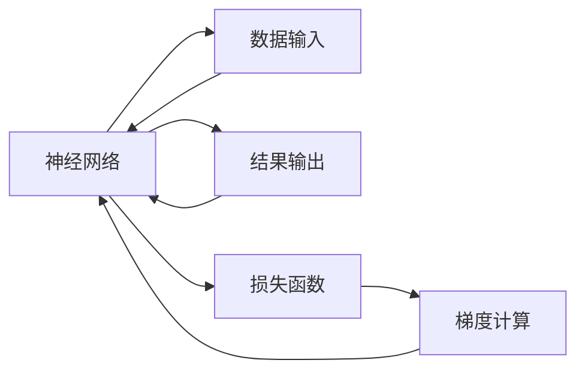

                 

# 神经网络：推动社会进步的力量

## 1. 背景介绍

### 1.1 问题由来

人工智能(AI)技术的飞速发展，尤其是深度学习(DL)技术的广泛应用，深刻改变了我们的生活方式和工作方式。其中，神经网络作为一种基于人工神经元模型的计算框架，因其强大的模式识别和处理能力，成为了人工智能的核心工具。从图像识别、语音识别，到自然语言处理、智能推荐，神经网络在各个领域展示了其卓越的性能。

然而，随着深度学习技术的不断演进，其应用范围和潜力也在不断拓展。从医疗健康、金融风控，到智能制造、智慧交通，神经网络的应用场景几乎无所不包。尽管如此，神经网络的发展仍面临诸多挑战。例如，如何提高神经网络的泛化能力，如何优化模型的训练过程，如何增强神经网络的解释性和鲁棒性，等等。

### 1.2 问题核心关键点

本文聚焦于神经网络在推动社会进步方面的作用，并探讨其在实际应用中面临的关键挑战。具体而言，我们将从以下几个方面展开：

- 神经网络的基本原理及其发展历程。
- 神经网络在各个行业中的应用场景。
- 神经网络面临的技术挑战及其解决策略。
- 神经网络的未来发展趋势和研究展望。

通过对这些关键点的深入分析，我们希望能够为读者提供一份全面而深刻的视角，充分理解神经网络在推动社会进步中的力量。

## 2. 核心概念与联系

### 2.1 核心概念概述

神经网络作为一种基于生物学神经系统的计算模型，通过模拟神经元之间的连接和交互，实现对复杂数据的高效处理。其核心组件包括神经元、连接权重、激活函数、损失函数、反向传播算法等。

- **神经元(Neuron)**：神经网络的基本单元，接收输入信号，通过激活函数计算输出。
- **连接权重(Weight)**：神经元之间的连接参数，表示信号的传递强度。
- **激活函数(Activation Function)**：神经元的非线性变换函数，使神经网络具备非线性表达能力。
- **损失函数(Loss Function)**：衡量神经网络预测输出与真实标签之间的差异，用于优化网络参数。
- **反向传播算法(Backpropagation)**：通过链式法则计算损失函数对参数的梯度，并反向更新权重。

这些概念构成了神经网络的基本框架，使得神经网络能够在复杂的非线性关系中，进行高效的特征提取和模式识别。

### 2.2 核心概念原理和架构的 Mermaid 流程图



该流程图展示了神经网络的基本架构，其中输入数据通过神经元层进行转换，输出结果也由神经元层生成。损失函数用于衡量预测输出与真实标签之间的差异，梯度计算则用于反向更新网络参数，从而优化模型性能。

## 3. 核心算法原理 & 具体操作步骤

### 3.1 算法原理概述

神经网络的训练过程主要分为前向传播和反向传播两个阶段。在前向传播阶段，输入数据通过神经网络逐层传递，生成最终输出结果。在反向传播阶段，根据损失函数计算预测输出与真实标签之间的差异，并使用梯度下降等优化算法更新网络参数，使模型性能不断提升。

### 3.2 算法步骤详解

神经网络的训练过程包括以下几个关键步骤：

**Step 1: 数据预处理**

数据预处理包括数据清洗、归一化、分批次加载等，目的是为神经网络提供高质量的输入数据。具体而言，可以采用以下方法：

- 数据清洗：去除异常值、噪声数据等。
- 数据归一化：将数据缩放到0-1或-1到1的范围内，防止梯度消失或爆炸。
- 数据分批次加载：将数据按批次加载，以提高训练效率。

**Step 2: 模型搭建**

根据任务类型选择合适的神经网络模型。例如，对于图像识别任务，可以选择卷积神经网络(CNN)；对于自然语言处理任务，可以选择循环神经网络(RNN)或Transformer网络。

**Step 3: 前向传播**

将输入数据逐层传递，通过激活函数计算输出结果。具体而言，可以采用以下步骤：

- 初始化权重和偏置。
- 逐层进行前向传播计算。
- 将结果传递到输出层，生成最终预测结果。

**Step 4: 损失函数计算**

根据损失函数计算预测输出与真实标签之间的差异。常见的损失函数包括均方误差、交叉熵等。

**Step 5: 反向传播**

根据损失函数计算梯度，并反向更新权重。具体而言，可以采用以下步骤：

- 计算损失函数对每个参数的梯度。
- 根据梯度更新参数值，减小预测误差。
- 重复多次前向传播和反向传播，直到模型收敛。

**Step 6: 模型评估**

使用测试集评估模型性能，判断是否达到预期目标。常见评估指标包括准确率、精确率、召回率等。

### 3.3 算法优缺点

神经网络的优点包括：

- 强大的非线性表达能力：神经网络可以处理复杂的非线性关系，具备较强的特征提取能力。
- 高效的并行计算：神经网络可以通过分布式计算实现高效的并行处理。
- 灵活性：神经网络可以根据不同任务进行灵活的模型设计和参数调整。

神经网络的缺点包括：

- 过拟合风险：神经网络在训练过程中容易过拟合，导致泛化性能下降。
- 计算资源消耗大：神经网络需要大量的计算资源，如GPU、TPU等高性能设备。
- 解释性不足：神经网络的预测结果往往难以解释，缺乏可解释性。

尽管存在这些缺点，神经网络在实际应用中仍展现出巨大的潜力，成为推动社会进步的重要力量。

### 3.4 算法应用领域

神经网络在各个领域都有广泛的应用，例如：

- **医疗健康**：通过分析医疗影像、电子病历等数据，辅助诊断和治疗决策。
- **金融风控**：利用神经网络进行信用评估、欺诈检测、投资预测等。
- **智能制造**：通过图像识别、故障诊断等技术，提升生产效率和质量。
- **智慧交通**：利用神经网络进行交通流量预测、自动驾驶等，改善交通状况。
- **智能推荐**：通过分析用户行为数据，提供个性化的商品推荐和内容推荐。
- **自然语言处理**：利用神经网络进行机器翻译、情感分析、问答系统等，提升人机交互体验。

## 4. 数学模型和公式 & 详细讲解 & 举例说明

### 4.1 数学模型构建

神经网络的基本数学模型可以表示为：

$$
\begin{aligned}
\boldsymbol{h}^{[l]} &= \sigma(\boldsymbol{W}^{[l]}\boldsymbol{h}^{[l-1]} + \boldsymbol{b}^{[l]}) \\
\boldsymbol{y} &= \boldsymbol{W}^{[L]}\boldsymbol{h}^{[L]} + \boldsymbol{b}^{[L]}
\end{aligned}
$$

其中，$\boldsymbol{h}^{[l]}$ 表示第 $l$ 层的输出，$\sigma$ 表示激活函数，$\boldsymbol{W}^{[l]}$ 和 $\boldsymbol{b}^{[l]}$ 分别表示第 $l$ 层的权重和偏置。$\boldsymbol{y}$ 表示最终输出结果。

### 4.2 公式推导过程

神经网络的训练过程主要涉及前向传播和反向传播两个阶段。

**前向传播**：

$$
\begin{aligned}
\boldsymbol{h}^{[1]} &= \sigma(\boldsymbol{W}^{[1]}\boldsymbol{x} + \boldsymbol{b}^{[1]}) \\
\boldsymbol{h}^{[2]} &= \sigma(\boldsymbol{W}^{[2]}\boldsymbol{h}^{[1]} + \boldsymbol{b}^{[2]}) \\
&\vdots \\
\boldsymbol{h}^{[L]} &= \sigma(\boldsymbol{W}^{[L]}\boldsymbol{h}^{[L-1]} + \boldsymbol{b}^{[L]})
\end{aligned}
$$

**反向传播**：

$$
\begin{aligned}
\frac{\partial \mathcal{L}}{\partial \boldsymbol{W}^{[L]}} &= \frac{\partial \mathcal{L}}{\partial \boldsymbol{y}}\frac{\partial \boldsymbol{y}}{\partial \boldsymbol{h}^{[L]}}\frac{\partial \boldsymbol{h}^{[L]}}{\partial \boldsymbol{W}^{[L]}} \\
\frac{\partial \mathcal{L}}{\partial \boldsymbol{b}^{[L]}} &= \frac{\partial \mathcal{L}}{\partial \boldsymbol{y}}\frac{\partial \boldsymbol{y}}{\partial \boldsymbol{h}^{[L]}} \\
&\vdots \\
\frac{\partial \mathcal{L}}{\partial \boldsymbol{b}^{[1]}} &= \frac{\partial \mathcal{L}}{\partial \boldsymbol{y}}\frac{\partial \boldsymbol{y}}{\partial \boldsymbol{h}^{[1]}}
\end{aligned}
$$

其中，$\mathcal{L}$ 表示损失函数。$\frac{\partial \mathcal{L}}{\partial \boldsymbol{W}^{[l]}}$ 和 $\frac{\partial \mathcal{L}}{\partial \boldsymbol{b}^{[l]}}$ 分别表示损失函数对权重和偏置的梯度。

### 4.3 案例分析与讲解

以图像分类任务为例，神经网络可以通过卷积神经网络(CNN)进行训练。CNN利用卷积操作和池化操作提取图像特征，并使用全连接层进行分类。

**前向传播**：

$$
\begin{aligned}
\boldsymbol{h}^{[1]} &= \sigma(\boldsymbol{W}^{[1]}\boldsymbol{x} + \boldsymbol{b}^{[1]}) \\
\boldsymbol{h}^{[2]} &= \sigma(\boldsymbol{W}^{[2]}\boldsymbol{h}^{[1]} + \boldsymbol{b}^{[2]}) \\
&\vdots \\
\boldsymbol{h}^{[L]} &= \sigma(\boldsymbol{W}^{[L]}\boldsymbol{h}^{[L-1]} + \boldsymbol{b}^{[L]})
\end{aligned}
$$

**反向传播**：

$$
\begin{aligned}
\frac{\partial \mathcal{L}}{\partial \boldsymbol{W}^{[L]}} &= \frac{\partial \mathcal{L}}{\partial \boldsymbol{y}}\frac{\partial \boldsymbol{y}}{\partial \boldsymbol{h}^{[L]}}\frac{\partial \boldsymbol{h}^{[L]}}{\partial \boldsymbol{W}^{[L]}} \\
\frac{\partial \mathcal{L}}{\partial \boldsymbol{b}^{[L]}} &= \frac{\partial \mathcal{L}}{\partial \boldsymbol{y}}\frac{\partial \boldsymbol{y}}{\partial \boldsymbol{h}^{[L]}} \\
&\vdots \\
\frac{\partial \mathcal{L}}{\partial \boldsymbol{b}^{[1]}} &= \frac{\partial \mathcal{L}}{\partial \boldsymbol{y}}\frac{\partial \boldsymbol{y}}{\partial \boldsymbol{h}^{[1]}}
\end{aligned}
$$

其中，$\boldsymbol{x}$ 表示输入图像，$\boldsymbol{y}$ 表示预测标签。$\sigma$ 表示激活函数，如ReLU、Sigmoid等。

## 5. 项目实践：代码实例和详细解释说明

### 5.1 开发环境搭建

在进行神经网络项目开发时，需要准备以下开发环境：

1. 安装Python：从官网下载并安装最新版本的Python，并设置环境变量。

2. 安装TensorFlow或PyTorch：TensorFlow和PyTorch是当前最常用的深度学习框架，可以分别使用以下命令进行安装。

   - TensorFlow: `pip install tensorflow`
   - PyTorch: `pip install torch torchvision torchaudio`

3. 安装必要的库：安装NumPy、Pandas、Matplotlib等常用库，以便于数据处理和可视化。

   - `pip install numpy pandas matplotlib`

4. 安装TensorBoard和Weights & Biases：TensorBoard和Weights & Biases是常用的模型训练可视化工具，可以分别使用以下命令进行安装。

   - `pip install tensorboard`
   - `pip install weightsandbiases`

完成以上步骤后，即可在Python环境中进行神经网络项目开发。

### 5.2 源代码详细实现

以下是一个简单的图像分类项目的代码实现：

```python
import tensorflow as tf
from tensorflow.keras import layers, models

# 加载数据集
(x_train, y_train), (x_test, y_test) = tf.keras.datasets.mnist.load_data()

# 数据预处理
x_train = x_train.reshape(-1, 28, 28, 1) / 255.0
x_test = x_test.reshape(-1, 28, 28, 1) / 255.0

# 定义模型
model = models.Sequential([
    layers.Conv2D(32, (3, 3), activation='relu', input_shape=(28, 28, 1)),
    layers.MaxPooling2D((2, 2)),
    layers.Flatten(),
    layers.Dense(10, activation='softmax')
])

# 编译模型
model.compile(optimizer='adam', loss='sparse_categorical_crossentropy', metrics=['accuracy'])

# 训练模型
model.fit(x_train, y_train, epochs=10, validation_data=(x_test, y_test))

# 评估模型
model.evaluate(x_test, y_test)
```

该代码实现了一个简单的卷积神经网络模型，用于图像分类任务。其中，`Conv2D`和`MaxPooling2D`层用于提取图像特征，`Flatten`层将特征展平，`Dense`层用于分类。`softmax`激活函数用于多分类问题，`adam`优化器用于模型优化。

### 5.3 代码解读与分析

**数据预处理**：

数据预处理是神经网络项目开发中非常重要的一步。在图像分类任务中，需要将原始的像素值归一化到0-1范围内，以避免梯度消失或爆炸。

**模型定义**：

模型定义包括选择网络结构、定义激活函数、选择优化器等。在本例中，我们使用了一个简单的卷积神经网络结构，包括卷积层、池化层和全连接层。

**模型编译**：

模型编译包括定义损失函数、优化器和评估指标。在本例中，我们使用了交叉熵损失函数和Adam优化器，并设置了准确率作为评估指标。

**模型训练**：

模型训练包括数据加载、前向传播、反向传播和参数更新。在本例中，我们使用了训练集进行模型训练，并设置了10个epoch的训练周期。

**模型评估**：

模型评估包括在测试集上进行预测，并计算模型的准确率。在本例中，我们使用了测试集进行模型评估，并输出了模型的准确率。

## 6. 实际应用场景

### 6.1 医疗健康

神经网络在医疗健康领域有着广泛的应用，例如：

- **医学影像分析**：通过分析医学影像数据，辅助医生进行疾病诊断和治疗决策。
- **电子病历分析**：利用自然语言处理技术，提取和分析电子病历数据，提高医生的工作效率。
- **药物发现**：通过分析生物数据，预测药物的效果和副作用，加速新药研发。

### 6.2 金融风控

神经网络在金融风控领域也有着广泛的应用，例如：

- **信用评估**：通过分析用户的信用记录、行为数据等，预测用户的信用风险。
- **欺诈检测**：利用神经网络进行交易异常检测，识别欺诈行为。
- **投资预测**：通过分析市场数据，预测股票、基金等投资产品的表现。

### 6.3 智能制造

神经网络在智能制造领域也有着广泛的应用，例如：

- **质量检测**：通过分析生产过程中的图像数据，检测产品的质量问题。
- **故障诊断**：利用传感器数据，预测设备故障，提高设备的运行效率。
- **生产调度**：通过分析生产数据，优化生产流程，提高生产效率。

### 6.4 未来应用展望

随着神经网络技术的不断进步，其应用范围也将不断拓展。未来，神经网络将在更多领域展现其强大的能力，例如：

- **智能交通**：通过分析交通数据，优化交通流量，减少拥堵。
- **智能推荐**：通过分析用户行为数据，提供个性化的商品推荐和内容推荐。
- **智能客服**：利用自然语言处理技术，提高客服系统的响应速度和准确性。
- **智能家居**：通过分析用户行为数据，优化家居设备的运行，提升用户体验。

## 7. 工具和资源推荐

### 7.1 学习资源推荐

为了帮助开发者系统掌握神经网络的技术原理和应用实践，这里推荐一些优质的学习资源：

- **《深度学习》（Goodfellow等）**：介绍了深度学习的基本概念和前沿技术，适合初学者入门。
- **《TensorFlow实战》（Francois Chollet）**：介绍了TensorFlow的基本用法和高级技巧，适合有一定基础的开发者。
- **《PyTorch深度学习》（Yosinski等）**：介绍了PyTorch的基本用法和高级技巧，适合有一定基础的开发者。
- **《深度学习框架入门与实战》（廖伟华等）**：介绍了深度学习框架的基本用法和实战案例，适合初学者入门。

通过学习这些资源，相信你一定能够系统地掌握神经网络的技术原理和应用实践。

### 7.2 开发工具推荐

以下是几款用于神经网络开发和研究的常用工具：

- **TensorFlow**：由Google主导开发的深度学习框架，支持CPU、GPU和TPU加速。
- **PyTorch**：由Facebook开发的深度学习框架，支持动态计算图，易于调试和实验。
- **MXNet**：由Amazon开发的深度学习框架，支持分布式训练和模型部署。
- **Keras**：基于TensorFlow和Theano等后端的高层深度学习框架，易于上手。
- **JAX**：由Google开发的Python深度学习库，支持动态计算图和自动微分，易于实验和调试。

合理利用这些工具，可以显著提升神经网络开发的效率和效果。

### 7.3 相关论文推荐

神经网络的发展源于学界的持续研究。以下是几篇奠基性的相关论文，推荐阅读：

- **《深度学习》（Goodfellow等）**：介绍了深度学习的基本概念和前沿技术，适合初学者入门。
- **《ImageNet大规模视觉识别挑战赛》（Krizhevsky等）**：介绍了使用卷积神经网络进行图像分类的技术。
- **《自然语言处理综述》（Jurafsky等）**：介绍了自然语言处理的基本概念和前沿技术，适合对NLP感兴趣的研究者。
- **《注意力机制》（Vaswani等）**：介绍了Transformer网络中的注意力机制，推动了NLP技术的发展。
- **《学习表示的梯度下降》（Hinton等）**：介绍了深度学习中的梯度下降算法，推动了深度学习的发展。

这些论文代表了大规模神经网络技术的发展脉络。通过学习这些前沿成果，可以帮助研究者把握学科前进方向，激发更多的创新灵感。

## 8. 总结：未来发展趋势与挑战

### 8.1 研究成果总结

本文对神经网络在推动社会进步方面的作用进行了全面系统的介绍。首先，阐述了神经网络的基本原理及其发展历程，明确了神经网络在各个行业中的应用场景。其次，探讨了神经网络面临的技术挑战及其解决策略。最后，总结了神经网络的未来发展趋势和研究展望。

通过本文的系统梳理，可以看到，神经网络在推动社会进步中的力量巨大。尽管存在一些技术挑战，但通过不断优化算法和模型，神经网络将在更多领域展现其强大的能力，为人类社会带来更多的便利和创新。

### 8.2 未来发展趋势

展望未来，神经网络的发展将呈现以下几个趋势：

- **更强大的计算能力**：随着计算能力的不断提升，神经网络将能够处理更大规模的数据，实现更复杂的任务。
- **更高的泛化能力**：通过更多的数据和算法优化，神经网络将具备更高的泛化能力，适应更多样化的任务和数据。
- **更高的可解释性**：通过引入更多的符号知识和解释机制，神经网络将具备更高的可解释性，便于理解和应用。
- **更高的鲁棒性**：通过更多的鲁棒性设计和对抗训练，神经网络将具备更高的鲁棒性，避免在实际应用中的误判和滥用。

### 8.3 面临的挑战

尽管神经网络在推动社会进步中具有巨大潜力，但在实际应用中仍面临诸多挑战：

- **数据瓶颈**：神经网络需要大量的高质量数据进行训练，数据获取成本较高，数据质量难以保证。
- **计算资源消耗大**：神经网络需要大量的计算资源，如GPU、TPU等高性能设备，成本较高。
- **过拟合问题**：神经网络在训练过程中容易过拟合，导致泛化性能下降。
- **可解释性不足**：神经网络的预测结果往往难以解释，缺乏可解释性。
- **安全性问题**：神经网络可能存在偏见和歧视，导致不公正的应用。

### 8.4 研究展望

面对神经网络面临的诸多挑战，未来的研究需要在以下几个方面寻求新的突破：

- **无监督学习和自监督学习**：摆脱对大量标注数据的依赖，利用无监督和自监督学习技术，最大化数据利用率。
- **参数高效学习**：开发更加参数高效的神经网络模型，减少计算资源的消耗。
- **可解释性增强**：引入更多的符号知识和解释机制，提高神经网络的可解释性。
- **鲁棒性设计**：通过更多的鲁棒性设计和对抗训练，提高神经网络的鲁棒性。
- **安全性和伦理性**：在神经网络的设计和应用中，引入更多的安全性和伦理性考虑，确保其公正性和安全性。

通过这些研究方向的探索，相信神经网络将在更多领域展现其强大的能力，为人类社会带来更多的便利和创新。总之，神经网络需要在技术优化和实际应用中不断迭代和优化，方能实现其推动社会进步的伟大目标。

## 9. 附录：常见问题与解答

**Q1: 神经网络与传统机器学习有何不同？**

A: 神经网络与传统机器学习的主要不同在于其非线性表达能力和自动特征提取能力。传统机器学习通常需要手工设计特征，而神经网络通过训练自动学习到数据的特征表示，从而实现更强的泛化能力和更灵活的应用。

**Q2: 神经网络训练过程中的过拟合问题如何解决？**

A: 神经网络训练过程中过拟合问题可以通过以下方法解决：

- 数据增强：通过扩充训练数据，增加模型的泛化能力。
- 正则化：通过L2正则化、Dropout等方法，防止模型过拟合。
- 早停策略：在模型性能不再提升时停止训练，避免过拟合。
- 参数共享：通过参数共享和网络结构优化，减少模型的复杂度，防止过拟合。

**Q3: 神经网络在实际应用中面临哪些技术挑战？**

A: 神经网络在实际应用中面临以下技术挑战：

- 数据获取和标注成本高，难以获取高质量数据。
- 计算资源消耗大，需要高性能设备支持。
- 模型复杂度高，难以解释和优化。
- 鲁棒性不足，面对异常数据和攻击容易误判。
- 安全性问题，存在偏见和歧视风险。

**Q4: 如何优化神经网络的计算效率？**

A: 神经网络计算效率可以通过以下方法优化：

- 模型裁剪：去除不必要的层和参数，减小模型尺寸。
- 量化加速：将浮点模型转为定点模型，压缩存储空间。
- 分布式计算：通过分布式训练和推理，提高计算效率。
- 硬件加速：利用GPU、TPU等高性能设备，提高计算速度。
- 优化算法：使用更高效的优化算法，如Adam、Adafactor等。

通过这些优化措施，可以显著提升神经网络的计算效率，使其更适用于实际应用场景。

**Q5: 神经网络的可解释性问题如何解决？**

A: 神经网络可解释性问题可以通过以下方法解决：

- 可视化技术：通过可视化训练过程中的梯度变化、激活值等，理解模型决策过程。
- 符号知识融合：将符号知识和神经网络模型进行融合，提高模型的可解释性。
- 自解释模型：设计具有自解释能力的模型，如LIME、SHAP等，提供模型解释。
- 元学习：通过元学习技术，学习到模型之间的因果关系，提高模型的可解释性。

通过这些方法，可以逐步增强神经网络的可解释性，提升模型的透明度和可信度。

---

作者：禅与计算机程序设计艺术 / Zen and the Art of Computer Programming

