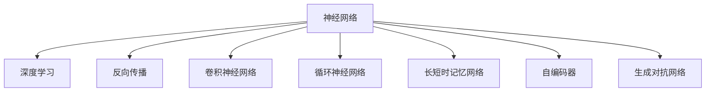

                 

# 神经网络：改变世界的技术

> 关键词：神经网络，深度学习，人工智能，机器学习，图像识别，语音识别，自然语言处理，推荐系统，计算机视觉

## 1. 背景介绍

### 1.1 问题由来

神经网络（Neural Network, NN）是一类模仿人类神经系统结构和功能的计算模型，由大量的人工神经元（神经单元）通过连接和权值参数构成。自1940年代霍普菲尔德提出第一个神经网络模型以来，神经网络的发展经历了多个阶段：从简单的感知机，到多层前馈网络，再到卷积神经网络、循环神经网络等复杂模型。

神经网络在处理大规模数据和复杂非线性问题上表现出卓越的性能，广泛应用于计算机视觉、语音识别、自然语言处理、推荐系统等多个领域。尤其是在深度学习（Deep Learning）的推动下，神经网络在多个NLP任务上刷新了最先进的性能指标，推动了人工智能技术的快速发展。

### 1.2 问题核心关键点

神经网络的核心优势在于其高度的非线性建模能力和自动特征提取能力。通过多层的非线性变换，神经网络能够学习到数据中的复杂结构，从而在图像识别、语音识别、自然语言处理等领域取得显著进展。

神经网络模型一般包含输入层、若干个隐藏层和输出层，每个神经元通过连接权重和激活函数进行计算，模型参数由学习算法动态调整。学习算法通过反向传播算法，不断更新模型参数，使得模型在训练集上最小化损失函数，从而得到最优的模型参数。

神经网络不仅在学术界取得了巨大成功，更在工业界得到广泛应用。Google、Facebook、Amazon等科技巨头都依赖神经网络进行大规模数据处理和智能决策。神经网络的应用已渗透到社会生活的方方面面，改变了世界的面貌。

### 1.3 问题研究意义

研究神经网络技术，对于推动人工智能技术的产业化进程，加速各行各业的智能化转型，具有重要意义：

1. 提高数据处理效率。神经网络模型能够高效地处理大规模非线性数据，从而显著提升数据处理效率。
2. 优化决策过程。神经网络模型能够自动识别和抽取关键特征，提高决策的准确性和鲁棒性。
3. 赋能新兴产业。神经网络技术的应用，如自动驾驶、智能制造、智能医疗等，催生了新的产业和市场机会。
4. 推动技术创新。神经网络技术的快速发展，带来了新的理论创新和应用场景，加速了技术的迭代更新。

## 2. 核心概念与联系

### 2.1 核心概念概述

为了更好地理解神经网络的核心原理和应用，本节将介绍几个密切相关的核心概念：

- 神经网络（Neural Network, NN）：由大量神经元通过连接和权值构成的计算模型。通过多层非线性变换，神经网络能够自动提取数据特征，实现复杂模式的建模。
- 深度学习（Deep Learning）：一种特殊的机器学习范式，通过多层神经网络构建复杂模型，提高数据处理和预测精度。
- 反向传播（Backpropagation）：一种优化算法，通过链式法则计算神经网络中每个参数的梯度，从而更新模型参数。
- 卷积神经网络（Convolutional Neural Network, CNN）：一类针对图像等二维数据的神经网络，通过卷积和池化操作提取局部特征，广泛应用于计算机视觉领域。
- 循环神经网络（Recurrent Neural Network, RNN）：一类针对序列数据的神经网络，通过循环连接和时间步移位，实现对序列数据的动态建模。
- 长短时记忆网络（Long Short-Term Memory, LSTM）：一种特殊的RNN，通过门控机制解决了长期依赖问题，广泛应用于自然语言处理和语音识别等领域。
- 自编码器（Autoencoder）：一种特殊的神经网络，通过压缩和解压缩数据，实现数据的降维和特征提取，广泛应用于数据压缩和特征学习。
- 生成对抗网络（Generative Adversarial Network, GAN）：一种特殊的神经网络，通过对抗训练生成逼真的数据样本，广泛应用于图像生成和数据增强。

这些核心概念之间的逻辑关系可以通过以下Mermaid流程图来展示：



这个流程图展示出神经网络的主要构成和应用方向：

1. 神经网络是深度学习的基础，通过多层的非线性变换，实现复杂数据的建模。
2. 深度学习通过多层神经网络提高模型的复杂度和精度。
3. 反向传播是深度学习模型的优化算法，通过梯度计算和参数更新，最小化损失函数。
4. 卷积神经网络是处理图像数据的特殊神经网络，通过卷积和池化操作提取局部特征。
5. 循环神经网络是处理序列数据的特殊神经网络，通过循环连接和时间步移位，实现对序列数据的建模。
6. 长短时记忆网络是一种特殊的循环神经网络，通过门控机制解决长期依赖问题。
7. 自编码器是一种特殊的神经网络，通过压缩和解压缩数据实现特征提取。
8. 生成对抗网络是一种特殊的神经网络，通过对抗训练生成逼真的数据样本。

这些核心概念共同构成了神经网络技术的理论框架和应用体系，为神经网络在实际场景中的广泛应用奠定了基础。

## 3. 核心算法原理 & 具体操作步骤

### 3.1 算法原理概述

神经网络的核心原理是多层非线性变换，通过反向传播算法最小化损失函数，从而得到最优的模型参数。其基本流程包括：

1. 输入数据经过输入层，进入多个隐藏层进行多次非线性变换。
2. 隐藏层的输出作为输出层的输入，输出层根据任务需求生成预测结果。
3. 通过损失函数计算模型输出与真实标签之间的误差，反向传播更新隐藏层和输出层的参数。
4. 重复上述过程，直至模型收敛或达到预设的迭代次数。

### 3.2 算法步骤详解

以下详细讲解神经网络模型的构建和训练流程：

**Step 1: 数据准备和模型定义**
- 收集和预处理训练数据，划分为训练集、验证集和测试集。
- 定义神经网络模型，包括输入层、若干个隐藏层和输出层。
- 选择合适的激活函数和损失函数。

**Step 2: 初始化模型参数**
- 随机初始化模型参数，通常使用正态分布或均匀分布。
- 设置学习率和优化算法（如Adam、SGD等）。

**Step 3: 前向传播计算预测值**
- 将训练集数据输入模型，逐层计算隐藏层和输出层的输出值。

**Step 4: 计算损失函数**
- 根据输出值和真实标签计算损失函数（如交叉熵损失、均方误差损失等）。

**Step 5: 反向传播更新参数**
- 使用链式法则计算模型中每个参数的梯度。
- 使用优化算法根据梯度更新模型参数。

**Step 6: 验证和测试**
- 在验证集上评估模型性能，调整超参数（如学习率、批大小等）。
- 在测试集上评估模型泛化能力，对比训练前后的精度提升。

**Step 7: 模型保存和部署**
- 将训练好的模型保存为模型文件，方便后续使用。
- 将模型封装为标准化接口，供实际应用系统调用。

以上是神经网络模型的一般训练流程。在实际应用中，还需要根据具体任务的特点，对微调过程的各个环节进行优化设计，如改进损失函数，引入更多的正则化技术，搜索最优的超参数组合等，以进一步提升模型性能。

### 3.3 算法优缺点

神经网络模型具有以下优点：
1. 强大的非线性建模能力。通过多层非线性变换，神经网络能够学习到复杂的数据结构。
2. 自动特征提取。神经网络能够自动提取输入数据的特征，无需手动设计特征提取器。
3. 数据处理效率高。神经网络模型能够高效处理大规模数据，提升数据处理速度。
4. 泛化能力强。神经网络模型具有较强的泛化能力，能够处理未知数据。
5. 算法复杂度高。神经网络模型结构复杂，训练过程需要大量的计算资源。
6. 可解释性不足。神经网络模型通常被视为"黑盒"系统，难以解释其内部工作机制。
7. 易过拟合。神经网络模型容易过拟合，需要引入正则化技术。

尽管存在这些局限性，但神经网络在数据处理和模式识别方面的卓越性能，使其成为现代人工智能技术的重要基础。未来，随着神经网络技术的不断发展和优化，这些局限性将得到逐步克服，神经网络将展现出更加广阔的应用前景。

### 3.4 算法应用领域

神经网络技术在多个领域得到了广泛应用，覆盖了从计算机视觉到自然语言处理等多个方面：

- 计算机视觉：图像分类、目标检测、人脸识别、图像生成等。通过卷积神经网络等模型，处理图像数据，提取视觉特征。
- 自然语言处理：文本分类、命名实体识别、机器翻译、对话系统等。通过循环神经网络和Transformer等模型，处理文本数据，提取语言特征。
- 语音识别：语音转文本、情感识别、语音合成等。通过卷积神经网络等模型，处理语音信号，提取音频特征。
- 推荐系统：商品推荐、内容推荐、广告推荐等。通过神经网络模型，对用户行为和物品特征进行建模，实现个性化推荐。
- 计算机视觉：图像分类、目标检测、人脸识别、图像生成等。通过卷积神经网络等模型，处理图像数据，提取视觉特征。
- 自然语言处理：文本分类、命名实体识别、机器翻译、对话系统等。通过循环神经网络和Transformer等模型，处理文本数据，提取语言特征。
- 语音识别：语音转文本、情感识别、语音合成等。通过卷积神经网络等模型，处理语音信号，提取音频特征。
- 推荐系统：商品推荐、内容推荐、广告推荐等。通过神经网络模型，对用户行为和物品特征进行建模，实现个性化推荐。

除了上述这些经典应用外，神经网络技术还被创新性地应用到更多场景中，如无人驾驶、智慧医疗、智能制造、智能安防等，为各行各业带来了新的变革。

## 4. 数学模型和公式 & 详细讲解 & 举例说明

### 4.1 数学模型构建

以下给出神经网络模型的数学表示，及其常用的激活函数和损失函数。

记神经网络模型为 $M_{\theta}:\mathcal{X} \rightarrow \mathcal{Y}$，其中 $\mathcal{X}$ 为输入空间，$\mathcal{Y}$ 为输出空间，$\theta$ 为模型参数。设训练集为 $D=\{(x_i,y_i)\}_{i=1}^N$，其中 $x_i \in \mathcal{X}, y_i \in \mathcal{Y}$。

定义模型 $M_{\theta}$ 在输入 $x$ 上的输出为 $\hat{y}=M_{\theta}(x)$。则训练过程中，神经网络的损失函数 $\mathcal{L}(\theta)$ 定义为：

$$
\mathcal{L}(\theta) = \frac{1}{N} \sum_{i=1}^N \ell(M_{\theta}(x_i),y_i)
$$

其中 $\ell$ 为损失函数，常用的有交叉熵损失、均方误差损失等。

在反向传播算法中，通过链式法则计算损失函数对参数 $\theta_k$ 的梯度，计算公式如下：

$$
\frac{\partial \mathcal{L}(\theta)}{\partial \theta_k} = \frac{\partial \ell(M_{\theta}(x),y)}{\partial \hat{y}} \cdot \frac{\partial \hat{y}}{\partial z_k} \cdot \frac{\partial z_k}{\partial \theta_k}
$$

其中 $z_k$ 为第 $k$ 层的输出，$\frac{\partial \ell(M_{\theta}(x),y)}{\partial \hat{y}}$ 为损失函数对输出 $\hat{y}$ 的梯度。

在实际应用中，常用的激活函数有sigmoid、ReLU、tanh等，常用的损失函数有交叉熵损失、均方误差损失等。

### 4.2 公式推导过程

以下以二分类任务为例，推导神经网络模型的损失函数和梯度计算公式。

设神经网络模型输出 $\hat{y}=M_{\theta}(x) \in [0,1]$，表示样本属于正类的概率。真实标签 $y \in \{0,1\}$。则二分类交叉熵损失函数定义为：

$$
\ell(M_{\theta}(x),y) = -[y\log \hat{y} + (1-y)\log (1-\hat{y})]
$$

将其代入经验风险公式，得：

$$
\mathcal{L}(\theta) = -\frac{1}{N}\sum_{i=1}^N [y_i\log M_{\theta}(x_i)+(1-y_i)\log(1-M_{\theta}(x_i))]
$$

在反向传播计算梯度时，设第 $k$ 层的输出为 $z_k$，激活函数为 $f_k$，权值矩阵为 $W_k$，偏置向量为 $b_k$，则第 $k$ 层的输出可以表示为：

$$
z_k = f_k(W_k z_{k-1} + b_k)
$$

其中 $z_0=x$。因此，第 $k$ 层的输出对第 $k-1$ 层的输出和权值矩阵的梯度可以表示为：

$$
\frac{\partial z_k}{\partial z_{k-1}} = f_k'(W_k) z_{k-1}
$$

$$
\frac{\partial z_k}{\partial W_k} = z_{k-1}^T f_k'(W_k)
$$

根据链式法则，损失函数对第 $k$ 层参数的梯度可以表示为：

$$
\frac{\partial \mathcal{L}(\theta)}{\partial W_k} = \frac{\partial \mathcal{L}(\theta)}{\partial z_k} \cdot \frac{\partial z_k}{\partial W_k} = \frac{\partial \ell(M_{\theta}(x),y)}{\partial \hat{y}} \cdot \frac{\partial \hat{y}}{\partial z_k} \cdot \frac{\partial z_k}{\partial W_k}
$$

结合前向传播计算公式，最终可以得到第 $k$ 层参数的更新公式：

$$
\theta_k \leftarrow \theta_k - \eta \frac{\partial \mathcal{L}(\theta)}{\partial \theta_k}
$$

其中 $\eta$ 为学习率。

在实际训练过程中，通常需要多次迭代计算梯度并更新参数，直至损失函数收敛或达到预设的迭代次数。

### 4.3 案例分析与讲解

以下通过一个简单的全连接神经网络（Fully Connected Neural Network, FCNN）模型，说明神经网络的训练过程。

假设训练数据集为 $D=\{(x_i,y_i)\}_{i=1}^N$，其中 $x_i \in \mathbb{R}^d, y_i \in \{0,1\}$。设神经网络模型由一个输入层、一个隐藏层和一个输出层构成，每个层分别包含 $d'$ 个神经元。设输入层的权重矩阵为 $W_0 \in \mathbb{R}^{d' \times d}$，隐藏层的权重矩阵为 $W_1 \in \mathbb{R}^{d' \times d'}$，输出层的权重矩阵为 $W_2 \in \mathbb{R}^{1 \times d'}$。设激活函数为sigmoid函数，输出层的激活函数为logistic函数。

神经网络的训练过程如下：

**Step 1: 初始化模型参数**
- 随机初始化权重矩阵 $W_0, W_1, W_2$。
- 设置学习率 $\eta$ 和优化算法（如AdamW）。

**Step 2: 前向传播计算预测值**
- 将输入数据 $x_i$ 通过输入层，得到隐藏层输出 $z_1$。
- 将隐藏层输出 $z_1$ 通过隐藏层，得到输出层输出 $\hat{y}_i$。

**Step 3: 计算损失函数**
- 根据输出 $\hat{y}_i$ 和真实标签 $y_i$ 计算交叉熵损失。

**Step 4: 反向传播更新参数**
- 计算损失函数对输出层参数 $W_2$ 的梯度。
- 根据梯度更新 $W_2$。
- 计算隐藏层输出 $z_1$ 对权重矩阵 $W_1$ 的梯度。
- 根据梯度更新 $W_1$。
- 计算输入层输出 $z_0$ 对权重矩阵 $W_0$ 的梯度。
- 根据梯度更新 $W_0$。

重复上述过程，直至损失函数收敛或达到预设的迭代次数。

## 5. 项目实践：代码实例和详细解释说明

### 5.1 开发环境搭建

在进行神经网络项目实践前，我们需要准备好开发环境。以下是使用Python进行TensorFlow开发的环境配置流程：

1. 安装Anaconda：从官网下载并安装Anaconda，用于创建独立的Python环境。

2. 创建并激活虚拟环境：
```bash
conda create -n tf-env python=3.8 
conda activate tf-env
```

3. 安装TensorFlow：根据CUDA版本，从官网获取对应的安装命令。例如：
```bash
conda install tensorflow -c pytorch -c conda-forge
```

4. 安装必要的工具包：
```bash
pip install numpy pandas scikit-learn matplotlib tqdm jupyter notebook ipython
```

完成上述步骤后，即可在`tf-env`环境中开始神经网络项目的开发。

### 5.2 源代码详细实现

这里我们以手写数字识别（MNIST）为例，给出使用TensorFlow进行神经网络模型的PyTorch代码实现。

首先，定义神经网络模型的架构和损失函数：

```python
import tensorflow as tf
from tensorflow.keras import datasets, layers, models

# 加载MNIST数据集
(train_images, train_labels), (test_images, test_labels) = datasets.mnist.load_data()

# 将像素值归一化到[0,1]范围内
train_images, test_images = train_images / 255.0, test_images / 255.0

# 定义模型架构
model = models.Sequential([
    layers.Flatten(input_shape=(28, 28)),
    layers.Dense(128, activation='relu'),
    layers.Dense(10)
])

# 定义损失函数和优化器
loss_fn = tf.keras.losses.SparseCategoricalCrossentropy(from_logits=True)
optimizer = tf.keras.optimizers.Adam()

# 编译模型
model.compile(optimizer=optimizer, loss=loss_fn, metrics=['accuracy'])
```

接着，定义训练和评估函数：

```python
def train_model(model, train_images, train_labels, epochs, batch_size):
    # 创建训练集数据生成器
    train_dataset = tf.data.Dataset.from_tensor_slices((train_images, train_labels)).shuffle(60000).batch(batch_size)

    # 训练模型
    model.fit(train_dataset, epochs=epochs, validation_split=0.2)

def evaluate_model(model, test_images, test_labels):
    # 创建测试集数据生成器
    test_dataset = tf.data.Dataset.from_tensor_slices((test_images, test_labels)).batch(128)

    # 评估模型
    model.evaluate(test_dataset)
```

最后，启动训练流程并在测试集上评估：

```python
# 定义训练参数
batch_size = 128
epochs = 10

# 训练模型
train_model(model, train_images, train_labels, epochs, batch_size)

# 在测试集上评估模型
evaluate_model(model, test_images, test_labels)
```

以上就是使用TensorFlow进行手写数字识别任务的神经网络模型的完整代码实现。可以看到，TensorFlow提供了非常方便的接口和API，可以快速构建和训练神经网络模型。

### 5.3 代码解读与分析

让我们再详细解读一下关键代码的实现细节：

**定义模型架构**
- `Flatten`层将输入的28x28的二维图像数据展平为一维向量，方便后续的连接操作。
- `Dense`层为全连接层，通过学习权重矩阵 $W_1$ 和偏置向量 $b_1$，将输入数据 $z_0$ 映射为隐藏层输出 $z_1$。
- 通过多个全连接层，不断提取更高层次的特征，最终得到输出层输出 $\hat{y}$。

**定义损失函数和优化器**
- 使用交叉熵损失函数，适用于多分类任务。
- 使用Adam优化器，具有自适应学习率和动量更新，适合大规模神经网络训练。

**训练和评估函数**
- `train_model`函数：通过生成器迭代训练数据，逐批次输入模型进行训练，并使用验证集评估模型性能。
- `evaluate_model`函数：通过生成器迭代测试数据，计算模型在测试集上的准确率。

**训练流程**
- 定义训练参数：batch size和epoch数。
- 在训练集上训练模型，并使用验证集进行评估。
- 在测试集上评估模型性能，对比训练前后的精度提升。

可以看到，TensorFlow提供了非常便捷的接口和API，开发者可以迅速实现神经网络的训练和评估，而不必过多关注底层的计算图实现细节。

当然，工业级的系统实现还需考虑更多因素，如模型的保存和部署、超参数的自动搜索、更加灵活的任务适配层等。但核心的神经网络训练范式基本与此类似。

## 6. 实际应用场景

### 6.1 智能推荐系统

神经网络技术在推荐系统中的应用，极大地提升了个性化推荐的效果。传统推荐系统往往只依赖用户的历史行为数据进行物品推荐，缺乏对用户兴趣偏好的深度理解。而通过神经网络模型，推荐系统能够自动抽取用户的行为特征，学习到更加丰富的用户兴趣。

在实践中，可以收集用户浏览、点击、评论、分享等行为数据，提取和用户交互的物品标题、描述、标签等文本内容。将文本内容作为模型输入，用户的后续行为（如是否点击、购买等）作为监督信号，在此基础上训练神经网络模型。训练好的模型能够从文本内容中准确把握用户的兴趣点。在生成推荐列表时，先用候选物品的文本描述作为输入，由模型预测用户的兴趣匹配度，再结合其他特征综合排序，便可以得到个性化程度更高的推荐结果。

### 6.2 图像识别系统

神经网络技术在图像识别领域也取得了突破性进展。传统的图像识别方法往往依赖手动设计特征提取器，而神经网络模型能够自动提取图像的特征表示，实现对复杂图像的识别。

在实践中，可以收集大量标注数据，如ImageNet数据集，训练卷积神经网络模型。模型通过多个卷积层和池化层，提取图像的局部特征，并通过全连接层进行分类。训练好的模型能够对图像中的物体进行准确的识别和分类。

### 6.3 自然语言处理系统

神经网络技术在自然语言处理领域的应用非常广泛。通过循环神经网络、Transformer等模型，神经网络能够自动提取文本的语义信息，实现对文本的理解和生成。

在实践中，可以收集大量的标注数据，如IMDB电影评论数据集，训练循环神经网络模型。模型通过多个隐藏层，逐步提取文本中的语义信息，并输出预测结果。训练好的模型能够对文本进行情感分类、问答、摘要等任务。

### 6.4 未来应用展望

随着神经网络技术的不断发展和优化，其应用范围将进一步拓展，对社会生活的影响也将更加深远。

在智慧医疗领域，通过神经网络技术，可以实现对病历数据的自动分析，辅助医生进行疾病诊断和治疗方案的制定。神经网络技术还能够对医学图像进行自动识别和分类，辅助医学影像诊断。

在智能制造领域，通过神经网络技术，可以实现对生产设备的智能监控和预测性维护。神经网络技术还能够对生产数据进行自动分析和挖掘，辅助企业进行生产调度和管理。

在智能安防领域，通过神经网络技术，可以实现对视频数据的自动分析和识别。神经网络技术还能够对音频数据进行自动分析和识别，辅助安全监控和预警。

此外，在自动驾驶、智慧城市、智能家居等众多领域，神经网络技术也将发挥重要作用，为社会带来新的变革和进步。

## 7. 工具和资源推荐
### 7.1 学习资源推荐

为了帮助开发者系统掌握神经网络技术，这里推荐一些优质的学习资源：

1. 《深度学习》（Ian Goodfellow等著）：深度学习的经典教材，系统介绍了深度学习的基本概念和前沿技术。
2. 《神经网络与深度学习》（Michael Nielsen著）：简明扼要的深度学习入门教材，适合初学者。
3. 《TensorFlow官方文档》：TensorFlow的官方文档，提供详细的API说明和代码示例。
4. 《PyTorch官方文档》：PyTorch的官方文档，提供丰富的教程和代码示例。
5. 《Kaggle数据科学竞赛》：Kaggle提供大量的数据集和竞赛任务，适合实践学习和技能提升。

通过对这些资源的学习实践，相信你一定能够迅速掌握神经网络技术的精髓，并用于解决实际的工程问题。
###  7.2 开发工具推荐

高效的开发离不开优秀的工具支持。以下是几款用于神经网络开发常用的工具：

1. TensorFlow：由Google主导开发的深度学习框架，生产部署方便，适合大规模工程应用。
2. PyTorch：基于Python的开源深度学习框架，灵活动态的计算图，适合快速迭代研究。
3. Keras：高级深度学习API，基于TensorFlow和Theano等后端，提供便捷的模型构建接口。
4. JAX：用于加速深度学习模型的高性能计算框架，支持自动微分和GPU/TPU加速。
5. ONNX：用于跨平台和跨语言模型转换的开源工具，支持TensorFlow、PyTorch等主流框架。

合理利用这些工具，可以显著提升神经网络开发和研究的效率，加快创新迭代的步伐。

### 7.3 相关论文推荐

神经网络技术的发展源于学界的持续研究。以下是几篇奠基性的相关论文，推荐阅读：

1. A New Approach to Learning and Discovering Complex Patterns with a Neural Network（BP神经网络论文）：提出BP神经网络，通过反向传播算法进行模型训练，开创了深度学习时代。
2. Convolutional Neural Networks for Image Recognition（卷积神经网络论文）：提出卷积神经网络，通过卷积和池化操作提取图像特征，提高图像识别精度。
3. Long Short-Term Memory（LSTM）：提出LSTM模型，解决循环神经网络中的长期依赖问题，广泛应用于自然语言处理。
4. ImageNet Classification with Deep Convolutional Neural Networks（ImageNet论文）：提出AlexNet模型，通过多层卷积和全连接层，实现大规模图像识别任务。
5. Deep Residual Learning for Image Recognition（ResNet论文）：提出ResNet模型，通过残差连接解决深度网络退化问题，实现更深层的神经网络。

这些论文代表了大神经网络技术的发展脉络。通过学习这些前沿成果，可以帮助研究者把握学科前进方向，激发更多的创新灵感。

## 8. 总结：未来发展趋势与挑战

### 8.1 总结

本文对神经网络技术进行了全面系统的介绍。首先阐述了神经网络的基本原理和核心思想，明确了神经网络在深度学习中的重要地位。其次，从原理到实践，详细讲解了神经网络模型的构建和训练流程，给出了神经网络项目的完整代码实例。同时，本文还广泛探讨了神经网络技术在多个领域的应用前景，展示了神经网络技术的广阔前景。

通过本文的系统梳理，可以看到，神经网络技术在数据处理和模式识别方面的卓越性能，使其成为现代人工智能技术的重要基础。未来，随着神经网络技术的不断发展和优化，这些应用将得到更加广泛和深入的探索，为人类认知智能的进化带来深远影响。

### 8.2 未来发展趋势

展望未来，神经网络技术将呈现以下几个发展趋势：

1. 模型规模持续增大。随着算力成本的下降和数据规模的扩张，神经网络模型将继续向更深、更宽、更大方向发展，以实现更加复杂、精细的建模。
2. 计算效率不断提升。随着硬件技术的进步和计算框架的优化，神经网络模型将实现更高的计算效率和更低的能耗。
3. 模型性能持续提升。随着算法和模型结构的改进，神经网络模型将不断提升在图像、语音、文本等领域的处理精度和泛化能力。
4. 模型通用性增强。通过迁移学习、自监督学习等方法，神经网络模型将变得更加通用，能够适应更广泛的输入数据和应用场景。
5. 多模态融合加深。未来的神经网络模型将更加注重跨模态数据的融合，实现视觉、语音、文本等多模态信息的协同建模。
6. 模型可解释性增强。未来的神经网络模型将更加注重可解释性，通过可视化工具和解释算法，增强模型的透明性和可理解性。
7. 模型伦理和安全保障。未来的神经网络模型将更加注重伦理和安全保障，通过公平性评估和对抗攻击防御，提升模型的公正性和可信度。

以上趋势凸显了神经网络技术的前景，这些方向的探索发展，必将进一步提升神经网络系统的性能和应用范围，为人类认知智能的进化带来深远影响。

### 8.3 面临的挑战

尽管神经网络技术已经取得了瞩目成就，但在迈向更加智能化、普适化应用的过程中，仍面临诸多挑战：

1. 数据依赖问题。神经网络模型的训练需要大量的标注数据，获取高质量数据成本较高。如何降低对标注数据的依赖，提高模型在少样本情况下的泛化能力，将是重要的研究方向。
2. 模型鲁棒性不足。神经网络模型容易过拟合，对输入数据的微小扰动敏感，鲁棒性不足。如何提高模型的鲁棒性，防止灾难性遗忘，还需要更多的理论和实践积累。
3. 计算资源限制。神经网络模型训练和推理需要大量的计算资源，如何优化模型结构，提高计算效率，实现轻量化部署，将是重要的优化方向。
4. 模型可解释性不足。神经网络模型通常被视为"黑盒"系统，难以解释其内部工作机制和决策逻辑。如何赋予模型更强的可解释性，增强模型的透明性和可理解性，将是亟待攻克的难题。
5. 模型安全性问题。神经网络模型容易学习到有害信息和偏见，如何避免模型输出对社会产生负面影响，确保模型的安全性，将是重要的研究课题。

6. 模型知识整合能力不足。现有的神经网络模型往往局限于输入数据，难以灵活吸收和运用更广泛的先验知识。如何让神经网络模型更好地与外部知识库、规则库等专家知识结合，形成更加全面、准确的信息整合能力，还有很大的想象空间。

正视神经网络面临的这些挑战，积极应对并寻求突破，将使神经网络技术迈向更加成熟和稳定，为人类认知智能的进化带来深远影响。

### 8.4 研究展望

未来的研究需要在以下几个方面寻求新的突破：

1. 探索无监督和半监督学习范式。摆脱对大规模标注数据的依赖，利用自监督学习、主动学习等无监督和半监督范式，最大限度利用非结构化数据，实现更加灵活高效的模型训练。
2. 研究参数高效和计算高效的模型范式。开发更加参数高效和计算高效的神经网络模型，在固定大部分模型参数的同时，只更新极少量的任务相关参数，以提高模型训练和推理效率。
3. 引入因果和对比学习范式。通过引入因果推断和对比学习思想，增强神经网络模型的建模能力和泛化性能，学习更加普适、鲁棒的语言表征。
4. 融合符号化和数值化信息。将符号化的先验知识，如知识图谱、逻辑规则等，与神经网络模型进行巧妙融合，引导模型学习更准确、合理的语言模型。同时加强不同模态数据的整合，实现视觉、语音、文本等多模态信息与神经网络模型的协同建模。
5. 结合因果分析和博弈论工具。将因果分析方法引入神经网络模型，识别出模型决策的关键特征，增强模型输出解释的因果性和逻辑性。借助博弈论工具刻画人机交互过程，主动探索并规避模型的脆弱点，提高系统稳定性。
6. 纳入伦理道德约束。在模型训练目标中引入伦理导向的评估指标，过滤和惩罚有害的输出倾向。同时加强人工干预和审核，建立模型行为的监管机制，确保模型输出的公正性和可信度。

这些研究方向的探索，必将引领神经网络技术迈向更高的台阶，为构建安全、可靠、可解释、可控的智能系统铺平道路。面向未来，神经网络技术还需要与其他人工智能技术进行更深入的融合，如知识表示、因果推理、强化学习等，多路径协同发力，共同推动自然语言理解和智能交互系统的进步。只有勇于创新、敢于突破，才能不断拓展神经网络模型的边界，让智能技术更好地造福人类社会。

## 9. 附录：常见问题与解答

**Q1：神经网络模型是否适用于所有应用场景？**

A: 神经网络模型在处理大规模非线性数据方面表现优异，但在某些特定领域的应用场景中可能存在局限性。例如，神经网络模型对数据的分布和特征要求较高，对于一些分布差异较大的数据集，神经网络模型的表现可能不佳。此外，神经网络模型的训练需要大量的标注数据，对于一些标注成本较高的领域，可能需要使用其他方法进行模型训练。

**Q2：神经网络模型如何避免过拟合？**

A: 避免过拟合的方法包括：
1. 数据增强：通过对训练样本进行旋转、缩放、裁剪等操作，扩充训练集的多样性。
2. 正则化：引入L2正则、Dropout等正则化技术，防止模型过度拟合。
3. 早停法：在验证集上评估模型性能，若连续若干次验证集误差未降低，则提前停止训练。
4. 批归一化：在每一层中使用批归一化技术，规范化输入数据的分布，提高模型稳定性。
5. 模型裁剪：通过剪枝、量化等技术，简化模型结构，减少模型参数量。

这些方法在神经网络模型的训练中都有广泛应用，开发者需要根据具体任务选择合适的方法进行调参。

**Q3：神经网络模型如何提高泛化能力？**

A: 提高神经网络模型泛化能力的方法包括：
1. 数据增强：扩充训练集的多样性，增强模型对新数据的适应能力。
2. 数据扩充：通过合成数据、插值等方法，进一步扩充训练集，提高模型泛化能力。
3. 迁移学习：利用预训练模型在大型数据集上进行微调，将预训练知识迁移到新任务上，提高模型的泛化能力。
4. 自监督学习：利用无标签数据进行模型训练，学习数据的内在结构，提高模型的泛化能力。
5. 对抗训练：通过对抗样本训练，提高模型的鲁棒性和泛化能力。

这些方法在神经网络模型的训练中都有广泛应用，开发者需要根据具体任务选择合适的方法进行调参。

**Q4：神经网络模型在实际应用中需要注意哪些问题？**

A: 神经网络模型在实际应用中需要注意以下问题：
1. 模型部署：将训练好的模型部署到生产环境中，需要注意模型的推理速度和资源占用。
2. 模型优化：在部署环境中对模型进行优化，如剪枝、量化等，以提高模型推理速度和资源利用率。
3. 模型监控：实时监控模型的性能和状态，及时发现和解决问题，确保系统稳定运行。
4. 模型更新：定期更新模型，重新训练模型或进行微调，以保持模型的时效性和性能。
5. 模型安全：确保模型的安全性，防止模型输出对系统产生负面影响。

这些问题是神经网络模型在实际应用中需要重点关注的方面，开发者需要根据具体应用场景进行设计和优化。

**Q5：神经网络模型在工业应用中如何处理数据？**

A: 在工业应用中，神经网络模型通常需要处理大规模、高维度的数据，如图像、语音、文本等。处理数据的方法包括：
1. 数据预处理：对数据进行归一化、标准化、降噪等预处理，提高数据的稳定性和可用性。
2. 特征工程：对数据进行特征提取、编码、选择等操作，提高数据的表达能力和模型性能。
3. 数据增强：通过对数据进行旋转、缩放、裁剪等操作，扩充训练集的多样性，提高模型的泛化能力。
4. 数据集划分：将数据划分为训练集、验证集和测试集，确保模型训练、验证和测试的一致性。

这些方法在神经网络模型的工业应用中都有广泛应用，开发者需要根据具体任务和数据特点进行设计和优化。

---

作者：禅与计算机程序设计艺术 / Zen and the Art of Computer Programming

