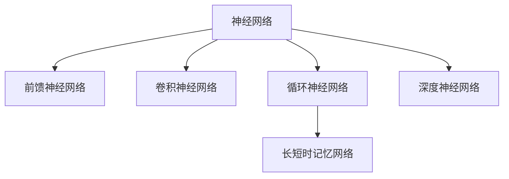

                 

## 1. 背景介绍

### 1.1 问题由来
机器学习，作为人工智能（AI）的核心技术之一，在过去几十年间取得了飞速发展。从最初的感知机模型，到线性回归、决策树、支持向量机等传统模型，再到深度学习及其核心模型——神经网络（Neural Network）的崛起，机器学习经历了多次范式转变。

当前，深度学习在计算机视觉、语音识别、自然语言处理等领域已达历史最佳表现，但其理论基础仍然薄弱，使得人们对于深度学习模型的解释性和可理解性存在疑虑。同时，尽管神经网络在诸如图像识别、语音识别等任务上表现优异，但在诸如解释性、计算资源、泛化能力等方面仍存在一定局限。

### 1.2 问题核心关键点
因此，如何构建一种既能充分利用深度学习优势，又能增强其解释性和计算效率的机器学习新范式，成为当前研究的热点。这一挑战催生了神经网络在计算模型和算法上的多个重大突破，如卷积神经网络（CNN）、循环神经网络（RNN）、长短时记忆网络（LSTM）、注意力机制（Attention Mechanism）等。

本文将深入探讨神经网络的核心概念、关键算法及其实际应用，同时分析其优缺点和未来发展趋势，为读者提供全面且深刻的理解。

## 2. 核心概念与联系

### 2.1 核心概念概述

为更好地理解神经网络，本节将介绍几个密切相关的核心概念：

- 神经网络（Neural Network）：一种基于生物神经系统的计算模型，通过多层非线性映射实现复杂非线性关系的学习。
- 前馈神经网络（Feedforward Neural Network, FNN）：最基础的神经网络结构，每层神经元仅与下一层神经元相连，信息单向传递。
- 卷积神经网络（Convolutional Neural Network, CNN）：主要用于图像处理任务，通过卷积层、池化层提取特征。
- 循环神经网络（Recurrent Neural Network, RNN）：适合处理序列数据，通过反馈连接，能够保持状态记忆。
- 长短时记忆网络（Long Short-Term Memory, LSTM）：一种RNN的变体，通过门控机制解决长期依赖问题。
- 深度神经网络（Deep Neural Network, DNN）：包含多个隐藏层的神经网络，能处理更复杂的关系。

这些概念之间的逻辑关系可以通过以下Mermaid流程图来展示：



这个流程图展示出神经网络的基本结构和主要的变种。

## 3. 核心算法原理 & 具体操作步骤

### 3.1 算法原理概述

神经网络的核心思想是通过多层非线性变换，将输入数据映射到输出空间，从而实现复杂的模式识别和预测。其基本结构由输入层、多个隐藏层和输出层组成，每个神经元接收上一层的输出作为输入，计算加权和后进行非线性变换。通过反向传播算法（Backpropagation）更新网络参数，使得误差最小化。

数学上，神经网络可以形式化为：

$$
\hat{y} = f_W(f_{W_2}(f_{W_1}(x)))
$$

其中，$f_W$ 为带权重 $W$ 的非线性激活函数，$x$ 为输入向量，$\hat{y}$ 为输出预测。隐藏层由多个 $f_{W_i}$ 组成，每个层的学习过程由权重 $W_i$ 和激活函数决定。

### 3.2 算法步骤详解

神经网络模型的训练过程大致包括以下几个关键步骤：

**Step 1: 数据预处理**

- 数据清洗：去除异常值、缺失值，处理重复数据。
- 数据归一化：将数据缩放到相同的尺度，提高模型训练效率。
- 数据划分：将数据集划分为训练集、验证集和测试集。

**Step 2: 构建模型**

- 选择合适的神经网络结构：如CNN、RNN、LSTM等。
- 定义模型层：包括输入层、隐藏层、输出层和激活函数。
- 初始化模型参数：如权重 $W$、偏置 $b$ 等。

**Step 3: 前向传播**

- 输入样本 $x$ 进入模型，经过层级非线性变换，生成输出 $\hat{y}$。
- 计算损失函数 $L(\hat{y},y)$，衡量模型预测与真实标签的差异。

**Step 4: 反向传播**

- 计算梯度 $\nabla_WL$，反向传播误差至模型各参数。
- 更新模型参数 $W$，如使用梯度下降算法 $W \leftarrow W-\eta \nabla_WL$。

**Step 5: 模型评估**

- 在验证集上评估模型性能，如精度、召回率、F1-score等。
- 调整模型超参数，如学习率、批量大小、迭代次数等，进行模型优化。

**Step 6: 模型测试**

- 在测试集上测试模型性能，确保模型泛化能力。
- 应用模型进行实际预测，如分类、回归、生成等。

### 3.3 算法优缺点

神经网络具有以下优点：

- 非线性能力：通过多层非线性变换，能处理复杂的非线性关系。
- 适应性强：能适应不同类型的数据和任务。
- 自动特征提取：通过神经元学习，自动从数据中提取特征。

但神经网络也存在一些缺点：

- 计算量大：需要大量的计算资源和存储空间。
- 解释性差：由于模型复杂，难以理解其内部工作机制。
- 过拟合风险：在训练集上表现优异，但在测试集上泛化能力可能不足。

### 3.4 算法应用领域

神经网络的应用领域非常广泛，涉及计算机视觉、自然语言处理、语音识别、推荐系统、金融预测等众多行业。以下是几个典型应用场景：

- 计算机视觉：如图像分类、目标检测、人脸识别等。
- 自然语言处理：如机器翻译、情感分析、文本生成等。
- 语音识别：如自动语音识别、语音合成等。
- 推荐系统：如协同过滤、内容推荐等。
- 金融预测：如股票价格预测、风险评估等。

## 4. 数学模型和公式 & 详细讲解 & 举例说明

### 4.1 数学模型构建

神经网络的基本模型可以描述为：

$$
y = \sum_i w_i x_i + b
$$

其中 $x_i$ 为输入特征向量，$w_i$ 为权重向量，$b$ 为偏置，$y$ 为输出。

在实际应用中，通常使用带激活函数的神经元，将输入线性变换后进行非线性映射，以提高模型的表达能力。例如，使用 sigmoid 激活函数：

$$
\sigma(z) = \frac{1}{1+\exp(-z)}
$$

此时，神经元输出为：

$$
y = \sigma(\sum_i w_i x_i + b)
$$

更复杂的模型可以使用多个隐藏层和不同的激活函数，例如ReLU、tanh等，以增强模型的非线性表达能力。

### 4.2 公式推导过程

以最简单的单层神经网络为例，其前向传播过程如下：

$$
z^{(l)} = w^{(l)} x^{(l-1)} + b^{(l)}
$$

其中 $z^{(l)}$ 为层 $l$ 的输入，$x^{(l-1)}$ 为前一层输出，$w^{(l)}$ 和 $b^{(l)}$ 为层 $l$ 的权重和偏置。

将上式带入激活函数，得到：

$$
y^{(l)} = \sigma(z^{(l)})
$$

最后，将隐含层的输出作为下一层的输入，不断迭代，得到最终输出：

$$
y^{(L)} = \sigma(z^{(L)})
$$

其中 $L$ 为总层数。

### 4.3 案例分析与讲解

以手写数字识别为例，我们可以使用卷积神经网络（CNN）构建一个简单的模型，步骤如下：

1. **数据预处理**：加载MNIST手写数字数据集，对图像进行归一化处理。
2. **构建模型**：定义一个包含两个卷积层、两个池化层和两个全连接层的CNN模型。
3. **前向传播**：将输入图像送入模型，经过卷积、池化、全连接层计算，得到输出。
4. **反向传播**：计算输出与真实标签的误差，反向传播更新网络参数。
5. **模型评估**：在验证集上评估模型精度，调整模型超参数。
6. **模型测试**：在测试集上测试模型，应用模型进行手写数字识别。

## 5. 项目实践：代码实例和详细解释说明

### 5.1 开发环境搭建

在进行神经网络实践前，我们需要准备好开发环境。以下是使用Python进行Keras开发的环境配置流程：

1. 安装Anaconda：从官网下载并安装Anaconda，用于创建独立的Python环境。

2. 创建并激活虚拟环境：
```bash
conda create -n keras-env python=3.8 
conda activate keras-env
```

3. 安装Keras：根据版本要求，使用pip安装Keras：
```bash
pip install keras
```

4. 安装TensorFlow或Theano：Keras支持这两种深度学习库，用于模型的训练和推理。
```bash
pip install tensorflow==2.4 # 或 theano
```

5. 安装各类工具包：
```bash
pip install numpy pandas scikit-learn matplotlib tqdm jupyter notebook ipython
```

完成上述步骤后，即可在`keras-env`环境中开始神经网络模型的构建和训练。

### 5.2 源代码详细实现

下面以手写数字识别为例，给出使用Keras构建卷积神经网络的代码实现。

首先，定义数据加载函数：

```python
from keras.datasets import mnist
from keras.utils import to_categorical

# 加载MNIST数据集
(x_train, y_train), (x_test, y_test) = mnist.load_data()

# 将图像数据归一化，并转换为一维数组
x_train = x_train.reshape((-1, 28*28))
x_test = x_test.reshape((-1, 28*28))

# 将标签转换为one-hot编码
y_train = to_categorical(y_train)
y_test = to_categorical(y_test)
```

然后，定义卷积神经网络模型：

```python
from keras.models import Sequential
from keras.layers import Conv2D, MaxPooling2D, Flatten, Dense

model = Sequential([
    Conv2D(32, kernel_size=(3, 3), activation='relu', input_shape=(28*28, 1)),
    MaxPooling2D(pool_size=(2, 2)),
    Conv2D(64, kernel_size=(3, 3), activation='relu'),
    MaxPooling2D(pool_size=(2, 2)),
    Flatten(),
    Dense(10, activation='softmax')
])

# 编译模型，设置优化器和损失函数
model.compile(loss='categorical_crossentropy', optimizer='adam', metrics=['accuracy'])
```

接着，定义训练和评估函数：

```python
from keras.utils import to_categorical

def train_model(model, x_train, y_train, batch_size, epochs):
    model.fit(x_train, y_train, batch_size=batch_size, epochs=epochs, validation_split=0.2)
    return model

def evaluate_model(model, x_test, y_test):
    loss, acc = model.evaluate(x_test, y_test)
    print('Test Loss:', loss)
    print('Test Accuracy:', acc)
```

最后，启动训练流程并在测试集上评估：

```python
batch_size = 128
epochs = 10

model = train_model(model, x_train, y_train, batch_size, epochs)
evaluate_model(model, x_test, y_test)
```

以上就是使用Keras对MNIST手写数字识别数据集进行卷积神经网络模型微调的完整代码实现。可以看到，Keras封装了神经网络模型的构建和训练过程，使得模型开发变得简单易用。

### 5.3 代码解读与分析

让我们再详细解读一下关键代码的实现细节：

**数据加载函数**：
- 加载MNIST数据集，将图像数据转换为一维数组，并转换为one-hot编码。

**模型定义**：
- 定义一个包含两个卷积层、两个池化层和两个全连接层的卷积神经网络模型。
- 编译模型，设置优化器、损失函数和评估指标。

**训练函数**：
- 使用Keras的`fit`方法训练模型，设置批量大小和迭代轮数。

**评估函数**：
- 使用Keras的`evaluate`方法在测试集上评估模型性能，输出测试集的损失和准确率。

**训练流程**：
- 定义批量大小和迭代轮数，进行模型训练。
- 在测试集上评估模型性能，输出测试集的损失和准确率。

可以看到，Keras通过其简洁易用的API，使得神经网络的构建和训练变得非常简便。开发者可以专注于模型结构和超参数的调优，而不必过多关注底层实现细节。

## 6. 实际应用场景

### 6.1 智慧医疗

神经网络在医疗领域有广泛应用，如医学影像分析、疾病预测、个性化诊疗等。例如，可以使用卷积神经网络对CT图像进行分类，提取病变区域并进行精准定位；使用循环神经网络对患者电子病历进行分析，预测患病风险；使用生成对抗网络（GAN）生成虚拟手术场景，帮助医生进行手术演练和决策。

### 6.2 智能交通

在智能交通领域，神经网络可以用于交通流量预测、车辆自动驾驶、道路状况识别等。例如，使用循环神经网络对历史交通数据进行分析，预测未来的交通流量；使用卷积神经网络对摄像头图像进行实时分析，识别交通信号和行人；使用生成对抗网络生成虚拟交通场景，进行自动驾驶算法测试和训练。

### 6.3 智能制造

在智能制造领域，神经网络可以用于生产线优化、质量检测、设备维护等。例如，使用卷积神经网络对生产过程中的图像数据进行分析，检测产品缺陷；使用循环神经网络对设备运行数据进行分析，预测设备故障；使用生成对抗网络生成虚拟生产场景，进行机器人训练和仿真。

### 6.4 未来应用展望

随着神经网络技术的不断进步，其在更多领域的应用前景将更加广阔：

1. 实时推荐：神经网络可以实时分析用户行为数据，生成个性化的产品推荐，提升用户体验。
2. 社交网络分析：神经网络可以分析社交网络数据，预测用户行为，提升社交平台的用户粘性。
3. 金融风险预测：神经网络可以分析市场数据，预测股票价格和金融风险，辅助投资者决策。
4. 智能家居：神经网络可以分析家居环境数据，优化能源使用，提升生活质量。
5. 城市管理：神经网络可以分析城市数据，优化交通管理，提升城市运行效率。

## 7. 工具和资源推荐

### 7.1 学习资源推荐

为了帮助开发者系统掌握神经网络的理论基础和实践技巧，这里推荐一些优质的学习资源：

1. 《深度学习》系列书籍：由深度学习领域专家撰写，系统介绍深度学习的基本概念和算法原理。
2. 《神经网络与深度学习》在线课程：由斯坦福大学吴恩达教授主讲，涵盖神经网络的基础和实践。
3. DeepLearning.ai课程：吴恩达教授和Andrew Ng等人联合创办的深度学习教育平台，提供从基础到高级的深度学习课程。
4. 《Hands-On Machine Learning with Scikit-Learn and TensorFlow》书籍：介绍如何使用Scikit-Learn和TensorFlow进行机器学习和深度学习开发。
5. Kaggle竞赛：Kaggle是数据科学竞赛平台，提供大量的数据集和竞赛题目，帮助你通过实践提升深度学习技能。

通过对这些资源的学习实践，相信你一定能够快速掌握神经网络的技术精髓，并用于解决实际的机器学习问题。

### 7.2 开发工具推荐

高效的开发离不开优秀的工具支持。以下是几款用于神经网络开发和训练的常用工具：

1. Keras：Keras是一个高层次的深度学习库，具有简单易用的API，适合快速迭代研究。
2. TensorFlow：由Google主导开发的深度学习框架，生产部署方便，适合大规模工程应用。
3. PyTorch：由Facebook开发的深度学习框架，灵活动态的计算图，适合快速研究和实验。
4. MXNet：由亚马逊开发的高效分布式深度学习框架，适合大规模分布式计算。
5. Scikit-Learn：用于传统机器学习算法和数据预处理的Python库。
6. Numpy：用于高效数组计算的Python库，是机器学习中常用的数学计算工具。

合理利用这些工具，可以显著提升神经网络的开发效率，加快创新迭代的步伐。

### 7.3 相关论文推荐

神经网络技术的发展源于学界的持续研究。以下是几篇奠基性的相关论文，推荐阅读：

1. A New Method for Pattern Recognition with Back-Propagation Networks：提出了反向传播算法，奠定了深度学习的基础。
2. ImageNet Classification with Deep Convolutional Neural Networks：展示了卷积神经网络在图像分类任务上的强大表现。
3. Rethinking the Inception Architecture for Computer Vision：提出Inception模块，提高了卷积神经网络的计算效率。
4. Long Short-Term Memory：提出LSTM网络，解决了传统RNN的长期依赖问题。
5. Generative Adversarial Nets：提出GAN，实现了生成对抗网络，开辟了生成模型的新领域。
6. Deep Residual Learning for Image Recognition：提出残差网络，解决了深层网络训练中的梯度消失问题。

这些论文代表了大神经网络的发展脉络。通过学习这些前沿成果，可以帮助研究者把握学科前进方向，激发更多的创新灵感。

## 8. 总结：未来发展趋势与挑战

### 8.1 总结

本文对神经网络的核心概念、关键算法及其实际应用进行了全面系统的介绍。首先阐述了神经网络的发展背景和应用前景，明确了其在复杂关系建模和智能推理方面的独特价值。其次，从原理到实践，详细讲解了神经网络的数学模型和训练步骤，给出了神经网络任务开发的完整代码实例。同时，本文还探讨了神经网络在多个行业领域的应用前景，展示了神经网络技术的巨大潜力。此外，本文精选了神经网络的各类学习资源，力求为读者提供全方位的技术指引。

通过本文的系统梳理，可以看到，神经网络作为机器学习的重要范式，在计算机视觉、自然语言处理、智能交通等领域展现了强大的应用能力。未来，伴随神经网络技术的持续演进，其在更多领域的智能化应用将更加广泛，深刻影响人类的生产生活方式。

### 8.2 未来发展趋势

展望未来，神经网络将呈现以下几个发展趋势：

1. 模型规模持续增大。随着算力成本的下降和数据规模的扩张，神经网络模型的参数量还将持续增长。超大规模神经网络蕴含的丰富表示，有望支撑更加复杂多变的应用场景。
2. 模型结构多样化和优化。神经网络将融合更多的结构优化技术，如残差连接、卷积置换、多分支等，以提高模型的计算效率和泛化能力。
3. 深度强化学习的兴起。深度强化学习结合神经网络和强化学习，有望解决更加复杂、动态的决策问题。
4. 联邦学习和边缘计算的普及。通过分布式训练和边缘计算，神经网络将更加适应实时化、低延迟的应用场景。
5. 模型压缩和加速技术的发展。神经网络压缩、量化、稀疏化等技术，将进一步提升模型计算效率，优化资源使用。

这些趋势凸显了神经网络技术的广阔前景。这些方向的探索发展，必将进一步提升神经网络的性能和应用范围，为构建人机协同的智能系统铺平道路。

### 8.3 面临的挑战

尽管神经网络技术已经取得了瞩目成就，但在迈向更加智能化、普适化应用的过程中，它仍面临着诸多挑战：

1. 模型可解释性不足。由于神经网络的复杂性，难以理解其内部工作机制和决策逻辑。如何赋予神经网络更强的可解释性，将是重要的研究方向。
2. 计算资源需求高。大规模神经网络的训练和推理，需要高昂的计算资源和存储空间。如何降低计算复杂度，优化模型结构，提高计算效率，将是重要的技术突破。
3. 对抗攻击风险。神经网络模型容易受到对抗样本的攻击，导致模型输出错误。如何提高模型的鲁棒性，确保其在各种攻击下的稳定性和安全性，将是重要的研究课题。
4. 数据隐私保护。神经网络模型的训练通常依赖大量敏感数据，如何在保护数据隐私的前提下进行模型训练，将是重要的技术挑战。
5. 伦理和法律问题。神经网络模型可能带来潜在的伦理和法律问题，如偏见、歧视、隐私泄露等。如何在设计和使用过程中考虑这些因素，确保模型的公平性和透明性，将是重要的社会责任。

正视神经网络面临的这些挑战，积极应对并寻求突破，将使神经网络技术走向成熟的必由之路。相信随着学界和产业界的共同努力，这些挑战终将一一被克服，神经网络技术必将在构建智能社会中扮演越来越重要的角色。

### 8.4 研究展望

面对神经网络面临的诸多挑战，未来的研究需要在以下几个方面寻求新的突破：

1. 探索深度学习的新范式。如深度强化学习、对抗学习、自监督学习等，提高神经网络的决策能力和鲁棒性。
2. 研究深度学习与传统机器学习的融合。结合深度学习和传统机器学习的优点，构建更加强大和灵活的智能系统。
3. 引入更多先验知识。将符号化的先验知识，如知识图谱、逻辑规则等，与神经网络模型进行巧妙融合，增强模型的知识整合能力。
4. 提高模型的可解释性。引入可解释性技术，如特征可视化、层级解释等，帮助理解神经网络的决策过程。
5. 加强数据隐私保护。研究隐私保护技术，如差分隐私、联邦学习等，保护数据隐私的同时，确保模型的性能。

这些研究方向将引领神经网络技术迈向更高的台阶，为构建安全、可靠、可解释、可控的智能系统铺平道路。面向未来，神经网络技术还需要与其他人工智能技术进行更深入的融合，如知识表示、因果推理、强化学习等，多路径协同发力，共同推动智能技术的进步。只有勇于创新、敢于突破，才能不断拓展神经网络技术的边界，让智能技术更好地造福人类社会。

## 9. 附录：常见问题与解答

**Q1: 什么是卷积神经网络？**

A: 卷积神经网络（Convolutional Neural Network, CNN）是一种主要用于图像处理任务的神经网络模型。其核心思想是通过卷积和池化操作，提取图像的局部特征，并通过多层非线性变换进行分类或识别。

**Q2: 循环神经网络和长短时记忆网络有什么区别？**

A: 循环神经网络（Recurrent Neural Network, RNN）通过反馈连接，能够保持状态记忆，适合处理序列数据。而长短时记忆网络（Long Short-Term Memory, LSTM）是RNN的一种变体，通过门控机制解决长期依赖问题，更适合处理长序列数据。

**Q3: 如何优化神经网络的计算效率？**

A: 神经网络的计算效率可以通过模型压缩、量化加速、稀疏化存储等方法进行优化。模型压缩技术包括剪枝、量化、融合等，可以减小模型尺寸，提高计算效率。量化加速技术将浮点模型转为定点模型，减小内存占用，提高计算速度。稀疏化存储技术通过减少参数个数，优化模型存储空间。

**Q4: 神经网络在图像识别任务上的表现为何优于传统机器学习模型？**

A: 神经网络通过多层非线性变换，能够自动提取图像的高级特征，而传统机器学习模型需要手动设计特征提取器。神经网络能够自动学习并提取更丰富的特征，从而提高图像识别的准确率。

**Q5: 神经网络的训练过程为何需要反向传播算法？**

A: 反向传播算法通过计算模型输出与真实标签之间的误差，并将误差反向传播到模型各参数，更新模型权重，使得模型输出逼近真实标签。这是神经网络训练过程中不可或缺的一环，能够优化模型性能，提高预测准确率。

---

作者：禅与计算机程序设计艺术 / Zen and the Art of Computer Programming

