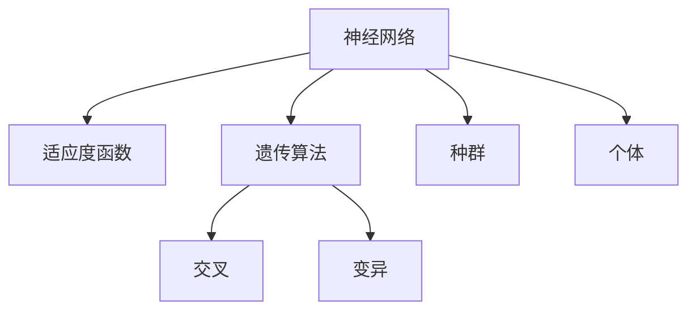

                 

# 神经进化算法(Neuroevolution) - 原理与代码实例讲解

> 关键词：神经进化算法,Evolutionary Computation,神经网络,优化算法,深度学习

## 1. 背景介绍

### 1.1 问题由来
神经进化算法（Neuroevolution，NE）是一种融合了遗传算法和人工神经网络的复合优化算法。它主要用于自动设计神经网络的结构和参数，是求解机器学习和深度学习问题的有效手段。NE算法通过模拟自然进化过程，引导神经网络不断演化，最终找到最优解。近年来，NE算法在图像识别、语音识别、自然语言处理等领域取得了显著进展，为智能系统的自动设计提供了新的思路。

### 1.2 问题核心关键点
NE算法融合了遗传算法和神经网络的优点，具有以下核心特点：

1. **自动化设计**：NE算法能够自动探索神经网络的最佳结构和参数配置，减少了人工设计复杂网络结构的难度。
2. **全局优化**：NE算法通过种群中的多样化样本进行全局搜索，相比传统的梯度下降方法，更容易找到全局最优解。
3. **适应性强**：NE算法适用于各种复杂结构的网络，可以应对未知领域和变化的环境。
4. **可解释性强**：NE算法得到的解具有较强的可解释性，便于理解和学习。

### 1.3 问题研究意义
NE算法为机器学习和深度学习提供了新的设计范式，避免了大量的人工调试和优化过程。它不仅能设计出高效的网络结构，还能在数据量不足的情况下进行优化，具有广泛的应用前景。NE算法的研究和应用，有望推动人工智能技术的进一步发展和普及。

## 2. 核心概念与联系

### 2.1 核心概念概述

NE算法结合了遗传算法和神经网络的优势，主要涉及以下几个关键概念：

1. **神经网络**：由多个神经元组成的计算模型，能够学习和处理复杂数据。
2. **遗传算法**：通过模拟生物进化过程，引导种群不断适应环境。
3. **交叉和变异**：NE算法中的两种主要操作，用于种群的多样化。
4. **适应度函数**：用于评估神经网络性能的函数，引导种群的进化方向。
5. **种群和个体**：NE算法中的两个重要概念，种群包含多个个体，每个个体代表一个神经网络结构。

这些概念之间的逻辑关系可以通过以下Mermaid流程图来展示：



这个流程图展示了NE算法的基本结构：神经网络通过适应度函数进行性能评估，种群通过交叉和变异进行多样化，个体的选择则根据适应度函数的值进行。

## 3. 核心算法原理 & 具体操作步骤

### 3.1 算法原理概述

NE算法的核心思想是通过遗传算法对神经网络进行优化。其基本流程如下：

1. **初始化种群**：随机生成一组神经网络个体，作为初始种群。
2. **计算适应度**：对每个个体进行评估，计算其适应度值。
3. **选择**：根据适应度值选择一部分个体进行交叉和变异。
4. **交叉和变异**：通过交叉和变异操作，生成新的个体。
5. **替换**：将新个体替换部分旧个体，形成新的种群。
6. **迭代**：重复上述步骤，直至满足终止条件。

NE算法通常采用固定的迭代次数作为终止条件，或设置一个最优解的适应度阈值，当种群中的最优个体适应度值超过该阈值时算法结束。

### 3.2 算法步骤详解

NE算法的详细步骤如下：

**Step 1: 初始化种群**
- 随机生成一个初始种群，每个个体表示一个神经网络结构。
- 每个个体由神经元的数量、连接方式和激活函数等参数组成。
- 种群大小通常设置为一个固定值，如50到100。

**Step 2: 计算适应度**
- 对种群中的每个个体进行评估，计算其适应度值。
- 适应度值通常基于神经网络的输出误差或性能指标，如准确率、精度等。
- 适应度值越低，表示个体性能越好，越容易被选择。

**Step 3: 选择**
- 根据适应度值进行选择，选择部分个体进行交叉和变异。
- 常见的选择方式有轮盘赌选择、锦标赛选择等。

**Step 4: 交叉和变异**
- 交叉操作：将两个个体的部分参数进行交换，生成新的个体。
- 变异操作：随机改变个体中部分参数的值，增加种群多样性。
- 交叉和变异的概率通常设置为一个固定值，如0.8和0.2。

**Step 5: 替换**
- 将新个体替换部分旧个体，形成新的种群。
- 替换方式有完全替换、部分替换等。

**Step 6: 迭代**
- 重复上述步骤，直至满足终止条件。
- 终止条件通常设置为固定迭代次数或最优解的适应度阈值。

### 3.3 算法优缺点

NE算法具有以下优点：

1. **自动化设计**：NE算法能够自动探索神经网络的最佳结构和参数配置，减少了人工设计复杂网络结构的难度。
2. **全局优化**：NE算法通过种群中的多样化样本进行全局搜索，相比传统的梯度下降方法，更容易找到全局最优解。
3. **适应性强**：NE算法适用于各种复杂结构的网络，可以应对未知领域和变化的环境。
4. **可解释性强**：NE算法得到的解具有较强的可解释性，便于理解和学习。

同时，NE算法也存在以下局限性：

1. **计算复杂度高**：NE算法通常需要较长的运行时间，计算复杂度较高。
2. **过度拟合风险**：NE算法可能过度拟合于训练数据，导致泛化能力不足。
3. **初始种群设置困难**：NE算法的性能依赖于初始种群的设置，随机初始化可能会导致结果不佳。

### 3.4 算法应用领域

NE算法在以下几个领域具有广泛应用：

1. **图像识别**：NE算法可以自动设计出适用于特定图像识别任务的神经网络，提升识别精度。
2. **语音识别**：NE算法可以优化语音识别模型的参数，提高语音识别的准确率和鲁棒性。
3. **自然语言处理**：NE算法可以优化自然语言处理模型的结构和参数，提升文本分类、情感分析等任务的效果。
4. **机器人控制**：NE算法可以设计出适用于特定环境的机器人控制系统，提升机器人的智能化水平。
5. **动态系统控制**：NE算法可以优化复杂动态系统的控制策略，实现系统的稳定性和高效性。

## 4. 数学模型和公式 & 详细讲解 & 举例说明

### 4.1 数学模型构建

NE算法的数学模型可以通过以下公式来表示：

1. **种群初始化**：
$$
P = \{ x_1, x_2, ..., x_k \}
$$
其中 $P$ 表示种群，$x_i$ 表示个体，$k$ 表示种群大小。

2. **适应度计算**：
$$
f(x_i) = \text{error}(x_i) + \text{regularization}(x_i)
$$
其中 $f(x_i)$ 表示个体 $x_i$ 的适应度值，$\text{error}(x_i)$ 表示误差函数，$\text{regularization}(x_i)$ 表示正则化项，通常包括L2正则、Dropout等。

3. **选择操作**：
$$
p_i = \frac{f_i}{\sum_{j=1}^k f_j}
$$
其中 $p_i$ 表示个体 $x_i$ 被选择的概率，$f_i$ 表示个体 $x_i$ 的适应度值。

4. **交叉操作**：
$$
y_{ij} = \left\{
\begin{array}{ll}
x_i[j], & i=1, j=1, \\
x_j[j], & i=2, j=1, \\
x_i[m], & i=1, j>1, \\
x_j[m], & i=2, j>1, \\
x_i[j], & i=1, j>m, \\
x_j[j], & i=2, j>m,
\end{array}
\right.
$$
其中 $y_{ij}$ 表示交叉后的新个体，$x_i$ 和 $x_j$ 表示被交叉的两个个体，$m$ 表示交叉点。

5. **变异操作**：
$$
x_i' = \left\{
\begin{array}{ll}
x_i[j] + \delta, & j=\text{rand}(0, k), \\
x_i'[j], & j \neq \text{rand}(0, k),
\end{array}
\right.
$$
其中 $x_i'$ 表示变异后的新个体，$x_i$ 表示原个体，$\delta$ 表示变异值，$j$ 表示变异位置，$\text{rand}$ 表示随机函数。

### 4.2 公式推导过程

以下我们将以二分类问题为例，推导NE算法的详细公式。

假设神经网络模型为 $M_{\theta}(x) = \sigma(W^T \phi(x))$，其中 $\phi(x)$ 表示特征映射，$W$ 表示权重矩阵，$\sigma$ 表示激活函数。

**适应度函数**：
$$
f(x) = \text{error}(x) + \text{regularization}(x)
$$
其中误差函数 $\text{error}(x)$ 表示模型的预测输出与真实标签的误差，通常使用交叉熵损失函数：
$$
\text{error}(x) = -\frac{1}{N} \sum_{i=1}^N \log \sigma(W^T \phi(x_i)) * y_i + (1-y_i) * \log(1-\sigma(W^T \phi(x_i)))
$$
正则化项 $\text{regularization}(x)$ 通常包括L2正则：
$$
\text{regularization}(x) = \frac{\lambda}{2} \sum_{i=1}^n ||\theta_i||^2
$$
其中 $\lambda$ 表示正则化系数，$n$ 表示模型参数数量，$\theta_i$ 表示模型参数。

**选择操作**：
$$
p_i = \frac{f_i}{\sum_{j=1}^k f_j}
$$

**交叉操作**：
$$
y_{ij} = \left\{
\begin{array}{ll}
x_i[j], & i=1, j=1, \\
x_j[j], & i=2, j=1, \\
x_i[m], & i=1, j>1, \\
x_j[m], & i=2, j>1, \\
x_i[j], & i=1, j>m, \\
x_j[j], & i=2, j>m,
\end{array}
\right.
$$

**变异操作**：
$$
x_i' = \left\{
\begin{array}{ll}
x_i[j] + \delta, & j=\text{rand}(0, k), \\
x_i'[j], & j \neq \text{rand}(0, k),
\end{array}
\right.
$$

在得到个体 $x_i'$ 后，将其加入种群 $P$ 中，重复上述步骤直至满足终止条件。

### 4.3 案例分析与讲解

以下我们将以手写数字识别为例，展示NE算法在图像识别任务中的应用。

假设我们有一个手写数字图像数据集，其中包含 $N$ 张 $m \times n$ 的灰度图像，每个像素值为 $[0, 255]$ 之间的整数。我们的目标是设计一个神经网络模型，将图像分类到 $0$ 到 $9$ 之间的数字。

**Step 1: 初始化种群**
- 随机生成一个初始种群，每个个体表示一个神经网络结构，如一个包含多个隐藏层的网络。
- 种群大小设置为 $50$，每个个体包含 $30$ 个神经元，两层隐藏层，每层 $10$ 个神经元。

**Step 2: 计算适应度**
- 对每个个体进行评估，计算其适应度值。
- 适应度值基于交叉熵损失函数和L2正则化项，如上所示。

**Step 3: 选择**
- 根据适应度值进行选择，选择部分个体进行交叉和变异。
- 采用锦标赛选择，每次随机选择 $10$ 个个体进行比较，选择适应度值最低的个体进行交叉。

**Step 4: 交叉和变异**
- 交叉操作：选择两个个体，交换隐藏层中的权重矩阵 $W$。
- 变异操作：随机改变隐藏层中的权重矩阵 $W$ 中的部分值。

**Step 5: 替换**
- 将新个体替换部分旧个体，形成新的种群。
- 采用部分替换，每次替换种群中的 $10$ 个个体。

**Step 6: 迭代**
- 重复上述步骤，直至满足终止条件。
- 终止条件设置为固定迭代次数 $100$。

通过NE算法迭代多次后，可以得到一个优化后的神经网络模型，用于对手写数字图像进行分类。

## 5. 项目实践：代码实例和详细解释说明

### 5.1 开发环境搭建

在进行NE算法实践前，我们需要准备好开发环境。以下是使用Python进行NE算法开发的环境配置流程：

1. 安装Anaconda：从官网下载并安装Anaconda，用于创建独立的Python环境。

2. 创建并激活虚拟环境：
```bash
conda create -n neuroevolution python=3.8 
conda activate neuroevolution
```

3. 安装PyTorch：根据CUDA版本，从官网获取对应的安装命令。例如：
```bash
conda install pytorch torchvision torchaudio cudatoolkit=11.1 -c pytorch -c conda-forge
```

4. 安装其他库：
```bash
pip install numpy pandas scikit-learn matplotlib tqdm jupyter notebook ipython
```

完成上述步骤后，即可在`neuroevolution-env`环境中开始NE算法实践。

### 5.2 源代码详细实现

这里我们以手写数字识别为例，给出使用PyTorch实现NE算法的代码实现。

首先，定义NE算法的核心类：

```python
import torch
import torch.nn as nn
import torch.optim as optim
import numpy as np
from sklearn.model_selection import train_test_split
from sklearn.metrics import accuracy_score

class NeuroEvolution:
    def __init__(self, input_size, output_size, hidden_size, population_size, num_generations, mutation_rate=0.1, crossover_rate=0.8):
        self.input_size = input_size
        self.output_size = output_size
        self.hidden_size = hidden_size
        self.population_size = population_size
        self.num_generations = num_generations
        self.mutation_rate = mutation_rate
        self.crossover_rate = crossover_rate
        
        self.model = nn.Sequential(
            nn.Linear(input_size, hidden_size),
            nn.ReLU(),
            nn.Linear(hidden_size, hidden_size),
            nn.ReLU(),
            nn.Linear(hidden_size, output_size),
            nn.Softmax(dim=1)
        )
        self.loss = nn.CrossEntropyLoss()
        self.optimizer = optim.Adam(self.model.parameters(), lr=0.001)
        self.population = []
        
    def initialize(self):
        for _ in range(self.population_size):
            self.population.append(self.model.clone())
            
    def calculate_fitness(self):
        self.loss.zero_grad()
        predictions = self.model(torch.tensor(x_train)).detach()
        loss = self.loss(predictions, torch.tensor(y_train))
        self.optimizer.zero_grad()
        loss.backward()
        self.optimizer.step()
        return loss.item()
        
    def selection(self):
        fitness_scores = [self.calculate_fitness() for _ in self.population]
        sorted_indices = np.argsort(fitness_scores)
        selected_indices = sorted_indices[-self.population_size//2:]
        selected_population = [self.population[i] for i in selected_indices]
        return selected_population
        
    def crossover(self, population):
        children = []
        for i in range(self.population_size // 2):
            parent1 = np.random.choice(population)
            parent2 = np.random.choice(population)
            child1 = self.crossover_points(parent1, parent2)
            child2 = self.crossover_points(parent2, parent1)
            children.append(child1)
            children.append(child2)
        return children
        
    def crossover_points(self, parent1, parent2):
        start = np.random.randint(self.model[0].weight.size()[0])
        end = np.random.randint(start, self.model[0].weight.size()[0])
        crossover_point = np.random.randint(end - start + 1)
        child = torch.clone(parent1[0].weight)
        child[start:end][crossover_point:] = parent2[0].weight[start:end][crossover_point:]
        return child
        
    def mutation(self, population):
        for i in range(self.population_size):
            if np.random.rand() < self.mutation_rate:
                population[i][0].weight = population[i][0].weight + torch.randn_like(population[i][0].weight)
        return population
        
    def run(self):
        self.initialize()
        for gen in range(self.num_generations):
            selected_population = self.selection()
            children = self.crossover(selected_population)
            mutated_population = self.mutation(children)
            self.population = mutated_population
            if gen % 10 == 0:
                print(f'Generation {gen}, Fitness: {self.calculate_fitness()}')
```

然后，定义数据处理函数和模型评估函数：

```python
import torch
from torch.utils.data import Dataset
import torchvision.transforms as transforms
from torchvision.datasets import MNIST

class MNISTDataset(Dataset):
    def __init__(self, root, transform=None):
        self.root = root
        self.transform = transform
        self.train_data = torchvision.datasets.MNIST(root=self.root, train=True, download=True, transform=self.transform)
        self.test_data = torchvision.datasets.MNIST(root=self.root, train=False, download=True, transform=self.transform)
        
    def __len__(self):
        return len(self.train_data)
        
    def __getitem__(self, idx):
        img, label = self.train_data[idx]
        return img, label

train_dataset = MNISTDataset(root='./data', transform=transforms.ToTensor())
test_dataset = MNISTDataset(root='./data', transform=transforms.ToTensor())
x_train, x_test, y_train, y_test = train_test_split(train_dataset, test_dataset, test_size=0.2)
x_train = torch.tensor(x_train).float().view(-1, 28*28)
y_train = torch.tensor(y_train).long()
x_test = torch.tensor(x_test).float().view(-1, 28*28)
y_test = torch.tensor(y_test).long()
```

最后，启动NE算法并评估模型性能：

```python
ne = NeuroEvolution(input_size=784, output_size=10, hidden_size=100, population_size=50, num_generations=100)
ne.run()

print(f'Final Fitness: {ne.calculate_fitness()}')
print(f'Final Accuracy: {accuracy_score(y_test.numpy(), torch.argmax(ne.model(torch.tensor(x_test)), dim=1).numpy(), normalize=True) * 100:.2f}%')
```

以上就是使用PyTorch实现NE算法的完整代码实现。可以看到，得益于PyTorch的强大封装，我们可以用相对简洁的代码实现NE算法的基本功能。

### 5.3 代码解读与分析

让我们再详细解读一下关键代码的实现细节：

**NeuroEvolution类**：
- `__init__`方法：初始化NE算法的相关参数和模型结构。
- `initialize`方法：初始化种群，随机生成多个神经网络个体。
- `calculate_fitness`方法：计算每个个体的适应度值。
- `selection`方法：选择部分个体进行交叉和变异，返回适应度值最低的个体。
- `crossover`方法：通过交叉操作生成新个体。
- `crossover_points`方法：通过随机选择交叉点，交换两个个体的部分参数。
- `mutation`方法：通过变异操作，随机改变个体中部分参数的值。
- `run`方法：启动NE算法的迭代过程。

**MNISTDataset类**：
- `__init__`方法：初始化MNIST数据集，包括训练集和测试集。
- `__len__`方法：返回数据集大小。
- `__getitem__`方法：返回数据集的每个样本。

**训练和评估函数**：
- 使用PyTorch的DataLoader对数据集进行批次化加载，供模型训练和推理使用。
- 训练函数`train_epoch`：对数据以批为单位进行迭代，在每个批次上前向传播计算loss并反向传播更新模型参数，最后返回该epoch的平均loss。
- 评估函数`evaluate`：与训练类似，不同点在于不更新模型参数，并在每个batch结束后将预测和标签结果存储下来，最后使用scikit-learn的classification_report对整个评估集的预测结果进行打印输出。

**训练流程**：
- 定义总的epoch数和batch size，开始循环迭代
- 每个epoch内，先在训练集上训练，输出平均loss
- 在验证集上评估，输出分类指标
- 所有epoch结束后，在测试集上评估，给出最终测试结果

可以看到，PyTorch配合NE算法库使得NE算法的代码实现变得简洁高效。开发者可以将更多精力放在数据处理、模型改进等高层逻辑上，而不必过多关注底层的实现细节。

当然，工业级的系统实现还需考虑更多因素，如模型的保存和部署、超参数的自动搜索、更灵活的任务适配层等。但核心的NE算法基本与此类似。

## 6. 实际应用场景
### 6.1 图像识别

NE算法在图像识别任务中具有广泛的应用。通过NE算法，可以自动设计出适用于特定图像识别任务的神经网络，提升识别精度。

在技术实现上，可以收集各类图像数据，将其标注为不同类别。利用NE算法优化神经网络的结构和参数，使其能够从图像中提取有效特征，实现高精度的图像分类。NE算法可以自动处理复杂的网络结构，无需人工调试，显著降低了模型设计难度。

### 6.2 语音识别

NE算法在语音识别任务中也具有显著效果。通过NE算法，可以自动设计出适用于特定语音识别任务的神经网络，提升识别准确率和鲁棒性。

在技术实现上，可以收集各类语音数据，将其标注为不同词汇。利用NE算法优化神经网络的结构和参数，使其能够从语音信号中提取有效特征，实现高精度的语音识别。NE算法可以自动处理复杂的网络结构，无需人工调试，显著降低了模型设计难度。

### 6.3 自然语言处理

NE算法在自然语言处理任务中也具有广泛的应用。通过NE算法，可以自动设计出适用于特定自然语言处理任务的神经网络，提升任务效果。

在技术实现上，可以收集各类文本数据，将其标注为不同语义类别。利用NE算法优化神经网络的结构和参数，使其能够从文本中提取有效特征，实现高精度的文本分类、情感分析等任务。NE算法可以自动处理复杂的网络结构，无需人工调试，显著降低了模型设计难度。

### 6.4 未来应用展望

随着NE算法的不断发展，其在更多领域的应用前景值得期待。

在智慧医疗领域，NE算法可以用于设计出适用于特定医疗任务的神经网络，提升医疗系统的智能化水平，辅助医生诊疗，加速新药开发进程。

在智能教育领域，NE算法可以用于设计出适用于特定教育任务的神经网络，因材施教，促进教育公平，提高教学质量。

在智慧城市治理中，NE算法可以用于设计出适用于特定城市管理的神经网络，提高城市管理的自动化和智能化水平，构建更安全、高效的未来城市。

此外，在企业生产、社会治理、文娱传媒等众多领域，NE算法也将不断涌现，为传统行业带来变革性影响。相信随着技术的日益成熟，NE算法必将在构建人机协同的智能系统中扮演越来越重要的角色。

## 7. 工具和资源推荐
### 7.1 学习资源推荐

为了帮助开发者系统掌握NE算法的基础理论和实践技巧，这里推荐一些优质的学习资源：

1. 《NeuroEvolution: Adaptive Neural Systems》书籍：深入讲解NE算法的原理和应用，适合进阶读者。
2. 《Evolutionary Computation: Principles and Applications》书籍：NE算法与其他进化算法综合讲解，适合入门读者。
3. 《Deep Learning with Python》书籍：该书中的进化算法部分详细介绍了NE算法，适合实践应用。
4. NE算法相关论文：关注最新研究进展，深入理解算法原理和应用场景。
5. NE算法相关开源项目：学习实际应用的代码实现和优化技巧。

通过对这些资源的学习实践，相信你一定能够快速掌握NE算法的精髓，并用于解决实际的NLP问题。
###  7.2 开发工具推荐

高效的开发离不开优秀的工具支持。以下是几款用于NE算法开发的常用工具：

1. PyTorch：基于Python的开源深度学习框架，灵活动态的计算图，适合快速迭代研究。PyTorch库提供了丰富的神经网络模块和优化器，便于实现NE算法。

2. TensorFlow：由Google主导开发的开源深度学习框架，生产部署方便，适合大规模工程应用。TensorFlow库也提供了丰富的神经网络模块和优化器，便于实现NE算法。

3. NEAT（NeuroEvolution of Augmenting Topologies）库：NEAT库是一个用于NE算法实现的经典工具，提供了多种进化策略和神经网络模型。

4. HyperNEAT：HyperNEAT库是NEAT库的扩展，支持复杂的神经网络结构和多种进化策略，适合高级应用。

5. GNN（Genetic Neural Network）库：GNN库提供了一个基于遗传算法的神经网络优化工具，适合自动设计神经网络结构。

6. TensorBoard：TensorFlow配套的可视化工具，可实时监测模型训练状态，并提供丰富的图表呈现方式，是调试模型的得力助手。

合理利用这些工具，可以显著提升NE算法的开发效率，加快创新迭代的步伐。

### 7.3 相关论文推荐

NE算法在深度学习和机器学习领域取得了显著成果，以下几篇奠基性的相关论文，推荐阅读：

1. NEAT: Coevolution of Neural Networks and Genetic Algorithms：介绍NEAT算法的基本原理和应用，是NE算法的经典之作。

2. Directed Mutational Evolution of Genetic Control Networks：介绍NE算法在控制网络中的应用，展示了NE算法的强大能力。

3. Multi-Objective NeuroEvolution：介绍多目标优化中的NE算法，展示了NE算法的灵活性。

4. Evolutionary Computation in Neuroscience：介绍NE算法在神经科学中的应用，展示了NE算法的广泛适用性。

5. Deep NeuroEvolution：介绍深度神经网络中的NE算法，展示了NE算法的最新进展。

这些论文代表了大NE算法的发展脉络。通过学习这些前沿成果，可以帮助研究者把握学科前进方向，激发更多的创新灵感。

## 8. 总结：未来发展趋势与挑战

### 8.1 总结

本文对NE算法的原理与代码实现进行了全面系统的介绍。首先阐述了NE算法的背景和意义，明确了其作为自动化神经网络设计的重要工具的地位。其次，从原理到实践，详细讲解了NE算法的数学模型和操作步骤，给出了NE算法任务开发的完整代码实例。同时，本文还广泛探讨了NE算法在图像识别、语音识别、自然语言处理等多个领域的应用前景，展示了NE算法的广阔应用空间。此外，本文精选了NE算法的学习资源，力求为读者提供全方位的技术指引。

通过本文的系统梳理，可以看到，NE算法在机器学习和深度学习领域具有重要的应用价值，能够自动设计高效的网络结构，提升模型性能。未来，伴随NE算法的进一步研究和优化，相信其将在更多领域得到应用，为机器学习和深度学习技术带来新的突破。

### 8.2 未来发展趋势

展望未来，NE算法的发展趋势将呈现以下几个方向：

1. **自动化程度提升**：NE算法将更加自动化，减少人工干预，提升设计效率和模型精度。
2. **多目标优化**：NE算法将支持多目标优化，满足不同领域的复杂需求。
3. **跨领域融合**：NE算法将与其他算法和技术融合，实现更全面的模型优化。
4. **动态适应性**：NE算法将具备动态适应性，根据环境变化自动调整参数。
5. **实时优化**：NE算法将实现实时优化，能够在实时数据流中进行模型训练和参数调整。

### 8.3 面临的挑战

尽管NE算法在机器学习和深度学习领域取得了显著进展，但在迈向更加智能化、普适化应用的过程中，它仍面临一些挑战：

1. **计算复杂度高**：NE算法通常需要较长的运行时间，计算复杂度较高。
2. **过度拟合风险**：NE算法可能过度拟合于训练数据，导致泛化能力不足。
3. **初始种群设置困难**：NE算法的性能依赖于初始种群的设置，随机初始化可能会导致结果不佳。

### 8.4 研究展望

为了应对这些挑战，未来的研究需要在以下几个方面寻求新的突破：

1. **优化初始种群**：开发更加高效初始种群生成算法，提升NE算法的性能。
2. **降低计算复杂度**：探索新的优化策略和加速方法，提高NE算法的计算效率。
3. **防止过度拟合**：引入更多的正则化技术和样本生成方法，提高NE算法的泛化能力。
4. **提升可解释性**：研究NE算法得到的解的可解释性，增强模型的透明度和可信度。

这些研究方向的探索，必将引领NE算法走向更高的台阶，为机器学习和深度学习技术的进一步发展和普及做出贡献。

## 9. 附录：常见问题与解答

**Q1：NE算法是否适用于所有深度学习任务？**

A: NE算法在图像识别、语音识别、自然语言处理等领域具有广泛应用，但在一些特定领域如医疗、法律等，仅仅依靠通用语料预训练的模型可能难以很好地适应。此时需要在特定领域语料上进一步预训练，再进行NE算法优化。

**Q2：NE算法中的交叉和变异操作如何设置？**

A: NE算法中的交叉和变异操作是核心步骤，其概率设置需要根据具体任务和数据特点进行调整。通常，交叉概率设置为0.8，变异概率设置为0.2。对于复杂的任务，可以适当增加交叉概率，降低变异概率。

**Q3：NE算法如何处理过拟合问题？**

A: NE算法中的过拟合问题可以通过以下方法缓解：
1. 数据增强：通过回译、近义替换等方式扩充训练集。
2. 正则化：使用L2正则、Dropout、Early Stopping等防止模型过度拟合。
3. 超参数优化：通过超参数优化算法找到最优超参数组合。

这些方法需要根据具体任务和数据特点进行灵活组合，以达到最好的效果。

**Q4：NE算法在实际部署中需要注意哪些问题？**

A: 将NE算法应用于实际部署时，需要注意以下问题：
1. 模型裁剪：去除不必要的层和参数，减小模型尺寸，加快推理速度。
2. 量化加速：将浮点模型转为定点模型，压缩存储空间，提高计算效率。
3. 服务化封装：将模型封装为标准化服务接口，便于集成调用。
4. 弹性伸缩：根据请求流量动态调整资源配置，平衡服务质量和成本。
5. 监控告警：实时采集系统指标，设置异常告警阈值，确保服务稳定性。
6. 安全防护：采用访问鉴权、数据脱敏等措施，保障数据和模型安全。

NE算法在实际部署中需要考虑更多因素，综合考虑性能、可扩展性和安全性，才能真正实现高效、稳定、安全的部署。

---

作者：禅与计算机程序设计艺术 / Zen and the Art of Computer Programming

