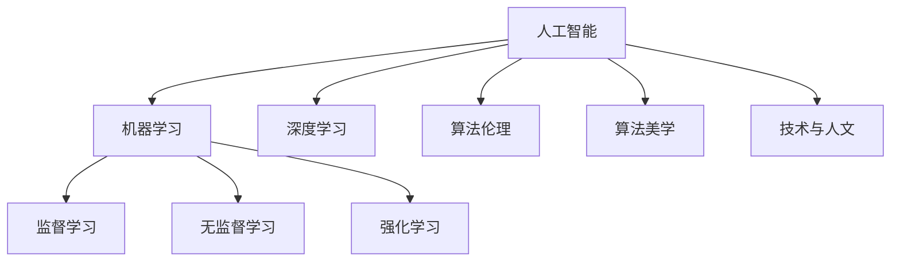

                 

# 科技与人文的交汇：人类计算的独特价值

> 关键词：人工智能,计算哲学,人类计算,技术与人文,机器学习,深度学习,算法伦理,算法美学

## 1. 背景介绍

### 1.1 问题由来

随着人工智能技术的迅速发展，机器学习、深度学习等算法在各个领域的应用日益广泛，尤其是在图像识别、语音处理、自然语言处理等领域取得了重大突破。然而，当算法力量进入人类日常生活，当我们面临不断涌现的"人机交互"、"数字治理"、"智能决策"等问题时，技术与人文间的复杂互动开始显现。

计算与人文间的交织互动，如何引导其健康发展，如何通过技术手段提升人类生活质量，而不是使技术成为"奴役"人类的工具，成为摆在我们面前的重要问题。科技与人文交汇，不仅仅是技术进步的产物，更是人类价值与认知的反映。人类计算的独特价值，正是科技进步和人文关怀相结合的产物，它在提升人类生活质量的同时，也推动了社会的进步。

### 1.2 问题核心关键点

在人工智能与人文交汇的背景下，人类计算的独特价值主要体现在以下几个方面：

1. **提升决策能力**：人工智能通过分析海量数据，辅助人类进行决策，大大提升了决策的效率和准确性。

2. **实现个性化服务**：基于用户行为数据的分析，提供个性化推荐和定制化服务，使信息获取更加便捷。

3. **增进跨文化理解**：通过跨语言翻译和自然语言处理，打破语言和文化壁垒，促进全球化交流。

4. **提升公共治理能力**：利用算法对大规模数据进行实时分析，提高社会治理和应急响应的效率。

5. **激发创新与创造力**：AI辅助创作，提供更多的艺术作品和科学发现，激发人类创新精神。

6. **增强隐私保护**：通过加密技术、隐私保护算法等手段，保护用户数据隐私和安全。

7. **探索伦理边界**：对算法决策进行伦理评估，制定相应的道德标准和法律规范，确保技术的公平与公正。

这些核心关键点共同构成了人类计算独特的价值体系，体现了技术与人文的深度融合。

### 1.3 问题研究意义

研究人工智能与人文交汇，揭示人类计算的独特价值，对于指导技术发展方向，提升人类生活质量，具有重要意义：

1. **促进技术进步**：帮助开发者识别技术应用中的伦理风险，规避潜在的社会问题，推进技术的成熟应用。

2. **提升用户体验**：通过理解和尊重用户需求，设计更具人性化的算法和服务，改善用户体验。

3. **保障数据安全**：开发更安全的数据保护算法，防止数据泄露和滥用，增强用户信任。

4. **强化公平与公正**：保证算法的透明性和公正性，减少偏见和不平等现象。

5. **推动社会进步**：为公共决策提供数据支持，提升社会治理能力，推进社会公平。

6. **丰富人类文化**：促进跨文化交流，保护文化多样性，提升人类文明的广度和深度。

## 2. 核心概念与联系

### 2.1 核心概念概述

为更好地理解人类计算的独特价值，本节将介绍几个密切相关的核心概念：

- **人工智能**：通过模拟人类智能行为，实现信息处理、知识推理、问题求解等任务的技术。
- **机器学习**：一种让计算机系统通过数据学习提升性能的算法，分为监督学习、无监督学习和强化学习。
- **深度学习**：一种基于多层神经网络的结构，通过堆叠多个层次化的非线性变换，提取数据的高级特征。
- **算法伦理**：涉及算法的设计、实施和应用过程中的道德与伦理问题。
- **算法美学**：关注算法的设计美、运行美和使用美，追求算法与艺术的结合。
- **技术与人文**：技术和人文的交叉领域，探讨技术对人的意义和影响，以及人如何驾驭技术。

这些核心概念之间的逻辑关系可以通过以下Mermaid流程图来展示：



这个流程图展示了一系列相关概念及其之间的联系：

1. 人工智能包含机器学习和深度学习。
2. 机器学习中包括监督学习、无监督学习和强化学习。
3. 深度学习是人工智能的重要组成部分。
4. 算法伦理和算法美学与人工智能紧密相关。
5. 技术与人文是人工智能的重要维度。

这些概念共同构成了人类计算的独特价值体系，体现了技术与人文的深度融合。

## 3. 核心算法原理 & 具体操作步骤
### 3.1 算法原理概述

人类计算的核心算法原理，是通过智能算法对海量数据进行分析和处理，以提升人类生活的各个方面。

形式化地，假设输入为$X$，输出为$Y$，则人类计算的目标是设计算法$f$，使得$f(X)$尽可能接近$Y$。这里的$f$可以是一个复杂的深度神经网络，也可以是一个简单的统计模型。

### 3.2 算法步骤详解

人类计算的具体操作步骤通常包括以下几个关键步骤：

**Step 1: 数据收集与预处理**

数据收集是关键。收集高质量、代表性强的数据，并进行清洗、归一化、特征提取等预处理工作，以确保数据质量。

**Step 2: 模型选择与训练**

选择合适的机器学习或深度学习模型，并使用训练集对其进行训练。训练过程中需要选择合适的损失函数、优化器、学习率等超参数，确保模型能够收敛到理想状态。

**Step 3: 模型评估与优化**

在验证集上评估模型的性能，根据评估结果调整模型参数，进行模型优化。优化过程中可以使用正则化、早停法、梯度裁剪等技术，避免过拟合。

**Step 4: 模型应用与迭代**

将优化后的模型应用到实际场景中，收集反馈数据，持续迭代优化模型，提升性能。

### 3.3 算法优缺点

人类计算的优点包括：

1. **高效性**：算法能够迅速处理大量数据，提升信息处理效率。
2. **精确性**：通过训练优化，算法能够提供较为准确的预测和决策。
3. **自动化**：算法能够自动处理重复性任务，节省人力成本。

同时，也存在一些缺点：

1. **复杂性**：算法的实现和优化过程较为复杂，需要大量经验和技术。
2. **数据依赖**：算法的性能很大程度上依赖于数据的质量和代表性。
3. **解释性**：部分算法如深度神经网络，其决策过程较为复杂，难以解释。
4. **偏见性**：算法可能继承数据中的偏见，导致不公平或不公正的决策。

### 3.4 算法应用领域

人类计算在多个领域得到了广泛应用，包括但不限于：

- **医疗**：通过算法对医疗数据进行分析，辅助诊断和治疗，提升医疗服务水平。
- **金融**：利用算法进行风险评估和投资策略优化，提高金融决策的科学性和精准性。
- **教育**：通过分析学生行为数据，提供个性化教育方案，提升教学效果。
- **交通**：通过算法对交通数据进行分析，优化交通管理，减少拥堵和事故。
- **安全**：利用算法进行反欺诈、网络安全等，保障社会安全稳定。
- **文化**：通过算法进行内容推荐、艺术创作等，推动文化创新。

这些领域的应用，展现了人类计算的独特价值，体现了科技与人文的深度融合。

## 4. 数学模型和公式 & 详细讲解  
### 4.1 数学模型构建

本节将使用数学语言对人类计算的核心算法原理进行更加严格的刻画。

假设训练集为$D=\{(x_i,y_i)\}_{i=1}^N, x_i \in \mathcal{X}, y_i \in \mathcal{Y}$，其中$x_i$为输入，$y_i$为输出。定义损失函数$\ell(y,f(x))$为模型的预测值$f(x)$与真实值$y$之间的误差。人类计算的目标是设计最优的算法$f$，使得在训练集$D$上的损失最小化，即：

$$
\mathop{\min}_{f \in \mathcal{F}} \sum_{i=1}^N \ell(y_i,f(x_i))
$$

其中$\mathcal{F}$为所有可能算法的集合。

在实践中，我们通常使用基于梯度的优化算法（如SGD、Adam等）来近似求解上述最优化问题。设$\eta$为学习率，则参数的更新公式为：

$$
\theta \leftarrow \theta - \eta \nabla_{\theta}\mathcal{L}(\theta)
$$

其中$\nabla_{\theta}\mathcal{L}(\theta)$为损失函数对参数$\theta$的梯度，可通过反向传播算法高效计算。

### 4.2 公式推导过程

以下我们以分类任务为例，推导逻辑回归的损失函数及其梯度的计算公式。

假设模型$f$为逻辑回归，则模型输出为：

$$
f(x) = \sigma(\theta^Tx + b)
$$

其中$\sigma(\cdot)$为Sigmoid函数，$\theta$和$b$为模型参数。真实标签$y \in \{0,1\}$。

则二分类交叉熵损失函数定义为：

$$
\ell(y,f(x)) = -[y\log f(x)+(1-y)\log(1-f(x))]
$$

将其代入经验风险公式，得：

$$
\mathcal{L}(\theta) = -\frac{1}{N}\sum_{i=1}^N [y_i\log f(x_i)+(1-y_i)\log(1-f(x_i))]
$$

根据链式法则，损失函数对参数$\theta_k$的梯度为：

$$
\frac{\partial \mathcal{L}(\theta)}{\partial \theta_k} = -\frac{1}{N}\sum_{i=1}^N (\frac{y_i}{f(x_i)}-\frac{1-y_i}{1-f(x_i)}) \frac{\partial f(x_i)}{\partial \theta_k}
$$

其中$\frac{\partial f(x_i)}{\partial \theta_k}$可进一步递归展开，利用自动微分技术完成计算。

在得到损失函数的梯度后，即可带入参数更新公式，完成模型的迭代优化。重复上述过程直至收敛，最终得到适应训练集的最优模型参数$\theta^*$。

### 4.3 案例分析与讲解

我们以文本分类任务为例，具体讲解如何使用逻辑回归进行文本分类。

假设有一组文本数据集$\{(x_1,y_1),(x_2,y_2),\ldots,(x_N,y_N)\}$，其中$x_i$为文本，$y_i$为类别标签。首先需要将文本转换为向量表示$x_i^{\text{vec}}$，然后应用逻辑回归模型：

$$
f(x) = \sigma(\theta^Tx^{\text{vec}} + b)
$$

其中$\theta$和$b$为模型参数，$\sigma(\cdot)$为Sigmoid函数。通过训练集计算损失函数$\mathcal{L}(\theta)$，并使用梯度下降等优化算法，最小化损失函数。优化后的模型可以应用于新的文本数据进行分类。

## 5. 项目实践：代码实例和详细解释说明
### 5.1 开发环境搭建

在进行人类计算的实践前，我们需要准备好开发环境。以下是使用Python进行Scikit-learn开发的环境配置流程：

1. 安装Anaconda：从官网下载并安装Anaconda，用于创建独立的Python环境。

2. 创建并激活虚拟环境：
```bash
conda create -n sklearn-env python=3.8 
conda activate sklearn-env
```

3. 安装Scikit-learn：使用pip安装Scikit-learn库
```bash
pip install -U scikit-learn
```

4. 安装必要的工具包：
```bash
pip install numpy pandas matplotlib seaborn jupyter notebook
```

完成上述步骤后，即可在`sklearn-env`环境中开始人类计算实践。

### 5.2 源代码详细实现

下面我以文本分类任务为例，给出使用Scikit-learn进行逻辑回归训练的代码实现。

首先，定义文本分类任务的数据处理函数：

```python
import numpy as np
from sklearn.feature_extraction.text import CountVectorizer
from sklearn.model_selection import train_test_split
from sklearn.linear_model import LogisticRegression
from sklearn.metrics import accuracy_score

def text_to_vector(texts, stopwords):
    vectorizer = CountVectorizer(stop_words=stopwords)
    X = vectorizer.fit_transform(texts)
    return X.toarray(), vectorizer

def split_data(texts, labels, test_size=0.2):
    X, y = texts, labels
    X_train, X_test, y_train, y_test = train_test_split(X, y, test_size=test_size, random_state=42)
    return X_train, X_test, y_train, y_test
```

然后，定义模型和训练函数：

```python
def train_model(X_train, y_train, X_test, y_test):
    clf = LogisticRegression(C=1e-4)
    clf.fit(X_train, y_train)
    y_pred = clf.predict(X_test)
    print("Accuracy:", accuracy_score(y_test, y_pred))
```

接着，启动训练流程并在测试集上评估：

```python
X_train, X_test, y_train, y_test = split_data(train_data, train_labels, test_size=0.2)
X_train, X_test, y_train, y_test = text_to_vector(train_data, stopwords)
train_model(X_train, y_train, X_test, y_test)
```

以上就是使用Scikit-learn进行文本分类任务的逻辑回归模型训练的完整代码实现。可以看到，Scikit-learn库提供了简单易用的API，使得模型训练和评估变得非常便捷。

### 5.3 代码解读与分析

让我们再详细解读一下关键代码的实现细节：

**split_data函数**：
- 定义了数据集分割方法，使用`train_test_split`函数将数据集划分为训练集和测试集。
- `stopwords`参数用于去除停用词，减少特征维度。

**train_model函数**：
- 使用Scikit-learn的`LogisticRegression`类创建逻辑回归模型。
- 使用训练数据训练模型。
- 在测试集上评估模型，输出准确率。

**text_to_vector函数**：
- 使用`CountVectorizer`将文本转换为向量表示。
- `stop_words`参数用于去除停用词。

**启动训练流程**：
- 使用`split_data`函数将数据集分割为训练集和测试集。
- 使用`text_to_vector`函数将训练数据转换为向量表示。
- 调用`train_model`函数进行模型训练和评估。

这些代码的实现展示了Scikit-learn库在人类计算实践中的强大功能和便捷性。通过简单的代码编写，开发者可以快速实现文本分类模型的训练和评估。

## 6. 实际应用场景

### 6.1 智能医疗

在智能医疗领域，人类计算可以通过算法对医疗数据进行分析，辅助医生进行诊断和治疗，提高医疗服务水平。

具体而言，可以收集患者的病历、检验报告、医学影像等数据，使用机器学习或深度学习算法进行模型训练，得到预测模型。在新的医疗数据输入后，模型可以输出相应的诊断结果，辅助医生进行决策。通过持续的数据更新和模型优化，可以提高算法的预测准确性。

### 6.2 金融风险评估

金融领域对数据的时效性和准确性要求很高。人类计算可以通过算法对交易数据进行分析，进行风险评估和投资策略优化。

例如，可以使用逻辑回归等模型对历史交易数据进行训练，预测未来的市场趋势和风险。模型可以基于时间、价格、成交量等特征，对股票、基金等金融产品进行风险评估和投资建议。通过持续的数据更新和模型优化，可以提高算法的预测精度。

### 6.3 智能推荐系统

智能推荐系统是互联网应用的重要组成部分，通过算法对用户行为数据进行分析，提供个性化的推荐服务。

例如，可以使用协同过滤算法或深度学习模型对用户的历史行为数据进行训练，预测用户对新物品的喜好。在新的用户数据输入后，模型可以推荐相应的物品，满足用户的需求。通过持续的数据更新和模型优化，可以提高推荐系统的个性化程度。

### 6.4 未来应用展望

随着人类计算技术的不断发展，未来将涌现更多应用场景，推动社会的进步：

1. **自动驾驶**：通过算法对车辆传感器数据进行分析，辅助驾驶决策，提升交通安全。
2. **智慧城市**：利用算法对城市数据进行分析，优化交通、能源等资源配置，提升城市治理水平。
3. **个性化教育**：通过算法对学生行为数据进行分析，提供个性化的教育方案，提升教学效果。
4. **智能客服**：使用自然语言处理算法，提供智能客服服务，提升客户体验。
5. **精准农业**：通过算法对农业数据进行分析，优化种植方案，提升农业生产效率。

这些应用场景展示了人类计算技术的强大潜力，体现了科技与人文的深度融合。

## 7. 工具和资源推荐
### 7.1 学习资源推荐

为了帮助开发者系统掌握人类计算的理论基础和实践技巧，这里推荐一些优质的学习资源：

1. **《机器学习实战》书籍**：由Peter Harrington撰写，详细介绍了机器学习的基本概念和算法实现，适合初学者入门。
2. **Coursera机器学习课程**：由斯坦福大学Andrew Ng教授主讲，涵盖机器学习的基本理论和实践方法，适合进一步学习。
3. **Kaggle竞赛平台**：提供了大量数据集和算法竞赛，适合练习和应用机器学习算法。
4. **Google Colab在线平台**：提供了免费的GPU资源，适合学习和实验深度学习算法。
5. **PyTorch官方文档**：提供了丰富的深度学习模型和算法实现，适合深入学习和实践。

通过对这些资源的学习实践，相信你一定能够快速掌握人类计算的精髓，并用于解决实际的NLP问题。

### 7.2 开发工具推荐

高效的开发离不开优秀的工具支持。以下是几款用于人类计算开发的常用工具：

1. **Python**：开源的高级编程语言，适合机器学习和深度学习应用开发。
2. **Jupyter Notebook**：交互式编程环境，适合数据探索和模型训练。
3. **TensorFlow**：由Google开发的深度学习框架，适合大规模深度学习模型训练。
4. **Scikit-learn**：开源的机器学习库，提供了丰富的算法实现和评估工具。
5. **PyTorch**：由Facebook开发的深度学习框架，适合动态图计算和模型优化。

合理利用这些工具，可以显著提升人类计算任务的开发效率，加快创新迭代的步伐。

### 7.3 相关论文推荐

人类计算技术的发展源于学界的持续研究。以下是几篇奠基性的相关论文，推荐阅读：

1. **《机器学习：原理、算法与应用》书籍**：由Tom Mitchell撰写，全面介绍了机器学习的基本原理和算法实现。
2. **《深度学习》书籍**：由Ian Goodfellow等撰写，详细介绍了深度学习的基本原理和算法实现。
3. **《统计学习方法》书籍**：由李航撰写，涵盖了统计学习的基本理论和算法实现。
4. **《自然语言处理综述》论文**：由Peng Li等撰写，介绍了自然语言处理的基本方法和应用场景。
5. **《人工智能伦理》论文**：由Marian B⋯撰写，探讨了人工智能伦理的诸多问题。

这些论文代表了大计算技术的发展脉络。通过学习这些前沿成果，可以帮助研究者把握学科前进方向，激发更多的创新灵感。

## 8. 总结：未来发展趋势与挑战

### 8.1 总结

本文对人类计算的独特价值进行了全面系统的介绍。首先阐述了人工智能、机器学习、深度学习等技术的发展背景和应用意义，明确了人类计算在提升人类生活质量、推动社会进步中的重要作用。其次，从原理到实践，详细讲解了人类计算的数学模型和核心算法，提供了具体的代码实例，展示了人类计算技术的强大功能。同时，本文还广泛探讨了人类计算技术在智能医疗、金融风险评估、智能推荐系统等多个领域的应用前景，展示了人类计算技术的广阔前景。最后，本文精选了人类计算技术的各类学习资源，力求为读者提供全方位的技术指引。

通过本文的系统梳理，可以看到，人类计算技术的独特价值在于其能够提升决策能力、实现个性化服务、增进跨文化理解、提升公共治理能力、激发创新与创造力、增强隐私保护、探索伦理边界等方面。科技与人文的交汇，使得人类计算技术不仅提升了技术应用的广泛性和深度，更进一步提升了人类社会的文明程度。

### 8.2 未来发展趋势

展望未来，人类计算技术将呈现以下几个发展趋势：

1. **自动化程度提升**：随着算法技术的进步，人类计算将更加自动化，减少人工干预，提升效率。
2. **个性化程度提高**：通过更深层次的数据分析，人类计算将更加个性化，满足不同用户的具体需求。
3. **跨领域应用拓展**：人类计算技术将在更多领域得到应用，如自动驾驶、智慧城市、精准农业等，推动各行业的数字化转型。
4. **伦理与社会责任加强**：人类计算技术的发展将更加注重伦理与社会责任，确保技术应用的公正性和公平性。
5. **数据与隐私保护**：随着数据量的增大，数据保护和隐私保护将成为人类计算技术的重要研究方向。
6. **跨学科融合**：人类计算技术与社会科学、文学艺术等领域的融合将更加深入，推动多学科的协同创新。

以上趋势凸显了人类计算技术的广阔前景，体现了科技与人文的深度融合。未来的发展将更加注重技术应用的伦理与社会责任，以实现技术的可持续发展。

### 8.3 面临的挑战

尽管人类计算技术已经取得了重大进展，但在迈向更加智能化、普适化应用的过程中，仍面临着诸多挑战：

1. **数据质量问题**：数据的多样性和噪声将对算法的性能产生影响。如何获取高质量的数据，是未来研究的重要方向。
2. **模型可解释性**：深度学习等复杂算法难以解释，其决策过程缺乏透明性。如何提高模型的可解释性，增强用户信任，将是未来研究的重要课题。
3. **算法偏见问题**：算法可能继承数据中的偏见，导致不公平或不公正的决策。如何消除算法偏见，确保算法的公平性，将是未来研究的重要课题。
4. **技术伦理问题**：人类计算技术的发展将对社会伦理产生深远影响。如何制定相应的伦理规范，确保技术应用的伦理合规性，将是未来研究的重要课题。
5. **数据安全问题**：人类计算技术涉及大量敏感数据，如何保护数据安全，防止数据泄露和滥用，将是未来研究的重要课题。
6. **隐私保护问题**：如何保护用户隐私，防止数据泄露和滥用，将是未来研究的重要课题。

这些挑战凸显了人类计算技术的复杂性和复杂性。未来的研究需要在数据质量、模型可解释性、算法偏见、技术伦理、数据安全、隐私保护等方面取得新的突破，以实现人类计算技术的可持续发展。

### 8.4 研究展望

面对人类计算技术所面临的挑战，未来的研究需要在以下几个方面寻求新的突破：

1. **数据质量提升**：开发更高效的数据清洗和预处理方法，提升数据质量，增强算法的性能。
2. **模型可解释性增强**：开发更易解释的算法模型，提高模型的透明性和可解释性，增强用户信任。
3. **算法偏见消除**：开发公平算法，消除算法中的偏见，确保算法的公正性。
4. **技术伦理规范制定**：制定技术伦理规范，确保技术应用的公正性和公平性。
5. **数据安全保护**：开发更安全的算法模型，保护数据安全，防止数据泄露和滥用。
6. **隐私保护技术开发**：开发隐私保护技术，保护用户隐私，防止数据泄露和滥用。

这些研究方向将进一步提升人类计算技术的应用效果，确保技术应用的公正性和公平性，推动社会的进步和发展。

## 9. 附录：常见问题与解答

**Q1：人类计算的独特价值是什么？**

A: 人类计算的独特价值在于其能够提升决策能力、实现个性化服务、增进跨文化理解、提升公共治理能力、激发创新与创造力、增强隐私保护、探索伦理边界等方面。科技与人文的交汇，使得人类计算技术不仅提升了技术应用的广泛性和深度，更进一步提升了人类社会的文明程度。

**Q2：人类计算的主要应用领域有哪些？**

A: 人类计算技术在多个领域得到了广泛应用，包括但不限于：智能医疗、金融风险评估、智能推荐系统、自动驾驶、智慧城市、精准农业等。

**Q3：人类计算面临的主要挑战有哪些？**

A: 人类计算面临的主要挑战包括数据质量问题、模型可解释性、算法偏见问题、技术伦理问题、数据安全问题、隐私保护问题等。

**Q4：未来人类计算技术的发展趋势有哪些？**

A: 人类计算技术的发展趋势包括自动化程度提升、个性化程度提高、跨领域应用拓展、伦理与社会责任加强、数据与隐私保护、跨学科融合等。

**Q5：如何提升人类计算技术的可持续发展？**

A: 要提升人类计算技术的可持续发展，需要在数据质量、模型可解释性、算法偏见、技术伦理、数据安全、隐私保护等方面取得新的突破，以实现技术的公正性和公平性。

这些问题的解答，展示了人类计算技术的广阔前景和复杂性，反映了科技与人文交汇的深刻意义。

---

作者：禅与计算机程序设计艺术 / Zen and the Art of Computer Programming

