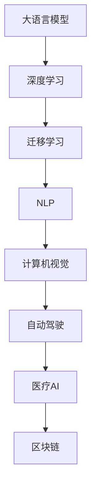

                 

# 科技创新：社会进步的阶梯

## 1. 背景介绍

科技创新历来是推动社会进步的核心动力。从工业革命到信息时代的跨越，每一次科技进步都深刻改变了人类的生产生活方式，极大地提升了社会生产力。在当下，数据驱动、智能化的新科技革命正席卷全球，成为推动社会发展的新阶梯。

科技创新不仅包括硬技术的突破，还涵盖了软技术的革新，如自然语言处理(NLP)、计算机视觉(CV)、自动驾驶、医疗AI等，这些技术正逐步渗透到各行各业，成为各行业智能化转型升级的重要引擎。

### 1.1 问题的由来

科技创新的快速发展，得益于大数据、云计算、人工智能等技术的融合创新，尤其是大语言模型、深度学习、迁移学习等前沿技术的突破。在数据爆炸和计算能力显著提升的背景下，科技创新有了更多的可能性，但随之而来的是如何高效、安全、可控地应用这些技术的问题。

科技创新不仅是技术上的突破，更关乎社会治理、伦理道德、产业转型等层面，需要科技工作者与行业专家共同努力，才能确保科技创新的成果惠及全人类。

### 1.2 问题核心关键点

当前，科技创新的核心关键点主要包括：

- **数据驱动**：科技创新依赖于大规模数据集的支撑，如何有效获取、存储、利用数据成为重要问题。
- **模型优化**：模型训练的高效性和鲁棒性，如何设计高效算法，避免过拟合和参数爆炸成为关键。
- **算法伦理**：科技创新的成果应当服务于人类福祉，避免技术滥用，如数据隐私、算法偏见、决策透明性等问题。
- **行业应用**：科技创新的成果如何有效落地，融入各行业流程，产生实际价值。
- **人才培养**：科技创新的跨越式发展需要大量高素质人才，如何培养跨学科、复合型人才成为重要课题。

## 2. 核心概念与联系

### 2.1 核心概念概述

科技创新涉及诸多核心概念，本文主要聚焦于以下几个关键概念：

- **大语言模型(Large Language Models, LLM)**：通过大规模数据预训练的通用语言模型，能够理解复杂的语言结构和语义，具备强大的自然语言处理能力。

- **深度学习(Deep Learning)**：一种基于多层神经网络的机器学习范式，通过多层次的非线性映射，能够自动学习数据中的复杂模式和规律。

- **迁移学习(Transfer Learning)**：利用预训练模型的知识，在小规模数据集上进行微调，提升模型在特定任务上的性能。

- **自然语言处理(Natural Language Processing, NLP)**：通过算法实现计算机对自然语言的理解、生成和处理，是人工智能研究的重要分支。

- **计算机视觉(Computer Vision, CV)**：使计算机能够“看”和理解图像、视频等视觉数据，广泛应用于安防、医疗、工业等领域。

- **自动驾驶(Autonomous Driving)**：利用感知、决策、控制等技术，实现无人驾驶，正在推动交通行业的智能化转型。

- **医疗AI**：通过机器学习和深度学习技术，实现疾病诊断、医疗影像分析、个性化治疗等，提升医疗服务的效率和质量。

- **区块链(Blockchain)**：一种去中心化的分布式账本技术，具有不可篡改、透明可信等特性，广泛应用于金融、供应链管理等领域。

这些核心概念之间相互关联，形成了一个庞大的科技创新网络，推动了社会各领域的进步。

### 2.2 核心概念原理和架构的 Mermaid 流程图



这个流程图展示了核心概念之间的逻辑关系：

1. 大语言模型通过深度学习框架实现预训练，具备自然语言处理能力。
2. 迁移学习将预训练知识应用于特定任务，提升模型性能。
3. NLP、CV、自动驾驶、医疗AI等技术通过深度学习模型训练，实现特定功能。
4. 区块链技术为大语言模型等技术提供分布式、安全的数据处理能力。

这些技术之间相互支撑，形成了一个庞大的科技创新生态系统。

## 3. 核心算法原理 & 具体操作步骤

### 3.1 算法原理概述

基于深度学习的科技创新过程，核心算法原理主要包括以下几个方面：

- **深度神经网络**：通过多层次的非线性映射，实现对数据的复杂建模和特征提取。

- **自监督学习**：利用无标注数据进行自我学习，提升模型的泛化能力。

- **迁移学习**：将在大规模数据上预训练的知识迁移到特定任务，提升模型性能。

- **强化学习**：通过奖励机制训练模型，使其在特定环境中取得最优行为。

- **对抗训练**：引入对抗样本，提高模型的鲁棒性和泛化能力。

- **模型压缩和优化**：通过模型剪枝、量化、稀疏化等技术，提高模型的效率和可部署性。

科技创新涉及诸多算法，但核心在于如何高效、鲁棒地处理数据，提取有用的特征，设计合理的模型结构，并在特定应用场景中取得最佳性能。

### 3.2 算法步骤详解

科技创新过程通常包括以下几个关键步骤：

1. **数据准备**：收集、清洗、标注数据，构建数据集。

2. **模型设计**：选择合适的网络结构、损失函数、优化器等。

3. **模型训练**：在数据集上进行训练，调整模型参数。

4. **模型评估**：使用验证集评估模型性能，调整超参数。

5. **模型优化**：针对评估结果进行优化，提高模型性能。

6. **模型部署**：将模型集成到实际应用中，进行落地验证。

科技创新需要不断迭代优化，在多个环节进行全面控制，才能取得最佳效果。

### 3.3 算法优缺点

深度学习算法在科技创新中具有以下优点：

- **高效性**：通过大量数据训练，模型能够自动学习特征，减少手工特征工程。

- **泛化能力强**：模型在未见过的数据上也有良好表现。

- **适应性强**：适用于各类复杂问题，如图像识别、自然语言处理等。

- **可解释性**：通过可视化技术，可以理解模型内部决策过程。

但深度学习算法也存在一些缺点：

- **数据需求高**：需要大量数据进行训练，难以在小规模数据集上取得好效果。

- **模型复杂**：参数数量庞大，训练时间长，计算资源消耗高。

- **黑盒问题**：模型决策过程难以解释，难以进行人工调试。

- **过拟合风险**：在训练集上过拟合，导致泛化性能下降。

- **迁移能力有限**：不同任务之间的迁移能力不足，需要重新训练。

科技创新需要综合考虑这些优缺点，设计合理的模型和算法，才能达到最佳效果。

### 3.4 算法应用领域

深度学习算法已经在多个领域得到广泛应用，主要包括：

- **自然语言处理(NLP)**：机器翻译、文本分类、情感分析、问答系统等。

- **计算机视觉(CV)**：图像识别、目标检测、人脸识别、图像生成等。

- **自动驾驶**：环境感知、路径规划、行为决策等。

- **医疗AI**：疾病诊断、影像分析、个性化治疗等。

- **金融科技**：风险评估、欺诈检测、算法交易等。

- **智能制造**：生产流程优化、质量检测、设备维护等。

科技创新在各领域的应用，正在重塑各行各业的未来。

## 4. 数学模型和公式 & 详细讲解 & 举例说明

### 4.1 数学模型构建

基于深度学习的科技创新过程，可以构建如下数学模型：

设输入数据为 $x$，输出为 $y$，训练集为 $D=\{(x_i, y_i)\}_{i=1}^N$，模型为 $f_\theta(x)$，其中 $\theta$ 为模型参数。模型损失函数为 $L(\theta)$，优化目标为最小化损失函数：

$$
\min_\theta \sum_{i=1}^N L(f_\theta(x_i), y_i)
$$

模型训练过程包括前向传播和反向传播，具体步骤如下：

1. 前向传播：将输入数据 $x$ 通过模型 $f_\theta(x)$，得到输出 $y$。

2. 计算损失：计算输出 $y$ 与真实标签 $y_i$ 的误差，得到损失 $L(\theta)$。

3. 反向传播：计算损失对模型参数 $\theta$ 的梯度，更新参数。

4. 迭代训练：反复进行前向传播和反向传播，直到模型收敛。

### 4.2 公式推导过程

以下以图像分类任务为例，推导卷积神经网络(CNN)的数学公式和反向传播算法。

设输入图像为 $x \in \mathbb{R}^{W \times H \times C}$，卷积层参数为 $k$，卷积核大小为 $h \times w$，步长为 $s$，输出通道数为 $c$。卷积操作公式为：

$$
\mathcal{C}(x, k) = \sum_{i=0}^{W-k} \sum_{j=0}^{H-k} \sum_{c=0}^{C} \sum_{k=0}^{K} \theta_k x_{i,j,c} k_{i,j,k}
$$

其中 $x_{i,j,c}$ 为输入图像的第 $(i,j,c)$ 个像素值，$k_{i,j,k}$ 为卷积核的第 $k$ 个特征图。

将上述公式展开，得到卷积层的输出：

$$
\mathcal{C}(x, k) \in \mathbb{R}^{W \times H \times c}
$$

卷积层的激活函数通常使用ReLU函数，公式为：

$$
\text{ReLU}(\mathcal{C}(x, k)) = \max(0, \mathcal{C}(x, k))
$$

卷积层的输出通过池化层进行降维，常用池化操作为最大池化，公式为：

$$
\mathcal{P}(\mathcal{C}(x, k)) = \max_{i \in W} \max_{j \in H} \mathcal{C}(x, k)_{i,j}
$$

卷积层和池化层构成一个卷积神经网络层，重复上述操作，得到完整的CNN模型。

### 4.3 案例分析与讲解

以图像分类任务为例，分析CNN模型的训练过程。

首先，将输入图像 $x$ 和标签 $y$ 输入CNN模型，得到输出 $y'$。

计算损失函数 $L(y', y)$，如交叉熵损失：

$$
L(y', y) = -\frac{1}{N} \sum_{i=1}^N y_i \log y'_i + (1-y_i) \log (1-y'_i)
$$

计算损失对模型参数 $\theta$ 的梯度，得到反向传播公式：

$$
\frac{\partial L(y', y)}{\partial \theta} = \frac{\partial L(y', y)}{\partial y'} \frac{\partial y'}{\partial \mathcal{C}} \frac{\partial \mathcal{C}}{\partial \theta}
$$

其中 $\frac{\partial y'}{\partial \mathcal{C}}$ 为激活函数对卷积层输出的梯度，$\frac{\partial \mathcal{C}}{\partial \theta}$ 为卷积层对参数的梯度。

通过反向传播算法，更新模型参数 $\theta$，直到模型收敛。

## 5. 项目实践：代码实例和详细解释说明

### 5.1 开发环境搭建

在实践中，需要搭建好开发环境。以下是使用Python进行TensorFlow和Keras开发的Python3环境配置流程：

1. 安装Anaconda：从官网下载并安装Anaconda，用于创建独立的Python环境。

2. 创建并激活虚拟环境：
```bash
conda create -n tf-env python=3.8 
conda activate tf-env
```

3. 安装TensorFlow：根据CUDA版本，从官网获取对应的安装命令。例如：
```bash
conda install tensorflow -c tf -c conda-forge
```

4. 安装Keras：
```bash
pip install keras
```

5. 安装各类工具包：
```bash
pip install numpy pandas scikit-learn matplotlib tqdm jupyter notebook ipython
```

完成上述步骤后，即可在`tf-env`环境中开始项目实践。

### 5.2 源代码详细实现

下面以图像分类任务为例，给出使用TensorFlow和Keras进行卷积神经网络训练的Python代码实现。

首先，定义CNN模型：

```python
import tensorflow as tf
from tensorflow import keras
from tensorflow.keras import layers

model = keras.Sequential([
    layers.Conv2D(32, (3, 3), activation='relu', input_shape=(28, 28, 1)),
    layers.MaxPooling2D((2, 2)),
    layers.Conv2D(64, (3, 3), activation='relu'),
    layers.MaxPooling2D((2, 2)),
    layers.Flatten(),
    layers.Dense(64, activation='relu'),
    layers.Dense(10)
])
```

接着，定义训练和评估函数：

```python
from tensorflow.keras.datasets import mnist
from tensorflow.keras.utils import to_categorical

(train_images, train_labels), (test_images, test_labels) = mnist.load_data()

train_images = train_images.reshape(-1, 28, 28, 1) / 255.0
test_images = test_images.reshape(-1, 28, 28, 1) / 255.0

train_labels = to_categorical(train_labels)
test_labels = to_categorical(test_labels)

model.compile(optimizer='adam',
              loss='categorical_crossentropy',
              metrics=['accuracy'])

model.fit(train_images, train_labels, epochs=10, batch_size=32, validation_data=(test_images, test_labels))
```

最后，评估模型性能：

```python
test_loss, test_acc = model.evaluate(test_images, test_labels)
print('Test accuracy:', test_acc)
```

以上就是使用TensorFlow和Keras进行卷积神经网络训练的完整代码实现。可以看到，通过Keras的高层次抽象，模型的构建和训练变得非常简洁高效。

### 5.3 代码解读与分析

让我们再详细解读一下关键代码的实现细节：

**定义CNN模型**：
- `layers.Conv2D`：定义卷积层，参数包括卷积核大小、输出通道数、激活函数等。
- `layers.MaxPooling2D`：定义池化层，用于降维。
- `layers.Flatten`：将卷积层输出展开为一维向量。
- `layers.Dense`：定义全连接层，用于分类。

**训练和评估函数**：
- `mnist.load_data`：加载MNIST数据集。
- `train_images = train_images.reshape(-1, 28, 28, 1) / 255.0`：将图像数据归一化。
- `train_labels = to_categorical(train_labels)`：将标签转换为独热编码。
- `model.compile`：配置模型的优化器、损失函数、评估指标等。
- `model.fit`：训练模型，在每个epoch结束时自动评估性能。
- `model.evaluate`：在测试集上评估模型性能。

**运行结果展示**：
- `Test accuracy:` 输出测试集上的分类准确率。

可以看到，TensorFlow和Keras提供了强大的深度学习框架，使得模型的构建、训练和评估变得非常高效。开发者可以快速迭代，探索不同的模型结构、超参数等，以获得最佳的性能。

## 6. 实际应用场景

### 6.1 智能医疗

在智能医疗领域，基于深度学习的科技创新正在改变传统医疗模式。通过深度学习模型，可以实现疾病诊断、医疗影像分析、个性化治疗等，提升医疗服务的效率和质量。

例如，使用卷积神经网络进行医学影像分类，可以实现自动化的癌症检测、X光片分析等任务。同时，通过深度学习模型进行患者信息的自然语言处理，可以实现病历记录的自动化生成，减少医生的工作量。

### 6.2 智慧城市

智慧城市建设是科技创新在城市管理领域的重要应用。通过深度学习模型，可以实现智能交通管理、公共安全监控、环境监测等，提升城市管理的智能化水平。

例如，通过卷积神经网络进行视频监控分析，可以实现行为异常检测、目标跟踪等功能，提高城市安全管理水平。同时，通过深度学习模型进行交通流量预测，可以实现智能交通信号控制，缓解交通拥堵问题。

### 6.3 金融科技

在金融科技领域，基于深度学习的科技创新正在改变传统金融服务模式。通过深度学习模型，可以实现风险评估、欺诈检测、算法交易等，提升金融服务的效率和安全性。

例如，使用深度学习模型进行信用评分，可以实现自动化的贷款审批流程，减少人工审核的误差和时间成本。同时，通过深度学习模型进行市场预测，可以实现智能交易策略的制定，提高交易效率和收益。

### 6.4 未来应用展望

未来，基于深度学习的科技创新将在更多领域得到应用，推动各行业向智能化方向发展。以下是几个可能的未来应用方向：

1. **自动驾驶**：深度学习模型在自动驾驶领域的应用，可以实现环境感知、路径规划、行为决策等功能，推动无人驾驶技术的普及。

2. **智能制造**：深度学习模型在智能制造领域的应用，可以实现设备故障预测、生产流程优化等功能，提升制造业的自动化水平。

3. **智慧农业**：深度学习模型在智慧农业领域的应用，可以实现病虫害检测、作物生长预测等功能，提高农业生产效率。

4. **虚拟现实**：深度学习模型在虚拟现实领域的应用，可以实现虚拟场景的渲染、交互等功能，推动虚拟现实技术的普及。

5. **量子计算**：深度学习模型在量子计算领域的应用，可以实现量子态的优化和计算，推动量子计算技术的突破。

科技创新正在不断突破技术边界，应用到更多领域，推动社会进步和产业升级。

## 7. 工具和资源推荐

### 7.1 学习资源推荐

为了帮助开发者系统掌握深度学习技术，这里推荐一些优质的学习资源：

1. **《深度学习》书籍**：Ian Goodfellow等人所著，全面介绍了深度学习的基本概念、模型、算法等，适合初学者和进阶学习者。

2. **DeepLearning.ai在线课程**：Andrew Ng主讲的深度学习课程，覆盖了深度学习的基础理论和应用实践，适合系统学习。

3. **Coursera深度学习课程**：涵盖从深度学习基础到高级应用的课程，由业界专家授课，内容全面、实用。

4. **Kaggle竞赛平台**：提供大量的数据集和挑战任务，可以实践深度学习模型的训练和优化。

5. **Google AI博客**：提供最新的深度学习研究进展和技术实践，适合跟踪前沿技术。

通过学习这些资源，相信你一定能够快速掌握深度学习技术的精髓，并应用于实际项目中。

### 7.2 开发工具推荐

高效的深度学习开发离不开优秀的工具支持。以下是几款用于深度学习开发的常用工具：

1. **TensorFlow**：由Google主导开发的深度学习框架，功能强大、灵活性高，广泛应用于学术研究和工业应用。

2. **Keras**：基于TensorFlow等底层框架的高层次抽象库，使用方便、易于上手，适合快速迭代开发。

3. **PyTorch**：由Facebook开发的深度学习框架，以其动态计算图和易用性著称，广泛应用于研究和工程开发。

4. **MXNet**：由Apache维护的深度学习框架，支持多种语言和平台，灵活性高。

5. **Caffe**：由Berkeley视觉与学习中心开发的深度学习框架，适合图像处理和计算机视觉任务。

6. **OpenCV**：开源计算机视觉库，提供了大量的图像处理和计算机视觉算法，适合进行图像识别和目标检测。

这些工具各具特色，开发者可以根据具体需求进行选择。

### 7.3 相关论文推荐

深度学习技术的发展得益于学界的持续研究。以下是几篇奠基性的相关论文，推荐阅读：

1. **《ImageNet Classification with Deep Convolutional Neural Networks》**：AlexNet论文，展示了卷积神经网络在图像分类任务上的优异表现。

2. **《Convolutional Neural Networks for General Vision Tasks》**：LeNet论文，展示了卷积神经网络在手写数字识别任务上的性能。

3. **《Deep Residual Learning for Image Recognition》**：ResNet论文，展示了深度残差网络在图像分类任务上的性能。

4. **《Long Short-Term Memory》**：LSTM论文，展示了长短期记忆网络在序列建模任务上的性能。

5. **《Attention Is All You Need》**：Transformer论文，展示了自注意力机制在序列建模任务上的性能。

这些论文代表了大规模深度学习模型的发展脉络，通过学习这些前沿成果，可以帮助研究者把握学科前进方向，激发更多的创新灵感。

## 8. 总结：未来发展趋势与挑战

### 8.1 总结

本文对基于深度学习的科技创新过程进行了全面系统的介绍。首先阐述了科技创新的重要性，并探讨了其与大语言模型、深度学习等前沿技术的关系。其次，从原理到实践，详细讲解了深度学习模型的构建和训练过程，给出了深度学习模型的代码实例。同时，本文还广泛探讨了深度学习在各领域的应用前景，展示了其广阔的应用空间。

通过本文的系统梳理，可以看到，基于深度学习的科技创新正在全面渗透各行各业，推动社会向智能化方向发展。未来，科技创新还将继续引领人工智能技术的发展，带来更多的颠覆性变化。

### 8.2 未来发展趋势

展望未来，基于深度学习的科技创新将呈现以下几个发展趋势：

1. **模型规模持续增大**：随着算力成本的下降和数据规模的扩张，深度学习模型的参数量还将持续增长，超大规模模型将更好地理解复杂数据结构。

2. **迁移学习的应用**：迁移学习将在更多领域得到应用，提升模型在小规模数据集上的性能。

3. **多模态融合**：深度学习模型将与视觉、语音、文本等多种模态数据结合，实现跨模态的智能推理。

4. **模型优化和压缩**：深度学习模型将更加注重高效性和可部署性，优化算法、压缩技术等将被广泛应用。

5. **自监督学习**：自监督学习将广泛应用于数据预处理和模型训练中，提升模型泛化能力。

6. **强化学习**：强化学习将与深度学习结合，实现智能体在复杂环境中的自主决策。

7. **可解释性和透明性**：深度学习模型的可解释性和透明性将成为重要研究方向，确保模型的决策过程可控、可信。

这些趋势展示了基于深度学习的科技创新将在未来继续拓展其应用边界，推动各行业向智能化、自动化方向发展。

### 8.3 面临的挑战

尽管基于深度学习的科技创新取得了瞩目成就，但在迈向更加智能化、普适化应用的过程中，它仍面临着诸多挑战：

1. **数据隐私和安全**：深度学习模型的训练和应用涉及大量数据，如何保护数据隐私和安全成为重要问题。

2. **模型偏见和公平性**：深度学习模型可能学习到有偏见的数据，导致输出结果不公平，如何确保模型的公平性和公正性成为重要课题。

3. **模型的可解释性和透明性**：深度学习模型的内部决策过程难以解释，如何提高模型的透明性和可解释性成为重要研究方向。

4. **资源和计算成本**：深度学习模型的训练和部署需要大量计算资源，如何降低资源和计算成本成为重要挑战。

5. **模型的泛化能力和鲁棒性**：深度学习模型在面对新数据和复杂环境时，泛化能力和鲁棒性不足，如何提高模型的泛化能力和鲁棒性成为重要研究方向。

6. **模型的持续学习和更新**：深度学习模型需要不断学习新数据，如何实现模型的持续学习和更新成为重要课题。

这些挑战需要在理论、算法、应用等多个层面进行全面研究，才能确保深度学习技术的健康发展。

### 8.4 研究展望

面对基于深度学习的科技创新所面临的挑战，未来的研究需要在以下几个方面寻求新的突破：

1. **自监督和半监督学习**：摆脱对大规模标注数据的依赖，利用自监督和半监督学习方法，最大限度地利用非结构化数据。

2. **模型的可解释性和透明性**：引入符号化的先验知识，与深度学习模型结合，提高模型的可解释性和透明性。

3. **多模态融合技术**：研究如何将视觉、语音、文本等多种模态数据融合，实现跨模态的智能推理。

4. **模型压缩和优化**：开发高效压缩和优化算法，减少深度学习模型的计算和存储需求。

5. **强化学习和对抗训练**：研究如何将强化学习与深度学习结合，提升模型的自主决策能力。

6. **公平性和公正性**：研究如何消除深度学习模型的偏见，确保模型输出结果的公平性和公正性。

7. **隐私保护和安全**：研究如何保护深度学习模型的训练和应用过程中的数据隐私和安全。

这些研究方向的探索，将推动基于深度学习的科技创新向更加智能、安全、可靠的方向发展，为构建智能社会奠定坚实基础。

## 9. 附录：常见问题与解答

**Q1：深度学习算法是否适用于所有数据集？**

A: 深度学习算法对数据的分布和特征要求较高，需要大量高质量标注数据进行训练。对于数据量较小、分布不均的任务，可能需要结合其他技术，如迁移学习、小样本学习等，才能取得良好效果。

**Q2：如何提高深度学习模型的泛化能力？**

A: 提高深度学习模型的泛化能力可以从以下几个方面入手：
1. 数据增强：通过数据增强技术，增加训练集的样本多样性。
2. 正则化：使用L2正则、Dropout等技术，防止模型过拟合。
3. 数据扩充：利用未标注数据进行预训练，提升模型的泛化能力。
4. 模型集成：通过模型集成技术，提高模型的鲁棒性和泛化能力。

**Q3：深度学习算法在实际应用中面临哪些问题？**

A: 深度学习算法在实际应用中面临以下问题：
1. 数据隐私和安全问题：深度学习模型的训练和应用涉及大量数据，如何保护数据隐私和安全成为重要问题。
2. 模型偏见和公平性问题：深度学习模型可能学习到有偏见的数据，导致输出结果不公平，如何确保模型的公平性和公正性成为重要课题。
3. 模型的可解释性和透明性问题：深度学习模型的内部决策过程难以解释，如何提高模型的透明性和可解释性成为重要研究方向。
4. 资源和计算成本问题：深度学习模型的训练和部署需要大量计算资源，如何降低资源和计算成本成为重要挑战。
5. 模型的泛化能力和鲁棒性问题：深度学习模型在面对新数据和复杂环境时，泛化能力和鲁棒性不足，如何提高模型的泛化能力和鲁棒性成为重要研究方向。
6. 模型的持续学习和更新问题：深度学习模型需要不断学习新数据，如何实现模型的持续学习和更新成为重要课题。

这些问题是深度学习技术在实际应用中需要克服的重要挑战，需要从理论、算法、应用等多个层面进行全面研究。

通过本文的系统梳理，可以看到，基于深度学习的科技创新正在全面渗透各行各业，推动社会向智能化方向发展。未来，科技创新还将继续引领人工智能技术的发展，带来更多的颠覆性变化。科技创新需要科技工作者与行业专家共同努力，才能确保科技创新的成果惠及全人类。

---

作者：禅与计算机程序设计艺术 / Zen and the Art of Computer Programming

