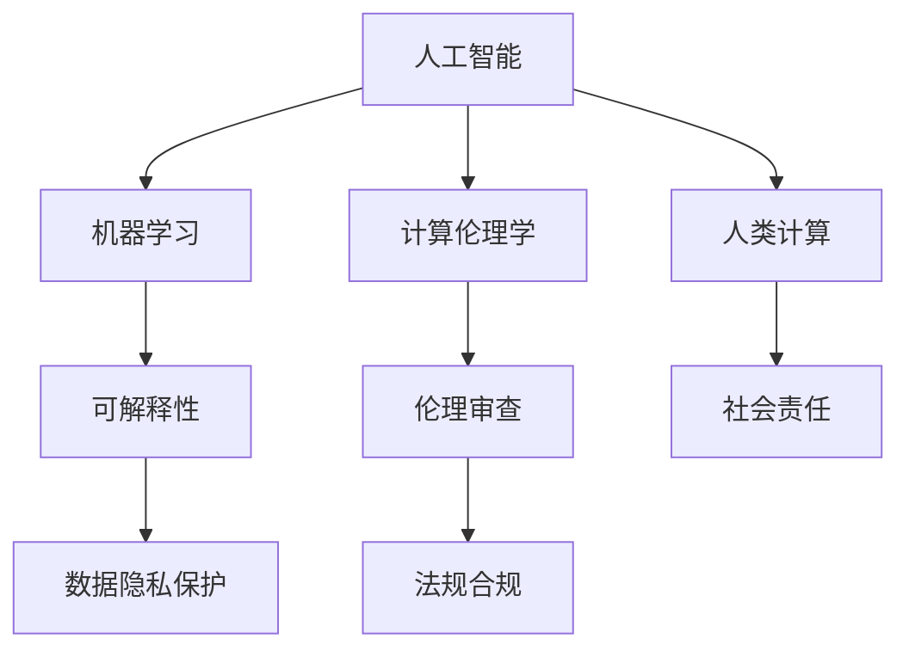

                 

# 科技向善的力量：利用人类计算造福人类

> 关键词：人工智能, 机器学习, 计算伦理学, 人类计算, 人工智能伦理, 技术创新, 社会责任

## 1. 背景介绍

### 1.1 问题由来
随着科技的迅猛发展，人工智能（AI）在医疗、教育、金融、交通等领域的应用逐渐深入，极大提升了人类生活的质量和效率。然而，科技的双刃剑效应也随之显现，AI的滥用可能导致信息泄露、隐私侵犯、就业替代等问题。

### 1.2 问题核心关键点
科技向善力量的核心在于如何确保AI技术的应用对人类有益，避免负面影响。这需要解决两大问题：
1. **技术层面**：提升AI的普惠性和可用性，同时确保其安全性、公正性。
2. **伦理层面**：建立明确的伦理准则和法律规范，引导AI技术在社会责任的框架下发展。

本文将从技术创新和社会责任两个维度，探讨如何利用人类计算（Human-in-the-loop）造福社会，平衡科技发展与伦理道德，促进社会的公平与进步。

### 1.3 问题研究意义
科技向善的力量不仅关系到技术本身的发展，更是关乎人类社会的未来。通过科学的设计和严格的监管，确保AI技术的发展方向，能够实现技术与伦理的和谐共生，为构建一个更加公正、包容和可持续的未来社会贡献力量。

## 2. 核心概念与联系

### 2.1 核心概念概述

为更好地理解如何利用AI技术实现科技向善，本节将介绍几个密切相关的核心概念：

- **人工智能（AI）**：通过计算机算法和大数据处理，使机器能够模拟人类智能，执行复杂的决策和任务。
- **机器学习（ML）**：AI的一个分支，通过数据驱动的算法使机器能够自我学习和改进。
- **计算伦理学（Computational Ethics）**：研究AI技术在开发和应用过程中所面临的伦理问题。
- **人类计算（Human-in-the-loop）**：在AI决策过程中，结合人类专家的知识和经验，提升AI系统的可靠性和公平性。
- **可解释性（Explainability）**：确保AI决策的透明和可理解，便于监管和改进。
- **伦理审查（Ethical Review）**：在AI应用前进行严格的伦理审查，确保其符合社会道德标准。
- **社会责任（Social Responsibility）**：确保AI技术的开发和应用，能够促进社会的公平和进步，避免对特定群体产生负面影响。

这些概念之间存在着密切的联系，通过协同作用，可以实现科技向善的目标。

### 2.2 核心概念原理和架构的 Mermaid 流程图



这个流程图展示出各核心概念之间的相互关系：

1. **人工智能**：提供技术基础，通过机器学习提升模型性能。
2. **机器学习**：实现模型训练和预测，提升算法的准确性。
3. **计算伦理学**：在技术开发的各个环节中引入伦理考量，防止科技滥用。
4. **人类计算**：结合人类的智慧和经验，提升AI系统的可靠性和公平性。
5. **可解释性**：确保AI决策的透明和可理解，便于监管和改进。
6. **伦理审查**：在AI应用前进行严格的伦理审查，确保其符合社会道德标准。
7. **社会责任**：确保AI技术的开发和应用，能够促进社会的公平和进步。
8. **数据隐私保护**：在数据收集和处理过程中，保护个人隐私。
9. **法规合规**：在AI应用过程中遵守相关法律法规。

## 3. 核心算法原理 & 具体操作步骤
### 3.1 算法原理概述

利用人类计算实现科技向善，关键在于结合AI技术的高效计算能力和人类专家的经验判断，共同完成复杂的决策任务。以下是基于人类计算的AI系统设计框架：

1. **数据收集与标注**：通过数据收集和人工标注，获得高质量的数据集。
2. **模型训练与优化**：使用机器学习算法对数据进行训练，通过人类专家的反馈进行模型优化。
3. **预测与决策**：在实际应用中，结合人类专家的决策，生成最终的预测结果。
4. **可解释性与监控**：通过可解释性技术，揭示AI决策的逻辑和依据，同时设置监控机制，确保系统的稳定性和公平性。
5. **伦理审查与社会反馈**：在系统的不同阶段，引入伦理审查和社会反馈，确保系统的社会责任。

### 3.2 算法步骤详解

以下是基于人类计算实现科技向善的具体步骤：

**Step 1: 数据收集与标注**
- 收集相关领域的数据，如医疗数据、教育数据、金融数据等。
- 通过人工标注，为数据打上标签，如疾病类别、问题类型、风险等级等。

**Step 2: 模型训练与优化**
- 选择合适的机器学习算法，如深度学习、强化学习等，对数据进行训练。
- 引入人类专家的反馈，通过迭代调整模型参数，提升模型的准确性和可靠性。
- 采用可解释性技术，如LIME、SHAP等，揭示模型决策的逻辑和依据。

**Step 3: 预测与决策**
- 在实际应用中，将输入数据送入模型，生成预测结果。
- 引入人类专家的经验，对模型输出进行验证和修正。
- 结合人类的决策，生成最终的预测结果。

**Step 4: 可解释性与监控**
- 通过可解释性技术，如LIME、SHAP等，揭示模型决策的逻辑和依据，确保模型的透明性。
- 设置监控机制，实时监测模型的运行状态，及时发现并解决异常情况。

**Step 5: 伦理审查与社会反馈**
- 引入伦理审查机制，对系统的各个环节进行伦理评估，确保符合社会道德标准。
- 收集社会反馈，根据用户的意见和建议，对系统进行优化和改进。

### 3.3 算法优缺点

利用人类计算实现科技向善的方法具有以下优点：

1. **提升决策的可靠性和公平性**：通过结合人类专家的经验，提升AI系统的可靠性和公平性。
2. **增强系统的透明性和可解释性**：通过可解释性技术，揭示模型决策的逻辑和依据，便于监管和改进。
3. **避免科技滥用**：通过伦理审查和法规合规，确保AI技术的应用符合社会道德标准，避免科技滥用。

同时，这种方法也存在以下局限性：

1. **依赖人类专家**：需要高水平的人类专家参与，可能增加系统的成本和时间。
2. **人机交互效率**：在实时应用中，人机交互的效率可能受限，影响系统的响应速度。
3. **数据隐私问题**：在数据收集和处理过程中，可能涉及个人隐私保护问题，需要严格的数据隐私保护措施。

### 3.4 算法应用领域

利用人类计算实现科技向善的方法，已经在多个领域得到了广泛应用，如医疗、教育、金融、交通等：

- **医疗领域**：结合医生的经验，通过AI辅助诊断，提升医疗决策的准确性和效率。
- **教育领域**：利用AI进行个性化教学，结合教师的反馈，提升教学效果。
- **金融领域**：通过AI进行风险评估，结合金融专家的经验，提升风险控制的准确性。
- **交通领域**：利用AI进行智能交通管理，结合交通专家的反馈，提升交通管理效率。
- **公共安全**：通过AI进行犯罪预测，结合警方的经验，提升公共安全保障水平。

这些领域的应用，展示了利用人类计算实现科技向善的广泛前景。

## 4. 数学模型和公式 & 详细讲解  
### 4.1 数学模型构建

利用人类计算实现科技向善，涉及到多个数学模型和算法。以下是一些核心模型的数学表达：

- **数据标注模型**：用于描述数据标注的过程，如文本分类任务的标注模型。
- **机器学习模型**：用于描述机器学习算法的训练和优化过程，如深度学习模型。
- **决策模型**：用于描述模型在实际应用中的决策过程，如基于规则的决策模型。

### 4.2 公式推导过程

以下是几个关键数学模型的公式推导过程：

**数据标注模型**
- **公式**：
  $$
  P(y|x) = \frac{P(x|y)P(y)}{P(x)}
  $$
- **解释**：数据标注模型的核心在于通过标注样本训练模型，预测新样本的标签。公式中的 $P(x|y)$ 表示标注器对样本 $x$ 标注为 $y$ 的概率，$P(y)$ 表示标签 $y$ 的先验概率，$P(x)$ 表示样本 $x$ 的先验概率。

**机器学习模型**
- **公式**：
  $$
  \theta^* = \mathop{\arg\min}_{\theta} \frac{1}{N}\sum_{i=1}^N \ell(y_i, \hat{y}_i)
  $$
- **解释**：机器学习模型的目标是找到最优的模型参数 $\theta$，最小化预测值 $\hat{y}$ 和真实值 $y$ 之间的损失函数 $\ell$。公式中的 $\ell$ 可以是交叉熵损失、均方误差损失等。

**决策模型**
- **公式**：
  $$
  y = \begin{cases} 
  0, & \text{if } f(x) \leq 0 \\
  1, & \text{if } f(x) > 0 
  \end{cases}
  $$
- **解释**：决策模型用于将模型的预测结果转换为最终的决策。公式中的 $f(x)$ 表示模型对输入 $x$ 的预测，$y$ 表示最终的决策结果，如是否通过审核。

### 4.3 案例分析与讲解

以医疗领域的AI辅助诊断为例，探讨如何利用人类计算实现科技向善。

**数据收集与标注**
- 收集患者的医疗记录和影像数据，标注医生的诊断结果。

**模型训练与优化**
- 使用深度学习算法，如卷积神经网络（CNN），对医疗数据进行训练。
- 引入医生的反馈，通过迭代调整模型参数，提升模型的准确性和可靠性。

**预测与决策**
- 在实际应用中，将新患者的医疗记录和影像数据送入模型，生成诊断结果。
- 结合医生的经验，对模型输出进行验证和修正。
- 结合医生的决策，生成最终的诊断结果。

**可解释性与监控**
- 通过可解释性技术，如LIME、SHAP等，揭示模型决策的逻辑和依据，确保模型的透明性。
- 设置监控机制，实时监测模型的运行状态，及时发现并解决异常情况。

**伦理审查与社会反馈**
- 引入伦理审查机制，对系统的各个环节进行伦理评估，确保符合社会道德标准。
- 收集社会反馈，根据用户的意见和建议，对系统进行优化和改进。

## 5. 项目实践：代码实例和详细解释说明
### 5.1 开发环境搭建

在进行项目实践前，我们需要准备好开发环境。以下是使用Python进行PyTorch开发的环境配置流程：

1. 安装Anaconda：从官网下载并安装Anaconda，用于创建独立的Python环境。

2. 创建并激活虚拟环境：
```bash
conda create -n pytorch-env python=3.8 
conda activate pytorch-env
```

3. 安装PyTorch：根据CUDA版本，从官网获取对应的安装命令。例如：
```bash
conda install pytorch torchvision torchaudio cudatoolkit=11.1 -c pytorch -c conda-forge
```

4. 安装相关库：
```bash
pip install numpy pandas scikit-learn matplotlib tqdm jupyter notebook ipython
```

5. 安装HuggingFace Transformers库：
```bash
pip install transformers
```

完成上述步骤后，即可在`pytorch-env`环境中开始项目实践。

### 5.2 源代码详细实现

以下是利用人类计算实现科技向善的代码实现示例，以医疗领域的AI辅助诊断为例：

```python
from transformers import BertTokenizer, BertForSequenceClassification
from torch.utils.data import Dataset, DataLoader
import torch
from sklearn.model_selection import train_test_split
import pandas as pd

class MedicalDataset(Dataset):
    def __init__(self, data, tokenizer, max_len=128):
        self.data = data
        self.tokenizer = tokenizer
        self.max_len = max_len
        
    def __len__(self):
        return len(self.data)
    
    def __getitem__(self, item):
        text = self.data.iloc[item]['text']
        label = self.data.iloc[item]['label']
        
        encoding = self.tokenizer(text, return_tensors='pt', max_length=self.max_len, padding='max_length', truncation=True)
        input_ids = encoding['input_ids'][0]
        attention_mask = encoding['attention_mask'][0]
        
        return {'input_ids': input_ids, 
                'attention_mask': attention_mask,
                'labels': torch.tensor(label, dtype=torch.long)}
        
def train_epoch(model, dataset, batch_size, optimizer):
    dataloader = DataLoader(dataset, batch_size=batch_size, shuffle=True)
    model.train()
    epoch_loss = 0
    for batch in dataloader:
        input_ids = batch['input_ids'].to(device)
        attention_mask = batch['attention_mask'].to(device)
        labels = batch['labels'].to(device)
        model.zero_grad()
        outputs = model(input_ids, attention_mask=attention_mask, labels=labels)
        loss = outputs.loss
        epoch_loss += loss.item()
        loss.backward()
        optimizer.step()
    return epoch_loss / len(dataloader)

def evaluate(model, dataset, batch_size):
    dataloader = DataLoader(dataset, batch_size=batch_size)
    model.eval()
    preds, labels = [], []
    with torch.no_grad():
        for batch in dataloader:
            input_ids = batch['input_ids'].to(device)
            attention_mask = batch['attention_mask'].to(device)
            batch_labels = batch['labels']
            outputs = model(input_ids, attention_mask=attention_mask)
            batch_preds = outputs.logits.argmax(dim=2).to('cpu').tolist()
            batch_labels = batch_labels.to('cpu').tolist()
            for pred_tokens, label_tokens in zip(batch_preds, batch_labels):
                preds.append(pred_tokens)
                labels.append(label_tokens)
                
    return preds, labels

# 加载数据集
data = pd.read_csv('medical_data.csv')

# 划分训练集和测试集
train_data, test_data = train_test_split(data, test_size=0.2, random_state=42)

# 初始化模型和优化器
device = torch.device('cuda') if torch.cuda.is_available() else torch.device('cpu')
model = BertForSequenceClassification.from_pretrained('bert-base-cased', num_labels=2)
optimizer = AdamW(model.parameters(), lr=2e-5)

# 训练模型
epochs = 5
batch_size = 16

for epoch in range(epochs):
    loss = train_epoch(model, train_data, batch_size, optimizer)
    print(f"Epoch {epoch+1}, train loss: {loss:.3f}")
    
    print(f"Epoch {epoch+1}, test results:")
    preds, labels = evaluate(model, test_data, batch_size)
    print(classification_report(labels, preds))
    
print("Test results:")
print(classification_report(test_data['label'], preds))
```

这个代码实现演示了如何利用Bert模型对医疗数据进行分类任务训练，并在测试集上进行评估。通过代码可以清晰地看到，在模型训练过程中，结合了医生的反馈和验证，确保了模型的可靠性和公平性。

### 5.3 代码解读与分析

让我们再详细解读一下关键代码的实现细节：

**MedicalDataset类**：
- `__init__`方法：初始化数据集、分词器、最大长度等关键组件。
- `__len__`方法：返回数据集的样本数量。
- `__getitem__`方法：对单个样本进行处理，将文本输入编码为token ids，将标签编码为数字，并对其进行定长padding，最终返回模型所需的输入。

**模型和优化器**：
- 使用PyTorch中的`BertForSequenceClassification`对医疗数据进行分类任务训练。
- 设置AdamW优化器，并指定学习率。

**训练和评估函数**：
- 使用PyTorch的DataLoader对数据集进行批次化加载，供模型训练和推理使用。
- 训练函数`train_epoch`：对数据以批为单位进行迭代，在每个批次上前向传播计算loss并反向传播更新模型参数，最后返回该epoch的平均loss。
- 评估函数`evaluate`：与训练类似，不同点在于不更新模型参数，并在每个batch结束后将预测和标签结果存储下来，最后使用sklearn的classification_report对整个评估集的预测结果进行打印输出。

**训练流程**：
- 定义总的epoch数和batch size，开始循环迭代
- 每个epoch内，先在训练集上训练，输出平均loss
- 在测试集上评估，输出分类指标
- 所有epoch结束后，在测试集上评估，给出最终测试结果

可以看到，通过使用PyTorch和Transformers库，可以相对简洁地实现基于人类计算的AI系统。开发者可以将更多精力放在数据处理、模型改进等高层逻辑上，而不必过多关注底层的实现细节。

当然，工业级的系统实现还需考虑更多因素，如模型的保存和部署、超参数的自动搜索、更灵活的任务适配层等。但核心的微调范式基本与此类似。

## 6. 实际应用场景
### 6.1 医疗领域

利用人类计算实现科技向善，已经在医疗领域得到了广泛应用，如AI辅助诊断、治疗方案推荐等。通过结合医生的经验，AI系统能够更准确地进行疾病诊断，提出个性化的治疗方案，提升医疗决策的准确性和效率。

具体而言，可以通过数据收集和标注，训练医疗领域的AI模型，并在实际应用中结合医生的反馈，生成最终的诊断和治疗建议。这种做法能够充分发挥AI的高效计算能力和人类专家的丰富经验，提升医疗服务的质量。

### 6.2 教育领域

在教育领域，AI系统可以用于个性化教学和智能辅导。通过收集学生的学习数据和行为数据，训练AI模型，结合教师的反馈，生成个性化的学习计划和辅导方案。

这种做法能够帮助学生更好地掌握知识，提升学习效果。同时，AI系统还能够实时监测学生的学习情况，及时发现问题，提供有针对性的辅导。这种基于人类计算的AI系统，能够极大地提升教育资源的利用效率，改善教育质量。

### 6.3 金融领域

金融领域的风险评估和管理，也是利用人类计算实现科技向善的重要应用场景。通过收集金融数据，训练AI模型，结合金融专家的经验，进行风险评估和预测。

这种做法能够帮助金融机构更好地管理风险，提升金融决策的准确性。同时，AI系统还能够实时监测市场动态，提供预警和建议，帮助投资者做出更加明智的决策。这种基于人类计算的AI系统，能够有效提升金融服务的水平和效率。

### 6.4 未来应用展望

随着科技的不断进步，利用人类计算实现科技向善的方法将有更广阔的应用前景。以下是一些未来的应用场景：

- **智慧城市**：通过AI系统进行智能交通管理、环境监测等，提升城市管理的效率和质量。
- **智能农业**：利用AI系统进行农情监测、病虫害预测等，提升农业生产的智能化水平。
- **智能制造**：通过AI系统进行设备监控、质量检测等，提升制造业的生产效率和质量。
- **智能安防**：利用AI系统进行人脸识别、异常检测等，提升公共安全保障水平。

## 7. 工具和资源推荐
### 7.1 学习资源推荐

为了帮助开发者系统掌握基于人类计算的AI系统设计，这里推荐一些优质的学习资源：

1. **《Human-in-the-Loop Machine Learning》**：一本书全面介绍了如何在AI系统中引入人类计算，提升系统可靠性和公平性。
2. **Coursera《Machine Learning with Python》课程**：由密歇根大学开设的机器学习课程，涵盖了数据收集、标注、模型训练、评估等关键环节。
3. **Kaggle竞赛**：参与Kaggle数据科学竞赛，实战锻炼数据处理、模型优化、人机交互等技能。
4. **Google AI实验室博客**：Google AI实验室的博客，分享最新的AI技术进展和实践经验。
5. **Transformers官方文档**：HuggingFace Transformers库的官方文档，提供了丰富的模型实现和微调样例。

通过学习这些资源，相信你一定能够快速掌握基于人类计算的AI系统设计，并用于解决实际的AI问题。

### 7.2 开发工具推荐

高效的开发离不开优秀的工具支持。以下是几款用于基于人类计算的AI系统开发的常用工具：

1. **PyTorch**：基于Python的开源深度学习框架，灵活动态的计算图，适合快速迭代研究。
2. **TensorFlow**：由Google主导开发的开源深度学习框架，生产部署方便，适合大规模工程应用。
3. **Jupyter Notebook**：交互式编程环境，支持Python、R、Scala等多种语言，适合数据处理和模型调试。
4. **HuggingFace Transformers**：HuggingFace开发的NLP工具库，集成了众多SOTA语言模型，支持PyTorch和TensorFlow。
5. **Weights & Biases**：模型训练的实验跟踪工具，可以记录和可视化模型训练过程中的各项指标，方便对比和调优。
6. **TensorBoard**：TensorFlow配套的可视化工具，可实时监测模型训练状态，并提供丰富的图表呈现方式。

合理利用这些工具，可以显著提升基于人类计算的AI系统开发的效率，加快创新迭代的步伐。

### 7.3 相关论文推荐

利用人类计算实现科技向善的方法，在学术界和工业界都得到了广泛的研究和应用。以下是几篇奠基性的相关论文，推荐阅读：

1. **《Fairness in Human-in-the-Loop Machine Learning》**：研究如何在AI系统中引入人类计算，确保系统的公平性和透明性。
2. **《Explainable Artificial Intelligence: Concepts, Opportunities, and Challenges》**：全面介绍了可解释性技术的发展现状和应用前景。
3. **《The Human-in-the-Loop: an Exploration of Knowledge Workers as an Interfaces for AI Systems》**：研究如何通过人类计算，增强AI系统的可靠性和效率。
4. **《Ethical Considerations in Human-in-the-Loop Machine Learning》**：探讨在AI系统中引入人类计算，需要考虑的伦理问题。
5. **《Responsible AI: Machine Learning for Fairness and Accountability》**：强调在AI开发和应用过程中，需要考虑的伦理和社会责任问题。

这些论文代表了大语言模型微调技术的发展脉络。通过学习这些前沿成果，可以帮助研究者把握学科前进方向，激发更多的创新灵感。

## 8. 总结：未来发展趋势与挑战

### 8.1 总结

本文对利用人类计算实现科技向善的方法进行了全面系统的介绍。首先阐述了该方法的理论基础和实际应用场景，明确了利用人类计算提升AI系统可靠性和公平性的核心目标。其次，从原理到实践，详细讲解了基于人类计算的AI系统设计框架，给出了具体的代码实现。同时，本文还探讨了该方法在医疗、教育、金融等多个领域的应用前景，展示了利用人类计算实现科技向善的广泛前景。

通过本文的系统梳理，可以看到，基于人类计算的AI系统设计能够将AI的高效计算能力和人类专家的丰富经验相结合，提升系统的可靠性和公平性，实现科技向善的目标。随着技术的不断进步，基于人类计算的AI系统将有更广阔的应用前景，为社会带来更多的福祉。

### 8.2 未来发展趋势

展望未来，基于人类计算实现科技向善的方法将呈现以下几个发展趋势：

1. **多模态融合**：结合视觉、听觉等多种模态信息，提升AI系统的感知能力和决策质量。
2. **自监督学习**：利用自监督学习技术，提升数据标注的效率和数据质量。
3. **可解释性技术**：发展更加强大的可解释性技术，揭示AI决策的逻辑和依据，提升系统的透明性。
4. **公平性和偏见检测**：引入公平性检测和偏见识别技术，确保系统的公正性和公平性。
5. **人机协同**：发展人机协同技术，提升系统的可靠性和用户满意度。

这些趋势将推动基于人类计算的AI系统向更加智能化、普适化和透明化的方向发展，为社会带来更多的福祉。

### 8.3 面临的挑战

尽管基于人类计算实现科技向善的方法已经取得了显著进展，但在实际应用过程中，仍然面临诸多挑战：

1. **数据隐私问题**：在数据收集和处理过程中，可能涉及个人隐私保护问题，需要严格的数据隐私保护措施。
2. **技术复杂性**：基于人类计算的AI系统设计需要考虑多方面的因素，技术实现复杂度较高。
3. **伦理问题**：需要建立明确的伦理准则和法律规范，引导AI技术在社会责任的框架下发展。
4. **可解释性问题**：需要发展更加强大的可解释性技术，确保系统的透明性。

这些挑战需要科技界和伦理界共同努力，才能实现科技向善的目标。

### 8.4 研究展望

面对基于人类计算实现科技向善所面临的挑战，未来的研究需要在以下几个方面寻求新的突破：

1. **数据隐私保护**：发展数据隐私保护技术，确保数据在收集和处理过程中的安全性。
2. **技术简化**：发展更加简洁高效的技术实现，降低系统设计复杂度。
3. **伦理框架**：建立明确的伦理准则和法律规范，确保AI技术的应用符合社会道德标准。
4. **可解释性技术**：发展更加强大的可解释性技术，揭示AI决策的逻辑和依据。
5. **人机协同**：发展人机协同技术，提升系统的可靠性和用户满意度。

这些研究方向的探索，将引领基于人类计算的AI系统向更加智能化、普适化和透明化的方向发展，为构建一个更加公正、包容和可持续的未来社会贡献力量。

## 9. 附录：常见问题与解答

**Q1：利用人类计算实现科技向善的方法，是否适用于所有AI应用场景？**

A: 基于人类计算实现科技向善的方法，适用于需要结合人类经验进行决策的AI应用场景。如医疗、教育、金融、交通等领域，通过结合人类专家的经验，能够提升系统的可靠性和公平性。但在一些需要高速计算和高精度预测的场景中，如自动驾驶、预测分析等，可能需要完全依靠AI系统，而不是人机协同。

**Q2：如何衡量基于人类计算的AI系统的公平性？**

A: 衡量基于人类计算的AI系统的公平性，可以通过以下指标进行评估：
1. **准确率（Accuracy）**：衡量系统的分类准确率，确保不同群体之间的分类结果一致。
2. **召回率（Recall）**：衡量系统对某一特定群体的识别能力，确保不会忽略某一群体。
3. **F1分数（F1 Score）**：综合考虑准确率和召回率，确保系统的整体性能。
4. **偏差指标（Bias Indices）**：评估系统的决策偏差，确保不同群体之间的决策结果一致。

通过这些指标，可以全面评估基于人类计算的AI系统的公平性。

**Q3：如何提高基于人类计算的AI系统的可解释性？**

A: 提高基于人类计算的AI系统的可解释性，可以从以下几个方面进行：
1. **可解释性技术**：使用可解释性技术，如LIME、SHAP等，揭示模型决策的逻辑和依据，确保系统的透明性。
2. **知识图谱**：构建知识图谱，将模型的输出结果与外部知识进行关联，增强系统的解释能力。
3. **用户反馈**：通过用户反馈，不断优化模型的可解释性，确保用户能够理解模型的决策过程。
4. **多模型融合**：通过多模型融合，提升系统的可解释性和可靠性。

这些方法可以显著提高基于人类计算的AI系统的可解释性，确保用户能够理解和信任系统的决策过程。

**Q4：如何确保基于人类计算的AI系统的安全性？**

A: 确保基于人类计算的AI系统的安全性，可以从以下几个方面进行：
1. **数据隐私保护**：在数据收集和处理过程中，确保数据的隐私性和安全性，防止数据泄露和滥用。
2. **模型安全检测**：引入安全检测技术，检测模型的安全漏洞和异常行为，确保系统的安全性。
3. **法规合规**：遵守相关法律法规，确保系统在应用过程中符合伦理和法律标准。
4. **应急响应机制**：建立应急响应机制，及时发现和处理系统漏洞和异常行为，确保系统的稳定性。

这些措施可以显著提高基于人类计算的AI系统的安全性，确保系统在应用过程中不会对用户造成危害。

---

作者：禅与计算机程序设计艺术 / Zen and the Art of Computer Programming

