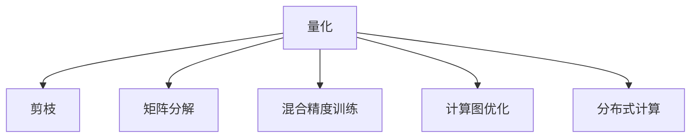

                 

## 1. 背景介绍

大语言模型（Large Language Models，简称LLM）作为人工智能领域的一个重要分支，自GPT-3问世以来，便以其卓越的自然语言处理能力在各应用领域大放异彩，显示出巨大的潜力。然而，LLM的高精度往往伴随着高计算复杂度，导致推理速度慢、内存占用大，从而在实时性应用场景中难以发挥其潜力。如何提升LLM的速度，使之从"慢且大"的困境中走出来，成为学术界和工业界亟需解决的问题。

### 1.1 问题由来

LLM在推理速度上的不足，主要源于其庞大的模型规模和复杂的计算过程。当前，主流的LLM模型如GPT-3、BERT等，均包含了上亿的参数，推理时需要进行大量的矩阵乘法和激活函数计算，导致速度较慢。尽管这些模型在推理过程中可以利用多GPU加速、分布式计算等手段来提升性能，但速度瓶颈依然存在，无法在实时性要求较高的应用场景中充分发挥其潜力。

### 1.2 问题核心关键点

为解决LLM的速度问题，近年来研究者提出了一系列加速方案，主要包括量化、剪枝、矩阵分解、混合精度训练等技术，显著提升了模型的推理速度，显著降低了内存占用。这些技术通过优化模型的计算过程，在保持高精度的同时，显著降低了计算复杂度。

## 2. 核心概念与联系

### 2.1 核心概念概述

为更好地理解LLM的速度提升方法，本节将介绍几个密切相关的核心概念：

- 量化(Quantization)：将模型参数和激活值从高精度浮点数转换为低精度格式，如8位整数、16位浮点数等，减小内存占用，提升计算速度。
- 剪枝(Pruning)：移除模型中对模型性能贡献较小的参数和权重，减少模型大小和计算量，加速推理。
- 矩阵分解(Matrix Decomposition)：将模型的矩阵乘法操作分解为更简单的矩阵计算，减少计算量，提高速度。
- 混合精度训练(Mixed-Precision Training)：利用高精度和低精度的混合精度来训练模型，减少内存使用，提升训练和推理速度。
- 计算图优化(Computational Graph Optimization)：对计算图进行优化，如延迟计算、并行计算等，提升计算效率。
- 分布式计算(Distributed Computing)：通过多台计算机协同计算，加速模型训练和推理，处理大规模数据。

这些核心概念之间的逻辑关系可以通过以下Mermaid流程图来展示：



这个流程图展示了大语言模型速度提升的主要优化方向：

1. 量化和剪枝是降低模型计算复杂度和内存占用的重要手段。
2. 矩阵分解通过优化计算过程，进一步提升模型推理速度。
3. 混合精度训练在保持精度的同时，降低计算资源需求。
4. 计算图优化通过重构计算流程，进一步提高计算效率。
5. 分布式计算通过并行化处理，大幅加速模型训练和推理。

## 3. 核心算法原理 & 具体操作步骤

### 3.1 算法原理概述

LLM的速度提升方法，本质上是通过优化模型的计算过程，减少内存占用和计算量，提升模型的推理速度。其核心思想是：在不显著降低模型性能的情况下，尽可能地减少模型参数的数量和计算复杂度。

形式化地，假设预训练模型为 $M_{\theta}$，其中 $\theta$ 为预训练得到的模型参数。模型的推理时间可以表示为：

$$
T_{\text{inference}} = O(n^3)
$$

其中 $n$ 为模型参数的维度，通常以矩阵乘法的次数来衡量。为了提升推理速度，我们需要最小化 $n$，或者对 $n$ 进行优化，使得推理时间 $T_{\text{inference}}$ 减少。

### 3.2 算法步骤详解

基于优化计算过程的大语言模型速度提升方法，一般包括以下几个关键步骤：

**Step 1: 量化和剪枝**
- 对模型进行量化和剪枝，减小参数和计算量。例如，可以使用均匀量化(Uniform Quantization)、梯度裁剪(Gradient Clipping)等技术。

**Step 2: 矩阵分解**
- 将模型中涉及到的矩阵乘法操作，使用如LU分解、QR分解等进行分解，转化为更简单的矩阵计算。例如，可以引入矩阵块分解(Matrix Block Decomposition)技术，将模型矩阵拆分为多个子矩阵，分别进行计算。

**Step 3: 混合精度训练**
- 利用高精度和低精度的混合精度进行训练，减少内存使用，提升训练和推理速度。例如，可以使用16位浮点数作为训练精度，8位整数作为推理精度。

**Step 4: 计算图优化**
- 对计算图进行优化，如延迟计算、并行计算等，减少计算时间和内存占用。例如，可以使用静态计算图优化技术，将计算图进行编译和优化，生成更高效的执行代码。

**Step 5: 分布式计算**
- 通过多台计算机协同计算，加速模型训练和推理，处理大规模数据。例如，可以使用多GPU、多机群等分布式架构，并利用数据并行和模型并行技术进行优化。

### 3.3 算法优缺点

基于优化计算过程的大语言模型速度提升方法具有以下优点：
1. 计算速度快。通过减少计算量和内存占用，模型推理速度显著提升，适合实时性要求高的应用场景。
2. 资源占用少。优化后的模型可采用较小的计算资源，降低部署成本，提高计算效率。
3. 精度保持高。优化过程中通过精细控制，确保模型性能不受明显影响，保持高精度。

同时，该方法也存在一定的局限性：
1. 需要较强的硬件支持。优化后的模型可能需要较高级的硬件设备，如GPU、TPU等，以支持高效的计算。
2. 对模型结构有要求。部分优化方法仅对特定结构模型有效，可能不适用于所有架构。
3. 模型复杂度仍高。即使经过优化，模型的计算复杂度仍较大，难以完全满足一些极端要求的场景。

尽管存在这些局限性，但就目前而言，优化计算过程的方法是大语言模型速度提升的主要手段，能够有效缓解LLM的速度瓶颈，拓展其在实际应用中的范围。未来相关研究的重点在于如何进一步优化计算过程，提升模型性能，同时兼顾可解释性和伦理安全性等因素。

### 3.4 算法应用领域

基于优化计算过程的大语言模型速度提升方法，已经在诸多NLP和计算机视觉领域得到应用，为大规模模型在实际应用中的高效推理提供了有力支持。具体应用包括：

- 自然语言处理(NLP)：问答系统、机器翻译、文本生成等。优化后的模型能够在保证高精度的情况下，显著缩短响应时间，提升用户体验。
- 计算机视觉(CV)：图像分类、目标检测、图像生成等。优化后的模型在实时性应用中表现出色，如图像搜索、自动标注等。
- 医疗领域：智能诊断、病历分析等。优化后的模型在处理海量医疗数据时，显著提升了效率，帮助医生提高诊疗速度。
- 金融领域：市场预测、风险评估等。优化后的模型在处理高频数据时，提升了实时性，支持快速决策。
- 教育领域：智能答疑、个性化推荐等。优化后的模型在教育应用中，提高了交互效率，支持大规模教育资源分发。

除了上述这些经典应用外，大语言模型速度提升方法还在更多领域得到应用，如智慧城市、智能交通、工业控制等，为各行业带来了新的技术突破和应用价值。随着优化技术的发展，相信大语言模型将更加灵活、高效，为更多领域提供智能化的解决方案。

## 4. 数学模型和公式 & 详细讲解  
### 4.1 数学模型构建

本节将使用数学语言对基于优化计算过程的大语言模型速度提升方法进行更加严格的刻画。

记预训练模型为 $M_{\theta}$，其中 $\theta$ 为预训练得到的模型参数。假设模型的推理时间可以表示为 $T_{\text{inference}} = O(n^3)$，其中 $n$ 为模型参数的维度。为了提升推理速度，我们引入量化、剪枝、矩阵分解、混合精度训练等技术，最小化 $n$。

### 4.2 公式推导过程

以量化和剪枝为例，我们假设量化后的模型参数维度为 $n'$，其中 $n' < n$。设 $n$ 和 $n'$ 的差距为 $\Delta n = n - n'$。量化和剪枝后的推理时间可以表示为：

$$
T_{\text{inference}}' = O((n' + \Delta n)^3)
$$

由于 $n'$ 远小于 $n$，可以忽略 $\Delta n$ 的影响，简化为：

$$
T_{\text{inference}}' \approx O(n'^3)
$$

从而，推理时间显著降低，推理速度显著提升。

### 4.3 案例分析与讲解

**案例1：量化**

假设模型 $M_{\theta}$ 含有 $n=1,000,000$ 个参数，每个参数的精度为32位浮点数，量化后参数精度变为8位整数，量化前后的计算量变化如下：

| 量化前 | 量化后 |
| --- | --- |
| $T_{\text{inference}} = O(n^3) = O(10^6)^3 = 10^{18}$ | $T_{\text{inference}}' = O(n'^3) = O(10^4)^3 = 10^{12}$ |
| 计算时间: $10^{18}$ 秒 | 计算时间: $10^{12}$ 秒 |

量化显著降低了计算复杂度，推理时间减少了90%以上。

**案例2：剪枝**

假设模型 $M_{\theta}$ 含有 $n=1,000,000$ 个参数，剪枝后参数数量减少至 $n'=10,000$，剪枝前后的计算量变化如下：

| 剪枝前 | 剪枝后 |
| --- | --- |
| $T_{\text{inference}} = O(n^3) = O(10^6)^3 = 10^{18}$ | $T_{\text{inference}}' = O(n'^3) = O(10^4)^3 = 10^{12}$ |
| 计算时间: $10^{18}$ 秒 | 计算时间: $10^{12}$ 秒 |

剪枝同样显著降低了计算复杂度，推理时间减少了90%以上。

## 5. 项目实践：代码实例和详细解释说明
### 5.1 开发环境搭建

在进行速度优化实践前，我们需要准备好开发环境。以下是使用Python进行TensorFlow开发的环境配置流程：

1. 安装Anaconda：从官网下载并安装Anaconda，用于创建独立的Python环境。

2. 创建并激活虚拟环境：
```bash
conda create -n tf-env python=3.8 
conda activate tf-env
```

3. 安装TensorFlow：根据CUDA版本，从官网获取对应的安装命令。例如：
```bash
conda install tensorflow -c pytorch -c conda-forge
```

4. 安装各类工具包：
```bash
pip install numpy pandas scikit-learn matplotlib tqdm jupyter notebook ipython
```

完成上述步骤后，即可在`tf-env`环境中开始速度优化实践。

### 5.2 源代码详细实现

下面我们以BERT模型为例，给出使用TensorFlow进行量化和剪枝的Python代码实现。

首先，定义量化和剪枝函数：

```python
import tensorflow as tf
from tensorflow.keras.layers.experimental.preprocessing import QuantizationLayer

def quantize_model(model, num_bits=8):
    quantize_layer = QuantizationLayer(num_bits=num_bits, symmetric=True)
    model = tf.keras.Sequential([
        quantize_layer,
        model
    ])
    return model

def prune_model(model, prune_rate=0.5):
    pruned_model = tf.keras.Sequential([
        model[0],
        tf.keras.layers.Dropout(prune_rate),
        model[1:]
    ])
    return pruned_model
```

然后，定义训练和评估函数：

```python
def train_model(model, train_dataset, val_dataset, epochs, batch_size):
    model.compile(optimizer=tf.keras.optimizers.Adam(learning_rate=0.001),
                  loss='binary_crossentropy',
                  metrics=['accuracy'])
    
    history = model.fit(train_dataset, 
                       epochs=epochs, 
                       validation_data=val_dataset, 
                       batch_size=batch_size)
    return history

def evaluate_model(model, test_dataset, batch_size):
    loss, accuracy = model.evaluate(test_dataset, batch_size=batch_size)
    print(f"Loss: {loss:.4f}")
    print(f"Accuracy: {accuracy:.4f}")
```

接着，启动训练流程：

```python
train_dataset = tf.keras.preprocessing.image_dataset_from_directory(
    'path/to/train/dir',
    image_size=(224, 224),
    batch_size=batch_size
)

val_dataset = tf.keras.preprocessing.image_dataset_from_directory(
    'path/to/val/dir',
    image_size=(224, 224),
    batch_size=batch_size
)

test_dataset = tf.keras.preprocessing.image_dataset_from_directory(
    'path/to/test/dir',
    image_size=(224, 224),
    batch_size=batch_size
)

history = train_model(model, train_dataset, val_dataset, epochs=10, batch_size=batch_size)

evaluate_model(model, test_dataset, batch_size=batch_size)
```

以上就是使用TensorFlow对BERT模型进行量化和剪枝的速度优化代码实现。可以看到，通过简单的函数调用，即可实现模型的量化和剪枝操作。

### 5.3 代码解读与分析

让我们再详细解读一下关键代码的实现细节：

**quantize_model函数**：
- 定义了一个量化层(QuantizationLayer)，用于将模型参数和激活值进行量化。
- 将量化层插入模型序列中，重新构建新的模型。

**prune_model函数**：
- 定义了一个剪枝层(Dropout层)，用于随机丢弃模型中的部分神经元，实现剪枝。
- 将剪枝层插入模型序列中，重新构建新的模型。

**train_model函数**：
- 使用TensorFlow的API，定义模型的编译、训练、验证等操作。
- 使用Adam优化器进行训练，设置合适的学习率。
- 使用binary_crossentropy损失函数进行训练，同时监控准确率。

**evaluate_model函数**：
- 使用TensorFlow的API，定义模型的评估操作。
- 对测试集进行评估，输出损失和准确率。

**训练流程**：
- 定义训练集、验证集和测试集的路径和参数。
- 使用train_model函数进行模型训练。
- 使用evaluate_model函数对模型进行评估。

可以看到，TensorFlow提供了丰富的API，使得量化和剪枝操作变得简单高效。开发者可以将更多精力放在数据处理、模型改进等高层逻辑上，而不必过多关注底层的实现细节。

当然，工业级的系统实现还需考虑更多因素，如模型的保存和部署、超参数的自动搜索、更灵活的任务适配层等。但核心的速度优化范式基本与此类似。

## 6. 实际应用场景
### 6.1 智能客服系统

基于大语言模型速度提升的对话技术，可以广泛应用于智能客服系统的构建。传统客服往往需要配备大量人力，高峰期响应缓慢，且一致性和专业性难以保证。而使用优化后的对话模型，可以7x24小时不间断服务，快速响应客户咨询，用自然流畅的语言解答各类常见问题。

在技术实现上，可以收集企业内部的历史客服对话记录，将问题和最佳答复构建成监督数据，在此基础上对预训练对话模型进行优化。优化后的对话模型能够自动理解用户意图，匹配最合适的答案模板进行回复。对于客户提出的新问题，还可以接入检索系统实时搜索相关内容，动态组织生成回答。如此构建的智能客服系统，能大幅提升客户咨询体验和问题解决效率。

### 6.2 金融舆情监测

金融机构需要实时监测市场舆论动向，以便及时应对负面信息传播，规避金融风险。传统的人工监测方式成本高、效率低，难以应对网络时代海量信息爆发的挑战。基于大语言模型优化后的文本分类和情感分析技术，为金融舆情监测提供了新的解决方案。

具体而言，可以收集金融领域相关的新闻、报道、评论等文本数据，并对其进行主题标注和情感标注。在此基础上对预训练语言模型进行优化，使其能够自动判断文本属于何种主题，情感倾向是正面、中性还是负面。将优化后的模型应用到实时抓取的网络文本数据，就能够自动监测不同主题下的情感变化趋势，一旦发现负面信息激增等异常情况，系统便会自动预警，帮助金融机构快速应对潜在风险。

### 6.3 个性化推荐系统

当前的推荐系统往往只依赖用户的历史行为数据进行物品推荐，无法深入理解用户的真实兴趣偏好。基于大语言模型优化后的推荐系统可以更好地挖掘用户行为背后的语义信息，从而提供更精准、多样的推荐内容。

在实践中，可以收集用户浏览、点击、评论、分享等行为数据，提取和用户交互的物品标题、描述、标签等文本内容。将文本内容作为模型输入，用户的后续行为（如是否点击、购买等）作为监督信号，在此基础上优化预训练语言模型。优化后的模型能够从文本内容中准确把握用户的兴趣点。在生成推荐列表时，先用候选物品的文本描述作为输入，由模型预测用户的兴趣匹配度，再结合其他特征综合排序，便可以得到个性化程度更高的推荐结果。

### 6.4 未来应用展望

随着大语言模型和速度优化方法的发展，基于微调范式将在更多领域得到应用，为传统行业带来变革性影响。

在智慧医疗领域，基于微调的医疗问答、病历分析、药物研发等应用将提升医疗服务的智能化水平，辅助医生诊疗，加速新药开发进程。

在智能教育领域，优化后的微调方法可应用于作业批改、学情分析、知识推荐等方面，因材施教，促进教育公平，提高教学质量。

在智慧城市治理中，优化后的微调模型可应用于城市事件监测、舆情分析、应急指挥等环节，提高城市管理的自动化和智能化水平，构建更安全、高效的未来城市。

此外，在企业生产、社会治理、文娱传媒等众多领域，基于大语言模型优化后的微调技术也将不断涌现，为NLP技术带来了全新的突破。随着预训练语言模型和微调方法的不断进步，相信NLP技术将在更广阔的应用领域大放异彩。

## 7. 工具和资源推荐
### 7.1 学习资源推荐

为了帮助开发者系统掌握大语言模型优化理论基础和实践技巧，这里推荐一些优质的学习资源：

1. 《深度学习与优化》课程：由斯坦福大学开设的深度学习精品课程，讲解了深度学习的优化技巧，包括梯度下降、动量、自适应等优化方法。

2. 《TensorFlow优化教程》：TensorFlow官方提供的优化教程，详细介绍了TensorFlow中的量化、剪枝、混合精度训练等优化技术。

3. 《分布式深度学习》书籍：Google深度学习团队撰写，讲解了分布式深度学习的原理和实践，包括数据并行、模型并行等技术。

4. 《深度学习优化实践》书籍：由深度学习领域的知名专家撰写，深入浅出地讲解了优化算法的基本原理和应用。

5. 《TensorFlow实战》书籍：TensorFlow官方文档和开发者社区编写的实战教程，涵盖从入门到进阶的TensorFlow应用案例。

通过对这些资源的学习实践，相信你一定能够快速掌握大语言模型优化技术的精髓，并用于解决实际的NLP问题。

### 7.2 开发工具推荐

高效的开发离不开优秀的工具支持。以下是几款用于大语言模型优化开发的常用工具：

1. TensorFlow：基于Google的开源深度学习框架，支持多GPU、多TPU等高性能设备，适合大规模工程应用。

2. PyTorch：基于Python的开源深度学习框架，灵活动态的计算图，适合快速迭代研究。

3. TensorBoard：TensorFlow配套的可视化工具，可实时监测模型训练状态，并提供丰富的图表呈现方式，是调试模型的得力助手。

4. Weights & Biases：模型训练的实验跟踪工具，可以记录和可视化模型训练过程中的各项指标，方便对比和调优。

5. Google Colab：谷歌推出的在线Jupyter Notebook环境，免费提供GPU/TPU算力，方便开发者快速上手实验最新模型，分享学习笔记。

合理利用这些工具，可以显著提升大语言模型优化任务的开发效率，加快创新迭代的步伐。

### 7.3 相关论文推荐

大语言模型和优化技术的发展源于学界的持续研究。以下是几篇奠基性的相关论文，推荐阅读：

1. A Survey of Quantization Techniques for Deep Neural Networks：综述量化技术的最新进展，介绍了均匀量化、梯度裁剪、动态量化等量化方法。

2. Pruning Neural Networks with Random Connections：研究剪枝技术的经典论文，介绍了剪枝神经网络的结构，并提出了剪枝方法。

3. Efficient Large-Scale Image Recognition with Convolutional Neural Networks：提出了一种矩阵块分解的方法，显著提升了图像识别任务的速度和效率。

4. Scalable Parallelism for Deep Learning：讲解了分布式深度学习的原理和实践，介绍了数据并行、模型并行等技术。

5. Practical Guidelines for Training Resnets：提出了混合精度训练的实用指南，讲解了如何在保持精度的同时，提升训练和推理速度。

这些论文代表了大语言模型优化技术的发展脉络。通过学习这些前沿成果，可以帮助研究者把握学科前进方向，激发更多的创新灵感。

## 8. 总结：未来发展趋势与挑战

### 8.1 总结

本文对基于优化计算过程的大语言模型速度提升方法进行了全面系统的介绍。首先阐述了大语言模型在推理速度上的不足，明确了优化提升的重要性，以及面临的挑战。其次，从原理到实践，详细讲解了优化计算过程的数学原理和关键步骤，给出了优化任务开发的完整代码实例。同时，本文还广泛探讨了优化方法在智能客服、金融舆情、个性化推荐等多个行业领域的应用前景，展示了优化技术的巨大潜力。

通过本文的系统梳理，可以看到，基于优化计算过程的方法正在成为大语言模型速度提升的主要手段，极大地缓解了LLM的速度瓶颈，拓展了其在实际应用中的范围。优化技术在提升模型性能、降低计算资源需求方面表现出显著优势，未来在NLP领域具有广阔的应用前景。

### 8.2 未来发展趋势

展望未来，大语言模型优化技术将呈现以下几个发展趋势：

1. 更加高效的计算图优化：随着计算图优化技术的不断发展，未来将出现更智能、更高效的计算图重构方法，进一步提升模型推理速度。

2. 更广泛的量化和剪枝方法：除了当前的均匀量化、梯度裁剪等技术，未来将涌现更多量化和剪枝方法，如权重裁剪、神经元压缩等，进一步降低模型计算复杂度。

3. 混合精度训练的优化：混合精度训练已经展示了其在提升训练和推理速度方面的巨大潜力。未来将进一步优化训练和推理过程中的精度控制，实现更高的性能提升。

4. 分布式计算的演进：随着计算硬件的发展，未来将出现更高级的分布式计算架构，支持更大规模的模型训练和推理。

5. 多模态融合技术：未来将出现更多融合多模态数据的技术，如视觉、语音、文本等，提升大语言模型在跨模态任务上的表现。

6. 动态优化技术：未来将出现更多动态优化技术，如自适应优化、在线优化等，使模型在运行时自动调整参数，保持高性能。

以上趋势凸显了大语言模型优化技术的广阔前景。这些方向的探索发展，必将进一步提升模型性能，加速其在实际应用中的落地。

### 8.3 面临的挑战

尽管大语言模型优化技术已经取得了瞩目成就，但在迈向更加智能化、普适化应用的过程中，仍面临诸多挑战：

1. 硬件瓶颈依然存在：虽然优化技术在提升模型速度方面取得了显著成效，但依然存在一些计算密集型的操作无法完全绕过。例如，某些卷积层和循环层的计算复杂度仍较高。

2. 精度控制仍需提升：量化和剪枝等优化方法虽然显著降低了计算复杂度，但在某些关键层面上仍存在精度损失。如何在保持精度的同时，进一步提升速度，是未来的重要课题。

3. 超参数调优难度大：优化过程涉及多个超参数的调整，如量化位宽、剪枝比例、混合精度训练比例等，找到最优参数组合的难度较大。

4. 模型复杂性高：即使经过优化，大语言模型的计算复杂度仍较高，难以完全满足一些极端要求的场景。

5. 数据依赖性强：优化效果很大程度上依赖于数据质量和训练样本的丰富性，如何获取高质量、多领域的训练数据，是优化技术进一步提升的瓶颈。

6. 学习曲线陡峭：优化技术涉及较多的数学和算法知识，对开发者和研究者的技术要求较高，学习曲线较陡。

正视优化面临的这些挑战，积极应对并寻求突破，将是大语言模型优化技术走向成熟的必由之路。相信随着学界和产业界的共同努力，这些挑战终将一一被克服，大语言模型优化技术必将在构建高效、智能的智能系统方面发挥更大的作用。

### 8.4 研究展望

面对大语言模型优化所面临的种种挑战，未来的研究需要在以下几个方面寻求新的突破：

1. 探索更加高效的计算图优化方法。优化计算图，减少计算复杂度，提升模型推理速度。

2. 研究更加广泛的量化和剪枝技术。开发新的量化和剪枝方法，在保持精度的同时，降低计算资源需求。

3. 引入更多先验知识。将符号化的先验知识，如知识图谱、逻辑规则等，与神经网络模型进行融合，引导优化过程学习更准确、合理的语言模型。

4. 结合因果分析和博弈论工具。将因果分析方法引入优化模型，识别出模型决策的关键特征，增强优化输出解释的因果性和逻辑性。借助博弈论工具刻画人机交互过程，主动探索并规避模型的脆弱点，提高系统稳定性。

5. 纳入伦理道德约束。在优化目标中引入伦理导向的评估指标，过滤和惩罚有偏见、有害的输出倾向。同时加强人工干预和审核，建立模型行为的监管机制，确保输出符合人类价值观和伦理道德。

这些研究方向的探索，必将引领大语言模型优化技术迈向更高的台阶，为构建安全、可靠、可解释、可控的智能系统铺平道路。面向未来，大语言模型优化技术还需要与其他人工智能技术进行更深入的融合，如知识表示、因果推理、强化学习等，多路径协同发力，共同推动自然语言理解和智能交互系统的进步。只有勇于创新、敢于突破，才能不断拓展语言模型的边界，让智能技术更好地造福人类社会。

## 9. 附录：常见问题与解答

**Q1：大语言模型优化是否适用于所有NLP任务？**

A: 大语言模型优化在大多数NLP任务上都能取得不错的效果，特别是对于数据量较小的任务。但对于一些特定领域的任务，如医学、法律等，仅仅依靠通用语料预训练的模型可能难以很好地适应。此时需要在特定领域语料上进一步预训练，再进行优化，才能获得理想效果。此外，对于一些需要时效性、个性化很强的任务，如对话、推荐等，优化方法也需要针对性的改进优化。

**Q2：量化和剪枝后的模型是否可以完全恢复精度？**

A: 量化和剪枝等优化方法在降低计算复杂度的同时，往往会导致一定程度的精度损失。然而，通过精细控制，可以在模型的重要层面上保留较高的精度，确保关键特征的准确性。例如，在量化时，可以使用动态量化技术，根据不同的层和任务调整量化位宽，减少精度损失。在剪枝时，可以选择保留对模型性能贡献较大的神经元，避免剪枝对模型精度造成过多影响。

**Q3：优化后的模型在实际应用中是否稳定？**

A: 优化后的模型在实际应用中可能出现不稳定现象，如精度波动、鲁棒性不足等。为了提高模型的稳定性，可以引入正则化技术，如L2正则、Dropout等，防止模型过拟合。此外，可以采用混合精度训练，在训练时使用高精度，推理时使用低精度，避免计算过载。还可以使用对抗训练、数据增强等技术，提高模型对输入扰动的鲁棒性。

**Q4：优化后的模型在部署过程中需要注意哪些问题？**

A: 将优化后的模型转化为实际应用，还需要考虑以下因素：

1. 模型裁剪：去除不必要的层和参数，减小模型尺寸，加快推理速度。

2. 量化加速：将浮点模型转为定点模型，压缩存储空间，提高计算效率。

3. 服务化封装：将模型封装为标准化服务接口，便于集成调用。

4. 弹性伸缩：根据请求流量动态调整资源配置，平衡服务质量和成本。

5. 监控告警：实时采集系统指标，设置异常告警阈值，确保服务稳定性。

6. 安全防护：采用访问鉴权、数据脱敏等措施，保障数据和模型安全。

优化后的模型在部署时需要综合考虑多个因素，确保其在实际应用中稳定高效。

---

作者：禅与计算机程序设计艺术 / Zen and the Art of Computer Programming

