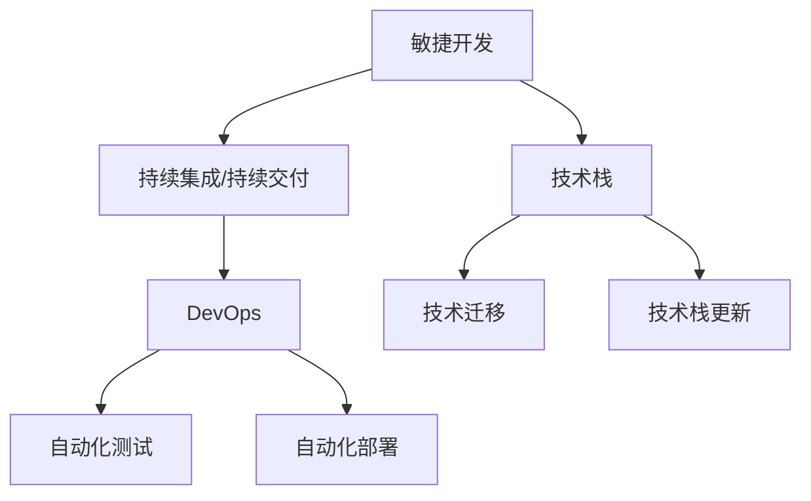

                 

# 程序员如何应对技术升级与变更

在软件开发领域，技术的不断升级和变更已经成为了一种常态。随着软件工程的发展，新的编程语言、框架、库和工具层出不穷，对程序员的技术栈和能力提出了更高的要求。如何有效应对这些技术升级与变更，成为了每位程序员必须面对的挑战。本文将从背景介绍、核心概念、算法原理、项目实践、应用场景、工具和资源推荐等多个方面，深入探讨程序员如何应对技术升级与变更，力求为读者提供全面的技术指导和见解。

## 1. 背景介绍

### 1.1 问题由来
随着计算机技术的发展，软件行业逐渐从瀑布模型转变为敏捷开发、DevOps和持续集成/持续交付(CI/CD)等新范式。技术的快速演进和创新，不仅带来了更多的选择和灵活性，也给软件开发人员带来了前所未有的挑战。如何跟上技术潮流，适应新技术的变化，已成为每个程序员必须面对的重要问题。

### 1.2 问题核心关键点
技术升级与变更的核心关键点在于如何快速学习新技术，并将其应用到实际开发中。具体来说，包括以下几个方面：
1. 学习新技能：了解新技术的特点、优势和应用场景。
2. 适应新技术：掌握新技术的开发方式、架构设计和使用技巧。
3. 迁移旧技能：将旧有的知识和经验迁移到新的技术栈中。
4. 持续更新：不断跟踪技术发展，及时更新自己的技术栈。

## 2. 核心概念与联系

### 2.1 核心概念概述

为更好地理解如何应对技术升级与变更，本节将介绍几个密切相关的核心概念：

- 敏捷开发(Agile Development)：一种迭代、增量、客户驱动的开发方法，通过持续交付高质量软件来满足客户需求。
- 持续集成/持续交付(CI/CD)：将软件开发过程分为持续集成、持续测试和持续部署，加速软件交付速度和质量。
- DevOps：将开发和运维团队紧密结合，通过自动化和协同工作，提升软件交付效率和质量。
- 技术栈(Technology Stack)：指开发团队所使用的一套技术组件和工具，包括编程语言、框架、库、数据库等。
- 技术迁移(Technology Migration)：指将现有系统或应用从一种技术栈迁移到另一种技术栈的过程。
- 技术栈更新(Technology Stack Update)：指在已有技术栈的基础上，引入新技术和工具，提升系统性能和可维护性。

这些核心概念之间的逻辑关系可以通过以下Mermaid流程图来展示：



这个流程图展示了几者之间的内在联系：

1. 敏捷开发和CI/CD相互配合，推动软件的快速迭代和交付。
2. DevOps通过自动化工具和协同工作，提升交付效率和质量。
3. 技术栈是敏捷开发和CI/CD的基础，同时DevOps和自动化工具也依赖于技术栈。
4. 技术迁移和技术栈更新是技术升级的两种形式，前者更强调替换，后者更强调增强。

## 3. 核心算法原理 & 具体操作步骤
### 3.1 算法原理概述

应对技术升级与变更的过程，本质上是一种多目标优化问题。其目标在于通过选择合适的技术栈和工具，最大化软件开发的效率、质量和可维护性。这一过程涉及多个变量，如技术栈的选择、工具的使用、团队的技能匹配等。

形式化地，设 $\mathcal{T}$ 为可选技术栈集合，$\mathcal{S}$ 为可选工具集合，$\mathcal{K}$ 为开发人员技能集合，$\mathcal{Q}$ 为质量度量集合，$\mathcal{E}$ 为效率度量集合，$\mathcal{M}$ 为可维护性度量集合。则目标函数可以表示为：

$$
\mathop{\arg\min}_{t,s,k} \sum_{q \in \mathcal{Q}} q(t,s,k) + \sum_{e \in \mathcal{E}} e(t,s,k) + \sum_{m \in \mathcal{M}} m(t,s,k)
$$

其中 $t$ 表示选择的技术栈，$s$ 表示使用的工具，$k$ 表示开发人员技能。约束条件包括可用资源、技术兼容性、团队能力等。

### 3.2 算法步骤详解

应对技术升级与变更的算法步骤如下：

**Step 1: 需求分析与技术评估**
- 明确项目需求和目标，识别技术升级的必要性和优先级。
- 评估现有技术栈和工具的优缺点，分析升级的可能性与挑战。

**Step 2: 技术选型与决策分析**
- 根据需求和评估结果，列出可选技术栈和工具，并设置相应的评价指标。
- 建立技术选型的多目标优化模型，通过启发式算法或线性规划求解最优解。

**Step 3: 技术迁移与整合**
- 在新的技术栈上构建原型系统，进行功能验证和性能测试。
- 将旧系统和应用逐步迁移到新栈，同时保证业务的连续性和稳定性。

**Step 4: 团队培训与技术推广**
- 对开发团队进行技术培训，提升其对新工具和框架的掌握程度。
- 在团队内部推广新技术，促进知识共享和协同工作。

**Step 5: 持续监控与优化**
- 跟踪新系统的性能和稳定性，根据反馈不断优化技术选型和配置。
- 定期更新技术栈和工具，保持其与行业前沿的同步。

### 3.3 算法优缺点

应对技术升级与变更的方法具有以下优点：
1. 系统性：通过多目标优化，综合考虑技术栈、工具和团队能力，做出更全面的决策。
2. 灵活性：允许根据实际情况调整和优化技术选型，快速适应技术潮流。
3. 持续性：通过持续监控和反馈，保证系统的长期稳定性和性能提升。

同时，该方法也存在一些局限性：
1. 复杂性：多目标优化模型构建和求解过程较为复杂，需要较强的数学和算法基础。
2. 不确定性：技术升级和变更往往伴随不确定性，需要应对预料之外的风险。
3. 学习成本：技术栈和工具的更新需要开发人员不断学习和适应，存在一定的学习成本。

尽管存在这些局限性，但就目前而言，多目标优化的方法仍是应对技术升级与变更的主流范式。未来相关研究的重点在于如何进一步简化模型，提高求解效率，降低学习成本，同时兼顾决策的全面性和灵活性。

### 3.4 算法应用领域

技术升级与变更的方法在软件开发领域已经得到了广泛的应用，覆盖了几乎所有常见任务，例如：

- 前端技术栈更新：从纯HTML/CSS/JS切换到React、Vue等现代前端框架。
- 后端技术栈更新：从单体应用切换到微服务架构，引入Kubernetes、Docker等容器化技术。
- 云平台迁移：从自建服务器迁移到云平台，使用AWS、Azure等云服务。
- DevOps流程优化：引入CI/CD工具链，实现自动化测试和部署，提升交付效率。
- 编程语言和框架切换：从Java切换到Python，从Spring切换到Spring Boot等现代框架。

除了上述这些经典任务外，技术升级与变更还被创新性地应用到更多场景中，如自动化测试、持续监控、性能优化、安全加固等，为软件开发提供更高效、可靠的工具和流程支持。

## 4. 数学模型和公式 & 详细讲解  
### 4.1 数学模型构建

本节将使用数学语言对多目标优化过程进行更加严格的刻画。

设 $t$ 为选择的技术栈，$s$ 为使用的工具，$k$ 为开发人员技能。假设技术栈 $t$ 和工具 $s$ 的性能指标分别为 $p_t$ 和 $p_s$，开发人员技能 $k$ 的性能指标为 $p_k$。目标函数可以表示为：

$$
\mathop{\arg\min}_{t,s,k} \sum_{q \in \mathcal{Q}} q(t,s,k) + \sum_{e \in \mathcal{E}} e(t,s,k) + \sum_{m \in \mathcal{M}} m(t,s,k)
$$

其中 $q_t$、$q_s$、$q_k$ 分别为技术栈、工具和技能的质量度量，$e_t$、$e_s$、$e_k$ 分别为效率度量，$m_t$、$m_s$、$m_k$ 分别为可维护性度量。

### 4.2 公式推导过程

以下我们以软件系统的技术栈更新为例，推导多目标优化问题的求解方法。

设目标函数为 $f(t,s,k)$，约束条件为 $g(t,s,k) \leq 0$ 和 $h(t,s,k) = 0$。则求解多目标优化问题可以转化为求解单目标优化问题，即：

$$
\mathop{\arg\min}_{t,s,k} g(t,s,k) \quad \text{subject to} \quad f(t,s,k) \leq \tau, h(t,s,k) = 0
$$

其中 $\tau$ 为转换后优化问题的上界。

通过引入权重向量 $\omega = [\omega_1,\omega_2,\omega_3]$，将多目标优化问题转化为单目标优化问题：

$$
\mathop{\arg\min}_{t,s,k} \omega_1 f(t,s,k) + \omega_2 g(t,s,k) \quad \text{subject to} \quad h(t,s,k) = 0
$$

其中 $\omega_1$、$\omega_2$ 分别为 $f(t,s,k)$ 和 $g(t,s,k)$ 的权重系数。求解步骤如下：

1. 建立线性规划模型，将 $\omega_1$ 和 $\omega_2$ 设为决策变量。
2. 求解线性规划模型的对偶问题，得到最优解 $(\omega_1^*,\omega_2^*)$。
3. 根据 $(\omega_1^*,\omega_2^*)$ 和目标函数 $f(t,s,k)$，计算 $(\omega_1^*,\omega_2^*)$ 所对应的 $(t^*,s^*,k^*)$。

### 4.3 案例分析与讲解

以微服务架构向云平台迁移为例，分析如何通过多目标优化方法选择最适合的技术栈和工具。

**需求分析**：
- 提升系统扩展性和可用性
- 缩短部署和维护周期
- 降低运维成本

**技术选型**：
- 可选技术栈：单体应用、微服务、云原生
- 可选工具：Kubernetes、Docker、Spring Boot、Spring Cloud、Istio

**约束条件**：
- 技术兼容性：现有系统是否能够平滑迁移到新栈
- 团队能力：现有团队是否具备新栈的开发能力
- 资源限制：现有硬件和网络资源是否满足新栈的要求

**目标函数**：
- 质量指标：系统可用性、扩展性、性能
- 效率指标：部署时间、维护时间、故障恢复时间
- 可维护性指标：代码质量、监控指标、故障率

通过多目标优化模型，选择合适的技术栈和工具，并逐步实施迁移策略。迁移过程中，注意新旧系统的兼容性和数据迁移，同时进行性能测试和故障恢复演练，确保系统的稳定性和可维护性。

## 5. 项目实践：代码实例和详细解释说明
### 5.1 开发环境搭建

在进行技术升级与变更的实践前，我们需要准备好开发环境。以下是使用Python进行DevOps开发的环境配置流程：

1. 安装Anaconda：从官网下载并安装Anaconda，用于创建独立的Python环境。

2. 创建并激活虚拟环境：
```bash
conda create -n devops-env python=3.8 
conda activate devops-env
```

3. 安装DevOps工具：
```bash
conda install anaconda-client
conda install cloudformation
conda install click
conda install jinja2
```

4. 配置云平台API访问：
```bash
echo 'AWS_ACCESS_KEY_ID=your_aws_access_key_id' >> ~/.bash_profile
echo 'AWS_SECRET_ACCESS_KEY=your_aws_secret_access_key' >> ~/.bash_profile
echo 'AWS_REGION=your_aws_region' >> ~/.bash_profile
source ~/.bash_profile
```

5. 配置云平台账户：
```bash
aws configure
```

完成上述步骤后，即可在`devops-env`环境中开始DevOps实践。

### 5.2 源代码详细实现

这里我们以DevOps流程优化为例，给出使用DevOps工具链进行CI/CD流程开发的PyTorch代码实现。

首先，定义CI/CD流程的配置文件：

```python
from collections import defaultdict
from botocore.config import Config

CI = {
    'version': '2',
    'triggers': [
        {'name': 'CodeCommitTrigger', 'type': 'CodeCommitEvent', 'repo': 'your-code-repo', 'event': 'push'}
    ],
    'steps': [
        {'name': 'PullRequestRecovery', 'fn': 'recover_pr', 'inputs': {}},
        {'name': 'Build', 'fn': 'build', 'inputs': {}},
        {'name': 'Test', 'fn': 'test', 'inputs': {}},
        {'name': 'Deploy', 'fn': 'deploy', 'inputs': {}}
    ]
}
```

然后，定义CI/CD流程的各个步骤函数：

```python
def recover_pr(inputs):
    # 从GitHub Pull Request中恢复旧的CI/CD流程
    pass

def build(inputs):
    # 构建和打包软件
    pass

def test(inputs):
    # 运行自动化测试
    pass

def deploy(inputs):
    # 部署到生产环境
    pass
```

接着，定义CI/CD流程的自动化配置：

```python
def configure_aws(cloudformation, ci_config):
    stack_name = 'your-ci-stack'
    template_url = 'https://s3-us-west-1.amazonaws.com/your-ci-template/ci.yaml'
    cloudformation.create_stack(StackName=stack_name,
                               template_url=template_url,
                               template_body=ci_config,
                               capabilities=['CAPABILITY_NAMED_IAM'])
    return cloudformation.describe_stacks(StackName=stack_name)['Stacks'][0]
```

最后，启动CI/CD流程并测试其效果：

```python
cloudformation = boto3.client('cloudformation')
configure_aws(cloudformation, CI)
stack = configure_aws(cloudformation, CI)
```

以上就是使用Python进行DevOps流程优化的完整代码实现。可以看到，通过使用Boto3和CloudFormation等AWS服务，可以方便地构建和部署CI/CD流水线，提升软件交付的效率和质量。

### 5.3 代码解读与分析

让我们再详细解读一下关键代码的实现细节：

**CI配置文件**：
- `'version': '2'`：指定CI/CD配置文件版本。
- `'triggers':`：指定触发流程的事件类型和参数。
- `'steps':`：定义流程执行的各个步骤及其调用函数。

**CI步骤函数**：
- `recover_pr(inputs)`: 恢复旧的CI/CD流程，准备新流程的迁移。
- `build(inputs)`: 构建和打包软件，进行版本管理。
- `test(inputs)`: 运行自动化测试，确保代码质量。
- `deploy(inputs)`: 部署到生产环境，进行系统上线。

**配置AWS工具**：
- `configure_aws(cloudformation, ci_config)`：使用AWS CloudFormation将CI配置文件部署到指定堆栈。

可以看到，通过上述步骤，我们可以使用Python和AWS服务快速搭建和优化CI/CD流程，提升软件开发的效率和质量。

当然，工业级的系统实现还需考虑更多因素，如代码的版本控制、自动化测试的覆盖率、持续监控的配置等。但核心的DevOps范式基本与此类似。

## 6. 实际应用场景
### 6.1 智能客服系统

基于DevOps的智能客服系统构建，可以显著提升客服系统的响应速度和处理效率。传统客服系统往往依赖人工处理，高峰期响应缓慢，且无法24小时在线服务。而基于DevOps的智能客服系统，可以通过自动化流程，实现全天候自动回复，提升客户满意度。

在技术实现上，可以收集企业内部的历史客服对话记录，构建DevOps流水线，自动化处理客户问题。流水线中的各个步骤，如自动化测试、代码部署、性能监控等，均通过CI/CD工具链实现，确保系统稳定性和快速迭代。

### 6.2 金融舆情监测

金融领域需要实时监测市场舆论动向，以便及时应对负面信息传播，规避金融风险。传统的人工监测方式成本高、效率低，难以应对网络时代海量信息爆发的挑战。基于DevOps的金融舆情监测系统，可以通过自动化流程，实时抓取网络文本数据，自动分析舆情变化趋势，一旦发现负面信息激增等异常情况，系统便会自动预警，帮助金融机构快速应对潜在风险。

在技术实现上，可以搭建DevOps数据管道，自动化抓取和分析金融舆情数据，实时监测市场动态。同时，可以通过容器化技术，将分析模型和数据处理逻辑封装为微服务，灵活扩展和部署。

### 6.3 个性化推荐系统

当前的推荐系统往往只依赖用户的历史行为数据进行物品推荐，无法深入理解用户的真实兴趣偏好。基于DevOps的个性化推荐系统，可以通过自动化流程，实时收集和分析用户行为数据，构建DevOps流水线，自动生成推荐结果，提升推荐精准度。

在技术实现上，可以搭建DevOps流水线，自动化收集用户行为数据，进行数据清洗和分析，构建推荐模型，并自动化生成推荐结果。流水线中的各个步骤，如数据预处理、模型训练、推荐算法等，均通过CI/CD工具链实现，确保系统稳定性和高效性。

### 6.4 未来应用展望

随着DevOps技术的不断发展，基于DevOps范式的人工智能应用将得到广泛应用，为各行各业带来变革性影响。

在智慧医疗领域，基于DevOps的医疗数据分析和推荐系统，可以实时监测患者健康数据，自动生成诊断报告和推荐治疗方案，辅助医生诊疗。

在智能教育领域，基于DevOps的个性化学习平台，可以实时收集和分析学生学习数据，自动生成个性化学习内容，提升教学效果。

在智慧城市治理中，基于DevOps的城市事件监测和应急管理系统，可以实时分析城市事件数据，自动预警和处理各类突发事件，提高城市管理的自动化和智能化水平。

此外，在企业生产、社会治理、文娱传媒等众多领域，基于DevOps的AI应用也将不断涌现，为经济社会发展注入新的动力。

## 7. 工具和资源推荐
### 7.1 学习资源推荐

为了帮助开发者系统掌握DevOps的理论基础和实践技巧，这里推荐一些优质的学习资源：

1. 《DevOps: Automating the Software Delivery Pipeline》书籍：由Gene Kim、Patrick Debois等作者合著，系统介绍了DevOps的概念、实践和工具，是DevOps学习的经典入门书籍。

2. 《Continuous Delivery: Reliable Software Releases through Build, Test, and Deployment Automation》书籍：由Jez Humble、David Farley等作者合著，介绍了CI/CD的自动化流程和工具，是DevOps实践的必读书籍。

3. 《The Phoenix Project》书籍：由Gene Kim、Gene Winchester等作者合著，通过虚拟企业的案例，生动展示了DevOps在实际项目中的应用，适合初学者和实践者阅读。

4. DevOps学习网站：如DZone、Red Hat等，提供大量DevOps的实践经验和最佳实践，适合开发者学习和参考。

5. DevOps开源项目：如Kubernetes、Docker、Jenkins等，是DevOps实践的重要工具，通过参与开源项目，可以深入了解DevOps的实际应用。

通过对这些资源的学习实践，相信你一定能够快速掌握DevOps的理论基础和实践技巧，并在实际开发中取得成功。

### 7.2 开发工具推荐

高效的开发离不开优秀的工具支持。以下是几款用于DevOps开发的常用工具：

1. Jenkins：开源的自动化流水线管理工具，支持丰富的插件和扩展，适合构建复杂的CI/CD流程。

2. GitLab：集成代码托管、CI/CD、项目管理于一体的DevOps平台，提供强大的自动化工具和集成能力。

3. Kubernetes：开源的容器编排工具，支持大规模分布式系统，提供高性能、高可用性的自动化部署和运维。

4. Docker：开源的容器化平台，支持跨平台部署，提供轻量级、可移植的运行环境。

5. Ansible：开源的自动化运维工具，支持多种自动化任务，适合快速部署和管理大规模系统。

6. Terraform：开源的基础设施即代码工具，支持多种云平台和数据中心，提供自动化配置和管理能力。

合理利用这些工具，可以显著提升DevOps任务的开发效率，加速系统交付的步伐。

### 7.3 相关论文推荐

DevOps技术的发展源于学界的持续研究。以下是几篇奠基性的相关论文，推荐阅读：

1. "Continuous Delivery: Software Engineering Practices to Improve System Quality"：Debois、Farley等作者的研究，介绍了CI/CD和DevOps的基本概念和实践方法。

2. "DevOps and the Culture of Continuous Improvement"：Hassani、Al-Daery等作者的研究，探讨了DevOps文化和持续改进的关系，强调了人为因素在DevOps中的重要性。

3. "Continuous Deployment at Netflix"：Reynolds、Fernley等作者的研究，介绍了Netflix如何在大规模分布式系统中实现持续部署。

4. "Cloud-Native Applications and Microservices Architecture"：Richardson、Starbird等作者的研究，介绍了微服务和云原生架构的基本概念和设计原则。

5. "Software Architecture for Agile Systems Development"：Hoctor、Avison等作者的研究，介绍了软件架构与敏捷开发的关系，强调了架构在DevOps中的作用。

这些论文代表了大规模软件开发和DevOps技术的发展脉络。通过学习这些前沿成果，可以帮助研究者把握学科前进方向，激发更多的创新灵感。

## 8. 总结：未来发展趋势与挑战

### 8.1 总结

本文对基于DevOps的大语言模型微调方法进行了全面系统的介绍。首先阐述了DevOps的基本概念和实践基础，明确了DevOps在提升软件开发效率和质量方面的独特价值。其次，从原理到实践，详细讲解了DevOps的数学模型和关键步骤，给出了DevOps任务开发的完整代码实例。同时，本文还广泛探讨了DevOps方法在智能客服、金融舆情、个性化推荐等多个行业领域的应用前景，展示了DevOps范式的巨大潜力。此外，本文精选了DevOps技术的各类学习资源，力求为读者提供全方位的技术指引。

通过本文的系统梳理，可以看到，基于DevOps范式的大语言模型微调方法，正在成为软件开发和人工智能领域的重要范式，极大地提升了系统开发的效率和质量。未来，伴随DevOps技术的持续演进，基于DevOps的人工智能应用也将得到更加广泛的应用，为软件行业的数字化转型升级提供新的技术路径。

### 8.2 未来发展趋势

展望未来，DevOps技术将呈现以下几个发展趋势：

1. 自动化程度提升。随着自动化工具和流程的不断完善，DevOps将实现更加高效、可靠的自动化交付。

2. 数据驱动优化。通过大数据和AI技术，DevOps将实现更科学、精准的流程优化和系统管理。

3. 多云集成优化。DevOps将支持多云环境下的资源管理和服务编排，实现跨云平台的无缝集成。

4. 持续学习与改进。DevOps将具备持续学习和自我改进的能力，通过不断迭代优化流程，提升系统稳定性和性能。

5. 安全与合规。DevOps将更加重视安全与合规性，通过自动化安全检测和合规检查，保障系统的安全性与可靠性。

6. 社区与协作。DevOps将促进开源社区的协作，共享最佳实践和开源工具，共同推动软件工程的发展。

以上趋势凸显了DevOps技术的广阔前景。这些方向的探索发展，必将进一步提升DevOps系统的效率和质量，为软件开发带来更多创新的可能。

### 8.3 面临的挑战

尽管DevOps技术已经取得了显著成就，但在迈向更加智能化、普适化应用的过程中，它仍面临着诸多挑战：

1. 复杂性增加。DevOps流程和工具的复杂性逐渐增加，如何简化流程、降低使用门槛，将是一大难题。

2. 技术栈快速变化。新的技术和工具层出不穷，如何保持技术栈的更新和适配，需要持续学习和跟进。

3. 团队协作问题。DevOps强调协作和自动化，如何平衡人工干预和自动化，提升团队的协作效率，仍需不断探索。

4. 持续监控和故障处理。系统复杂度增加后，如何实现更精准的持续监控和故障处理，保证系统的稳定性和可用性，将是重要的研究方向。

5. 资源消耗。DevOps流程和工具需要大量的资源支持，如何优化资源使用，降低系统成本，还需要更多的技术创新。

6. 安全性问题。DevOps自动化流程的错误可能导致严重的安全问题，如何保障系统安全，减少人为操作风险，将是重要的研究方向。

正视DevOps面临的这些挑战，积极应对并寻求突破，将使DevOps技术走向成熟的必然之路。相信随着学界和产业界的共同努力，这些挑战终将一一被克服，DevOps技术必将在软件开发和人工智能领域发挥更大的作用。

### 8.4 研究展望

面对DevOps技术所面临的挑战，未来的研究需要在以下几个方面寻求新的突破：

1. 探索更高效的自动化工具和流程。开发更智能、更易用的自动化工具，降低使用门槛，提升开发效率。

2. 研究更科学的多目标优化模型。通过引入更多指标和约束条件，提高模型求解的全面性和准确性。

3. 融合大数据和AI技术。利用大数据和AI技术，提升DevOps流程的科学性和决策的精准性。

4. 引入持续学习与改进机制。使DevOps系统具备持续学习和自我改进的能力，适应技术潮流和业务需求的变化。

5. 强化安全性与合规性。引入自动化安全检测和合规检查，保障系统的安全性和合规性。

6. 推动开源社区的发展。鼓励开源社区的协作和共享，促进DevOps技术的发展和普及。

这些研究方向的探索，必将引领DevOps技术迈向更高的台阶，为软件开发带来更多创新的可能。面向未来，DevOps技术还需要与其他技术进行更深入的融合，如人工智能、区块链、物联网等，共同推动软件工程的发展。只有勇于创新、敢于突破，才能不断拓展DevOps技术的边界，让软件开发更加高效、可靠和智能。

## 9. 附录：常见问题与解答

**Q1：DevOps如何提升软件开发的效率？**

A: DevOps通过自动化流程和持续集成/持续交付(CI/CD)等技术，实现了软件开发的全流程自动化，大幅缩短了软件从开发到交付的时间。具体来说，DevOps可以：

1. 自动化构建和测试：通过自动化构建和测试流程，快速发现和修复代码中的错误，保证软件质量。
2. 自动化部署：通过自动化部署工具，快速将代码部署到生产环境，缩短交付周期。
3. 持续监控：通过持续监控工具，实时跟踪系统性能和稳定性，快速响应问题。
4. 持续反馈：通过持续反馈机制，收集用户和开发者的反馈，持续优化软件功能和性能。

通过上述步骤，DevOps显著提升了软件开发的效率和质量，使团队能够更快地响应市场变化，快速迭代优化产品。

**Q2：DevOps与传统软件开发流程有何不同？**

A: DevOps与传统软件开发流程的主要不同在于其持续集成和持续交付的理念：

1. 持续集成：通过自动化流程，频繁地将代码集成到共享仓库中，进行自动化构建和测试，保证代码的稳定性和一致性。
2. 持续交付：通过自动化流程，快速地将代码部署到生产环境，实现快速交付和部署。
3. 自动化反馈：通过持续监控和自动化反馈机制，快速收集用户和开发者的反馈，持续优化软件功能和性能。

传统软件开发流程则依赖于瀑布模型，强调阶段性交付和逐步优化，开发周期较长，无法快速响应市场需求和变化。

**Q3：DevOps对团队协作有哪些要求？**

A: DevOps强调团队协作和自动化，对团队协作有以下要求：

1. 多学科团队：DevOps团队通常包括开发、运维和安全等不同领域的专家，需要协同工作。
2. 自动化工具：DevOps需要依赖自动化工具和流程，提升工作效率和质量。
3. 持续沟通：DevOps需要持续的沟通和协作，保证信息透明和一致。
4. 自动化测试：DevOps需要依赖自动化测试工具，快速发现和修复问题。
5. 持续监控：DevOps需要持续监控系统性能和稳定性，快速响应问题。

通过上述协作机制，DevOps团队能够高效协同，快速响应市场变化，提升软件开发的效率和质量。

**Q4：如何应对DevOps带来的挑战？**

A: 应对DevOps带来的挑战需要综合考虑多个方面：

1. 持续学习和跟进：DevOps技术和工具不断演进，开发人员需要持续学习和跟进，保持技术栈的更新。
2. 简化流程和工具：简化流程和工具的使用，降低复杂性，提升使用效率。
3. 强化安全性与合规性：引入自动化安全检测和合规检查，保障系统的安全性和合规性。
4. 推动开源社区的发展：鼓励开源社区的协作和共享，促进DevOps技术的发展和普及。

通过上述措施，可以应对DevOps带来的挑战，推动DevOps技术的发展和应用。

**Q5：如何选择合适的DevOps工具？**

A: 选择合适的DevOps工具需要考虑多个因素：

1. 功能和特性：选择功能和特性符合实际需求的工具，避免功能过剩或不足。
2. 兼容性和集成：选择与现有系统兼容和集成的工具，避免引入额外的复杂性。
3. 社区和支持：选择社区活跃和支持良好的工具，确保使用过程中的问题能够得到及时解决。
4. 成本和资源消耗：考虑工具的成本和资源消耗，选择适合团队和项目规模的工具。
5. 灵活性和扩展性：选择灵活和可扩展的工具，能够适应项目需求的变化。

通过上述选择原则，可以有效选择合适的DevOps工具，提升开发效率和质量。

---

作者：禅与计算机程序设计艺术 / Zen and the Art of Computer Programming

