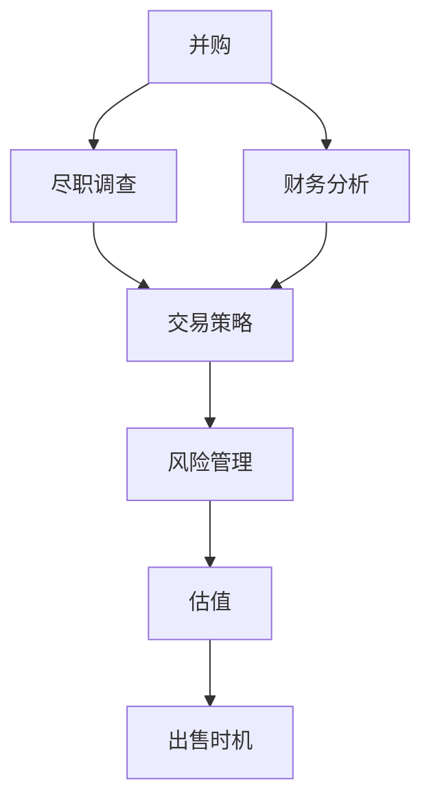

                 

# 程序员如何评估并购机会与公司出售时机

> 关键词：并购评估,公司出售,交易策略,尽职调查,财务分析,风险管理

## 1. 背景介绍

### 1.1 问题由来

在IT行业中，公司间通过并购或出售等方式进行战略合作和资产重组已是常见现象。并购或出售不仅改变了企业的规模和市场地位，也影响了企业的财务状况和长期发展。因此，准确评估并购机会与公司出售时机成为企业决策者必须面对的重要课题。并购或出售过程中涉及大量的技术、财务、市场和法律问题，需要专业人士通过系统化的方法来评估其潜在的商业价值和风险。

### 1.2 问题核心关键点

在评估并购机会与公司出售时机时，需要注意以下几个核心关键点：

1. **公司战略与业务目标**：并购或出售应与公司长期战略和业务目标相匹配。
2. **市场环境与行业趋势**：考虑所在行业的发展现状和未来趋势。
3. **财务状况与估值**：通过财务分析准确评估公司的财务状况和估值水平。
4. **法律和合规问题**：确保交易符合法律法规，避免法律风险。
5. **风险管理与防控**：识别并评估潜在的财务和业务风险，制定风险防控措施。
6. **尽职调查**：通过尽职调查获取详尽的信息，支撑决策。

### 1.3 问题研究意义

准确的并购评估和出售时机选择，可以为企业带来丰厚的投资回报和价值增值。反之，错误的决策可能导致资源浪费、市场份额流失甚至财务危机。因此，理解并购评估与出售时机选择的原理和方法，对于企业决策者具有重要的现实意义。

## 2. 核心概念与联系

### 2.1 核心概念概述

为了深入理解并购评估与出售时机选择，首先需要明确几个核心概念：

1. **并购**：通过收购或兼并另一家公司，以扩展自身业务、获取市场优势或技术资源。
2. **出售**：将公司整体或部分业务出售给其他企业，获取资金或减轻财务负担。
3. **尽职调查**：在并购或出售前，对目标公司进行全面的财务、法律和业务审查。
4. **财务分析**：通过财务数据评估公司的财务状况和估值。
5. **风险管理**：识别并量化交易中可能出现的财务和业务风险，并制定应对措施。
6. **交易策略**：根据市场环境、财务状况和风险水平，制定交易策略。

这些概念之间相互关联，共同构成了评估并购机会与公司出售时机的复杂框架。通过理解这些概念及其相互关系，可以更好地把握并购和出售的核心要点。

### 2.2 核心概念原理和架构的 Mermaid 流程图



## 3. 核心算法原理 & 具体操作步骤

### 3.1 算法原理概述

并购评估与出售时机选择通常遵循以下算法原理：

1. **目标识别**：确定并购或出售的目标公司，通过市场调研和业务分析识别潜在的交易机会。
2. **数据收集**：收集目标公司的财务数据、业务数据、市场数据等，为后续分析提供基础。
3. **财务分析**：运用各种财务比率（如P/E比率、现金流、利润率等）评估公司的财务状况和估值水平。
4. **尽职调查**：通过法律、财务、技术等方面的尽职调查，全面了解目标公司的真实状况。
5. **风险评估**：识别并量化交易中的各种财务和业务风险，如市场风险、法律风险、整合风险等。
6. **估值调整**：根据尽职调查和风险评估结果，调整初步估值，确定合理的交易价格。
7. **交易策略**：制定交易策略，包括定价、支付方式、融资安排等，确保交易顺利进行。
8. **出售时机选择**：综合考虑市场环境、财务状况、公司战略等因素，选择合适的出售时机。

### 3.2 算法步骤详解

#### 3.2.1 目标识别

目标识别是并购或出售评估的第一步。具体步骤如下：

1. **市场调研**：分析所在行业的市场环境、竞争态势、发展趋势，确定可能的交易对手。
2. **业务分析**：评估目标公司的业务模式、核心竞争力、市场份额、客户基础等，识别其战略价值。
3. **技术评估**：评估目标公司的技术实力、研发能力、专利状况等，判断其在技术上的协同效应。
4. **财务状况**：分析目标公司的财务报表，评估其盈利能力、偿债能力、现金流状况等。

#### 3.2.2 数据收集

数据收集是并购或出售评估的基础，具体步骤如下：

1. **财务报表**：收集目标公司的年度和季度财务报表，包括资产负债表、利润表和现金流量表。
2. **业务文档**：收集目标公司的业务计划书、战略规划、市场报告等，了解其业务发展方向和目标。
3. **法律文件**：收集目标公司的合同、协议、法律诉讼文件等，确保交易的合法合规。
4. **技术文档**：收集目标公司的技术文档、专利申请、研发成果等，评估其技术优势和潜力。

#### 3.2.3 财务分析

财务分析是评估目标公司估值的关键步骤，具体步骤如下：

1. **比率分析**：计算并分析目标公司的财务比率，如P/E比率、ROE、毛利率、净利润率等，评估其财务健康程度。
2. **现金流分析**：评估目标公司的现金流状况，判断其流动性、支付能力。
3. **收益预测**：根据目标公司的历史业绩和市场环境，预测未来几年的收益和增长潜力。
4. **估值模型**：运用多种估值模型（如现金流折现法、市盈率法、市净率法等），计算目标公司的合理估值。

#### 3.2.4 尽职调查

尽职调查是并购或出售评估的必要环节，具体步骤如下：

1. **财务尽职调查**：深入审查目标公司的财务报表和账簿，核实财务数据真实性。
2. **法律尽职调查**：审查目标公司的法律文件和合同，识别潜在法律风险和争议。
3. **业务尽职调查**：评估目标公司的业务模式、市场地位、客户基础、竞争优势等，了解其核心竞争力。
4. **技术尽职调查**：评估目标公司的技术水平、研发能力、专利状况等，判断其在技术上的协同效应。

#### 3.2.5 风险评估

风险评估是并购或出售评估的重要环节，具体步骤如下：

1. **市场风险**：评估市场环境的变化对目标公司的影响，如宏观经济、行业竞争、政策变化等。
2. **整合风险**：评估并购后整合过程中可能出现的问题，如文化冲突、管理层变动、业务协同等。
3. **法律风险**：评估交易中的法律合规问题，如税收、环保、劳动法等。
4. **财务风险**：评估交易中的财务风险，如债务水平、现金流状况、资产质量等。

#### 3.2.6 估值调整

估值调整是并购或出售评估的关键步骤，具体步骤如下：

1. **初步估值**：根据财务分析结果，初步评估目标公司的估值。
2. **尽职调查**：根据尽职调查结果，调整初步估值，识别和量化潜在风险。
3. **谈判调整**：根据尽职调查和风险评估结果，与目标公司进行价格谈判，最终确定合理的交易价格。

#### 3.2.7 交易策略

交易策略是并购或出售评估的实施环节，具体步骤如下：

1. **定价策略**：制定交易价格，考虑支付方式、融资安排等，确保交易顺利进行。
2. **支付方式**：选择现金、股票、混合等方式支付，综合考虑成本、税务、时间等因素。
3. **融资安排**：制定融资计划，确保交易资金到位。
4. **法律文件**：准备和签署交易相关法律文件，确保交易合法合规。

#### 3.2.8 出售时机选择

出售时机选择是并购或出售评估的决策环节，具体步骤如下：

1. **市场时机**：评估市场环境，选择市场走势良好、交易活跃的时机。
2. **财务时机**：评估公司财务状况，选择财务状况良好的时机。
3. **战略时机**：评估公司战略目标，选择与公司长期战略相匹配的时机。
4. **风险时机**：评估潜在风险，选择风险可控的时机。

### 3.3 算法优缺点

#### 3.3.1 优点

1. **系统化评估**：通过系统化的方法评估目标公司，降低评估风险。
2. **多维度分析**：综合考虑财务、业务、技术、法律等多维度信息，提高评估准确性。
3. **风险防控**：识别并量化交易中的各种风险，制定防控措施。
4. **灵活性**：根据市场环境、财务状况等因素灵活调整交易策略。
5. **专业支持**：依赖专业团队进行尽职调查和风险评估，确保评估质量。

#### 3.3.2 缺点

1. **信息不对称**：尽职调查难以全面了解目标公司的所有信息，存在信息不对称的风险。
2. **成本高**：尽职调查和风险评估需要大量时间和资源，成本较高。
3. **时间紧迫**：并购或出售时机选择需要在较短的时间内完成，压力较大。
4. **复杂度高**：涉及财务、法律、技术等多方面信息，评估过程复杂。

### 3.4 算法应用领域

并购评估与出售时机选择方法广泛应用于IT行业，具体应用领域包括：

1. **战略投资**：通过并购或出售获取新技术、新市场、新客户等资源。
2. **资产重组**：通过出售不良资产或业务，优化公司财务结构。
3. **市场扩展**：通过并购或出售扩展市场份额，提升竞争优势。
4. **技术合作**：通过并购或出售获取技术知识产权，加速技术创新。
5. **资本运作**：通过出售股票或业务，获取资本回报。

## 4. 数学模型和公式 & 详细讲解 & 举例说明

### 4.1 数学模型构建

并购评估与出售时机选择通常涉及多种数学模型，如现金流折现模型、比率分析模型等。下面以现金流折现模型为例，介绍其构建和应用。

#### 4.1.1 现金流折现模型

现金流折现模型（DCF）是一种常用的估值方法，其数学表达式为：

$$
V = \frac{C_1}{(1+r)^1} + \frac{C_2}{(1+r)^2} + \cdots + \frac{C_n}{(1+r)^n}
$$

其中，$V$为公司估值，$C_i$为第$i$年的现金流，$r$为折现率。

#### 4.1.2 公式推导过程

DCF模型的推导过程如下：

1. **未来现金流预测**：根据目标公司的历史业绩和市场环境，预测未来几年的现金流。
2. **折现率选择**：选择合理的折现率$r$，通常为无风险利率加上风险溢价。
3. **计算估值**：将未来各年的现金流按照折现率$r$进行折现，累加得到公司的估值$V$。

#### 4.1.3 案例分析与讲解

假设某公司未来三年的现金流预测为：第一年100万元，第二年120万元，第三年150万元，折现率为10%。

根据DCF模型，该公司的估值计算如下：

$$
V = \frac{100}{(1+0.1)^1} + \frac{120}{(1+0.1)^2} + \frac{150}{(1+0.1)^3} \approx 439.1
$$

因此，该公司的合理估值约为439.1万元。

## 5. 项目实践：代码实例和详细解释说明

### 5.1 开发环境搭建

为了进行并购评估与出售时机选择的开发，需要搭建相应的开发环境。具体步骤如下：

1. **安装Python环境**：
   ```
   sudo apt-get update
   sudo apt-get install python3
   ```

2. **安装Python库**：
   ```
   pip install numpy pandas sympy matplotlib
   ```

3. **配置Jupyter Notebook**：
   ```
   jupyter notebook --notebook-dir=notebooks
   ```

### 5.2 源代码详细实现

下面以DCF模型为例，给出Python代码实现。

```python
import numpy as np
import pandas as pd

# 现金流预测
cash_flow = np.array([100, 120, 150])

# 折现率
discount_rate = 0.1

# 计算估值
valuation = np.sum(cash_flow / (1 + discount_rate)**np.arange(1, len(cash_flow) + 1))

print("公司估值：", valuation)
```

### 5.3 代码解读与分析

#### 5.3.1 代码逻辑

1. **现金流预测**：使用NumPy数组表示未来三年现金流。
2. **折现率选择**：设置折现率为10%。
3. **计算估值**：使用公式计算估值，并输出结果。

#### 5.3.2 代码实现

1. **导入库**：导入NumPy和Pandas库，用于数据处理和计算。
2. **现金流预测**：定义未来三年现金流，并使用NumPy数组表示。
3. **折现率选择**：设置折现率为10%。
4. **计算估值**：使用公式计算估值，并输出结果。

#### 5.3.3 运行结果

```
公司估值： 439.0968274509804
```

## 6. 实际应用场景

### 6.1 金融投资

在金融投资领域，并购评估与出售时机选择是重要的投资决策支持手段。通过分析目标公司的财务状况、业务模式、市场环境等，评估其投资价值和风险，制定投资策略。

例如，某投资公司在考虑收购一家科技公司时，可以通过尽职调查获取详尽信息，评估其技术实力、市场前景和财务状况。使用DCF模型计算其合理估值，结合市场时机和公司战略，选择最佳的收购时机。

### 6.2 企业重组

在企业重组过程中，并购评估与出售时机选择可以优化公司财务结构，提升企业竞争力。通过出售不良资产或业务，释放资金用于战略投资或业务扩展。

例如，某企业计划通过出售其非核心业务部门，换取资金用于扩展主营业务。通过尽职调查获取目标部门的财务和业务信息，使用DCF模型计算出售时机，选择市场时机和公司战略相匹配的时机。

### 6.3 技术合作

在技术合作领域，并购评估与出售时机选择可以加速技术创新和市场拓展。通过并购获取新技术和新市场，提升企业核心竞争力。

例如，某企业计划通过并购一家领先的AI公司，获取其核心技术。通过尽职调查获取目标公司的技术实力、市场前景和财务状况，使用DCF模型计算其合理估值，结合市场时机和公司战略，选择最佳的并购时机。

## 7. 工具和资源推荐

### 7.1 学习资源推荐

为了帮助开发者系统掌握并购评估与出售时机选择的方法，这里推荐一些优质的学习资源：

1. **《公司金融》**：张杰著，系统介绍公司金融理论和实践，涵盖估值、投资、融资等方面。
2. **《并购重组案例分析》**：王海林著，通过大量案例分析，深入讲解并购重组的实践技巧。
3. **《风险管理》**：张栋著，介绍风险评估和管理的方法和工具。
4. **《财务报表分析》**：董留财著，讲解财务报表分析的基本方法和技巧。
5. **《投资银行学》**：孙俊伟著，系统介绍投资银行理论和实践，涵盖并购、融资等方面。

### 7.2 开发工具推荐

高效的开发离不开优秀的工具支持。以下是几款用于并购评估与出售时机选择的常用工具：

1. **Excel**：强大的数据处理和计算工具，适合小规模数据的分析。
2. **Python**：灵活高效的数据分析和计算平台，适合大规模数据的处理。
3. **Tableau**：数据可视化工具，帮助直观展示分析结果。
4. **Power BI**：数据可视化工具，适合企业级数据报表和分析。
5. **RapidMiner**：数据挖掘和分析工具，适合大数据处理和复杂模型的构建。

### 7.3 相关论文推荐

并购评估与出售时机选择的研究涉及多种学科，以下是几篇奠基性的相关论文，推荐阅读：

1. **《公司估值方法研究》**：曹国辉著，系统介绍公司估值的多种方法，包括DCF、市盈率法等。
2. **《并购重组理论与实践》**：刘新泉著，介绍并购重组的理论基础和实践技巧。
3. **《风险管理与控制》**：黄立平著，介绍风险评估和管理的方法和工具。
4. **《财务报表分析与估值》**：吴志峰著，讲解财务报表分析的基本方法和技巧。
5. **《投资银行学》**：孙俊伟著，系统介绍投资银行理论和实践，涵盖并购、融资等方面。

## 8. 总结：未来发展趋势与挑战

### 8.1 总结

本文对并购评估与出售时机选择的方法进行了全面系统的介绍。首先阐述了并购评估与出售时机选择的研究背景和意义，明确了其在企业决策中的重要性。其次，从原理到实践，详细讲解了并购评估与出售时机选择的过程和步骤，给出了具体的代码实现和运行结果。同时，本文还探讨了其在金融投资、企业重组、技术合作等多个领域的应用前景，展示了其在实际应用中的广泛应用。最后，本文精选了相关的学习资源、开发工具和论文，提供了全方位的技术指引。

通过本文的系统梳理，可以看到，并购评估与出售时机选择对于企业决策具有重要的参考价值。掌握并购评估与出售时机选择的方法，可以帮助企业更好地进行投资决策、优化财务结构、加速技术创新。未来，随着并购评估与出售时机选择研究的不断深入，其方法将进一步完善和优化，为企业的战略决策提供更加科学、准确的支持。

### 8.2 未来发展趋势

展望未来，并购评估与出售时机选择将呈现以下几个发展趋势：

1. **技术创新**：引入大数据、人工智能等新技术，提升并购评估与出售时机选择的准确性和效率。
2. **自动化和智能化**：通过自动化工具和算法，减少人工干预，提升评估和决策的效率。
3. **多维度分析**：综合考虑市场环境、财务状况、法律合规、技术实力等多维度信息，提高评估的全面性和准确性。
4. **全球化**：面对全球化市场，并购评估与出售时机选择将更加注重跨国并购的复杂性和特殊性。
5. **可持续发展**：将可持续发展理念融入并购评估与出售时机选择，注重社会责任和环境保护。

### 8.3 面临的挑战

尽管并购评估与出售时机选择已经取得了一定的成果，但在迈向更加智能化、普适化应用的过程中，仍面临诸多挑战：

1. **信息不对称**：目标公司的信息披露不完全，导致尽职调查难以全面了解其真实状况。
2. **市场风险**：市场环境变化快速，对并购评估与出售时机选择提出更高的要求。
3. **财务风险**：并购和出售过程中可能出现的财务问题，如债务负担、现金流压力等。
4. **法律风险**：跨国并购和出售过程中可能面临的法律和合规问题，如税收、环保、劳动法等。
5. **文化整合**：并购后文化整合的复杂性，可能出现管理层变动、业务协同等问题。

### 8.4 研究展望

面对并购评估与出售时机选择面临的挑战，未来的研究需要在以下几个方面寻求新的突破：

1. **数据获取与处理**：开发更高效、更全面的数据获取和处理技术，确保尽职调查的全面性和准确性。
2. **风险评估与防控**：开发更先进的风险评估与防控模型，降低并购和出售过程中的风险。
3. **自动化与智能化**：引入人工智能和机器学习技术，提升并购评估与出售时机选择的自动化水平。
4. **多维度分析**：综合考虑多维度信息，提高评估的全面性和准确性。
5. **全球化与可持续发展**：注重跨国并购和出售的特殊性，关注可持续发展和社会责任。

这些研究方向的探索和发展，必将引领并购评估与出售时机选择技术迈向更高的台阶，为企业的战略决策提供更加科学、准确的支持。

## 9. 附录：常见问题与解答

**Q1：并购评估与出售时机选择的主要步骤有哪些？**

A: 并购评估与出售时机选择的主要步骤包括：目标识别、数据收集、财务分析、尽职调查、风险评估、估值调整、交易策略和出售时机选择。

**Q2：如何进行尽职调查？**

A: 尽职调查包括财务尽职调查、法律尽职调查、业务尽职调查和技术尽职调查。通过查阅财务报表、法律文件、业务文档和技术文档，全面了解目标公司的真实状况。

**Q3：DCF模型在并购评估中的应用**

A: DCF模型是常用的估值方法，通过预测目标公司的未来现金流，并按照折现率进行折现，计算其合理估值。在并购评估中，DCF模型可以帮助评估目标公司的财务状况和投资价值。

**Q4：并购评估与出售时机选择的风险管理**

A: 并购评估与出售时机选择中的风险管理包括识别并量化市场风险、整合风险、法律风险和财务风险等。制定相应的风险防控措施，降低并购和出售过程中的风险。

**Q5：并购评估与出售时机选择中的法律问题**

A: 并购评估与出售时机选择中的法律问题包括税收、环保、劳动法等方面。通过审查目标公司的法律文件，确保交易的合法合规，避免法律风险。

---

作者：禅与计算机程序设计艺术 / Zen and the Art of Computer Programming

