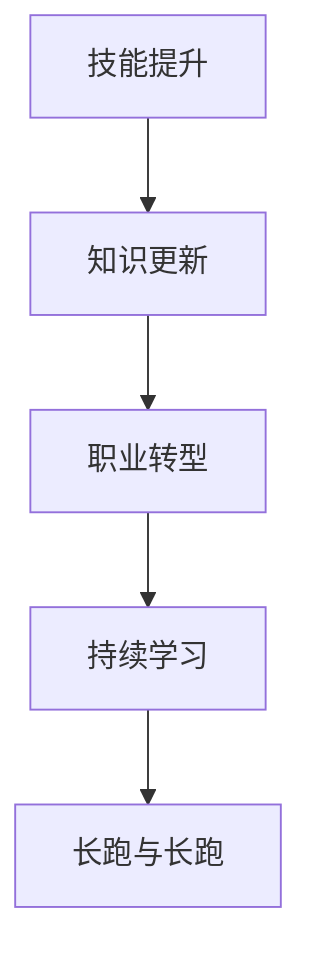

                 

# 程序员的职业生涯规划：长跑与长跑

## 1. 背景介绍

随着科技的迅猛发展，程序员作为推动技术进步的核心力量，其职业生涯的规划和发展也成为了一个备受关注的话题。在过去的几十年里，计算机技术和应用领域发生了翻天覆地的变化，程序员所需掌握的技能和知识也在不断更新和扩展。本文将深入探讨程序员职业生涯规划的关键要素，包括技能提升、知识更新、职业转型以及持续学习的理念。通过分析这些关键因素，希望能为程序员们提供一份有价值的指南，帮助他们在职业生涯中保持活力和竞争力。

## 2. 核心概念与联系

### 2.1 核心概念概述

在程序员职业生涯规划中，以下几个核心概念起到了关键作用：

- **技能提升**：指通过系统学习和实践，不断掌握新的编程语言、框架、工具和技术，提升编程能力和解决问题的能力。
- **知识更新**：随着技术的不断发展，程序员需要持续关注新技术、新工具和新理论，及时更新自己的知识库，保持与行业前沿的同步。
- **职业转型**：在职业生涯中，程序员可能因技术变革、兴趣变化或职业规划等因素，选择从一种编程语言或技术栈转向另一种，甚至跨入不同的技术领域。
- **持续学习**：程序员应该树立终身学习的理念，主动寻求学习机会，不断提升自身的技术水平和行业竞争力。
- **长跑与长跑**：在这个快速变化的时代，程序员的职业生涯不再是一次短跑，而是一段长跑。保持持续的学习和适应能力，才能在技术变革中立于不败之地。

这些概念之间的逻辑关系可以通过以下Mermaid流程图来展示：



这个流程图展示了一个程序员从技能提升到知识更新，再到职业转型和持续学习的职业生涯规划路径，最终形成一种持续进化的长跑心态。

## 3. 核心算法原理 & 具体操作步骤

### 3.1 算法原理概述

程序员的职业生涯规划，本质上是一种持续优化的过程。通过不断的技能提升、知识更新和职业转型，程序员能够在职业生涯中保持竞争力，实现自我价值和职业目标。

### 3.2 算法步骤详解

1. **设定职业目标**：明确自己的职业发展方向和目标，例如成为某技术领域的专家、转型到新的行业或职位、提升到管理层等。
2. **评估当前状态**：分析自己的技能水平、知识结构、经验积累和职业兴趣，确定需要提升和改进的方面。
3. **制定学习计划**：根据职业目标和当前状态，制定系统的学习计划，包括学习内容、学习时间、学习资源和评估方式等。
4. **实施学习计划**：通过在线课程、书籍、项目实践、技术交流等方式，系统学习和实践新技能和新知识。
5. **定期评估和调整**：根据学习效果和行业变化，定期评估自己的进展，调整学习计划，保持职业发展的动态平衡。
6. **持续适应和创新**：在职业生涯中保持开放心态，积极适应新技术和新变化，不断创新和突破。

### 3.3 算法优缺点

**优点**：
- **系统性和科学性**：通过制定和实施学习计划，程序员能够有针对性地提升技能和知识，避免盲目学习和浪费时间。
- **持续性**：长跑心态和持续学习理念，使得程序员能够在职业生涯中不断积累和提升，保持竞争力。
- **灵活性**：学习计划和评估方式可以根据实际情况灵活调整，适应不同阶段和不同需求。

**缺点**：
- **时间和精力投入**：系统的学习和技能提升需要大量的时间和精力，可能影响工作和生活平衡。
- **初期挑战**：在新的技术和领域中，可能需要面临较大的挑战和挫折，需要毅力和耐心。
- **资源限制**：高质量的学习资源可能难以获取，需要投入相应的资金和精力进行寻找。

### 3.4 算法应用领域

程序员的职业生涯规划不仅适用于传统的软件开发领域，也适用于数据分析、人工智能、区块链、云计算等新兴技术领域。无论是在企业还是自由职业者，持续学习和职业转型都是必不可少的职业发展要素。

## 4. 数学模型和公式 & 详细讲解 & 举例说明

### 4.1 数学模型构建

假设一个程序员当前的技能水平为 $X_0$，目标技能水平为 $X_T$，需要学习的时间为 $T$，则其技能提升的数学模型可以表示为：

$$ X = X_0 + \sum_{t=1}^{T} f(t) $$

其中 $f(t)$ 表示在时间 $t$ 内技能提升的速度，可以是学习的时间、掌握的知识量、实践项目的数量等。

### 4.2 公式推导过程

假设程序员每天学习时间为 $h$ 小时，每周学习 $w$ 天，每小时学习效率为 $e$，则每周学习进度为：

$$ f(t) = e \times h \times w $$

假设学习效率 $e$ 与学习时间成正比，则有：

$$ e = k \times t $$

其中 $k$ 为学习效率常数，$t$ 为学习时间。

将 $f(t)$ 代入技能提升模型，得到：

$$ X = X_0 + \sum_{t=1}^{T} k \times h \times w \times t $$

这个公式可以表示为：

$$ X = X_0 + \frac{1}{2} k \times h \times w \times T^2 $$

这个公式展示了学习时间和效率对技能提升的累积效应。

### 4.3 案例分析与讲解

假设一个程序员希望在一年内掌握 Python 编程语言，每天学习 2 小时，每周学习 5 天，初始技能水平为 0，学习效率常数为 0.1。则其学习进度和技能提升情况如下：

- 学习时间 $T = 365 \times 2 = 730$ 小时
- 每周学习进度 $f(t) = 0.1 \times 2 \times 5 \times t = 1 \times t$
- 技能提升情况 $X = 0 + \frac{1}{2} \times 0.1 \times 2 \times 5 \times 730^2 = 6.4 \times 730^2$

这个结果展示了在合理的学习计划和时间安排下，程序员可以在一年内显著提升 Python 编程技能。

## 5. 项目实践：代码实例和详细解释说明

### 5.1 开发环境搭建

在开始项目实践前，需要搭建一个开发环境，包括以下步骤：

1. **选择编程语言和框架**：根据项目需求选择合适的编程语言和框架，例如 Python、Java、JavaScript、Vue.js 等。
2. **安装开发工具**：安装必要的开发工具，例如 IDE、编译器、调试器等。
3. **配置版本控制**：配置版本控制系统，例如 Git，进行代码版本管理和协作开发。
4. **设置环境变量**：设置必要的系统环境变量，例如 PATH、PYTHONPATH 等。
5. **安装依赖库**：根据项目需求，安装必要的依赖库和工具包。

### 5.2 源代码详细实现

以下是一个简单的 Python 项目实现示例，展示了一个基本的项目结构和代码组织方式。

```python
# 创建项目目录
mkdir my_project
cd my_project

# 创建文件和目录
mkdir src
touch src/app.py
touch README.md
touch .gitignore

# 安装依赖库
pip install flask requests

# 编写代码
from flask import Flask, request

app = Flask(__name__)

@app.route('/')
def index():
    name = request.args.get('name')
    return f'Hello, {name}!'

if __name__ == '__main__':
    app.run()
```

### 5.3 代码解读与分析

**项目结构**：
- `my_project`：项目根目录。
- `src`：源代码目录。
- `app.py`：主程序文件。
- `README.md`：项目文档文件。
- `.gitignore`：Git 忽略文件。

**代码实现**：
- 使用 Flask 框架创建一个简单的 HTTP 服务器。
- 定义一个路由函数，接收 GET 请求的参数，并返回欢迎信息。
- 启动服务器，监听 HTTP 请求。

### 5.4 运行结果展示

运行上述代码后，可以通过浏览器访问 `http://127.0.0.1:5000/?name=World`，看到欢迎信息 `Hello, World!`。

## 6. 实际应用场景

### 6.1 企业软件开发

在企业软件开发中，程序员需要不断提升技能和知识，以适应技术变革和企业需求。通过系统的学习和职业转型，程序员可以从初级开发岗位逐步成长为高级开发者、技术专家或架构师。

### 6.2 自由职业者

自由职业者需要具备广泛的技术栈和项目管理能力，才能应对不同的项目需求和客户要求。通过持续学习和职业转型，自由职业者可以不断扩展自己的业务范围，提高市场竞争力。

### 6.3 教育培训

在教育培训领域，程序员可以担任讲师或导师，传授编程知识和技能。通过持续学习和职业转型，程序员可以不断提高教学水平，创新教学方法，提升教育质量。

### 6.4 未来应用展望

未来，随着技术的发展和行业的变革，程序员的职业生涯规划将面临更多的挑战和机遇。例如，人工智能、大数据、云计算等新兴技术的兴起，将为程序员提供更多的职业机会和发展空间。同时，技术不断演进和更新，程序员需要不断学习新知识和技能，保持竞争力。

## 7. 工具和资源推荐

### 7.1 学习资源推荐

1. **《编程珠玑》**：作者 Jon Bentley，深入浅出地介绍了编程中的经典算法和数据结构。
2. **Coursera 编程课程**：提供丰富的编程课程，包括 Python、Java、C++ 等。
3. **LeetCode**：在线编程练习平台，提供大量算法和数据结构练习题。
4. **GitHub**：代码托管平台，提供丰富的开源项目和学习资源。
5. **Stack Overflow**：技术问答社区，提供丰富的编程问题和解决方案。

### 7.2 开发工具推荐

1. **Visual Studio Code**：轻量级的代码编辑器，支持多种编程语言和插件。
2. **IntelliJ IDEA**：Java 开发工具，提供丰富的代码编辑和调试功能。
3. **Sublime Text**：轻量级的文本编辑器，支持多种编程语言和插件。
4. **Git**：版本控制系统，支持代码版本管理和协作开发。
5. **Docker**：容器化技术，支持跨平台部署和管理。

### 7.3 相关论文推荐

1. **《程序员作为架构师的角色》**：作者 Martin Fowler，探讨了程序员在软件开发中的角色和职责。
2. **《软件工程师的职业发展路径》**：作者 James Whittaker，介绍了软件工程师的职业发展路径和技能提升方法。
3. **《软件工程师的终身学习》**：作者 Niklas B. Mortensen，探讨了软件工程师的终身学习理念和实践方法。

## 8. 总结：未来发展趋势与挑战

### 8.1 研究成果总结

本文详细探讨了程序员职业生涯规划的关键要素，包括技能提升、知识更新、职业转型和持续学习的理念。通过分析这些关键因素，希望能为程序员们提供一份有价值的指南，帮助他们在职业生涯中保持活力和竞争力。

### 8.2 未来发展趋势

未来，程序员的职业生涯规划将面临更多的挑战和机遇。例如，人工智能、大数据、云计算等新兴技术的兴起，将为程序员提供更多的职业机会和发展空间。同时，技术不断演进和更新，程序员需要不断学习新知识和技能，保持竞争力。

### 8.3 面临的挑战

在程序员的职业生涯规划中，面临的挑战包括：
1. **时间和精力的投入**：系统的学习和技能提升需要大量的时间和精力，可能影响工作和生活平衡。
2. **持续学习的压力**：技术的快速发展和变革，使得程序员需要不断学习和适应，保持职业发展的动态平衡。
3. **职业转型的风险**：在新的技术和领域中，可能需要面临较大的挑战和挫折，需要毅力和耐心。
4. **资源限制**：高质量的学习资源可能难以获取，需要投入相应的资金和精力进行寻找。

### 8.4 研究展望

未来，程序员的职业生涯规划研究将从以下几个方面进行：
1. **个性化学习路径**：根据程序员的兴趣和需求，制定个性化的学习路径和计划。
2. **跨领域协作**：鼓励程序员跨领域协作，分享知识和经验，促进技术的融合和创新。
3. **社会责任和伦理**：关注程序员的职业发展和心理健康，关注软件工程的社会责任和伦理问题。

## 9. 附录：常见问题与解答

**Q1: 如何选择适合自己的编程语言和框架？**

A: 选择编程语言和框架需要考虑多个因素，例如项目需求、团队技术栈、个人兴趣等。可以通过调研、试用和参考行业标准等方式进行选择。

**Q2: 如何管理时间和精力，进行有效的学习和工作？**

A: 可以采用时间管理工具，如番茄工作法、时间块管理等方法，合理安排时间和精力，保证学习与工作的平衡。

**Q3: 如何应对技术变革和行业趋势？**

A: 关注行业动态和趋势，参加技术会议和培训，保持对新技术和新工具的敏感度，积极学习和实践。

**Q4: 如何处理职业转型中的挑战和风险？**

A: 制定清晰的职业转型计划，评估自身能力和兴趣，积累相关经验和知识，逐步过渡到新的岗位或领域。

**Q5: 如何保持职业发展的持续性和动力？**

A: 树立持续学习的理念，设定短期和长期职业目标，保持对技术发展的热情和好奇心，不断挑战和突破自己。

---

作者：禅与计算机程序设计艺术 / Zen and the Art of Computer Programming

