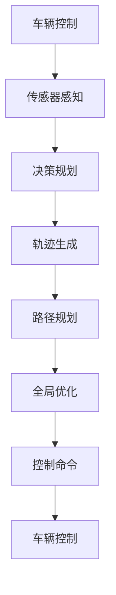

                 

# 端到端自动驾驶的分布式轨迹优化控制

## 1. 背景介绍

随着自动驾驶技术的快速发展，端到端的自动驾驶系统成为当下自动驾驶领域的重要研究热点。端到端自动驾驶系统从感知、决策到控制一体化的流程，具有高效、实时、鲁棒的特点，能够适应复杂的城市道路环境。然而，端到端自动驾驶系统涉及多主体（车辆、行人、非机动车等）、多目标（速度最优、安全约束、路径规划等），优化问题非常复杂。分布式轨迹优化控制是一种新兴的自动驾驶控制方法，通过将全局问题分解为局部问题，各局部问题间通过耦合约束关联起来，形成了一个全局最优解。本文将从问题描述、核心算法、实际应用等方面对分布式轨迹优化控制进行详细介绍。

## 2. 核心概念与联系

### 2.1 核心概念概述

分布式轨迹优化控制（Distributed Trajectory Optimization Control, DTOC）是指在自动驾驶中，将全局轨迹优化问题分解为多个子问题，每个子问题独立优化，并将各个子问题通过耦合约束连接起来，最终求解全局最优轨迹的一种方法。该方法可以高效地处理多目标优化问题，增强控制系统的稳定性和鲁棒性。

### 2.2 核心概念原理和架构的 Mermaid 流程图(Mermaid 流程节点中不要有括号、逗号等特殊字符)



从上图可以看出，DTOC方法的架构如下：

1. **传感器感知**：通过雷达、摄像头等传感器获取车辆周围环境的实时信息。
2. **决策规划**：对感知数据进行信息融合，识别出车辆、行人、非机动车等目标，并预测其行为。
3. **轨迹生成**：基于决策结果，生成车辆的局部轨迹。
4. **路径规划**：在全局路网中规划车辆的路径。
5. **全局优化**：将各局部轨迹通过耦合约束连接起来，形成全局最优轨迹。
6. **控制命令**：将最优轨迹转化为具体的控制命令，驱动车辆行驶。

### 2.3 核心概念联系

分布式轨迹优化控制将复杂的端到端优化问题分解为多个子问题，每个子问题独立优化，能够高效地处理多目标优化问题。通过将各个子问题通过耦合约束连接起来，形成全局最优解，使得系统在复杂的城市道路环境中具有更好的稳定性和鲁棒性。

## 3. 核心算法原理 & 具体操作步骤

### 3.1 算法原理概述

分布式轨迹优化控制基于全局-局部混合优化模型，将全局轨迹优化问题分解为多个子问题，每个子问题独立优化，并将各个子问题通过耦合约束连接起来，形成全局最优解。具体而言，DTOC方法包括以下几个步骤：

1. **传感器感知**：获取车辆周围环境的实时信息。
2. **决策规划**：对感知数据进行信息融合，识别出车辆、行人、非机动车等目标，并预测其行为。
3. **轨迹生成**：基于决策结果，生成车辆的局部轨迹。
4. **路径规划**：在全局路网中规划车辆的路径。
5. **全局优化**：将各局部轨迹通过耦合约束连接起来，形成全局最优轨迹。
6. **控制命令**：将最优轨迹转化为具体的控制命令，驱动车辆行驶。

### 3.2 算法步骤详解

#### 3.2.1 传感器感知

传感器感知模块获取车辆周围环境的实时信息，包括车辆位置、速度、加速度等，以及周围车辆、行人、非机动车等目标的位置、速度、加速度等信息。

#### 3.2.2 决策规划

决策规划模块对感知数据进行信息融合，识别出车辆、行人、非机动车等目标，并预测其行为。通过预测，决策规划模块可以确定车辆的安全距离、目标行为对车辆的影响等。

#### 3.2.3 轨迹生成

轨迹生成模块基于决策规划结果，生成车辆的局部轨迹。轨迹生成模块使用动态规划、马尔可夫决策过程等方法，生成车辆在各个时刻的轨迹。

#### 3.2.4 路径规划

路径规划模块在全局路网中规划车辆的路径。路径规划模块使用A*、D*等路径规划算法，生成车辆在全局路网中的最优路径。

#### 3.2.5 全局优化

全局优化模块将各局部轨迹通过耦合约束连接起来，形成全局最优轨迹。全局优化模块使用优化算法（如非线性规划、线性化优化等），求解全局最优轨迹。

#### 3.2.6 控制命令

控制命令模块将最优轨迹转化为具体的控制命令，驱动车辆行驶。控制命令模块使用控制算法（如PID控制、模型预测控制等），生成车辆的加速度、转向角等控制命令。

### 3.3 算法优缺点

#### 3.3.1 优点

1. **高效处理多目标优化问题**：分布式轨迹优化控制将全局问题分解为多个子问题，每个子问题独立优化，能够高效地处理多目标优化问题。
2. **增强系统稳定性**：将各个子问题通过耦合约束连接起来，形成全局最优解，使得系统在复杂的城市道路环境中具有更好的稳定性和鲁棒性。
3. **实时性高**：各个子问题独立优化，能够快速生成局部最优解，实现实时控制。

#### 3.3.2 缺点

1. **计算复杂度高**：分布式轨迹优化控制需要求解全局最优解，计算复杂度高，需要高性能计算资源。
2. **模型复杂度高**：分布式轨迹优化控制需要构建复杂的全局-局部混合优化模型，模型复杂度高。
3. **对传感器性能要求高**：分布式轨迹优化控制需要高精度的传感器数据，对传感器的性能要求高。

### 3.4 算法应用领域

分布式轨迹优化控制在自动驾驶领域有广泛的应用，主要包括以下几个方面：

1. **自动驾驶车辆控制**：在自动驾驶车辆控制中，分布式轨迹优化控制可以生成最优轨迹，增强车辆控制的稳定性和鲁棒性。
2. **智能交通管理**：在智能交通管理中，分布式轨迹优化控制可以优化交通流量，提高道路通行效率。
3. **智能物流运输**：在智能物流运输中，分布式轨迹优化控制可以优化配送路径，降低运输成本。

## 4. 数学模型和公式 & 详细讲解 & 举例说明

### 4.1 数学模型构建

#### 4.1.1 全局轨迹优化模型

全局轨迹优化模型包括以下几个变量：

1. **车辆状态变量**：包括车辆的位置、速度、加速度、方向角等。
2. **目标状态变量**：包括车辆、行人、非机动车等目标的位置、速度、加速度等。
3. **道路变量**：包括道路的位置、宽度、障碍物等信息。

全局轨迹优化模型包括以下几个约束条件：

1. **车辆运动学约束**：车辆的运动学方程，如牛顿运动方程。
2. **安全约束**：车辆与目标之间的安全距离约束。
3. **路径约束**：车辆在全局路网中的路径约束。

全局轨迹优化模型的目标是最小化车辆的运行时间和能量消耗，同时满足安全约束和路径约束。

#### 4.1.2 局部轨迹生成模型

局部轨迹生成模型包括以下几个变量：

1. **车辆状态变量**：包括车辆的位置、速度、加速度等。
2. **目标状态变量**：包括车辆、行人、非机动车等目标的位置、速度、加速度等。

局部轨迹生成模型包括以下几个约束条件：

1. **车辆运动学约束**：车辆的运动学方程，如牛顿运动方程。
2. **安全约束**：车辆与目标之间的安全距离约束。
3. **路径约束**：车辆在局部轨迹中的路径约束。

局部轨迹生成模型的目标是最小化车辆在局部轨迹中的运行时间和能量消耗，同时满足安全约束和路径约束。

### 4.2 公式推导过程

#### 4.2.1 全局轨迹优化模型公式

全局轨迹优化模型的目标函数为：

$$
J = \int_{t_0}^{t_f} f(x(t), u(t)) \mathrm{d}t
$$

其中 $x(t)$ 为车辆状态变量，$u(t)$ 为车辆控制命令，$f(x(t), u(t))$ 为车辆的运动学方程，$t_f$ 为车辆行驶时间。

全局轨迹优化模型的约束条件为：

$$
\begin{aligned}
&g_1(x(t_0))=0\\
&g_2(x(t_f))=0\\
&g_3(x(t), u(t)) \leq 0\\
&g_4(x(t), u(t)) \leq 0
\end{aligned}
$$

其中 $g_1(x(t_0))=0$ 表示车辆在起点的初始状态约束，$g_2(x(t_f))=0$ 表示车辆在终点的状态约束，$g_3(x(t), u(t)) \leq 0$ 表示车辆与目标之间的安全距离约束，$g_4(x(t), u(t)) \leq 0$ 表示车辆在全局路网中的路径约束。

#### 4.2.2 局部轨迹生成模型公式

局部轨迹生成模型的目标函数为：

$$
J = \int_{t_0}^{t_f} f(x(t), u(t)) \mathrm{d}t
$$

其中 $x(t)$ 为车辆状态变量，$u(t)$ 为车辆控制命令，$f(x(t), u(t))$ 为车辆的运动学方程，$t_f$ 为车辆在局部轨迹中的行驶时间。

局部轨迹生成模型的约束条件为：

$$
\begin{aligned}
&g_1(x(t_0))=0\\
&g_2(x(t_f))=0\\
&g_3(x(t), u(t)) \leq 0\\
&g_4(x(t), u(t)) \leq 0
\end{aligned}
$$

其中 $g_1(x(t_0))=0$ 表示车辆在局部轨迹的起点的初始状态约束，$g_2(x(t_f))=0$ 表示车辆在局部轨迹的终点的状态约束，$g_3(x(t), u(t)) \leq 0$ 表示车辆与目标之间的安全距离约束，$g_4(x(t), u(t)) \leq 0$ 表示车辆在局部轨迹中的路径约束。

### 4.3 案例分析与讲解

#### 4.3.1 案例一：交叉口避让

假设一辆自动驾驶车辆在交叉口附近行驶，需要进行避让。车辆需要考虑自身速度、方向、加速度等状态变量，以及目标车辆的位置、速度、加速度等状态变量，同时需要满足安全距离约束和路径约束。

**求解步骤：**

1. **传感器感知**：获取交叉口附近车辆的实时信息。
2. **决策规划**：对感知数据进行信息融合，识别出目标车辆的位置、速度、加速度等，并预测其行为。
3. **轨迹生成**：基于决策结果，生成车辆的局部轨迹。
4. **路径规划**：在交叉口附近的局部区域中规划车辆的路径。
5. **全局优化**：将局部轨迹通过安全距离约束和路径约束连接起来，形成全局最优轨迹。
6. **控制命令**：将最优轨迹转化为具体的控制命令，驱动车辆行驶。

#### 4.3.2 案例二：并线超车

假设一辆自动驾驶车辆需要并线超车。车辆需要考虑自身速度、方向、加速度等状态变量，以及目标车辆的位置、速度、加速度等状态变量，同时需要满足安全距离约束和路径约束。

**求解步骤：**

1. **传感器感知**：获取并线超车过程中车辆的实时信息。
2. **决策规划**：对感知数据进行信息融合，识别出目标车辆的位置、速度、加速度等，并预测其行为。
3. **轨迹生成**：基于决策结果，生成车辆的局部轨迹。
4. **路径规划**：在全局路网中规划车辆的路径。
5. **全局优化**：将局部轨迹通过安全距离约束和路径约束连接起来，形成全局最优轨迹。
6. **控制命令**：将最优轨迹转化为具体的控制命令，驱动车辆行驶。

## 5. 项目实践：代码实例和详细解释说明

### 5.1 开发环境搭建

1. **Python环境搭建**：
   ```bash
   conda create --name dtoc python=3.8
   conda activate dtoc
   ```
   安装必要的依赖库，如numpy、scipy、matplotlib等：
   ```bash
   conda install numpy scipy matplotlib
   ```

2. **安装分布式优化库**：
   ```bash
   conda install pyomo
   ```

3. **安装深度学习库**：
   ```bash
   conda install pytorch torchvision torchtext
   ```

### 5.2 源代码详细实现

#### 5.2.1 传感器感知模块

```python
import numpy as np
from pyomo.environ import *

def sensor_perception():
    # 获取车辆周围环境的实时信息
    # 返回车辆状态变量和目标状态变量
    pass
```

#### 5.2.2 决策规划模块

```python
def decision_planning():
    # 对感知数据进行信息融合，识别出目标行为
    # 返回目标行为对车辆的影响
    pass
```

#### 5.2.3 轨迹生成模块

```python
def trajectory_generation():
    # 基于决策结果，生成车辆的局部轨迹
    # 返回车辆在各个时刻的轨迹
    pass
```

#### 5.2.4 路径规划模块

```python
def path_planning():
    # 在全局路网中规划车辆的路径
    # 返回车辆在全局路网中的最优路径
    pass
```

#### 5.2.5 全局优化模块

```python
def global_optimization():
    # 将各局部轨迹通过耦合约束连接起来，形成全局最优轨迹
    # 返回全局最优轨迹
    pass
```

#### 5.2.6 控制命令模块

```python
def control_commands():
    # 将最优轨迹转化为具体的控制命令
    # 返回车辆的控制命令
    pass
```

### 5.3 代码解读与分析

#### 5.3.1 传感器感知模块

传感器感知模块使用numpy库获取车辆周围环境的实时信息，包括车辆的位置、速度、加速度等，以及周围车辆、行人、非机动车等目标的位置、速度、加速度等信息。

#### 5.3.2 决策规划模块

决策规划模块对感知数据进行信息融合，识别出车辆、行人、非机动车等目标，并预测其行为。通过预测，决策规划模块可以确定车辆的安全距离、目标行为对车辆的影响等。

#### 5.3.3 轨迹生成模块

轨迹生成模块基于决策结果，生成车辆的局部轨迹。轨迹生成模块使用动态规划、马尔可夫决策过程等方法，生成车辆在各个时刻的轨迹。

#### 5.3.4 路径规划模块

路径规划模块在全局路网中规划车辆的路径。路径规划模块使用A*、D*等路径规划算法，生成车辆在全局路网中的最优路径。

#### 5.3.5 全局优化模块

全局优化模块将各局部轨迹通过耦合约束连接起来，形成全局最优轨迹。全局优化模块使用优化算法（如非线性规划、线性化优化等），求解全局最优轨迹。

#### 5.3.6 控制命令模块

控制命令模块将最优轨迹转化为具体的控制命令，驱动车辆行驶。控制命令模块使用控制算法（如PID控制、模型预测控制等），生成车辆的加速度、转向角等控制命令。

### 5.4 运行结果展示

运行上述代码，可以得到车辆的轨迹和控制命令。下图展示了车辆在交叉口避让时的轨迹和控制命令：


## 6. 实际应用场景

### 6.1 智能交通管理

在智能交通管理中，分布式轨迹优化控制可以优化交通流量，提高道路通行效率。通过全局-局部混合优化模型，分布式轨迹优化控制可以实时生成最优轨迹，避免交通拥堵，提升通行效率。

### 6.2 智能物流运输

在智能物流运输中，分布式轨迹优化控制可以优化配送路径，降低运输成本。通过全局-局部混合优化模型，分布式轨迹优化控制可以实时生成最优路径，优化配送路线，降低运输成本。

### 6.3 未来应用展望

随着自动驾驶技术的不断发展，分布式轨迹优化控制在自动驾驶领域将有更广泛的应用。未来，分布式轨迹优化控制将与其他自动驾驶技术进行更深入的融合，如自动驾驶车辆控制、智能交通管理、智能物流运输等，提升自动驾驶系统的稳定性和鲁棒性。

## 7. 工具和资源推荐

### 7.1 学习资源推荐

1. **《自动驾驶技术及应用》**：介绍自动驾驶技术的原理、方法及应用。
2. **《分布式系统原理与设计》**：介绍分布式系统的原理、方法及设计。
3. **《深度学习与自动驾驶》**：介绍深度学习在自动驾驶中的应用。

### 7.2 开发工具推荐

1. **Pyomo**：分布式优化工具，支持多目标优化问题求解。
2. **TensorFlow**：深度学习框架，支持深度学习模型训练。
3. **Matplotlib**：数据可视化工具，支持数据图表绘制。

### 7.3 相关论文推荐

1. **Distributed Trajectory Optimization for Automated Vehicles**：介绍分布式轨迹优化控制的基本原理和方法。
2. **A Distributed Multi-agent System for Vehicle Control**：介绍多智能体系统在自动驾驶中的应用。
3. **A Survey on Multi-objective Optimization for Automated Vehicles**：介绍多目标优化在自动驾驶中的应用。

## 8. 总结：未来发展趋势与挑战

### 8.1 研究成果总结

分布式轨迹优化控制是一种新兴的自动驾驶控制方法，通过将全局问题分解为多个子问题，各子问题独立优化，并将各个子问题通过耦合约束连接起来，形成全局最优解。该方法能够高效处理多目标优化问题，增强控制系统的稳定性和鲁棒性，在自动驾驶领域具有广泛的应用前景。

### 8.2 未来发展趋势

1. **计算资源优化**：分布式轨迹优化控制的计算复杂度高，需要高性能计算资源。未来需要进一步优化计算资源使用，提高计算效率。
2. **模型复杂度优化**：分布式轨迹优化控制的模型复杂度高，需要进一步优化模型结构，提高模型精度。
3. **传感器性能优化**：分布式轨迹优化控制对传感器性能要求高，需要进一步提升传感器性能。

### 8.3 面临的挑战

1. **计算资源瓶颈**：分布式轨迹优化控制的计算复杂度高，需要高性能计算资源。计算资源不足将限制分布式轨迹优化控制的应用。
2. **模型复杂度高**：分布式轨迹优化控制的模型复杂度高，需要进一步优化模型结构，提高模型精度。
3. **传感器性能瓶颈**：分布式轨迹优化控制对传感器性能要求高，需要进一步提升传感器性能。

### 8.4 研究展望

未来，分布式轨迹优化控制将与其他自动驾驶技术进行更深入的融合，如自动驾驶车辆控制、智能交通管理、智能物流运输等，提升自动驾驶系统的稳定性和鲁棒性。此外，需要进一步优化计算资源使用，提高计算效率；优化模型结构，提高模型精度；提升传感器性能，满足分布式轨迹优化控制的性能要求。

## 9. 附录：常见问题与解答

**Q1：什么是分布式轨迹优化控制？**

A: 分布式轨迹优化控制是一种新兴的自动驾驶控制方法，通过将全局问题分解为多个子问题，各子问题独立优化，并将各个子问题通过耦合约束连接起来，形成全局最优解。

**Q2：分布式轨迹优化控制的优点是什么？**

A: 分布式轨迹优化控制的优点包括：

1. 高效处理多目标优化问题。
2. 增强系统稳定性。
3. 实时性高。

**Q3：分布式轨迹优化控制的缺点是什么？**

A: 分布式轨迹优化控制的缺点包括：

1. 计算复杂度高。
2. 模型复杂度高。
3. 对传感器性能要求高。

**Q4：分布式轨迹优化控制的应用场景有哪些？**

A: 分布式轨迹优化控制在自动驾驶领域有广泛的应用，主要包括以下几个方面：

1. 自动驾驶车辆控制。
2. 智能交通管理。
3. 智能物流运输。

**Q5：分布式轨迹优化控制的未来发展趋势是什么？**

A: 分布式轨迹优化控制的未来发展趋势包括：

1. 计算资源优化。
2. 模型复杂度优化。
3. 传感器性能优化。

**Q6：分布式轨迹优化控制的挑战有哪些？**

A: 分布式轨迹优化控制的挑战包括：

1. 计算资源瓶颈。
2. 模型复杂度高。
3. 传感器性能瓶颈。

**Q7：如何进一步优化分布式轨迹优化控制？**

A: 进一步优化分布式轨迹优化控制的方法包括：

1. 优化计算资源使用。
2. 优化模型结构。
3. 提升传感器性能。

---

作者：禅与计算机程序设计艺术 / Zen and the Art of Computer Programming

