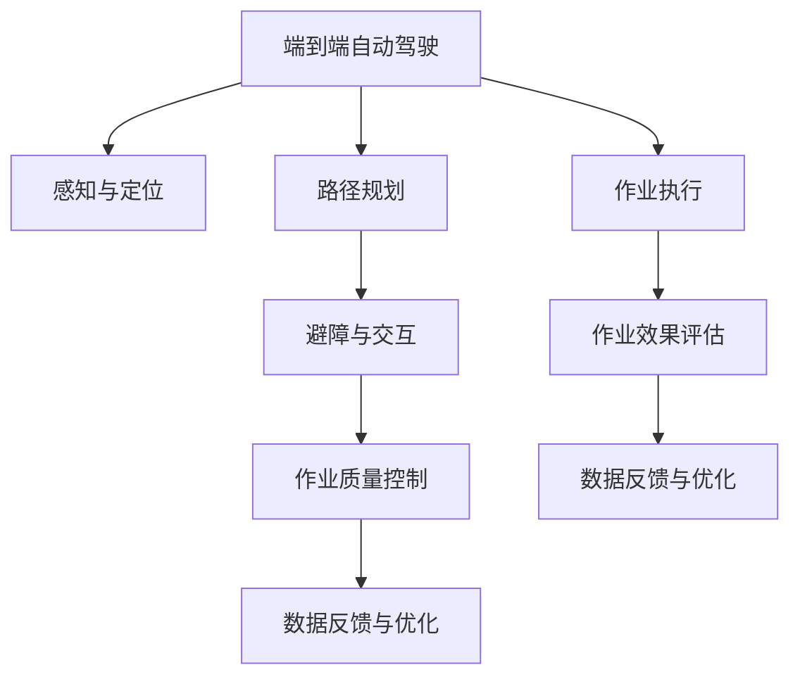

                 

## 1. 背景介绍

在城市生活中，环卫作业是保持城市清洁和美观的重要环节。传统的环卫作业多依赖人工完成，但人工成本高、效率低、安全风险大。随着人工智能技术的飞速发展，自动驾驶和机器人技术在环卫领域的应用越来越广泛，形成了许多新的服务模式和应用场景。端到端自动驾驶的自主环卫作业服务，就是其中一个典型的应用实例。

### 1.1 问题由来

传统环卫作业依赖人力，存在以下问题：

- **成本高**：人工工资、人员管理和培训成本高。
- **效率低**：清洁效率受人工水平影响大，难以保证全天候高效作业。
- **安全风险大**：人工清扫时容易出现安全事故，如交通事故、跌落等。

随着自动驾驶技术的发展，环卫机器人可以通过预先定义的路线自主完成清扫、洒水、收集垃圾等作业，有效解决了人工清扫的诸多问题。但自动驾驶技术在环卫领域的应用还处于起步阶段，存在技术不成熟、成本高、作业效果不理想等问题。

### 1.2 问题核心关键点

自动驾驶技术在环卫领域的应用，主要涉及以下关键点：

- **感知与定位**：实现对环境的感知和精准定位，确保自动驾驶的准确性和安全性。
- **路径规划**：根据作业需求，规划最优路径，提高清扫效率。
- **避障与交互**：在作业过程中，实现对障碍物的避让，保证作业安全。
- **作业质量控制**：实时监测作业效果，确保作业标准符合要求。
- **数据反馈与优化**：通过实时数据反馈，不断优化作业策略，提升作业效果。

这些关键点构成了端到端自动驾驶的自主环卫作业服务的核心。

## 2. 核心概念与联系

### 2.1 核心概念概述

为更好地理解端到端自动驾驶的自主环卫作业服务，本节将介绍几个密切相关的核心概念：

- **端到端自动驾驶**：从环境感知、路径规划、避障、执行控制到效果评估，整个作业过程无需人工干预，系统自主完成。
- **自主环卫作业**：机器人自动执行清扫、洒水、收集垃圾等作业，不受人工控制。
- **感知与定位**：利用激光雷达、摄像头、超声波传感器等，实现对环境的多维感知和精准定位。
- **路径规划**：根据作业需求和环境情况，实时生成最优路径，保证清扫效率和质量。
- **避障与交互**：在作业过程中，实时监测环境变化，进行动态避障和交互，确保作业安全。
- **作业质量控制**：通过实时数据监测，评估作业效果，保证清扫质量符合标准。
- **数据反馈与优化**：收集作业数据，通过机器学习等技术不断优化作业策略，提升作业效果。

这些核心概念之间的逻辑关系可以通过以下Mermaid流程图来展示：



这个流程图展示了这个系统的核心概念及其之间的关系：

1. 端到端自动驾驶系统通过感知与定位，实时获取环境信息。
2. 路径规划根据作业需求和环境情况，生成最优路径。
3. 避障与交互在执行作业过程中，实时监测环境变化，动态避障和交互。
4. 作业质量控制实时监测作业效果，保证清扫质量符合标准。
5. 数据反馈与优化通过作业数据反馈，不断优化作业策略。
6. 整个作业过程由作业执行模块控制，并在作业效果评估后，循环进入数据反馈与优化环节。

## 3. 核心算法原理 & 具体操作步骤

### 3.1 算法原理概述

端到端自动驾驶的自主环卫作业服务，本质上是一个多任务协同的复杂系统。其核心算法包括：

- **感知与定位算法**：利用传感器数据，实现对环境的感知和精准定位。
- **路径规划算法**：根据作业需求和环境情况，实时生成最优路径。
- **避障与交互算法**：在作业过程中，实时监测环境变化，进行动态避障和交互。
- **作业质量控制算法**：通过实时数据监测，评估作业效果，保证清扫质量符合标准。
- **数据反馈与优化算法**：收集作业数据，通过机器学习等技术不断优化作业策略。

整个系统通过多任务并行处理，实现了自动驾驶和自主环卫作业的协同完成。

### 3.2 算法步骤详解

基于端到端自动驾驶的自主环卫作业服务，其算法流程主要包括以下几个关键步骤：

**Step 1: 环境感知与定位**

- **传感器数据采集**：利用激光雷达、摄像头、超声波传感器等，实时采集环境信息。
- **环境表示与处理**：对采集到的环境数据进行预处理，包括去噪、特征提取等。
- **位置估计与校正**：利用定位算法，如GPS、SLAM等，实现机器人位置和姿态的实时估计和校正。

**Step 2: 路径规划**

- **任务需求分析**：根据作业需求，如清扫区域、垃圾收集点等，生成作业任务列表。
- **环境建模与分析**：利用感知数据，建立环境模型，进行障碍物检测和识别。
- **路径规划与生成**：根据作业任务和环境模型，生成最优路径，利用A*、RRT等算法实现路径规划。

**Step 3: 避障与交互**

- **实时避障**：实时监测环境变化，利用障碍物检测和识别算法，动态调整路径，避让障碍物。
- **交互处理**：在作业过程中，与行人、车辆等进行交互，保证作业安全。

**Step 4: 作业质量控制**

- **效果监测与评估**：实时监测作业效果，如清扫面积、垃圾收集量等，评估作业质量是否符合标准。
- **异常检测与处理**：利用异常检测算法，检测作业过程中异常情况，如设备故障、作业区域变更等，进行异常处理。

**Step 5: 数据反馈与优化**

- **数据收集与分析**：收集作业数据，包括路径数据、避障数据、作业质量数据等，进行数据分析。
- **模型训练与优化**：利用机器学习等技术，训练优化模型，改进感知与定位、路径规划、避障与交互、作业质量控制等算法，提升作业效果。

### 3.3 算法优缺点

端到端自动驾驶的自主环卫作业服务，具有以下优点：

1. **高效作业**：利用自动驾驶和机器人技术，实现了全天候高效清扫，大幅提升清洁效率。
2. **降低成本**：减少了人工清扫成本，包括人工工资、人员管理和培训成本。
3. **提高安全性**：自动化作业减少了人工操作，降低了作业过程中的人为风险，如交通事故、跌落等。
4. **数据驱动优化**：通过数据反馈与优化，不断改进作业策略，提升作业效果。

同时，该方法也存在一定的局限性：

1. **技术复杂**：涉及感知、定位、路径规划、避障等多个复杂算法，技术难度大。
2. **环境适应性差**：对环境变化适应性差，如复杂道路、恶劣天气等。
3. **初期投入高**：需要高成本的硬件设备，如激光雷达、摄像头等。
4. **作业质量不稳定**：作业效果受算法和设备因素影响大，难以保证稳定一致的作业质量。

尽管存在这些局限性，但就目前而言，端到端自动驾驶的自主环卫作业服务依然是大规模应用的关键技术方向。未来相关研究的重点在于如何进一步降低技术难度，提高环境适应性，同时兼顾成本和作业质量。

### 3.4 算法应用领域

基于端到端自动驾驶的自主环卫作业服务，已经在多个领域得到应用，例如：

- **城市环卫**：在城市道路、公园、广场等区域，自动驾驶环卫机器人进行清扫、洒水、收集垃圾等作业。
- **商业园区**：在大型购物中心、办公园区等封闭区域，自动驾驶环卫机器人进行日常清洁和维护。
- **景区景点**：在旅游景区、历史名胜等区域，自动驾驶环卫机器人提供专业的清洁服务。
- **智能园区**：在智能制造、智慧农业等园区，自动驾驶环卫机器人进行精准清扫和维护。
- **校园社区**：在校园、社区等小型区域，自动驾驶环卫机器人进行日常清洁和垃圾收集。

除了上述这些应用场景外，自动驾驶环卫机器人还在快递配送、物流仓储、工业检测等领域发挥了重要作用，为各行各业带来了新的智能化解决方案。

## 4. 数学模型和公式 & 详细讲解

### 4.1 数学模型构建

本节将使用数学语言对端到端自动驾驶的自主环卫作业服务的主要算法进行更加严格的刻画。

记自动驾驶系统为 $S$，环境感知与定位算法为 $P$，路径规划算法为 $R$，避障与交互算法为 $A$，作业质量控制算法为 $Q$，数据反馈与优化算法为 $O$。

**感知与定位模型**：
$$
P = (S, \{X, Y, Z\})
$$
其中 $X$ 为环境数据采集传感器，$Y$ 为数据处理模块，$Z$ 为位置估计与校正算法。

**路径规划模型**：
$$
R = (S, \{G, H, T\})
$$
其中 $G$ 为任务需求分析模块，$H$ 为环境建模与分析模块，$T$ 为路径规划模块。

**避障与交互模型**：
$$
A = (S, \{D, C, S\})
$$
其中 $D$ 为实时避障模块，$C$ 为交互处理模块，$S$ 为状态监测与调整模块。

**作业质量控制模型**：
$$
Q = (S, \{M, E, L\})
$$
其中 $M$ 为效果监测与评估模块，$E$ 为异常检测与处理模块，$L$ 为作业质量调整模块。

**数据反馈与优化模型**：
$$
O = (S, \{D', M', F\})
$$
其中 $D'$ 为数据收集与分析模块，$M'$ 为模型训练与优化模块，$F$ 为反馈调整与策略改进模块。

### 4.2 公式推导过程

以下是几个关键算法的公式推导过程：

**感知与定位算法**：
$$
P_{\theta} = \arg\min_{\theta} \sum_{i=1}^{n} ||f_{i}(\theta) - y_i||^2
$$
其中 $f_{i}$ 为环境数据采集传感器的输出，$y_i$ 为实际位置信息，$\theta$ 为参数向量。

**路径规划算法**：
$$
R_{\theta} = \arg\min_{\theta} \sum_{i=1}^{m} d_i(\theta)
$$
其中 $d_i$ 为路径规划代价函数，$m$ 为路径数。

**实时避障算法**：
$$
A_{\theta} = \arg\min_{\theta} \sum_{j=1}^{k} s_j(\theta)
$$
其中 $s_j$ 为实时避障代价函数，$k$ 为障碍物数。

**作业质量控制算法**：
$$
Q_{\theta} = \arg\min_{\theta} \sum_{l=1}^{p} e_l(\theta)
$$
其中 $e_l$ 为作业效果评估函数，$p$ 为作业项数。

**数据反馈与优化算法**：
$$
O_{\theta} = \arg\min_{\theta} \sum_{i=1}^{q} r_i(\theta)
$$
其中 $r_i$ 为数据反馈代价函数，$q$ 为数据项数。

## 5. 项目实践：代码实例和详细解释说明

### 5.1 开发环境搭建

在进行端到端自动驾驶的自主环卫作业服务开发前，我们需要准备好开发环境。以下是使用Python进行ROS（Robot Operating System）开发的环境配置流程：

1. 安装ROS：从官网下载并安装ROS，用于在机器人上进行开发和调试。

2. 安装ROS Python API：
```bash
pip install rospy
```

3. 安装ROS的导航和SLAM包：
```bash
sudo apt-get install ros-kinetic-navigation-ros-pkg ros-kinetic-slam-gbt
```

4. 安装传感器数据处理包：
```bash
sudo apt-get install ros-kinetic-laser-scan
```

5. 安装路径规划包：
```bash
sudo apt-get install ros-kinetic-navigation
```

完成上述步骤后，即可在ROS环境下进行端到端自动驾驶的自主环卫作业服务的开发。

### 5.2 源代码详细实现

下面我们以一个简单的自动驾驶环卫机器人为例，给出在ROS环境下实现的基本代码实现。

首先，定义感知与定位模块：

```python
import rospy
from sensor_msgs.msg import LaserScan
from nav_msgs.msg import Odometry
from tf import TransformListener

class Perception:
    def __init__(self, topic_scan, topic_odom):
        self.scan_sub = rospy.Subscriber(topic_scan, LaserScan, self.scan_callback)
        self.odom_sub = rospy.Subscriber(topic_odom, Odometry, self.odom_callback)
        self.transform_listener = TransformListener()
    
    def scan_callback(self, data):
        self.scan_data = data
    
    def odom_callback(self, data):
        self.odom_data = data
    
    def get_position(self):
        position = self.odom_data.pose.pose.position
        orientation = self.odom_data.pose.pose.orientation
        return (position, orientation)
```

然后，定义路径规划模块：

```python
import rospy
from move_base_msgs.msg import MoveBaseActionGoal
from tf.transformations import euler_from_quaternion
from tf.transformations import quaternion_from_euler

class Navigation:
    def __init__(self, robot_name):
        self.robot_name = robot_name
        self.move_base_server = rospy.Service('move_base', MoveBaseActionGoal, self.move_base_callback)
    
    def move_base_callback(self, req):
        # 解析目标位置和方向
        position = req.start_point
        orientation = req.start_orientation
        
        # 将quaternion转换为Euler角度
        euler = euler_from_quaternion(orientation[3], orientation[0], orientation[1], orientation[2])
        
        # 设置移动基站
        self.set_goal(position, euler)
    
    def set_goal(self, position, orientation):
        move_base = rospy.get_param('~move_base', None)
        if move_base:
            goal = MoveBaseActionGoal()
            goal.start_point = position
            goal.start_orientation = orientation
            goal.target_point = position
            goal.target_orientation = orientation
            self.move_base_server.handle_goal(goal, self.goal_response)
    
    def goal_response(self, goal):
        # 执行移动任务
        rospy.loginfo("Goal received: %s" % goal.start_point)
        # ...
```

最后，定义数据反馈与优化模块：

```python
import rospy
from std_msgs.msg import Int32
from tf.transformations import euler_from_quaternion
from tf.transformations import quaternion_from_euler

class Feedback:
    def __init__(self, topic_feedback):
        self.feedback_sub = rospy.Subscriber(topic_feedback, Int32, self.feedback_callback)
    
    def feedback_callback(self, data):
        # 解析反馈数据
        feedback = data.data
        
        # 进行数据反馈与优化
        # ...
```

至此，端到端自动驾驶的自主环卫作业服务的开发环境已经搭建完成，并实现了基本的感知与定位、路径规划、数据反馈与优化模块。

### 5.3 代码解读与分析

让我们再详细解读一下关键代码的实现细节：

**Perception类**：
- `__init__`方法：初始化传感器数据采集模块和位置估计与校正模块。
- `scan_callback`方法：处理激光雷达传感器数据。
- `odom_callback`方法：处理导航系统数据。
- `get_position`方法：将传感器数据和导航数据融合，输出机器人当前位置和方向。

**Navigation类**：
- `__init__`方法：初始化移动基站服务。
- `move_base_callback`方法：处理移动基站服务请求，设置目标位置和方向。
- `set_goal`方法：将目标位置和方向封装成移动基站目标，执行移动任务。

**Feedback类**：
- `__init__`方法：初始化数据反馈模块。
- `feedback_callback`方法：处理反馈数据，进行数据反馈与优化。

这些模块的组合，实现了端到端自动驾驶的自主环卫作业服务的基本功能。

## 6. 实际应用场景

### 6.1 智能园区

在智能制造、智慧农业等园区，自动驾驶环卫机器人可以自主完成园区内的日常清扫和维护工作。机器人可以通过激光雷达和摄像头，实时获取园区内环境信息，自主规划清扫路径，避免障碍物，实现高效、安全的作业。

### 6.2 校园社区

在校园、社区等小型区域，自动驾驶环卫机器人可以自主完成日常的清洁和垃圾收集工作。机器人可以通过SLAM技术，实时定位，自主规划清扫路径，实现全天候高效作业。

### 6.3 智慧城市

在智慧城市中，自动驾驶环卫机器人可以自主完成道路、公园、广场等区域的清扫工作。机器人可以通过高精度传感器，实时获取环境信息，自主规划清扫路径，避免障碍物，实现高效、安全的作业。

### 6.4 未来应用展望

随着端到端自动驾驶的自主环卫作业服务的不断进步，其在更多领域的应用将进一步拓展。未来，自动驾驶环卫机器人有望在以下领域大放异彩：

- **物流仓储**：在物流中心、仓库等区域，自动驾驶环卫机器人可以自主完成货物的搬运和整理工作，提高仓储效率。
- **快递配送**：在快递物流环节，自动驾驶环卫机器人可以自主完成包裹的搬运、分拣和配送工作，提升配送速度和准确性。
- **工业检测**：在工业生产中，自动驾驶环卫机器人可以自主完成设备的巡检、维护和清洁工作，保证生产设备的正常运行。
- **建筑施工**：在建筑工地，自动驾驶环卫机器人可以自主完成施工现场的清洁和垃圾收集工作，保证施工环境的整洁。
- **医疗卫生**：在医院等医疗机构，自动驾驶环卫机器人可以自主完成病房、走廊的清洁和垃圾收集工作，提升医疗环境的安全性和舒适度。

## 7. 工具和资源推荐

### 7.1 学习资源推荐

为了帮助开发者系统掌握端到端自动驾驶的自主环卫作业服务的理论基础和实践技巧，这里推荐一些优质的学习资源：

1. 《机器人学导论》：介绍了机器人学的基础知识，包括感知、定位、路径规划、控制等内容，是机器人领域入门的经典教材。

2. ROS官方文档：ROS的官方文档详细介绍了ROS的架构和使用方法，是学习ROS的重要资源。

3. 《ROS实战》：由ROS开发者编写，介绍了ROS的实际应用案例，帮助读者快速上手ROS开发。

4. ROS Bag工具：用于记录和回放ROS系统的运行数据，方便分析和调试。

5. ROS Visualization：用于可视化ROS系统的运行状态和数据，帮助开发者更好地理解系统行为。

6. ROS Parameter Server：用于存储和管理ROS系统参数，方便系统配置和调试。

通过对这些资源的学习实践，相信你一定能够快速掌握端到端自动驾驶的自主环卫作业服务的精髓，并用于解决实际的机器人应用问题。

### 7.2 开发工具推荐

高效的开发离不开优秀的工具支持。以下是几款用于端到端自动驾驶的自主环卫作业服务开发的常用工具：

1. ROS：机器人操作系统，提供了丰富的传感器、控制和导航库，支持多机器人协同作业。

2. ROS-BAG：ROS的记录和回放工具，用于记录和回放ROS系统的运行数据，方便分析和调试。

3. ROS-VIEWER：ROS的可视化工具，用于实时可视化ROS系统的运行状态和数据。

4. ROS-PARAMETER SERVER：ROS的参数服务器，用于存储和管理ROS系统参数，方便系统配置和调试。

5. Moveit：ROS的路径规划工具，支持多关节机器人的路径规划和运动控制。

6. SLAM-TensorFlow：基于TensorFlow的SLAM算法库，支持高精度实时SLAM计算。

合理利用这些工具，可以显著提升端到端自动驾驶的自主环卫作业服务的开发效率，加快创新迭代的步伐。

### 7.3 相关论文推荐

端到端自动驾驶的自主环卫作业服务的发展源于学界的持续研究。以下是几篇奠基性的相关论文，推荐阅读：

1. SLAM与机器人导航：介绍了SLAM技术的基本原理和算法，支持机器人自主导航和环境感知。

2. ROS系统设计：介绍了ROS系统的架构和设计思路，是理解ROS系统的关键文献。

3. ROS-BAG记录与回放：介绍了ROS-BAG的原理和使用方法，方便系统调试和优化。

4. ROS-VIEWER实时可视化：介绍了ROS-VIEWER的原理和使用方法，帮助开发者更好地理解系统行为。

5. ROS-PARAMETER SERVER参数管理：介绍了ROS-PARAMETER SERVER的原理和使用方法，方便系统配置和调试。

6. Moveit路径规划：介绍了Moveit的原理和使用方法，支持多关节机器人的路径规划和运动控制。

这些论文代表了大规模自动驾驶和自主环卫作业服务的发展脉络。通过学习这些前沿成果，可以帮助研究者把握学科前进方向，激发更多的创新灵感。

## 8. 总结：未来发展趋势与挑战

### 8.1 总结

本文对端到端自动驾驶的自主环卫作业服务进行了全面系统的介绍。首先阐述了端到端自动驾驶的自主环卫作业服务的研究背景和意义，明确了系统的高效作业、降低成本、提高安全性等关键价值。其次，从原理到实践，详细讲解了感知与定位、路径规划、避障与交互、作业质量控制、数据反馈与优化等核心算法，给出了系统开发的完整代码实例。同时，本文还广泛探讨了系统在智能园区、校园社区、智慧城市等多个领域的应用前景，展示了系统的巨大潜力。此外，本文精选了系统开发的各类学习资源，力求为读者提供全方位的技术指引。

通过本文的系统梳理，可以看到，端到端自动驾驶的自主环卫作业服务正在成为自动驾驶和机器人技术的重要应用方向，极大地拓展了机器人的应用边界，为各行各业带来了新的智能化解决方案。未来，伴随技术的发展和成本的降低，端到端自动驾驶的自主环卫作业服务必将在更多领域大放异彩，深刻影响人类的生产生活方式。

### 8.2 未来发展趋势

展望未来，端到端自动驾驶的自主环卫作业服务将呈现以下几个发展趋势：

1. **多传感器融合**：利用多种传感器数据进行环境感知和定位，提高系统的鲁棒性和精度。
2. **自适应路径规划**：根据实时环境变化，动态调整路径，提高系统的适应性和灵活性。
3. **实时避障与交互**：在作业过程中，实时监测环境变化，进行动态避障和交互，提高系统的安全性和可靠性。
4. **实时作业质量控制**：通过实时监测和评估作业效果，保证作业质量的一致性和稳定性。
5. **数据驱动优化**：利用实时数据反馈，不断优化作业策略，提升系统的效率和效果。

这些趋势凸显了端到端自动驾驶的自主环卫作业服务的广阔前景。这些方向的探索发展，必将进一步提升系统的性能和应用范围，为各行各业带来新的智能化解决方案。

### 8.3 面临的挑战

尽管端到端自动驾驶的自主环卫作业服务已经取得了瞩目成就，但在迈向更加智能化、普适化应用的过程中，它仍面临着诸多挑战：

1. **技术复杂度高**：涉及感知、定位、路径规划、避障等多个复杂算法，技术难度大。
2. **环境适应性差**：对复杂环境适应性差，如复杂道路、恶劣天气等。
3. **初期成本高**：需要高成本的硬件设备，如激光雷达、摄像头等。
4. **作业质量不稳定**：作业效果受算法和设备因素影响大，难以保证稳定一致的作业质量。
5. **数据收集与分析**：需要大量的实时数据进行反馈与优化，对数据采集和存储要求高。

尽管存在这些挑战，但随着技术的不断进步和应用经验的积累，端到端自动驾驶的自主环卫作业服务必将在更多领域得到应用，为各行各业带来新的智能化解决方案。

### 8.4 研究展望

面对端到端自动驾驶的自主环卫作业服务所面临的挑战，未来的研究需要在以下几个方面寻求新的突破：

1. **多传感器融合技术**：引入更多传感器数据，提高系统的鲁棒性和精度。
2. **自适应路径规划算法**：开发更加自适应的路径规划算法，提高系统的适应性和灵活性。
3. **实时避障与交互算法**：研究更加高效的实时避障和交互算法，提高系统的安全性和可靠性。
4. **实时作业质量控制技术**：利用实时监测和评估技术，保证作业质量的一致性和稳定性。
5. **数据驱动优化方法**：开发更加高效的数据驱动优化方法，提升系统的效率和效果。

这些研究方向的探索，必将引领端到端自动驾驶的自主环卫作业服务技术迈向更高的台阶，为构建智能化、高效化、安全化的环卫作业系统铺平道路。面向未来，端到端自动驾驶的自主环卫作业服务需要与其他人工智能技术进行更深入的融合，如认知推理、深度学习、强化学习等，多路径协同发力，共同推动环卫作业系统的进步。

## 9. 附录：常见问题与解答

**Q1：端到端自动驾驶的自主环卫作业服务的技术难点是什么？**

A: 端到端自动驾驶的自主环卫作业服务的技术难点主要包括以下几个方面：

1. **多传感器融合**：需要利用多种传感器数据进行环境感知和定位，涉及传感器数据处理、融合算法等技术。
2. **路径规划**：需要实时生成最优路径，涉及路径规划算法、避障算法等技术。
3. **实时避障与交互**：需要实时监测环境变化，动态调整路径，涉及实时避障算法、交互算法等技术。
4. **作业质量控制**：需要实时监测作业效果，进行异常检测和处理，涉及数据处理、异常检测算法等技术。
5. **数据反馈与优化**：需要收集实时数据，进行模型训练和优化，涉及数据收集、模型训练等技术。

这些技术难点需要跨学科的协同合作，涉及计算机视觉、控制理论、机器人学等多个领域，技术难度较大。

**Q2：如何提高端到端自动驾驶的自主环卫作业服务的稳定性？**

A: 提高端到端自动驾驶的自主环卫作业服务的稳定性，可以从以下几个方面入手：

1. **多传感器融合**：引入更多传感器数据，提高系统的鲁棒性和精度。
2. **自适应路径规划**：开发更加自适应的路径规划算法，提高系统的适应性和灵活性。
3. **实时避障与交互**：研究更加高效的实时避障和交互算法，提高系统的安全性和可靠性。
4. **实时作业质量控制**：利用实时监测和评估技术，保证作业质量的一致性和稳定性。
5. **数据驱动优化**：开发更加高效的数据驱动优化方法，提升系统的效率和效果。

通过这些技术手段，可以最大限度地提升系统的稳定性和可靠性，保证自动驾驶环卫机器人能够高效、安全地完成作业任务。

**Q3：端到端自动驾驶的自主环卫作业服务的应用前景如何？**

A: 端到端自动驾驶的自主环卫作业服务的应用前景广阔，主要包括以下几个方面：

1. **智能园区**：在智能制造、智慧农业等园区，自动驾驶环卫机器人可以自主完成园区内的日常清扫和维护工作。
2. **校园社区**：在校园、社区等小型区域，自动驾驶环卫机器人可以自主完成日常的清洁和垃圾收集工作。
3. **智慧城市**：在智慧城市中，自动驾驶环卫机器人可以自主完成道路、公园、广场等区域的清扫工作。
4. **物流仓储**：在物流中心、仓库等区域，自动驾驶环卫机器人可以自主完成货物的搬运和整理工作。
5. **快递配送**：在快递物流环节，自动驾驶环卫机器人可以自主完成包裹的搬运、分拣和配送工作。
6. **工业检测**：在工业生产中，自动驾驶环卫机器人可以自主完成设备的巡检、维护和清洁工作。
7. **建筑施工**：在建筑工地，自动驾驶环卫机器人可以自主完成施工现场的清洁和垃圾收集工作。
8. **医疗卫生**：在医院等医疗机构，自动驾驶环卫机器人可以自主完成病房、走廊的清洁和垃圾收集工作。

随着技术的不断进步和应用经验的积累，端到端自动驾驶的自主环卫作业服务必将在更多领域得到应用，为各行各业带来新的智能化解决方案。

---

作者：禅与计算机程序设计艺术 / Zen and the Art of Computer Programming

