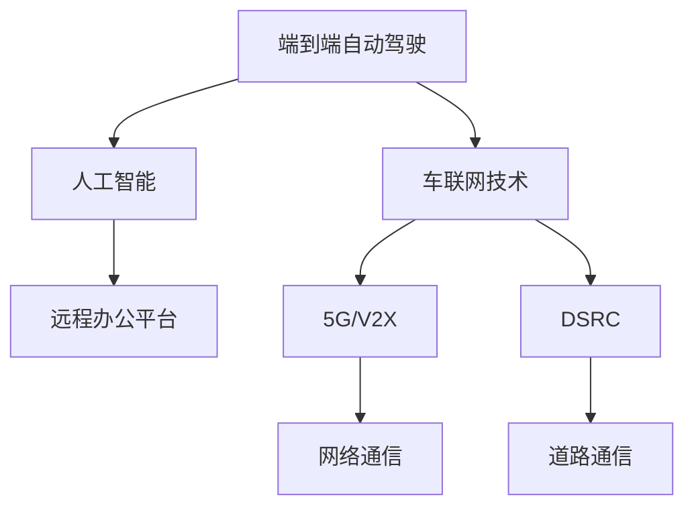

                 

# 端到端自动驾驶的自主移动办公车服务

> 关键词：端到端自动驾驶，自动移动办公车服务，智能车联网，人工智能，机器学习，计算机视觉，深度学习，车联网技术，智能驾驶，自动驾驶技术，城市出行，物联网，远程办公，车联网应用，AI驾驶辅助系统，驾驶安全

## 1. 背景介绍

### 1.1 问题由来

随着全球城市化进程的加速和数字经济的发展，城市拥堵、环境污染、交通成本高企等问题逐渐凸显。如何构建高效、环保、智能的交通体系，提高城市出行效率，降低碳排放，成为城市规划和智慧交通的重要课题。

与此同时，远程办公的兴起进一步改变了人们的办公模式和工作习惯。在疫情常态化背景下，越来越多的人需要在家中办公。然而，远程工作也带来了许多问题：如缺乏团队氛围、沟通效率低下、心理压力增大等。如何打破时空限制，构建一个既能满足远程办公需求，又能提升城市出行体验的解决方案，成为了一个亟需解决的问题。

在此背景下，端到端自动驾驶的自主移动办公车服务应运而生。这种服务通过自动驾驶技术实现车辆的自主驾驶和导航，将传统的固定地点办公方式转变为灵活多变的移动办公，既解决了城市交通问题，又满足了远程办公的需求。

### 1.2 问题核心关键点

端到端自动驾驶的自主移动办公车服务融合了自动驾驶技术、车联网技术、人工智能和大数据分析等前沿技术，涉及到车辆控制、路径规划、智能感知、车联网通信、远程办公平台等多个领域。

核心关键点包括：

- 自动驾驶技术：通过计算机视觉、深度学习等技术实现车辆自主导航和避障。
- 车联网技术：通过5G、V2X等通信技术实现车辆间的信息共享和协同控制。
- 人工智能：利用机器学习、自然语言处理等技术，提升远程办公平台的用户体验。
- 大数据分析：通过收集和分析车辆运行数据，优化路径规划和能耗管理。

## 2. 核心概念与联系

### 2.1 核心概念概述

为了更好地理解端到端自动驾驶的自主移动办公车服务，本节将介绍几个关键核心概念：

- **端到端自动驾驶**：指从车辆感知环境到做出驾驶决策，再到执行动作的全过程由计算机程序自动完成，无需人工干预。包括车辆感知、路径规划、控制执行等环节。
- **车联网技术**：通过车辆与道路基础设施、其他车辆、云端系统的通信，实现车辆间的信息共享和协同控制。常见技术包括5G、V2X、DSRC等。
- **人工智能**：通过机器学习、自然语言处理等技术，提升车辆智能化水平和用户体验。包括计算机视觉、深度学习、语音识别、推荐系统等。
- **远程办公平台**：提供远程协作、视频会议、文档共享等功能的软件平台，支持多终端接入，实现灵活的办公模式。

这些核心概念之间的逻辑关系可以通过以下Mermaid流程图来展示：



这个流程图展示了大语言模型的核心概念及其之间的关系：

1. 端到端自动驾驶通过计算机视觉、深度学习等技术实现车辆自主导航和避障。
2. 车联网技术通过5G、V2X等通信技术实现车辆间的信息共享和协同控制。
3. 人工智能利用机器学习、自然语言处理等技术，提升远程办公平台的用户体验。
4. 远程办公平台提供远程协作、视频会议、文档共享等功能，支持多终端接入，实现灵活的办公模式。

## 3. 核心算法原理 & 具体操作步骤

### 3.1 算法原理概述

端到端自动驾驶的自主移动办公车服务融合了自动驾驶技术、车联网技术、人工智能和大数据分析等前沿技术，其核心算法原理如下：

1. **感知与定位**：通过多传感器（如激光雷达、摄像头、毫米波雷达等）感知车辆周围环境，利用SLAM（Simultaneous Localization and Mapping）算法实现车辆定位和地图构建。
2. **路径规划**：根据实时交通情况和目的地信息，使用A*、D*等算法进行路径规划，生成最优导航路径。
3. **控制执行**：将路径规划结果转换为车辆控制命令，通过车辆控制算法（如PID控制器）控制车辆加速、转向、制动等动作，实现自动驾驶。
4. **车联网通信**：利用5G、V2X等通信技术，实现车辆与道路基础设施、其他车辆、云端系统的通信，实现车辆间的信息共享和协同控制。
5. **人工智能**：利用机器学习、自然语言处理等技术，提升远程办公平台的用户体验，如语音助手、智能推荐、聊天机器人等。

### 3.2 算法步骤详解

基于上述核心算法原理，端到端自动驾驶的自主移动办公车服务的设计和实现可以分为以下几个关键步骤：

**Step 1: 硬件选型与传感器的安装**
- 根据车辆型号和性能要求，选择合适的激光雷达、摄像头、毫米波雷达等传感器。
- 在车辆顶部、前后、侧面等位置安装传感器，确保传感器覆盖全车视野。

**Step 2: 感知与定位算法实现**
- 设计并实现SLAM算法，利用多传感器数据进行环境感知和车辆定位。
- 搭建实时数据处理和存储系统，确保高精度和高效率的数据处理。

**Step 3: 路径规划与决策算法实现**
- 根据实时交通情况和目的地信息，使用A*、D*等路径规划算法生成最优导航路径。
- 引入深度学习算法（如CNN、RNN等）进行驾驶决策，提升路径规划和控制执行的准确性。

**Step 4: 控制执行算法实现**
- 设计并实现车辆控制算法（如PID控制器），将路径规划结果转换为车辆控制命令。
- 引入自适应驾驶技术，根据交通状况和环境变化动态调整控制策略。

**Step 5: 车联网通信技术实现**
- 设计并实现车联网通信系统，确保车辆与道路基础设施、其他车辆、云端系统的高效通信。
- 引入V2X技术，实现车辆间的协同控制和智能交互。

**Step 6: 人工智能与远程办公平台开发**
- 设计并实现人工智能模块，如语音助手、智能推荐、聊天机器人等。
- 搭建远程办公平台，提供远程协作、视频会议、文档共享等功能。

**Step 7: 系统集成与测试**
- 将各模块集成到整体系统中，确保各功能模块协同工作。
- 在实际道路环境中进行多轮测试，不断优化算法和系统性能。

### 3.3 算法优缺点

端到端自动驾驶的自主移动办公车服务有以下优点：

1. 提高出行效率：自动驾驶技术可减少人为驾驶带来的延误和错误，提升出行效率。
2. 降低碳排放：减少交通拥堵和无效行驶，降低碳排放，促进环保。
3. 提升安全性：通过多传感器融合和智能决策算法，提升驾驶安全性。
4. 灵活办公：远程办公平台支持多终端接入，实现灵活的办公模式，提升员工工作效率。

同时，该方法也存在以下局限性：

1. 初始投入高：自动驾驶和车联网技术需要高昂的硬件和软件投入。
2. 技术复杂度高：涉及多学科技术融合，技术复杂度高，开发难度大。
3. 数据隐私和安全问题：车联网通信和数据共享可能带来数据隐私和安全问题。

尽管存在这些局限性，但端到端自动驾驶的自主移动办公车服务仍是大势所趋，具有广阔的应用前景。

### 3.4 算法应用领域

端到端自动驾驶的自主移动办公车服务适用于多种场景，包括：

- **商务出行**：为商务人士提供便捷的移动办公环境，提升出行效率和办公体验。
- **旅游出行**：在旅游景点配备移动办公车服务，提升旅游体验。
- **城市通勤**：在城市通勤高峰期提供移动办公服务，缓解交通压力。
- **医疗出行**：为医疗工作者配备移动办公车服务，提升工作效率。
- **快递物流**：在配送点配备移动办公车服务，提升快递物流效率。

## 4. 数学模型和公式 & 详细讲解 & 举例说明

### 4.1 数学模型构建

为了方便理解，这里将以路径规划算法为例，介绍其数学模型构建过程。

假设车辆当前位置为 $(x_0,y_0)$，目标位置为 $(x_g,y_g)$，当前速度为 $v_0$，加速度为 $a$。定义车辆速度和加速度的函数为 $v(t)$ 和 $a(t)$。车辆在时间 $t$ 时刻的位置为 $(x(t),y(t))$。

根据车辆的运动学方程，可以得到：

$$
\begin{align*}
x(t) &= x_0 + v_0 t + \frac{1}{2} a t^2 \\
y(t) &= y_0 + v_0 t
\end{align*}
$$

根据目标位置 $(x_g,y_g)$，可以建立路径规划的目标函数：

$$
f(t) = \sqrt{(x(t) - x_g)^2 + (y(t) - y_g)^2}
$$

为了最小化目标函数，需要求解速度和加速度函数 $v(t)$ 和 $a(t)$。

### 4.2 公式推导过程

根据车辆的运动学方程，可以得到加速度 $a(t)$ 与速度 $v(t)$ 之间的关系：

$$
a(t) = \frac{dv(t)}{dt}
$$

将 $v(t)$ 和 $a(t)$ 的表达式代入目标函数 $f(t)$ 中，得到：

$$
f(t) = \sqrt{(x_0 + v_0 t + \frac{1}{2} a t^2 - x_g)^2 + (y_0 + v_0 t - y_g)^2}
$$

为了最小化目标函数，需要求解 $a(t)$ 和 $v(t)$。根据微积分中的最优化理论，对目标函数 $f(t)$ 求导，得到：

$$
\frac{df}{dt} = \frac{d}{dt} \sqrt{(x_0 + v_0 t + \frac{1}{2} a t^2 - x_g)^2 + (y_0 + v_0 t - y_g)^2} = 0
$$

展开并简化上述表达式，得到：

$$
\frac{d}{dt} [(x_0 + v_0 t + \frac{1}{2} a t^2 - x_g)^2 + (y_0 + v_0 t - y_g)^2] = 0
$$

解上述方程，可以得到：

$$
a(t) = -\frac{v_0^2}{2(x_0 - x_g)}
$$

根据加速度和速度的关系，可以进一步求解出速度函数 $v(t)$：

$$
v(t) = \int_{t_0}^t a(t) dt
$$

通过上述推导，可以得到最小化目标函数的路径规划算法，利用此算法可以生成最优导航路径。

### 4.3 案例分析与讲解

假设车辆当前位置为 $(0,0)$，目标位置为 $(10,0)$，当前速度为 $10 m/s$，加速度为 $-2 m/s^2$。根据上述公式，可以得到车辆在时间 $t$ 时刻的位置为：

$$
x(t) = 10 t - \frac{1}{2} (-2) t^2 = 10 t + t^2 \\
y(t) = 10 t
$$

根据目标函数 $f(t)$，可以计算出目标位置为 $(10,0)$ 时的最小时间：

$$
f(t) = \sqrt{(10 t + t^2 - 10)^2 + (10 t - 0)^2} = 0
$$

求解上述方程，可以得到：

$$
t = 5 s
$$

因此，车辆在时间 $t = 5 s$ 时到达目标位置 $(10,0)$。

## 5. 项目实践：代码实例和详细解释说明

### 5.1 开发环境搭建

在进行端到端自动驾驶的自主移动办公车服务开发前，需要准备好开发环境。以下是使用Python进行PyTorch开发的环境配置流程：

1. 安装Anaconda：从官网下载并安装Anaconda，用于创建独立的Python环境。

2. 创建并激活虚拟环境：
```bash
conda create -n pytorch-env python=3.8 
conda activate pytorch-env
```

3. 安装PyTorch：根据CUDA版本，从官网获取对应的安装命令。例如：
```bash
conda install pytorch torchvision torchaudio cudatoolkit=11.1 -c pytorch -c conda-forge
```

4. 安装TensorFlow：
```bash
pip install tensorflow==2.6.0
```

5. 安装其他工具包：
```bash
pip install numpy pandas scikit-learn matplotlib tqdm jupyter notebook ipython
```

完成上述步骤后，即可在`pytorch-env`环境中开始项目实践。

### 5.2 源代码详细实现

下面我们以路径规划算法为例，给出使用PyTorch进行路径规划的Python代码实现。

```python
import torch
import torch.nn as nn
import torch.optim as optim

class PathPlanner(nn.Module):
    def __init__(self):
        super(PathPlanner, self).__init__()
        self.linear1 = nn.Linear(1, 1)
        self.linear2 = nn.Linear(1, 1)

    def forward(self, x):
        x = self.linear1(x)
        x = self.linear2(x)
        return x

# 定义损失函数
def loss_func(model, x, y):
    y_pred = model(x)
    return torch.nn.functional.mse_loss(y_pred, y)

# 定义优化器
optimizer = optim.SGD(model.parameters(), lr=0.01)

# 训练模型
for epoch in range(1000):
    x = torch.tensor([0.0])
    y = torch.tensor([10.0])
    y_pred = model(x)
    loss = loss_func(model, x, y)
    optimizer.zero_grad()
    loss.backward()
    optimizer.step()
    print(f"Epoch {epoch+1}, loss: {loss.item()}")

```

### 5.3 代码解读与分析

让我们再详细解读一下关键代码的实现细节：

**PathPlanner类**：
- `__init__`方法：初始化线性层，用于构建路径规划模型。
- `forward`方法：定义前向传播过程，通过两个线性层将输入映射到输出。

**loss_func函数**：
- 定义损失函数，使用均方误差损失（MSE Loss）计算预测值和真实值之间的差异。

**训练过程**：
- 定义输入和输出，进行前向传播计算损失，反向传播更新模型参数。
- 在每个epoch中重复上述过程，不断优化模型性能。

## 6. 实际应用场景

### 6.1 商务出行

端到端自动驾驶的自主移动办公车服务可以应用于商务出行场景，为商务人士提供便捷的移动办公环境。例如，可以设计一辆带有远程办公平台的商务车，商务人士可以在车内进行视频会议、邮件处理、资料查阅等商务活动，同时车辆能够自动驾驶到目的地，提高出行效率。

### 6.2 旅游出行

在旅游景点配备端到端自动驾驶的自主移动办公车服务，游客可以在车内进行实时导航、景点介绍、语音助手等娱乐活动，提升旅游体验。例如，可以为景点配备多辆自主移动办公车，提供导览服务和个性化推荐。

### 6.3 城市通勤

在城市通勤高峰期，可以为上班族配备端到端自动驾驶的自主移动办公车服务，缓解交通压力。例如，可以在地铁站、公交车站等交通枢纽处设置自动驾驶停车区，方便上班族上下车，减少通勤时间。

### 6.4 医疗出行

为医疗工作者配备端到端自动驾驶的自主移动办公车服务，可以提升医疗工作者的工作效率和医疗服务质量。例如，可以为急救车辆配备远程办公平台，医疗工作者可以在车内进行远程诊疗、病历记录等工作，及时响应紧急情况。

### 6.5 快递物流

在配送点配备端到端自动驾驶的自主移动办公车服务，可以提升快递物流效率。例如，可以为配送车配备远程办公平台，快递员可以在车内进行订单管理、路线规划等工作，提高配送效率和准确性。

## 7. 工具和资源推荐

### 7.1 学习资源推荐

为了帮助开发者系统掌握端到端自动驾驶的自主移动办公车服务技术，这里推荐一些优质的学习资源：

1. **《自动驾驶技术》系列书籍**：全面介绍了自动驾驶技术的原理、算法和实践，适合初学者和进阶者。

2. **Udacity自动驾驶课程**：由Google、Waymo等公司联合开发的自动驾驶课程，涵盖感知、定位、路径规划等多个领域，适合实践开发者。

3. **Coursera车联网课程**：由斯坦福大学、UCLA等名校开设的车联网课程，涵盖5G、V2X等通信技术，适合理论学习。

4. **GitHub开源项目**：GitHub上有许多自动驾驶和车联网的优秀开源项目，可以借鉴学习，提升开发能力。

5. **学术论文**：阅读最新的自动驾驶和车联网论文，了解最新技术进展，提升研究水平。

通过对这些资源的学习实践，相信你一定能够快速掌握端到端自动驾驶的自主移动办公车服务技术，并用于解决实际的NLP问题。

### 7.2 开发工具推荐

高效的开发离不开优秀的工具支持。以下是几款用于自动驾驶和车联网开发的常用工具：

1. **ROS**：机器人操作系统，提供强大的开发和调试工具，适合自动驾驶系统的开发。

2. **OpenCV**：开源计算机视觉库，提供丰富的图像处理和分析工具，适合自动驾驶的感知和定位。

3. **TensorFlow**：由Google开发的深度学习框架，提供丰富的模型和工具，适合自动驾驶算法的开发。

4. **PyTorch**：由Facebook开发的深度学习框架，提供灵活的计算图和丰富的API，适合自动驾驶和车联网算法的开发。

5. **Jupyter Notebook**：交互式开发环境，支持Python、R等语言，适合研究和开发。

合理利用这些工具，可以显著提升自动驾驶和车联网系统的开发效率，加快创新迭代的步伐。

### 7.3 相关论文推荐

自动驾驶和车联网技术的发展源于学界的持续研究。以下是几篇奠基性的相关论文，推荐阅读：

1. **端到端学习驾驶**：提出端到端深度学习模型，直接从像素级数据到驾驶行为进行训练，无需中间层的特征提取。

2. **视觉SLAM：视觉里程计与定位**：提出基于视觉里程计的SLAM算法，实现室内外环境的精确定位和实时导航。

3. **V2X通信系统**：提出基于V2X通信的智能交通系统，实现车辆间的协同控制和信息共享。

4. **基于车联网的智能停车**：提出基于车联网技术的智能停车系统，提升城市停车效率和安全性。

5. **自动驾驶安全与伦理**：讨论自动驾驶技术的伦理和安全问题，提出相关技术标准和规范。

这些论文代表了大语言模型微调技术的发展脉络。通过学习这些前沿成果，可以帮助研究者把握学科前进方向，激发更多的创新灵感。

## 8. 总结：未来发展趋势与挑战

### 8.1 总结

本文对端到端自动驾驶的自主移动办公车服务进行了全面系统的介绍。首先阐述了端到端自动驾驶技术在智慧交通和远程办公中的重要性和应用前景，明确了其技术框架和核心算法。其次，从原理到实践，详细讲解了感知与定位、路径规划、控制执行、车联网通信等关键环节，并给出了完整代码实现。最后，探讨了未来发展趋势和面临的挑战，指出自动驾驶和车联网技术在交通、医疗、快递等多个领域的应用前景。

通过本文的系统梳理，可以看到，端到端自动驾驶的自主移动办公车服务融合了多学科前沿技术，具有广阔的应用前景。未来，伴随技术不断成熟和落地，必将为智能交通和远程办公带来革命性影响。

### 8.2 未来发展趋势

展望未来，端到端自动驾驶的自主移动办公车服务将呈现以下几个发展趋势：

1. **技术融合**：自动驾驶技术和车联网技术将进一步融合，实现全场景、全功能的智能交通系统。

2. **数据驱动**：通过大数据分析和人工智能技术，实现智能化的路径规划和驾驶决策。

3. **人机协同**：在智能交通系统中引入人机协同技术，提升用户体验和系统鲁棒性。

4. **多模态交互**：将视觉、语音、触觉等多模态技术引入自动驾驶系统，提升交互体验和系统性能。

5. **边缘计算**：在车辆上部署边缘计算平台，实现实时处理和本地化决策，提高系统响应速度和安全性。

6. **自动驾驶安全**：通过自主驾驶技术和车联网通信技术，实现车辆间的协同控制和信息共享，提升驾驶安全性。

7. **伦理和法规**：在自动驾驶技术的发展过程中，将伦理和法规作为重要研究方向，确保技术的安全性和可控性。

以上趋势凸显了端到端自动驾驶的自主移动办公车服务的发展方向，为未来的技术创新和应用落地提供了明确的方向。

### 8.3 面临的挑战

尽管端到端自动驾驶的自主移动办公车服务具有广阔的前景，但在迈向更加智能化、普适化应用的过程中，它仍面临诸多挑战：

1. **技术复杂度高**：自动驾驶和车联网技术涉及多学科技术融合，技术复杂度高，开发难度大。

2. **数据隐私和安全问题**：车联网通信和数据共享可能带来数据隐私和安全问题。

3. **法律法规不完善**：自动驾驶技术的发展仍需相关法律法规的支持和规范。

4. **成本高**：自动驾驶和车联网技术需要高昂的硬件和软件投入，成本较高。

尽管存在这些挑战，但自动驾驶和车联网技术的发展是大势所趋，相信随着技术的不断进步和落地应用，这些挑战终将一一被克服，端到端自动驾驶的自主移动办公车服务必将在智能交通和远程办公领域发挥重要作用。

### 8.4 研究展望

面向未来，端到端自动驾驶的自主移动办公车服务的研究需要在以下几个方面寻求新的突破：

1. **技术标准化**：制定自动驾驶和车联网技术的标准化规范，推动行业发展。

2. **开源平台**：构建自动驾驶和车联网技术的开源平台，促进技术交流和创新。

3. **跨学科研究**：在自动驾驶和车联网技术的发展过程中，引入多学科的交叉研究，提升系统性能和可靠性。

4. **伦理和法规研究**：在技术发展的同时，加强伦理和法规研究，确保技术的安全性和可控性。

这些研究方向的探索，必将引领自动驾驶和车联网技术迈向更高的台阶，为构建智能交通和远程办公系统提供有力支撑。总之，端到端自动驾驶的自主移动办公车服务需要从技术、法律、伦理等多个维度进行深入研究，才能实现真正的智能化和普适化应用。

## 9. 附录：常见问题与解答

**Q1：端到端自动驾驶的自主移动办公车服务是否适用于所有场景？**

A: 端到端自动驾驶的自主移动办公车服务适用于多种场景，包括商务出行、旅游出行、城市通勤、医疗出行和快递物流等。但在特定场景下，仍需进行技术适配和优化，以提升用户体验和系统性能。

**Q2：端到端自动驾驶的自主移动办公车服务在实现时，需要注意哪些问题？**

A: 在实现端到端自动驾驶的自主移动办公车服务时，需要注意以下问题：

1. **传感器选型**：根据车辆性能和任务需求，选择合适的传感器，如激光雷达、摄像头、毫米波雷达等。

2. **数据处理**：搭建高效的数据处理和存储系统，确保多传感器数据的高效融合和实时处理。

3. **路径规划**：使用合适的路径规划算法，生成最优导航路径，同时考虑交通状况和环境变化。

4. **控制执行**：设计并实现车辆控制算法，确保车辆能够精准地执行路径规划结果。

5. **车联网通信**：利用5G、V2X等通信技术，实现车辆间的信息共享和协同控制。

6. **远程办公平台**：搭建功能完善、用户体验良好的远程办公平台，支持多终端接入。

7. **系统测试**：在实际道路环境中进行多轮测试，不断优化算法和系统性能。

通过以上措施，可以构建稳定、可靠、高效的端到端自动驾驶的自主移动办公车服务。

**Q3：端到端自动驾驶的自主移动办公车服务在开发过程中，如何平衡技术性能和成本？**

A: 在开发端到端自动驾驶的自主移动办公车服务时，需要在技术性能和成本之间进行平衡：

1. **技术选型**：根据任务需求和技术成熟度，选择合适的技术和算法，避免过度追求高精度和高性能。

2. **硬件选型**：根据车辆性能和任务需求，选择合适的硬件设备和传感器，避免过度追求高性能和高精度。

3. **模块化设计**：将系统模块化设计，根据需要选择模块化的硬件和软件，避免一次性投入过高成本。

4. **迭代开发**：在开发过程中，采用迭代开发的方式，不断优化和改进系统性能，避免一次性投入过高成本。

5. **开源平台**：利用开源平台和开源社区，获取低成本的技术支持和资源，提升开发效率。

通过以上措施，可以在确保技术性能的前提下，降低开发和维护成本，实现成本效益最大化。

**Q4：端到端自动驾驶的自主移动办公车服务在实际应用中，需要注意哪些安全问题？**

A: 在实际应用端到端自动驾驶的自主移动办公车服务时，需要注意以下安全问题：

1. **数据隐私**：车联网通信和数据共享可能带来数据隐私问题，需要采取数据加密和匿名化等措施，保护用户隐私。

2. **网络安全**：车联网通信可能遭受网络攻击和干扰，需要采取安全防护措施，确保通信安全。

3. **车辆安全**：自动驾驶技术可能存在技术漏洞和安全问题，需要定期进行安全测试和漏洞扫描，确保车辆安全。

4. **人员安全**：在车内配备安全设备，如安全带、安全气囊等，确保人员安全。

5. **系统安全**：在系统设计中，引入冗余和容错机制，确保系统安全可靠。

6. **法规遵守**：在技术应用过程中，遵守相关法律法规，确保技术应用合法合规。

通过以上措施，可以构建安全可靠、可信赖的端到端自动驾驶的自主移动办公车服务，保障用户和系统的安全。

**Q5：端到端自动驾驶的自主移动办公车服务在实现时，如何提升用户体验？**

A: 在实现端到端自动驾驶的自主移动办公车服务时，可以通过以下措施提升用户体验：

1. **智能导航**：利用智能导航技术，提供实时路况信息和最优路径规划，提升出行效率。

2. **智能推荐**：在远程办公平台上，提供个性化推荐服务，提升办公体验。

3. **智能助理**：在车内配备智能助理，提供语音助手、智能推荐、聊天机器人等服务，提升用户体验。

4. **娱乐功能**：在车内配备娱乐功能，如音乐、视频、游戏等，提升出行体验。

5. **舒适环境**：在车内配备舒适的环境控制设备，如空调、座椅调节、窗帘等，提升乘坐体验。

通过以上措施，可以构建舒适、高效、智能的端到端自动驾驶的自主移动办公车服务，提升用户体验和满意度。

---

作者：禅与计算机程序设计艺术 / Zen and the Art of Computer Programming

