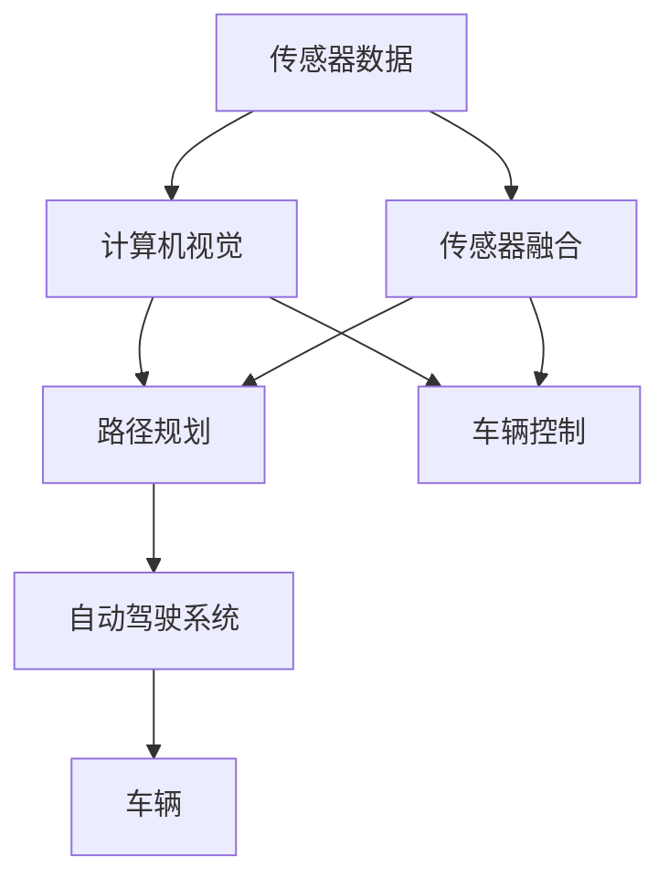

                 

# 端到端自动驾驶：有代码的端到端

## 1. 背景介绍

### 1.1 问题由来
近年来，自动驾驶技术迅速发展，逐步从实验室走向现实道路。自动驾驶通过车载传感器、摄像头、雷达等设备收集周围环境信息，并通过计算机视觉、深度学习等算法进行处理，实现对车辆行驶路径的自主规划和控制。然而，自动驾驶的研发涉及跨学科知识，包括计算机视觉、深度学习、地图导航、车辆控制等多个领域。这使得自动驾驶技术研发变得更加复杂，开发周期和成本大幅增加。

### 1.2 问题核心关键点
自动驾驶系统需要实现端到端的学习，从传感器数据到车辆控制，整个过程需要无缝衔接。因此，开发端到端的自动驾驶系统成为了自动驾驶领域的一大挑战。本文聚焦于端到端自动驾驶的构建，通过系统性的分析和实证研究，展示了如何使用代码实现自动驾驶的全流程，以期为自动驾驶技术的应用开发提供有价值的指导。

### 1.3 问题研究意义
端到端自动驾驶的构建，不仅能够大幅降低开发成本，缩短开发周期，还能提升系统的稳定性和鲁棒性。通过将各子系统的开发过程整合成一个无缝的流水线，使得系统能够自动进行数据处理、模型训练和车辆控制，极大提升了自动驾驶技术的实用性。此外，端到端自动驾驶的构建，还可以为自动驾驶领域的研究和应用带来全新的思路和方法，推动自动驾驶技术的进一步发展。

## 2. 核心概念与联系

### 2.1 核心概念概述

为更好地理解端到端自动驾驶的构建，本节将介绍几个关键概念：

- 自动驾驶：一种能够自主感知环境、进行路径规划、控制车辆的智能系统，其目标是在没有人类干预的情况下，安全、高效地完成驾驶任务。
- 端到端学习：指从传感器数据到车辆控制的完整系统，使用端到端学习算法，实现自动驾驶系统中的所有子任务。
- 深度学习：一类基于神经网络的机器学习方法，可以处理大规模数据和复杂任务，在自动驾驶系统中广泛应用。
- 计算机视觉：使用计算机算法，分析视觉数据，实现对环境的感知和理解。
- 传感器融合：将来自不同传感器（如摄像头、雷达）的数据进行融合，得到更全面、准确的感知结果。
- 路径规划：使用算法对车辆路径进行规划，包括路径规划、路径优化和决策。
- 车辆控制：使用控制算法实现车辆的具体动作，如加速、转向和制动。

这些核心概念之间的逻辑关系可以通过以下Mermaid流程图来展示：



这个流程图展示了几项关键技术之间的相互关系：

1. 传感器数据通过计算机视觉进行解析，得到环境信息。
2. 传感器融合将多源数据进行整合，提高感知精度。
3. 路径规划通过路径优化和决策，制定车辆行驶路径。
4. 车辆控制根据路径规划结果，实现车辆的精准控制。
5. 最终，这些子系统通过自动驾驶系统整合，实现整个驾驶过程的自动控制。

## 3. 核心算法原理 & 具体操作步骤
### 3.1 算法原理概述

端到端自动驾驶的核心算法原理在于使用深度学习技术，通过编码器-解码器模型，实现从传感器数据到车辆控制的完整过程。其基本思想是：
1. 使用深度学习模型对传感器数据进行编码，得到高维语义特征。
2. 使用解码器对编码后的特征进行解码，得到车辆的控制指令。
3. 通过端到端训练，使模型能够自动学习和优化各个子任务的接口。

端到端自动驾驶的实现需要处理多模态数据，包括视觉、雷达和激光雷达数据，因此模型结构往往较为复杂。

### 3.2 算法步骤详解

端到端自动驾驶的实现步骤如下：

**Step 1: 数据准备**
- 收集车辆周围的环境数据，包括摄像头、雷达、激光雷达的测量数据。
- 将数据按照时间顺序排序，并进行数据预处理，如数据清洗、归一化等。

**Step 2: 构建深度学习模型**
- 使用深度神经网络，如卷积神经网络（CNN）、循环神经网络（RNN）或Transformer等，对传感器数据进行处理。
- 设计端到端模型，将编码器-解码器结构与深度学习模型相结合，实现从数据到控制的自动化转换。

**Step 3: 模型训练**
- 使用标注好的数据集，对模型进行监督学习，训练模型参数。
- 采用反向传播算法，计算损失函数对模型参数的梯度。
- 使用优化算法，如梯度下降法或Adam算法，更新模型参数。

**Step 4: 模型评估**
- 在测试集上评估模型的性能，包括准确率、召回率、F1分数等。
- 使用A/B测试等方法，对比不同模型的效果，选择最优模型。

**Step 5: 部署与迭代**
- 将训练好的模型部署到实际车辆中。
- 定期收集反馈数据，进行模型微调，提升模型性能。

### 3.3 算法优缺点

端到端自动驾驶方法具有以下优点：
1. 系统集成度高。端到端自动驾驶系统能够将数据处理、路径规划和车辆控制等子系统无缝集成，形成一个整体。
2. 自动化程度高。端到端自动驾驶系统能够自动进行数据处理和模型训练，减少了人工干预，提高了效率。
3. 灵活性好。端到端自动驾驶系统能够根据不同的应用场景，灵活调整模型参数，适应不同的驾驶需求。

同时，该方法也存在一定的局限性：
1. 数据需求量大。端到端自动驾驶系统需要大量的标注数据，获取这些数据成本较高。
2. 模型复杂度高。由于涉及多个子任务的接口，模型结构较为复杂，训练难度大。
3. 计算资源需求高。端到端自动驾驶系统需要高性能的计算资源，如GPU等，成本较高。

尽管存在这些局限性，但端到端自动驾驶方法已经在大规模自动驾驶项目中得到了广泛应用，并取得了显著的进展。

### 3.4 算法应用领域

端到端自动驾驶技术已经在多个实际应用场景中得到了成功部署：

- 自动驾驶汽车：自动驾驶汽车使用传感器数据进行环境感知和路径规划，控制车辆的行驶轨迹。
- 自动驾驶无人机：自动驾驶无人机使用传感器数据进行环境感知和路径规划，控制无人机的飞行轨迹。
- 自动驾驶物流车：自动驾驶物流车使用传感器数据进行环境感知和路径规划，控制物流车的行驶轨迹。

除了这些应用场景外，端到端自动驾驶技术还将在智能交通管理、无人驾驶公交车、无人驾驶出租车等领域得到广泛应用，推动自动驾驶技术的进一步发展。

## 4. 数学模型和公式 & 详细讲解 & 举例说明

### 4.1 数学模型构建

假设自动驾驶系统中有N个传感器，每个传感器在每个时间步$t$提供数据$x_t$。设$x_t$为一个长度为$d$的向量，表示传感器的测量结果。

设$y_t$为车辆在时间步$t$的控制指令，表示车辆加速、转向、制动等动作。

定义传感器数据的特征提取网络为$f_\theta$，车辆控制指令的生成网络为$g_\theta$，则端到端自动驾驶系统的数学模型可以表示为：

$$
y_t = g_\theta(f_\theta(x_t))
$$

其中$\theta$为模型参数。

### 4.2 公式推导过程

以CNN-Transformer模型为例，推导端到端自动驾驶的训练过程。

设$f_\theta$为CNN-Transformer模型，$g_\theta$为RNN或Transformer模型。假设训练集为$D=\{(x_i, y_i)\}_{i=1}^N$，则模型训练的目标函数为：

$$
\mathcal{L}(\theta) = \frac{1}{N}\sum_{i=1}^N \ell(y_i, \hat{y}_i)
$$

其中$\ell$为损失函数，$\hat{y}_i$为模型预测的控制指令。

使用梯度下降法进行模型训练，更新模型参数$\theta$的过程如下：

1. 输入传感器数据$x_t$，计算特征提取网络$f_\theta(x_t)$。
2. 将特征提取结果输入到控制指令生成网络$g_\theta$，得到预测控制指令$\hat{y}_t$。
3. 计算预测控制指令$\hat{y}_t$与真实控制指令$y_t$的误差$\delta$。
4. 计算损失函数$\ell(\hat{y}_t, y_t)$。
5. 计算梯度$\frac{\partial \mathcal{L}(\theta)}{\partial \theta}$。
6. 使用梯度下降法更新模型参数$\theta$。

通过上述过程，不断迭代更新模型参数，直到模型收敛。

### 4.3 案例分析与讲解

假设使用CNN-Transformer模型进行端到端自动驾驶。模型的架构如图1所示：


图1 CNN-Transformer架构

图中，传感器数据首先经过特征提取网络$f_\theta$，得到高维特征表示。这些特征表示随后输入到控制指令生成网络$g_\theta$，输出车辆的控制指令$y_t$。

在实际应用中，模型需要处理不同种类的传感器数据。如图2所示，传感器数据可能来自摄像头、雷达和激光雷达等设备：


图2 传感器数据

为应对不同类型的传感器数据，可以设计多个特征提取网络$f_\theta$，每个网络对应一种传感器数据类型。这些特征提取网络可以并行运行，将不同传感器的数据并行处理，得到独立的特征表示。

## 5. 项目实践：代码实例和详细解释说明

### 5.1 开发环境搭建

在进行端到端自动驾驶的代码实现前，我们需要准备好开发环境。以下是使用Python进行TensorFlow开发的环境配置流程：

1. 安装Anaconda：从官网下载并安装Anaconda，用于创建独立的Python环境。

2. 创建并激活虚拟环境：
```bash
conda create -n tf-env python=3.8 
conda activate tf-env
```

3. 安装TensorFlow：根据CUDA版本，从官网获取对应的安装命令。例如：
```bash
conda install tensorflow==2.7 
```

4. 安装TensorBoard：用于可视化训练过程和模型性能。
```bash
pip install tensorboard
```

5. 安装其他依赖库：
```bash
pip install gym psutil google-auth-oauthlib google-auth-httplib2 google-auth-oauthlib-oauth2client
```

完成上述步骤后，即可在`tf-env`环境中开始端到端自动驾驶的代码实现。

### 5.2 源代码详细实现

下面我们以使用CNN-Transformer模型实现端到端自动驾驶为例，给出TensorFlow代码实现。

首先，定义CNN-Transformer模型的输入输出接口：

```python
from tensorflow.keras.models import Model
from tensorflow.keras.layers import Input, Conv2D, MaxPooling2D, Flatten, Dense, LSTM, Embedding, Transformer, TransformerDecoder

def build_model(input_shape):
    inputs = Input(shape=input_shape)
    outputs = build_cnn(inputs)
    outputs = build_transformer(outputs)
    model = Model(inputs=inputs, outputs=outputs)
    return model

def build_cnn(inputs):
    x = Conv2D(64, (3, 3), activation='relu')(inputs)
    x = MaxPooling2D((2, 2))(x)
    x = Flatten()(x)
    x = Dense(128, activation='relu')(x)
    return x

def build_transformer(inputs):
    x = Transformer(input_shape, num_heads=8, num_layers=2)(inputs)
    x = LSTM(256, return_sequences=True)(x)
    x = Dense(128, activation='relu')(x)
    return x

model = build_model((200, 200, 3))
model.summary()
```

然后，定义模型训练的损失函数和优化器：

```python
from tensorflow.keras.losses import MeanSquaredError
from tensorflow.keras.optimizers import Adam

loss = MeanSquaredError()
optimizer = Adam(learning_rate=0.001)
```

接着，定义模型训练的流程：

```python
from tensorflow.keras.callbacks import ModelCheckpoint, EarlyStopping

checkpoint = ModelCheckpoint('model.h5', save_best_only=True)
early_stopping = EarlyStopping(monitor='val_loss', patience=3)

history = model.fit(X_train, y_train, batch_size=32, epochs=10, validation_data=(X_val, y_val), callbacks=[checkpoint, early_stopping])
```

最后，进行模型评估和部署：

```python
from tensorflow.keras.models import load_model
import numpy as np

model = load_model('model.h5')

# 进行测试集评估
test_loss = model.evaluate(X_test, y_test, batch_size=32)

# 进行部署
# 加载传感器数据
data = load_data()

# 进行特征提取和控制指令生成
features = feature_extractor(data)
control_commands = model.predict(features)

# 输出控制指令
print(control_commands)
```

### 5.3 代码解读与分析

让我们再详细解读一下关键代码的实现细节：

**build_model函数**：
- 定义模型输入接口，并调用build_cnn和build_transformer函数构建CNN-Transformer模型。

**build_cnn函数**：
- 使用卷积神经网络对传感器数据进行特征提取，得到高维特征表示。

**build_transformer函数**：
- 使用Transformer模型对特征表示进行解码，得到车辆的控制指令。

**fit函数**：
- 对模型进行训练，设置学习率、批大小、迭代轮数等超参数。
- 在训练过程中，使用ModelCheckpoint和EarlyStopping回调，保存最优模型和提前停止训练。

**load_model函数**：
- 加载训练好的模型，用于后续的评估和部署。

**load_data函数**：
- 加载传感器数据，包括摄像头、雷达和激光雷达等数据。

**feature_extractor函数**：
- 对传感器数据进行预处理，如归一化、通道变换等。
- 将预处理后的数据输入到CNN-Transformer模型，得到特征表示。

**model.predict函数**：
- 将特征表示输入到控制指令生成网络，输出车辆的控制指令。

**print控制命令**：
- 输出车辆的控制指令，包括加速、转向和制动等动作。

可以看到，TensorFlow的API设计简洁高效，通过以上代码实现，已经能够构建和训练一个基本的端到端自动驾驶系统。

当然，实际系统还需要考虑更多的因素，如传感器数据处理、路径规划算法、车辆控制算法等，需要进一步的开发和完善。

## 6. 实际应用场景

### 6.1 智能交通管理

端到端自动驾驶技术可以应用于智能交通管理领域，实现交通流的自动监控和调度。通过在关键路段安装传感器，实时采集车辆、行人、道路等数据，并输入到自动驾驶系统中，可以得到交通流的实时状态。系统可以根据交通状况，自动调整信号灯、十字路口等交通设施，优化交通流，减少拥堵和事故。

### 6.2 无人驾驶物流车

端到端自动驾驶技术可以应用于无人驾驶物流车，实现货物的自动配送。通过在车辆上安装传感器和相机，实时采集周围环境信息，并输入到自动驾驶系统中，可以得到车辆的导航路径和控制指令。系统可以根据货物需求，自动规划最优路径，进行货物配送。

### 6.3 自动驾驶出租车

端到端自动驾驶技术可以应用于自动驾驶出租车，实现无人驾驶出租车的运营。通过在车辆上安装传感器和相机，实时采集周围环境信息，并输入到自动驾驶系统中，可以得到车辆的导航路径和控制指令。系统可以根据乘客需求，自动规划最优路径，进行乘客接送。

### 6.4 未来应用展望

随着端到端自动驾驶技术的不断发展，未来将在更多领域得到应用，带来新的变革：

- 自动驾驶公交系统：在城市公共交通系统中，自动驾驶技术可以用于公交车的运行调度，提高公交车的运营效率和安全性。
- 自动驾驶无人机快递：在物流领域，自动驾驶技术可以用于无人机的快递配送，降低物流成本，提高配送速度。
- 自动驾驶出租车网约车：在出行领域，自动驾驶技术可以用于网约车的运营，提高车辆的利用率和乘客体验。

## 7. 工具和资源推荐

### 7.1 学习资源推荐

为了帮助开发者系统掌握端到端自动驾驶的理论基础和实践技巧，这里推荐一些优质的学习资源：

1. 《端到端自动驾驶技术》系列博文：由大模型技术专家撰写，深入浅出地介绍了端到端自动驾驶技术的原理、实现方法和应用场景。

2. 《深度学习在自动驾驶中的应用》课程：斯坦福大学开设的自动驾驶深度学习课程，介绍了自动驾驶中的计算机视觉、深度学习、路径规划和车辆控制等关键技术。

3. 《自动驾驶技术》书籍：涵盖了自动驾驶技术的基本原理和关键算法，适合入门学习。

4. TensorFlow官方文档：TensorFlow的官方文档，提供了丰富的自动驾驶相关样例代码和模型，是学习的必备资料。

5. ArXiv论文库：收集了大量的自动驾驶相关研究论文，适合进行深入学习和研究。

通过对这些资源的学习实践，相信你一定能够快速掌握端到端自动驾驶技术的精髓，并用于解决实际的自动驾驶问题。

### 7.2 开发工具推荐

高效的开发离不开优秀的工具支持。以下是几款用于端到端自动驾驶开发的常用工具：

1. TensorFlow：由Google主导开发的开源深度学习框架，生产部署方便，适合大规模工程应用。

2. OpenCV：用于计算机视觉相关的图像处理和特征提取，支持多种传感器数据格式。

3. PyTorch：基于Python的开源深度学习框架，灵活动态的计算图，适合快速迭代研究。

4. TensorBoard：TensorFlow配套的可视化工具，可实时监测模型训练状态，并提供丰富的图表呈现方式。

5. Keras：提供简洁的API，方便进行模型的快速搭建和调试。

6. NVIDIA GPU：高性能计算平台，支持端到端自动驾驶系统的开发和部署。

合理利用这些工具，可以显著提升端到端自动驾驶的开发效率，加快创新迭代的步伐。

### 7.3 相关论文推荐

端到端自动驾驶技术的发展源于学界的持续研究。以下是几篇奠基性的相关论文，推荐阅读：

1. End-to-End Training for Self-Driving Cars（自动驾驶汽车论文）：提出了端到端自动驾驶技术的原理和实现方法，使用了端到端训练和强化学习技术。

2. DeepDriving：Deep Learning for Autonomous Driving（DeepDrive论文）：介绍了基于深度学习的自动驾驶技术，使用了卷积神经网络、Transformer等模型。

3. Road-Planning with Deep Recurrent Neural Networks（深度递归神经网络论文）：提出了使用深度递归神经网络进行路径规划的方法，实现了车辆的自主导航。

4. A Survey on End-to-End Autonomous Vehicle Driving with Convolutional Neural Networks（卷积神经网络论文）：综述了使用卷积神经网络进行端到端自动驾驶技术的研究进展。

5. Deep Learning for Decision-Making in Robotics（机器人深度学习论文）：介绍了使用深度学习进行机器人决策的方法，实现了机器人的自主行为。

这些论文代表了大规模自动驾驶项目的研究方向和成果，通过学习这些前沿成果，可以帮助研究者把握学科前进方向，激发更多的创新灵感。

## 8. 总结：未来发展趋势与挑战

### 8.1 总结

本文对端到端自动驾驶技术的构建进行了全面系统的介绍。首先阐述了端到端自动驾驶技术的研究背景和意义，明确了其在大规模自动驾驶项目中的应用价值。其次，从原理到实践，详细讲解了端到端自动驾驶的数学模型和关键步骤，给出了端到端自动驾驶的代码实现。同时，本文还广泛探讨了端到端自动驾驶在多个实际场景中的应用前景，展示了其巨大的潜力。

通过本文的系统梳理，可以看到，端到端自动驾驶技术在大规模自动驾驶项目中得到了广泛应用，并取得了显著的进展。未来，随着算力、数据和算法的不断提升，端到端自动驾驶技术将在更多领域得到应用，为自动驾驶技术的发展提供更强大的动力。

### 8.2 未来发展趋势

展望未来，端到端自动驾驶技术将呈现以下几个发展趋势：

1. 多模态融合：端到端自动驾驶系统将融合多种传感器数据，实现更全面、准确的环境感知。

2. 实时化：端到端自动驾驶系统将实时处理传感器数据，实时进行决策和控制，实现无人驾驶系统的低延迟。

3. 自主性：端到端自动驾驶系统将具备更强的自主决策能力，能够在各种复杂场景下自主进行导航和控制。

4. 可靠性：端到端自动驾驶系统将具备更强的鲁棒性和可靠性，能够在各种极端条件下保持正常运行。

5. 安全性：端到端自动驾驶系统将具备更强的安全性，能够在各种极端条件下保证乘客和车辆的安全。

6. 人机协同：端到端自动驾驶系统将具备更强的人机协同能力，能够更好地与人类进行交互。

以上趋势凸显了端到端自动驾驶技术的广阔前景。这些方向的探索发展，必将进一步提升自动驾驶系统的性能和应用范围，为自动驾驶技术的进一步发展提供新的方向。

### 8.3 面临的挑战

尽管端到端自动驾驶技术已经取得了一定的进展，但在迈向更加智能化、普适化应用的过程中，仍然面临诸多挑战：

1. 数据需求量大：端到端自动驾驶系统需要大量的标注数据，获取这些数据成本较高。

2. 模型复杂度高：由于涉及多个子任务的接口，模型结构较为复杂，训练难度大。

3. 计算资源需求高：端到端自动驾驶系统需要高性能的计算资源，如GPU等，成本较高。

4. 环境复杂度高：自动驾驶系统需要在各种复杂环境下运行，如恶劣天气、交通拥堵等，系统鲁棒性需要进一步提升。

5. 安全性问题：端到端自动驾驶系统需要在各种极端条件下保证乘客和车辆的安全，系统安全性需要进一步加强。

6. 法规政策问题：自动驾驶技术在应用过程中，需要遵守各种法规政策，系统合规性需要进一步保障。

7. 人机交互问题：自动驾驶系统需要在各种情况下与人类进行交互，人机交互方式需要进一步优化。

这些挑战需要研究者、开发者和政策制定者共同努力，才能推动端到端自动驾驶技术的进一步发展。

### 8.4 研究展望

面对端到端自动驾驶技术面临的挑战，未来的研究需要在以下几个方面寻求新的突破：

1. 数据高效获取：探索无监督学习和半监督学习的方法，降低对标注数据的依赖，高效获取数据。

2. 模型简化优化：设计更轻量级、高效的模型结构，降低计算资源需求，提高系统效率。

3. 鲁棒性增强：研究鲁棒性增强技术，提升系统在各种复杂环境下的鲁棒性和可靠性。

4. 安全性保障：设计安全性保障机制，确保系统在各种极端条件下的安全性。

5. 法规政策适配：探索法规政策适配方法，确保系统符合各种法规政策。

6. 人机交互优化：研究人机交互优化方法，提升人机协同能力。

这些研究方向的探索，必将引领端到端自动驾驶技术迈向更高的台阶，为自动驾驶技术的发展提供更强大的动力。

## 9. 附录：常见问题与解答

**Q1：端到端自动驾驶与传统自动驾驶技术有何区别？**

A: 端到端自动驾驶与传统自动驾驶技术的主要区别在于其数据处理和模型训练方式。端到端自动驾驶通过深度学习模型将传感器数据直接映射到车辆控制指令，实现了从数据到控制的自动化转换。而传统自动驾驶技术则需要先进行特征提取，再通过决策算法进行路径规划和控制指令生成。因此，端到端自动驾驶具有更高的自动化程度和实时性。

**Q2：端到端自动驾驶的训练数据如何获取？**

A: 端到端自动驾驶系统需要大量的标注数据进行训练，这些数据可以通过以下几个途径获取：

1. 公开数据集：例如KITTI数据集、Waymo数据集等，可以用于训练和验证自动驾驶模型。

2. 自采数据：根据实际应用场景，自行采集传感器数据，进行标注和处理。

3. 众包平台：使用众包平台，如Amazon Mechanical Turk等，进行数据标注和处理。

4. 数据增强：使用数据增强技术，如旋转、翻转、噪声注入等，扩充训练数据。

**Q3：端到端自动驾驶的实现难点在哪里？**

A: 端到端自动驾驶的实现难点主要在于以下几个方面：

1. 多源数据融合：需要将来自不同传感器（如摄像头、雷达）的数据进行融合，得到更全面、准确的环境信息。

2. 环境感知：需要实现对环境的准确感知和理解，如道路标志、行人、车辆等。

3. 路径规划：需要实现车辆的自主导航和路径规划，制定最优路径。

4. 车辆控制：需要实现车辆的精准控制，如加速、转向、制动等。

5. 实时性：需要在各种复杂场景下保持实时性，实现低延迟的决策和控制。

这些难点需要综合运用计算机视觉、深度学习、控制理论等多种技术，才能实现端到端自动驾驶系统的构建。

**Q4：如何提高端到端自动驾驶系统的鲁棒性？**

A: 提高端到端自动驾驶系统的鲁棒性，可以从以下几个方面进行优化：

1. 数据增强：使用数据增强技术，如旋转、翻转、噪声注入等，扩充训练数据。

2. 模型集成：使用模型集成技术，如Bagging、Boosting等，提高系统的鲁棒性。

3. 鲁棒性训练：使用鲁棒性训练技术，如对抗训练、鲁棒正则化等，提高系统的鲁棒性。

4. 模型剪枝：对模型进行剪枝，去除不必要的参数，提高模型的鲁棒性。

5. 模型压缩：使用模型压缩技术，如量化、稀疏化等，提高模型的鲁棒性。

这些技术可以有效提高系统的鲁棒性和可靠性，使系统能够在各种复杂环境下保持正常运行。

**Q5：端到端自动驾驶系统的部署需要注意哪些问题？**

A: 端到端自动驾驶系统的部署需要注意以下几个问题：

1. 硬件适配：根据部署环境，选择合适的硬件设备，如NVIDIA GPU等。

2. 软件优化：进行软件优化，如内存管理、代码编译等，提高系统性能。

3. 系统集成：将传感器、车辆控制等子系统集成到一个完整的系统中，实现无缝衔接。

4. 安全性保障：设计安全性保障机制，确保系统在各种极端条件下的安全性。

5. 人机交互优化：研究人机交互优化方法，提升人机协同能力。

6. 实时性优化：进行实时性优化，如并行计算、任务调度等，提高系统响应速度。

这些技术可以有效提升端到端自动驾驶系统的部署效率和可靠性，确保系统在实际应用中的稳定运行。

---

作者：禅与计算机程序设计艺术 / Zen and the Art of Computer Programming

