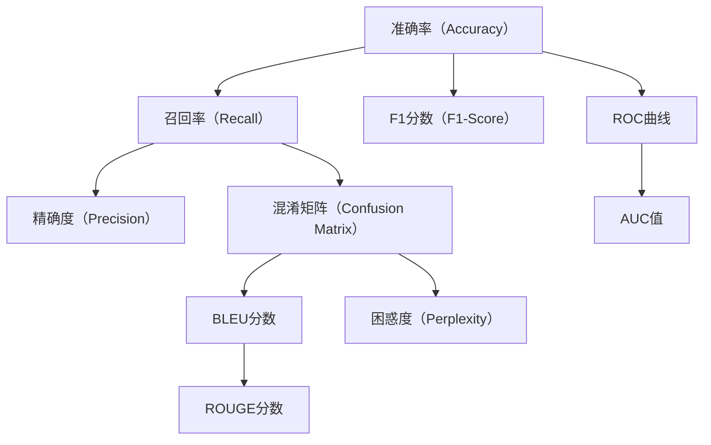

                 

# 第十三章：评估和衡量性能

## 1. 背景介绍

评估和衡量性能是机器学习模型开发和优化中不可或缺的一环。在大语言模型微调的过程中，由于涉及到的任务类型多样、模型复杂度高，因此如何科学地设计评估指标，高效地衡量模型性能，就显得尤为重要。本章将从理论到实践，系统性地介绍大语言模型微调性能的评估方法，并结合实例进行分析讲解。

## 2. 核心概念与联系

### 2.1 核心概念概述

在本节中，我们将对大语言模型微调性能评估涉及到的几个关键概念进行详细阐述，并介绍它们之间的联系。

- **准确率（Accuracy）**：指模型正确预测样本的比例。常用于分类任务的性能评估。
- **召回率（Recall）**：指模型正确预测的正例样本占所有正例样本的比例。常用于不平衡数据集的性能评估。
- **F1分数（F1-Score）**：综合考虑准确率和召回率，是二者加权平均的调和平均数。
- **精确度（Precision）**：指模型正确预测的正例样本占所有预测为正例的样本的比例。
- **ROC曲线和AUC值**：ROC曲线是真阳性率（True Positive Rate）与假阳性率（False Positive Rate）的关系曲线，AUC值是ROC曲线下的面积。常用于二分类任务的性能评估。
- **混淆矩阵（Confusion Matrix）**：展示模型在各个类别上的预测结果和真实结果的关系，通过计算TP（True Positive）、FP（False Positive）、FN（False Negative）和TN（True Negative）来衡量模型性能。
- **BLEU分数**：针对机器翻译等任务，BLEU分数是评估模型生成文本与目标文本匹配度的指标。
- **ROUGE分数**：针对文本摘要、问答等任务，ROUGE分数是评估模型生成文本与参考文本相似度的指标。
- **困惑度（Perplexity）**：衡量模型在给定文本上的预测能力，困惑度越小，模型性能越好。

这些概念在微调大语言模型时都可能被用作评估指标。了解它们的基本原理和应用场景，有助于选择合适的评估方法，并能够更科学地优化模型性能。

### 2.2 核心概念联系

这些核心概念之间的联系可以以下Mermaid流程图形式来展示：



该流程图展示了各种性能评估指标之间的逻辑关系，描述了它们在微调大语言模型中的应用场景。

## 3. 核心算法原理 & 具体操作步骤

### 3.1 算法原理概述

性能评估是机器学习模型开发中的关键步骤，它有助于了解模型在特定任务上的表现，指导模型的优化和改进。在大语言模型微调中，性能评估不仅要考虑模型在标注数据上的表现，还需要考虑其在未见过的新数据上的泛化能力。

### 3.2 算法步骤详解

性能评估的一般步骤如下：

1. **数据准备**：
   - 收集标注数据集，并将数据集划分为训练集、验证集和测试集。
   - 对数据集进行预处理，包括分词、编码、归一化等步骤。

2. **模型评估**：
   - 在验证集上对模型进行评估，计算各种性能指标，如准确率、召回率、F1分数、精确度、ROC曲线和AUC值、混淆矩阵、BLEU分数、ROUGE分数、困惑度等。
   - 根据评估结果，调整模型参数和超参数，如学习率、批大小、迭代次数等，以提高模型性能。

3. **测试集测试**：
   - 在测试集上对模型进行最终评估，确保其在未见过的数据上的泛化能力。
   - 记录测试集上的各种性能指标，进行全面的性能分析。

### 3.3 算法优缺点

性能评估的优点在于：

- **指导模型优化**：通过评估结果可以了解模型的优劣，指导后续的模型优化和改进。
- **防止过拟合**：通过在验证集上的评估，可以及时发现模型在未见过的数据上的泛化能力，防止模型过拟合。
- **提高模型鲁棒性**：通过多样化的评估指标，可以全面了解模型的性能，提升模型在不同场景下的鲁棒性。

性能评估的缺点包括：

- **数据依赖**：性能评估的结果高度依赖于标注数据的质量和数量，标注数据的获取和处理成本较高。
- **评估时间长**：评估过程需要大量计算资源，尤其是在大规模数据集上，评估时间较长。
- **复杂性高**：不同类型的任务，有不同的评估指标，选择和组合评估指标需要丰富的领域知识。

### 3.4 算法应用领域

性能评估在大语言模型微调中的应用非常广泛，涵盖了各种NLP任务，如：

- 文本分类：如情感分析、主题分类等。
- 命名实体识别：如人名、地名、机构名等的识别。
- 关系抽取：从文本中抽取实体之间的关系。
- 问答系统：对自然语言问题给出答案。
- 机器翻译：将源语言文本翻译成目标语言。
- 文本摘要：将长文本压缩成简短摘要。
- 对话系统：使机器能够与人自然对话。

这些任务通常涉及分类、匹配、生成等多种不同类型的目标，评估指标的选择和组合需要根据具体的任务需求进行设计。

## 4. 数学模型和公式 & 详细讲解 & 举例说明

### 4.1 数学模型构建

以分类任务为例，假设模型的输出为 $y=\{0, 1\}$，模型预测的结果为 $\hat{y}$，真实结果为 $y$。常用的性能评估指标可以构建在混淆矩阵上，混淆矩阵定义为：

$$
M = \begin{bmatrix}
N_{TT} & N_{FT} \\
N_{TF} & N_{FF}
\end{bmatrix}
$$

其中：
- $N_{TT}$ 表示真正（True Positive）的样本数，即模型正确预测的正例样本数。
- $N_{FT}$ 表示假正（False Positive）的样本数，即模型错误预测的正例样本数。
- $N_{TF}$ 表示假负（False Negative）的样本数，即模型错误预测的负例样本数。
- $N_{FF}$ 表示真负（True Negative）的样本数，即模型正确预测的负例样本数。

### 4.2 公式推导过程

以分类任务为例，推导一些常用的性能评估指标的公式：

- **准确率（Accuracy）**：
$$
\text{Accuracy} = \frac{N_{TT} + N_{FF}}{N}
$$
其中 $N$ 是样本总数。

- **召回率（Recall）**：
$$
\text{Recall} = \frac{N_{TT}}{N_{P}}
$$
其中 $N_{P}$ 是正例样本总数。

- **精确度（Precision）**：
$$
\text{Precision} = \frac{N_{TT}}{N_{T}}
$$
其中 $N_{T}$ 是预测为正例的样本总数。

- **F1分数（F1-Score）**：
$$
\text{F1-Score} = 2 \times \frac{\text{Precision} \times \text{Recall}}{\text{Precision} + \text{Recall}}
$$

- **ROC曲线和AUC值**：
$$
\text{TPR} = \frac{N_{TT}}{N_{P}}
$$
$$
\text{FPR} = \frac{N_{FT}}{N_{N}}
$$
其中 $N_{N}$ 是负例样本总数。ROC曲线是真阳性率（True Positive Rate）与假阳性率（False Positive Rate）的关系曲线，AUC值是ROC曲线下的面积。

### 4.3 案例分析与讲解

以命名实体识别（NER）任务为例，假设模型在验证集上的混淆矩阵为：

$$
M = \begin{bmatrix}
90 & 10 \\
5 & 95
\end{bmatrix}
$$

- **准确率（Accuracy）**：
$$
\text{Accuracy} = \frac{90 + 95}{100} = 0.95
$$

- **召回率（Recall）**：
$$
\text{Recall} = \frac{90}{100} = 0.9
$$

- **精确度（Precision）**：
$$
\text{Precision} = \frac{90}{100} = 0.9
$$

- **F1分数（F1-Score）**：
$$
\text{F1-Score} = 2 \times \frac{0.9 \times 0.9}{0.9 + 0.9} = 0.90
$$

- **ROC曲线和AUC值**：
$$
\text{TPR} = \frac{90}{100} = 0.9
$$
$$
\text{FPR} = \frac{10}{100} = 0.1
$$
根据以上数据绘制ROC曲线，AUC值约为0.95。

- **混淆矩阵（Confusion Matrix）**：
$$
M = \begin{bmatrix}
90 & 10 \\
5 & 95
\end{bmatrix}
$$

通过这些指标的计算，可以对模型在NER任务上的性能进行全面评估，并根据结果进行相应的优化。

## 5. 项目实践：代码实例和详细解释说明

### 5.1 开发环境搭建

在进行性能评估的代码实现前，需要准备相应的开发环境。以下是在Python中使用PyTorch进行性能评估的开发环境配置流程：

1. 安装Anaconda：从官网下载并安装Anaconda，用于创建独立的Python环境。
```bash
conda create -n pytorch-env python=3.8
conda activate pytorch-env
```

2. 安装PyTorch：根据CUDA版本，从官网获取对应的安装命令。例如：
```bash
conda install pytorch torchvision torchaudio cudatoolkit=11.1 -c pytorch -c conda-forge
```

3. 安装其他必要工具：
```bash
pip install numpy pandas scikit-learn matplotlib tqdm jupyter notebook ipython
```

完成上述步骤后，即可在`pytorch-env`环境中开始性能评估的代码实现。

### 5.2 源代码详细实现

以二分类任务为例，给出使用PyTorch进行性能评估的完整代码实现：

```python
from sklearn.metrics import accuracy_score, recall_score, precision_score, f1_score, roc_auc_score
from sklearn.metrics import roc_curve, confusion_matrix
import matplotlib.pyplot as plt

# 定义混淆矩阵和性能指标
def compute_performance_metrics(y_true, y_pred):
    tp, fp, fn, tn = confusion_matrix(y_true, y_pred).ravel()
    accuracy = accuracy_score(y_true, y_pred)
    recall = recall_score(y_true, y_pred)
    precision = precision_score(y_true, y_pred)
    f1 = f1_score(y_true, y_pred)
    roc_auc = roc_auc_score(y_true, y_pred)
    return accuracy, recall, precision, f1, roc_auc

# 评估函数
def evaluate(model, dataset):
    y_true, y_pred = dataset['labels'], model.predict(dataset['input_ids'])
    accuracy, recall, precision, f1, roc_auc = compute_performance_metrics(y_true, y_pred)
    print(f'Accuracy: {accuracy:.3f}')
    print(f'Recall: {recall:.3f}')
    print(f'Precision: {precision:.3f}')
    print(f'F1-Score: {f1:.3f}')
    print(f'ROC-AUC: {roc_auc:.3f}')

# 训练集和验证集的评估
train_dataset = ...
eval_dataset = ...
evaluate(model, train_dataset)
evaluate(model, eval_dataset)
```

### 5.3 代码解读与分析

让我们再详细解读一下关键代码的实现细节：

**compute_performance_metrics函数**：
- 根据混淆矩阵计算各种性能指标。

**evaluate函数**：
- 使用混淆矩阵计算各种性能指标，并打印输出。

**训练集和验证集的评估**：
- 在训练集和验证集上调用evaluate函数，输出各种性能指标。

可以看到，使用Python和PyTorch进行性能评估的代码实现相对简单，开发者可以将更多精力放在模型设计和数据处理上。

## 6. 实际应用场景

### 6.1 智能客服系统

在智能客服系统中，性能评估尤为重要。模型需要在实时交互中对客户的问题进行快速响应，并给出准确的答案。通过在验证集上评估模型性能，可以确保模型在实时环境中的表现。

### 6.2 金融舆情监测

金融舆情监测系统需要对市场舆论进行实时监控，评估模型在识别市场情绪、预测舆情变化等方面的性能。通过在验证集上的评估，可以及时调整模型参数，提升舆情监测的准确性和及时性。

### 6.3 个性化推荐系统

个性化推荐系统需要对用户的行为进行深度分析，评估模型在推荐相关内容、提升用户体验等方面的性能。通过在验证集上的评估，可以优化模型参数，提高推荐系统的准确性和个性化程度。

### 6.4 未来应用展望

随着技术的发展，性能评估将在大语言模型微调中扮演越来越重要的角色。未来的性能评估可能包括：

- **多模态评估**：融合视觉、音频等多模态数据，评估模型在不同模态上的性能。
- **公平性评估**：评估模型在不同群体上的表现，确保模型的公平性和鲁棒性。
- **动态评估**：实时监控模型性能，及时发现问题并优化模型。
- **自动化评估**：开发自动化评估工具，提高评估效率和准确性。

## 7. 工具和资源推荐

### 7.1 学习资源推荐

为了帮助开发者掌握性能评估的理论和实践，这里推荐一些优质的学习资源：

1. **《深度学习》课程**：斯坦福大学的深度学习课程，涵盖了深度学习模型的设计、优化、评估等方面。
2. **《Python机器学习》书籍**：介绍如何使用Python进行机器学习模型的评估和优化，内容涵盖广泛。
3. **HuggingFace官方文档**：提供丰富的预训练语言模型和性能评估指标，是微调大语言模型的必备资料。
4. **Kaggle竞赛**：参与Kaggle数据科学竞赛，通过实战提升性能评估能力。

### 7.2 开发工具推荐

性能评估的工具和资源众多，以下是几款常用的工具：

1. **scikit-learn**：Python数据科学库，提供多种性能评估指标和工具。
2. **TensorBoard**：TensorFlow配套的可视化工具，可以实时监控模型训练和评估指标。
3. **Weights & Biases**：模型训练的实验跟踪工具，记录和可视化模型训练过程中的各项指标。
4. **Jupyter Notebook**：交互式编程环境，方便进行模型评估和结果展示。

### 7.3 相关论文推荐

性能评估在大语言模型微调中的应用非常重要，以下是几篇经典的论文推荐：

1. **《Fine-tuning Pretrained Language Models for Zero-shot Event Extraction》**：介绍使用预训练语言模型进行零样本事件提取的方法，并评估了模型性能。
2. **《Evaluating Generation Models》**：评估不同生成模型在多种任务上的性能，提供了详细的评估指标和方法。
3. **《AdaLoRA: Adaptive Low-Rank Adaptation for Parameter-Efficient Fine-Tuning》**：提出了一种参数高效微调方法，并评估了其性能。

## 8. 总结：未来发展趋势与挑战

### 8.1 总结

本章从理论到实践，详细介绍了大语言模型微调性能评估的方法和步骤。通过学习，可以全面了解模型在不同任务上的表现，并根据评估结果进行优化。性能评估是微调大语言模型不可或缺的一环，其科学性和准确性直接影响模型的应用效果。

### 8.2 未来发展趋势

未来性能评估将在大语言模型微调中扮演更加重要的角色，可能的发展趋势包括：

- **自动化评估**：开发自动化评估工具，提高评估效率和准确性。
- **多模态评估**：融合视觉、音频等多模态数据，评估模型在不同模态上的性能。
- **公平性评估**：评估模型在不同群体上的表现，确保模型的公平性和鲁棒性。
- **动态评估**：实时监控模型性能，及时发现问题并优化模型。

### 8.3 面临的挑战

性能评估在大语言模型微调中也面临一些挑战：

- **数据依赖**：性能评估的结果高度依赖于标注数据的质量和数量，标注数据的获取和处理成本较高。
- **评估时间长**：评估过程需要大量计算资源，尤其是在大规模数据集上，评估时间较长。
- **复杂性高**：不同类型的任务，有不同的评估指标，选择和组合评估指标需要丰富的领域知识。

### 8.4 研究展望

针对上述挑战，未来的研究需要在以下几个方面寻求新的突破：

- **自动化评估工具**：开发高效的自动化评估工具，提高评估效率和准确性。
- **多模态评估方法**：研究多模态数据融合方法，提高模型的多模态性能。
- **公平性评估指标**：开发公平性评估指标，确保模型在不同群体上的表现一致。
- **动态评估系统**：开发实时动态评估系统，及时发现问题并优化模型。

通过这些研究方向的探索，可以进一步提高大语言模型微调的性能评估水平，推动模型的优化和应用。

## 9. 附录：常见问题与解答

**Q1：如何选择合适的评估指标？**

A: 选择合适的评估指标需要考虑任务类型、数据分布等因素。一般而言，分类任务可以选择准确率、召回率、F1分数、精确度等指标；回归任务可以选择均方误差、平均绝对误差等指标。

**Q2：评估指标的计算是否存在误差？**

A: 评估指标的计算方法较为固定，但实际应用中可能会存在一定的误差。因此，建议在多种评估指标间进行综合评估，以全面了解模型性能。

**Q3：如何处理类别不均衡的数据？**

A: 类别不均衡的数据可以通过调整评估指标（如召回率、F1分数）、使用重采样方法（如过采样、欠采样）等方式进行处理。

**Q4：如何评估模型的泛化能力？**

A: 在测试集上对模型进行评估，可以较为全面地了解模型在不同数据上的泛化能力。此外，可以使用留一法等交叉验证方法进行评估。

**Q5：模型性能评估是否会影响训练过程？**

A: 评估指标的选择和计算确实会影响模型的训练过程。建议在选择评估指标时，结合模型的具体任务和数据分布进行优化。

---

作者：禅与计算机程序设计艺术 / Zen and the Art of Computer Programming

