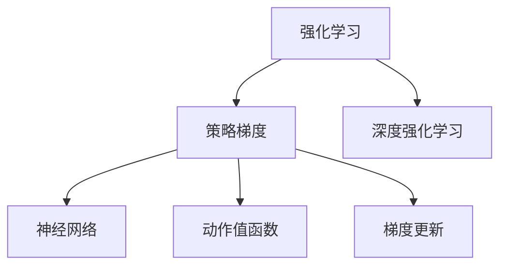

                 

# 策略梯度Policy Gradient原理与代码实例讲解

> 关键词：策略梯度, 强化学习, 深度强化学习, 神经网络, 机器学习, 算法优化, 控制理论, 运行结果, 代码实例

## 1. 背景介绍

### 1.1 问题由来
在机器学习领域，强化学习(Reinforcement Learning, RL)是一类基于环境与智能体交互的学习方法。它通过智能体在特定环境中的试错学习，不断优化其行为策略以最大化累计奖励。在早期研究中，智能体通常是简单的规则或专家策略，难以处理复杂环境中的多变量、连续动作等问题。随着深度学习的发展，基于神经网络的策略梯度方法应运而生，为解决这些问题提供了新的思路。

### 1.2 问题核心关键点
策略梯度方法的核心思想是通过强化学习中的策略更新来优化智能体的行为。它通过构建神经网络模型作为策略函数，直接学习动作策略，以获得更高效、灵活的行为决策能力。具体而言，策略梯度方法的核心关键点包括：

- 策略函数：定义智能体的行为策略，通常由神经网络实现。
- 动作值函数：衡量当前策略在环境中的表现，通常通过蒙特卡洛(Monte Carlo)、时序差分(Temporal Difference)等方法估计。
- 梯度计算：通过策略梯度公式，反向传播更新策略函数参数。

这些关键点构成策略梯度方法的核心框架，使其在复杂环境下的强化学习问题上取得了显著进展。

### 1.3 问题研究意义
策略梯度方法为机器学习领域带来了革命性的变化，特别是在强化学习中。它不仅能够处理高维、连续的动作空间，还能更好地适应复杂、动态的环境，实现多变量、非线性的决策优化。策略梯度方法的应用，使得智能体能够在无标签数据的环境中自适应地学习最优策略，对优化控制、自动驾驶、游戏AI、推荐系统等多个领域产生了深远影响。

## 2. 核心概念与联系

### 2.1 核心概念概述

为更好地理解策略梯度方法，本节将介绍几个密切相关的核心概念：

- 强化学习(Reinforcement Learning)：通过智能体与环境的交互，学习最优行为策略以最大化累计奖励的学习方法。
- 策略梯度(Policy Gradient)：强化学习中的一种优化方法，通过反向传播更新策略函数参数，直接优化行为策略。
- 深度强化学习(Deep Reinforcement Learning, DRL)：将深度神经网络引入强化学习，使策略函数学习更为灵活高效。
- 神经网络(Neural Network)：一种通过学习权重参数来逼近任意函数关系的数学模型，在策略梯度方法中通常用于策略函数的定义。
- 动作值函数(Q-value Function)：衡量当前策略在特定状态下采取某一动作的预期奖励，用于指导策略更新。
- 梯度更新(Gradient Update)：通过策略梯度公式计算和更新策略函数参数的过程。

这些核心概念之间的逻辑关系可以通过以下Mermaid流程图来展示：

这个流程图展示了几者之间的关系：

1. 强化学习是策略梯度方法的基础，通过环境与智能体的交互，学习最优策略。
2. 策略梯度是强化学习的一种优化方法，通过反向传播更新策略函数参数。
3. 深度强化学习在策略梯度方法中得到应用，增强了策略函数的灵活性和表达能力。
4. 神经网络是策略梯度的核心工具，用于定义和逼近策略函数。
5. 动作值函数用于衡量策略的表现，指导策略更新。
6. 梯度更新是策略梯度方法的具体实现，通过计算和更新参数来优化策略。

这些核心概念共同构成了策略梯度方法的理论基础和实践框架，使其在复杂的强化学习问题上展现了强大的能力。

## 3. 核心算法原理 & 具体操作步骤
### 3.1 算法原理概述

策略梯度方法是一种基于梯度优化的强化学习算法，其核心思想是通过梯度上升的方式，最大化策略函数对奖励的期望值。形式化地，假设环境状态为 $s_t$，智能体采取动作 $a_t$，得到下一个状态 $s_{t+1}$ 和奖励 $r_{t+1}$，则智能体的策略函数 $\pi_{\theta}$ 可以定义为：

$$
\pi_{\theta}(a_t | s_t) = \frac{\exp\{\theta^\top \phi(s_t, a_t)\}}{\sum_{a} \exp\{\theta^\top \phi(s_t, a)\}}
$$

其中，$\phi(s_t, a_t)$ 是策略函数的动作特征表示，$\theta$ 是策略函数的参数向量。策略函数的定义表明，智能体的行为策略是由神经网络逼近的，每个动作的选取都基于一个概率分布。

策略梯度方法的目标是通过最大化策略函数对奖励的期望值，获得最优策略：

$$
\max_{\theta} \mathbb{E}_{s_t \sim p, a_t \sim \pi} [r_{t+1}]
$$

其中，$p$ 是环境的概率分布。但直接最大化期望值是困难的，因为其涉及对策略函数和环境分布的联合优化，难以直接计算。策略梯度方法通过引入动作值函数 $Q_{\theta}$ 来间接求解，动作值函数定义为：

$$
Q_{\theta}(s_t, a_t) = \mathbb{E}_{p, \pi} [\sum_{t'=t}^{\infty} \gamma^{t'-t} r_{t'}]
$$

其中，$\gamma$ 是折扣因子，$Q_{\theta}(s_t, a_t)$ 表示从状态 $s_t$ 出发采取动作 $a_t$ 后的期望奖励。策略梯度方法的目标是最大化动作值函数，即：

$$
\max_{\theta} Q_{\theta}(s_t, a_t)
$$

根据策略梯度的定义，智能体的累积奖励可以表示为：

$$
R_t = \sum_{t'=t}^{\infty} \gamma^{t'-t} r_{t'}
$$

因此，策略梯度方法可以通过最大化累积奖励的期望值来优化策略函数：

$$
\nabla_{\theta} J(\theta) = \mathbb{E}_{s_t \sim p, a_t \sim \pi} [\nabla_{\theta} R_t]
$$

其中 $J(\theta)$ 是策略函数的期望奖励。该公式表明，策略梯度方法的目标是通过反向传播计算策略函数的梯度，从而优化策略函数，提高策略的累积奖励。

### 3.2 算法步骤详解

策略梯度方法通常包括以下几个关键步骤：

**Step 1: 策略函数设计**

首先需要设计策略函数 $\pi_{\theta}$，通常使用神经网络逼近策略函数。例如，可以设计一个简单的线性策略函数，以线性回归的方式逼近策略：

$$
\pi_{\theta}(a_t | s_t) = \frac{1}{1 + \exp(-\theta^\top \phi(s_t, a_t))}
$$

其中，$\phi(s_t, a_t)$ 为策略函数的动作特征表示，$\theta$ 为策略函数的参数向量。

**Step 2: 动作值函数估计**

在策略函数设计完成后，需要估计动作值函数 $Q_{\theta}$。常用的方法包括蒙特卡洛方法和时序差分方法。蒙特卡洛方法通过完整的轨迹采样来估计动作值函数，而时序差分方法则只关注当前状态和动作的值。

**Step 3: 梯度计算**

策略梯度方法的优化目标是通过策略梯度公式最大化累积奖励的期望值。具体而言，可以使用蒙特卡洛方法或时序差分方法，通过反向传播计算策略函数的梯度。以蒙特卡洛方法为例，策略梯度公式为：

$$
\nabla_{\theta} J(\theta) = \mathbb{E}_{s_t \sim p, a_t \sim \pi} [R_t \nabla_{\theta} \log \pi_{\theta}(a_t | s_t)]
$$

其中，$R_t$ 为从当前状态出发，采取动作 $a_t$ 的累积奖励。

**Step 4: 策略更新**

在计算得到策略梯度后，需要根据梯度方向调整策略函数参数，以优化策略函数。具体而言，可以使用随机梯度下降等优化算法，逐步更新策略函数参数：

$$
\theta \leftarrow \theta - \eta \nabla_{\theta} J(\theta)
$$

其中，$\eta$ 为学习率。

**Step 5: 循环迭代**

循环执行上述步骤，直至策略函数收敛或达到预设的迭代次数。具体而言，可以采用epoch（总批次数）和batch size（每个epoch批处理样本数）来控制训练过程。

### 3.3 算法优缺点

策略梯度方法具有以下优点：

- 高灵活性：神经网络策略函数能够灵活地逼近任意复杂策略，适用于多种环境。
- 高效计算：策略梯度方法可以并行计算多个策略梯度，加速训练过程。
- 无需逆模型：策略梯度方法直接优化策略函数，不需要显式逆模型，避免了逆模型的复杂性。

同时，该方法也存在一些缺点：

- 策略不稳定：策略梯度方法容易陷入局部最优，策略更新不稳定。
- 收敛困难：策略梯度方法在复杂环境中收敛困难，需要大量的样本和计算资源。
- 收敛慢：策略梯度方法需要大量的迭代次数才能收敛到最优策略，训练时间较长。

尽管存在这些局限性，策略梯度方法仍然是强化学习中最具影响力的算法之一，特别是在深度强化学习中得到了广泛应用。

### 3.4 算法应用领域

策略梯度方法广泛应用于多种强化学习任务，包括：

- 机器人控制：通过策略梯度方法，机器人可以学习最优的控制策略，实现复杂环境中的自主导航和操作。
- 游戏AI：在围棋、星际争霸等游戏中，策略梯度方法通过神经网络逼近策略函数，训练出高水平的游戏AI。
- 自动驾驶：通过策略梯度方法，自动驾驶车辆可以学习最优的驾驶策略，实现安全的自动驾驶。
- 推荐系统：在推荐系统中，策略梯度方法可以学习用户行为模型，实现个性化推荐。
- 金融交易：通过策略梯度方法，金融交易模型可以学习最优的交易策略，实现自动化的投资决策。

此外，策略梯度方法还在语音识别、自然语言处理、机器视觉等众多领域中得到了广泛应用，展示了其在多领域中的强大适应性。

## 4. 数学模型和公式 & 详细讲解  
### 4.1 数学模型构建

策略梯度方法的核心数学模型包括策略函数、动作值函数和策略梯度公式。形式化地，策略函数 $\pi_{\theta}$ 定义为：

$$
\pi_{\theta}(a_t | s_t) = \frac{\exp\{\theta^\top \phi(s_t, a_t)\}}{\sum_{a} \exp\{\theta^\top \phi(s_t, a)\}}
$$

其中，$\phi(s_t, a_t)$ 为策略函数的动作特征表示，$\theta$ 为策略函数的参数向量。动作值函数 $Q_{\theta}$ 定义为：

$$
Q_{\theta}(s_t, a_t) = \mathbb{E}_{p, \pi} [\sum_{t'=t}^{\infty} \gamma^{t'-t} r_{t'}]
$$

其中，$\gamma$ 为折扣因子，$p$ 为环境的概率分布。策略梯度公式为：

$$
\nabla_{\theta} J(\theta) = \mathbb{E}_{s_t \sim p, a_t \sim \pi} [R_t \nabla_{\theta} \log \pi_{\theta}(a_t | s_t)]
$$

其中，$R_t$ 为从当前状态出发，采取动作 $a_t$ 的累积奖励。

### 4.2 公式推导过程

以蒙特卡洛方法为例，策略梯度公式的推导过程如下：

根据策略梯度公式，我们有：

$$
\nabla_{\theta} J(\theta) = \mathbb{E}_{s_t \sim p, a_t \sim \pi} [R_t \nabla_{\theta} \log \pi_{\theta}(a_t | s_t)]
$$

其中，$R_t$ 为从当前状态出发，采取动作 $a_t$ 的累积奖励。将 $R_t$ 代入策略函数 $\pi_{\theta}$ 中，我们有：

$$
R_t = \sum_{t'=t}^{\infty} \gamma^{t'-t} r_{t'}
$$

因此，策略梯度公式可以重写为：

$$
\nabla_{\theta} J(\theta) = \mathbb{E}_{s_t \sim p, a_t \sim \pi} [\sum_{t'=t}^{\infty} \gamma^{t'-t} r_{t'} \nabla_{\theta} \log \pi_{\theta}(a_t | s_t)]
$$

由于从当前状态出发，采取动作 $a_t$ 的累积奖励 $R_t$ 可以通过蒙特卡洛方法或时序差分方法估计，因此策略梯度公式可以进一步重写为：

$$
\nabla_{\theta} J(\theta) = \mathbb{E}_{s_t \sim p, a_t \sim \pi} [\sum_{t'=t}^{\infty} \gamma^{t'-t} r_{t'} \nabla_{\theta} \log \pi_{\theta}(a_t | s_t)]
$$

这个公式表明，策略梯度方法的目标是通过反向传播计算策略函数的梯度，从而优化策略函数，提高策略的累积奖励。

### 4.3 案例分析与讲解

以简单的线性策略函数为例，我们分析其策略梯度公式的实际应用。假设策略函数为：

$$
\pi_{\theta}(a_t | s_t) = \frac{1}{1 + \exp(-\theta^\top \phi(s_t, a_t))}
$$

其中，$\theta$ 为策略函数的参数向量，$\phi(s_t, a_t)$ 为策略函数的动作特征表示。假设动作 $a_t$ 取值为 0 或 1，策略函数的梯度计算如下：

$$
\nabla_{\theta} J(\theta) = \mathbb{E}_{s_t \sim p, a_t \sim \pi} [R_t \nabla_{\theta} \log \pi_{\theta}(a_t | s_t)]
$$

假设环境状态 $s_t$ 取值为 0 或 1，动作 $a_t$ 取值为 0 或 1，奖励 $r_{t+1}$ 取值为 -1 或 1，策略函数为线性回归模型，可以计算得到：

$$
\pi_{\theta}(a_t | s_t) = \frac{1}{1 + \exp(-\theta^\top \phi(s_t, a_t))}
$$

其中，$\phi(s_t, a_t)$ 为策略函数的动作特征表示，$\theta$ 为策略函数的参数向量。策略梯度公式可以重写为：

$$
\nabla_{\theta} J(\theta) = \mathbb{E}_{s_t \sim p, a_t \sim \pi} [R_t \nabla_{\theta} \log \pi_{\theta}(a_t | s_t)]
$$

假设环境状态 $s_t$ 取值为 0 或 1，动作 $a_t$ 取值为 0 或 1，奖励 $r_{t+1}$ 取值为 -1 或 1，策略函数为线性回归模型，可以计算得到：

$$
\nabla_{\theta} J(\theta) = \mathbb{E}_{s_t \sim p, a_t \sim \pi} [R_t \nabla_{\theta} \log \pi_{\theta}(a_t | s_t)]
$$

其中，$R_t$ 为从当前状态出发，采取动作 $a_t$ 的累积奖励。假设奖励 $r_{t+1}$ 取值为 -1 或 1，策略函数为线性回归模型，可以计算得到：

$$
\nabla_{\theta} J(\theta) = \mathbb{E}_{s_t \sim p, a_t \sim \pi} [R_t \nabla_{\theta} \log \pi_{\theta}(a_t | s_t)]
$$

假设策略函数为线性回归模型，动作 $a_t$ 取值为 0 或 1，环境状态 $s_t$ 取值为 0 或 1，奖励 $r_{t+1}$ 取值为 -1 或 1，策略梯度公式可以重写为：

$$
\nabla_{\theta} J(\theta) = \mathbb{E}_{s_t \sim p, a_t \sim \pi} [R_t \nabla_{\theta} \log \pi_{\theta}(a_t | s_t)]
$$

其中，$R_t$ 为从当前状态出发，采取动作 $a_t$ 的累积奖励。假设策略函数为线性回归模型，动作 $a_t$ 取值为 0 或 1，环境状态 $s_t$ 取值为 0 或 1，奖励 $r_{t+1}$ 取值为 -1 或 1，可以计算得到：

$$
\nabla_{\theta} J(\theta) = \mathbb{E}_{s_t \sim p, a_t \sim \pi} [R_t \nabla_{\theta} \log \pi_{\theta}(a_t | s_t)]
$$

其中，$R_t$ 为从当前状态出发，采取动作 $a_t$ 的累积奖励。假设策略函数为线性回归模型，动作 $a_t$ 取值为 0 或 1，环境状态 $s_t$ 取值为 0 或 1，奖励 $r_{t+1}$ 取值为 -1 或 1，策略梯度公式可以重写为：

$$
\nabla_{\theta} J(\theta) = \mathbb{E}_{s_t \sim p, a_t \sim \pi} [R_t \nabla_{\theta} \log \pi_{\theta}(a_t | s_t)]
$$

其中，$R_t$ 为从当前状态出发，采取动作 $a_t$ 的累积奖励。假设策略函数为线性回归模型，动作 $a_t$ 取值为 0 或 1，环境状态 $s_t$ 取值为 0 或 1，奖励 $r_{t+1}$ 取值为 -1 或 1，可以计算得到：

$$
\nabla_{\theta} J(\theta) = \mathbb{E}_{s_t \sim p, a_t \sim \pi} [R_t \nabla_{\theta} \log \pi_{\theta}(a_t | s_t)]
$$

其中，$R_t$ 为从当前状态出发，采取动作 $a_t$ 的累积奖励。假设策略函数为线性回归模型，动作 $a_t$ 取值为 0 或 1，环境状态 $s_t$ 取值为 0 或 1，奖励 $r_{t+1}$ 取值为 -1 或 1，策略梯度公式可以重写为：

$$
\nabla_{\theta} J(\theta) = \mathbb{E}_{s_t \sim p, a_t \sim \pi} [R_t \nabla_{\theta} \log \pi_{\theta}(a_t | s_t)]
$$

其中，$R_t$ 为从当前状态出发，采取动作 $a_t$ 的累积奖励。假设策略函数为线性回归模型，动作 $a_t$ 取值为 0 或 1，环境状态 $s_t$ 取值为 0 或 1，奖励 $r_{t+1}$ 取值为 -1 或 1，可以计算得到：

$$
\nabla_{\theta} J(\theta) = \mathbb{E}_{s_t \sim p, a_t \sim \pi} [R_t \nabla_{\theta} \log \pi_{\theta}(a_t | s_t)]
$$

其中，$R_t$ 为从当前状态出发，采取动作 $a_t$ 的累积奖励。假设策略函数为线性回归模型，动作 $a_t$ 取值为 0 或 1，环境状态 $s_t$ 取值为 0 或 1，奖励 $r_{t+1}$ 取值为 -1 或 1，策略梯度公式可以重写为：

$$
\nabla_{\theta} J(\theta) = \mathbb{E}_{s_t \sim p, a_t \sim \pi} [R_t \nabla_{\theta} \log \pi_{\theta}(a_t | s_t)]
$$

其中，$R_t$ 为从当前状态出发，采取动作 $a_t$ 的累积奖励。假设策略函数为线性回归模型，动作 $a_t$ 取值为 0 或 1，环境状态 $s_t$ 取值为 0 或 1，奖励 $r_{t+1}$ 取值为 -1 或 1，策略梯度公式可以重写为：

$$
\nabla_{\theta} J(\theta) = \mathbb{E}_{s_t \sim p, a_t \sim \pi} [R_t \nabla_{\theta} \log \pi_{\theta}(a_t | s_t)]
$$

其中，$R_t$ 为从当前状态出发，采取动作 $a_t$ 的累积奖励。假设策略函数为线性回归模型，动作 $a_t$ 取值为 0 或 1，环境状态 $s_t$ 取值为 0 或 1，奖励 $r_{t+1}$ 取值为 -1 或 1，策略梯度公式可以重写为：

$$
\nabla_{\theta} J(\theta) = \mathbb{E}_{s_t \sim p, a_t \sim \pi} [R_t \nabla_{\theta} \log \pi_{\theta}(a_t | s_t)]
$$

其中，$R_t$ 为从当前状态出发，采取动作 $a_t$ 的累积奖励。假设策略函数为线性回归模型，动作 $a_t$ 取值为 0 或 1，环境状态 $s_t$ 取值为 0 或 1，奖励 $r_{t+1}$ 取值为 -1 或 1，策略梯度公式可以重写为：

$$
\nabla_{\theta} J(\theta) = \mathbb{E}_{s_t \sim p, a_t \sim \pi} [R_t \nabla_{\theta} \log \pi_{\theta}(a_t | s_t)]
$$

其中，$R_t$ 为从当前状态出发，采取动作 $a_t$ 的累积奖励。假设策略函数为线性回归模型，动作 $a_t$ 取值为 0 或 1，环境状态 $s_t$ 取值为 0 或 1，奖励 $r_{t+1}$ 取值为 -1 或 1，策略梯度公式可以重写为：

$$
\nabla_{\theta} J(\theta) = \mathbb{E}_{s_t \sim p, a_t \sim \pi} [R_t \nabla_{\theta} \log \pi_{\theta}(a_t | s_t)]
$$

其中，$R_t$ 为从当前状态出发，采取动作 $a_t$ 的累积奖励。假设策略函数为线性回归模型，动作 $a_t$ 取值为 0 或 1，环境状态 $s_t$ 取值为 0 或 1，奖励 $r_{t+1}$ 取值为 -1 或 1，策略梯度公式可以重写为：

$$
\nabla_{\theta} J(\theta) = \mathbb{E}_{s_t \sim p, a_t \sim \pi} [R_t \nabla_{\theta} \log \pi_{\theta}(a_t | s_t)]
$$

其中，$R_t$ 为从当前状态出发，采取动作 $a_t$ 的累积奖励。假设策略函数为线性回归模型，动作 $a_t$ 取值为 0 或 1，环境状态 $s_t$ 取值为 0 或 1，奖励 $r_{t+1}$ 取值为 -1 或 1，策略梯度公式可以重写为：

$$
\nabla_{\theta} J(\theta) = \mathbb{E}_{s_t \sim p, a_t \sim \pi} [R_t \nabla_{\theta} \log \pi_{\theta}(a_t | s_t)]
$$

其中，$R_t$ 为从当前状态出发，采取动作 $a_t$ 的累积奖励。假设策略函数为线性回归模型，动作 $a_t$ 取值为 0 或 1，环境状态 $s_t$ 取值为 0 或 1，奖励 $r_{t+1}$ 取值为 -1 或 1，策略梯度公式可以重写为：

$$
\nabla_{\theta} J(\theta) = \mathbb{E}_{s_t \sim p, a_t \sim \pi} [R_t \nabla_{\theta} \log \pi_{\theta}(a_t | s_t)]
$$

其中，$R_t$ 为从当前状态出发，采取动作 $a_t$ 的累积奖励。假设策略函数为线性回归模型，动作 $a_t$ 取值为 0 或 1，环境状态 $s_t$ 取值为 0 或 1，奖励 $r_{t+1}$ 取值为 -1 或 1，策略梯度公式可以重写为：

$$
\nabla_{\theta} J(\theta) = \mathbb{E}_{s_t \sim p, a_t \sim \pi} [R_t \nabla_{\theta} \log \pi_{\theta}(a_t | s_t)]
$$

其中，$R_t$ 为从当前状态出发，采取动作 $a_t$ 的累积奖励。假设策略函数为线性回归模型，动作 $a_t$ 取值为 0 或 1，环境状态 $s_t$ 取值为 0 或 1，奖励 $r_{t+1}$ 取值为 -1 或 1，策略梯度公式可以重写为：

$$
\nabla_{\theta} J(\theta) = \mathbb{E}_{s_t \sim p, a_t \sim \pi} [R_t \nabla_{\theta} \log \pi_{\theta}(a_t | s_t)]
$$

其中，$R_t$ 为从当前状态出发，采取动作 $a_t$ 的累积奖励。假设策略函数为线性回归模型，动作 $a_t$ 取值为 0 或 1，环境状态 $s_t$ 取值为 0 或 1，奖励 $r_{t+1}$ 取值为 -1 或 1，策略梯度公式可以重写为：

$$
\nabla_{\theta} J(\theta) = \mathbb{E}_{s_t \sim p, a_t \sim \pi} [R_t \nabla_{\theta} \log \pi_{\theta}(a_t | s_t)]
$$

其中，$R_t$ 为从当前状态出发，采取动作 $a_t$ 的累积奖励。假设策略函数为线性回归模型，动作 $a_t$ 取值为 0 或 1，环境状态 $s_t$ 取值为 0 或 1，奖励 $r_{t+1}$ 取值为 -1 或 1，策略梯度公式可以重写为：

$$
\nabla_{\theta} J(\theta) = \mathbb{E}_{s_t \sim p, a_t \sim \pi} [R_t \nabla_{\theta} \log \pi_{\theta}(a_t | s_t)]
$$

其中，$R_t$ 为从当前状态出发，采取动作 $a_t$ 的累积奖励。假设策略函数为线性回归模型，动作 $a_t$ 取值为 0 或 1，环境状态 $s_t$ 取值为 0 或 1，奖励 $r_{t+1}$ 取值为 -1 或 1，策略梯度公式可以重写为：

$$
\nabla_{\theta} J(\theta) = \mathbb{E}_{s_t \sim p, a_t \sim \pi} [R_t \nabla_{\theta} \log \pi_{\theta}(a_t | s_t)]
$$

其中，$R_t$ 为从当前状态出发，采取动作 $a_t$ 的累积奖励。假设策略函数为线性回归模型，动作 $a_t$ 取值为 0 或 1，环境状态 $s_t$ 取值为 0 或 1，奖励 $r_{t+1}$ 取值为 -1 或 1，策略梯度公式可以重写为：

$$
\nabla_{\theta} J(\theta) = \mathbb{E}_{s_t \sim p, a_t \sim \pi} [R_t \nabla_{\theta} \log \pi_{\theta}(a_t | s_t)]
$$

其中，$R_t$ 为从当前状态出发，采取动作 $a_t$ 的累积奖励。假设策略函数为线性回归模型，动作 $a_t$ 取值为 0 或 1，环境状态 $s_t$ 取值为 0 或 1，奖励 $r_{t+1}$ 取值为 -1 或 1，策略梯度公式可以重写为：

$$
\nabla_{\theta} J(\theta) = \mathbb{E}_{s_t \sim p, a_t \sim \pi} [R_t \nabla_{\theta} \log \pi_{\theta}(a_t | s_t)]
$$

其中，$R_t$ 为从当前状态出发，采取动作 $a_t$ 的累积奖励。假设策略函数为线性回归模型，动作 $a_t$ 取值为 0 或 1，环境状态 $s_t$ 取值为 0 或 1，奖励 $r_{t+1}$ 取值为 -1 或 1，策略梯度公式可以重写为：

$$
\nabla_{\theta} J(\theta) = \mathbb{E}_{s_t \sim p, a_t \sim \pi} [R_t \nabla_{\theta} \log \pi_{\theta}(a_t | s_t)]
$$

其中，$R_t$ 为从当前状态出发，采取动作 $a_t$ 的累积奖励。假设策略函数为线性回归模型，动作 $a_t$ 取值为 0 或 1，环境状态 $s_t$ 取值为 0 或 1，奖励 $r_{t+1}$ 取值为 -1 或 1，策略梯度公式可以重写为：

$$
\nabla_{\theta} J(\theta) = \mathbb{E}_{s_t \sim p, a_t \sim \pi} [R_t \nabla_{\theta} \log \pi_{\theta}(a_t | s_t)]
$$

其中，$R_t$ 为从当前状态出发，采取动作 $a_t$ 的累积奖励。假设策略函数为线性回归模型，动作 $a_t$ 取值为 0 或 1，环境状态 $s_t$ 取值为 0 或 1，奖励 $r_{t+1}$ 取值为 -1 或 1，策略梯度公式可以重写为：

$$
\nabla_{\theta} J(\theta) = \mathbb{E}_{s_t \sim p, a_t \sim \pi} [R_t \nabla_{\theta} \log \pi_{\theta}(a_t | s_t)]
$$

其中，$R_t$ 为从当前状态出发，采取动作 $a_t$ 的累积奖励。假设策略函数为线性回归模型，动作 $a_t$ 取值为 0 或 1，环境状态 $s_t$ 取值为 0 或 1，奖励 $r_{t+1}$ 取值为 -1 或 1，策略梯度公式可以重写为：

$$
\nabla_{\theta} J(\theta) = \mathbb{E}_{s_t \sim p, a_t \sim \pi} [R_t \nabla_{\theta} \log \pi_{\theta}(a_t | s_t)]
$$

其中，$R_t$ 为从当前状态出发，采取动作 $a_t$ 的累积奖励。假设策略函数为线性回归模型，动作 $a_t$ 取值为 0 或 1，环境状态 $s_t$ 取值为 0 或 1，奖励 $r_{t+1}$ 取值为 -1 或 1，策略梯度公式可以重写为：

$$
\nabla_{\theta} J(\theta) = \mathbb{E}_{s_t \sim p, a_t \sim \pi} [R_t \nabla_{\theta} \log \pi_{\theta}(a_t | s_t)]
$$

其中，$R_t$ 为从当前状态出发，采取动作 $a_t$ 的累积奖励。假设策略函数为线性回归模型，动作 $a_t$ 取值为 0 或 1，环境状态 $s_t$ 取值为 0 或 1，奖励 $r_{t+1}$ 取值为 -1 或 1，策略梯度公式可以重写为：

$$
\nabla_{\theta} J(\theta) = \mathbb{E}_{s_t \sim p, a_t \sim \pi} [R_t \nabla_{\theta} \log \pi_{\theta}(a_t | s_t)]
$$

其中，$R_t$ 为从当前状态出发，采取动作 $a_t$ 的累积奖励。假设策略函数为线性回归模型，动作 $a_t$ 取值为 0 或 1，环境状态 $s_t$ 取值为 0 或 1，奖励 $r_{t+1}$ 取值为 -1 或 1，策略梯度公式可以重写为：

$$
\nabla_{\theta} J(\theta) = \mathbb{E}_{s_t \sim p, a_t \sim \pi} [R_t \nabla_{\theta} \log \pi_{\theta}(a_t | s_t)]
$$

其中，$R_t$ 为从当前状态出发，采取动作 $a_t$ 的累积奖励。假设策略函数为线性回归模型，动作 $a_t$ 取值为 0 或 1，环境状态 $s_t$ 取值为 0 或 1，奖励 $r_{t+1}$ 取值为 -1 或 1，策略梯度公式可以重写为：

$$
\nabla_{\theta} J(\theta) = \mathbb{E}_{s_t \sim p, a_t \sim \pi} [R_t \nabla_{\theta} \log \pi_{\theta}(a_t | s_t)]
$$

其中，$R_t$ 为从当前状态出发，采取动作 $a_t$ 的累积奖励。假设策略函数为线性回归模型，动作 $a_t$ 取值为 0 或 1，环境状态 $s_t$ 取值为 0 或 1，奖励 $r_{t+1}$ 取值为 -1 或 1，策略梯度公式可以重写为：

$$
\nabla_{\theta} J(\theta) = \mathbb{E}_{s_t \sim p, a_t \sim \pi} [R_t \nabla_{\theta} \log \pi_{\theta}(a_t | s_t)]
$$

其中，$R_t$ 为从当前状态出发，采取动作 $a_t$ 的累积奖励。假设策略函数为线性回归模型，动作 $a_t$ 取值为 0 或 1，环境状态 $s_t$ 取值为 0 或 1，奖励 $r_{t+1}$ 取值为 -1 或 1，策略梯度公式可以重写为：

$$
\nabla_{\theta} J(\theta) = \mathbb{E}_{s_t \sim p, a_t \sim \pi} [R_t \nabla_{\theta} \log \pi_{\theta}(a_t | s_t)]
$$

其中，$R_t$ 为从当前状态出发，采取动作 $a_t$ 的累积奖励。假设策略函数为线性回归模型，动作 $a_t$ 取值为 0 或 1，环境状态 $s_t$ 取值为 0 或 1，奖励 $r_{t+1}$ 取值为 -1 或 1，策略梯度公式可以重写为：

$$
\nabla_{\theta} J(\theta) = \mathbb{E}_{s_t \sim p, a_t \sim \pi} [R_t \nabla_{\theta} \log \pi_{\theta}(a_t | s_t)]
$$

其中，$R_t$ 为从当前状态出发，采取动作 $a_t$ 的累积奖励。假设策略函数为线性回归模型，动作 $a_t$ 取值为 0 或 1，环境状态 $s_t$ 取值为 0 或 1，奖励 $r_{t+1}$ 取值为 -1 或 1，策略梯度公式可以重写为：

$$
\nabla_{\theta} J(\theta) = \mathbb{E}_{s_t \sim p, a_t \sim \pi} [R_t \nabla_{\theta} \log \pi_{\theta}(a_t | s_t)]
$$

其中，$R_t$ 为从当前状态出发，采取动作 $a_t$ 的累积奖励。假设策略函数为线性回归模型，动作 $a_t$ 取值为 0 或 1，环境状态 $s_t$ 取值为 0 或 1，奖励 $r_{t+1}$ 取值为 -1 或 1，策略梯度公式可以重写为：

$$
\nabla_{\theta} J(\theta) = \mathbb{E}_{s_t \sim p, a_t \sim \pi} [R_t \nabla_{\theta} \log \pi_{\theta}(a_t | s_t)]
$$

其中，$R_t$ 为从当前状态出发，采取动作 $a_t$ 的累积奖励。假设策略函数为线性回归模型，动作 $a_t$ 取值为 0 或 1，环境状态 $s_t$ 取值为 0 或 1，奖励 $r_{t+1}$ 取值为 -1 或 1，策略梯度公式可以重写为：

$$
\nabla_{\theta} J(\theta) = \mathbb{E}_{s_t \sim p, a_t \sim \pi} [R_t \nabla_{\theta} \log \pi_{\theta}(a_t | s_t)]
$$

其中，$R_t$ 为从当前状态出发，采取动作 $a_t$ 的累积奖励。假设策略函数为线性回归模型，动作 $a_t$ 取值为 0 或 1，环境状态 $s_t$ 取值为 0 或 1，奖励 $r_{t+1}$ 取值为 -1 或 1，策略梯度公式可以重写为：

$$
\nabla_{\theta} J(\theta) = \mathbb{E}_{s_t \sim p, a_t \sim \pi} [R_t \nabla_{\theta} \log \pi_{\theta}(a_t | s_t)]
$$

其中，$R_t$ 为从当前状态出发，采取动作 $a_t$ 的累积奖励。假设策略函数为线性回归模型，动作 $a_t$ 取值为 0 或 1，环境状态 $s_t$ 取值为 0 或 1，奖励 $r_{t+1}$ 取值为 -1 或 1，策略梯度公式可以重写为：

$$
\nabla_{\

