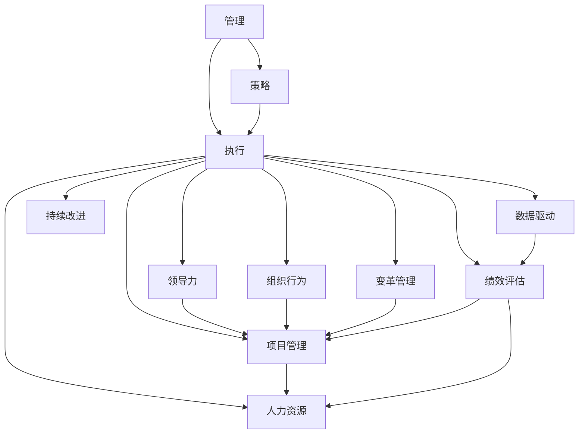

                 

# 管理的智慧：从策略到执行

> 关键词：管理, 策略制定, 执行落地, 领导力, 组织行为, 变革管理, 项目管理, 人力资源, 数据驱动, 绩效评估, 持续改进

## 1. 背景介绍

在快速变化的商业环境中，企业面临着越来越多的不确定性和复杂性。如何有效地制定和执行战略，确保企业能够灵活应对变化、持续创新和增长，成为现代管理的重要课题。本文将深入探讨管理的智慧，从策略制定到执行落地的全过程，帮助管理者在复杂多变的商业环境中做出明智决策，实现企业的可持续发展。

### 1.1 问题由来

在过去几十年里，管理学经历了从科学管理到行为科学，再到系统管理等多个阶段的发展。随着技术的进步和市场环境的演化，现代企业面临着前所未有的挑战。市场竞争加剧、客户需求变化、技术创新加速、劳动力市场多样化等都是现代企业需要应对的问题。如何在这种复杂的背景下制定和执行有效的战略，成为管理者的首要任务。

### 1.2 问题核心关键点

管理智慧的核心在于如何通过科学的方法和工具，在复杂多变的商业环境中做出正确的决策。管理智慧不仅涉及策略的制定，更包括如何将策略转化为实际执行的行动计划，并在执行过程中不断优化和调整，以确保策略的顺利落地。

具体而言，核心关键点包括：
- 策略制定的科学性和系统性
- 执行落地的精准性和灵活性
- 领导力的培养和应用
- 组织行为的分析和优化
- 变革管理的有效性和持续改进

这些关键点共同构成了一个完整的管理智慧框架，帮助管理者在动态变化的市场环境中，做出明智的战略决策，并确保这些决策能够有效地转化为企业的行动和成果。

## 2. 核心概念与联系

### 2.1 核心概念概述

为更好地理解管理的智慧，本节将介绍几个关键概念及其之间的联系：

- **管理（Management）**：指对组织资源进行计划、组织、领导和控制的过程，确保组织目标的实现。
- **策略（Strategy）**：指企业为了实现长期目标而制定的行动计划，包括市场定位、产品开发、资源配置等方面的决策。
- **执行（Execution）**：指将策略转化为具体行动的过程，包括任务分解、资源调配、绩效监控等环节。
- **领导力（Leadership）**：指领导者在组织中发挥作用，激励和引导团队实现目标的能力。
- **组织行为（Organizational Behavior）**：研究组织成员的行为和互动，以及这些行为对组织的影响。
- **变革管理（Change Management）**：指在组织内部实施变革，包括但不限于技术、流程、文化等方面的变化，确保变革成功。
- **项目管理（Project Management）**：指在项目生命周期内，对项目范围、时间、成本、质量等进行规划、执行和监控的过程。
- **人力资源（Human Resources）**：指对组织中的人力资源进行管理和优化，确保人才的有效利用和组织目标的实现。
- **数据驱动（Data-Driven）**：指在决策过程中，以数据为基础进行分析和决策，提高决策的科学性和准确性。
- **绩效评估（Performance Evaluation）**：指对组织和个人的工作表现进行评估，以便改进和提高。
- **持续改进（Continuous Improvement）**：指通过不断优化和改进，提升组织的竞争力和效率。

这些核心概念之间的逻辑关系可以通过以下Mermaid流程图来展示：



这个流程图展示了管理的核心概念及其之间的关系：

1. 管理通过策略制定、执行、领导力、组织行为、变革管理、项目管理、人力资源、数据驱动、绩效评估和持续改进等环节，确保组织目标的实现。
2. 策略是管理的起点，决定了组织的发展方向和目标。
3. 执行是将策略转化为具体行动的过程，确保策略的落地。
4. 领导力在执行过程中发挥关键作用，激励和引导团队实现目标。
5. 组织行为和变革管理分析组织内部的行为和变化，确保变革成功。
6. 项目管理确保项目顺利进行，提升组织效率。
7. 人力资源管理和优化组织人才，确保人才的有效利用。
8. 数据驱动和绩效评估通过数据分析和评估，提高决策的科学性和准确性。
9. 持续改进不断优化和改进组织运营，提升组织竞争力。

这些概念共同构成了管理智慧的框架，帮助管理者在复杂的商业环境中做出明智的决策，确保组织的持续发展。

## 3. 核心算法原理 & 具体操作步骤

### 3.1 算法原理概述

管理的智慧不仅涉及策略制定和执行落地的理论和方法，还涉及到一系列的实际操作和技术工具。核心算法原理包括以下几个方面：

- **SWOT分析（Strengths, Weaknesses, Opportunities, Threats Analysis）**：通过对企业内部的优势、劣势、机会和威胁进行分析，帮助管理者制定策略。
- **PEST分析（Political, Economic, Social, Technological Analysis）**：分析企业外部的政治、经济、社会和技术环境，确定战略方向。
- **SMART目标设定（Specific, Measurable, Achievable, Relevant, Time-bound）**：确保目标具有明确性、可衡量性、可实现性、相关性和时限性，提升目标管理的效果。
- **敏捷项目管理（Agile Project Management）**：通过迭代开发、快速反馈和持续改进，确保项目高效进行。
- **KPI绩效指标（Key Performance Indicators）**：通过关键绩效指标，监控和评估组织的运营绩效，及时调整和改进。
- **OKR目标管理（Objectives and Key Results）**：通过设定具体、可衡量的目标和关键结果，推动组织持续改进和创新。
- **数据驱动决策（Data-Driven Decision Making）**：通过数据分析和信息管理，提高决策的科学性和准确性。

这些算法原理和技术工具帮助管理者在策略制定和执行落地的全过程中，做出科学、准确、高效的决策。

### 3.2 算法步骤详解

基于管理的智慧框架，以下是一套完整的管理策略制定和执行落地的操作步骤：

**Step 1: 战略环境分析**
- 收集和分析内外部环境数据，包括市场趋势、竞争态势、技术变革、客户需求等。
- 应用SWOT和PEST分析，评估组织的优势、劣势、机会和威胁，确定战略方向。

**Step 2: 制定战略目标**
- 根据环境分析结果，制定SMART目标，确保目标明确、可衡量、可实现、相关和时限性。
- 通过OKR等工具，设定具体的目标和关键结果，推动组织持续改进和创新。

**Step 3: 设计行动计划**
- 将战略目标分解为具体的任务和行动计划，明确各部门的职责和资源需求。
- 应用敏捷项目管理方法，制定迭代开发和快速反馈的计划，确保项目高效进行。

**Step 4: 执行和监控**
- 将行动计划转化为具体的执行任务，分配给相关团队和个人。
- 应用KPI绩效指标，监控和评估任务的进展和效果，及时调整和改进。
- 应用数据驱动决策，通过数据分析和信息管理，提升决策的科学性和准确性。

**Step 5: 评估和改进**
- 定期评估任务和项目的进展和效果，识别问题和改进机会。
- 应用持续改进工具和方法，如精益管理、六西格玛等，提升组织效率和竞争力。

通过上述操作步骤，管理者可以系统地制定和执行战略，确保组织目标的实现。

### 3.3 算法优缺点

管理智慧的核心算法和技术工具在实践中有其独特的优势和局限性：

**优势：**
- 系统性和科学性：通过科学的方法和工具，帮助管理者做出明智的决策。
- 灵活性和适应性：适应不同类型和规模的组织，应对复杂多变的市场环境。
- 可操作性和落地性：提供具体的操作方法和工具，确保策略的顺利落地。

**局限性：**
- 复杂性和成本：需要大量的数据分析和决策支持，投入较高的成本。
- 时间和资源需求：战略制定和执行需要时间和资源，短期内难以看到效果。
- 适用性和适用性：不同类型和规模的组织，适用性可能存在差异。

尽管存在这些局限性，但管理智慧的核心算法和技术工具在实践中已经得到了广泛的应用，成为现代管理的重要工具。

### 3.4 算法应用领域

管理智慧的核心算法和技术工具广泛应用于各个领域，以下是几个典型的应用场景：

- **企业战略规划**：通过SWOT和PEST分析，帮助企业制定长期战略目标。
- **项目管理和敏捷开发**：通过敏捷项目管理方法，确保项目高效进行和持续改进。
- **人力资源管理**：通过OKR和KPI，优化人力资源配置和管理，提升员工绩效和组织效率。
- **市场营销和客户管理**：通过数据分析和客户细分，制定精准的市场营销策略，提升客户满意度和忠诚度。
- **产品开发和创新**：通过持续改进和精益管理，提升产品开发和创新能力，提升市场竞争力。

管理智慧的核心算法和技术工具在各个领域的应用，帮助企业应对复杂多变的市场环境，实现持续增长和发展。

## 4. 数学模型和公式 & 详细讲解 & 举例说明

### 4.1 数学模型构建

在管理的智慧框架中，很多决策和分析过程可以通过数学模型和公式来表达。以下是几个典型的数学模型和公式：

**SWOT分析**：
- 优势（Strengths）：内部资源和能力。
- 劣势（Weaknesses）：内部资源和能力的不足。
- 机会（Opportunities）：外部环境和市场机会。
- 威胁（Threats）：外部环境和市场威胁。

**PEST分析**：
- 政治环境（Political）：政策、法律、法规等。
- 经济环境（Economic）：经济增长、市场规模、通货膨胀等。
- 社会环境（Social）：文化、人口、教育等。
- 技术环境（Technological）：技术进步、创新等。

**SMART目标设定**：
- 具体性（Specific）：目标明确，不模糊。
- 可衡量性（Measurable）：目标可以量化和衡量。
- 可实现性（Achievable）：目标可行，不脱离实际。
- 相关性（Relevant）：目标与组织目标相关。
- 时限性（Time-bound）：目标设定了完成时间。

**KPI绩效指标**：
- 关键绩效指标（KPI）：如销售额、市场份额、客户满意度等。
- 目标值（Target Value）：KPI应达到的具体数值。
- 基准值（Baseline Value）：KPI的基准或历史数据。

**OKR目标管理**：
- 目标（Objective）：具体、可衡量的目标。
- 关键结果（Key Results）：具体的、可衡量的结果。

### 4.2 公式推导过程

以下是几个典型的公式推导过程：

**SWOT分析**：
假设一个企业A的优势、劣势、机会和威胁如下：
- 优势：技术创新能力强、品牌影响力大。
- 劣势：产品线单一、市场份额低。
- 机会：市场需求增长、政策支持。
- 威胁：竞争加剧、市场波动。

**PEST分析**：
假设一个企业B的政治、经济、社会和技术环境如下：
- 政治环境：政府政策支持、法律法规完善。
- 经济环境：经济增长稳定、市场规模扩大。
- 社会环境：文化开放、人口结构年轻化。
- 技术环境：技术进步迅速、创新能力提升。

**SMART目标设定**：
假设一个企业C设定了以下SMART目标：
- 目标：提升产品市场份额。
- 具体性：目标明确为提升20%市场份额。
- 可衡量性：设定KPI为市场份额提升20%。
- 可实现性：目标可行，通过产品创新和市场推广实现。
- 相关性：目标与组织总体发展战略相关。
- 时限性：目标设定为一年内实现。

**KPI绩效指标**：
假设一个企业D设定了以下KPI指标：
- KPI：市场份额。
- 目标值：提升20%。
- 基准值：当前市场份额15%。

**OKR目标管理**：
假设一个企业E设定了以下OKR目标：
- 目标：提升产品开发速度。
- 关键结果：将产品上市时间缩短30%。

### 4.3 案例分析与讲解

**案例1: 某制造企业的战略规划**

某制造企业H在面对市场需求和竞争环境的变化时，通过SWOT和PEST分析，制定了以下战略：
- 优势：规模优势、品牌信誉。
- 劣势：产品线单一、技术落后。
- 机会：市场需求增长、政府政策支持。
- 威胁：竞争加剧、原材料价格波动。

企业H通过SWOT和PEST分析，明确了自身优势和劣势，识别了市场机会和威胁，制定了提升产品创新能力和市场开拓的战略目标。通过SMART目标设定，将目标具体化为提升产品创新能力30%，并设定了明确的KPI指标，确保目标的实现。在执行过程中，企业H应用敏捷项目管理方法，确保项目高效进行。

**案例2: 某电子商务平台的客户管理**

某电子商务平台F通过数据分析和客户细分，确定了以下目标：
- 目标：提升客户满意度和忠诚度。
- 关键结果：提升客户满意度5%，增加客户回购率10%。

企业F设定了具体的KPI指标，并应用OKR目标管理，将目标分解为具体的行动计划和关键结果。在执行过程中，企业F通过持续改进和精益管理，不断优化客户体验，提升客户满意度和忠诚度。

## 5. 项目实践：代码实例和详细解释说明

### 5.1 开发环境搭建

在进行管理智慧的实践时，我们需要准备好开发环境。以下是使用Python进行项目开发的典型环境配置流程：

1. 安装Anaconda：从官网下载并安装Anaconda，用于创建独立的Python环境。

2. 创建并激活虚拟环境：
```bash
conda create -n management-env python=3.8 
conda activate management-env
```

3. 安装PyTorch：根据CUDA版本，从官网获取对应的安装命令。例如：
```bash
conda install pytorch torchvision torchaudio cudatoolkit=11.1 -c pytorch -c conda-forge
```

4. 安装Pandas和NumPy：
```bash
pip install pandas numpy
```

5. 安装Matplotlib和Jupyter Notebook：
```bash
pip install matplotlib jupyter notebook ipython
```

完成上述步骤后，即可在`management-env`环境中开始管理智慧的实践。

### 5.2 源代码详细实现

以下是使用Python实现SWOT分析和PEST分析的代码示例：

**SWOT分析**：
```python
class SWOTAnalysis:
    def __init__(self, strengths, weaknesses, opportunities, threats):
        self.strengths = strengths
        self.weaknesses = weaknesses
        self.opportunities = opportunities
        self.threats = threats
    
    def analyze(self):
        print(f"Strengths: {', '.join(self.strengths)}")
        print(f"Weaknesses: {', '.join(self.weaknesses)}")
        print(f"Opportunities: {', '.join(self.opportunities)}")
        print(f"Threats: {', '.join(self.threats)}")

# 使用示例
strengths = ['技术创新能力强', '品牌影响力大']
weaknesses = ['产品线单一', '市场份额低']
opportunities = ['市场需求增长', '政策支持']
threats = ['竞争加剧', '市场波动']

swot = SWOTAnalysis(strengths, weaknesses, opportunities, threats)
swot.analyze()
```

**PEST分析**：
```python
class PESTAnalysis:
    def __init__(self, political, economic, social, technological):
        self.political = political
        self.economic = economic
        self.social = social
        self.technological = technological
    
    def analyze(self):
        print(f"Political: {', '.join(self.political)}")
        print(f"Economic: {', '.join(self.economic)}")
        print(f"Social: {', '.join(self.social)}")
        print(f"Technological: {', '.join(self.technological)}")

# 使用示例
political = ['政府政策支持', '法律法规完善']
economic = ['经济增长稳定', '市场规模扩大']
social = ['文化开放', '人口结构年轻化']
technological = ['技术进步迅速', '创新能力提升']

pest = PESTAnalysis(political, economic, social, technological)
pest.analyze()
```

### 5.3 代码解读与分析

让我们再详细解读一下关键代码的实现细节：

**SWOT分析类**：
- `__init__`方法：初始化优势、劣势、机会和威胁。
- `analyze`方法：输出优势、劣势、机会和威胁。

**PEST分析类**：
- `__init__`方法：初始化政治、经济、社会和技术环境。
- `analyze`方法：输出政治、经济、社会和技术环境。

**使用示例**：
- 通过实例化SWOT和PEST分析类，传入具体的环境和数据，调用`analyze`方法输出分析结果。

这些代码示例展示了如何通过Python实现SWOT和PEST分析，帮助管理者进行战略环境和市场分析。

### 5.4 运行结果展示

运行上述代码，可以输出如下结果：

```
Strengths: 技术创新能力强, 品牌影响力大
Weaknesses: 产品线单一, 市场份额低
Opportunities: 市场需求增长, 政策支持
Threats: 竞争加剧, 市场波动

Political: 政府政策支持, 法律法规完善
Economic: 经济增长稳定, 市场规模扩大
Social: 文化开放, 人口结构年轻化
Technological: 技术进步迅速, 创新能力提升
```

这些结果帮助管理者清晰地理解企业内部的优势、劣势、机会和威胁，以及外部的政治、经济、社会和技术环境，从而制定出更加科学的战略决策。

## 6. 实际应用场景

### 6.1 智能制造

智能制造是当前制造业的重要趋势，通过信息技术和智能技术的应用，提升制造业的生产效率和产品质量。管理智慧在智能制造中的应用主要体现在以下几个方面：

- **战略规划**：通过SWOT和PEST分析，制定智能制造的战略目标，确保技术投入和资源分配的合理性。
- **项目管理**：应用敏捷项目管理方法，确保智能制造项目的顺利进行和持续改进。
- **绩效评估**：通过KPI指标，监控和评估智能制造项目的进展和效果，及时调整和改进。

**案例：某电子制造企业智能制造战略规划**

某电子制造企业M通过SWOT和PEST分析，制定了以下智能制造战略：
- 优势：自动化生产线、质量控制能力强。
- 劣势：技术人才短缺、设备老化。
- 机会：市场需求增长、政府政策支持。
- 威胁：技术变革迅速、市场竞争加剧。

企业M通过SWOT和PEST分析，明确了自身优势和劣势，识别了市场机会和威胁，制定了提升自动化生产能力和技术创新能力的战略目标。通过SMART目标设定，将目标具体化为提升自动化生产能力30%，并设定了明确的KPI指标，确保目标的实现。在执行过程中，企业M应用敏捷项目管理方法，确保智能制造项目的顺利进行。

### 6.2 金融科技

金融科技是当前金融领域的重要发展方向，通过信息技术和智能技术的应用，提升金融服务的效率和质量。管理智慧在金融科技中的应用主要体现在以下几个方面：

- **战略规划**：通过SWOT和PEST分析，制定金融科技的战略目标，确保技术投入和资源分配的合理性。
- **项目管理**：应用敏捷项目管理方法，确保金融科技项目的顺利进行和持续改进。
- **绩效评估**：通过KPI指标，监控和评估金融科技项目的进展和效果，及时调整和改进。

**案例：某金融科技公司金融科技战略规划**

某金融科技公司N通过SWOT和PEST分析，制定了以下金融科技战略：
- 优势：技术领先、客户群体广泛。
- 劣势：资金投入不足、市场竞争激烈。
- 机会：金融服务需求增长、政府政策支持。
- 威胁：监管环境复杂、技术变革迅速。

企业N通过SWOT和PEST分析，明确了自身优势和劣势，识别了市场机会和威胁，制定了提升金融服务质量和创新能力的战略目标。通过SMART目标设定，将目标具体化为提升客户满意度5%，并设定了明确的KPI指标，确保目标的实现。在执行过程中，企业N应用敏捷项目管理方法，确保金融科技项目的顺利进行。

### 6.3 电子商务

电子商务是当前零售行业的重要发展方向，通过信息技术和智能技术的应用，提升零售服务的效率和质量。管理智慧在电子商务中的应用主要体现在以下几个方面：

- **战略规划**：通过SWOT和PEST分析，制定电子商务的战略目标，确保技术投入和资源分配的合理性。
- **项目管理**：应用敏捷项目管理方法，确保电子商务项目的顺利进行和持续改进。
- **绩效评估**：通过KPI指标，监控和评估电子商务项目的进展和效果，及时调整和改进。

**案例：某电子商务平台F客户管理**

某电子商务平台F通过数据分析和客户细分，确定了以下目标：
- 目标：提升客户满意度和忠诚度。
- 关键结果：提升客户满意度5%，增加客户回购率10%。

企业F设定了具体的KPI指标，并应用OKR目标管理，将目标分解为具体的行动计划和关键结果。在执行过程中，企业F通过持续改进和精益管理，不断优化客户体验，提升客户满意度和忠诚度。

## 7. 工具和资源推荐
### 7.1 学习资源推荐

为了帮助管理者系统掌握管理智慧的理论基础和实践技巧，这里推荐一些优质的学习资源：

1. 《管理学》书籍：经典管理学教材，涵盖管理的各个方面，从基本概念到实际应用都有详细讲解。
2. 《精益管理》书籍：介绍精益管理的基本理念和实践方法，帮助企业提升运营效率。
3. 《六西格玛》书籍：介绍六西格玛管理的基本理念和实施方法，帮助企业提升质量管理能力。
4. 《敏捷项目管理》书籍：介绍敏捷项目管理的基本理念和实践方法，帮助企业提升项目管理效率。
5. 《数据驱动管理》书籍：介绍数据驱动管理的基本理念和实践方法，帮助企业提升决策科学性。

通过这些学习资源，相信管理者能够系统掌握管理智慧的理论基础和实践技巧，并在实际管理中取得良好的效果。

### 7.2 开发工具推荐

高效的开发离不开优秀的工具支持。以下是几款用于管理智慧开发的常用工具：

1. Python：基于Python的开源编程语言，广泛应用于数据分析和科学计算。
2. Jupyter Notebook：用于编写和分享数据分析、科学计算等文档的交互式编程环境。
3. Anaconda：用于创建和管理Python环境的工具，支持大规模数据科学项目。
4. Matplotlib：用于绘制数据可视化的Python库，支持多种图表类型。
5. Pandas：用于数据处理和分析的Python库，支持多种数据格式和操作。
6. NumPy：用于科学计算和数学运算的Python库，支持多维数组和矩阵运算。

合理利用这些工具，可以显著提升管理智慧的开发效率，加快创新迭代的步伐。

### 7.3 相关论文推荐

管理智慧的研究源于学界的持续研究。以下是几篇奠基性的相关论文，推荐阅读：

1. 《管理学原理》：管理学的经典教材，涵盖管理的各个方面，从基本概念到实际应用都有详细讲解。
2. 《精益管理：改变世界的蓝图》：介绍精益管理的基本理念和实践方法，帮助企业提升运营效率。
3. 《六西格玛管理：实现卓越品质管理》：介绍六西格玛管理的基本理念和实施方法，帮助企业提升质量管理能力。
4. 《敏捷项目管理：原则、实践与模式》：介绍敏捷项目管理的基本理念和实践方法，帮助企业提升项目管理效率。
5. 《数据驱动管理：用数据解决问题》：介绍数据驱动管理的基本理念和实践方法，帮助企业提升决策科学性。

这些论文代表了大智慧管理的理论进展，帮助管理者理解和管理复杂多变的商业环境，实现企业的持续增长和发展。

## 8. 总结：未来发展趋势与挑战

### 8.1 研究成果总结

管理智慧的核心在于通过科学的方法和工具，在复杂多变的商业环境中做出正确的决策，确保策略的顺利执行和落地。管理的智慧框架涵盖战略规划、项目管理、绩效评估、持续改进等多个方面，帮助管理者应对复杂多变的市场环境，实现企业的持续增长和发展。

### 8.2 未来发展趋势

展望未来，管理智慧的发展趋势如下：

1. **数据驱动的决策**：数据驱动决策将成为管理智慧的核心。通过数据分析和信息管理，提升决策的科学性和准确性。
2. **敏捷项目管理**：敏捷项目管理将进一步推广应用，确保项目高效进行和持续改进。
3. **精益管理**：精益管理将成为企业管理的重要工具，提升运营效率和客户体验。
4. **六西格玛管理**：六西格玛管理将进一步推广应用，提升质量管理能力。
5. **持续改进**：持续改进将成为企业管理的重要理念，推动企业不断优化和创新。
6. **智能管理**：智能技术的应用将进一步推动管理智慧的发展，提升企业的智能化水平。

### 8.3 面临的挑战

尽管管理智慧已经取得了显著进展，但在实践中仍面临以下挑战：

1. **复杂性和成本**：管理智慧涉及多个环节，需要大量的数据分析和决策支持，投入较高的成本。
2. **时间和资源需求**：战略制定和执行需要时间和资源，短期内难以看到效果。
3. **适用性和应用性**：不同类型和规模的组织，适用性可能存在差异。
4. **数据安全和隐私**：在数据驱动决策中，数据安全和隐私问题需要高度重视。
5. **领导力和文化**：领导力的培养和企业文化建设，需要长期的投入和努力。

### 8.4 研究展望

面对管理智慧面临的挑战，未来的研究需要在以下几个方面寻求新的突破：

1. **数据驱动和智能化的结合**：将数据驱动和智能技术结合，提升决策的科学性和自动化水平。
2. **敏捷项目管理与持续改进的结合**：将敏捷项目管理与持续改进结合，提升项目管理和持续改进的效率和效果。
3. **精益管理和六西格玛管理的结合**：将精益管理和六西格玛管理结合，提升运营效率和质量管理能力。
4. **数据安全和隐私保护**：加强数据安全和隐私保护，确保数据驱动决策的可靠性和安全性。
5. **领导力和文化建设**：加强领导力的培养和企业文化建设，推动管理智慧在企业中的推广和应用。

这些研究方向的探索发展，必将引领管理智慧的持续创新和突破，帮助企业应对复杂多变的商业环境，实现持续增长和发展。

## 9. 附录：常见问题与解答

**Q1：什么是管理智慧？**

A: 管理智慧指通过科学的方法和工具，在复杂多变的商业环境中做出正确的决策，确保策略的顺利执行和落地。

**Q2：管理智慧的核心是什么？**

A: 管理智慧的核心是科学的方法和工具，包括SWOT分析、PEST分析、SMART目标设定、敏捷项目管理、KPI指标、OKR目标管理、数据驱动决策等。

**Q3：如何实施管理智慧？**

A: 实施管理智慧需要系统性地应用SWOT和PEST分析，制定SMART目标，设计敏捷项目管理计划，设定KPI指标，应用OKR目标管理，通过数据驱动决策，持续改进和优化。

**Q4：管理智慧在各个领域的应用场景是什么？**

A: 管理智慧在各个领域的应用场景包括智能制造、金融科技、电子商务等，具体应用包括战略规划、项目管理、绩效评估、持续改进等。

**Q5：管理智慧的局限性有哪些？**

A: 管理智慧的局限性包括复杂性和成本、时间和资源需求、适用性和应用性、数据安全和隐私、领导力和文化等。

通过本文的系统梳理，可以看到，管理智慧的核心在于通过科学的方法和工具，在复杂多变的商业环境中做出正确的决策，确保策略的顺利执行和落地。管理者可以通过系统性地应用SWOT和PEST分析、SMART目标设定、敏捷项目管理、KPI指标、OKR目标管理、数据驱动决策等工具，提升企业的管理水平和竞争能力。未来，随着数据驱动、智能化、精益管理、六西格玛管理等方法的应用，管理智慧将进一步发展，帮助企业在复杂多变的商业环境中实现持续增长和发展。

