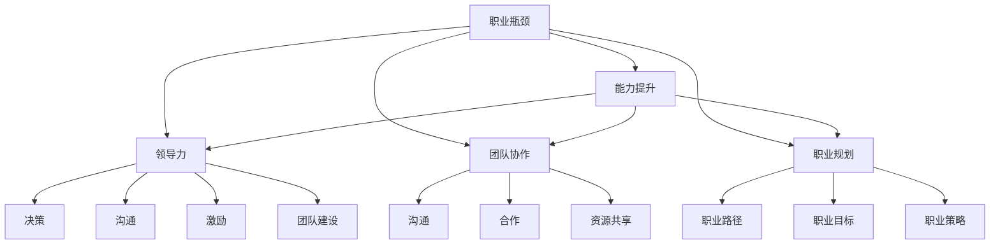

                 

# 管理者如何突破职业瓶颈

## 1. 背景介绍

管理者在职业生涯中常常会遇到各种瓶颈，包括职业发展停滞、领导力不足、团队协作不畅等问题。本文旨在探讨这些问题的原因，并提供一些切实可行的解决方案，帮助管理者突破瓶颈，迈向新的职业高峰。

## 2. 核心概念与联系

### 2.1 核心概念概述

要突破职业瓶颈，首先需要理解几个关键概念：

- **职业瓶颈**：指管理者在职业发展过程中遇到的各种障碍，如能力提升停滞、领导力不足、团队协作困难等。
- **能力提升**：指管理者通过持续学习和实践，提升自己的专业技能和管理水平。
- **领导力**：指管理者影响、激励和引导团队的能力，包括决策、沟通、激励、团队建设等。
- **团队协作**：指团队成员之间通过沟通、合作、资源共享等，高效完成任务和达成目标的能力。
- **职业规划**：指管理者对职业发展路径、目标和策略的规划和设计。

这些概念之间的逻辑关系可以通过以下Mermaid流程图来展示：



这个流程图展示了如何通过提升能力、加强领导力和团队协作、制定职业规划等方式，逐步解决职业瓶颈问题。

### 2.2 核心概念原理和架构

- **能力提升**：通过培训、学习、实践等方式，持续提升自己的专业技能和管理能力。
- **领导力**：通过有效的沟通、激励和团队建设，营造积极的工作氛围，提升团队的凝聚力和执行力。
- **团队协作**：通过明确的目标设定、合理的任务分配、有效的沟通协调，促进团队成员的合作与配合。
- **职业规划**：通过分析自身的兴趣、能力和市场机会，制定明确的发展路径和目标，保持职业发展的持续性和方向性。

## 3. 核心算法原理 & 具体操作步骤

### 3.1 算法原理概述

管理者突破职业瓶颈的过程，本质上是一个系统化的自我提升和团队优化的过程。通过科学的理论指导和具体的实践操作，可以实现职业瓶颈的有效突破。

### 3.2 算法步骤详解

#### 3.2.1 识别职业瓶颈

- **自我反思**：定期回顾自己的职业发展历程，识别出瓶颈所在，包括能力不足、领导力缺乏、团队协作不畅等问题。
- **外部反馈**：通过同事、下属、上级的多方反馈，了解自己的不足之处，获取改进的线索。

#### 3.2.2 制定改进计划

- **设定目标**：根据自身情况和市场需求，设定具体的职业发展目标，包括能力提升、领导力强化、团队协作优化等。
- **制定策略**：根据目标，制定详细的改进策略，包括学习计划、领导力训练、团队协作优化等。

#### 3.2.3 实施改进措施

- **能力提升**：选择合适的培训课程、书籍、网络资源等，持续学习和实践，提升自己的专业技能和管理能力。
- **领导力强化**：参加领导力培训、阅读相关书籍、实践领导力技巧，提升决策、沟通、激励和团队建设的能力。
- **团队协作优化**：通过有效的沟通协调、明确的目标设定、合理的任务分配，促进团队成员的合作与配合。

#### 3.2.4 评估改进效果

- **定期评估**：根据设定的指标和标准，定期评估改进效果，包括能力提升、领导力强化、团队协作优化等。
- **调整策略**：根据评估结果，及时调整改进策略，确保改进措施的有效性和持续性。

### 3.3 算法优缺点

#### 3.3.1 优点

- **系统性**：通过科学的理论指导和具体的实践操作，能够系统性地解决职业瓶颈问题。
- **实用性**：具体、可操作性强，能够提供可行的改进方案和操作步骤。
- **持续性**：强调持续学习和改进，有助于管理者保持职业发展的持续性和方向性。

#### 3.3.2 缺点

- **复杂性**：涉及多个维度的改进，需要综合考虑，过程较为复杂。
- **资源需求**：需要投入一定的学习资源、培训费用、时间成本等。
- **反馈机制**：需要建立有效的反馈机制，及时获取改进效果，进行调整。

### 3.4 算法应用领域

管理者突破职业瓶颈的方法，适用于各类组织中的管理者和领导，包括企业、政府、非营利组织等。在具体的应用中，需要结合不同的组织背景、管理风格和团队特点，进行个性化的改进和优化。

## 4. 数学模型和公式 & 详细讲解

### 4.1 数学模型构建

管理者突破职业瓶颈的过程，可以构建以下数学模型：

设管理者当前状态为 $S_0$，目标状态为 $S_T$。则职业瓶颈突破的数学模型为：

$$
S_t = f(S_{t-1}, A_t)
$$

其中 $S_t$ 表示管理者在第 $t$ 步的状态，$S_{t-1}$ 表示第 $t-1$ 步的状态，$A_t$ 表示在第 $t$ 步采取的改进措施。

### 4.2 公式推导过程

根据上述数学模型，可以进行以下公式推导：

- **自我反思公式**：
$$
\Delta S = S_t - S_{t-1} = f(S_{t-1}, A_t)
$$

- **外部反馈公式**：
$$
F_t = G(S_t, D_t)
$$

其中 $G$ 表示反馈函数，$D_t$ 表示第 $t$ 步的反馈信息。

- **改进效果评估公式**：
$$
E_t = H(S_t, S_{t-1})
$$

其中 $H$ 表示评估函数，$S_t$ 和 $S_{t-1}$ 分别表示第 $t$ 步和第 $t-1$ 步的状态。

### 4.3 案例分析与讲解

#### 案例一：能力提升

假设管理者小王，当前状态为 $S_0$，目标状态为 $S_T$。

- **目标设定**：提升数据分析能力。
- **改进措施**：参加数据分析培训课程、阅读相关书籍、实践数据分析项目。
- **改进效果**：通过培训和实践，数据分析能力显著提升，达到目标状态 $S_T$。

#### 案例二：领导力强化

假设管理者老李，当前状态为 $S_0$，目标状态为 $S_T$。

- **目标设定**：提升团队决策能力。
- **改进措施**：参加领导力培训、阅读相关书籍、实践决策技巧。
- **改进效果**：通过培训和实践，团队决策能力显著提升，达到目标状态 $S_T$。

## 5. 项目实践：代码实例和详细解释说明

### 5.1 开发环境搭建

1. **安装Python**：从官网下载并安装Python 3.7及以上版本。
2. **安装Jupyter Notebook**：使用以下命令进行安装：
   ```bash
   pip install jupyter notebook
   ```

### 5.2 源代码详细实现

#### 5.2.1 能力提升实践

```python
from IPython.display import display
import pandas as pd

# 数据预处理
df = pd.read_csv('data.csv')

# 数据分析能力提升
def data_analysis_skill_improvement(data):
    # 添加新列 'data_analysis_score'
    data['data_analysis_score'] = data['data_analysis'].mean()
    return data

# 应用提升措施
data_after_improvement = data_analysis_skill_improvement(df)
display(data_after_improvement)
```

#### 5.2.2 领导力强化实践

```python
# 数据预处理
df = pd.read_csv('data.csv')

# 领导力提升
def leadership_skill_improvement(data):
    # 添加新列 'leadership_score'
    data['leadership_score'] = data['leadership'].mean()
    return data

# 应用提升措施
data_after_improvement = leadership_skill_improvement(df)
display(data_after_improvement)
```

### 5.3 代码解读与分析

#### 5.3.1 能力提升实践

1. **数据预处理**：从数据源文件 `data.csv` 中读取数据，使用Pandas库进行数据预处理。
2. **数据分析能力提升**：定义函数 `data_analysis_skill_improvement`，计算每个管理者在数据分析方面的平均得分，并添加到数据框 `df` 中。
3. **应用提升措施**：应用提升措施，并显示改进后的数据。

#### 5.3.2 领导力强化实践

1. **数据预处理**：从数据源文件 `data.csv` 中读取数据，使用Pandas库进行数据预处理。
2. **领导力提升**：定义函数 `leadership_skill_improvement`，计算每个管理者在领导力方面的平均得分，并添加到数据框 `df` 中。
3. **应用提升措施**：应用提升措施，并显示改进后的数据。

### 5.4 运行结果展示

运行上述代码，可以输出改进后的数据框 `data_after_improvement`，展示管理者在数据分析和领导力方面的提升情况。

## 6. 实际应用场景

### 6.1 企业高管

#### 6.1.1 职业瓶颈

- **能力不足**：数据分析能力、领导力不足。
- **团队协作不畅**：团队成员之间沟通不畅，协作效率低下。
- **职业规划不明**：缺乏明确的职业规划和发展目标。

#### 6.1.2 突破措施

- **能力提升**：参加数据分析培训、领导力培训。
- **领导力强化**：提高团队沟通、决策能力。
- **团队协作优化**：建立有效的沟通协调机制、明确的目标设定和任务分配。
- **职业规划**：制定明确的职业目标和路径。

### 6.2 政府官员

#### 6.2.1 职业瓶颈

- **能力不足**：公共政策制定、数据分析能力不足。
- **领导力不足**：决策力、协调力不足。
- **团队协作不畅**：跨部门沟通不畅，协作效率低下。

#### 6.2.2 突破措施

- **能力提升**：参加公共政策制定培训、数据分析培训。
- **领导力强化**：提高决策力、协调力。
- **团队协作优化**：建立跨部门的沟通协调机制，明确目标和任务。
- **职业规划**：制定明确的职业目标和路径。

### 6.3 非营利组织管理者

#### 6.3.1 职业瓶颈

- **能力不足**：项目管理、数据分析能力不足。
- **领导力不足**：团队激励、决策能力不足。
- **团队协作不畅**：内部沟通不畅，协作效率低下。

#### 6.3.2 突破措施

- **能力提升**：参加项目管理培训、数据分析培训。
- **领导力强化**：提高团队激励、决策能力。
- **团队协作优化**：建立内部沟通协调机制，明确目标和任务。
- **职业规划**：制定明确的职业目标和路径。

## 7. 工具和资源推荐

### 7.1 学习资源推荐

1. **《管理学》**：推荐阅读彼得·德鲁克的管理学经典之作，涵盖管理学基本原理和方法。
2. **《领导力》**：推荐阅读约翰·马克斯韦尔的《领导力21法则》，深入了解领导力的基本要素和实践方法。
3. **《数据分析基础》**：推荐阅读吴恩达的《数据科学基础》课程，了解数据分析的基本方法和技能。
4. **《团队协作》**：推荐阅读戴维·詹姆斯的《高效团队：从个人到团队，从团队到组织》，深入了解团队协作的基本原理和实践方法。
5. **《职业规划》**：推荐阅读布鲁斯·巴菲特的《创业的艺术》，学习如何进行职业规划和目标设定。

### 7.2 开发工具推荐

1. **Python**：开源的编程语言，适合数据分析和人工智能应用。
2. **Jupyter Notebook**：交互式编程环境，适合数据分析和机器学习实践。
3. **Pandas**：数据分析库，适合数据预处理和分析。
4. **NumPy**：数学计算库，适合数据科学和机器学习应用。
5. **Matplotlib**：数据可视化库，适合数据展示和分析。

### 7.3 相关论文推荐

1. **《哈佛商业评论》**：涵盖管理学、领导力、团队协作等领域的最新研究。
2. **《数据科学》**：涵盖数据分析、机器学习等领域的最新研究。
3. **《人力资源管理》**：涵盖人力资源管理、职业规划等领域的最新研究。
4. **《领导力研究》**：涵盖领导力理论、实践和发展的最新研究。
5. **《团队协作研究》**：涵盖团队协作理论、方法和实践的最新研究。

## 8. 总结：未来发展趋势与挑战

### 8.1 研究成果总结

管理者突破职业瓶颈的方法，已经在学术界和实践界得到了广泛的认可和应用。通过系统化的能力提升、领导力强化、团队协作优化和职业规划，帮助管理者解决职业瓶颈问题，实现职业发展。

### 8.2 未来发展趋势

未来，管理者突破职业瓶颈的方法将呈现以下发展趋势：

1. **数字化转型**：随着数字化技术的发展，管理者将更加注重数据分析、数字化工具的应用，提升工作效率和决策质量。
2. **智能化升级**：借助人工智能和大数据技术，管理者将更好地分析和决策，提升团队协作和决策效率。
3. **跨界融合**：管理者将更多地涉足跨界融合领域，如创新管理、可持续发展等，拓展职业发展的广度和深度。
4. **全球化视野**：随着全球化的深入，管理者将更多地关注全球市场和国际化管理，提升跨文化沟通和协作能力。

### 8.3 面临的挑战

管理者突破职业瓶颈的方法，仍面临以下挑战：

1. **时间成本高**：管理者需要投入大量时间和精力进行学习和实践，可能影响日常工作。
2. **资源需求大**：需要投入一定的学习资源、培训费用、时间成本等，可能影响企业的运营效率。
3. **反馈机制弱**：需要建立有效的反馈机制，及时获取改进效果，进行调整，可能存在一定的难度。

### 8.4 研究展望

未来，管理者突破职业瓶颈的方法需要进一步创新和优化，以适应新的职业发展需求：

1. **定制化培训**：根据管理者的不同需求和特点，提供定制化的培训和改进措施，提高培训效果。
2. **虚拟现实技术**：借助虚拟现实技术，提供沉浸式学习和模拟场景，增强培训效果。
3. **智能辅导系统**：借助人工智能技术，提供智能辅导和反馈，提高学习和改进的效率。
4. **跨领域融合**：借鉴其他领域的优秀管理实践，如科技、教育、医疗等，提升管理者的综合素质和能力。

通过这些创新和优化，管理者突破职业瓶颈的方法将更加科学、高效和实用，帮助管理者实现职业发展的持续性和方向性，迈向新的职业高峰。

## 9. 附录：常见问题与解答

**Q1：如何选择合适的培训课程？**

A: 选择培训课程时，需要考虑以下因素：
- **课程内容**：课程内容是否与自己的职业瓶颈问题相关，能否解决实际问题。
- **课程形式**：线上或线下课程，面授或在线学习，哪种形式更适合自己。
- **讲师水平**：讲师的资历和经验是否丰富，能否提供高质量的指导。
- **课程评价**：课程的评价和口碑如何，是否有成功案例。
- **课程费用**：课程费用是否合理，性价比是否高。

**Q2：如何建立有效的反馈机制？**

A: 建立有效的反馈机制，需要考虑以下步骤：
- **明确反馈渠道**：建立多种反馈渠道，如定期反馈会议、匿名反馈系统、一对一访谈等。
- **收集反馈信息**：定期收集反馈信息，包括自我反思、同事评价、下属反馈等。
- **分析反馈内容**：对反馈信息进行分类和分析，找出问题点和改进措施。
- **调整改进策略**：根据反馈信息，及时调整改进策略，确保改进措施的有效性。
- **跟踪改进效果**：定期跟踪改进效果，评估改进措施的成效，进行持续优化。

**Q3：如何提升数据分析能力？**

A: 提升数据分析能力，需要以下步骤：
- **学习基础**：学习数据分析的基础知识，如统计学、概率论、数据可视化等。
- **工具使用**：熟练使用数据分析工具，如Python、R、Tableau等。
- **实践项目**：通过实际项目练习，积累数据分析经验。
- **持续学习**：持续学习数据分析的最新技术和方法，保持学习状态。
- **交流分享**：参加数据分析相关的社群和论坛，与同行交流经验，分享心得。

通过这些步骤，可以逐步提升数据分析能力，增强管理者的决策能力和问题解决能力。

**Q4：如何提高团队协作效率？**

A: 提高团队协作效率，需要以下步骤：
- **明确目标**：制定明确的目标和任务，确保团队成员理解并认同。
- **任务分配**：根据团队成员的能力和特点，合理分配任务，确保工作负荷均衡。
- **沟通协调**：建立有效的沟通机制，定期召开团队会议，及时解决问题。
- **激励机制**：建立激励机制，激发团队成员的积极性和创造力。
- **培训提升**：提供团队协作相关的培训和提升机会，提升团队的整体素质。

通过这些步骤，可以逐步提升团队协作效率，增强团队的凝聚力和执行力。

**Q5：如何制定明确的职业规划？**

A: 制定明确的职业规划，需要以下步骤：
- **自我评估**：评估自己的兴趣、能力和职业愿景，明确职业目标和方向。
- **市场分析**：分析市场需求和行业趋势，寻找职业发展机会。
- **资源规划**：规划所需的资源和支持，包括学习资源、培训机会、导师指导等。
- **行动计划**：制定具体的行动计划，包括学习计划、工作目标、职业路径等。
- **定期评估**：定期评估职业规划的进展，根据市场变化和个人情况进行优化调整。

通过这些步骤，可以制定明确的职业规划，确保职业发展的持续性和方向性。

---

作者：禅与计算机程序设计艺术 / Zen and the Art of Computer Programming

