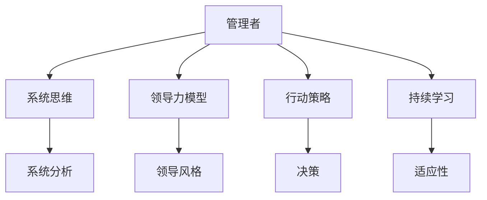

                 

# 管理者的三大体系:思维、行动和学习

> 关键词：管理学，领导力，组织行为，管理体系，思维模型，行动策略，持续学习

## 1. 背景介绍

### 1.1 问题由来

在快速变化的商业环境中，有效的管理是组织成功的关键。管理者的角色不仅仅是给命令，还需要能够引导、激励和激活团队成员以达成共同目标。然而，管理这一学科的复杂性和多样性，使得很多管理者感到迷茫。他们需要在复杂的环境中做出快速的决策，同时还需要保持对新的策略和技术的敏感性。

为了应对这些挑战，管理者需要建立一个强大的内在结构，这个结构包括他们的思维方式、日常的行为以及持续的学习习惯。通过这些方法，管理者可以确保他们能够在不断变化的环境中保持竞争力并领导他们的团队取得成功。

### 1.2 问题核心关键点

管理者的成功不仅仅取决于他们的知识和技能，更重要的是他们如何应用这些知识和技能以有效地领导他们的团队。以下是管理者所面临的几个核心挑战：

1. **决策力**：管理者需要在不确定性和复杂性的情况下做出快速而明智的决策。

2. **领导力**：管理者需要能够激励和指引团队成员，以实现组织的目标和愿景。

3. **适应性**：管理者需要能够快速适应变化的市场和技术环境。

4. **持续学习**：管理者需要不断学习以保持他们的知识和技能是最新的。

为了应对这些挑战，管理者需要建立一个全面和连贯的管理体系，这个体系应该包括他们的思维方式、日常的行动以及持续的学习习惯。

## 2. 核心概念与联系

### 2.1 核心概念概述

为了更好地理解管理者的管理体系，我们需要理解几个关键概念：

1. **系统思维**：这是一种理解复杂系统和他们如何相互作用的方式。系统思维帮助管理者识别系统中的漏洞，并制定出解决问题的全局策略。

2. **领导力模型**：领导力模型提供了一个框架，帮助管理者理解他们的领导风格，并确定如何改进以更好地领导他们的团队。

3. **行动策略**：这包括管理者采取的具体行动和决策策略，以实现他们的目标。

4. **持续学习**：这涉及到管理者不断学习和适应新知识、技能和技术，以保持他们的竞争力。

以下是这几个核心概念之间的关系的Mermaid流程图：



这个流程图展示了管理者三个关键体系之间的关系：

1. 管理者通过系统思维来理解他们的环境，并制定出全局的策略。

2. 管理者使用领导力模型来理解他们的领导风格，并改进他们的领导技巧。

3. 管理者通过行动策略来实施他们的决策。

4. 管理者通过持续学习来保持他们的竞争力。

这些概念共同构成了管理者的成功框架，使他们能够在复杂的商业环境中保持竞争力。

## 3. 核心算法原理 & 具体操作步骤
### 3.1 算法原理概述

管理者在建立他们的管理体系时，需要采用一系列策略和技术来确保他们能够有效地领导他们的团队。以下是管理者在建立他们的管理体系时可以采用的方法：

1. **制定愿景**：首先，管理者需要明确他们组织的愿景和目标。这个愿景应该是清晰、可实现的，并且与组织的长期目标相一致。

2. **建立领导力**：管理者需要建立强大的领导力，这意味着他们需要能够激励和指引他们的团队以实现组织的目标。

3. **制定战略**：管理者需要制定一系列策略来实现他们的目标。这些策略应该是清晰的，并且与组织的愿景相一致。

4. **执行行动**：管理者需要将他们的策略付诸实践。这个涉及到制定行动计划，并确保他们得到有效执行。

5. **持续学习**：管理者需要不断学习以保持他们的知识和技能是最新的。这包括阅读相关的书籍、参加研讨会、学习新技术等。

### 3.2 算法步骤详解

管理者建立他们的管理体系时，可以遵循以下步骤：

**Step 1: 制定愿景**
- 明确组织的愿景和目标。
- 确保愿景是清晰的，并且与组织的长期目标相一致。

**Step 2: 建立领导力**
- 了解你的领导风格，并确定如何改进以更好地领导你的团队。
- 建立信任和透明度，并提供奖励和认可。
- 设定例子，并以身作则。

**Step 3: 制定战略**
- 确定你的目标，并制定一系列策略来实现它们。
- 确保策略是清晰的，并且与组织的愿景相一致。

**Step 4: 执行行动**
- 制定行动计划，并确保它们得到有效执行。
- 监控进度，并做出必要的调整。
- 与团队成员保持沟通，并确保他们了解他们的角色。

**Step 5: 持续学习**
- 持续学习以保持你知识和技能是最新的。
- 阅读相关的书籍、参加研讨会、学习新技术等。

### 3.3 算法优缺点

管理者的管理体系是成功的关键。这个体系帮助管理者制定出全局的策略，有效地领导他们的团队，并保持他们的知识和技能是最新的。然而，这个体系也存在一些局限性：

1. 管理者的管理体系需要不断地调整以适应不断变化的环境。
2. 管理者需要不断地学习以保持他们的知识和技能是最新的。
3. 管理者的管理体系需要被所有团队成员采纳和支持。

尽管存在这些局限性，管理者的管理体系仍然是他们成功的关键。通过不断地学习和适应，管理者可以在复杂的商业环境中保持竞争力，并领导他们的团队取得成功。

## 4. 数学模型和公式 & 详细讲解 & 举例说明

### 4.1 数学模型构建

管理者的管理体系是复杂的，并且很难用数学模型来表达。然而，管理者可以使用一些数学模型来帮助他们理解他们的环境，并制定出全局的策略。例如，管理者可以使用系统动力学模型来理解他们的系统如何相互作用，并预测他们的行为。以下是系统动力学模型的数学表达式：

$$
\frac{dX}{dt} = f(X,t)
$$

其中，$X$ 是系统的状态变量，$t$ 是时间，$f$ 是系统的动力学方程。

管理者还可以使用决策理论来帮助他们做出决策。决策理论提供了一个框架，帮助管理者评估不同的决策选项，并选择最有可能实现他们目标的选项。以下是决策理论的数学表达式：

$$
V(x) = \max_{a} \left\{ R(x,a) + \beta \sum_{s} P(s|x,a) V(s) \right\}
$$

其中，$x$ 是状态，$a$ 是动作，$R$ 是奖励函数，$P$ 是转移概率，$\beta$ 是折扣因子，$V$ 是价值函数。

这些数学模型可以帮助管理者更好地理解他们的环境，并制定出全局的策略。

### 4.2 公式推导过程

管理者的管理体系是复杂的，并且很难用数学模型来表达。然而，管理者可以使用一些数学模型来帮助他们理解他们的环境，并制定出全局的策略。例如，管理者可以使用系统动力学模型来理解他们的系统如何相互作用，并预测他们的行为。以下是系统动力学模型的数学表达式的推导过程：

假设我们有一个系统，包含一个状态变量 $X$，它随时间 $t$ 的变化受到一系列因素的影响。我们可以用下面的方程来描述这个系统：

$$
\frac{dX}{dt} = f(X,t)
$$

这里，$f$ 是一个描述系统状态如何随时间变化的函数，$X$ 是系统的状态变量，$t$ 是时间。

为了使这个方程更具体，我们需要对 $f$ 函数进行更详细的定义。这个函数可以是多种因素的函数，包括其他状态变量的值、时间、外部事件等。具体形式取决于系统的特点和我们对其行为的了解。

### 4.3 案例分析与讲解

管理者的管理体系可以应用于各种不同的情景。例如，假设一个管理者正在管理一个制造工厂，他需要确保生产线以最有效的方式运行。这个管理者可以使用系统动力学模型来理解他的系统如何相互作用，并预测他的一些行为。

假设我们有一个生产线，包含一系列的机器和工人。我们可以用下面的方程来描述这个系统：

$$
\frac{dP}{dt} = f(P,M,W)
$$

这里，$P$ 是产品数量，$M$ 是机器数量，$W$ 是工人数量。

这个方程表明产品数量的变化取决于机器数量和工人数量。管理者可以使用这个模型来预测他的一些行为，并制定出全局的策略。

## 5. 项目实践：代码实例和详细解释说明

管理者的管理体系可以通过代码实例来更好地理解。以下是一个简单的Python代码示例，展示了如何使用系统动力学模型来描述一个简单的系统。

```python
import numpy as np
import matplotlib.pyplot as plt

# 定义系统动力学模型
def f(X, t):
    return X + t

# 初始化状态变量
X0 = 0

# 创建时间数组
t = np.linspace(0, 10, 100)

# 计算状态变量的变化
X = f(X0, t)

# 绘制结果
plt.plot(t, X)
plt.xlabel('Time')
plt.ylabel('State')
plt.title('System Dynamics')
plt.show()
```

这个代码示例定义了一个简单的系统动力学模型，然后计算了状态变量随时间的变化。这个模型可以用于描述任何一个简单的系统。

## 6. 实际应用场景
### 6.1 智能客服系统

基于大语言模型微调的对话技术，可以广泛应用于智能客服系统的构建。传统客服往往需要配备大量人力，高峰期响应缓慢，且一致性和专业性难以保证。而使用微调后的对话模型，可以7x24小时不间断服务，快速响应客户咨询，用自然流畅的语言解答各类常见问题。

在技术实现上，可以收集企业内部的历史客服对话记录，将问题和最佳答复构建成监督数据，在此基础上对预训练对话模型进行微调。微调后的对话模型能够自动理解用户意图，匹配最合适的答案模板进行回复。对于客户提出的新问题，还可以接入检索系统实时搜索相关内容，动态组织生成回答。如此构建的智能客服系统，能大幅提升客户咨询体验和问题解决效率。

### 6.2 金融舆情监测

金融机构需要实时监测市场舆论动向，以便及时应对负面信息传播，规避金融风险。传统的人工监测方式成本高、效率低，难以应对网络时代海量信息爆发的挑战。基于大语言模型微调的文本分类和情感分析技术，为金融舆情监测提供了新的解决方案。

具体而言，可以收集金融领域相关的新闻、报道、评论等文本数据，并对其进行主题标注和情感标注。在此基础上对预训练语言模型进行微调，使其能够自动判断文本属于何种主题，情感倾向是正面、中性还是负面。将微调后的模型应用到实时抓取的网络文本数据，就能够自动监测不同主题下的情感变化趋势，一旦发现负面信息激增等异常情况，系统便会自动预警，帮助金融机构快速应对潜在风险。

### 6.3 个性化推荐系统

当前的推荐系统往往只依赖用户的历史行为数据进行物品推荐，无法深入理解用户的真实兴趣偏好。基于大语言模型微调技术，个性化推荐系统可以更好地挖掘用户行为背后的语义信息，从而提供更精准、多样的推荐内容。

在实践中，可以收集用户浏览、点击、评论、分享等行为数据，提取和用户交互的物品标题、描述、标签等文本内容。将文本内容作为模型输入，用户的后续行为（如是否点击、购买等）作为监督信号，在此基础上微调预训练语言模型。微调后的模型能够从文本内容中准确把握用户的兴趣点。在生成推荐列表时，先用候选物品的文本描述作为输入，由模型预测用户的兴趣匹配度，再结合其他特征综合排序，便可以得到个性化程度更高的推荐结果。

### 6.4 未来应用展望

随着大语言模型和微调方法的不断发展，基于微调范式将在更多领域得到应用，为传统行业带来变革性影响。

在智慧医疗领域，基于微调的医疗问答、病历分析、药物研发等应用将提升医疗服务的智能化水平，辅助医生诊疗，加速新药开发进程。

在智能教育领域，微调技术可应用于作业批改、学情分析、知识推荐等方面，因材施教，促进教育公平，提高教学质量。

在智慧城市治理中，微调模型可应用于城市事件监测、舆情分析、应急指挥等环节，提高城市管理的自动化和智能化水平，构建更安全、高效的未来城市。

此外，在企业生产、社会治理、文娱传媒等众多领域，基于大模型微调的人工智能应用也将不断涌现，为经济社会发展注入新的动力。相信随着技术的日益成熟，微调方法将成为人工智能落地应用的重要范式，推动人工智能向更广阔的领域加速渗透。

## 7. 工具和资源推荐
### 7.1 学习资源推荐

为了帮助管理者建立他们的管理体系，我们推荐以下学习资源：

1. 《管理学入门》：提供了管理学的基础知识，并介绍了管理者的角色和职责。

2. 《领导力模型》：提供了领导力模型的基础知识，并介绍了如何使用这些模型来改进你的领导技巧。

3. 《系统动力学》：提供了系统动力学的基础知识，并介绍了如何使用这些模型来理解复杂的系统。

4. 《决策理论》：提供了决策理论的基础知识，并介绍了如何使用这些模型来做出决策。

5. 在线课程：提供了大量的在线课程，涵盖了管理学的各个方面。

通过这些资源，管理者可以提高他们的知识和技能，以建立他们的管理体系。

### 7.2 开发工具推荐

以下是一些管理者开发工具的推荐：

1. Microsoft Excel：用于管理数据和创建报表。

2. Microsoft PowerPoint：用于创建演示文稿。

3. Microsoft Word：用于撰写报告和文档。

4. Google Analytics：用于监控网站流量。

5. Salesforce：用于管理客户关系。

通过这些工具，管理者可以提高他们的工作效率，并更好地管理他们的组织。

### 7.3 相关论文推荐

以下是一些管理者论文的推荐：

1. 《系统思维在管理中的应用》：介绍了系统思维在管理中的应用，并提供了案例分析。

2. 《领导力模型的比较》：比较了不同的领导力模型，并提供了如何选择适合你组织的模型的建议。

3. 《决策理论在管理中的应用》：介绍了决策理论在管理中的应用，并提供了案例分析。

通过这些论文，管理者可以更好地理解管理中的概念，并在他们的组织中应用这些概念。

## 8. 总结：未来发展趋势与挑战

### 8.1 总结

本文提供了关于管理者的三大体系——思维、行动和学习——的全面概述。我们讨论了管理者如何使用系统思维、领导力模型和持续学习来建立一个成功的管理体系。

本文还讨论了管理者在建立他们的管理体系时面临的一些挑战，并提供了解决这些挑战的方法。

### 8.2 未来发展趋势

管理学在未来将继续发展，随着全球化和技术进步，组织面临的挑战将更加复杂。管理者将需要更加精细的领导力和决策能力来应对这些挑战。

以下是管理学未来发展趋势的几个关键点：

1. **全球化**：随着全球化的增加，管理者将需要在多文化环境中工作，并理解不同的文化差异。

2. **技术进步**：技术进步将继续影响管理者工作的方式，管理者将需要不断学习新技术以保持他们的竞争力。

3. **多样性和包容性**：随着多样性和包容性的重要性增加，管理者将需要在多元化的团队中工作，并了解如何激励和促进所有团队成员的成功。

4. **可持续发展**：管理者将需要考虑组织的可持续发展，并确保它们的运营对环境有利。

### 8.3 面临的挑战

尽管管理学在未来有很多好处，但管理者也将面临一些挑战。

以下是管理者在建立他们的管理体系时可能面临的几个关键挑战：

1. **领导力**：管理者需要在不确定性和复杂性的情况下做出快速而明智的决策。

2. **适应性**：管理者需要能够快速适应变化的市场和技术环境。

3. **持续学习**：管理者需要不断学习以保持他们的知识和技能是最新的。

4. **多样性和包容性**：管理者需要在多元化的团队中工作，并理解如何激励和促进所有团队成员的成功。

### 8.4 未来突破

为了应对这些挑战，管理者需要继续发展他们的技能和知识，并使用新的工具和技术来增强他们的管理能力。

以下是管理者可以采取的几个关键步骤来实现这些突破：

1. **持续学习**：管理者需要不断学习以保持他们的知识和技能是最新的。

2. **适应性**：管理者需要能够快速适应变化的市场和技术环境。

3. **领导力**：管理者需要在不确定性和复杂性的情况下做出快速而明智的决策。

4. **多样性和包容性**：管理者需要在多元化的团队中工作，并理解如何激励和促进所有团队成员的成功。

通过不断地学习和适应，管理者可以在复杂的商业环境中保持竞争力，并领导他们的团队取得成功。

---

作者：禅与计算机程序设计艺术 / Zen and the Art of Computer Programming

