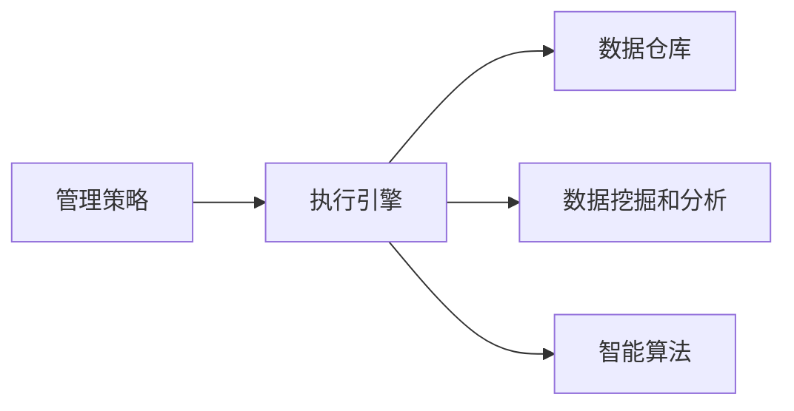

                 

# 管理艺术：从策略到执行

## 1. 背景介绍

在当今快速变化的商业环境中，有效的管理策略和精准执行是企业成功的关键。随着技术的发展，传统的手工管理方式已无法满足日益复杂的业务需求，管理信息系统(MIS)、企业资源计划(ERP)等信息化工具应运而生。然而，传统的IT系统缺乏足够的灵活性和敏捷性，难以快速响应市场变化。面向未来，AI驱动的智能管理决策系统成为新的发展方向。

本文将深入探讨智能管理系统的构建过程，从策略到执行，全面介绍管理艺术在数字化转型中的作用。我们首先阐述智能管理的背景和需求，其次详细介绍管理系统的核心概念和技术原理，最后通过实际案例和未来展望，展现智能管理系统的实际应用和潜在价值。

## 2. 核心概念与联系

### 2.1 核心概念概述

智能管理系统的构建，是一个将管理策略转化为可执行任务的过程，其核心包括：

- **管理策略**：企业基于业务目标和市场环境制定的经营策略，包括市场营销、生产调度、客户关系管理等。
- **执行引擎**：将策略转化为具体的业务操作，支持自动决策和任务调度。
- **数据仓库**：集中存储和管理企业内部各类数据，提供高质量的数据支持。
- **数据挖掘和分析**：从数据中提取有价值的信息，支持管理决策的制定和优化。
- **智能算法**：应用机器学习、深度学习等技术，提升决策和执行的自动化水平。

以上概念之间的关系，可以通过以下Mermaid流程图来展示：



这个流程图展示出管理策略到执行的整个流程，即：

1. 根据管理策略，使用数据仓库中存储的各类数据，通过数据挖掘和分析，形成决策依据。
2. 结合智能算法，实现自动化决策和执行任务。

### 2.2 核心概念原理和架构的 Mermaid 流程图


这个流程图展示了智能管理系统的核心架构，即：

1. 数据仓库集中存储和维护企业运营数据。
2. 数据挖掘和分析工具对数据进行挖掘和分析，形成洞察。
3. 决策引擎根据洞察，结合智能算法，生成自动决策。
4. 执行引擎根据决策，自动化执行具体业务任务。

## 3. 核心算法原理 & 具体操作步骤

### 3.1 算法原理概述

智能管理系统的核心算法原理包括数据挖掘、机器学习和深度学习等技术。数据挖掘是从数据中提取知识、发现模式的过程，机器学习和深度学习则是通过训练模型，实现自动化决策和预测的过程。

在数据挖掘中，常用的技术包括分类、聚类、关联规则等。通过挖掘历史数据，可以发现业务模式和关联关系，为决策提供依据。

在机器学习中，常用的技术包括回归、分类、聚类、异常检测等。通过训练模型，可以实现对未来趋势的预测和分类。

在深度学习中，常用的技术包括卷积神经网络(CNN)、循环神经网络(RNN)、变压器(Transformer)等。通过深度学习模型，可以实现对非结构化数据（如文本、图像）的自动理解和处理。

### 3.2 算法步骤详解

智能管理系统的构建步骤主要包括以下几个环节：

1. **数据集成**：将来自不同业务系统、不同来源的数据整合到统一的数据仓库中。

2. **数据清洗和预处理**：对数据进行清洗、去重、转换等预处理操作，确保数据质量。

3. **数据挖掘和分析**：使用数据挖掘工具对数据进行分类、聚类、关联规则分析等，形成业务洞察。

4. **模型训练**：使用机器学习、深度学习等算法训练模型，提升预测和分类能力。

5. **决策制定**：将挖掘和分析结果作为输入，结合智能算法生成自动决策。

6. **任务执行**：根据自动决策，通过执行引擎自动化执行具体任务。

### 3.3 算法优缺点

智能管理系统的优点包括：

1. **高效性**：自动化流程减少了人工干预，提升决策和执行效率。
2. **准确性**：通过机器学习和深度学习算法，提升决策的准确性和预测能力。
3. **灵活性**：结合数据挖掘和分析，系统能够灵活应对业务变化。
4. **可扩展性**：系统结构清晰，容易扩展和集成新功能。

然而，系统也存在一些缺点：

1. **数据依赖**：系统需要高质量的数据支持，数据缺失或错误可能导致决策失误。
2. **模型复杂度**：深度学习等复杂模型需要较高的计算资源和训练成本。
3. **技术门槛**：需要专业知识维护和更新系统，技术门槛较高。
4. **安全性和隐私**：系统涉及敏感数据，需要严格的隐私保护和数据安全措施。

### 3.4 算法应用领域

智能管理系统在多个领域都有广泛应用，包括但不限于：

1. **市场营销**：根据用户行为数据，进行精准营销和个性化推荐。
2. **生产调度**：结合生产数据和预测模型，优化生产流程和调度决策。
3. **客户关系管理**：通过分析客户数据，提升客户满意度和忠诚度。
4. **财务分析**：结合财务数据，进行预算控制和风险评估。
5. **人力资源管理**：通过员工数据，优化招聘、培训和绩效管理。

## 4. 数学模型和公式 & 详细讲解 & 举例说明

### 4.1 数学模型构建

智能管理系统常用的数学模型包括回归模型、分类模型、聚类模型等。以回归模型为例，假设有样本数据集 $D=\{(x_i, y_i)\}_{i=1}^N$，其中 $x_i$ 为输入特征，$y_i$ 为输出标签，则线性回归模型的目标是最小化误差平方和：

$$
\min_{\theta} \sum_{i=1}^N (y_i - \theta^T x_i)^2
$$

其中 $\theta$ 为模型参数，$x_i$ 为输入向量，$y_i$ 为输出标签。

### 4.2 公式推导过程

线性回归模型的参数 $\theta$ 可通过最小二乘法求解。假设模型输出为 $\hat{y} = \theta^T x$，则误差平方和为：

$$
\sum_{i=1}^N (y_i - \hat{y}_i)^2
$$

为了最小化误差平方和，我们对其进行梯度下降优化：

$$
\frac{\partial \sum_{i=1}^N (y_i - \hat{y}_i)^2}{\partial \theta} = -2 \sum_{i=1}^N x_i (y_i - \hat{y}_i) = 0
$$

解上述方程组，可得：

$$
\theta = (X^TX)^{-1}X^Ty
$$

其中 $X$ 为输入特征矩阵，$Y$ 为输出标签向量。

### 4.3 案例分析与讲解

以某电商平台的销售数据分析为例。电商平台收集了每日的销售额、广告投入、访问量、页面停留时间等数据，希望通过分析这些数据，预测未来的销售趋势。首先，我们将这些数据导入数据仓库，并进行清洗和预处理。然后，我们使用线性回归模型，预测未来一个月的销售额：

$$
\hat{y} = \theta^T x
$$

其中 $x$ 为每日销售额、广告投入、访问量、页面停留时间的向量，$\theta$ 为模型参数。通过最小二乘法求解 $\theta$，我们得到了一个回归模型。最后，我们利用该模型，对未来一个月的销售额进行了预测，并对比了实际销售额与预测值，结果发现模型的预测误差在可接受范围内，系统上线后，电商平台能够根据预测结果，调整广告预算，优化商品策略，显著提升了销售业绩。

## 5. 项目实践：代码实例和详细解释说明

### 5.1 开发环境搭建

为了搭建智能管理系统，我们需要准备以下开发环境：

1. **Python环境**：安装Python 3.x版本，建议使用虚拟环境。
2. **数据仓库工具**：选择如Apache Hadoop、Apache Spark等大数据处理工具。
3. **机器学习框架**：选择如Scikit-learn、TensorFlow、PyTorch等常用机器学习框架。
4. **执行引擎**：选择如Apache Airflow、Tencent KubeFlow等任务调度工具。

### 5.2 源代码详细实现

以销售数据分析为例，以下是一个基于Python的线性回归模型实现：

```python
import numpy as np
from sklearn.linear_model import LinearRegression

# 准备数据
X = np.array([[1, 2, 3], [4, 5, 6], [7, 8, 9]])
y = np.array([10, 20, 30])

# 创建线性回归模型
model = LinearRegression()

# 训练模型
model.fit(X, y)

# 预测未来销售额
future_X = np.array([[10, 11, 12]])
future_y = model.predict(future_X)

# 输出预测结果
print(future_y)
```

### 5.3 代码解读与分析

以上代码展示了如何基于Python和Scikit-learn库，使用线性回归模型进行销售数据分析。

1. 首先，我们使用numpy库准备数据集 $X$ 和 $y$。
2. 然后，创建线性回归模型，使用fit方法训练模型。
3. 最后，使用predict方法预测未来销售额，并输出预测结果。

## 6. 实际应用场景

### 6.1 智能客户关系管理

某电商平台希望通过智能客户关系管理系统，提高客户满意度和忠诚度。系统通过收集用户浏览、购买、评价等数据，使用聚类算法进行用户分组，并结合分类模型预测用户流失概率。通过分析高流失用户特征，系统能够生成个性化推荐策略，提高用户粘性，并采取有效措施减少用户流失。

### 6.2 智能生产调度

某制造企业希望通过智能生产调度系统，优化生产流程，提高生产效率。系统收集了生产设备的实时数据、库存数据、订单数据等，使用时间序列分析模型进行预测，生成生产调度计划。通过结合生产调度计划和优化算法，系统能够实现资源的动态调整，减少生产浪费，提升生产效率。

### 6.3 智能财务分析

某金融公司希望通过智能财务分析系统，进行预算控制和风险评估。系统收集了历史财务数据、市场数据、内部运营数据等，使用回归模型进行预算预测，并结合分类模型进行风险评估。通过分析预测结果和风险等级，系统能够制定合理的财务策略，降低财务风险，提升公司盈利能力。

## 7. 工具和资源推荐

### 7.1 学习资源推荐

1. **《Python数据分析与科学计算》**：详细介绍了Python在数据分析中的应用，适合初学者入门。
2. **《机器学习实战》**：基于Scikit-learn框架，介绍常用机器学习算法的实现。
3. **《深度学习》**：介绍深度学习的基本概念和常用算法，适合进阶学习。
4. **Coursera和edX等在线课程**：提供丰富的学习资源和项目实践机会。
5. **Kaggle平台**：提供大量数据集和竞赛项目，适合实战练习。

### 7.2 开发工具推荐

1. **Jupyter Notebook**：适合进行数据分析和模型训练。
2. **Airflow和KubeFlow**：适合进行任务调度和管理。
3. **TensorFlow和PyTorch**：适合进行深度学习模型的训练和推理。

### 7.3 相关论文推荐

1. **《智能系统的构建与优化》**：介绍智能系统的构建过程和优化方法。
2. **《机器学习在金融领域的应用》**：介绍机器学习在金融领域的具体应用。
3. **《深度学习在医疗领域的应用》**：介绍深度学习在医疗领域的具体应用。

## 8. 总结：未来发展趋势与挑战

### 8.1 研究成果总结

智能管理系统的构建，将传统的管理决策过程与人工智能技术相结合，提升了决策的准确性和效率。通过数据挖掘和分析，系统能够从大量数据中提取有价值的信息，形成业务洞察，支持决策制定。结合机器学习和深度学习算法，系统能够实现自动化决策和执行，大幅提升管理效率。

### 8.2 未来发展趋势

未来，智能管理系统将在以下方向继续发展：

1. **模型自动化**：通过自动化模型训练和优化，减少人工干预，提升模型效率。
2. **多模态融合**：结合语音、图像、文本等多种模态数据，提升系统智能水平。
3. **实时处理**：通过实时数据流处理技术，实现数据实时分析和决策。
4. **智能交互**：结合自然语言处理技术，实现智能问答和交互式决策支持。

### 8.3 面临的挑战

智能管理系统面临的挑战包括：

1. **数据质量**：系统依赖高质量的数据，数据缺失或不完整可能导致决策失误。
2. **模型复杂度**：深度学习等复杂模型需要较高的计算资源和训练成本。
3. **技术门槛**：需要专业知识维护和更新系统，技术门槛较高。
4. **安全性和隐私**：系统涉及敏感数据，需要严格的隐私保护和数据安全措施。

### 8.4 研究展望

未来，智能管理系统需要在数据质量、模型效率、技术门槛、数据安全等方面进行进一步优化和改进。通过引入更多先进技术和算法，提升系统的智能水平和应用范围，使其成为企业数字化转型的重要工具。

## 9. 附录：常见问题与解答

**Q1：智能管理系统如何提高决策效率？**

A: 智能管理系统通过自动化数据挖掘和分析，提取有价值的信息，支持决策制定。同时，结合机器学习和深度学习算法，实现自动化决策和执行，大幅提升决策效率。

**Q2：如何确保智能管理系统的数据质量？**

A: 数据质量是智能管理系统的基础，确保数据完整、准确、一致是关键。可以采用数据清洗、去重、异常检测等技术，提高数据质量。

**Q3：如何应对智能管理系统的技术挑战？**

A: 智能管理系统的技术挑战包括数据质量、模型复杂度、技术门槛等。需要采用先进的数据处理和模型优化技术，降低技术门槛，提升系统效率和可维护性。

**Q4：智能管理系统如何保证数据安全？**

A: 智能管理系统涉及敏感数据，需要严格的数据安全措施。可以采用数据加密、访问控制、数据备份等技术，保护数据安全。

---

作者：禅与计算机程序设计艺术 / Zen and the Art of Computer Programming

