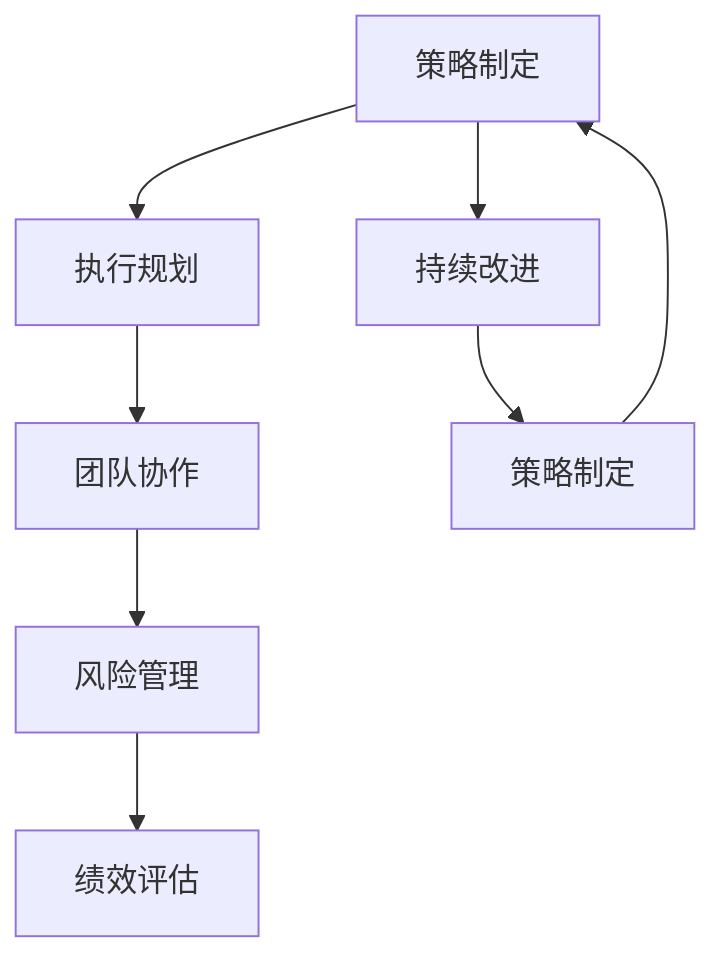

                 

# 管理艺术：从策略到执行

管理艺术是一门综合的艺术，它将各种策略和执行技巧相结合，以实现组织的战略目标和提升运营效率。在信息技术（IT）领域，管理艺术同样至关重要，尤其是在项目管理、资源分配、团队协作以及风险管理等方面。本文将深入探讨管理艺术的核心概念、关键技术和实际应用场景，旨在为IT领域的从业人员提供实用的指导和启示。

## 1. 背景介绍

### 1.1 问题由来

在快速变化的技术环境中，IT团队需要不断适应新的技术趋势和市场变化。然而，IT项目往往面临复杂性高、资源有限、需求多变等挑战，这使得项目管理变得尤为困难。如何有效规划、执行和管理IT项目，成为IT管理团队的一项重要任务。

### 1.2 问题核心关键点

项目管理成功的关键在于有效的策略制定和高效的执行。以下是几个核心关键点：

- **策略制定**：明确项目目标、范围和关键绩效指标（KPIs）。
- **执行规划**：制定详细的项目计划、资源分配和进度跟踪策略。
- **团队协作**：建立高效的沟通机制，确保团队成员之间的协作和信息共享。
- **风险管理**：识别和评估项目风险，制定相应的应对措施。
- **持续改进**：根据项目进展和反馈不断优化管理过程。

### 1.3 问题研究意义

掌握管理艺术，有助于提升IT项目的成功率和效率，确保组织战略目标的实现。通过有效的管理，IT团队可以更好地应对市场和技术变化，确保项目的按时交付和高质量完成。同时，管理艺术还可以提升团队士气和创新能力，促进组织长期发展。

## 2. 核心概念与联系

### 2.1 核心概念概述

管理艺术涉及多个核心概念，这些概念相互联系，共同构成了管理艺术的理论基础：

- **项目管理**：指通过计划、执行、监控和收尾等过程，实现项目目标的活动。
- **资源管理**：涉及人员、资金、技术和时间等资源的规划、分配和优化。
- **团队协作**：强调团队成员之间的沟通、协调和协作，确保项目顺利进行。
- **风险管理**：识别、评估和管理项目风险，保障项目顺利完成。
- **绩效评估**：通过指标和评估方法，监测和评估项目的进度和质量。

### 2.2 核心概念原理和架构的 Mermaid 流程图



这个流程图展示了管理艺术的核心流程和关键概念的相互关系：

1. **策略制定**：在项目启动阶段，明确项目目标和关键绩效指标。
2. **执行规划**：制定详细的项目计划，分配资源和确定关键路径。
3. **团队协作**：确保团队成员之间的有效沟通和协作，确保项目顺利进行。
4. **风险管理**：识别和评估项目风险，制定相应的应对措施。
5. **绩效评估**：通过指标和评估方法，监测和评估项目的进度和质量。
6. **持续改进**：根据项目进展和反馈不断优化管理过程，确保项目目标的实现。

## 3. 核心算法原理 & 具体操作步骤

### 3.1 算法原理概述

管理艺术的算法原理主要围绕着项目管理的核心原则和实践方法展开。这些方法旨在通过系统的策略制定和高效的执行过程，实现项目目标。

### 3.2 算法步骤详解

管理艺术的执行过程可以分解为以下几个关键步骤：

1. **需求分析和项目规划**：明确项目需求，制定详细的项目计划。
2. **资源分配和进度跟踪**：合理分配资源，跟踪项目进度。
3. **风险识别和应对**：识别项目风险，制定风险应对策略。
4. **绩效监测和评估**：通过关键绩效指标（KPIs）监测项目进展，进行定期评估。
5. **持续优化**：根据项目进展和反馈，不断优化管理过程。

### 3.3 算法优缺点

管理艺术的优点在于其系统的策略制定和高效的执行流程，能够帮助团队有效应对复杂多变的环境，确保项目按时交付和高质量完成。然而，管理艺术的复杂性也可能带来一定的挑战，例如：

- **高成本**：详细的需求分析和规划可能增加项目的初始成本。
- **灵活性受限**：一旦制定了详细的计划，修改和调整可能相对困难。
- **依赖人员能力**：管理艺术的成功依赖于团队成员的专业能力和执行力。

### 3.4 算法应用领域

管理艺术广泛应用于各种IT项目，包括软件开发、系统集成、网络建设和业务转型等。这些领域的管理艺术实践，不仅能确保项目的成功交付，还能提升团队的协作能力和项目执行效率。

## 4. 数学模型和公式 & 详细讲解 & 举例说明

### 4.1 数学模型构建

管理艺术的数学模型主要围绕项目管理的关键指标展开，包括项目进度、成本、风险和绩效等。以下是几个常用的数学模型：

- **甘特图（Gantt Chart）**：展示项目进度和任务分配。
- **成本估算模型**：通过历史数据和专家评估，估算项目成本。
- **风险评估模型**：使用统计和概率方法，评估项目风险。
- **绩效评估模型**：通过关键绩效指标（KPIs），监测和评估项目进展。

### 4.2 公式推导过程

以甘特图为例，甘特图是一个时间-任务的双维度表示，其中横轴表示时间，纵轴表示任务。通过计算任务的最早开始时间（Earliest Start Time, EST）、最晚开始时间（Latest Start Time, LST）和最早完成时间（Earliest End Time, EET），可以绘制甘特图：

$$
\text{EST} = \text{Earliest Time} + \text{Lead Time}
$$
$$
\text{LST} = \text{Latest Time} - \text{Lead Time}
$$
$$
\text{EET} = \text{EST} + \text{Duration}
$$

其中，`Earliest Time` 和 `Latest Time` 分别为任务最早和最晚可以开始的时间，`Lead Time` 和 `Duration` 分别为任务的领先时间和持续时间。

### 4.3 案例分析与讲解

假设我们有一个软件开发项目，需要开发一个新功能模块。我们可以使用甘特图来规划项目进度：

1. **任务分配**：确定每个任务（如需求分析、设计、编码、测试等）的起始时间和持续时间。
2. **资源分配**：确定每个任务所需的人力和技术资源。
3. **进度跟踪**：在项目进行过程中，实时更新甘特图，确保项目按计划进行。
4. **风险评估**：识别项目中的潜在风险，如技术瓶颈、人员变动等，并制定应对策略。
5. **绩效评估**：通过关键绩效指标（如任务完成率、质量缺陷率等），评估项目进展和团队绩效。

## 5. 项目实践：代码实例和详细解释说明

### 5.1 开发环境搭建

要实现甘特图的可视化和管理，需要搭建以下开发环境：

1. **Python 环境**：使用 Python 作为开发语言，安装必要的库和框架。
2. **Jupyter Notebook**：使用 Jupyter Notebook 进行交互式开发和数据可视化。
3. **Matplotlib 和 Seaborn**：用于绘制甘特图和图表。
4. **Pandas**：用于数据处理和分析。

### 5.2 源代码详细实现

以下是一个简单的 Python 代码示例，展示如何使用 Pandas 和 Matplotlib 绘制甘特图：

```python
import pandas as pd
import matplotlib.pyplot as plt

# 创建任务数据
tasks = [
    {'name': '需求分析', 'start_time': '2023-01-01', 'duration': 2},
    {'name': '设计', 'start_time': '2023-01-03', 'duration': 1},
    {'name': '编码', 'start_time': '2023-01-05', 'duration': 3},
    {'name': '测试', 'start_time': '2023-01-08', 'duration': 1}
]

# 创建任务表
task_df = pd.DataFrame(tasks)

# 绘制甘特图
plt.figure(figsize=(10, 6))
plt.title('Gantt Chart')
plt.xticks(rotation=90)
plt.bar(task_df['name'], task_df['duration'], bottom=task_df['start_time'])

# 添加横纵坐标
plt.xlim(0, 12)
plt.ylim(0, 1)

plt.show()
```

### 5.3 代码解读与分析

上述代码实现了简单的甘特图绘制，具体解释如下：

- **任务数据创建**：通过 Python 字典创建任务数据，包括任务名称、开始时间和持续时间。
- **任务表创建**：使用 Pandas 创建任务表，方便数据处理和分析。
- **甘特图绘制**：使用 Matplotlib 绘制甘特图，横轴表示时间，纵轴表示任务。
- **坐标设置**：通过 `xlim` 和 `ylim` 设置横纵坐标的范围。

## 6. 实际应用场景

### 6.1 软件开发

在软件开发项目中，甘特图是一个有效的项目管理工具，帮助团队规划项目进度、分配资源和跟踪任务完成情况。通过甘特图，团队成员可以清晰了解项目的整体进度和各自的任务安排，确保项目按时交付。

### 6.2 系统集成

系统集成项目通常涉及多个子系统，每个子系统需要不同的开发周期和资源。甘特图可以帮助项目经理规划各子系统的进度和依赖关系，确保整体项目按时完成。

### 6.3 网络建设

网络建设项目涉及复杂的部署和测试过程，甘特图可以帮助项目团队规划网络部署的各个阶段，确保网络建设顺利进行。

### 6.4 未来应用展望

未来，随着技术的进步，管理艺术将进一步发展。例如，人工智能和大数据技术可以用于优化资源分配和风险评估，提升管理效率。同时，自动化和智能化项目管理工具将使得项目管理更加高效和智能。

## 7. 工具和资源推荐

### 7.1 学习资源推荐

要深入掌握管理艺术，可以参考以下学习资源：

1. **《项目管理知识体系指南（PMBOK）》**：项目管理领域的权威指南，涵盖项目管理的所有方面。
2. **《敏捷项目管理》**：介绍敏捷项目管理的方法和实践，适用于快速变化的环境。
3. **《Scrum敏捷项目管理》**：详细介绍Scrum敏捷项目管理的理论和方法。
4. **《风险管理》**：讲解风险识别、评估和应对策略，提升项目管理水平。
5. **《绩效管理》**：通过关键绩效指标（KPIs），监测和评估项目进展，提升团队绩效。

### 7.2 开发工具推荐

管理艺术的实践离不开良好的开发工具支持。以下是一些推荐工具：

1. **JIRA**：项目管理工具，支持任务分配、进度跟踪和问题管理。
2. **Confluence**：团队协作工具，支持文档管理和知识共享。
3. **Trello**：敏捷项目管理工具，支持看板和任务分配。
4. **Asana**：项目管理工具，支持任务分配、进度跟踪和协作。
5. **GitLab**：开源代码托管平台，支持持续集成和版本控制。

### 7.3 相关论文推荐

以下是几篇重要的管理艺术相关论文：

1. **《项目管理理论基础》**：介绍项目管理的理论基础和核心概念。
2. **《敏捷项目管理：方法与实践》**：详细介绍敏捷项目管理的理论和方法。
3. **《精益项目管理》**：介绍精益项目管理的理论和方法。
4. **《风险管理：理论与实践》**：讲解风险识别、评估和应对策略。
5. **《绩效管理：理论与实践》**：通过关键绩效指标（KPIs），监测和评估项目进展。

## 8. 总结：未来发展趋势与挑战

### 8.1 研究成果总结

管理艺术的研究已经取得了丰硕的成果，特别是在项目管理、资源管理和团队协作等方面。未来，随着技术的进步和实践的积累，管理艺术将进一步发展和完善。

### 8.2 未来发展趋势

未来管理艺术的发展趋势包括：

1. **智能化**：借助人工智能和大数据技术，优化项目管理过程，提升管理效率。
2. **自动化**：通过自动化工具和流程，减少人为干预，提高项目管理效率。
3. **标准化**：制定和推广项目管理标准和最佳实践，提升项目管理水平。
4. **可持续性**：注重项目的可持续性和社会责任，推动可持续发展。

### 8.3 面临的挑战

尽管管理艺术取得了显著进展，但未来仍面临诸多挑战：

1. **复杂性增加**：随着项目规模和复杂性的增加，项目管理难度也随之增加。
2. **资源紧张**：在资源有限的情况下，如何有效分配和管理资源是一个重要问题。
3. **技术变革**：快速变化的技术环境要求项目管理方法不断更新和适应。
4. **人员管理**：团队协作和人员管理是项目管理中的难点，需要不断优化和改进。
5. **风险管理**：项目中的不确定性和风险需要有效识别和管理，确保项目顺利完成。

### 8.4 研究展望

未来的研究将进一步探索管理艺术的创新方法和技术工具，提升项目管理的科学性和有效性。例如：

1. **多学科融合**：结合工程学、心理学、社会学等多学科知识，提升项目管理水平。
2. **跨文化管理**：考虑不同文化背景下的项目管理差异，推广全球化的管理方法。
3. **人机协作**：研究人机协作的理论与方法，提升项目管理效率和效果。

## 9. 附录：常见问题与解答

**Q1：项目管理中的风险如何识别和管理？**

A: 风险识别和管理是项目管理的重要环节。以下是常见的风险识别和管理方法：

- **风险识别**：通过项目历史数据、专家评估和问卷调查等方式，识别潜在的风险因素。
- **风险评估**：使用定量或定性方法，评估风险的概率和影响程度。
- **风险应对**：制定相应的应对策略，如风险规避、缓解、转移或接受。
- **风险监控**：持续监测风险变化，及时调整应对策略。

**Q2：如何进行绩效评估？**

A: 绩效评估是项目管理的重要组成部分，通过关键绩效指标（KPIs）监测项目进展和团队绩效。以下是常用的绩效评估方法：

- **定量评估**：通过统计数据和指标，评估项目的进度、质量和成本等。
- **定性评估**：通过专家评估、问卷调查等方式，评估项目的主观绩效。
- **关键绩效指标（KPIs）**：选择关键指标，如任务完成率、质量缺陷率、客户满意度等，进行定期评估。

**Q3：项目管理中的沟通管理有哪些关键点？**

A: 有效的沟通管理是项目管理成功的关键。以下是常见的沟通管理关键点：

- **沟通计划**：制定详细的沟通计划，明确沟通内容、方式和频率。
- **沟通渠道**：选择合适的沟通渠道，如会议、邮件、协作工具等。
- **信息共享**：确保信息及时、准确地共享，促进团队协作。
- **问题解决**：建立有效的沟通机制，及时解决项目中的问题和冲突。

**Q4：如何在项目管理中应用数据驱动的方法？**

A: 数据驱动的方法在项目管理中具有重要作用，以下是具体应用方法：

- **数据收集**：通过各种数据源（如历史数据、项目进展数据等），收集项目相关数据。
- **数据分析**：使用数据分析工具和技术，分析项目的进度、成本和风险等。
- **决策支持**：基于数据分析结果，制定决策和优化策略。
- **持续改进**：通过数据分析，持续改进项目管理过程和效果。

---

作者：禅与计算机程序设计艺术 / Zen and the Art of Computer Programming

