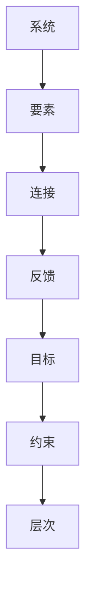

                 

# 系统思考:管理者必备的思维利器

> 关键词：系统思考,复杂系统,系统模型,反馈循环,组织变革,决策制定

## 1. 背景介绍

### 1.1 问题由来
在当今快速变化和高度互联的商业环境中，管理者面临着前所未有的复杂挑战。从多元化的市场需求到全球化竞争，再到数字化转型，每一个决策都需要基于对整个系统的深入理解。然而，传统管理方法往往聚焦于单一因素和短期效果，难以应对日益复杂的系统问题。此时，系统思考（Systems Thinking）作为一门新兴的管理方法论，提供了一种从全局视角理解并解决复杂问题的全新思维方式。

系统思考认为，系统是由相互作用和依赖的多个要素构成的整体。它强调系统的整体性、相关性和动态性，要求管理者从系统的视角出发，识别系统的关键要素，理解各要素之间的关系，以及系统如何随时间演变。通过对系统的深入分析，管理者可以更全面、更长期地制定和实施策略，有效应对环境变化，实现组织目标。

### 1.2 问题核心关键点
系统思考的核心关键点包括：
1. **整体性**：强调系统各要素的相互依赖和作用，避免孤立看待问题。
2. **相关性**：关注系统要素之间的因果关系，识别关键驱动因素。
3. **动态性**：理解系统随时间变化的演变过程，预测未来趋势。
4. **层次性**：认识到系统不同层次间的相互影响，从宏观到微观进行综合分析。
5. **反馈循环**：识别系统内部的正反馈和负反馈机制，调整系统行为。
6. **可持续性**：确保系统在长期内保持稳定和适应性，避免短期行为导致的长期负面影响。

## 2. 核心概念与联系

### 2.1 核心概念概述

为更好地理解系统思考方法，本节将介绍几个核心概念：

- **系统（System）**：由相互依赖、相互作用的多个要素组成，具有特定目的和功能的一个整体。系统可以是物理的，如人体；也可以是抽象的，如组织、市场。
- **要素（Component）**：系统中的单个元素或子系统，如组织中的部门、市场中的消费者。
- **连接（Connection）**：要素之间的交互和影响，如组织内部的沟通、市场中的供需关系。
- **反馈（Feedback）**：系统内部或外部的信息循环，影响系统行为和结构。
- **目标（Goal）**：系统存在的最终目的，如组织的利润、市场的需求满足。
- **约束（Constraint）**：系统运行中必须遵守的规则或限制，如法律、技术。
- **层次（Hierarchy）**：系统中的不同层级结构，如组织中的管理层、生产线；市场中的宏观、中观、微观层级。

这些核心概念之间的逻辑关系可以通过以下Mermaid流程图来展示：



这个流程图展示了系统的基本结构：

1. 系统由多个要素构成。
2. 要素之间通过连接相互影响。
3. 系统内部和外部的反馈机制调节系统行为。
4. 系统运行受目标和约束的限制。
5. 系统在多层次上运作，形成一个复杂的层次结构。

## 3. 核心算法原理 & 具体操作步骤
### 3.1 算法原理概述

系统思考的算法原理可以概括为以下几个步骤：

1. **定义系统边界**：明确系统包含哪些要素，与外部环境的相互作用，系统的主要目标和约束条件。
2. **识别关键要素和连接**：分析系统内部要素之间的关系，识别出关键的驱动因素和影响关系。
3. **分析反馈循环**：识别系统内部的正反馈和负反馈机制，理解它们如何影响系统行为。
4. **制定调整策略**：根据反馈循环和目标需求，设计相应的调整策略，引导系统朝向期望的方向演化。
5. **实施和监控**：执行调整策略，实时监控系统运行状态，必要时进行调整。

### 3.2 算法步骤详解

系统思考的具体操作步骤包括以下几个关键步骤：

**Step 1: 定义系统边界**
- 明确系统边界，即确定系统的具体范围和核心要素。
- 确定系统的目标和约束条件，如组织的使命、市场的需求、技术限制等。
- 分析系统的外部环境，理解系统的输入和输出，以及它们对系统的作用和影响。

**Step 2: 识别关键要素和连接**
- 通过系统地图（System Map）等工具，绘制系统各要素的相互关系图。
- 识别出系统中的关键要素，包括资源、活动、人员、客户等。
- 分析要素之间的连接，如流程、信息流动、供应链关系等。

**Step 3: 分析反馈循环**
- 识别系统内部的反馈循环，如负反馈（如价格调整后的供需平衡）和正反馈（如广告效应带来的需求激增）。
- 理解反馈循环对系统行为的影响，预测系统可能的演变路径。
- 设计干预策略，调整或控制反馈循环，以实现系统的稳定和优化。

**Step 4: 制定调整策略**
- 根据系统分析和反馈循环分析结果，设计具体的调整策略。
- 考虑策略的短期和长期影响，确保其可持续性和适应性。
- 优先考虑系统的关键要素和连接，确保调整策略的有效性。

**Step 5: 实施和监控**
- 执行调整策略，实施系统改进措施。
- 实时监控系统运行状态，收集反馈信息。
- 根据反馈信息调整策略，确保系统持续优化。

### 3.3 算法优缺点

系统思考作为一种管理方法论，具有以下优点：
1. **全局视角**：通过系统地图等工具，管理者可以全面理解系统的整体性，避免局部视角的局限性。
2. **长期考虑**：关注系统的长期目标和可持续发展，避免短视行为。
3. **动态适应**：理解系统的动态性和反馈机制，能够灵活应对环境变化。
4. **协同作用**：强调要素间的相互依赖和协同作用，促进系统内部的协同效应。

同时，系统思考也存在一些局限性：
1. **复杂性高**：系统思考涉及多要素和多层次的分析，需要较高的抽象思维能力和模型构建技能。
2. **工具依赖**：系统思考方法依赖于系统地图、因果图等工具，需要一定的工具使用和解读能力。
3. **数据要求高**：系统思考需要大量的数据来支持分析，而数据的获取和处理可能较为困难。
4. **成本高**：系统思考的实施可能涉及长期的分析和调整，成本较高。

尽管存在这些局限性，但系统思考在应对复杂系统和组织变革方面具有显著优势，成为现代管理中的重要工具。

### 3.4 算法应用领域

系统思考作为一种管理方法，已在多个领域得到广泛应用，例如：

- **组织管理**：在组织架构、流程优化、员工激励等方面，通过系统思考提升组织效率和协同效应。
- **项目管理**：在项目规划、风险管理、团队协作等方面，系统思考帮助管理者更全面地考虑项目需求和环境变化。
- **市场分析**：在市场调研、客户需求分析、竞争策略制定等方面，系统思考帮助企业更好地理解市场动态和消费者行为。
- **供应链管理**：在供应链设计、库存管理、物流优化等方面，系统思考提升供应链的效率和稳定性。
- **环境保护**：在环境影响评估、资源循环利用、生态系统保护等方面，系统思考帮助组织实现可持续发展和生态平衡。

除了这些传统应用领域，系统思考还不断拓展到创新管理、社会治理、健康管理等新兴领域，展示出强大的跨领域适用性。

## 4. 数学模型和公式 & 详细讲解 & 举例说明

### 4.1 数学模型构建

系统思考的数学模型通常涉及系统动力学（System Dynamics）方法，通过建立系统的微分方程和差分方程，模拟和预测系统的行为。例如，一个简单的生产系统中，物料、人员、设备等要素之间的相互作用可以用以下微分方程描述：

$$
\frac{dI}{dt} = \sum_{i} r_i \cdot P_i - c \cdot I
$$

其中 $I$ 表示库存量，$r_i$ 表示第 $i$ 种物料的到货速率，$P_i$ 表示第 $i$ 种物料的到货量，$c$ 表示库存消耗速率。

### 4.2 公式推导过程

在上述例子中，库存量 $I$ 的变化速率由多个要素的到货速率和消耗速率决定。通过建立系统动力学模型，可以分析不同要素变化对库存量的影响，预测库存水平的变化趋势，从而优化供应链管理。

在实际应用中，系统动力学模型还可能包含更多的反馈机制和参数调整。例如，引入价格变化、需求波动、供应链中断等因素，建立更复杂的系统动力学方程，并进行仿真模拟。

### 4.3 案例分析与讲解

以一家制造企业为例，分析其生产系统的库存管理。假设该企业生产某型号产品，其生产过程中需要三种原材料 A、B、C。原材料采购和生产过程存在延迟，生产出来的产品需要经过检验才能进入库存。系统动力学模型可以描述如下：

- 原材料 A 的到货速率 $r_A$ 与订单量 $O_A$ 成正比。
- 原材料 B 的到货速率 $r_B$ 与原材料 A 的到货速率成正比。
- 原材料 C 的到货速率 $r_C$ 与原材料 A 和原材料 B 的到货速率成正比。
- 产品生产速率 $P$ 与原材料 A、B、C 的到货速率成正比。
- 产品检验速率 $C$ 与产品生产速率成正比。
- 产品库存消耗速率 $c$ 与产品需求速率 $D$ 成正比。

建立系统动力学方程如下：

$$
\begin{align*}
\frac{dI_A}{dt} &= r_A \cdot O_A - c_A \cdot I_A \\
\frac{dI_B}{dt} &= r_B \cdot r_A - c_B \cdot I_B \\
\frac{dI_C}{dt} &= r_C \cdot r_A \cdot r_B - c_C \cdot I_C \\
\frac{dP}{dt} &= r_A \cdot r_B \cdot r_C \cdot K - c_P \cdot P \\
\frac{dC}{dt} &= P \cdot K_C - c_C \cdot C \\
\frac{dI}{dt} &= P \cdot K_I - c \cdot I
\end{align*}
$$

其中 $I_A, I_B, I_C$ 分别表示原材料 A、B、C 的库存量，$P$ 表示生产的产品数量，$C$ 表示待检验的产品数量，$I$ 表示最终产品的库存量，$O_A$ 表示原材料 A 的订单量，$D$ 表示产品的需求速率，$K_A, K_B, K_C$ 表示各原材料的库存量上限，$K_P, K_C, K_I$ 表示生产、检验、库存的速率上限，$c_A, c_B, c_C, c_P, c_C, c$ 表示各环节的消耗速率。

通过上述模型，可以模拟和分析不同原材料采购策略、生产计划和市场需求变化对库存水平的影响，从而优化库存管理，降低库存成本，提高生产效率。

## 5. 项目实践：代码实例和详细解释说明
### 5.1 开发环境搭建

在进行系统思考项目实践前，我们需要准备好开发环境。以下是使用Python进行系统动力学建模的环境配置流程：

1. 安装Anaconda：从官网下载并安装Anaconda，用于创建独立的Python环境。

2. 创建并激活虚拟环境：
```bash
conda create -n systemthinking-env python=3.8 
conda activate systemthinking-env
```

3. 安装相关工具包：
```bash
pip install scipy numpy matplotlib sympy pythondynamo
```

4. 安装系统动力学工具包：
```bash
pip install system dynamics
```

5. 安装必要的绘图库：
```bash
pip install matplotlib
```

完成上述步骤后，即可在`systemthinking-env`环境中开始系统思考的实践。

### 5.2 源代码详细实现

下面我们以生产系统库存管理为例，使用Python的Sympy库进行系统动力学建模和仿真模拟。

首先，定义系统的微分方程：

```python
from sympy import symbols, Eq, solve, integrate, Rational, pi

# 定义变量
I_A, I_B, I_C, P, C, I = symbols('I_A I_B I_C P C I')
r_A, r_B, r_C, c_A, c_B, c_C, c_P, c_C, c, O_A, D, K_A, K_B, K_C, K_P, K_C, K_I = symbols('r_A r_B r_C c_A c_B c_C c_P c_C c I_A I_B I_C P C I O_A D K_A K_B K_C K_P K_C K_I')

# 建立微分方程
eq1 = Eq(dI_A/dt, r_A * O_A - c_A * I_A)
eq2 = Eq(dI_B/dt, r_B * r_A - c_B * I_B)
eq3 = Eq(dI_C/dt, r_C * r_A * r_B - c_C * I_C)
eq4 = Eq(dP/dt, r_A * r_B * r_C * K_P - c_P * P)
eq5 = Eq(dC/dt, P * K_C - c_C * C)
eq6 = Eq(dI/dt, P * K_I - c * I)
```

然后，定义系统的初始状态和参数：

```python
# 定义初始状态
initial_state = {I_A: 0, I_B: 0, I_C: 0, P: 0, C: 0, I: 0}

# 定义参数
parameters = {r_A: 10, r_B: 5, r_C: 2, c_A: 0.5, c_B: 0.2, c_C: 0.3, c_P: 0.1, c_C: 0.5, c: 0.2, O_A: 20, D: 15, K_A: 100, K_B: 50, K_C: 30, K_P: 50, K_C: 10, K_I: 1000}

# 定义微分方程组
differential_eqs = [eq1, eq2, eq3, eq4, eq5, eq6]
```

接着，进行系统仿真的初始化：

```python
# 初始化微分方程组
differential_eqs = [solve(Eq(dy/dt, eq), y)[0] for eq, y in zip(differential_eqs, [I_A, I_B, I_C, P, C, I])]

# 定义微分方程组的初始状态
initial_state = {var: parameters[var] for var in differential_eqs}

# 定义微分方程组的时间范围
time_range = (0, 100)

# 定义微分方程组的解法
solution = integrate.odeint(differential_eqs, initial_state, time_range)
```

最后，进行系统的仿真模拟和结果展示：

```python
import matplotlib.pyplot as plt

# 获取仿真结果
solution = integrate.odeint(differential_eqs, initial_state, time_range)

# 绘制结果
plt.plot(time_range, solution[0], label='I_A')
plt.plot(time_range, solution[1], label='I_B')
plt.plot(time_range, solution[2], label='I_C')
plt.plot(time_range, solution[3], label='P')
plt.plot(time_range, solution[4], label='C')
plt.plot(time_range, solution[5], label='I')
plt.legend()
plt.show()
```

以上就是使用Python进行系统动力学建模的完整代码实现。可以看到，系统动力学模型通过微分方程的建立和求解，能够模拟和预测系统的动态行为，帮助管理者进行库存管理优化。

### 5.3 代码解读与分析

让我们再详细解读一下关键代码的实现细节：

**微分方程定义**：
- `sympy.symbols`用于定义变量。
- `sympy.Eq`用于建立方程。
- `sympy.solve`用于求解微分方程。
- `sympy.integrate.odeint`用于数值求解微分方程。

**参数定义**：
- 初始化各变量的初值和参数。
- 定义时间范围和解法。

**仿真模拟**：
- `sympy.integrate.odeint`使用数值方法求解微分方程。
- 通过 `matplotlib.pyplot` 绘制系统的动态行为图。

可以看到，系统思考的代码实现相对简单，主要依赖于数学库和绘图库，易于上手和调试。通过模型仿真和结果分析，管理者可以直观理解系统各要素之间的相互作用和影响，做出更科学的决策。

## 6. 实际应用场景
### 6.1 智能制造

智能制造领域是系统思考的重要应用场景之一。通过系统思考，制造商可以全面分析生产系统中的要素和连接，理解生产过程中的动态变化和反馈机制，优化生产流程和库存管理。

具体应用包括：
- 生产计划优化：通过系统思考模型，制造商可以预测生产过程中的资源需求和供应链变化，优化生产计划，提高生产效率。
- 库存管理优化：分析生产过程中各原材料和产品的库存水平，预测库存变化趋势，优化库存策略，降低库存成本。
- 质量控制改进：通过系统思考模型，制造商可以分析生产过程中各环节的质量波动和反馈机制，优化质量控制流程，提高产品质量。

### 6.2 供应链管理

供应链管理是系统思考的典型应用场景之一。通过系统思考，企业可以全面分析供应链中的要素和连接，理解供应链的动态变化和反馈机制，优化供应链管理。

具体应用包括：
- 供应链风险评估：通过系统思考模型，企业可以预测供应链中断和需求波动对供应链的影响，评估供应链风险，制定应对策略。
- 供应商选择优化：分析供应链中各供应商的性能和可靠性，优化供应商选择策略，提高供应链的稳定性和可靠性。
- 物流优化：通过系统思考模型，企业可以分析物流过程中各环节的效率和成本，优化物流策略，降低物流成本。

### 6.3 城市治理

城市治理是系统思考的另一重要应用场景。通过系统思考，城市管理者可以全面分析城市中的要素和连接，理解城市的动态变化和反馈机制，优化城市治理。

具体应用包括：
- 交通流量优化：通过系统思考模型，城市管理者可以预测交通流量和拥堵情况，优化交通信号灯和路线规划，缓解交通压力。
- 公共服务改进：分析城市中各公共服务设施的运行情况，优化资源配置，提高公共服务的质量和效率。
- 环境保护提升：通过系统思考模型，城市管理者可以预测环境污染的变化趋势，制定环境保护策略，提高城市环境质量。

## 7. 工具和资源推荐
### 7.1 学习资源推荐

为了帮助开发者系统掌握系统思考的理论基础和实践技巧，这里推荐一些优质的学习资源：

1. 《系统思考》系列书籍：由系统思考专家撰写，深入浅出地介绍了系统思考的基本概念、方法和应用。
2. MIT的《System Dynamics》课程：麻省理工学院开设的系统动力学课程，系统讲解了系统动力学模型的建立和应用。
3. Stanford的《Thinking Like a System》课程：斯坦福大学开设的系统思考课程，通过实例讲解系统思考的应用。
4. 《The System Dynamics Primer》：系统动力学的基础教材，详细介绍了系统动力学的方法和工具。
5. 《Systems Thinking for Managers》：系统思考的权威教材，涵盖了系统思考的理论、方法和应用实例。

通过对这些资源的学习实践，相信你一定能够快速掌握系统思考的精髓，并用于解决实际的系统问题。
###  7.2 开发工具推荐

高效的开发离不开优秀的工具支持。以下是几款用于系统思考开发的常用工具：

1. Vensim：一款广泛使用的系统动力学建模软件，支持多平台运行，功能强大。
2. AnyLogic：一款面向对象的仿真建模软件，支持系统动力学、离散事件、离散动力学等多种建模方法。
3. Python和Sympy库：Python作为脚本语言，具有强大的数据分析和建模能力，Sympy库提供符号计算功能，支持复杂的系统动力学建模。
4. Matplotlib和Seaborn：Python的绘图库，支持高质量的动态模拟图和分析图。
5. Simio：一款集成了系统动力学和仿真技术的建模软件，支持交互式建模和实时仿真。

合理利用这些工具，可以显著提升系统思考任务的开发效率，加快创新迭代的步伐。

### 7.3 相关论文推荐

系统思考的研究源于学界的持续探索。以下是几篇奠基性的相关论文，推荐阅读：

1. "Understanding Complex Systems through System Dynamics" by Jay W. Forrester：系统思考的奠基之作，介绍了系统动力学的基本思想和方法。
2. "The System Dynamics Methodology: A Breakthrough for Complexity" by Donella H. Meadows：系统思考的权威教材，系统讲解了系统动力学的方法和应用。
3. "Systems Thinking: An Overview and Introduction" by Richard E.system dynamics：系统思考的综述文章，总结了系统思考的理论和应用。
4. "A New Science of Complexity" by Ilya Prigogine：系统复杂性理论的重要文献，探讨了复杂系统的动态行为和控制。
5. "Systems Thinking: A New Way of Looking at the World" by Peter Senge：系统思考的普及读物，通过实例讲解系统思考的应用。

这些论文代表了大系统思考的研究脉络。通过学习这些前沿成果，可以帮助研究者把握学科前进方向，激发更多的创新灵感。

## 8. 总结：未来发展趋势与挑战
### 8.1 总结

本文对系统思考方法进行了全面系统的介绍。首先阐述了系统思考方法的背景和意义，明确了系统思考在应对复杂系统和组织变革方面的独特价值。其次，从原理到实践，详细讲解了系统思考的数学模型和操作步骤，给出了系统思考任务开发的完整代码实例。同时，本文还广泛探讨了系统思考方法在智能制造、供应链管理、城市治理等多个行业领域的应用前景，展示了系统思考方法的全局视角和动态适应能力。

通过本文的系统梳理，可以看到，系统思考方法在应对复杂系统和组织变革方面具有显著优势，已成为现代管理中的重要工具。未来，伴随系统思考的不断发展，它将在更多领域得到应用，为组织管理、系统优化和创新发展提供新的视角和方法。

### 8.2 未来发展趋势

展望未来，系统思考方法将呈现以下几个发展趋势：

1. **多领域应用拓展**：系统思考将进一步拓展到更多行业领域，如医疗、教育、能源等，为这些行业的复杂系统提供更全面的分析和解决方案。
2. **智能化提升**：系统思考与人工智能、大数据等技术深度融合，提升系统分析和优化的智能化水平，实现更高效、更精准的系统管理。
3. **实时化优化**：通过实时数据采集和处理，系统思考模型将能够实时调整系统行为，适应快速变化的环境，实现真正的动态优化。
4. **多层次协同**：系统思考将更多关注不同层级之间的协同作用，如企业层面的整体优化与部门层面的精细管理相结合，实现系统管理的全流程优化。
5. **伦理道德考量**：系统思考方法将更多考虑伦理道德问题，如系统对环境的影响、数据隐私保护等，实现可持续和负责任的系统管理。

这些趋势凸显了系统思考方法的广阔前景，未来将会在更多的领域得到应用，成为推动复杂系统管理的重要工具。

### 8.3 面临的挑战

尽管系统思考方法已经取得了显著成就，但在迈向更加智能化、普适化应用的过程中，它仍面临诸多挑战：

1. **复杂性高**：系统思考涉及多要素、多层次的分析，需要较高的抽象思维能力和模型构建技能，增加了应用的复杂度。
2. **数据依赖**：系统思考需要大量数据支持分析，数据的获取和处理可能较为困难，特别是实时数据的采集和处理。
3. **成本高**：系统思考方法的实施可能涉及长期的分析和调整，成本较高，需要组织在人力、时间和资金上的投入。
4. **知识更新**：系统思考方法需要持续更新知识和技能，特别是面对不断变化的环境和技术，保持方法的先进性和有效性。

尽管存在这些挑战，但通过不断探索和实践，系统思考方法有望在未来的复杂系统管理中发挥更大的作用，推动组织的持续创新和优化。

### 8.4 研究展望

未来，系统思考方法的研究将集中在以下几个方向：

1. **模型简化**：开发更简单、更易用的系统思考模型，降低应用门槛，使更多组织能够利用系统思考方法进行系统分析和优化。
2. **自动化工具**：开发自动化工具，如智能仿真平台、自动化建模工具等，提升系统思考方法的实施效率和效果。
3. **跨领域应用**：探索系统思考方法在不同领域的应用，如生物系统、生态系统等，推动系统思考方法在更多领域的普及和应用。
4. **伦理道德规范**：建立系统思考方法的应用伦理和道德规范，确保系统思考方法的应用能够符合社会价值观和伦理要求。
5. **多学科融合**：系统思考方法将更多与其他学科，如工程学、经济学、社会学等融合，形成更综合、更全面的系统管理方法。

这些研究方向的探索，必将引领系统思考方法迈向更高的台阶，为复杂系统的管理和优化提供更科学、更有效的工具和方法。

## 9. 附录：常见问题与解答

**Q1：系统思考方法如何应用于组织变革？**

A: 系统思考方法可以用于组织变革，通过全面分析组织的要素和连接，理解组织的动态变化和反馈机制，制定系统的优化策略。具体步骤包括：
1. 定义组织边界和目标。
2. 识别组织中的关键要素和连接。
3. 分析组织的反馈循环和驱动因素。
4. 制定优化策略，如调整组织结构、改进流程、优化资源配置等。
5. 实施和监控优化策略的效果，进行持续改进。

**Q2：系统思考与传统管理方法有何区别？**

A: 系统思考与传统管理方法的主要区别在于其全局视角和动态分析能力。传统管理方法往往聚焦于单一要素和短期效果，难以应对复杂系统问题。而系统思考通过全面分析系统的整体性、相关性和动态性，提供更全面、更长期的解决方案，帮助管理者更好地应对环境变化和组织变革。

**Q3：系统思考方法对数据质量有何要求？**

A: 系统思考方法对数据质量有较高要求，需要数据能够反映系统的真实情况和动态变化。数据的完整性、准确性和及时性是关键，数据获取和处理可能较为困难。因此，系统思考的实施需要组织具备较强的数据管理和分析能力。

**Q4：系统思考方法如何处理复杂系统中的不确定性？**

A: 系统思考方法通过建立系统的微分方程和差分方程，模拟和预测系统的行为，可以处理复杂系统中的不确定性。通过模型仿真和结果分析，管理者可以理解系统的不确定性和风险，制定应对策略，提高系统的稳定性和适应性。

**Q5：系统思考方法在技术实施上有何难点？**

A: 系统思考方法在技术实施上的难点主要包括：
1. 模型复杂度高，需要较高的抽象思维能力和模型构建技能。
2. 数据依赖性强，数据的获取和处理可能较为困难，特别是实时数据的采集和处理。
3. 实施成本高，需要组织在人力、时间和资金上的投入。
4. 方法更新快，需要持续更新知识和技能，保持方法的先进性和有效性。

尽管存在这些难点，但通过不断探索和实践，系统思考方法有望在未来的复杂系统管理中发挥更大的作用，推动组织的持续创新和优化。

