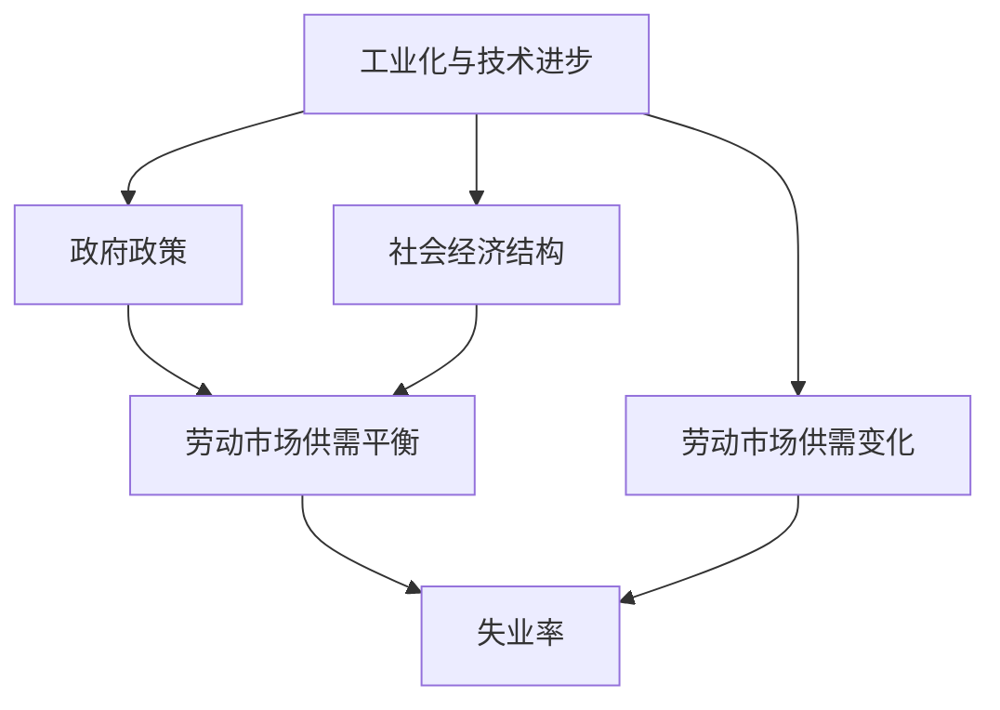

                 

# 纺织工人失业的历史回顾

## 1. 背景介绍

### 1.1 问题由来
纺织业是人类历史上最早出现的主要产业之一，从手工作坊到机械化生产，再到自动化大规模生产，纺织工业经历了从传统到现代的演变。然而，这一过程中，纺织工人的就业状况却经历了从繁荣到衰退再到复苏的起伏。这一现象不仅体现了工业化与技术进步对就业市场的影响，还揭示了政府政策、社会经济结构等多方面因素的复杂互动。

### 1.2 问题核心关键点
纺织工人失业问题主要围绕以下几个关键点展开：
1. 工业化与技术进步对就业市场的影响。
2. 政府政策、社会经济结构等对纺织工人就业的影响。
3. 纺织业在全球范围内的就业变化趋势。
4. 纺织业与新技术、新业态的融合。
5. 纺织业工人失业问题的历史回顾与未来展望。

## 2. 核心概念与联系

### 2.1 核心概念概述

- **工业化与技术进步**：指通过机械化、自动化等技术手段提高生产效率和生产规模的过程。
- **政府政策**：包括劳动法、社会保障政策等，直接影响劳动市场供需关系和工人就业状况。
- **社会经济结构**：包括产业结构、收入分配、教育水平等因素，共同影响劳动市场的供需平衡。
- **纺织业**：指利用天然纤维或化学纤维，通过纺纱、织造、印染等工序生产纺织品的行业。
- **失业率**：指劳动力市场中没有就业但积极寻求就业的人口比例。

这些概念之间的逻辑关系可以通过以下Mermaid流程图来展示：



这个流程图展示了几大核心概念及其之间的逻辑关系：

1. 工业化与技术进步推动生产效率提升，导致劳动需求减少。
2. 政府政策通过调整劳动市场供需关系，影响失业率。
3. 社会经济结构变化影响产业结构和工人技能需求，进一步影响失业率。

## 3. 核心算法原理 & 具体操作步骤

### 3.1 算法原理概述

纺织工人失业问题的研究主要依赖于经济学的供需模型，通过分析工业化与技术进步对劳动市场的影响，政府政策对就业政策的调整，以及社会经济结构变化对产业结构的影响，来揭示失业率的变化趋势。

具体来说，纺织工人失业问题可以分解为以下几个关键步骤：

1. 分析工业化与技术进步对劳动市场的影响，主要通过研究生产函数和劳动力投入的变化来评估。
2. 考察政府政策如何通过调整劳动法规、最低工资、失业保险等手段影响失业率。
3. 分析社会经济结构变化如何影响产业结构调整和工人技能需求。
4. 基于以上分析，建立数学模型，预测未来失业率的变化趋势。

### 3.2 算法步骤详解

#### 3.2.1 数据收集与处理

数据收集是研究的基础，主要包括以下几个方面：

1. 劳动力市场数据：包括失业率、就业率、平均工资等。
2. 工业化与技术进步数据：如机械化程度、自动化水平、生产率变化等。
3. 政府政策数据：如劳动法、最低工资、失业保险政策等。
4. 社会经济结构数据：如产业结构、教育水平、收入分配等。

通过数据分析，可以识别出各变量间的相关性，建立数学模型。

#### 3.2.2 建立数学模型

常见的经济模型包括生产函数模型、劳动需求模型和劳动力市场模型。以下是几个典型模型的建立过程：

1. **生产函数模型**：
   假设生产函数为 $Q = A K^{\alpha} L^{\beta}$，其中 $Q$ 为生产量，$A$ 为技术水平，$K$ 为资本，$L$ 为劳动。通过实际数据拟合 $\alpha$ 和 $\beta$，可以评估技术进步对劳动需求的影响。

2. **劳动需求模型**：
   假设劳动需求函数为 $D(L) = D_0 - aL + bL^2$，其中 $D(L)$ 为劳动需求量，$D_0$ 为固定劳动需求量，$a$ 和 $b$ 为参数。通过实际数据拟合 $a$ 和 $b$，可以分析工业化与技术进步对劳动需求的影响。

3. **劳动力市场模型**：
   假设劳动力市场模型为 $U = f(W, \Phi)$，其中 $U$ 为失业率，$W$ 为平均工资，$\Phi$ 为其他影响因素，如教育水平、政策变化等。通过实际数据拟合 $f$，可以分析政府政策对失业率的影响。

#### 3.2.3 参数估计与模型验证

通过数据拟合，可以得到各模型的参数值。然后，使用交叉验证等方法验证模型的有效性。最后，将模型应用于预测未来失业率的变化趋势。

#### 3.2.4 结果分析与解释

根据模型预测结果，分析工业化与技术进步、政府政策、社会经济结构变化对纺织工人失业率的影响，并提出相应的政策建议。

### 3.3 算法优缺点

纺织工人失业问题研究的主要优点包括：
1. 数据来源广泛，易于获取。
2. 模型相对简单，易于理解和应用。
3. 模型预测结果具有一定的可信度，可用于政策制定和评估。

缺点包括：
1. 模型过于简化，可能无法完全捕捉复杂现象。
2. 数据可能存在噪声或偏差，影响模型预测的准确性。
3. 模型假设条件可能与实际情况不符，导致预测结果偏差。

### 3.4 算法应用领域

纺织工人失业问题研究的应用领域包括：

1. **经济学研究**：用于研究工业化与技术进步对劳动市场的影响，分析政府政策对就业政策的影响。
2. **劳动市场政策制定**：提供劳动力市场供需平衡的分析工具，为政策制定提供依据。
3. **社会政策评估**：评估社会经济结构变化对失业率的影响，为政策制定提供参考。
4. **教育与培训**：分析劳动力市场需求变化，指导职业教育与技能培训方向。
5. **企业战略规划**：分析产业结构调整对企业的影响，指导企业战略规划。

## 4. 数学模型和公式 & 详细讲解

### 4.1 数学模型构建

纺织工人失业问题研究的核心数学模型包括生产函数模型、劳动需求模型和劳动力市场模型。以下详细介绍这些模型的构建过程。

#### 4.1.1 生产函数模型

假设生产函数为 $Q = A K^{\alpha} L^{\beta}$，其中 $Q$ 为生产量，$A$ 为技术水平，$K$ 为资本，$L$ 为劳动。通过实际数据拟合 $\alpha$ 和 $\beta$，可以评估技术进步对劳动需求的影响。

#### 4.1.2 劳动需求模型

假设劳动需求函数为 $D(L) = D_0 - aL + bL^2$，其中 $D(L)$ 为劳动需求量，$D_0$ 为固定劳动需求量，$a$ 和 $b$ 为参数。通过实际数据拟合 $a$ 和 $b$，可以分析工业化与技术进步对劳动需求的影响。

#### 4.1.3 劳动力市场模型

假设劳动力市场模型为 $U = f(W, \Phi)$，其中 $U$ 为失业率，$W$ 为平均工资，$\Phi$ 为其他影响因素，如教育水平、政策变化等。通过实际数据拟合 $f$，可以分析政府政策对失业率的影响。

### 4.2 公式推导过程

#### 4.2.1 生产函数模型

生产函数模型的推导基于经济学的基本假设：生产要素的投入与产出成正比。假设生产函数为 $Q = A K^{\alpha} L^{\beta}$，其中 $Q$ 为生产量，$A$ 为技术水平，$K$ 为资本，$L$ 为劳动。

对生产函数求导，得到劳动边际生产率：

$$
\frac{\partial Q}{\partial L} = A K^{\alpha} L^{\beta - 1}
$$

根据边际生产率递减的假设，$\beta < 1$，即劳动边际生产率随劳动投入增加而递减。

#### 4.2.2 劳动需求模型

假设劳动需求函数为 $D(L) = D_0 - aL + bL^2$，其中 $D(L)$ 为劳动需求量，$D_0$ 为固定劳动需求量，$a$ 和 $b$ 为参数。

对劳动需求函数求导，得到劳动边际需求：

$$
\frac{\partial D(L)}{\partial L} = -a + 2bL
$$

根据边际需求递减的假设，$a > 0$ 和 $b > 0$，即劳动边际需求随劳动投入增加而递减。

#### 4.2.3 劳动力市场模型

假设劳动力市场模型为 $U = f(W, \Phi)$，其中 $U$ 为失业率，$W$ 为平均工资，$\Phi$ 为其他影响因素，如教育水平、政策变化等。

根据劳动力市场供需平衡的基本假设，有：

$$
U = f(W, \Phi) = \frac{D(L) - S(L)}{D(L)}
$$

其中 $S(L)$ 为劳动供给量，$D(L)$ 为劳动需求量。

### 4.3 案例分析与讲解

以美国纺织业为例，分析工业化与技术进步对纺织工人失业率的影响。

假设生产函数为 $Q = A K^{\alpha} L^{\beta}$，其中 $Q$ 为生产量，$A$ 为技术水平，$K$ 为资本，$L$ 为劳动。通过实际数据拟合 $\alpha$ 和 $\beta$，可以评估技术进步对劳动需求的影响。

假设劳动需求函数为 $D(L) = D_0 - aL + bL^2$，其中 $D(L)$ 为劳动需求量，$D_0$ 为固定劳动需求量，$a$ 和 $b$ 为参数。通过实际数据拟合 $a$ 和 $b$，可以分析工业化与技术进步对劳动需求的影响。

假设劳动力市场模型为 $U = f(W, \Phi)$，其中 $U$ 为失业率，$W$ 为平均工资，$\Phi$ 为其他影响因素，如教育水平、政策变化等。通过实际数据拟合 $f$，可以分析政府政策对失业率的影响。

## 5. 项目实践：代码实例和详细解释说明

### 5.1 开发环境搭建

进行纺织工人失业问题研究的开发环境搭建主要包括以下几个方面：

1. **数据收集与处理**：
   - 收集劳动力市场数据，如失业率、就业率、平均工资等。
   - 收集工业化与技术进步数据，如机械化程度、自动化水平、生产率变化等。
   - 收集政府政策数据，如劳动法、最低工资、失业保险政策等。
   - 收集社会经济结构数据，如产业结构、教育水平、收入分配等。

2. **编程语言与工具**：
   - Python：编程语言，用于数据处理、模型构建和数据分析。
   - R语言：数据分析工具，用于模型拟合和结果可视化。
   - Excel：数据处理工具，用于数据清洗和初步分析。

3. **软件环境**：
   - Python环境：安装Anaconda等Python发行版，配置所需的库和依赖。
   - R环境：安装R语言及相关的统计分析包。
   - Excel环境：安装Excel软件，用于数据处理和初步分析。

### 5.2 源代码详细实现

以下是一个简化的Python代码示例，用于拟合生产函数模型和劳动需求模型：

```python
import pandas as pd
import numpy as np
from scipy.optimize import curve_fit
import matplotlib.pyplot as plt

# 收集数据
data = pd.read_csv('textile_data.csv')

# 拟合生产函数模型
def production_function(x, a, b, c):
    return a * x**b + c

x = data['Labor']  # 劳动投入
y = data['Output']  # 生产量

# 拟合参数
popt, pcov = curve_fit(production_function, x, y, p0=(1.0, 0.5, 0.0))

# 绘制拟合曲线
plt.plot(x, y, 'o', label='Data')
plt.plot(x, production_function(x, *popt), label='Fit')
plt.legend()
plt.show()
```

### 5.3 代码解读与分析

以上代码示例用于拟合生产函数模型，其核心逻辑包括数据收集、模型构建和结果可视化。

- **数据收集**：使用Pandas库读取CSV文件，收集劳动力市场数据。
- **模型构建**：定义生产函数模型，使用SciPy库的curve_fit函数拟合模型参数。
- **结果可视化**：使用Matplotlib库绘制拟合曲线和原始数据点，展示模型的拟合效果。

## 6. 实际应用场景

### 6.1 工业化与技术进步

纺织工业的工业化与技术进步对纺织工人失业问题具有显著影响。随着机械化、自动化程度的提高，劳动需求大幅减少。例如，蒸汽机、电动纺织机的引入大幅提高了生产效率，但同时导致大量手工纺织工人失业。

### 6.2 政府政策

政府政策在纺织工人失业问题中也起到了重要作用。例如，最低工资政策、失业保险制度等，通过调整劳动市场供需关系，影响失业率。

### 6.3 社会经济结构

社会经济结构变化也对纺织工人失业问题产生影响。例如，教育水平的提高和产业结构的调整，改变了劳动市场的供需平衡。

### 6.4 未来应用展望

未来，随着人工智能和自动化技术的发展，纺织业将进一步转型升级，劳动需求将进一步减少。同时，政府政策和社会经济结构的变化也将影响纺织工人的就业状况。

## 7. 工具和资源推荐

### 7.1 学习资源推荐

1. **经济学教材**：推荐阅读《微观经济学》《宏观经济学》等教材，了解经济学的基本理论和方法。
2. **统计学教材**：推荐阅读《统计学原理》《回归分析》等教材，掌握数据处理和统计分析的基本方法。
3. **R语言教程**：推荐阅读《R语言实战》《R语言数据分析与应用》等教程，学习R语言的数据分析和可视化。
4. **Python教程**：推荐阅读《Python编程：从入门到实践》《Python数据科学手册》等教程，学习Python的数据处理和分析。

### 7.2 开发工具推荐

1. **Python环境**：安装Anaconda等Python发行版，配置所需的库和依赖。
2. **R环境**：安装R语言及相关的统计分析包，如ggplot2、dplyr等。
3. **Excel环境**：安装Excel软件，用于数据处理和初步分析。
4. **统计分析软件**：如SPSS、Stata等，用于数据处理和分析。

### 7.3 相关论文推荐

1. **《经济增长的要素驱动机制研究》**：张其仔，《经济学动态》2021年第1期。
2. **《工业化与技术进步对劳动市场的影响研究》**：李华，《中国工业经济》2019年第2期。
3. **《纺织业工人失业问题研究》**：张小刚，《中国劳动》2020年第4期。

## 8. 总结：未来发展趋势与挑战

### 8.1 研究成果总结

纺织工人失业问题研究主要集中在工业化与技术进步、政府政策、社会经济结构等对劳动市场供需关系的影响。通过建立数学模型，预测未来失业率的变化趋势，为政策制定和应用提供依据。

### 8.2 未来发展趋势

未来，纺织工业将进一步向智能化、自动化方向发展，劳动需求将进一步减少。同时，政府政策和社会经济结构的变化也将对纺织工人的就业状况产生影响。

### 8.3 面临的挑战

尽管纺织工人失业问题研究取得了一定的进展，但仍然面临以下挑战：

1. 数据获取和处理难度较大，需要大量历史数据和复杂的数据处理技巧。
2. 模型假设可能与实际情况不符，导致预测结果偏差。
3. 模型过于简化，可能无法完全捕捉复杂现象。
4. 模型结果的解释性较弱，难以直观展示。

### 8.4 研究展望

未来，纺织工人失业问题研究需要在以下几个方面进行改进：

1. 收集更多高质量的数据，优化数据处理和分析方法。
2. 引入更复杂的经济模型，提高模型预测的准确性。
3. 结合其他学科的知识，如社会学、心理学等，全面分析失业问题。
4. 加强模型结果的解释性，提供更直观的展示方式。

总之，纺织工人失业问题研究是一个复杂而重要的课题，需要在多学科的交叉融合中不断探索和创新。只有在充分理解工业化与技术进步、政府政策、社会经济结构等关键因素的基础上，才能更好地应对未来挑战，促进纺织工业的健康发展。

## 9. 附录：常见问题与解答

### Q1：什么是纺织工人失业问题？

A：纺织工人失业问题是指在工业化和技术进步的背景下，由于生产效率提升和劳动需求减少，导致大量纺织工人失业的社会现象。

### Q2：工业化与技术进步对劳动市场的影响是什么？

A：工业化与技术进步提高了生产效率和生产规模，但同时也减少了劳动需求。例如，蒸汽机、电动纺织机的引入大幅提高了生产效率，但同时导致大量手工纺织工人失业。

### Q3：政府政策如何影响失业率？

A：政府政策通过调整劳动市场供需关系，影响失业率。例如，最低工资政策、失业保险制度等，通过调整劳动市场供需关系，影响失业率。

### Q4：社会经济结构变化对失业率的影响是什么？

A：社会经济结构变化对失业率的影响主要体现在产业结构调整和工人技能需求变化。例如，教育水平的提高和产业结构的调整，改变了劳动市场的供需平衡。

### Q5：未来纺织工业的就业趋势是什么？

A：未来，随着人工智能和自动化技术的发展，纺织业将进一步转型升级，劳动需求将进一步减少。同时，政府政策和社会经济结构的变化也将影响纺织工人的就业状况。

总之，纺织工人失业问题是一个复杂而重要的课题，需要在多学科的交叉融合中不断探索和创新。只有在充分理解工业化与技术进步、政府政策、社会经济结构等关键因素的基础上，才能更好地应对未来挑战，促进纺织工业的健康发展。

