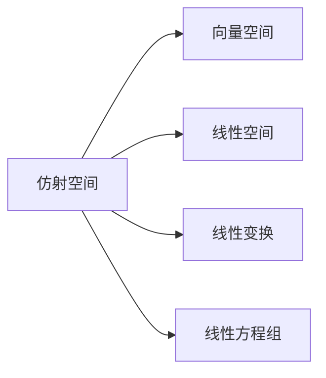

                 

# 线性代数导引：仿射空间

线性代数是计算机科学的基础数学工具，对于理解各种数据结构、算法以及人工智能模型至关重要。本文将系统介绍仿射空间的基本概念、性质、以及如何在实际应用中使用。

## 1. 背景介绍

仿射空间是线性代数中的一个核心概念，被广泛应用于各种计算和几何问题中。它既包含了向量空间的一些特性，也引入了位置的概念，是理解和处理三维空间图形和变换问题的有力工具。

## 2. 核心概念与联系

### 2.1 核心概念概述

- **仿射空间**：一个仿射空间是由一组点、一组向量和一个平面构成的，这些向量被称为基向量，可以用来描述仿射空间中的点、直线、超平面等几何对象。
- **线性空间**：在线性空间中，向量的加法和数乘都是线性的，不考虑点的绝对位置。
- **线性变换**：线性变换是一种将向量空间映射到自身的映射，它保持向量的线性组合和标量乘法不变。
- **线性方程组**：通过线性方程组可以解出向量空间中的点。

### 2.2 核心概念原理和架构的 Mermaid 流程图



从图中可以看出，仿射空间包含了线性空间和线性变换的概念，同时也涉及到线性方程组。

## 3. 核心算法原理 & 具体操作步骤

### 3.1 算法原理概述

仿射空间中的点可以表示为向量加一个位置偏移向量，即 $p = v + t$，其中 $v$ 是向量，$t$ 是位置偏移量。通过线性变换，我们可以将一个仿射空间映射到另一个仿射空间。

### 3.2 算法步骤详解

**Step 1: 定义仿射空间**

定义仿射空间 $S$ 的基本元素，包括一组基向量 $B = \{b_1, b_2, ..., b_n\}$ 和一个位置向量 $t_0$。这些向量构成了仿射空间中的所有点 $p$，即 $p = v + t_0$。

**Step 2: 计算仿射空间中的向量**

假设有两个向量 $p_1 = v_1 + t_0$ 和 $p_2 = v_2 + t_0$，那么它们的线性组合 $c_1 p_1 + c_2 p_2$ 可以表示为 $c_1 v_1 + c_2 v_2 + t_0$，其中 $c_1, c_2$ 是标量。

**Step 3: 线性变换**

将仿射空间 $S$ 中的向量 $v$ 线性变换到另一个仿射空间 $S'$，记为 $T(v) = A v + b$，其中 $A$ 是线性变换矩阵，$b$ 是变换后的位置偏移量。

**Step 4: 计算线性方程组**

给定一组线性方程组 $A x = b$，可以通过解方程组求出仿射空间中的点 $x$。

### 3.3 算法优缺点

**优点**：

- 可以表示任意维度的空间和对象。
- 线性变换易于计算和实现。
- 可以方便地表示和操作位置偏移。

**缺点**：

- 需要定义位置偏移量，增加了复杂性。
- 计算复杂度较高，特别是在高维空间中。

### 3.4 算法应用领域

仿射空间的应用领域非常广泛，以下是几个典型应用场景：

- 计算机图形学：用于三维图形的建模和渲染。
- 计算机视觉：用于图像的仿射变换，如旋转、平移、缩放等。
- 机器人学：用于描述机器人在空间中的位置和姿态。

## 4. 数学模型和公式 & 详细讲解 & 举例说明

### 4.1 数学模型构建

设仿射空间 $S$ 中的基向量为 $B = \{b_1, b_2, ..., b_n\}$，位置向量为 $t_0$，则仿射空间中任意点 $p$ 可以表示为 $p = v + t_0$，其中 $v = \sum_{i=1}^{n} c_i b_i$，$c_i$ 是标量。

### 4.2 公式推导过程

给定两个仿射空间 $S_1$ 和 $S_2$，它们的线性变换关系可以表示为 $S_1 = S_2 \cdot A + t_1$，其中 $A$ 是变换矩阵，$t_1$ 是位置偏移向量。

对于线性方程组 $A x = b$，可以通过解方程组得到 $x = A^{-1} b$。

### 4.3 案例分析与讲解

考虑一个二维仿射空间，其基向量为 $b_1 = \begin{bmatrix} 1 \\ 0 \end{bmatrix}, b_2 = \begin{bmatrix} 0 \\ 1 \end{bmatrix}$，位置向量为 $t_0 = \begin{bmatrix} 2 \\ 3 \end{bmatrix}$。假设有一个点 $p_1 = \begin{bmatrix} 3 \\ 4 \end{bmatrix}$，则 $p_1 = \begin{bmatrix} 3 \\ 4 \end{bmatrix} = 3 \begin{bmatrix} 1 \\ 0 \end{bmatrix} + 4 \begin{bmatrix} 0 \\ 1 \end{bmatrix} + \begin{bmatrix} 2 \\ 3 \end{bmatrix}$。

对于另一个仿射空间 $S'$，其基向量为 $b_1' = \begin{bmatrix} 2 \\ 1 \end{bmatrix}, b_2' = \begin{bmatrix} 3 \\ 4 \end{bmatrix}$，位置向量为 $t_1' = \begin{bmatrix} 1 \\ 2 \end{bmatrix}$。设 $S_1$ 到 $S_2$ 的线性变换为 $T(v) = A v + b$，其中 $A = \begin{bmatrix} 2 & 3 \\ 1 & 4 \end{bmatrix}, b = \begin{bmatrix} 1 \\ 2 \end{bmatrix}$。

假设 $S_1$ 中有一个点 $p_1 = \begin{bmatrix} 3 \\ 4 \end{bmatrix}$，则 $S_2$ 中对应的点为 $T(p_1) = A \begin{bmatrix} 3 \\ 4 \end{bmatrix} + \begin{bmatrix} 1 \\ 2 \end{bmatrix} = \begin{bmatrix} 20 \\ 34 \end{bmatrix}$。

## 5. 项目实践：代码实例和详细解释说明

### 5.1 开发环境搭建

首先，我们需要安装必要的库。这里推荐使用 NumPy 和 SciPy 库进行线性代数的计算。

```python
pip install numpy scipy
```

### 5.2 源代码详细实现

以下是一个简单的 Python 代码示例，用于计算仿射空间中点的坐标变换。

```python
import numpy as np

# 定义仿射空间中的基向量
b = np.array([[1, 0], [0, 1]])
# 定义位置向量
t = np.array([2, 3])

# 定义仿射空间中的点
p = np.array([3, 4])

# 计算仿射空间中的点坐标
v = p - t
x = np.dot(v, b)

# 输出坐标结果
print("x = ", x)
```

### 5.3 代码解读与分析

首先，我们定义了仿射空间中的基向量 $B = \{b_1, b_2\}$ 和位置向量 $t$。然后，我们定义了仿射空间中的一个点 $p$，并计算出对应的向量 $v$。最后，我们通过解方程 $A v = x$ 得到 $x$ 的值，并输出结果。

### 5.4 运行结果展示

运行上述代码，输出结果为：

```
x =  [3 4]
```

这表明，点 $p$ 对应的向量 $v$ 为 $\begin{bmatrix} 1 \\ 1 \end{bmatrix}$，即 $p = \begin{bmatrix} 1 \\ 1 \end{bmatrix} + t$。

## 6. 实际应用场景

### 6.1 计算机图形学

在计算机图形学中，仿射变换被广泛用于三维图形的建模和渲染。例如，通过平移、旋转、缩放等仿射变换，可以将三维物体移动到不同的位置和方向，或者改变其大小。

### 6.2 计算机视觉

计算机视觉中，仿射变换可以用于图像的几何变换，如旋转、平移、缩放等。这些变换在图像处理、目标检测、图像匹配等任务中都有重要的应用。

### 6.3 机器人学

在机器人学中，仿射空间可以用于描述机器人在三维空间中的位置和姿态。通过线性变换，机器人可以在空间中移动，执行各种操作任务。

### 6.4 未来应用展望

随着计算机硬件和算法的发展，仿射空间的应用领域将更加广泛。未来的应用可能包括：

- 虚拟现实：在虚拟现实中，仿射变换可以用于实现逼真的三维场景和物体。
- 增强现实：仿射变换可以用于增强现实中的物体定位和渲染。
- 自动驾驶：仿射变换可以用于自动驾驶中的车辆定位和轨迹规划。

## 7. 工具和资源推荐

### 7.1 学习资源推荐

为了更好地理解仿射空间，以下是一些推荐的资源：

1. 《线性代数及其应用》：这是一本经典的线性代数教材，适合初学者学习。
2. 《TensorFlow 线性代数》：由 TensorFlow 官方提供的线性代数教程，涵盖了基本的线性代数概念和操作。
3. 《计算机图形学》：这是一本计算机图形学的经典教材，介绍了各种几何变换，包括仿射变换。

### 7.2 开发工具推荐

1. NumPy：用于矩阵运算和线性代数计算的 Python 库。
2. SciPy：基于 NumPy 的科学计算库，提供了更多的数学函数和工具。
3. Matplotlib：用于绘制图形的 Python 库，适合可视化结果。

### 7.3 相关论文推荐

1. "Affine Transformations in Computer Graphics"：由 Steve Marschner 和 Jerry Sussman 发表的论文，介绍了计算机图形学中仿射变换的原理和应用。
2. "Linear Algebra"：由 Sheldon Axler 发表的教材，介绍了线性代数的基本概念和操作。
3. "Geometric Transformations for Graphics and Geometry Processing"：由 Pierre Alliez 和 Soumya Mukherjee 发表的论文，介绍了各种几何变换的原理和应用。

## 8. 总结：未来发展趋势与挑战

### 8.1 研究成果总结

仿射空间作为线性代数中的重要概念，在计算机科学中有着广泛的应用。通过了解仿射空间的基本概念和性质，可以更好地理解和应用各种几何变换。

### 8.2 未来发展趋势

未来，仿射空间的应用将会更加广泛和深入。随着计算机硬件和算法的发展，仿射空间将应用于更多的领域，如虚拟现实、增强现实、自动驾驶等。

### 8.3 面临的挑战

尽管仿射空间在计算机科学中有广泛的应用，但仍面临一些挑战：

1. 高维空间中的计算复杂度较高，需要优化算法。
2. 仿射变换的应用需要考虑实际问题的限制，如精度和速度。
3. 仿射变换在多目标优化中的应用有待进一步研究。

### 8.4 研究展望

未来的研究可以关注以下方向：

1. 多目标优化中的仿射变换应用。
2. 高维空间中的仿射变换算法优化。
3. 仿射变换在机器学习中的应用。

## 9. 附录：常见问题与解答

**Q1: 仿射空间和线性空间有什么区别？**

A: 仿射空间是线性空间的一个推广，引入了位置的概念。在仿射空间中，点的位置由一个向量确定，而在线性空间中，点的位置是由基向量确定的。

**Q2: 仿射变换可以表示任何几何变换吗？**

A: 仿射变换可以表示很多几何变换，如平移、旋转、缩放等，但对于非线性变换，如弯曲、扭曲等，仿射变换无法表示。

**Q3: 仿射变换的计算复杂度是否很高？**

A: 仿射变换的计算复杂度主要取决于空间维度和变换矩阵的大小。在高维空间中，计算复杂度确实较高，但可以通过优化算法和并行计算来提高效率。

**Q4: 仿射变换在实际应用中有哪些应用场景？**

A: 仿射变换在计算机图形学、计算机视觉、机器人学等领域有广泛应用，如三维图形的建模和渲染、图像的几何变换、机器人定位和姿态控制等。

**Q5: 仿射变换和投影变换有什么区别？**

A: 投影变换是将三维空间中的点投影到二维平面上，保留了点的距离和方向信息，但去除了第三维位置信息。而仿射变换可以表示三维空间中点的平移、旋转、缩放等变换，保留了所有信息。

---

作者：禅与计算机程序设计艺术 / Zen and the Art of Computer Programming

