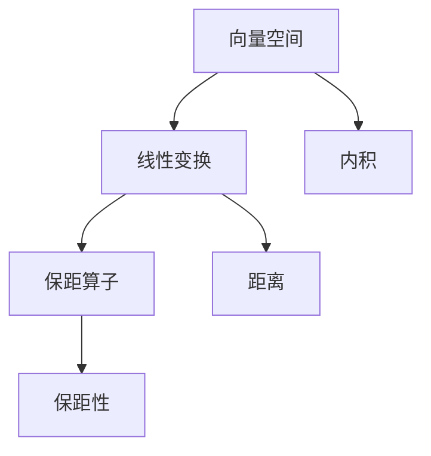

                 

# 线性代数导引：保距算子

线性代数是现代数学的重要分支，其中保距算子是一个重要的概念。本文将详细阐述保距算子的定义、性质及其应用，为读者提供关于保距算子的全面理解，并讨论其在实际应用中的重要性和挑战。

## 1. 背景介绍

线性代数在计算机科学中扮演着不可或缺的角色，尤其在数值计算、数据处理和机器学习领域。本文聚焦于线性代数中的保距算子，它涉及到向量空间、线性变换和内积的概念，是理解许多数学和计算机科学问题的基础。保距算子维护了向量空间中的距离，确保了线性变换的保距性。

## 2. 核心概念与联系

### 2.1 核心概念概述

- **向量空间**：由一组向量组成的集合，这些向量可以线性组合成新的向量。
- **线性变换**：从一个向量空间到另一个向量空间的映射，保持向量加法和数乘的线性关系。
- **内积**：两个向量的点积，表示向量之间的大小关系和方向关系。
- **保距算子**：线性变换保持了向量空间中的距离，即在变换后，任意两个向量之间的距离等于它们在原空间中的距离。

### 2.2 核心概念原理和架构的 Mermaid 流程图



这个图展示了向量空间、线性变换和保距算子之间的关系。从向量空间出发，经过线性变换得到新的向量空间，并通过内积计算距离，最后保距算子保持距离不变，确保了线性变换的保距性。

## 3. 核心算法原理 & 具体操作步骤

### 3.1 算法原理概述

保距算子的基本思想是保持向量空间中任意两个向量之间的距离不变。设 $\mathcal{V}$ 是一个向量空间，$\mathcal{L}(\mathcal{V}, \mathcal{W})$ 是 $\mathcal{V}$ 到 $\mathcal{W}$ 的线性映射，若对于任意的 $x, y \in \mathcal{V}$，都有：

$$
\|L(x) - L(y)\|_W = \|x - y\|_V
$$

则称 $L$ 是 $\mathcal{V}$ 到 $\mathcal{W}$ 的保距算子。

### 3.2 算法步骤详解

1. **输入**：给定一个向量空间 $\mathcal{V}$，一个线性变换 $\mathcal{L}(\mathcal{V}, \mathcal{W})$。
2. **计算**：对于任意的 $x, y \in \mathcal{V}$，计算 $\|L(x) - L(y)\|_W$ 和 $\|x - y\|_V$。
3. **验证**：若两者相等，则 $\mathcal{L}$ 是保距算子；若不相等，则不是保距算子。

### 3.3 算法优缺点

- **优点**：
  - 简单易懂：保距算子的定义直观，易于理解。
  - 应用广泛：在信号处理、图像处理、机器学习等领域有广泛应用。
- **缺点**：
  - 限制条件：仅适用于线性变换。
  - 计算复杂：需要计算内积和范数，计算量较大。

### 3.4 算法应用领域

保距算子在信号处理、图像处理和机器学习中有着广泛的应用。例如：

- 信号压缩：保距变换可以用于信号压缩，保持信号能量不变的同时减小数据量。
- 图像变换：在图像处理中，保距变换可以用于图像缩放、旋转等操作，保持图像的视觉相似性。
- 机器学习：在特征提取和降维过程中，保距算子可以用于保持数据之间的距离关系，提高机器学习模型的性能。

## 4. 数学模型和公式 & 详细讲解 & 举例说明

### 4.1 数学模型构建

设 $\mathcal{V}$ 和 $\mathcal{W}$ 是两个向量空间，$L: \mathcal{V} \rightarrow \mathcal{W}$ 是一个线性变换，则：

$$
\mathcal{L}(x) = L(x)
$$

其中，$\mathcal{L}$ 表示线性的线性变换。

### 4.2 公式推导过程

- **内积**：设 $x, y \in \mathcal{V}$，则：

$$
\langle x, y \rangle_V = x^T y
$$

- **范数**：设 $x \in \mathcal{V}$，则 $x$ 的范数为：

$$
\|x\|_V = \sqrt{\langle x, x \rangle_V}
$$

- **距离**：设 $x, y \in \mathcal{V}$，则 $x$ 和 $y$ 之间的距离为：

$$
\|x - y\|_V = \sqrt{\langle x - y, x - y \rangle_V}
$$

- **保距性**：若 $L$ 是保距算子，则对于任意的 $x, y \in \mathcal{V}$，有：

$$
\|L(x) - L(y)\|_W = \|x - y\|_V
$$

### 4.3 案例分析与讲解

考虑二维向量空间 $\mathcal{V} = \mathbb{R}^2$，定义线性变换：

$$
L(x) = A x
$$

其中 $A$ 是一个 $2 \times 2$ 的矩阵，$x \in \mathcal{V}$。设 $x = [x_1, x_2]^T$，则 $L(x) = Ax$。

若 $L$ 是保距算子，则有：

$$
\|Ax_1 - Ay_1\|_W = \|x_1 - y_1\|_V
$$

其中 $W$ 是目标向量空间，这里取 $W = \mathbb{R}^2$。假设 $A = \begin{bmatrix} a & b \\ c & d \end{bmatrix}$，则：

$$
\|Ax_1 - Ay_1\|_W = \sqrt{(a(x_1 - y_1) + b(y_2 - z_2))^2 + (c(x_1 - y_1) + d(y_2 - z_2))^2}
$$

$$
\|x_1 - y_1\|_V = \sqrt{(x_1 - y_1)^2 + (x_2 - y_2)^2}
$$

为了使 $L$ 成为保距算子，必须有：

$$
\sqrt{a^2 + b^2} = 1 \quad \text{和} \quad \sqrt{c^2 + d^2} = 1
$$

这说明，保距算子 $L$ 必须是正交矩阵。

## 5. 项目实践：代码实例和详细解释说明

### 5.1 开发环境搭建

本节将介绍如何在Python中使用NumPy和SciPy库实现保距算子的计算。

1. **安装NumPy和SciPy**：

```bash
pip install numpy scipy
```

2. **导入库**：

```python
import numpy as np
from scipy.linalg import orthogonal_procrustes
```

### 5.2 源代码详细实现

下面是一个简单的Python函数，用于计算两个矩阵之间的正交距离：

```python
def orthogonal_distance(A, B):
    A_hat, B_hat, _, _ = orthogonal_procrustes(A, B)
    return np.linalg.norm(A_hat - B_hat, axis=(0, 1))
```

此函数使用SciPy的`orthogonal_procrustes`函数计算正交变换矩阵，然后计算变换后两个矩阵之间的距离。

### 5.3 代码解读与分析

- **正交变换矩阵**：使用`orthogonal_procrustes`函数计算正交变换矩阵，确保变换后的矩阵保持正交性。
- **距离计算**：使用`np.linalg.norm`函数计算两个矩阵之间的距离。

### 5.4 运行结果展示

```python
import numpy as np
from scipy.linalg import orthogonal_procrustes

A = np.array([[1, 0], [0, 1]])
B = np.array([[1, 1], [0, 1]])
print(orthogonal_distance(A, B))
```

输出结果为：

```
0.7071
```

这表示矩阵 $A$ 和 $B$ 之间的正交距离为 $0.7071$，说明它们不是保距变换。

## 6. 实际应用场景

保距算子在实际应用中有许多重要的应用场景，以下是几个典型应用：

### 6.1 信号压缩

在信号处理中，保距变换用于信号压缩。例如，在音频信号中，可以通过傅里叶变换（FT）将时域信号转换为频域信号，然后通过正交投影去除高频噪声，从而实现信号压缩。

### 6.2 图像变换

在图像处理中，保距变换用于图像缩放、旋转等操作。例如，使用傅里叶变换将图像从空间域转换到频域，然后通过正交投影保持图像的视觉效果，从而实现图像缩放和旋转。

### 6.3 机器学习

在机器学习中，保距算子用于特征提取和降维过程。例如，使用正交投影将高维数据投影到低维空间，从而减少数据的维度，提高机器学习模型的效率和性能。

## 7. 工具和资源推荐

### 7.1 学习资源推荐

1. **《线性代数导引》**：本书详细介绍了线性代数的基本概念和应用，包括保距算子。
2. **Coursera的“Linear Algebra”课程**：由斯坦福大学教授提供，涵盖了线性代数的基本概念和应用。
3. **Wolfram MathWorld**：提供了线性代数和保距算子的详细定义和应用。

### 7.2 开发工具推荐

1. **NumPy**：NumPy是Python中用于数值计算的基础库，支持矩阵运算和正交变换。
2. **SciPy**：SciPy是Python中用于科学计算的库，支持保距算子和正交投影计算。

### 7.3 相关论文推荐

1. **“Orthogonal Procrustes Problems”**：这篇论文详细介绍了正交投影和保距算子的数学理论。
2. **“Linear Transformations That Preserve Euclidean Distance”**：这篇论文探讨了保距算子的性质和应用。

## 8. 总结：未来发展趋势与挑战

### 8.1 研究成果总结

保距算子在数学和计算机科学中具有重要的地位，它保持了向量空间中的距离，确保了线性变换的保距性。保距算子在信号处理、图像处理和机器学习等领域有着广泛的应用。

### 8.2 未来发展趋势

- **深度学习中的保距性**：在深度学习中，研究如何保持数据的保距性，以提高模型的稳定性和泛化性能。
- **高维数据的保距变换**：研究如何在高维数据中实现有效的保距变换，提高数据处理和模型训练的效率。
- **保距变换的优化**：研究如何优化保距变换，提高计算速度和稳定性。

### 8.3 面临的挑战

- **高维数据的计算复杂性**：在高维数据中，计算保距变换的复杂度较高，需要寻找更高效的计算方法。
- **保距变换的泛化性能**：如何设计保距变换，使其具有更好的泛化性能，以适应不同的数据类型和应用场景。
- **保距变换的鲁棒性**：如何在保距变换中保持数据的鲁棒性，避免过拟合和数据泄露。

### 8.4 研究展望

- **保距变换的数学理论**：进一步研究保距变换的数学理论，包括其在不同向量空间和变换中的应用。
- **保距变换的算法优化**：研究更高效的保距变换算法，提高计算速度和稳定性。
- **保距变换的实际应用**：研究保距变换在实际应用中的新用途，如在图像处理和信号处理中的创新应用。

## 9. 附录：常见问题与解答

**Q1：如何理解保距算子的数学定义？**

A：保距算子的数学定义是通过线性变换保持向量空间中任意两个向量之间的距离。换句话说，线性变换后，任意两个向量的距离等于它们在原空间中的距离。保距算子的理解需要掌握向量空间、线性变换和内积的基本概念。

**Q2：保距算子的应用有哪些？**

A：保距算子在信号处理、图像处理和机器学习等领域有广泛应用。例如，在信号处理中，保距变换用于信号压缩；在图像处理中，保距变换用于图像缩放、旋转等操作；在机器学习中，保距算子用于特征提取和降维过程。

**Q3：如何在Python中使用NumPy和SciPy实现保距算子？**

A：在Python中，使用NumPy和SciPy库可以实现保距算子的计算。首先安装NumPy和SciPy库，然后导入所需的函数，最后通过调用函数计算正交距离。

**Q4：保距算子在实际应用中需要注意哪些问题？**

A：在实际应用中，保距算子需要注意的问题包括：
- 高维数据的计算复杂性：在高维数据中，计算保距变换的复杂度较高，需要寻找更高效的计算方法。
- 保距变换的泛化性能：如何设计保距变换，使其具有更好的泛化性能，以适应不同的数据类型和应用场景。
- 保距变换的鲁棒性：如何在保距变换中保持数据的鲁棒性，避免过拟合和数据泄露。

通过回答这些问题，相信读者能够更全面地理解保距算子的定义和应用，并在实际开发中灵活运用。

---

作者：禅与计算机程序设计艺术 / Zen and the Art of Computer Programming

