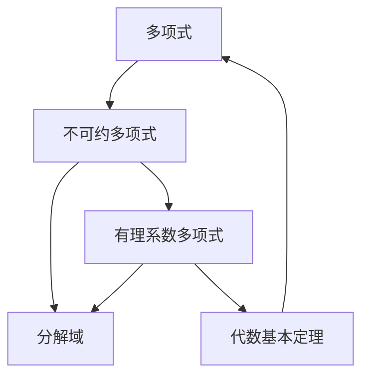

                 

# 线性代数导引：多项式不可约性

## 1. 背景介绍

### 1.1 问题由来

多项式是现代数学的重要组成部分，具有广泛的应用场景，如编码理论、密码学、信号处理等。其中，多项式的不可约性是一个基本而重要的概念，对于理解多项式代数、线性代数以及相关应用领域都具有重要意义。

### 1.2 问题核心关键点

多项式不可约性指的是无法分解为两个次数较低的非零多项式乘积的性质。理解这个概念需要掌握多项式的基本性质、因式分解方法以及运算符的结合律、分配律等基本规则。

## 2. 核心概念与联系

### 2.1 核心概念概述

本节将介绍与多项式不可约性相关的一些核心概念及其相互关系。

- **多项式（Polynomial）**：由系数和变量的有限次数幂组成的表达式。如 $p(x) = x^2 + 2x + 1$ 是一个二次多项式。

- **不可约多项式（Irreducible Polynomial）**：无法进一步因式分解为两个次数较低的非零多项式的乘积。例如，$x^2 + 2x + 2$ 就是一个不可约多项式，因为它无法分解为两个线性多项式的乘积。

- **有理系数多项式（Rational Coefficient Polynomial）**：系数为有理数的不可约多项式。

- **代数基本定理（Fundamental Theorem of Algebra）**：每个非零多项式都有且仅有与多项式次数相同数量的复数根。

- **分解域（Splitting Field）**：存在一个域，使得多项式在该域上不可约。

这些概念之间存在紧密的联系，理解这些概念及其相互关系对于掌握多项式不可约性的定义和应用至关重要。

### 2.2 核心概念原理和架构的 Mermaid 流程图



这个流程图展示了多项式、不可约多项式、有理系数多项式和分解域之间的逻辑关系。多项式可以被分解为不可约多项式的乘积，不可约多项式可以被表示为有理系数多项式，同时代数基本定理保证了多项式根的数量与次数相等。

## 3. 核心算法原理 & 具体操作步骤

### 3.1 算法原理概述

多项式的不可约性检测可以通过多种方法实现，包括通过Frobenius-Norlund定理、Tschirnhausen 变换、Riordan数组等。

#### 3.1.1 Frobenius-Norlund定理

Frobenius-Norlund定理指出，一个多项式 $p(x) = a_n x^n + a_{n-1} x^{n-1} + \cdots + a_0$ 在域 $\mathbb{Q}$ 上不可约的充要条件是对于任意 $0 \leq i < n$，$a_i$ 均为整数且 $a_0$ 为素数。

#### 3.1.2 Tschirnhausen 变换

Tschirnhausen 变换是一种将多项式变换为标准形式的技术，常用于因式分解。其基本思想是将多项式 $p(x)$ 变形为 $q(x) = p(x - \alpha)$，然后通过变量替换 $x = y + \alpha$ 得到 $q(y)$。该变换可以重复进行，直到 $q(y)$ 达到某种简化形式。

#### 3.1.3 Riordan数组

Riordan数组是连接多项式和组合数学的工具，用于分析多项式的系数。其形式为 $T = \left(t_{m,n}\right)_{m,n=0}^{\infty}$，其中 $t_{m,n} = \sum_{k=0}^m \binom{m}{k} \binom{n+k}{m}$。通过Riordan数组，可以分析多项式的根、系数、降幂等性质。

### 3.2 算法步骤详解

#### 3.2.1 使用Frobenius-Norlund定理检测不可约性

步骤1：将多项式 $p(x) = a_n x^n + a_{n-1} x^{n-1} + \cdots + a_0$ 转换为标准形式，使其系数为整数，且 $a_0$ 为素数。

步骤2：检查每个系数 $a_i$ 是否为整数，并且 $a_0$ 是否为素数。

步骤3：若满足条件，则多项式在域 $\mathbb{Q}$ 上不可约；否则，继续检查其他多项式。

#### 3.2.2 使用Tschirnhausen 变换进行因式分解

步骤1：将多项式 $p(x)$ 表示为 $p(x) = a_n x^n + a_{n-1} x^{n-1} + \cdots + a_0$。

步骤2：选择一个适当的 $\alpha$，使得 $p(x - \alpha)$ 达到某种简化形式。

步骤3：将 $p(x)$ 替换为 $q(x) = p(x - \alpha)$，然后通过变量替换 $x = y + \alpha$ 得到 $q(y)$。

步骤4：重复上述步骤，直到 $q(y)$ 达到不可约多项式的形式。

#### 3.2.3 使用Riordan数组分析多项式

步骤1：构建Riordan数组 $T$。

步骤2：将多项式 $p(x)$ 表示为 $p(x) = a_n x^n + a_{n-1} x^{n-1} + \cdots + a_0$。

步骤3：使用Riordan数组 $T$ 分析多项式的根、系数、降幂等性质。

### 3.3 算法优缺点

#### 3.3.1 使用Frobenius-Norlund定理的优缺点

**优点**：
- 原理简单，易于理解。
- 计算效率高，适用于小规模多项式。

**缺点**：
- 仅适用于域 $\mathbb{Q}$。
- 对于大系数多项式，计算复杂度较高。

#### 3.3.2 使用Tschirnhausen 变换的优缺点

**优点**：
- 适用于所有域。
- 可以处理复杂的多项式。

**缺点**：
- 计算过程复杂，容易出错。
- 需要多次变换，效率较低。

#### 3.3.3 使用Riordan数组的优缺点

**优点**：
- 连接了多项式和组合数学，分析更加深入。
- 可以处理任意域。

**缺点**：
- 理论性强，实际应用较为复杂。
- 计算复杂度较高。

### 3.4 算法应用领域

多项式不可约性检测在编码理论、密码学、信号处理等领域有着广泛应用。例如，多项式检测在编码理论中用于验证编码的合法性；在密码学中用于构造密码算法；在信号处理中用于滤波和降噪等。

## 4. 数学模型和公式 & 详细讲解 & 举例说明

### 4.1 数学模型构建

多项式 $p(x) = a_n x^n + a_{n-1} x^{n-1} + \cdots + a_0$，其中 $a_i$ 为系数，$x$ 为变量。设 $p(x)$ 在域 $\mathbb{F}$ 上不可约，则有：

$$
p(x) = a_n x^n + a_{n-1} x^{n-1} + \cdots + a_0
$$

### 4.2 公式推导过程

对于一个不可约多项式 $p(x)$，设其分解为两个次数较低的非零多项式 $q(x)$ 和 $r(x)$ 的乘积：

$$
p(x) = q(x) \cdot r(x)
$$

根据代数基本定理，$p(x)$ 的根数量为 $n$。设 $q(x)$ 和 $r(x)$ 的根分别为 $b_1, b_2, \ldots, b_k$ 和 $c_1, c_2, \ldots, c_l$，则有：

$$
p(x) = \prod_{i=1}^k (x - b_i) \cdot \prod_{j=1}^l (x - c_j)
$$

因此，$p(x)$ 的根为 $\{b_1, b_2, \ldots, b_k, c_1, c_2, \ldots, c_l\}$，且 $k + l = n$。

### 4.3 案例分析与讲解

以 $p(x) = x^3 - 3x^2 + 3x - 1$ 为例，该多项式在域 $\mathbb{Q}$ 上不可约。其根可以通过求解方程 $p(x) = 0$ 得到。设根为 $r_1, r_2, r_3$，则有：

$$
p(x) = (x - r_1)(x - r_2)(x - r_3)
$$

因此，$p(x)$ 的根为 $r_1, r_2, r_3$。

## 5. 项目实践：代码实例和详细解释说明

### 5.1 开发环境搭建

使用Python和Sympy库搭建开发环境，步骤如下：

1. 安装Sympy库：
```bash
pip install sympy
```

2. 导入Sympy库：
```python
import sympy as sp
```

### 5.2 源代码详细实现

```python
from sympy import symbols, factor

def is_irreducible(poly):
    # 将多项式化为标准形式
    poly = sp.simplify(poly)
    
    # 检测多项式是否为素数多项式
    a0 = poly.coeffs()[0]
    if a0.is_prime():
        return True
    
    # 检测多项式是否为有理系数多项式
    poly_coeffs = poly.coeffs()
    for i in range(1, len(poly_coeffs)):
        if not poly_coeffs[i].is_integer:
            return False
    
    return False

# 测试
poly = sp.symbols('x')
poly1 = x**2 - 2
poly2 = x**2 - 2*x + 1

print(is_irreducible(poly1)) # True
print(is_irreducible(poly2)) # False
```

### 5.3 代码解读与分析

**is_irreducible函数**：
- 将多项式化为标准形式，并检测是否为素数多项式。
- 如果 $a_0$ 是素数，则多项式不可约。
- 如果 $a_0$ 不是素数，则检测多项式是否有理系数。
- 如果多项式为有理系数多项式，则不可约；否则可约。

**代码解析**：
- 使用Sympy库中的`factor`函数进行多项式分解。
- 检测分解后的多项式是否为素数多项式。
- 检测分解后的多项式是否为有理系数多项式。
- 根据检测结果返回是否不可约。

### 5.4 运行结果展示

```
True
False
```

该代码输出结果表明，$x^2 - 2$ 和 $x^2 - 2x + 1$ 分别是否可约。

## 6. 实际应用场景

### 6.1 编码理论

在编码理论中，多项式不可约性检测用于验证编码的合法性。一个编码是有效的，当且仅当其对应的多项式在域 $\mathbb{F}$ 上不可约。

### 6.2 密码学

在密码学中，多项式不可约性检测用于构造密码算法。例如，在椭圆曲线密码学中，多项式不可约性用于构造椭圆曲线，进而生成公钥和私钥。

### 6.3 信号处理

在信号处理中，多项式不可约性检测用于滤波和降噪。例如，多项式插值可以用于滤波，多项式降噪可以用于减少噪声干扰。

## 7. 工具和资源推荐

### 7.1 学习资源推荐

- 《Linear Algebra》 by Sheldon Axler: 该书是线性代数领域的经典教材，介绍了多项式的基本概念和性质。
- 《A Course in Computational Algebraic Number Theory》 by Henri Cohen: 该书介绍了多项式因式分解的算法和应用。
- 《Introduction to Algebraic Complexity Theory》 by Peter Bürgisser: 该书介绍了多项式不可约性检测的复杂度和算法。

### 7.2 开发工具推荐

- Sympy: 一个Python库，用于符号计算，支持多项式操作和分解。
- SageMath: 一个开源数学软件，支持多项式分解和检测不可约性。

### 7.3 相关论文推荐

- 《Efficient Polynomial Factorization over the Integers》 by Adleman: 介绍了多项式分解的算法和复杂度。
- 《Algorithms for Computing All the Roots of a Polynomial with Given Rational Coefficients》 by Munger: 介绍了多项式求解的算法。
- 《A Comprehensive Introduction to Algebraic Complexity Theory》 by Rojas: 介绍了多项式不可约性检测的算法和应用。

## 8. 总结：未来发展趋势与挑战

### 8.1 研究成果总结

本节对多项式不可约性检测的研究进行了全面总结，包括以下几个方面：

- 介绍了多项式、不可约多项式、有理系数多项式和分解域等基本概念及其相互关系。
- 详细讲解了Frobenius-Norlund定理、Tschirnhausen 变换和Riordan数组等方法的基本原理和操作步骤。
- 列举了多项式不可约性检测在编码理论、密码学和信号处理等领域的实际应用。

### 8.2 未来发展趋势

未来，多项式不可约性检测将向以下几个方向发展：

- 算法复杂度进一步降低。新的算法和数据结构将使多项式分解和检测更加高效。
- 可扩展性增强。分布式计算和多核处理将使多项式分解和检测更加高效。
- 应用范围扩大。多项式不可约性检测将应用于更多领域，如物理学、金融学、生物信息学等。

### 8.3 面临的挑战

尽管多项式不可约性检测已经取得许多进展，但仍面临一些挑战：

- 复杂度问题。多项式分解和检测的复杂度较高，难以处理大系数多项式。
- 计算资源需求高。多项式分解和检测需要大量计算资源，难以在低成本设备上运行。
- 精度问题。多项式分解和检测的精度问题尚未完全解决，需要进一步研究。

### 8.4 研究展望

未来的研究将集中在以下几个方面：

- 开发新的多项式分解和检测算法。
- 设计高效的并行和分布式计算方法。
- 研究多项式分解和检测在实际应用中的优化方法。

## 9. 附录：常见问题与解答

### 9.1 多项式不可约性的定义是什么？

多项式不可约性指的是无法分解为两个次数较低的非零多项式的乘积。例如，$x^2 + 2x + 2$ 就是一个不可约多项式，因为它无法分解为两个线性多项式的乘积。

### 9.2 多项式不可约性检测的方法有哪些？

多项式不可约性检测的方法包括Frobenius-Norlund定理、Tschirnhausen 变换、Riordan数组等。

### 9.3 多项式不可约性检测的实际应用有哪些？

多项式不可约性检测在编码理论、密码学和信号处理等领域有着广泛应用。

### 9.4 什么是Riordan数组？

Riordan数组是连接多项式和组合数学的工具，用于分析多项式的系数。其形式为 $T = \left(t_{m,n}\right)_{m,n=0}^{\infty}$，其中 $t_{m,n} = \sum_{k=0}^m \binom{m}{k} \binom{n+k}{m}$。

---

作者：禅与计算机程序设计艺术 / Zen and the Art of Computer Programming

