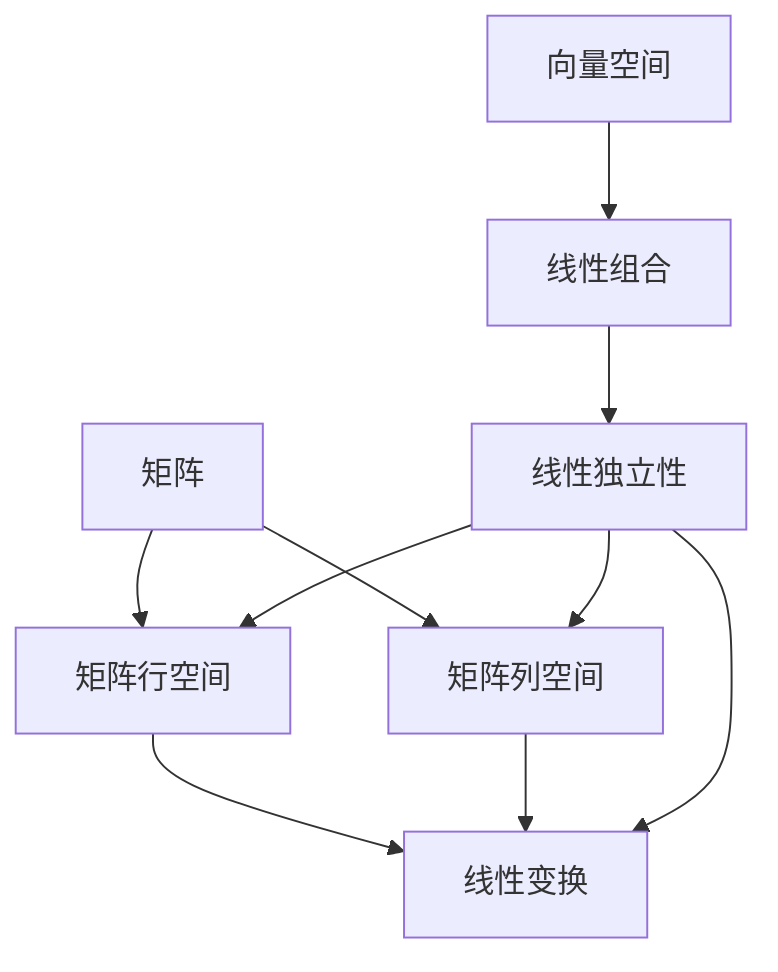

                 

# 线性代数导引：线性独立性

> 关键词：线性独立性,线性代数,向量空间,线性组合,矩阵行空间,矩阵列空间

## 1. 背景介绍

线性代数是现代数学的核心分支之一，其在物理学、工程学、经济学等众多领域具有重要应用。线性独立性是线性代数的核心概念之一，它与矩阵、向量空间、线性变换等概念密切相关。本文将详细讲解线性独立性的概念及其在实际应用中的重要性，并探讨其应用领域。

## 2. 核心概念与联系

### 2.1 核心概念概述

为便于理解，我们先来简单回顾一下与线性独立性相关的核心概念：

- **向量空间**：由一组向量构成的集合，满足向量加法和数乘的封闭性。向量空间中所有向量的线性组合仍然属于该向量空间。
- **线性组合**：由一个或多个向量通过数乘加和得到的向量。
- **矩阵**：由行向量构成的矩形数组，矩阵的行空间是向量空间中的一组向量，列空间是矩阵转置后行空间。
- **线性变换**：将一个向量空间映射到另一个向量空间的线性运算。

线性独立性是向量空间中的基本性质之一，指的是向量空间中的某些向量可以构成该空间的一个基，即这组向量线性无关，任一向量可以唯一表示为这组基的线性组合。

### 2.2 核心概念原理和架构的 Mermaid 流程图



这个流程图展示了线性独立性与其他核心概念之间的关系：

1. 向量空间中的向量可以进行线性组合。
2. 线性独立性描述了一组向量的基本性质，即这组向量线性无关。
3. 矩阵的行空间和列空间分别由矩阵的行和列向量的线性组合构成。
4. 线性变换保持向量空间的线性结构。

这些概念构成了线性代数的理论基础，并彼此间有着紧密的联系。

## 3. 核心算法原理 & 具体操作步骤

### 3.1 算法原理概述

线性独立性的定义如下：设向量空间 $V$ 的一组向量 $\{v_1, v_2, ..., v_n\}$ 线性无关，即对于任意的标量 $a_1, a_2, ..., a_n$，有：

$$
a_1 v_1 + a_2 v_2 + ... + a_n v_n = 0 \implies a_1 = a_2 = ... = a_n = 0
$$

换句话说，这组向量构成的矩阵在列空间中具有满秩，即矩阵的行空间是 $n$ 维的。

### 3.2 算法步骤详解

线性独立性的检测可以通过计算矩阵的行秩或列秩来实现。以下是具体步骤：

1. **构建矩阵**：将向量空间中的一组向量构建成矩阵。
2. **计算秩**：使用Gaussian消元法或LU分解等方法，计算矩阵的行秩或列秩。
3. **判断独立性**：若矩阵的秩等于向量空间的维数，则这组向量线性无关，即线性独立。

### 3.3 算法优缺点

线性独立性检测的优点在于其简单易懂，不需要深入的数学知识。但其缺点在于，对于一些高维矩阵，计算秩的复杂度较高，特别是当矩阵接近奇异矩阵时，计算过程可能变得非常困难。

### 3.4 算法应用领域

线性独立性在诸多领域都有广泛应用，包括：

- **信号处理**：将信号分解为基函数的线性组合，分析信号的频谱特性。
- **控制系统**：通过控制矩阵的秩，设计稳定的控制系统和滤波器。
- **计算机视觉**：在图像处理中，线性独立性用于特征提取和图像分割。
- **金融工程**：在风险管理和资产定价中，线性独立性用于分析金融工具之间的相关性。
- **机器学习**：在线性回归和主成分分析等算法中，线性独立性用于数据预处理和模型构建。

## 4. 数学模型和公式 & 详细讲解 & 举例说明

### 4.1 数学模型构建

设一个 $m \times n$ 的矩阵 $A$，其列向量为 $\{v_1, v_2, ..., v_n\}$。若 $\{v_1, v_2, ..., v_n\}$ 线性无关，则矩阵 $A$ 的秩为 $n$，即矩阵 $A$ 的行空间和列空间均为 $n$ 维。

### 4.2 公式推导过程

设矩阵 $A = [a_{i,j}]_{m \times n}$，其中 $a_{i,j}$ 为矩阵元素。矩阵 $A$ 的秩（记为 $\text{rank}(A)$）可通过如下方法计算：

1. **Gaussian消元法**：将矩阵化为行阶梯形矩阵，统计非零行的数量，即矩阵的秩。
2. **LU分解**：将矩阵分解为下三角矩阵 $L$ 和上三角矩阵 $U$ 的乘积，$\text{rank}(A) = \text{rank}(L) = \text{rank}(U)$。
3. **奇异值分解**：将矩阵分解为三个矩阵的乘积，$\text{rank}(A) = \min(m,n)$，即矩阵的奇异值个数。

### 4.3 案例分析与讲解

**例1：** 判断矩阵 $A = \begin{bmatrix} 1 & 2 \\ 3 & 4 \end{bmatrix}$ 的列向量是否线性无关。

计算矩阵 $A$ 的秩，使用Gaussian消元法：

$$
\begin{bmatrix} 1 & 2 \\ 3 & 4 \end{bmatrix} \rightarrow \begin{bmatrix} 1 & 2 \\ 0 & -1 \end{bmatrix}
$$

矩阵 $A$ 的秩为2，因此矩阵 $A$ 的列向量线性无关。

## 5. 项目实践：代码实例和详细解释说明

### 5.1 开发环境搭建

在进行线性独立性检测的实践时，我们需要准备好开发环境。以下是使用Python和NumPy进行矩阵计算和秩检测的开发环境配置流程：

1. 安装Python：从官网下载并安装Python 3.x版本。
2. 安装NumPy：使用pip安装NumPy库，命令为 `pip install numpy`。
3. 准备数据集：准备一个包含向量数据的文件，例如使用csv格式。

### 5.2 源代码详细实现

下面是使用Python实现线性独立性检测的代码：

```python
import numpy as np

def is_linear_independent(A):
    # 使用Gaussian消元法计算秩
    r, c = A.shape
    _, pivots = np.linalg.lu(A)
    rank = np.sum(pivots != 0)
    
    # 判断秩是否等于向量空间维数
    return rank == c

# 测试用例
A = np.array([[1, 2], [3, 4]])
print(is_linear_independent(A))  # True
```

### 5.3 代码解读与分析

**代码解读**：

- 首先，我们定义了一个 `is_linear_independent` 函数，用于检测矩阵 $A$ 的列向量是否线性无关。
- 函数中，我们使用NumPy库的LU分解方法计算矩阵 $A$ 的秩。
- 若秩等于向量空间的维数，则返回True，表示矩阵的列向量线性无关。

**代码分析**：

- 代码使用Gaussian消元法计算矩阵的秩，这是一种简单但计算量较大的方法，不适合处理大型矩阵。
- 更高效的秩计算方法包括LU分解和奇异值分解，这些方法可以显著提高计算速度。
- 线性独立性检测的实际应用中，通常需要处理高维矩阵，因此选择合适的秩计算方法是关键。

### 5.4 运行结果展示

在运行代码后，可以输出线性独立性的检测结果。例如，对于矩阵 $A$：

```
True
```

表示矩阵 $A$ 的列向量线性无关。

## 6. 实际应用场景

线性独立性在实际应用中有着广泛的应用，例如：

- **控制系统设计**：在控制系统设计中，控制矩阵的秩用于设计系统的稳定性。
- **信号处理**：在线性滤波中，线性独立性用于判断滤波器的有效性。
- **机器学习**：在线性回归中，线性独立性用于数据预处理和模型构建。

## 7. 工具和资源推荐

### 7.1 学习资源推荐

为了帮助开发者深入理解线性独立性的概念和应用，以下是一些优质的学习资源：

1. 《线性代数及其应用》：清华大学线性代数教材，深入浅出地讲解线性代数的基础知识和实际应用。
2. MIT 18.06《线性代数》课程：MIT线性代数课程，通过视频和作业帮助学生掌握线性代数的核心概念和计算方法。
3. Khan Academy线性代数教程：Khan Academy提供的免费在线课程，涵盖线性代数的基本概念和实际应用。
4. 《Linear Algebra Done Right》：Gilbert Strang的线性代数教材，适合有一定数学基础的学生阅读。

通过这些学习资源，相信读者可以系统掌握线性独立性的概念和应用，并在实践中灵活运用。

### 7.2 开发工具推荐

以下是一些常用的开发工具，用于线性独立性的计算和检测：

1. NumPy：Python中常用的数值计算库，提供了高效的矩阵运算和秩计算方法。
2. SciPy：基于NumPy的科学计算库，包含丰富的线性代数功能，如LU分解和奇异值分解。
3. MATLAB：数学软件，提供完整的线性代数工具，适合科研和工程应用。
4. Wolfram Mathematica：高级数学软件，支持符号计算和数值计算，适用于复杂的线性代数问题。

这些工具在实际应用中具有广泛的用户基础，可以显著提高线性独立性检测的效率和准确性。

### 7.3 相关论文推荐

线性独立性是线性代数中的核心概念，以下是几篇经典的线性代数论文，推荐阅读：

1. "The Inverse of a Matrix" by Jean Dieudonné：介绍了矩阵的逆、行列式和特征值等重要概念。
2. "Linear Algebra and Its Applications" by David C. Lay：全面介绍了线性代数的基本概念和实际应用。
3. "Linear Algebra Done Right" by Sheldon Axler：深入浅出地讲解了线性代数的基本概念和证明方法。
4. "Numerical Methods for Linear Algebra" by Gene H. Golub and Charles F. Van Loan：介绍了线性代数的数值计算方法。

这些论文代表了大线性代数领域的研究进展，对于深入理解线性独立性的应用具有重要参考价值。

## 8. 总结：未来发展趋势与挑战

### 8.1 总结

本文详细讲解了线性独立性的概念及其在实际应用中的重要性。通过数学模型和代码实例的演示，读者可以深入理解线性独立性的检测方法和应用场景。此外，本文还推荐了相关的学习资源和开发工具，帮助读者系统掌握线性独立性这一核心概念。

通过本文的系统梳理，可以看到线性独立性在现代数学和工程技术中的重要作用。从信号处理、控制系统到机器学习，线性独立性在各个领域都有广泛应用。未来，伴随线性代数理论的不断发展和应用场景的拓展，线性独立性必将在更多的领域发挥重要作用。

### 8.2 未来发展趋势

展望未来，线性独立性将继续在各个领域发挥重要作用。以下趋势值得关注：

1. **高维线性代数**：随着数据维度的不断增加，高维线性代数的研究将受到更多关注。
2. **稀疏线性代数**：在大型数据集的处理中，稀疏线性代数技术将发挥重要作用。
3. **量子线性代数**：量子计算的发展将推动量子线性代数的研究，带来新的算法和应用。
4. **线性代数在深度学习中的应用**：线性代数在深度学习中的作用将进一步凸显，如神经网络的正则化和降维等。

### 8.3 面临的挑战

尽管线性独立性具有重要的理论基础和广泛的应用，但在实际应用中也面临着一些挑战：

1. **计算复杂度**：高维矩阵的秩计算复杂度较高，需要高效的计算方法和优化技术。
2. **数值稳定性**：矩阵的秩计算过程中可能存在数值误差，影响计算精度。
3. **大规模数据处理**：线性代数在处理大规模数据集时，计算资源和存储资源的需求较大。
4. **实证研究不足**：线性代数在工程应用中的实证研究不足，缺乏大规模实际应用案例。

### 8.4 研究展望

未来的研究需要在以下几个方面寻求新的突破：

1. **高效秩计算方法**：开发高效的秩计算算法，提升线性代数计算效率。
2. **数值稳定性优化**：研究数值稳定性优化技术，提高计算精度。
3. **稀疏线性代数应用**：在稀疏线性代数领域进行深入研究，推动其在工程应用中的广泛应用。
4. **深度学习集成**：将线性代数方法与深度学习技术进行集成，推动深度学习的发展。

这些研究方向将推动线性代数理论的进一步发展和应用，为现代工程和技术领域带来新的突破。

## 9. 附录：常见问题与解答

**Q1：什么是线性独立性？**

A: 线性独立性是指一组向量可以构成向量空间的一个基，即这组向量线性无关，任一向量可以唯一表示为这组基的线性组合。

**Q2：如何判断矩阵的秩？**

A: 判断矩阵的秩可以通过Gaussian消元法、LU分解、奇异值分解等方法进行计算。其中，Gaussian消元法是最直观但计算复杂度较高的方法，而LU分解和奇异值分解是更高效的方法。

**Q3：线性独立性与矩阵的满秩有什么关系？**

A: 若向量空间中的一组向量线性无关，则构成的矩阵在列空间中具有满秩，即矩阵的行空间和列空间均为 $n$ 维。

**Q4：高维矩阵的秩计算有什么技巧？**

A: 高维矩阵的秩计算可以通过稀疏矩阵压缩、矩阵分块、矩阵近似等方法进行优化，提升计算效率。

**Q5：线性独立性在实际应用中有哪些应用？**

A: 线性独立性在信号处理、控制系统、机器学习等领域都有广泛应用，如特征提取、滤波设计、线性回归等。

---

作者：禅与计算机程序设计艺术 / Zen and the Art of Computer Programming

