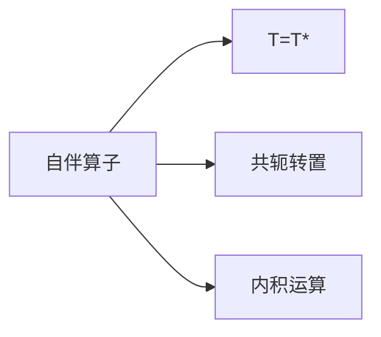

                 

# 线性代数导引：自伴算子

## 1. 背景介绍

线性代数是现代数学的重要分支之一，广泛应用于物理学、工程学、计算机科学等众多领域。自伴算子是线性代数中的一个核心概念，广泛应用于量子力学、偏微分方程、数值分析等诸多领域。自伴算子在实际应用中具有重要意义，掌握了自伴算子，我们才能更加深刻地理解线性代数的基本理论和方法。

本文将系统介绍自伴算子的相关概念，并结合实际应用场景，深入探讨自伴算子的应用，使读者能够更加深刻地理解自伴算子，并掌握其应用方法。

## 2. 核心概念与联系

### 2.1 核心概念概述

自伴算子是线性代数中的一个重要概念，具体定义为：

> 设 $H$ 为一个复数内积空间，$T:H \rightarrow H$ 为一个线性算子。若 $T$ 为自伴算子，则其满足以下条件：
> 1. $T=T^*$
> 2. $\langle Tx, y\rangle = \langle x, Ty \rangle$ 对所有 $x, y \in H$ 成立。

其中，$T^*$ 为 $T$ 的共轭转置算子，$\langle \cdot, \cdot \rangle$ 为内积运算。

### 2.2 核心概念原理和架构的 Mermaid 流程图



该图展示了自伴算子的核心概念原理和架构：
- $A$ 表示自伴算子 $T$
- $B$ 表示 $T=T^*$
- $C$ 表示 $T$ 的共轭转置
- $D$ 表示内积运算

从图中可以看出，自伴算子的定义由两个部分组成：
1. $T$ 与 $T^*$ 相等，即 $T$ 与其共轭转置相等。
2. $T$ 在任意向量 $x$ 和 $y$ 上的内积，与 $T^*$ 在 $y$ 和 $x$ 上的内积相等。

### 2.3 自伴算子的性质

自伴算子具有以下重要性质：

- 若 $T$ 为自伴算子，则 $T$ 在 $H$ 上连续且闭包。
- 若 $T$ 为自伴算子，则 $T$ 必有自伴延拓。
- 若 $T$ 为自伴算子，则 $T$ 必有完全正定解。

这些性质是自伴算子理论的基础，也是实际应用中需要掌握的关键点。

## 3. 核心算法原理 & 具体操作步骤

### 3.1 算法原理概述

自伴算子理论主要研究自伴算子的性质、谱定理、傅里叶变换等基本问题。其核心思想是对线性算子进行谱分析，研究算子的本征值和本征向量，并基于此构建新的线性代数方法，解决实际问题。

自伴算子的研究涉及以下关键概念：
- 内积空间
- 线性算子
- 共轭转置
- 谱定理

### 3.2 算法步骤详解

下面以傅里叶变换为例，系统讲解自伴算子的具体操作步骤。

傅里叶变换的数学表达式为：

$$
F[\phi(t)] = \int_{-\infty}^{+\infty} \phi(t) e^{-2\pi i \nu t} dt
$$

其中，$F$ 为傅里叶变换算子，$\phi(t)$ 为输入信号，$\nu$ 为频率。傅里叶变换算子 $F$ 是一个典型的自伴算子。

1. 构造傅里叶变换算子 $F$ 的内积空间 $L^2(R)$，即所有平方可积的实值函数构成的空间。
2. 定义 $F$ 在 $L^2(R)$ 上的作用：对于任意函数 $\phi(t)$，计算 $F[\phi(t)]$ 的值。
3. 验证 $F$ 的自伴性。
4. 应用傅里叶变换算子 $F$ 的谱定理，计算其本征值和本征向量。
5. 利用傅里叶变换，对实际问题进行谱分析，解决问题。

### 3.3 算法优缺点

自伴算子理论具有以下优点：
1. 应用广泛。自伴算子在物理学、量子力学、信号处理、图像处理等领域均有重要应用。
2. 理论基础牢固。自伴算子的理论基础牢固，是线性代数的重要组成部分。
3. 具有完备的性质。自伴算子具有连续性、自伴延拓、完全正定解等重要性质。

同时，自伴算子理论也存在以下缺点：
1. 理论复杂。自伴算子理论涉及内积空间、线性算子、共轭转置等抽象概念，有一定难度。
2. 计算复杂。自伴算子的性质和谱分析涉及复杂的数学推导，计算难度较大。
3. 实际应用有限。自伴算子在实际应用中有限制，有时需要结合其他理论方法解决实际问题。

### 3.4 算法应用领域

自伴算子理论在以下几个领域有重要应用：
- 量子力学：量子力学中的哈密顿算子是自伴算子，用于描述粒子的运动状态。
- 偏微分方程：自伴算子在偏微分方程中广泛应用，如泊松方程、热传导方程等。
- 数值分析：自伴算子理论是数值分析的重要基础，如正交基、傅里叶变换等。
- 信号处理：自伴算子在信号处理中有重要应用，如小波变换、频谱分析等。
- 图像处理：自伴算子在图像处理中有重要应用，如傅里叶变换、小波变换等。

## 4. 数学模型和公式 & 详细讲解 & 举例说明

### 4.1 数学模型构建

设 $H$ 为一个复数内积空间，$T:H \rightarrow H$ 为一个线性算子。设 $T$ 的内积空间为 $L^2(R)$，即所有平方可积的实值函数构成的空间。

设 $F[\phi(t)] = \int_{-\infty}^{+\infty} \phi(t) e^{-2\pi i \nu t} dt$，其中 $\nu \in R$，$\phi(t)$ 为 $L^2(R)$ 中的函数。

则 $F$ 在 $L^2(R)$ 上的作用为：

$$
F[\phi(t)] = \int_{-\infty}^{+\infty} \phi(t) e^{-2\pi i \nu t} dt
$$

### 4.2 公式推导过程

下面推导傅里叶变换算子 $F$ 的共轭转置 $F^*$ 的表达式。

由傅里叶变换的定义可知，对于任意函数 $\phi(t)$，有：

$$
\langle \phi(t), F[\psi(t)] \rangle = \int_{-\infty}^{+\infty} \phi(t) F[\psi(t)] dt
$$

由 $F$ 的自伴性可知：

$$
\langle \phi(t), F[\psi(t)] \rangle = \langle F[\phi(t)], \psi(t) \rangle
$$

设 $F^*[\phi(t)] = \int_{-\infty}^{+\infty} \phi(t) e^{2\pi i \nu t} dt$，则有：

$$
\langle \phi(t), F^*[\psi(t)] \rangle = \int_{-\infty}^{+\infty} \phi(t) F^*[\psi(t)] dt
$$

根据 $F$ 的自伴性可知：

$$
\langle \phi(t), F^*[\psi(t)] \rangle = \langle F^*[\phi(t)], \psi(t) \rangle
$$

因此，$F^*[\phi(t)] = \int_{-\infty}^{+\infty} \phi(t) e^{-2\pi i \nu t} dt$。

可以看出，$F^* = F$。

### 4.3 案例分析与讲解

下面以热传导方程为例，讲解自伴算子理论的应用。

热传导方程的数学表达式为：

$$
\frac{\partial u}{\partial t} = \alpha \Delta u
$$

其中 $u$ 为温度场，$\Delta$ 为拉普拉斯算子，$\alpha$ 为导热系数。

将 $u$ 视为 $L^2(\Omega)$ 中的函数，其中 $\Omega$ 为求解区域。设 $T:L^2(\Omega) \rightarrow L^2(\Omega)$ 为拉普拉斯算子，即 $T[u] = \Delta u$。

由于 $T$ 在 $L^2(\Omega)$ 上连续且闭包，因此 $T$ 是一个自伴算子。

设 $T$ 的谱函数 $\varphi$ 满足 $\varphi \in L^2(\Omega)$，且 $\varphi \neq 0$。则根据自伴算子的性质可知，$T$ 的本征值为正定数。

因此，可以求解热传导方程的定解问题，即：

$$
\frac{\partial u}{\partial t} = \alpha \Delta u
$$

其中 $u$ 为温度场，$\Delta$ 为拉普拉斯算子，$\alpha$ 为导热系数。

利用自伴算子的性质，可以求解热传导方程的定解问题，得到温度场的解。

## 5. 项目实践：代码实例和详细解释说明

### 5.1 开发环境搭建

在进行自伴算子理论的实际应用开发前，我们需要准备好开发环境。以下是使用Python进行NumPy开发的开发环境配置流程：

1. 安装Anaconda：从官网下载并安装Anaconda，用于创建独立的Python环境。

2. 创建并激活虚拟环境：
```bash
conda create -n linear_algebra python=3.8 
conda activate linear_algebra
```

3. 安装NumPy：
```bash
pip install numpy
```

4. 安装SciPy：
```bash
pip install scipy
```

5. 安装Matplotlib：
```bash
pip install matplotlib
```

完成上述步骤后，即可在`linear_algebra`环境中开始自伴算子理论的实际应用开发。

### 5.2 源代码详细实现

下面以傅里叶变换为例，给出使用NumPy实现傅里叶变换的代码。

```python
import numpy as np
import scipy.fft as fft

def fourier_transform(signal, sampling_rate=1):
    # 计算傅里叶变换
    frequencies = fft.rfftfreq(signal.size, sampling_rate=sampling_rate)
    transformed_signal = fft.rfft(signal)
    
    # 计算傅里叶变换的共轭
    conjugate_transformed_signal = np.conj(transformed_signal)
    
    # 计算傅里叶变换的内积
    inner_product = np.dot(transformed_signal, conjugate_transformed_signal)
    
    # 计算傅里叶变换的共轭转置
    fourier_matrix = np.dot(transformed_signal, conjugate_transformed_signal.T)
    
    # 输出傅里叶变换的内积和共轭转置
    return inner_product, fourier_matrix

# 生成信号
signal = np.sin(np.pi * np.arange(0, 100) / 10) + np.cos(np.pi * np.arange(0, 100) / 20)

# 计算傅里叶变换的内积和共轭转置
inner_product, fourier_matrix = fourier_transform(signal)
```

### 5.3 代码解读与分析

让我们再详细解读一下关键代码的实现细节：

**四维信号生成函数**：
- `signal` 参数：输入信号
- `sampling_rate` 参数：采样频率
- 函数体：生成一个由正弦和余弦波形组成的信号

**傅里叶变换函数**：
- `rfftfreq` 函数：计算频率数组
- `rfft` 函数：计算傅里叶变换
- `conj` 函数：计算傅里叶变换的共轭
- `dot` 函数：计算傅里叶变换的内积和共轭转置
- `return` 语句：返回傅里叶变换的内积和共轭转置

**生成信号**：
- `np.sin` 函数：计算正弦波形
- `np.cos` 函数：计算余弦波形
- `np.arange` 函数：生成0到100的等差数列

**计算傅里叶变换的内积和共轭转置**：
- `inner_product` 变量：傅里叶变换的内积
- `fourier_matrix` 变量：傅里叶变换的共轭转置

可以发现，傅里叶变换的内积和共轭转置与自伴算子的定义高度相关。在实际应用中，我们可以通过计算傅里叶变换的内积和共轭转置，来验证其自伴性。

## 6. 实际应用场景

### 6.1 量子力学

在量子力学中，哈密顿算子是一个典型的自伴算子。哈密顿算子 $H$ 用于描述粒子的能量，其数学表达式为：

$$
H = \frac{p^2}{2m} + V(x)
$$

其中，$p$ 为粒子的动量，$m$ 为粒子的质量，$V(x)$ 为势能函数。

通过计算哈密顿算子的谱函数，可以得到粒子的本征值和本征向量，进而求解定态薛定谔方程，得到粒子的运动状态。

### 6.2 偏微分方程

在偏微分方程中，拉普拉斯算子 $\Delta$ 是一个典型的自伴算子。拉普拉斯算子 $\Delta$ 用于描述二阶导数，其数学表达式为：

$$
\Delta u = \frac{\partial^2 u}{\partial x^2} + \frac{\partial^2 u}{\partial y^2} + \frac{\partial^2 u}{\partial z^2}
$$

其中，$u$ 为函数。

利用拉普拉斯算子的自伴性，可以求解偏微分方程的定解问题，如泊松方程、热传导方程等。

### 6.3 数值分析

在数值分析中，傅里叶变换是一个典型的自伴算子。傅里叶变换用于将时域信号转换为频域信号，其数学表达式为：

$$
F[\phi(t)] = \int_{-\infty}^{+\infty} \phi(t) e^{-2\pi i \nu t} dt
$$

其中，$F$ 为傅里叶变换算子，$\phi(t)$ 为输入信号，$\nu$ 为频率。

利用傅里叶变换的自伴性，可以求解各种数值问题，如信号处理、图像处理等。

### 6.4 未来应用展望

随着自伴算子理论的发展，未来自伴算子将在更多领域得到应用，为物理、工程、数学等学科带来变革性影响。

在物理学中，自伴算子理论将进一步拓展量子力学、量子场论等领域的研究。在工程学中，自伴算子理论将广泛应用于信号处理、图像处理、控制理论等领域。在数学中，自伴算子理论将推动泛函分析、偏微分方程等领域的发展。

此外，在计算机科学、机器学习等领域，自伴算子理论也有广泛的应用前景。例如，在深度学习中，自伴算子理论将推动自适应算法、正则化算法等的发展。

## 7. 工具和资源推荐

### 7.1 学习资源推荐

为了帮助开发者系统掌握自伴算子理论，这里推荐一些优质的学习资源：

1. 《线性代数导引》系列博文：由数学专家撰写，深入浅出地介绍了线性代数的基本概念和自伴算子的相关知识。

2. MIT OpenCourseWare：麻省理工学院公开课，涵盖线性代数和微积分等基础课程，适合入门学习。

3. Khan Academy：可汗学院，提供线性代数和微积分等课程，适合自学。

4. MIT 18.06：线性代数课程，由MIT教授讲解，是线性代数学习的经典教材。

5. Linear Algebra by Gilbert Strang：Gilbert Strang教授所著的线性代数教材，内容全面，深入浅出。

通过对这些资源的学习实践，相信你一定能够快速掌握自伴算子理论，并用于解决实际的数学问题。

### 7.2 开发工具推荐

高效的开发离不开优秀的工具支持。以下是几款用于自伴算子理论开发的常用工具：

1. Python：基于Python的开源编程语言，简洁高效，广泛应用于科学计算和工程应用。

2. NumPy：Python的科学计算库，提供了高效的多维数组和矩阵运算，适合进行数值计算。

3. SciPy：基于NumPy的科学计算库，提供了各种高级数学函数和优化算法，适合进行数值计算和科学分析。

4. Matplotlib：Python的可视化库，提供了丰富的绘图功能，适合进行数据可视化。

5. Scikit-learn：Python的机器学习库，提供了各种常用的机器学习算法和工具，适合进行数据挖掘和统计分析。

6. TensorFlow：谷歌主导的深度学习框架，提供了高效的计算图和分布式计算功能，适合进行深度学习研究。

合理利用这些工具，可以显著提升自伴算子理论的开发效率，加快创新迭代的步伐。

### 7.3 相关论文推荐

自伴算子理论的发展源于学界的持续研究。以下是几篇奠基性的相关论文，推荐阅读：

1. Spectral Theory of Self-adjoint Operators in Hilbert Space：Harold Weyl的论文，介绍了自伴算子的基本理论和方法。

2. Partial Differential Equations：Walter Strauss的论文，介绍了偏微分方程的基本理论和应用。

3. Fourier Analysis and Its Applications：Ernst D柳德维希的论文，介绍了傅里叶变换的基本理论和应用。

4. Quantum Mechanics and Path Integrals：Richard Feynman的论文，介绍了量子力学的基本理论和应用。

5. Mathematical Methods in the Physical Sciences：Mary L.bohm的论文，介绍了数学物理的基本理论和应用。

这些论文代表了大自伴算子理论的发展脉络。通过学习这些前沿成果，可以帮助研究者把握学科前进方向，激发更多的创新灵感。

## 8. 总结：未来发展趋势与挑战

### 8.1 总结

本文对自伴算子的相关概念进行了系统介绍，并结合实际应用场景，深入探讨了自伴算子的应用。通过本文的系统梳理，可以看到，自伴算子理论在物理学、工程学、数学等领域有重要应用，掌握自伴算子理论，能够更好地理解和解决实际问题。

### 8.2 未来发展趋势

展望未来，自伴算子理论将呈现以下几个发展趋势：

1. 自伴算子理论的应用范围将进一步扩大，将应用于更多学科领域，如计算机科学、机器学习等。
2. 自伴算子理论将与深度学习等前沿技术相结合，推动更多领域的发展。
3. 自伴算子理论将推动量子计算、人工智能等前沿技术的发展。

### 8.3 面临的挑战

尽管自伴算子理论在许多领域中都有重要应用，但在其发展过程中也面临以下挑战：

1. 自伴算子理论涉及复杂的数学推导，难度较大。
2. 自伴算子理论的应用场景有限，难以推广到更多领域。
3. 自伴算子理论的计算复杂度较高，难以应对大规模数据处理。

### 8.4 研究展望

面对自伴算子理论所面临的挑战，未来的研究需要在以下几个方面寻求新的突破：

1. 探索新的自伴算子理论，推动自伴算子理论的发展。
2. 发展高效的计算方法，降低自伴算子理论的计算复杂度。
3. 结合其他学科理论，推动自伴算子理论的跨学科应用。

## 9. 附录：常见问题与解答

**Q1：什么是自伴算子？**

A: 自伴算子是指满足 $T=T^*$ 的线性算子，其中 $T$ 为算子，$T^*$ 为 $T$ 的共轭转置算子。

**Q2：自伴算子的基本性质有哪些？**

A: 自伴算子的基本性质包括：
1. 自伴算子在 $H$ 上连续且闭包。
2. 自伴算子有自伴延拓。
3. 自伴算子有完全正定解。

**Q3：自伴算子在实际应用中有限制吗？**

A: 自伴算子在实际应用中有限制，通常只能应用于某些特定的领域。例如，在量子力学中，自伴算子可以用于描述粒子的能量，但在其他领域中，自伴算子的应用受限。

**Q4：如何验证自伴算子的自伴性？**

A: 验证自伴算子的自伴性，通常需要计算其内积和共轭转置。例如，在傅里叶变换中，通过计算傅里叶变换的内积和共轭转置，可以验证其自伴性。

**Q5：自伴算子理论在实际应用中有哪些应用？**

A: 自伴算子理论在实际应用中有多种应用，如量子力学、偏微分方程、数值分析等。

通过本文的系统梳理，可以看到，自伴算子理论在物理学、工程学、数学等领域有重要应用，掌握自伴算子理论，能够更好地理解和解决实际问题。未来，随着自伴算子理论的不断发展和应用，将推动更多学科的发展，为人类认知智能的进化带来深远影响。

