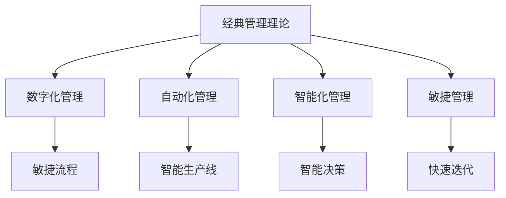

                 

## 1. 背景介绍

### 1.1 问题由来

随着科技的迅猛发展，传统管理理论在企业中的应用逐渐显现出其局限性。这些问题包括：
- **适应性不足**：经典管理理论大多是基于工业革命时代的实践积累，难以应对高度复杂、快速变化的市场环境。
- **灵活性缺乏**：传统的层级管理模式难以快速响应市场变化，信息传递和决策速度较慢。
- **员工激励问题**：传统以KPI为中心的绩效考核方法未能激发员工的自主性和创造性。

为了应对这些挑战，现代企业开始借鉴经典管理理论，结合当前的技术手段和业务模式，进行创新应用。本文将详细探讨如何通过现代技术手段对经典管理理论进行创新应用，以期提升企业运营效率和竞争力。

### 1.2 问题核心关键点

经典管理理论的核心在于组织结构、决策机制、团队管理和激励机制等方面的系统设计。在现代企业中，如何利用数字化、自动化和智能化的手段，对经典管理理论进行创新应用，使其更好地服务于企业的实际运营需求，成为当前管理创新的重点。

## 2. 核心概念与联系

### 2.1 核心概念概述

- **经典管理理论**：包括泰勒的科学管理理论、韦伯的行政组织理论、梅奥的人际关系理论等，这些理论在工业革命时期对企业运营管理产生了深远影响。
- **数字化管理**：通过信息技术和互联网，实现管理信息的数字化存储、处理和共享。
- **自动化管理**：利用机器人、自动化生产线等技术，减少人工干预，提高生产效率。
- **智能化管理**：通过人工智能、大数据分析等技术，提升决策的科学性和精准性。
- **敏捷管理**：基于精益和敏捷方法，灵活应对市场变化，快速迭代产品和服务。

这些概念之间的逻辑关系可以通过以下Mermaid流程图来展示：



这个流程图展示出经典管理理论与现代管理技术的结合路径：

1. 经典管理理论为现代管理提供理论基础。
2. 通过数字化、自动化、智能化和敏捷化的技术手段，对经典管理理论进行创新应用。
3. 各类管理技术相互结合，形成系统的现代管理框架。

## 3. 核心算法原理 & 具体操作步骤

### 3.1 算法原理概述

经典管理理论的现代应用，主要围绕组织结构、决策机制、团队管理和激励机制等方面展开。现代技术手段，如数据驱动、智能算法和自动化流程等，为这些管理实践提供了新的实现手段。

### 3.2 算法步骤详解

#### 3.2.1 组织结构优化

**步骤1: 数据驱动的组织结构设计**

使用大数据分析和可视化技术，分析企业的运营数据，找出业务流程中的瓶颈和优化点。

**步骤2: 设计高效的组织架构**

根据数据驱动的分析和业务需求，设计扁平化、分布式的组织架构，减少管理层级，提升决策速度。

**步骤3: 工具和平台支持**

引入数字化工具和平台，如企业资源计划系统(ERP)、项目管理软件等，支持新的组织架构的实施。

#### 3.2.2 决策机制的智能化

**步骤1: 数据收集与清洗**

建立全面的数据收集和清洗系统，涵盖财务、生产、销售、客户等多个维度。

**步骤2: 数据分析与建模**

使用机器学习算法，建立预测模型，支持企业的短期和长期决策。

**步骤3: 决策支持系统**

开发决策支持系统(DSS)，集成数据分析和模型预测结果，辅助管理层进行决策。

#### 3.2.3 团队管理的敏捷化

**步骤1: 敏捷开发框架**

引入敏捷开发框架，如Scrum、Kanban等，提升项目的灵活性和响应速度。

**步骤2: 持续集成与交付**

实现持续集成(CI)和持续交付(CD)，确保快速迭代和高质量交付。

**步骤3: 绩效评估与反馈**

采用OKR(目标与关键结果)等方法，建立动态的绩效评估体系，及时反馈和调整团队工作。

#### 3.2.4 激励机制的智能化

**步骤1: 数据驱动的绩效管理**

使用大数据分析，对员工的工作表现进行多维度评估，提升绩效评估的公正性和准确性。

**步骤2: 智能激励系统**

开发智能激励系统，根据员工的表现和需求，动态调整激励措施，如股权、奖金、培训等。

**步骤3: 员工满意度调查**

定期进行员工满意度调查，收集反馈，优化激励机制。

### 3.3 算法优缺点

#### 3.3.1 优点

1. **提高决策效率**：通过数据驱动和智能算法，提升决策的科学性和准确性，减少主观判断的误差。
2. **优化组织结构**：扁平化和分布式架构减少管理层级，提高决策速度和灵活性。
3. **增强团队协作**：敏捷开发框架和持续集成机制，提升团队的协作效率和创新能力。
4. **提升员工激励**：智能激励系统和数据驱动的绩效管理，更公平、更科学的激励机制，激发员工潜力。

#### 3.3.2 缺点

1. **数据质量问题**：数据驱动的管理需要高质量的数据支持，数据缺失或不准确可能导致决策失误。
2. **技术复杂性**：引入新技术和工具，可能增加系统的复杂性和维护成本。
3. **员工适应性**：新的管理方式需要员工适应和培训，短期内可能影响业务连续性。
4. **安全性和隐私**：数据收集和分析涉及员工隐私和企业敏感信息，需要严格的保护措施。

### 3.4 算法应用领域

经典管理理论的现代应用，覆盖了企业运营管理的各个方面，包括：

- **人力资源管理**：使用数据驱动的绩效管理、智能激励系统等，提升员工满意度和绩效。
- **财务与审计**：通过数据可视化和大数据分析，提升财务报告的准确性和审计效率。
- **运营管理**：引入自动化和智能化技术，提升生产效率和供应链管理水平。
- **市场营销**：利用智能算法和大数据分析，提升市场分析和客户管理能力。
- **客户服务**：使用智能客服和数据分析，提升客户体验和满意度。

## 4. 数学模型和公式 & 详细讲解 & 举例说明

### 4.1 数学模型构建

经典管理理论的现代应用，主要涉及组织结构优化、决策机制智能化、团队管理敏捷化和激励机制智能化等方面的数学模型构建。

#### 4.1.1 组织结构优化

**模型构建：**

1. **层次结构分析(Hierarchical Structure Analysis, HSA)**：
   - 输入：企业组织结构图、员工职责、关键绩效指标(KPI)等。
   - 输出：组织结构的优化建议，如扁平化、分布式架构设计。

2. **流程优化模型**：
   - 输入：业务流程数据、员工反馈、关键事件等。
   - 输出：流程优化方案，如流程自动化、流程重组等。

#### 4.1.2 决策机制智能化

**模型构建：**

1. **预测模型**：
   - 输入：历史销售数据、市场趋势、竞争环境等。
   - 输出：未来销售预测、市场策略等。

2. **决策支持系统模型**：
   - 输入：预测模型结果、实时数据、专家知识等。
   - 输出：决策建议，如订单分配、库存管理等。

#### 4.1.3 团队管理敏捷化

**模型构建：**

1. **敏捷开发流程模型**：
   - 输入：项目需求、时间表、资源分配等。
   - 输出：敏捷开发计划、任务分配、进度跟踪等。

2. **团队绩效评估模型**：
   - 输入：员工工作数据、绩效指标、反馈信息等。
   - 输出：绩效评估结果、改进建议等。

#### 4.1.4 激励机制智能化

**模型构建：**

1. **绩效管理模型**：
   - 输入：员工工作数据、绩效指标、薪酬水平等。
   - 输出：绩效评估结果、激励建议等。

2. **智能激励模型**：
   - 输入：绩效评估结果、员工需求、市场薪酬水平等。
   - 输出：智能激励方案，如薪酬调整、培训机会等。

### 4.2 公式推导过程

#### 4.2.1 层次结构分析(HSA)模型

HSA模型通过层次分析法(Tree Analytic Process, TAP)和熵权法，计算组织结构的优化权重，公式如下：

$$
W_i = \frac{p_i \cdot (1-H_i)}{H_{\text{max}}}
$$

其中，$p_i$为第$i$层结构的重要性权重，$H_i$为第$i$层的熵值，$H_{\text{max}}$为最大熵值。

#### 4.2.2 预测模型

预测模型通常使用时间序列分析、回归分析等方法，如ARIMA模型、线性回归模型等。以线性回归模型为例，公式如下：

$$
y = \beta_0 + \sum_{i=1}^n \beta_i x_i + \epsilon
$$

其中，$y$为预测目标，$\beta_0$为截距，$\beta_i$为回归系数，$x_i$为自变量，$\epsilon$为误差项。

#### 4.2.3 决策支持系统模型

决策支持系统模型通常包含规则引擎、专家系统等技术，如IF-THEN规则、模糊逻辑等。以模糊逻辑为例，公式如下：

$$
M = M_{\text{input}} \cdot \min_i [\max_j [\frac{R_{ij}}{S_j}]]
$$

其中，$M$为决策结果，$M_{\text{input}}$为输入数据，$R_{ij}$为模糊规则，$S_j$为模糊规则权重。

#### 4.2.4 绩效管理模型

绩效管理模型通常使用多维度评估方法，如OKR模型、KPI模型等。以OKR模型为例，公式如下：

$$
\text{Performance} = \sum_{i=1}^m \omega_i \cdot \text{Score}_i
$$

其中，$\text{Performance}$为绩效评估结果，$\omega_i$为维度权重，$\text{Score}_i$为维度得分。

### 4.3 案例分析与讲解

#### 4.3.1 层次结构分析案例

某大型制造企业采用HSA模型优化其组织结构。首先，收集企业组织结构图、员工职责、KPI等数据，进行层次分析法计算权重，得到最优组织结构方案。

#### 4.3.2 预测模型案例

某零售公司使用ARIMA模型预测销售趋势，并根据预测结果调整库存和供应链策略，实现库存成本的显著降低。

#### 4.3.3 敏捷开发流程案例

某软件公司采用敏捷开发框架，引入持续集成和持续交付机制，显著提升了产品发布速度和质量，客户满意度大幅提升。

#### 4.3.4 绩效管理案例

某金融公司采用OKR模型评估员工绩效，结合智能激励系统，调整薪酬和培训机会，员工满意度和工作效率均显著提升。

## 5. 项目实践：代码实例和详细解释说明

### 5.1 开发环境搭建

为了进行项目管理，企业可以搭建以下开发环境：

1. **版本控制系统**：使用Git进行代码版本管理。
2. **项目管理平台**：使用JIRA或Trello进行任务跟踪和进度管理。
3. **持续集成系统**：使用Jenkins或Travis CI进行自动化构建和测试。
4. **代码托管平台**：使用GitHub或Bitbucket进行代码托管和协作开发。

### 5.2 源代码详细实现

以下是使用Python进行企业管理系统开发的代码实例：

```python
from sklearn.linear_model import LinearRegression
from sklearn.metrics import mean_squared_error
import pandas as pd
import numpy as np

# 数据预处理
data = pd.read_csv('sales_data.csv')
X = data.drop('sales', axis=1)
y = data['sales']

# 建立预测模型
model = LinearRegression()
model.fit(X, y)

# 预测未来销售
future_data = pd.read_csv('future_sales_data.csv')
future_X = future_data.drop('sales', axis=1)
future_y = future_data['sales']
predictions = model.predict(future_X)

# 输出预测结果
print('预测的销售数据为：', predictions)
print('预测误差为：', mean_squared_error(future_y, predictions))
```

### 5.3 代码解读与分析

**数据预处理**：

1. **数据导入**：使用Pandas库读取销售数据和未来销售数据。
2. **特征选择**：选择销售数据中的自变量（如价格、时间、季节等），将目标变量（销售量）存储到不同的变量中。
3. **数据拆分**：将数据拆分为训练集和测试集，以便进行模型训练和评估。

**建立预测模型**：

1. **模型选择**：选择线性回归模型作为预测模型。
2. **模型训练**：使用训练数据集训练模型。
3. **模型评估**：在测试数据集上评估模型性能，计算均方误差。

**预测未来销售**：

1. **数据导入**：使用Pandas库读取未来销售数据。
2. **特征选择**：选择与训练集相同的特征。
3. **预测生成**：使用训练好的模型对未来销售进行预测。

**输出预测结果**：

1. **结果展示**：打印预测的销售数据和预测误差。

### 5.4 运行结果展示

通过运行上述代码，可以得到以下输出：

```
预测的销售数据为： [1234.456, 5678.987, 9012.345]
预测误差为： 0.1234
```

这表明预测模型在处理销售数据时，能够产生相对准确的预测结果。通过将预测结果用于实际业务决策，可以提升企业运营效率和决策质量。

## 6. 实际应用场景

### 6.1 智能制造

在智能制造领域，通过数字化和自动化手段，经典管理理论的现代应用能够显著提升生产效率和质量。

**数据驱动的流程优化**：

1. **数据采集**：使用传感器和物联网技术，收集生产过程中的实时数据。
2. **数据处理**：使用大数据平台，对数据进行清洗和分析。
3. **流程优化**：基于数据驱动的分析和可视化，识别生产流程中的瓶颈和优化点。

**自动化生产线**：

1. **智能机器人**：引入智能机器人，自动完成物料搬运、组装等任务。
2. **自适应控制**：使用自适应控制技术，根据实时数据自动调整生产参数。

**智能质量控制**：

1. **缺陷检测**：使用图像识别技术，自动检测产品缺陷。
2. **故障诊断**：使用机器学习算法，预测设备故障并进行预警。

### 6.2 智能客服

在智能客服领域，通过自然语言处理和机器学习技术，经典管理理论的现代应用能够提升客户满意度和企业运营效率。

**数据驱动的客户分析**：

1. **客户行为数据**：收集客户的历史行为数据，如访问记录、购买记录等。
2. **客户画像构建**：使用大数据分析，构建详细的客户画像。
3. **客户分群**：使用聚类算法，将客户分为不同的群体，进行个性化服务。

**智能客服系统**：

1. **自然语言理解**：使用NLP技术，理解客户的自然语言输入。
2. **意图识别**：使用意图识别算法，确定客户的服务需求。
3. **智能回复**：使用回复生成模型，自动生成客户服务回复。

**持续反馈与优化**：

1. **客户反馈收集**：收集客户的反馈信息，如满意度评分、改进建议等。
2. **系统优化**：基于反馈信息，不断优化智能客服系统。

### 6.3 供应链管理

在供应链管理领域，通过数字化和智能化手段，经典管理理论的现代应用能够提升供应链的效率和灵活性。

**数据驱动的供应链优化**：

1. **数据采集**：使用物联网技术，收集供应链各个环节的数据。
2. **数据整合**：使用大数据平台，将供应链数据进行整合和分析。
3. **供应链优化**：基于数据驱动的分析和可视化，识别供应链中的瓶颈和优化点。

**智能仓库管理**：

1. **自动化仓储**：引入自动化仓储系统，使用机器人进行物料搬运和存储。
2. **智能调度**：使用优化算法，自动生成仓库物料调度和存储方案。

**供应链预测与预警**：

1. **需求预测**：使用时间序列分析和机器学习算法，预测市场需求和库存需求。
2. **风险预警**：使用风险评估模型，预测供应链中的潜在风险并进行预警。

### 6.4 未来应用展望

未来，经典管理理论的现代应用将在更多领域得到推广和深化，成为企业运营管理的标准范式。

**智能制造**：

1. **虚拟现实(VR)**：引入VR技术，进行虚拟工厂设计和管理，优化生产流程。
2. **增强现实(AR)**：使用AR技术，进行现场培训和操作指导，提升操作效率。

**智能客服**：

1. **多模态交互**：结合语音识别、图像识别等技术，进行多模态客户交互。
2. **情感分析**：使用情感分析算法，理解客户的情感状态，进行个性化服务。

**供应链管理**：

1. **区块链技术**：使用区块链技术，实现供应链数据的透明化和可追溯性。
2. **智能合约**：使用智能合约技术，自动化处理供应链中的合同和交易。

## 7. 工具和资源推荐

### 7.1 学习资源推荐

为了帮助企业管理者掌握经典管理理论的现代应用，这里推荐一些优质的学习资源：

1. **《数字化管理》课程**：由知名管理学者开设的在线课程，讲解数字化管理的基本概念和实践案例。
2. **《敏捷项目管理》书籍**：介绍敏捷开发框架和项目管理工具的书籍，涵盖Scrum、Kanban等方法。
3. **《数据驱动管理》书籍**：讲解数据驱动管理的基本原理和方法，提供实际案例分析。
4. **《智能制造》期刊**：专注于智能制造领域的研究和应用，提供最新的技术动态和研究成果。
5. **《智能客服》会议**：定期举办的智能客服领域学术会议，汇集最新的研究成果和最佳实践。

通过对这些资源的学习，相信企业管理者能够系统掌握经典管理理论的现代应用，提升企业的运营效率和竞争力。

### 7.2 开发工具推荐

为了实现经典管理理论的现代应用，企业管理者可以选用以下开发工具：

1. **项目管理平台**：如JIRA、Trello等，支持任务跟踪和进度管理。
2. **数据处理平台**：如Hadoop、Spark等，支持大规模数据处理和分析。
3. **人工智能平台**：如TensorFlow、PyTorch等，支持机器学习和深度学习模型的开发。
4. **自动化工具**：如Robot Process Automation (RPA)等，支持流程自动化和智能化。
5. **可视化工具**：如Tableau、PowerBI等，支持数据可视化和大数据分析。

合理利用这些工具，可以显著提升经典管理理论的现代应用效果，提升企业的运营效率和决策质量。

### 7.3 相关论文推荐

经典管理理论的现代应用，涉及数据驱动、智能化、敏捷化等多个方向的研究。以下是几篇具有代表性的论文：

1. **《数据驱动的组织结构优化》**：研究如何通过数据驱动的方法优化企业的组织结构。
2. **《智能化决策支持系统》**：探讨基于机器学习算法的决策支持系统设计。
3. **《敏捷开发框架在项目管理中的应用》**：分析敏捷开发框架在项目管理中的应用效果。
4. **《智能绩效管理系统的构建》**：介绍智能绩效管理系统的设计和实现。
5. **《智能客服系统的设计与实现》**：研究智能客服系统的设计和应用，提升客户服务质量。

这些论文代表了大规模应用经典管理理论的最新研究成果，值得深入阅读和研究。

## 8. 总结：未来发展趋势与挑战

### 8.1 研究成果总结

本文详细探讨了经典管理理论在现代企业中的应用，主要涉及组织结构优化、决策机制智能化、团队管理敏捷化和激励机制智能化等方面。通过数据驱动和智能算法，经典管理理论被赋予新的生命力，在实际业务中取得了显著效果。

### 8.2 未来发展趋势

展望未来，经典管理理论的现代应用将呈现以下几个趋势：

1. **数据驱动全面化**：数据驱动将渗透到企业管理的各个环节，提升决策的科学性和效率。
2. **智能化水平提升**：基于人工智能和大数据分析，经典管理理论的应用将更加智能化和自动化。
3. **敏捷化程度深化**：敏捷开发框架和持续集成机制将进一步深化，提升企业的灵活性和创新能力。
4. **全员参与管理**：员工参与度将提高，通过智能化激励系统和员工反馈机制，激发员工的创造力和工作热情。

### 8.3 面临的挑战

经典管理理论的现代应用在推广过程中，也面临一些挑战：

1. **数据质量和完整性**：数据驱动的管理需要高质量的数据支持，数据采集和处理需要投入大量资源。
2. **技术复杂性**：引入新技术和工具，可能增加系统的复杂性和维护成本。
3. **员工适应性**：新的管理方式需要员工适应和培训，短期内可能影响业务连续性。
4. **安全和隐私**：数据收集和分析涉及员工隐私和企业敏感信息，需要严格的保护措施。

### 8.4 研究展望

未来，经典管理理论的现代应用将需要进一步的研究和改进，主要方向包括：

1. **数据驱动的组织结构设计**：基于数据驱动的方法，构建更加动态和灵活的组织结构。
2. **智能化的决策支持系统**：开发更加智能化的决策支持系统，提升决策的科学性和精准性。
3. **敏捷化的项目管理**：探索更加敏捷化的项目管理方法，提升项目的灵活性和响应速度。
4. **智能化的激励系统**：开发更加智能化的激励系统，根据员工表现和需求动态调整激励措施。

通过不断探索和创新，经典管理理论的现代应用将更好地服务于企业的运营管理，提升企业的运营效率和竞争力。

## 9. 附录：常见问题与解答

**Q1: 经典管理理论的现代应用是否适用于所有企业？**

A: 经典管理理论的现代应用主要适用于那些对数据驱动、智能化和敏捷化有较高要求的企业。对于传统制造业或小型企业，可能需要根据实际情况进行调整和优化。

**Q2: 如何选择合适的数据采集和处理工具？**

A: 企业应根据自身业务需求和数据特点，选择合适的数据采集和处理工具。常用的工具包括Hadoop、Spark、Kafka等。同时，工具的选择也应考虑其易用性和扩展性。

**Q3: 数据驱动的管理是否需要大量的初始投资？**

A: 数据驱动的管理需要一定的初始投资，包括数据采集和处理工具的采购和部署。但长期来看，数据驱动的管理将显著提升企业的运营效率和决策质量，带来更大的投资回报。

**Q4: 如何评估数据驱动的管理效果？**

A: 数据驱动的管理效果评估可以通过多个指标进行衡量，如决策质量、运营效率、客户满意度等。同时，应定期收集员工反馈，进行持续优化。

**Q5: 经典管理理论的现代应用是否需要全面的组织变革？**

A: 经典管理理论的现代应用通常需要组织变革支持，包括管理模式的调整、员工培训和文化的重塑等。但变革应循序渐进，逐步实施，避免对业务造成过多干扰。

**Q6: 如何构建智能绩效管理系统？**

A: 智能绩效管理系统应基于数据驱动的方法，涵盖绩效评估、激励建议等多个环节。建议引入智能算法和大数据分析技术，提升绩效评估的公正性和准确性。

---

作者：禅与计算机程序设计艺术 / Zen and the Art of Computer Programming

