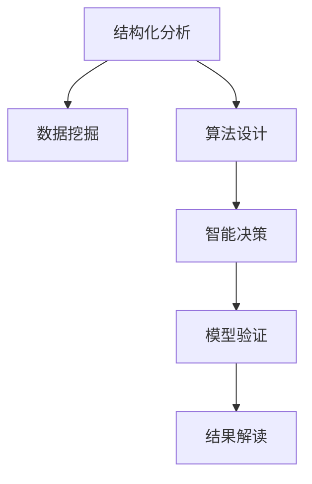

                 

## 1. 背景介绍

### 1.1 问题由来
结构化思维（Structured Thinking），作为一种系统化、条理化的思维方法，在问题解决、决策分析、项目管理等诸多领域中有着广泛的应用。然而，随着信息量的爆炸式增长和处理任务的多样化，结构化思维的实践正面临着新的挑战和机遇。

在科技领域，结构化思维的内核在于如何将复杂问题分解为可操作的小问题，并逐步求解。通过逻辑推理、数据分析、模型验证等步骤，结构化思维旨在找到最优解决方案。尤其在AI和数据科学领域，结构化思维对于处理大规模数据集、设计高效算法、实现智能决策具有重要意义。

### 1.2 问题核心关键点
当前，结构化思维的主要应用领域包括但不限于：
1. **数据科学**：通过结构化分析方法，构建数据模型，提取数据特征，进行预测和分类。
2. **机器学习**：利用结构化推理，设计算法模型，优化参数，提升模型性能。
3. **软件工程**：在需求分析、系统设计、代码优化等方面，应用结构化思维，确保项目的科学性和可维护性。
4. **业务分析**：通过结构化数据分析，挖掘业务规律，制定战略决策。

然而，结构化思维的复杂性和抽象性，使得其应用在具体场景中仍面临诸多挑战，如数据清洗、算法设计、结果解读等。因此，掌握结构化思维的内核，并结合实际应用，成为提升技术能力的关键。

### 1.3 问题研究意义
研究结构化思维的核心原理与应用，有助于：
1. **提升问题解决能力**：通过系统化分析，找到问题的本质，逐步求解。
2. **优化算法设计**：结构化推理帮助设计高效算法，提升模型性能。
3. **促进技术创新**：结构化思维与数据科学、人工智能等领域相结合，带来新的研究视角和方法。
4. **实现科学决策**：结合业务需求，通过结构化分析，制定合理的决策方案。

## 2. 核心概念与联系

### 2.1 核心概念概述

为了深入理解结构化思维，本节将介绍几个关键概念及其相互关系：

1. **结构化分析**：将复杂问题分解为可操作的小问题，逐步求解。
2. **数据挖掘**：从大量数据中提取有用信息，构建模型，进行预测和分类。
3. **算法设计**：通过结构化推理，设计高效算法，优化模型参数。
4. **智能决策**：结合业务需求，通过结构化分析，制定最优决策方案。
5. **模型验证**：使用测试数据集，验证模型的泛化能力，提升模型性能。
6. **结果解读**：解释模型输出结果，分析原因，指导后续优化。

这些核心概念之间的逻辑关系可以通过以下Mermaid流程图来展示：



该流程图展示了结构化思维在问题解决中的核心步骤，从分析到挖掘，再到设计、决策、验证和解读，每一步都是前一步的深化和细化。

## 3. 核心算法原理 & 具体操作步骤
### 3.1 算法原理概述

结构化思维的核心在于系统化、条理化的分析和决策过程。其核心算法原理主要包括以下几个方面：

1. **分解与重构**：将复杂问题分解为可操作的小问题，通过层层递进的方式，逐步求解。
2. **数据驱动**：利用数据挖掘和数据分析，提取有价值的信息，构建模型。
3. **模型选择**：根据问题特点，选择最合适的模型和算法。
4. **参数优化**：通过算法设计和模型训练，优化模型参数，提升模型性能。
5. **结果验证**：使用测试数据集，验证模型的泛化能力，保证模型可靠。

### 3.2 算法步骤详解

基于结构化思维的算法步骤主要包括以下几个关键环节：

**Step 1: 问题定义**
- 明确问题，定义目标。将复杂问题拆解为若干子问题，确保每个子问题清晰明确。

**Step 2: 数据收集与预处理**
- 收集相关数据，进行清洗、筛选、处理，确保数据质量。
- 采用数据挖掘技术，如聚类、分类、关联规则等，提取有用信息。

**Step 3: 模型设计与训练**
- 根据问题特点，选择合适的模型和算法。
- 设计算法，进行模型训练，调整参数，优化模型性能。

**Step 4: 模型评估与验证**
- 使用测试数据集，评估模型性能。
- 进行模型验证，确保模型泛化能力。

**Step 5: 结果解读与优化**
- 解释模型输出结果，分析原因。
- 根据结果反馈，进一步优化模型，提升模型性能。

### 3.3 算法优缺点

结构化思维的算法具有以下优点：
1. 系统化、条理化：通过系统化分析，确保每个环节的逻辑清晰。
2. 数据驱动：利用数据挖掘，提取有价值的信息，提高决策的科学性。
3. 模型优化：通过算法设计和模型训练，提升模型性能，确保结果可靠。
4. 结果验证：通过模型验证，确保模型泛化能力，减少过拟合风险。

同时，结构化思维的算法也存在一定的局限性：
1. 复杂度高：在处理复杂问题时，需要设计多层次的分析框架。
2. 数据需求大：数据挖掘需要大量数据支持，数据收集和处理成本较高。
3. 模型选择难：选择合适模型和算法，需要丰富的经验和专业知识。
4. 时间消耗长：模型设计、训练、验证等步骤，耗时较长。

尽管存在这些局限性，但结构化思维的算法范式仍是大规模数据分析和决策分析的主要依据。未来相关研究的重点在于如何进一步降低算法复杂度，提高算法效率，同时兼顾结果的科学性和可解释性。

### 3.4 算法应用领域

结构化思维的算法在数据科学、机器学习、软件工程、业务分析等多个领域得到了广泛应用，具体如下：

1. **数据科学**：在数据清洗、特征提取、模型构建等环节，应用结构化思维，确保数据处理和模型设计的科学性。
2. **机器学习**：在特征选择、模型训练、参数优化等环节，通过结构化推理，提升模型性能。
3. **软件工程**：在需求分析、系统设计、代码优化等环节，应用结构化思维，提升软件质量与维护性。
4. **业务分析**：在数据分析、业务决策等环节，利用结构化思维，制定科学合理的决策方案。

## 4. 数学模型和公式 & 详细讲解 & 举例说明

### 4.1 数学模型构建

为了更好地理解结构化思维的算法原理，本节将使用数学语言对结构化分析、数据挖掘、模型设计等核心环节进行严格的刻画。

假设问题为 $P$，定义数据集为 $D=\{(x_i, y_i)\}_{i=1}^N$，其中 $x_i$ 为输入特征，$y_i$ 为目标标签。

### 4.2 公式推导过程

以回归问题为例，其目标是最小化预测值与真实值之间的差距，即：

$$
\min_{\theta} \sum_{i=1}^N (y_i - \hat{y}_i)^2
$$

其中 $\hat{y}_i$ 为模型对输入 $x_i$ 的预测值，$\theta$ 为模型参数。常见的回归模型有线性回归、多项式回归、决策树回归等，其具体形式和推导过程如下：

**线性回归模型**：

$$
\hat{y} = w_0 + \sum_{j=1}^n w_j x_{ij}
$$

其损失函数为：

$$
\mathcal{L}(\theta) = \frac{1}{2} \sum_{i=1}^N (y_i - \hat{y}_i)^2
$$

**多项式回归模型**：

$$
\hat{y} = w_0 + \sum_{j=1}^m (w_{1j} x_{ij} + w_{2j} x_{ij}^2 + ... + w_{nj} x_{ij}^n)
$$

其损失函数为：

$$
\mathcal{L}(\theta) = \frac{1}{2} \sum_{i=1}^N (y_i - \hat{y}_i)^2
$$

**决策树回归模型**：

$$
\hat{y} = \sum_{k=1}^K c_k \mathbb{I}(x_i \in R_k)
$$

其中 $R_k$ 为决策树的第 $k$ 个叶节点，$c_k$ 为节点 $k$ 的预测值。

### 4.3 案例分析与讲解

以下以房价预测问题为例，展示结构化思维的应用过程：

1. **问题定义**：给定房屋特征 $x_1, x_2, ..., x_n$，预测其房价 $y$。
2. **数据收集与预处理**：收集历史房屋销售数据，进行清洗、筛选、处理，构建特征集 $D=\{(x_i, y_i)\}_{i=1}^N$。
3. **模型设计与训练**：选择线性回归模型，设计算法进行模型训练，优化参数。
4. **模型评估与验证**：使用测试数据集 $D_{test}$，评估模型性能，确保模型泛化能力。
5. **结果解读与优化**：解释模型输出结果，分析原因，进一步优化模型。

## 5. 项目实践：代码实例和详细解释说明

### 5.1 开发环境搭建

在进行结构化思维的算法实践前，我们需要准备好开发环境。以下是使用Python进行Scikit-Learn开发的环境配置流程：

1. 安装Anaconda：从官网下载并安装Anaconda，用于创建独立的Python环境。

2. 创建并激活虚拟环境：
```bash
conda create -n sklearn-env python=3.8 
conda activate sklearn-env
```

3. 安装Scikit-Learn：从官网获取安装命令，如：
```bash
conda install scikit-learn -c conda-forge
```

4. 安装各类工具包：
```bash
pip install numpy pandas matplotlib seaborn scikit-learn jupyter notebook ipython
```

完成上述步骤后，即可在`sklearn-env`环境中开始结构化思维的算法实践。

### 5.2 源代码详细实现

这里以线性回归模型为例，给出使用Scikit-Learn进行房价预测的Python代码实现。

首先，定义房价预测的数据处理函数：

```python
import pandas as pd
from sklearn.model_selection import train_test_split
from sklearn.linear_model import LinearRegression
from sklearn.metrics import mean_squared_error

def load_data():
    data = pd.read_csv('house_prices.csv')
    X = data[['area', 'rooms', 'location']]
    y = data['price']
    return X, y

def preprocess_data(X, y):
    X_train, X_test, y_train, y_test = train_test_split(X, y, test_size=0.2, random_state=42)
    return X_train, X_test, y_train, y_test

def train_model(X_train, y_train):
    model = LinearRegression()
    model.fit(X_train, y_train)
    return model

def evaluate_model(model, X_test, y_test):
    y_pred = model.predict(X_test)
    mse = mean_squared_error(y_test, y_pred)
    return mse
```

然后，定义训练和评估函数：

```python
def train_and_evaluate():
    X, y = load_data()
    X_train, X_test, y_train, y_test = preprocess_data(X, y)
    model = train_model(X_train, y_train)
    mse = evaluate_model(model, X_test, y_test)
    return mse
```

最后，启动训练流程并在测试集上评估：

```python
print(train_and_evaluate())
```

以上就是使用Scikit-Learn对线性回归模型进行房价预测的完整代码实现。可以看到，得益于Scikit-Learn的强大封装，我们可以用相对简洁的代码完成模型的构建和评估。

### 5.3 代码解读与分析

让我们再详细解读一下关键代码的实现细节：

**load_data函数**：
- 定义数据加载函数，读取CSV文件，提取特征和目标变量。

**preprocess_data函数**：
- 定义数据预处理函数，使用train_test_split将数据集划分为训练集和测试集，确保模型评估的科学性。

**train_model函数**：
- 定义模型训练函数，使用LinearRegression模型进行线性回归训练，优化模型参数。

**evaluate_model函数**：
- 定义模型评估函数，计算模型预测值与真实值之间的均方误差，评估模型性能。

**train_and_evaluate函数**：
- 定义完整的模型训练和评估流程，通过调用上述函数，完成模型的构建和性能评估。

可以看到，Scikit-Learn库的强大封装使得结构化思维的算法实现变得简洁高效。开发者可以将更多精力放在算法设计和优化上，而不必过多关注底层的实现细节。

当然，工业级的系统实现还需考虑更多因素，如模型的保存和部署、超参数的自动搜索、更灵活的算法设计等。但核心的结构化思维算法基本与此类似。

## 6. 实际应用场景

### 6.1 金融风险评估

在金融领域，结构化思维的应用可以显著提升风险评估的准确性和效率。传统的手工风险评估方法依赖于经验丰富的专家，但难以应对日益复杂和多变的金融市场。

具体而言，可以收集大量的金融数据，如股票价格、交易量、财务报表等，构建数据模型，进行风险评估。通过结构化分析，可以识别出潜在的风险因素，设计合适的风险评估模型，减少信息不对称，降低风险管理成本。

### 6.2 医疗疾病诊断

在医疗领域，结构化思维的应用可以提升疾病的早期诊断和治疗效果。传统的手工诊断方法依赖于医生的经验和知识，但难以应对海量患者数据和复杂症状。

具体而言，可以收集大量的患者数据，如病历、实验室检测结果、影像数据等，进行数据清洗和特征提取，构建诊断模型。通过结构化分析，可以识别出疾病的早期特征，设计合适的诊断模型，提高疾病的早期诊断率，降低误诊和漏诊风险。

### 6.3 智能推荐系统

在电商和娱乐等领域，结构化思维的应用可以提升用户推荐效果。传统的手工推荐方法依赖于用户的浏览历史和行为数据，但难以应对用户的多样化需求和个性化偏好。

具体而言，可以收集大量的用户行为数据，如浏览记录、评分、购买历史等，进行数据清洗和特征提取，构建推荐模型。通过结构化分析，可以识别出用户的兴趣点和行为规律，设计合适的推荐模型，提升推荐效果，满足用户的个性化需求。

### 6.4 未来应用展望

随着结构化思维的算法不断发展，其在实际应用中的潜力将进一步释放。未来，结构化思维将在更多领域得到应用，带来新的突破：

1. **自动化决策**：在复杂决策场景中，结构化思维的应用可以提升决策的科学性和准确性。
2. **智能推荐**：通过结构化分析，设计更加个性化、高效的推荐系统，提升用户体验。
3. **数据分析**：在海量数据中提取有价值的信息，构建数据模型，进行智能分析。
4. **模型优化**：通过结构化推理，设计高效算法，提升模型性能，降低计算成本。

总之，结构化思维的应用将带来数据驱动决策、智能推荐、自动化决策等新趋势，为各行各业带来革命性影响。相信随着算法的不断进步和应用场景的不断拓展，结构化思维必将在构建智能决策系统中扮演越来越重要的角色。

## 7. 工具和资源推荐

### 7.1 学习资源推荐

为了帮助开发者系统掌握结构化思维的内核，这里推荐一些优质的学习资源：

1. 《数据科学入门》系列书籍：全面介绍了数据科学的基础理论和实践技巧，涵盖数据清洗、特征提取、模型构建等环节。
2. 《机器学习实战》系列课程：斯坦福大学开设的机器学习课程，内容深入浅出，适合初学者入门。
3. 《Python数据科学手册》书籍：全面介绍了Python在数据科学中的应用，涵盖Scikit-Learn等常用工具的使用方法。
4. Kaggle平台：全球最大的数据科学竞赛平台，提供大量的数据集和经典竞赛案例，适合实战练习。
5. Coursera平台：提供众多数据科学和机器学习的在线课程，涵盖理论基础和实践技能。

通过对这些资源的学习实践，相信你一定能够快速掌握结构化思维的精髓，并用于解决实际的数据科学问题。

### 7.2 开发工具推荐

高效的开发离不开优秀的工具支持。以下是几款用于结构化思维算法开发的常用工具：

1. Python：基于Python的开源深度学习框架，灵活动态的计算图，适合快速迭代研究。
2. Scikit-Learn：基于Python的数据科学工具库，提供了丰富的数据挖掘、模型构建和评估工具。
3. Jupyter Notebook：免费的交互式开发环境，支持代码编写和结果展示，适合大数据分析。
4. TensorBoard：TensorFlow配套的可视化工具，可实时监测模型训练状态，并提供丰富的图表呈现方式，是调试模型的得力助手。
5. Weights & Biases：模型训练的实验跟踪工具，可以记录和可视化模型训练过程中的各项指标，方便对比和调优。

合理利用这些工具，可以显著提升结构化思维的算法实现效率，加快创新迭代的步伐。

### 7.3 相关论文推荐

结构化思维的算法发展源于学界的持续研究。以下是几篇奠基性的相关论文，推荐阅读：

1. 《统计学习方法》（李航）：全面介绍了统计学习的基础理论和算法实现，适合数据科学入门。
2. 《机器学习》（Tom Mitchell）：介绍了机器学习的经典算法和应用场景，适合理论研究。
3. 《深度学习》（Ian Goodfellow）：介绍了深度学习的基础理论和应用实践，适合算法设计。
4. 《Python数据科学手册》（Jake VanderPlas）：全面介绍了Python在数据科学中的应用，适合实际开发。
5. 《数据挖掘与统计学习》（Witten等）：介绍了数据挖掘和统计学习的基础理论和实践方法，适合实战练习。

这些论文代表了大规模数据分析和决策分析的发展脉络。通过学习这些前沿成果，可以帮助研究者把握学科前进方向，激发更多的创新灵感。

## 8. 总结：未来发展趋势与挑战

### 8.1 总结

本文对结构化思维的核心原理与应用进行了全面系统的介绍。首先阐述了结构化思维的研究背景和意义，明确了其在问题解决、算法设计、决策分析等方面的重要作用。其次，从原理到实践，详细讲解了结构化分析、数据挖掘、模型设计等核心步骤，给出了结构化思维的算法实现示例。同时，本文还广泛探讨了结构化思维在金融、医疗、电商等领域的实际应用，展示了结构化思维的广泛适用性。最后，本文精选了结构化思维的学习资源和开发工具，力求为读者提供全方位的技术指引。

通过本文的系统梳理，可以看到，结构化思维在数据科学、机器学习、业务分析等多个领域具有重要的应用价值，有助于提升问题解决能力、优化算法设计、实现科学决策。未来，伴随结构化思维的持续演进，必将进一步推动大数据分析、智能推荐、自动化决策等技术的发展，为各行各业带来更深层次的变革。

### 8.2 未来发展趋势

展望未来，结构化思维的发展趋势将呈现以下几个方向：

1. **自动化决策**：结构化思维的应用将进一步扩展到自动化决策领域，通过算法优化和智能分析，提升决策的科学性和效率。
2. **个性化推荐**：结构化思维的应用将扩展到个性化推荐系统，通过数据挖掘和模型构建，提升推荐效果，满足用户多样化需求。
3. **大规模数据分析**：结构化思维的应用将扩展到大规模数据分析领域，通过系统化分析，提升数据分析的科学性和准确性。
4. **跨领域融合**：结构化思维的应用将进一步扩展到多模态数据分析领域，通过融合视觉、语音、文本等不同模态的数据，实现更加全面、深入的智能分析。
5. **可解释性和公平性**：结构化思维的应用将进一步扩展到可解释性和公平性领域，通过模型解释和公平性分析，提升模型的可信度和适用性。

以上趋势凸显了结构化思维在数据科学、机器学习、业务分析等领域的重要应用前景，将进一步推动结构化思维的广泛应用，为各行各业带来深远影响。

### 8.3 面临的挑战

尽管结构化思维在实际应用中取得了显著效果，但在迈向更加智能化、普适化应用的过程中，仍面临诸多挑战：

1. **数据质量和多样性**：在处理海量数据时，需要确保数据的质量和多样性，避免数据偏差和信息缺失。
2. **模型复杂度**：在处理复杂问题时，需要设计多层次的结构化分析框架，确保模型的高效性和可解释性。
3. **计算资源消耗**：在处理大规模数据时，需要消耗大量的计算资源，如何优化算法效率，降低计算成本，将是重要的研究方向。
4. **结果解读和应用**：在实际应用中，如何解释模型的输出结果，将结果应用于实际问题，将是重要的挑战。
5. **公平性和可信性**：在处理敏感数据时，需要确保模型的公平性和可信度，避免歧视性和误导性。

这些挑战凸显了结构化思维在实际应用中需要不断优化和改进的方向，需要在数据质量、模型设计、计算资源、结果解读等方面不断探索和突破。

### 8.4 研究展望

面对结构化思维所面临的挑战，未来的研究需要在以下几个方面寻求新的突破：

1. **自动化数据处理**：开发自动化数据清洗和特征提取技术，提高数据处理效率。
2. **高效算法设计**：设计高效的算法和模型，优化计算资源消耗，提升算法性能。
3. **多模态数据融合**：研究多模态数据分析技术，实现视觉、语音、文本等不同模态数据的融合。
4. **可解释性增强**：通过模型解释和公平性分析，增强模型的可解释性和可信度。
5. **实时性和可扩展性**：研究实时数据处理和模型部署技术，提升系统的可扩展性和响应速度。

这些研究方向的探索，必将引领结构化思维的应用向更深层次发展，为各行各业带来革命性变革。相信随着算法的不断进步和应用场景的不断拓展，结构化思维必将在数据科学、机器学习、业务分析等众多领域发挥更大的作用。

