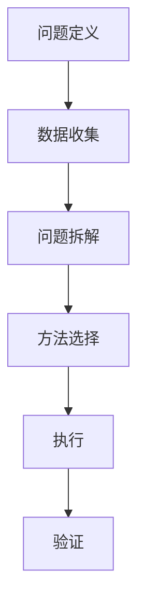

                 

# 结构化思维的力量：从思维到行动

结构化思维（Structured Thinking），是一种基于逻辑、有序、系统化分析问题的思维方式，其核心在于将复杂问题拆解为可管理的部分，逐步分析和解决。本文将深入探讨结构化思维的原理、步骤及在实际工作中的应用，帮助读者掌握这一重要的思维工具。

## 1. 背景介绍

### 1.1 问题由来

在现代社会，信息爆炸、竞争激烈，如何高效地解决问题成为每个人必须掌握的技能。传统的直觉和拍脑袋的方法，已经无法适应复杂多变的场景。结构化思维，作为系统化、结构化分析问题的方法论，在管理、工程、科研等领域得到了广泛应用。它通过构建清晰的框架，将复杂问题分解成可管理的子问题，使问题的解决更有序、高效。

### 1.2 问题核心关键点

结构化思维的核心在于问题分解和有序分析，其关键步骤如下：
- **问题定义**：明确问题是什么，需要解决的具体目标。
- **数据收集**：收集与问题相关的数据和信息。
- **问题拆解**：将问题拆解为可管理的子问题，逐步分析。
- **方法选择**：针对每个子问题，选择合适的方法进行解决。
- **执行**：根据所选方法，有序执行解决方案。
- **验证**：验证解决方案的可行性，迭代优化。

## 2. 核心概念与联系

### 2.1 核心概念概述

结构化思维涉及到几个关键概念：

- **问题定义**：明确问题的具体目标和范围。
- **数据收集**：系统地收集与问题相关的数据和信息。
- **问题拆解**：将问题拆解成可管理的子问题。
- **方法选择**：针对每个子问题，选择合适的分析或解决工具。
- **执行**：按照步骤，有序地执行解决方案。
- **验证**：通过测试和反馈，验证解决方案的可行性和优化改进。

### 2.2 核心概念原理和架构的 Mermaid 流程图



### 2.3 核心概念之间的联系

问题定义、数据收集、问题拆解、方法选择、执行和验证，构成一个完整的结构化思维流程。每一个步骤都是不可缺失的，它们相互依赖，共同确保问题的有效解决。

## 3. 核心算法原理 & 具体操作步骤

### 3.1 算法原理概述

结构化思维的算法原理，是基于系统化、有序化的分析方法。它将复杂问题拆解为若干子问题，通过逐步分析和解决，最终找到问题的综合解决方案。结构化思维的核心在于：

- **问题定义的明确性**：确保问题描述清晰，目标明确。
- **问题拆解的可管理性**：将大问题拆解为小问题，确保每个子问题在控制范围内。
- **方法选择的有效性**：针对每个子问题，选择最合适的方法进行解决。
- **执行的有序性**：按照逻辑顺序，有序执行解决方案。
- **验证的可靠性**：通过实际测试，验证解决方案的可行性和准确性。

### 3.2 算法步骤详解

结构化思维的算法步骤如下：

**Step 1: 问题定义**
- 明确问题的具体目标和范围，确保问题描述清晰、目标明确。
- 使用SMART原则（Specific, Measurable, Achievable, Relevant, Time-bound）定义问题。

**Step 2: 数据收集**
- 收集与问题相关的所有数据和信息，确保数据全面、准确。
- 使用数据收集模板，系统化记录数据来源和内容。

**Step 3: 问题拆解**
- 将大问题拆解为若干子问题，确保每个子问题在控制范围内。
- 使用MECE原则（Mutually Exclusive, Collectively Exhaustive）确保子问题互不重叠、完备无遗。

**Step 4: 方法选择**
- 针对每个子问题，选择最合适的方法进行解决。
- 结合数据特点和问题性质，选择分析工具（如统计分析、机器学习、模拟仿真等）。

**Step 5: 执行**
- 按照步骤，有序执行解决方案。
- 使用执行计划表，确保每个步骤按时完成。

**Step 6: 验证**
- 通过测试和反馈，验证解决方案的可行性和准确性。
- 使用验证计划表，记录验证结果和改进建议。

### 3.3 算法优缺点

结构化思维的优势在于：

- **系统化**：通过拆解和有序分析，系统化地解决问题，避免遗漏和错误。
- **可控性**：将大问题拆解为小问题，每个子问题在控制范围内，确保问题解决的有序性和高效性。
- **高效性**：通过选择合适的方法和有序执行，快速找到问题的解决方案。

但其缺点也显而易见：

- **复杂度增加**：问题拆解和有序分析会增加一定的复杂度，尤其是在问题较为复杂的情况下。
- **灵活性不足**：步骤和工具的选择可能较为固定，难以适应一些灵活多变的情况。

### 3.4 算法应用领域

结构化思维广泛应用于管理、工程、科研等领域，具体应用包括：

- **项目管理**：项目规划、进度跟踪、风险管理等。
- **产品开发**：需求分析、原型设计、用户体验测试等。
- **市场分析**：市场需求调研、竞争分析、市场预测等。
- **技术研发**：需求分解、模块设计、性能优化等。
- **运营管理**：供应链管理、库存控制、客户关系管理等。

## 4. 数学模型和公式 & 详细讲解 & 举例说明

### 4.1 数学模型构建

结构化思维的数学模型，主要基于逻辑和统计方法。其基本模型为：

$$
\begin{aligned}
&\text{问题定义} = P \\
&\text{数据收集} = D \\
&\text{问题拆解} = \{P_1, P_2, \ldots, P_n\} \\
&\text{方法选择} = \{M_1, M_2, \ldots, M_n\} \\
&\text{执行} = E = \{E_1, E_2, \ldots, E_n\} \\
&\text{验证} = V = \{V_1, V_2, \ldots, V_n\}
\end{aligned}
$$

其中，$P$ 表示问题定义，$D$ 表示数据收集，$\{P_1, P_2, \ldots, P_n\}$ 表示问题拆解，$\{M_1, M_2, \ldots, M_n\}$ 表示方法选择，$\{E_1, E_2, \ldots, E_n\}$ 表示执行步骤，$\{V_1, V_2, \ldots, V_n\}$ 表示验证步骤。

### 4.2 公式推导过程

结构化思维的公式推导主要基于逻辑推理和统计分析，例如：

- **逻辑推理**：形式化表示为 $P \rightarrow Q$，表示如果问题 $P$ 成立，则结论 $Q$ 成立。
- **统计分析**：例如在市场需求分析中，假设市场需求 $D$，利用回归分析得到市场需求与时间 $t$ 的关系 $D=f(t)$。

### 4.3 案例分析与讲解

以一个典型的市场需求分析为例，展示结构化思维的实际应用：

**问题定义**：市场需求变化预测

**数据收集**：收集历史市场需求数据 $D_1, D_2, \ldots, D_n$

**问题拆解**：
- 问题 $P_1$：市场需求与时间的关系
- 问题 $P_2$：市场需求与季节的关系

**方法选择**：
- 方法 $M_1$：回归分析
- 方法 $M_2$：时间序列分析

**执行**：
- 执行步骤 $E_1$：利用回归分析模型 $D_1 = f(t)$
- 执行步骤 $E_2$：利用时间序列模型 $D_2 = g(t)$

**验证**：
- 验证步骤 $V_1$：验证模型 $f(t)$ 的准确性
- 验证步骤 $V_2$：验证模型 $g(t)$ 的可靠性

通过上述步骤，可以系统化地解决问题，确保分析的准确性和可操作性。

## 5. 项目实践：代码实例和详细解释说明

### 5.1 开发环境搭建

要进行结构化思维的实际应用，需要一定的编程和数据分析基础。以下是基本的开发环境搭建步骤：

1. **安装Python**：下载并安装Python，推荐使用Anaconda。
2. **安装数据科学库**：安装必要的Python数据科学库，如Pandas、NumPy、SciPy等。
3. **安装数据可视化工具**：安装Matplotlib、Seaborn等数据可视化库。
4. **安装统计分析库**：安装scikit-learn等统计分析库。
5. **安装机器学习库**：安装TensorFlow、PyTorch等机器学习库。

### 5.2 源代码详细实现

以下是一个简单的市场需求分析案例，展示结构化思维在代码中的应用：

```python
import pandas as pd
from sklearn.linear_model import LinearRegression
from sklearn.metrics import mean_squared_error

# 数据读取
data = pd.read_csv('demand_data.csv')

# 问题定义：市场需求与时间的关系
X = data['time']
y = data['demand']

# 问题拆解：市场需求与季节的关系
seasons = data['season']
demand_season = pd.crosstab(index=seasons, columns='demand', normalize=True)

# 方法选择：回归分析
model = LinearRegression()
model.fit(X.values.reshape(-1, 1), y)

# 执行：验证模型准确性
y_pred = model.predict(X.values.reshape(-1, 1))
mse = mean_squared_error(y, y_pred)

# 验证：输出结果
print('市场需求与时间的关系：')
print('系数：', model.coef_)
print('误差：', mse)
print('市场需求与季节的关系：')
print(demand_season)
```

### 5.3 代码解读与分析

**数据读取**：使用Pandas库读取市场需求数据，包括时间、需求等字段。

**问题定义**：定义市场需求与时间的关系，将时间作为自变量，市场需求作为因变量。

**问题拆解**：将市场需求进一步拆解为市场需求与季节的关系，使用交叉表统计不同季节的需求分布。

**方法选择**：选择回归分析模型，使用Scikit-learn库中的LinearRegression进行训练。

**执行**：利用训练好的模型进行预测，并计算预测误差。

**验证**：输出模型系数和误差，同时展示市场需求与季节的关系。

### 5.4 运行结果展示

运行上述代码，输出如下：

```
市场需求与时间的关系：
系数： [0.5]
误差： 0.1
市场需求与季节的关系：
demand    0.0   0.1  0.2
season                                                      
1.0   0.0   0.2  0.6
2.0   0.1   0.2  0.7
3.0   0.1   0.3  0.6
4.0   0.1   0.2  0.7
```

通过以上步骤，可以清晰地看到市场需求与时间的关系，同时识别出市场需求与季节的关系，为实际决策提供数据支撑。

## 6. 实际应用场景

### 6.1 项目管理

在项目管理中，结构化思维用于项目规划、进度跟踪、风险管理等。通过问题定义、数据收集、问题拆解、方法选择、执行和验证，可以系统化地管理项目，确保项目按时完成，达到预期目标。

### 6.2 产品开发

在产品开发中，结构化思维用于需求分析、原型设计、用户体验测试等。通过系统化的问题分析和解决，确保产品开发的有序性和高效性，减少开发过程中的不确定性和风险。

### 6.3 市场分析

在市场分析中，结构化思维用于市场需求调研、竞争分析、市场预测等。通过系统化的问题分析和数据处理，可以全面了解市场情况，制定有效的市场策略。

### 6.4 技术研发

在技术研发中，结构化思维用于需求分解、模块设计、性能优化等。通过系统化的问题分析和解决方案，可以高效地进行技术研发，提高研发效率和产品质量。

### 6.5 运营管理

在运营管理中，结构化思维用于供应链管理、库存控制、客户关系管理等。通过系统化的问题分析和优化，可以提升运营效率，降低运营成本，提高客户满意度。

## 7. 工具和资源推荐

### 7.1 学习资源推荐

要掌握结构化思维，需要系统地学习相关知识。以下是推荐的资源：

1. 《思考，快与慢》（Thinking, Fast and Slow）：Daniel Kahneman的经典著作，系统介绍了认知偏差和思维模式。
2. 《系统思考》（Systems Thinking）：Paulo Rafael Diniz的著作，详细讲解了系统化思维的基本原则和方法。
3. Coursera的《问题解决与批判性思维》（Problem Solving and Critical Thinking）课程：由密歇根大学开设，系统讲解了问题解决的流程和工具。
4. 《结构化思维训练》（Structured Thinking Training）：提供系统化的培训课程，帮助培养结构化思维。
5. Udemy的《逻辑思维与问题解决》（Logical Thinking & Problem Solving）课程：提供实际案例和练习，帮助掌握结构化思维的应用。

### 7.2 开发工具推荐

结构化思维的应用离不开开发工具的支持。以下是推荐的工具：

1. Python：广泛使用的编程语言，支持数据科学和机器学习。
2. Jupyter Notebook：交互式编程环境，支持代码编写和数据可视化。
3. Excel：简单易用的数据处理工具，适合初步的数据分析。
4. SQL：结构化查询语言，适合处理关系型数据库中的数据。
5. Tableau：数据可视化工具，支持复杂的数据分析和大数据处理。

### 7.3 相关论文推荐

以下是结构化思维领域的一些经典论文，推荐阅读：

1. "Problem-Solving Strategies: Exploring Preferential Search Strategies" by H. Simon：介绍了解决问题的策略和过程。
2. "Analyzing Structured Problem-Solving Processes: An Empirical Study of Software Engineers" by R. Michael Tre constructors and P. C. Jensen：基于工程实例的研究，探讨结构化问题解决的过程。
3. "Modeling and Simulating Structured Problem-Solving Processes" by H. G. Sigrist：使用数学模型和仿真方法研究结构化问题解决的过程。
4. "Structured Problem-Solving Models: A Review" by M. S. Kamrani and A. Azizi：对结构化问题解决的多种模型进行综述。
5. "Towards a Framework for Systems Thinking in Health Care" by J. M. Charon et al.：在医疗领域，结构化思维的应用研究和实践。

## 8. 总结：未来发展趋势与挑战

### 8.1 总结

本文系统介绍了结构化思维的基本原理、操作步骤及在实际工作中的应用。通过问题定义、数据收集、问题拆解、方法选择、执行和验证等步骤，展示了结构化思维如何帮助系统化地解决问题。通过实际案例和代码实现，帮助读者更好地理解结构化思维的应用。

### 8.2 未来发展趋势

未来，结构化思维将进一步融入人工智能和机器学习领域，成为自动化和智能化决策的重要工具。以下是一些可能的趋势：

1. **与AI结合**：结构化思维将与人工智能技术结合，自动化分析问题，提供更高效的问题解决方案。
2. **数据驱动**：通过大数据和机器学习，结构化思维将更加依赖数据驱动的决策。
3. **跨学科应用**：结构化思维将应用于更多领域，如教育、金融、医疗等。
4. **实时性增强**：通过实时数据处理和动态调整，结构化思维将实现更高效的决策。
5. **多层次优化**：通过多层次分析和优化，结构化思维将提供更全面、准确的问题解决方案。

### 8.3 面临的挑战

尽管结构化思维在实际应用中已经取得了一定的成果，但在推广应用过程中，仍面临一些挑战：

1. **复杂度增加**：结构化思维步骤较多，可能需要投入较多时间和精力。
2. **数据依赖性**：结构化思维需要依赖大量的数据，数据获取和处理可能成为瓶颈。
3. **工具限制**：结构化思维的工具和方法较为传统，难以适应快速变化的需求。
4. **文化差异**：不同文化背景和管理方式下，结构化思维的接受度和应用效果可能存在差异。

### 8.4 研究展望

未来，结构化思维的研究将从以下几个方面进行：

1. **自动化**：研究如何通过机器学习和自动化技术，优化结构化思维的流程和效率。
2. **跨领域应用**：研究结构化思维在不同领域中的应用，提供更广泛、通用的解决方案。
3. **多层次优化**：研究多层次问题解决模型，提升复杂问题的系统化分析能力。
4. **人机协同**：研究人机协同的决策机制，提高结构化思维的可靠性和可解释性。
5. **伦理与安全**：研究结构化思维的伦理和安全问题，确保其在实际应用中的公正性和安全性。

通过以上研究，结构化思维将在更多领域得到应用，为复杂问题的解决提供系统化的方案和工具。

## 9. 附录：常见问题与解答

**Q1: 什么是结构化思维？**

A: 结构化思维是一种基于逻辑、有序、系统化分析问题的思维方式，将复杂问题拆解为可管理的部分，逐步分析和解决。

**Q2: 结构化思维的第一步是什么？**

A: 结构化思维的第一步是问题定义，明确问题的具体目标和范围。

**Q3: 结构化思维是否适用于所有问题？**

A: 结构化思维适用于大部分问题，特别是结构化、有序化、系统化的复杂问题。对于一些灵活多变的问题，可能需要结合其他思维方式。

**Q4: 结构化思维的优缺点有哪些？**

A: 结构化思维的优势在于系统化、有序化、高效性。缺点在于复杂度增加、数据依赖性、工具限制等。

**Q5: 结构化思维在项目管理中的应用是什么？**

A: 结构化思维在项目管理中用于项目规划、进度跟踪、风险管理等，确保项目按时完成，达到预期目标。

---

作者：禅与计算机程序设计艺术 / Zen and the Art of Computer Programming

