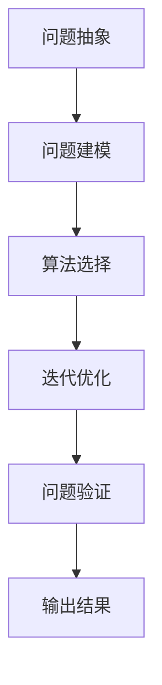

                 

## 1. 背景介绍

### 1.1 问题由来

在当今复杂多变的IT领域，面对快速迭代的业务需求、海量的数据和算法模型，如何构建一套结构化、系统化的思维方式来处理问题，成为了广大IT从业者面临的重大挑战。这不仅涉及到具体的编程实践，更涉及到思维方式的根本转变。

信息技术的应用场景多种多样，从互联网应用、大数据分析、人工智能到区块链等，每一个领域都有其独特的技术特点和挑战。然而，无论是哪个领域，其背后的技术原理和方法论都有其共通之处。结构化思维作为一种系统性、模块化的思维方式，能够帮助从业者从复杂的技术细节中抽离出来，洞察问题的本质，并构建出高效的解决方案。

### 1.2 问题核心关键点

结构化思维的核心在于：分解问题，逐步求解。具体来说，它包括以下几个方面：

1. **问题抽象**：从具体的业务需求中提炼出核心问题，将其分解为可管理的小问题。
2. **问题建模**：将小问题进行形式化建模，引入合适的算法和模型，构建问题求解路径。
3. **算法选择**：针对建模结果选择合适的算法，进行迭代优化。
4. **问题验证**：对算法输出结果进行验证和评估，确保其满足业务需求。
5. **迭代优化**：根据评估结果不断迭代优化算法，直至满足要求。

结构化思维不仅适用于IT领域的技术实践，更是一种通用的解决问题的方法论。通过掌握结构化思维，可以有效提高问题解决效率，促进技术创新，推动业务发展。

### 1.3 问题研究意义

在IT领域，掌握结构化思维的意义重大：

1. **提升技术水平**：结构化思维可以帮助开发者更好地理解复杂技术，构建出高效、可扩展的系统。
2. **加速项目进程**：通过问题分解和迭代优化，项目开发能够更加有条不紊地进行，避免因问题过于复杂而导致项目延期。
3. **提高问题解决能力**：结构化思维强调问题分解和逐步求解，有助于培养系统化思维和问题解决能力。
4. **促进技术创新**：结构化思维的模块化特性，使得技术创新更加容易实现，便于构建新的技术架构。
5. **推动业务发展**：结构化思维能够帮助企业更好地应对业务变化，推动业务增长。

## 2. 核心概念与联系

### 2.1 核心概念概述

为了深入理解结构化思维的原理和应用，本节将介绍几个关键概念：

- **分解与组合**：将复杂问题分解为可管理的小问题，通过组合实现整体求解。
- **系统设计**：将小问题构建为系统化的解决方案，包括算法、模型、接口等。
- **算法选择**：根据具体问题和业务需求，选择最合适的算法。
- **迭代优化**：通过不断的迭代测试和调整，优化算法和模型，直至满足要求。
- **问题验证**：对求解结果进行验证，确保其正确性和有效性。

这些概念之间存在紧密的联系，共同构成了结构化思维的核心框架。理解这些概念，有助于构建出高效的问题解决方案。

### 2.2 核心概念原理和架构的 Mermaid 流程图



以上流程图展示了结构化思维的基本流程：首先从问题中抽象出核心问题，然后构建系统化的模型，选择最合适的算法，进行迭代优化，最后对结果进行验证，最终得到有效的解决方案。

## 3. 核心算法原理 & 具体操作步骤

### 3.1 算法原理概述

结构化思维的核心在于问题分解与组合。具体来说，它通过将复杂问题分解为多个小问题，分别求解，并通过组合实现整体求解。这一过程可以用数学公式和算法语言进行形式化描述。

### 3.2 算法步骤详解

结构化思维的实现步骤如下：

1. **问题抽象**：从业务需求中抽象出核心问题，并将其分解为可管理的小问题。
2. **问题建模**：使用合适的算法和模型对小问题进行形式化建模，构建问题求解路径。
3. **算法选择**：根据具体问题和业务需求，选择合适的算法进行求解。
4. **迭代优化**：对算法和模型进行迭代测试和调整，优化求解路径。
5. **问题验证**：对求解结果进行验证，确保其正确性和有效性。
6. **输出结果**：将验证通过的求解结果进行组合，得到最终解决方案。

### 3.3 算法优缺点

结构化思维的优点包括：

1. **高效性**：通过问题分解和迭代优化，能够高效地解决问题。
2. **灵活性**：问题分解方式多样，可以根据具体需求选择不同的分解方式。
3. **可扩展性**：可以灵活地将问题分解为多个子问题，进行并行求解。
4. **可复用性**：将问题解决方案模块化，便于在类似问题中复用。

缺点包括：

1. **复杂度增加**：问题分解可能增加求解复杂度。
2. **依赖专业性**：问题建模和算法选择需要一定的专业知识和经验。
3. **迭代成本高**：迭代测试和优化可能耗时较长。

### 3.4 算法应用领域

结构化思维广泛应用于IT领域的多个方面，包括但不限于：

1. **软件开发**：软件开发中常面临功能复杂、需求变化等问题，通过结构化思维可以将问题分解为模块化的子问题，逐步解决。
2. **数据分析**：数据分析中需要处理海量数据，通过结构化思维可以将数据处理任务分解为数据清洗、特征工程、模型训练等小问题，分别解决。
3. **人工智能**：在AI领域，结构化思维用于构建复杂算法模型，进行特征工程和模型调参等。
4. **系统架构设计**：在构建复杂系统时，结构化思维用于设计模块化的架构，便于系统维护和扩展。
5. **项目管理**：项目管理中需要分解任务、分配资源，结构化思维用于构建任务图谱，优化项目管理流程。

## 4. 数学模型和公式 & 详细讲解 & 举例说明

### 4.1 数学模型构建

结构化思维的数学模型构建通常包括以下几个步骤：

1. **问题定义**：将问题定义为一个数学表达式或模型。
2. **变量定义**：定义变量，表示问题的输入和输出。
3. **模型构建**：构建数学模型，将问题转化为求解函数。
4. **约束条件**：定义约束条件，限制模型求解空间。
5. **求解算法**：选择合适的求解算法，计算模型输出。

### 4.2 公式推导过程

以线性回归模型为例，其基本公式为：

$$
y = w_0 + w_1x_1 + w_2x_2 + ... + w_nx_n
$$

其中，$y$ 表示输出变量，$x_i$ 表示输入变量，$w_i$ 表示权重系数。该公式通过最小化误差函数，求解权重系数 $w_i$，使得模型输出与实际输出尽可能接近。

### 4.3 案例分析与讲解

假设有一个电商平台，需要根据用户的历史浏览记录预测其购买概率。首先，将问题抽象为预测任务，然后分解为数据收集、特征工程、模型训练和模型评估等小问题。在数据收集阶段，对用户浏览记录进行整理和清洗；在特征工程阶段，选择重要的特征进行提取和转换；在模型训练阶段，使用线性回归模型进行训练；在模型评估阶段，使用验证集进行模型评估，并根据评估结果对模型进行调整。最终，得到一个预测准确率较高的模型，可以用于用户购买概率的预测。

## 5. 项目实践：代码实例和详细解释说明

### 5.1 开发环境搭建

为了进行项目实践，需要搭建一个开发环境。以下是一个基于Python和TensorFlow的示例：

1. 安装Python：下载并安装Python 3.x版本。
2. 安装TensorFlow：使用pip安装TensorFlow。
3. 配置开发环境：安装相关依赖库，如numpy、pandas、scikit-learn等。

### 5.2 源代码详细实现

以下是一个简单的线性回归模型的实现，使用TensorFlow进行构建和训练：

```python
import tensorflow as tf

# 定义模型
def linear_regression(x, y):
    model = tf.keras.Sequential([
        tf.keras.layers.Dense(units=1, input_shape=[1])
    ])
    model.compile(optimizer=tf.keras.optimizers.Adam(learning_rate=0.01), 
                  loss='mse', metrics=['mae'])
    model.fit(x, y, epochs=100, batch_size=32)
    return model

# 数据生成
x = [1, 2, 3, 4, 5, 6, 7, 8, 9, 10]
y = [3, 5, 7, 9, 11, 13, 15, 17, 19, 21]

# 调用模型
model = linear_regression(x, y)
print(model.predict([10]))
```

### 5.3 代码解读与分析

该代码展示了使用TensorFlow构建线性回归模型的全过程。首先，定义了一个包含一个全连接层的模型，然后使用Adam优化器进行模型训练。在训练过程中，使用均方误差损失函数和平均绝对误差作为评估指标。

## 6. 实际应用场景

### 6.1 软件开发

在软件开发中，结构化思维用于处理复杂的业务需求。例如，某电商平台的订单管理系统，需要处理订单生成、支付、发货等复杂流程。通过将问题分解为订单生成、订单支付和订单发货等子问题，逐步求解，并构建模块化的系统架构，可以高效地构建出稳定、可扩展的系统。

### 6.2 数据分析

在数据分析中，结构化思维用于处理海量数据。例如，某企业需要对用户的消费行为进行分析，通过将数据处理任务分解为数据清洗、特征提取和模型训练等小问题，并构建系统化的数据分析流程，可以高效地进行数据分析，提取有价值的信息。

### 6.3 人工智能

在人工智能领域，结构化思维用于构建复杂算法模型。例如，某语音识别系统需要识别用户语音，通过将问题分解为特征提取、模型训练和模型评估等子问题，并构建系统化的解决方案，可以高效地构建出性能优异的语音识别系统。

## 7. 工具和资源推荐

### 7.1 学习资源推荐

1. 《深入理解计算机系统》：该书详细介绍了计算机系统架构、操作系统、网络协议等基础知识，是构建系统化思维的重要工具。
2. 《算法导论》：该书介绍了多种经典算法及其应用，是掌握算法思维的重要资源。
3. 《结构化思维：从混沌到秩序》：本文作者撰写的书籍，全面介绍了结构化思维的基本原理和应用实践。
4. Coursera：提供大量计算机科学和数据科学相关课程，帮助学习者构建系统化思维。
5. GitHub：提供大量开源项目和代码，是学习结构化思维的重要资源。

### 7.2 开发工具推荐

1. Python：Python是一种高级编程语言，具有良好的可读性和可扩展性，广泛应用于数据分析、机器学习等领域。
2. TensorFlow：由Google开发的开源机器学习框架，支持多种机器学习模型，易于构建和优化。
3. Visual Studio Code：一款轻量级、功能强大的编程工具，支持多种编程语言和调试功能。
4. Jupyter Notebook：一款交互式编程工具，支持Python、R等多种语言，便于代码编写和实验。
5. Git：一种版本控制工具，支持多人协作开发，方便代码管理和版本控制。

### 7.3 相关论文推荐

1. 《计算机程序设计艺术》：本书由计算机图灵奖获得者高德纳撰写，全面介绍了计算机程序设计的各种原则和方法。
2. 《结构化思维：从混沌到秩序》：本文作者撰写的书籍，详细介绍了结构化思维的基本原理和应用实践。
3. 《分布式系统原理与设计》：该书详细介绍了分布式系统的设计原则和实践经验，是构建系统化思维的重要资源。
4. 《机器学习：原理、算法与应用》：该书介绍了机器学习的原理和算法，是掌握结构化思维的重要参考。

## 8. 总结：未来发展趋势与挑战

### 8.1 研究成果总结

结构化思维作为一种系统化的思维方式，在IT领域有着广泛的应用。通过问题分解和迭代优化，结构化思维能够高效地处理复杂问题，构建出稳定、可扩展的系统。随着技术的发展，结构化思维也将不断演化，应用于更多领域。

### 8.2 未来发展趋势

未来，结构化思维的发展趋势包括：

1. **自动化**：通过自动化工具和平台，实现问题求解的自动化，减少人工干预。
2. **智能化**：结合人工智能技术，实现问题求解的智能化，提高求解效率和精度。
3. **模块化**：将问题解决方案模块化，便于复用和扩展。
4. **跨领域**：结构化思维的应用将不再局限于IT领域，而是扩展到更多领域，如医疗、金融、教育等。
5. **集成化**：将结构化思维与其他技术手段（如区块链、大数据等）进行集成，构建更强大的解决方案。

### 8.3 面临的挑战

结构化思维在应用过程中也面临一些挑战：

1. **问题抽象难度高**：复杂问题往往难以抽象为小问题。
2. **算法选择困难**：选择合适的算法需要深厚的专业知识。
3. **迭代成本高**：迭代测试和调整可能耗时较长。
4. **依赖专业性**：结构化思维的应用需要高水平的专业知识。
5. **知识更新快**：技术发展迅速，需要不断更新知识和技能。

### 8.4 研究展望

未来，结构化思维的研究方向包括：

1. **自动化和智能化**：开发自动化工具和平台，实现问题求解的自动化和智能化。
2. **模块化和集成化**：构建模块化的解决方案，并与其他技术进行集成，形成更强大的系统。
3. **跨领域应用**：将结构化思维应用于更多领域，如医疗、金融、教育等。
4. **模型优化**：开发更高效、更准确的问题求解模型。
5. **知识更新**：不断更新知识，适应技术发展的需要。

## 9. 附录：常见问题与解答

**Q1：结构化思维和传统思维有何区别？**

A: 传统思维通常以直觉和经验为导向，缺乏系统化的分解和组合过程。而结构化思维强调问题分解和逐步求解，通过系统化的方式处理问题，从而提高解决问题的效率和准确性。

**Q2：结构化思维是否适用于所有问题？**

A: 结构化思维适用于大部分问题，尤其是复杂多变的问题。但对于一些简单明了的任务，可能没有必要进行分解和组合，直接解决即可。

**Q3：如何掌握结构化思维？**

A: 掌握结构化思维需要系统的学习，包括基础数学、计算机科学、数据分析等相关知识。同时，需要不断实践，积累经验。

**Q4：结构化思维的局限性有哪些？**

A: 结构化思维的局限性包括问题抽象难度高、算法选择困难、迭代成本高等。但通过不断的学习和实践，这些局限性可以逐步克服。

**Q5：结构化思维在实际应用中需要注意哪些问题？**

A: 在实际应用中，需要注意问题分解的方式、算法的选择和优化、问题验证的准确性等。同时，需要根据具体问题和业务需求进行调整和优化。

---

作者：禅与计算机程序设计艺术 / Zen and the Art of Computer Programming

