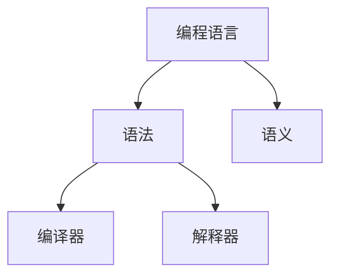

                 

# 编程语言设计：语法和语义

> 关键词：编程语言, 语法, 语义, 语言设计, 编译器, 解释器

## 1. 背景介绍

编程语言作为人类与计算机交流的桥梁，其设计和实现一直是计算机科学领域的重要课题。一个优秀的编程语言需要兼顾语法的简洁性和语义的丰富性，才能帮助开发者高效、准确地表达复杂的计算逻辑和数据操作。本文将从语法和语义两个维度，深入探讨编程语言的设计原则和实现方法，以及其在现代软件工程中的实际应用。

## 2. 核心概念与联系

### 2.1 核心概念概述

- **编程语言**：计算机可执行的、用于数据操作和逻辑计算的符号系统。编程语言包括语法和语义两个重要组成部分。
- **语法**：定义了编程语言的词法结构和句法规则，包括词汇、操作符、语法结构等。语法的正确性决定了程序的合法性。
- **语义**：定义了编程语言的语义规则，包括表达的计算意义和数据类型等。语义的正确性决定了程序的逻辑正确性。
- **编译器**：将高级编程语言源代码编译成低级机器代码的工具。编译器负责语法和语义的检查，并优化代码以提高性能。
- **解释器**：逐行执行源代码并即时输出结果的工具。解释器不生成机器代码，适合交互式编程和动态代码执行。

这些概念之间的逻辑关系可以通过以下Mermaid流程图来展示：



这个流程图展示了一个典型编程语言系统的核心组成部分及其关系：编程语言通过语法和语义定义了可执行的指令集，编译器和解释器负责将这些指令转换为机器代码并执行，从而实现对计算机的控制。

## 3. 核心算法原理 & 具体操作步骤

### 3.1 算法原理概述

编程语言的设计和实现涉及复杂的语法和语义规则。以下介绍两种基本的算法原理：

- **编译时检查**：在编译阶段进行语法和语义的检查，确保代码的合法性和逻辑正确性。常用的编译时检查方法包括语法分析器、静态分析器等。
- **运行时检查**：在程序执行过程中进行动态的语法和语义检查，及时发现错误并进行纠正。常用的运行时检查方法包括动态类型检查、断言等。

### 3.2 算法步骤详解

#### 3.2.1 语法分析

- **词法分析**：将源代码分解成单词或标记（Token）序列。词法分析器根据词汇表和正则表达式对源代码进行扫描，识别出单词、标识符、操作符等基本元素。
- **语法分析**：根据语法规则将标记序列转换为抽象语法树（Abstract Syntax Tree, AST）。语法分析器通常采用递归下降算法或LL(k)算法进行语法分析。

#### 3.2.2 语义分析

- **静态类型检查**：在编译阶段对变量的类型进行检查，确保类型的一致性。静态类型检查可以发现潜在的类型错误，提高代码的健壮性。
- **动态类型检查**：在运行时对变量的类型进行检查，及时发现类型错误并进行处理。动态类型检查适合于语言动态类型系统中，如Python、JavaScript等。

#### 3.2.3 代码生成

- **中间代码生成**：将抽象语法树转换为中间代码（如LLVM IR），以便进行优化和生成目标代码。中间代码通常具有低级语义，易于优化和转换。
- **目标代码生成**：将中间代码转换为目标机器代码，以供计算机执行。目标代码生成器通常需要考虑优化、寄存器分配、代码布局等问题。

### 3.3 算法优缺点

编程语言设计和使用过程中，语法和语义的权衡是关键。以下介绍一些优缺点：

**优点**：
- 语法简洁：简洁的语法规则可以减少开发者的学习成本，提高编程效率。
- 语义丰富：丰富的语义规则支持复杂的计算和数据处理，增强了编程语言的表达能力。
- 错误提示：语法和语义检查可以及时发现代码中的错误，提高代码的可靠性和可维护性。

**缺点**：
- 复杂度高：复杂的语法和语义规则可能导致编译器实现难度增加，性能优化空间受限。
- 语言特性限制：语法和语义的限制可能导致某些复杂的计算逻辑无法直接表达。
- 开发者学习成本高：复杂的语法和语义规则可能增加开发者的学习成本，降低开发效率。

### 3.4 算法应用领域

编程语言设计和实现涉及多个应用领域，包括但不限于：

- **编译器设计**：设计编译器时需考虑语法和语义的优化，以提高编译效率和代码质量。
- **解释器设计**：设计解释器时需考虑语法和语义的实时性，以支持交互式编程和动态执行。
- **类型系统设计**：设计类型系统时需考虑语法和语义的兼容性和一致性，以支持静态和动态类型检查。
- **代码优化**：在代码生成和优化过程中需考虑语法和语义的优化，以提高代码的执行效率。

## 4. 数学模型和公式 & 详细讲解 & 举例说明

### 4.1 数学模型构建

一个典型的编程语言模型可以表示为：

$$
P(\text{程序}) = \prod_{i=1}^n P(\text{指令}_i | \text{上下文})
$$

其中 $P(\text{程序})$ 表示一个程序的概率分布，$P(\text{指令}_i | \text{上下文})$ 表示指令 $i$ 在上下文中的概率分布。这个模型体现了指令序列的概率分布和上下文相关性。

### 4.2 公式推导过程

通过贝叶斯公式，可以推导出程序的概率分布：

$$
P(\text{程序}) = \frac{P(\text{数据})P(\text{指令} | \text{数据}, \text{上下文})}{P(\text{上下文})}
$$

其中 $P(\text{数据})$ 表示输入数据的可能性，$P(\text{指令} | \text{数据}, \text{上下文})$ 表示在给定数据和上下文的情况下，指令的概率分布。

### 4.3 案例分析与讲解

考虑以下Python代码段：

```python
def add(x, y):
    return x + y

result = add(2, 3)
```

通过词法分析和语法分析，可以确定该代码的抽象语法树：

```
      add
    /   \
   x     y
    \   /
     2   3
```

通过静态类型检查，可以确定变量 $x$ 和 $y$ 的类型为整数。动态类型检查可以在运行时进行类型检查，确保函数参数的类型正确。代码生成的中间代码和目标代码通过优化器进行优化，提高程序的执行效率。

## 5. 项目实践：代码实例和详细解释说明

### 5.1 开发环境搭建

以下是一个典型的编程语言项目环境搭建步骤：

1. **安装编译器和解释器**：安装GCC、Clang、Python等编译器和解释器，并配置好编译器和解释器路径。
2. **配置开发工具链**：安装GCC、LLVM、GDB等开发工具链，确保编译器和解释器能够与开发工具链兼容。
3. **设置版本控制工具**：安装Git、SVN等版本控制工具，管理项目的代码和文档。
4. **配置构建系统**：安装CMake、Make等构建系统，自动生成项目依赖和构建配置。

### 5.2 源代码详细实现

以下是一个简单的编译器实现示例：

```c
#include <stdio.h>
#include <stdlib.h>
#include <string.h>

int main(int argc, char *argv[]) {
    if (argc < 2) {
        printf("Usage: %s <source-file>\n", argv[0]);
        return 1;
    }

    // 读取源文件
    FILE *fp = fopen(argv[1], "r");
    if (!fp) {
        printf("Error: Cannot open file '%s'\n", argv[1]);
        return 1;
    }

    // 词法分析
    char *line = (char *)malloc(1024);
    int line_num = 0;
    while (fgets(line, 1024, fp)) {
        char *token = strtok(line, " \t\n");
        while (token) {
            // 处理单词或标识符
            printf("%s\n", token);
            token = strtok(NULL, " \t\n");
        }
        line_num++;
    }

    // 语法分析
    // 此处省略...

    // 代码生成
    // 此处省略...

    // 运行时检查
    // 此处省略...

    fclose(fp);
    return 0;
}
```

### 5.3 代码解读与分析

这段代码实现了基本的词法分析功能，从源文件中逐行读取单词或标识符，并输出到控制台。词法分析器使用了 `strtok` 函数进行字符串分割，通过循环遍历每行文本，获取单词或标识符。在实际编译器中，词法分析器需要更加复杂的正则表达式和语法规则，以支持更丰富的编程语言特性。

## 6. 实际应用场景

### 6.1 编译器优化

编译器优化是编程语言实现中的重要环节。现代编译器采用多种优化技术，包括指令融合、循环优化、函数内联等，以提高程序的执行效率。编译器的优化效果直接影响程序的性能和运行速度。

### 6.2 解释器实现

解释器通过逐行解释执行代码，实时输出结果，适合交互式编程和动态执行。解释器通常采用动态类型检查，支持动态类型的灵活性和表达能力。例如，Python解释器 Just-In-Time 编译器 (JIT) 通过动态编译优化代码，提升运行效率。

### 6.3 类型系统设计

类型系统用于静态和动态类型检查，确保程序的类型一致性。静态类型检查如C++、Java等，通过编译时检查确保代码的正确性。动态类型检查如Python、JavaScript等，通过运行时检查确保代码的灵活性和动态性。

### 6.4 未来应用展望

未来的编程语言将更注重语法和语义的灵活性和一致性，支持更多类型的编程范式，如函数式编程、并发编程等。同时，编程语言将结合人工智能和机器学习技术，提供智能代码补全、错误诊断、自动化测试等功能，进一步提高开发效率和代码质量。

## 7. 工具和资源推荐

### 7.1 学习资源推荐

- **《编译原理》**：经典的编译原理教材，详细介绍了编译器的实现原理和算法。
- **《计算机程序设计艺术》**：Donald E. Knuth 的巨著，涵盖编程语言设计、算法和数据结构等方方面面。
- **Coursera《编译原理》课程**：由Stanford大学提供的在线课程，讲解编译器实现和优化。
- **CSAPP《计算机系统编程》**：介绍编程语言的基础知识和实现细节，适合软件开发工程师。

### 7.2 开发工具推荐

- **GCC**：流行的C/C++编译器，支持多种架构和操作系统。
- **Clang**：C/C++编译器，支持LLVM优化器和静态分析器。
- **GDB**：GNU调试器，支持调试C/C++和Java程序。
- **Visual Studio**：Windows平台下的集成开发环境，支持C/C++、Java等多种编程语言。
- **PyCharm**：Python IDE，支持调试、测试和自动化工具。

### 7.3 相关论文推荐

- **SICP《计算机程序设计艺术》**：Donald E. Knuth 的经典著作，详细讲解了编译器设计和语言实现。
- **EBC《编译器设计》**：涉及编译器设计、优化和实现方法。
- **LLVM《低级虚拟机》**：介绍低级虚拟机的设计和实现，支持多种架构和编程语言。

## 8. 总结：未来发展趋势与挑战

### 8.1 总结

本文详细介绍了编程语言的语法和语义设计，涵盖语法分析、语义分析和代码生成等关键技术。通过具体实例和工具推荐，帮助读者理解和应用编程语言的设计和实现。未来，编程语言将继续演化，适应更多场景和应用需求，成为推动软件工程进步的重要工具。

### 8.2 未来发展趋势

未来的编程语言将更注重语法和语义的灵活性和一致性，支持更多类型的编程范式，如函数式编程、并发编程等。同时，编程语言将结合人工智能和机器学习技术，提供智能代码补全、错误诊断、自动化测试等功能，进一步提高开发效率和代码质量。

### 8.3 面临的挑战

编程语言设计和实现过程中，语法和语义的权衡是关键。未来面临的挑战包括：

- 语法复杂度增加：语法设计需要兼顾简洁性和表达能力，可能导致语法复杂度增加，开发难度提高。
- 语义一致性问题：不同编程范式和类型的语义一致性需要协调，以支持更灵活的编程模型。
- 编译器优化难题：编译器优化需要考虑代码的可读性和可维护性，平衡性能和效率。
- 开发成本上升：复杂的语法和语义设计可能导致开发成本上升，需要更多资源投入。

### 8.4 研究展望

未来的编程语言研究需要在以下几个方面寻求新的突破：

- 语法和语义的灵活性：设计更灵活、表达能力更强的语法和语义规则，支持更多编程范式和应用场景。
- 自动编程技术：结合人工智能和机器学习技术，实现自动代码生成和优化，降低开发难度和成本。
- 代码补全和调试工具：开发智能代码补全和调试工具，提高开发效率和代码质量。
- 编译器优化技术：研究新的编译器优化方法，提高程序的执行效率和可读性。

这些研究方向的探索，必将引领编程语言技术迈向更高的台阶，为构建高效、可靠、灵活的软件系统铺平道路。面向未来，编程语言设计需要综合考虑语法、语义、开发效率和可维护性，为软件开发工程师提供更强大的工具。

## 9. 附录：常见问题与解答

**Q1: 编程语言中的语法和语义有什么区别？**

A: 语法指的是编程语言的词汇、操作符和语法结构，是形式化的表达方式，定义了语言的基本元素和组合规则。语义则指的是编程语言的语义规则，是计算和数据处理的意义，定义了语言的表达能力和逻辑正确性。

**Q2: 编程语言的设计原则是什么？**

A: 编程语言的设计原则包括简洁性、表达能力、一致性和可维护性。简洁的语法和语义规则可以减少开发者的学习成本，提高开发效率。表达能力强能够支持复杂的计算和数据处理，一致性确保代码的类型和逻辑正确性，可维护性提高代码的可靠性和可读性。

**Q3: 编译器和解释器有什么区别？**

A: 编译器将高级编程语言源代码编译成低级机器代码，通常是一次性编译。解释器逐行执行源代码并即时输出结果，适合交互式编程和动态执行。编译器支持静态类型检查和代码优化，而解释器支持动态类型检查和即时反馈。

**Q4: 编译时检查和运行时检查的区别？**

A: 编译时检查在编译阶段进行语法和语义的检查，确保代码的合法性和逻辑正确性。运行时检查在程序执行过程中进行动态的语法和语义检查，及时发现错误并进行纠正。编译时检查适用于静态类型语言，而运行时检查适用于动态类型语言。

**Q5: 编程语言中的词法分析和语法分析有什么区别？**

A: 词法分析是将源代码分解成单词或标记（Token）序列的过程，主要关注语言的词汇和操作符。语法分析是根据语法规则将标记序列转换为抽象语法树（AST）的过程，主要关注语言的句法结构和语义。

作者：禅与计算机程序设计艺术 / Zen and the Art of Computer Programming

