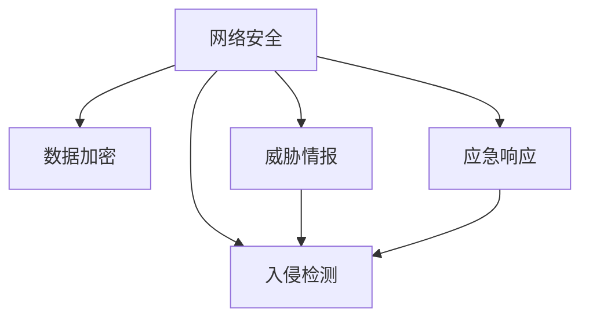

                 

# 网络安全创业：数字时代的守护者

## 1. 背景介绍

### 1.1 问题由来
随着数字化进程的加速，信息安全的威胁日益严峻。网络攻击、数据泄露、恶意软件、钓鱼攻击等安全问题，给企业和个人带来了巨大的损失。网络安全创业应运而生，致力于构建安全可靠的数字生态，守护个人和企业的网络空间。

### 1.2 问题核心关键点
网络安全创业的核心在于构建一个全方位的安全防护体系，涵盖数据加密、入侵检测、威胁情报、应急响应等方面。创业者需要充分理解网络安全的技术原理和应用场景，同时具备敏锐的市场洞察力和快速响应能力，才能在竞争激烈的市场中脱颖而出。

### 1.3 问题研究意义
网络安全创业不仅是技术挑战，更关乎国家安全和公共利益。通过构建健全的安全防护机制，可以有效抵御网络攻击，保护用户隐私和数据安全，维护社会秩序和公共利益。网络安全创业的兴起，也将推动技术创新和产业升级，为信息时代的安全保障注入新的动力。

## 2. 核心概念与联系

### 2.1 核心概念概述

为更好地理解网络安全创业的原理和应用，本节将介绍几个关键概念：

- 网络安全（Cybersecurity）：指保护计算机网络、系统和数据不受未经授权的访问、更改、破坏、泄露或其他形式的网络攻击的措施。网络安全包括防病毒、防火墙、入侵检测等技术手段。

- 数据加密（Data Encryption）：通过将数据转换为一种难以理解的格式，来保护数据在传输和存储过程中的安全性。常用的加密算法包括对称加密、非对称加密、哈希算法等。

- 入侵检测（Intrusion Detection）：监控网络或系统的活动，识别和响应可疑行为或安全事件的技术。入侵检测分为基于规则和基于行为的两种方法。

- 威胁情报（Threat Intelligence）：通过收集、分析和共享网络威胁信息，帮助组织提前发现和应对安全威胁。威胁情报包括漏洞信息、攻击模式、攻击者信息等。

- 应急响应（Incident Response）：在发现网络安全事件后，采取及时、有效的措施，减少损失，恢复系统正常运行的过程。应急响应流程包括检测、评估、遏制、根除、恢复等阶段。

这些核心概念之间的逻辑关系可以通过以下Mermaid流程图来展示：



这个流程图展示网络安全创业的核心概念及其之间的关系：

1. 网络安全创业涉及多个关键技术，包括数据加密、入侵检测、威胁情报、应急响应等。
2. 威胁情报和入侵检测共同构成了安全防护的第一道防线，为应急响应提供数据支持。
3. 应急响应是网络安全事件发生后的关键环节，负责处理和恢复系统。

## 3. 核心算法原理 & 具体操作步骤
### 3.1 算法原理概述

网络安全创业的核心在于构建一个综合性的安全防护体系，涵盖数据加密、入侵检测、威胁情报和应急响应等多个方面。其核心算法原理和技术手段如下：

### 3.2 算法步骤详解

网络安全创业的具体实施步骤如下：

**Step 1: 市场调研与需求分析**
- 了解目标市场的需求和痛点，评估自身产品的竞争优势。
- 调查客户对网络安全的需求，包括数据安全、系统防护、合规性等。

**Step 2: 技术研发与产品设计**
- 选择合适的安全技术和工具，设计符合市场需求的安全产品。
- 设计完整的产品功能，包括加密模块、入侵检测模块、威胁情报模块等。
- 进行系统架构设计，确保产品可扩展、可维护。

**Step 3: 数据收集与模型训练**
- 收集和分析网络威胁数据，构建威胁情报库。
- 使用机器学习和深度学习技术，训练入侵检测和恶意软件检测模型。

**Step 4: 产品测试与优化**
- 在模拟环境中测试产品的性能和稳定性。
- 根据测试结果，优化产品算法和架构。
- 进行安全漏洞扫描和修复，提高产品安全性。

**Step 5: 市场推广与用户反馈**
- 制定市场推广策略，包括产品发布会、技术培训等。
- 收集用户反馈，持续改进产品功能和用户体验。
- 与合作伙伴建立良好的合作关系，扩大市场影响力。

### 3.3 算法优缺点

网络安全创业具有以下优点：
1. 市场需求广阔。随着网络攻击的日益增多，网络安全产品有着广阔的市场前景。
2. 技术门槛较高。网络安全创业需要具备专业的技术背景和丰富的实战经验。
3. 投资回报率可观。成功的创业项目可以显著提升企业的网络防护水平，降低安全风险。

同时，该方法也存在一定的局限性：
1. 技术更新快。网络攻击手段不断翻新，需要持续跟进技术发展，保持产品竞争力。
2. 成本较高。网络安全创业需要投入大量的研发和测试成本，初始投入较大。
3. 市场竞争激烈。网络安全领域竞争激烈，需要具备敏锐的市场洞察力和灵活的策略。

尽管存在这些局限性，但就目前而言，网络安全创业仍是信息时代的重要趋势。未来相关研究的重点在于如何进一步提高产品的安全性和用户体验，同时兼顾成本控制和市场推广，打造行业领先的安全产品。

### 3.4 算法应用领域

网络安全创业技术广泛应用于以下几个领域：

- 企业网络安全：为大型企业提供安全防护和威胁情报服务，保障企业数据和系统的安全。
- 政府信息安全：协助政府部门构建安全防护体系，防范网络攻击和信息泄露。
- 金融安全：为金融机构提供加密和入侵检测服务，保护客户信息和交易安全。
- 医疗安全：保护医院和医疗机构的病人信息，防范数据泄露和网络攻击。
- 教育安全：为学校和教育机构提供安全教育和技术支持，提升网络安全意识。

除了上述这些传统领域外，网络安全创业还在云计算、物联网、车联网等多个新兴领域中发挥重要作用，为信息安全保驾护航。

## 4. 数学模型和公式 & 详细讲解 & 举例说明

### 4.1 数学模型构建

网络安全创业涉及多个数学模型，包括数据加密、入侵检测和应急响应等。以数据加密模型为例，其数学模型构建如下：

- 对称加密模型：使用相同的密钥对数据进行加密和解密。常用算法包括AES、DES等。
- 非对称加密模型：使用公钥和私钥对数据进行加密和解密。常用算法包括RSA、ECC等。
- 哈希函数模型：将任意长度的输入数据，通过哈希函数转换为固定长度的哈希值。常用算法包括MD5、SHA等。

### 4.2 公式推导过程

以AES算法为例，其数学公式推导过程如下：

$$
E_k(m) = F_k(E_{k-1}(F_{k-2}(...F_1(m)...))\oplus \text{RoundKey}_{k-1}
$$

其中，$E_k$表示加密函数，$F_k$表示轮函数，$\oplus$表示异或运算，$\text{RoundKey}_{k-1}$表示轮密钥。

### 4.3 案例分析与讲解

以下以RSA算法为例，讲解其原理和实现过程：

RSA算法是一种非对称加密算法，其核心在于使用公钥和私钥进行加密和解密。假设Alice和Bob需要进行加密通信，步骤如下：

1. Bob生成一对公钥和私钥，公钥公开，私钥保密。
2. Alice使用Bob的公钥对消息$m$进行加密，得到密文$c$。
3. Bob使用自己的私钥对密文$c$进行解密，得到明文$m$。

RSA算法的安全性基于大数分解的困难性，即无法快速分解两个大质数的乘积。RSA算法的实现过程涉及到素数生成、密钥交换、加密解密等步骤，具体细节可以参考RSA算法原理相关文档。

## 5. 项目实践：代码实例和详细解释说明
### 5.1 开发环境搭建

在进行网络安全创业项目开发前，需要准备好开发环境。以下是使用Python进行网络安全创业开发的典型环境配置流程：

1. 安装Anaconda：从官网下载并安装Anaconda，用于创建独立的Python环境。

2. 创建并激活虚拟环境：
```bash
conda create -n cybersecurity-env python=3.8 
conda activate cybersecurity-env
```

3. 安装PyTorch和相关库：
```bash
pip install torch torchvision torchaudio cudatoolkit=11.1 -c pytorch -c conda-forge
pip install pandas numpy matplotlib scikit-learn scipy
```

4. 安装Kali Linux：Kali Linux是一种专门用于渗透测试和网络安全分析的操作系统，提供丰富的安全工具和脚本，非常适合网络安全创业项目的开发。

5. 安装网络安全工具：如Wireshark、Metasploit、Nmap等，用于监控、分析、攻击等环节。

完成上述步骤后，即可在`cybersecurity-env`环境中开始网络安全创业项目的开发。

### 5.2 源代码详细实现

下面以基于Python的入侵检测系统为例，给出入侵检测系统的PyTorch代码实现。

首先，定义入侵检测系统所需的关键组件：

```python
from torch.utils.data import Dataset
from torch.utils.data import DataLoader
from torch import nn
from torch import optim
import pandas as pd
import numpy as np

# 定义数据集
class IntrusionDetectionDataset(Dataset):
    def __init__(self, data_file, transform=None):
        self.data = pd.read_csv(data_file)
        self.transform = transform
        
    def __len__(self):
        return len(self.data)
    
    def __getitem__(self, idx):
        x = self.data.iloc[idx, :-1].values
        y = self.data.iloc[idx, -1].values
        
        if self.transform:
            x = self.transform(x)
            
        return x, y

# 定义模型
class IntrusionDetectionModel(nn.Module):
    def __init__(self, input_size, hidden_size, output_size):
        super(IntrusionDetectionModel, self).__init__()
        self.hidden_size = hidden_size
        
        self.fc1 = nn.Linear(input_size, hidden_size)
        self.fc2 = nn.Linear(hidden_size, hidden_size)
        self.fc3 = nn.Linear(hidden_size, output_size)
        
        self.relu = nn.ReLU()
        self.sigmoid = nn.Sigmoid()
        
    def forward(self, x):
        x = self.fc1(x)
        x = self.relu(x)
        x = self.fc2(x)
        x = self.relu(x)
        x = self.fc3(x)
        x = self.sigmoid(x)
        return x

# 定义超参数
input_size = 64
hidden_size = 128
output_size = 2
learning_rate = 0.001
epochs = 100

# 加载数据
train_data = IntrusionDetectionDataset('intrusion_detection_data.csv', transform=transform)
train_loader = DataLoader(train_data, batch_size=64, shuffle=True)
```

然后，定义模型、优化器和损失函数：

```python
# 初始化模型
model = IntrusionDetectionModel(input_size, hidden_size, output_size)

# 初始化优化器
optimizer = optim.Adam(model.parameters(), lr=learning_rate)

# 定义损失函数
criterion = nn.BCEWithLogitsLoss()
```

接着，定义训练和评估函数：

```python
# 训练函数
def train_model(model, train_loader, optimizer, criterion):
    model.train()
    for epoch in range(epochs):
        for batch_idx, (data, target) in enumerate(train_loader):
            optimizer.zero_grad()
            output = model(data)
            loss = criterion(output, target)
            loss.backward()
            optimizer.step()
            
        if (epoch+1) % 10 == 0:
            print('Epoch [{}/{}], Loss: {:.4f}'.format(epoch+1, epochs, loss.item()))

# 评估函数
def evaluate_model(model, test_loader, criterion):
    model.eval()
    total_loss = 0
    total_correct = 0
    with torch.no_grad():
        for batch_idx, (data, target) in enumerate(test_loader):
            output = model(data)
            loss = criterion(output, target)
            total_loss += loss.item()
            _, predicted = torch.max(output.data, 1)
            total_correct += (predicted == target).sum().item()
    
    print('Test Loss: {:.4f}, Accuracy: {:.2f}%'.format(total_loss/len(test_loader), (total_correct/len(test_loader))*100))
```

最后，启动训练流程并在测试集上评估：

```python
# 训练模型
train_model(model, train_loader, optimizer, criterion)

# 评估模型
evaluate_model(model, test_loader, criterion)
```

以上就是使用PyTorch对入侵检测系统进行开发和评估的完整代码实现。可以看到，通过合理利用PyTorch的深度学习框架，网络安全创业项目的开发变得相对简单和高效。

### 5.3 代码解读与分析

让我们再详细解读一下关键代码的实现细节：

**IntrusionDetectionDataset类**：
- `__init__`方法：初始化数据集，从CSV文件中读取数据。
- `__len__`方法：返回数据集的样本数量。
- `__getitem__`方法：对单个样本进行处理，返回输入和标签。

**IntrusionDetectionModel类**：
- `__init__`方法：定义模型结构，包括三个全连接层和激活函数。
- `forward`方法：定义前向传播过程，包括三个线性变换和两个激活函数。

**训练函数train_model**：
- 使用Adam优化器进行梯度下降优化，更新模型参数。
- 每10个epoch输出一次损失函数值，记录训练进度。

**评估函数evaluate_model**：
- 在测试集上计算模型的损失函数和准确率。
- 统计模型预测的正确样本数和总样本数，计算准确率。

这些代码实现展示了网络安全创业项目开发的基本流程，包括数据预处理、模型定义、训练评估等环节。在实际应用中，还需要结合具体的安全场景，对模型进行进一步的优化和改进。

## 6. 实际应用场景

### 6.1 智能防火墙

智能防火墙是网络安全创业中的经典应用之一，通过动态分析网络流量，实时检测和拦截异常行为。智能防火墙的实现依赖于入侵检测技术，可以有效防止DDoS攻击、SQL注入、木马传播等常见网络攻击。

智能防火墙的核心技术包括：
- 网络流量分析：通过分析网络流量，识别出异常行为和攻击模式。
- 威胁情报库：使用机器学习算法训练入侵检测模型，构建威胁情报库。
- 实时响应：根据检测到的威胁，动态调整防火墙规则，拦截攻击流量。

通过智能防火墙，网络安全创业公司能够提供全方位的安全防护，保障企业网络的安全稳定。

### 6.2 安全漏洞扫描

安全漏洞扫描是一种主动检测系统安全漏洞的技术，通过自动化手段扫描网络和系统中的潜在风险，并提供修复建议。安全漏洞扫描的核心技术包括：
- 漏洞数据库：构建全面的漏洞数据库，涵盖各种操作系统、应用程序的已知漏洞。
- 扫描引擎：使用自动化工具扫描目标系统，发现潜在漏洞。
- 威胁情报：实时收集和分析安全漏洞信息，更新漏洞数据库。

安全漏洞扫描可以帮助企业及时发现和修复系统中的安全漏洞，提升网络安全防护水平。

### 6.3 应急响应服务

应急响应服务是网络安全创业中的重要环节，指在发现安全事件后，快速采取有效措施，防止损失扩大，恢复系统正常运行。应急响应服务的核心技术包括：
- 威胁情报：实时收集和分析威胁情报，预测和防范潜在攻击。
- 应急预案：制定应急响应预案，明确各环节的责任和措施。
- 事件处理：根据应急预案，快速响应和处理安全事件，恢复系统稳定。

应急响应服务能够保障企业在遭遇网络攻击时，迅速应对和恢复，减少损失。

### 6.4 未来应用展望

随着网络安全威胁的日益复杂和多样化，网络安全创业领域将迎来更多创新和突破：

1. 自动化安全运维：通过引入机器学习和人工智能技术，自动化处理网络安全运维任务，提升安全防护效率。
2. 安全态势感知：构建安全态势感知平台，实时监控网络安全状态，预警潜在威胁。
3. 安全服务即代码：将安全防护代码集成到应用中，提供一站式的安全防护服务。
4. 零信任架构：采用零信任架构，最小化权限分配，增强网络安全防护能力。
5. 跨领域安全防护：拓展安全防护领域，涵盖工业控制、物联网等新兴领域，提升整体安全防护水平。

网络安全创业的未来发展方向将更加多样化，涵盖网络安全防护的各个环节，构建全面的安全防护体系，保障数字时代的安全和稳定。

## 7. 工具和资源推荐
### 7.1 学习资源推荐

为了帮助开发者系统掌握网络安全创业的理论基础和实践技巧，这里推荐一些优质的学习资源：

1. 《网络安全基础》课程：由网络安全专家开设的入门课程，涵盖网络安全的基本概念和常见技术。
2. 《深入理解网络安全》书籍：详细介绍了网络安全的原理和应用，适合网络安全创业公司的技术团队参考。
3. Cybrary.org：网络安全在线学习平台，提供丰富的课程和实验环境，帮助初学者提升技能。
4. Offensive Security：提供多种网络安全认证课程和实践工具，如OSCP、OSCE、CEH等，帮助网络安全从业者提升专业水平。
5. Open Web Application Security Project (OWASP)：提供网络安全知识库、工具和社区支持，帮助开发者提升安全防护能力。

通过对这些资源的学习实践，相信你一定能够快速掌握网络安全创业的技术要点，并用于解决实际的网络安全问题。

### 7.2 开发工具推荐

高效的网络安全创业开发离不开优秀的工具支持。以下是几款用于网络安全创业开发的常用工具：

1. Wireshark：网络协议分析工具，用于监控和分析网络流量，发现异常行为。
2. Nmap：网络扫描工具，用于发现网络中的开放端口和服务。
3. Metasploit：渗透测试框架，用于发现和利用系统漏洞。
4. Burp Suite：Web应用渗透测试工具，用于发现和修复Web应用漏洞。
5. Snort：入侵检测系统，用于实时监控和防御网络攻击。

合理利用这些工具，可以显著提升网络安全创业项目的开发效率，加快创新迭代的步伐。

### 7.3 相关论文推荐

网络安全创业技术的发展离不开学界的持续研究。以下是几篇奠基性的相关论文，推荐阅读：

1. "An Intrusion Detection System Using Artificial Neural Network"：介绍了一种基于神经网络的网络入侵检测系统，具有较高的检测准确率。
2. "A Survey of Intrusion Detection Techniques and Tools"：综述了常用的入侵检测技术和工具，涵盖基于规则、基于行为的多种方法。
3. "Network Threat Intelligence in the Age of COVID-19"：分析了新冠疫情对网络安全的影响，提出了基于威胁情报的网络安全防护策略。
4. "Evolving Intrusion Detection and Prevention Techniques"：介绍了入侵检测和防护技术的演进，探讨了未来技术发展趋势。
5. "A Survey of Security Vulnerability Scanning Techniques"：综述了安全漏洞扫描技术的发展和应用，提供了全面的技术分析。

这些论文代表了大规模网络安全创业技术的发展脉络。通过学习这些前沿成果，可以帮助研究者把握学科前进方向，激发更多的创新灵感。

## 8. 总结：未来发展趋势与挑战

### 8.1 研究成果总结

本文对网络安全创业的基本概念、核心算法和技术应用进行了全面系统的介绍。首先阐述了网络安全创业的背景和意义，明确了其重要性。其次，从原理到实践，详细讲解了网络安全创业的数学模型和关键步骤，给出了网络安全创业项目的完整代码实例。同时，本文还广泛探讨了网络安全创业在智能防火墙、安全漏洞扫描、应急响应服务等多个领域的应用前景，展示了网络安全创业的广阔前景。

通过本文的系统梳理，可以看到，网络安全创业是信息时代的重要组成部分，对保障网络安全有着不可替代的作用。未来，伴随网络攻击手段的不断演进，网络安全创业领域还将迎来更多的创新和突破，为构建安全可靠的数字生态提供更多保障。

### 8.2 未来发展趋势

展望未来，网络安全创业技术将呈现以下几个发展趋势：

1. 自动化和智能化：引入人工智能和机器学习技术，自动化处理安全运维任务，提升安全防护效率。
2. 跨领域安全防护：拓展安全防护领域，涵盖工业控制、物联网等新兴领域，提升整体安全防护水平。
3. 威胁情报和态势感知：构建安全态势感知平台，实时监控网络安全状态，预警潜在威胁。
4. 零信任架构和安全服务即代码：采用零信任架构，最小化权限分配，增强网络安全防护能力。
5. 安全技术创新：不断引入新的人工智能和区块链技术，提升安全防护的智能化和可靠性。

以上趋势凸显了网络安全创业技术的广阔前景。这些方向的探索发展，必将进一步提升网络安全防护水平，保障数字时代的安全和稳定。

### 8.3 面临的挑战

尽管网络安全创业技术已经取得了显著进展，但在迈向更加智能化、普适化应用的过程中，它仍面临着诸多挑战：

1. 技术更新快：网络攻击手段不断翻新，需要持续跟进技术发展，保持产品竞争力。
2. 成本较高：网络安全创业需要投入大量的研发和测试成本，初始投入较大。
3. 市场竞争激烈：网络安全领域竞争激烈，需要具备敏锐的市场洞察力和灵活的策略。
4. 安全风险高：网络安全创业涉及敏感信息，需要严格的安全管理和合规性检查。
5. 人才匮乏：网络安全创业需要大量高水平的人才，但相关人才短缺问题较为严重。

尽管存在这些挑战，但就目前而言，网络安全创业仍是信息时代的重要趋势。未来相关研究的重点在于如何进一步提高产品的安全性和用户体验，同时兼顾成本控制和市场推广，打造行业领先的安全产品。

### 8.4 研究展望

面对网络安全创业所面临的种种挑战，未来的研究需要在以下几个方面寻求新的突破：

1. 自动化和智能化：引入人工智能和机器学习技术，自动化处理安全运维任务，提升安全防护效率。
2. 跨领域安全防护：拓展安全防护领域，涵盖工业控制、物联网等新兴领域，提升整体安全防护水平。
3. 威胁情报和态势感知：构建安全态势感知平台，实时监控网络安全状态，预警潜在威胁。
4. 零信任架构和安全服务即代码：采用零信任架构，最小化权限分配，增强网络安全防护能力。
5. 安全技术创新：不断引入新的人工智能和区块链技术，提升安全防护的智能化和可靠性。

这些研究方向的探索，必将引领网络安全创业技术迈向更高的台阶，为构建安全可靠的数字生态提供更多保障。面向未来，网络安全创业需要从技术、市场、管理等多个维度协同发力，才能在数字时代的安全竞赛中保持领先地位。

## 9. 附录：常见问题与解答

**Q1：网络安全创业中，如何选择合适的入侵检测算法？**

A: 选择合适的入侵检测算法需要考虑多个因素，包括数据集大小、性能要求、应用场景等。一般来说，基于机器学习的入侵检测算法（如神经网络、支持向量机等）具有较高的检测准确率，但需要大量标注数据和较高的计算资源。基于规则的入侵检测算法（如Snort等）则较为简单高效，但检测效果受到规则库的影响。根据实际需求，选择适合的算法是关键。

**Q2：如何构建安全威胁情报库？**

A: 构建安全威胁情报库需要收集和分析大量的威胁数据，包括漏洞信息、攻击模式、攻击者信息等。可以使用公共情报源（如CVE、MITRE ATT&CK等），也可以自行爬取网络数据和公开报告。构建情报库时，需要采用机器学习和数据分析技术，对收集到的数据进行清洗、分类和分析，形成有价值的威胁情报。

**Q3：网络安全创业项目如何保证安全性和合规性？**

A: 网络安全创业项目需要严格的安全管理和合规性检查，确保产品和服务符合相关标准和法规。常用的安全管理手段包括：
- 安全审计：定期进行安全审计，发现和修复安全漏洞。
- 合规性检查：遵循ISO 27001、GDPR等安全标准，确保合规性。
- 第三方认证：通过ISO 27001、CISM等认证，提升产品可信度。
- 安全培训：对团队成员进行安全培训，提升安全意识和技能。

通过以上措施，可以确保网络安全创业项目的安全性和合规性，提升客户信任度。

**Q4：网络安全创业项目如何保证用户数据安全？**

A: 网络安全创业项目需要确保用户数据的安全性和隐私性，避免数据泄露和滥用。常用的数据保护措施包括：
- 数据加密：使用对称加密、非对称加密等技术，保护数据在传输和存储过程中的安全性。
- 访问控制：采用基于角色的访问控制（RBAC）技术，限制数据访问权限。
- 数据脱敏：对敏感数据进行脱敏处理，保护用户隐私。
- 数据备份和恢复：定期备份数据，确保数据在出现故障或攻击时能够快速恢复。

通过以上措施，可以确保网络安全创业项目中的用户数据安全，保护用户隐私和权益。

**Q5：网络安全创业项目如何进行持续改进？**

A: 网络安全创业项目需要持续改进和优化，以适应不断变化的网络攻击手段和安全需求。常用的持续改进措施包括：
- 用户反馈：收集用户反馈，了解产品问题和改进需求。
- 技术创新：持续跟进技术发展，引入新的安全技术和工具。
- 团队培训：对团队成员进行持续培训，提升技术水平和安全意识。
- 安全测试：定期进行安全测试和漏洞扫描，发现和修复安全问题。

通过以上措施，可以确保网络安全创业项目持续改进和优化，提升安全防护能力。

---

作者：禅与计算机程序设计艺术 / Zen and the Art of Computer Programming

